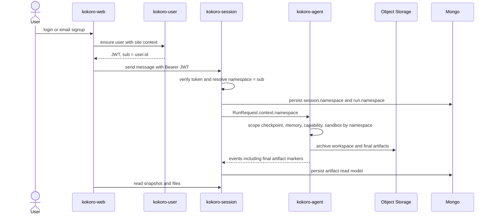

# 派工单:runtime namespace、能力、沙箱与最终产物下一阶段

状态: 2026-07-07 修订版  
用途: 取代旧派工单中的模糊项, 给后续 code agent 并行执行使用。  
依据:

- `docs/CURRENT.md`
- `docs/CODEBASE_MAP.md`
- `docs/kokoro-handbook/technical/17-namespace-runtime-isolation.md`
- `docs/kokoro-handbook/technical/18-capability-namespace-auth-sandbox-artifacts.md`

## 0. 先定边界

1. UI 设计暂缓。web 只保留已经提交的功能底座, 后续 UI 需要先做竞品调研和视觉基准, 再单独开设计/实现。
2. GA / kokoro-agent 只认 opaque `namespace`; 不加 `user:<id>`、`ownerId`、`userId`、`workspaceId` 第二轴。
3. `siteId` 是平台业务站点轴, 不能进入 GA runtime 隔离模型。
4. session list 属于 `kokoro-session` / web, 不派给 `kokoro-user`。
5. capability hub 是一个 registry 边界, 内部按 `skill` / `mcp` / `subagent` 分 kind; 不拆两套重复 namespace/启用态/registry。

## 1. 总时序



## 2. WP-0: session namespace/auth 持久化

优先级: P0, 最先执行。  
写入面: `kokoro-session`。  
不并行冲突: 可以和 WP-1 / WP-2 并行, 但 WP-3 依赖它。

目标:

- `AuthResult` 解析出 `{ ownerId, namespace }`。
- JWT 模式: `namespace = jwt.sub`。
- 本地直通模式: `namespace = local-user`。
- 创建 session/run 时持久化 namespace。
- relay/recover/snapshot/file read/workspace list 都从持久记录取 namespace。
- 不再让实例级 `KOKORO_NAMESPACE` 充当多用户 runtime 身份。

关键路径:

- `kokoro-session/src/http/auth.ts`
- `kokoro-session/src/http/server.ts`
- `kokoro-session/src/store/port.ts`
- `kokoro-session/src/store/mongo.ts`
- `kokoro-session/src/relay/start-message.ts`
- `kokoro-session/src/namespace/profile.ts`

验收:

- 两个不同 JWT `sub` 的 session workspace/file/snapshot 不串。
- refresh/recover 后 run 仍使用原 session namespace。
- 搜索不存在 `user:<` namespace 拼接。
- `npm test`, `npm run typecheck`, `npm run lint` 通过。

## 3. WP-1: agent capability/skill 按 namespace 动态 resolve

优先级: P1, 可与 WP-0 并行。  
写入面: `kokoro-agent`。  
依赖: GA contract 已有 `RuntimeContext.namespace`; 不需要给 GA 新增 user 字段。

目标:

- agent 启动期 skill 快照改为运行时按 namespace resolve。
- 支持从 registry metadata + object storage 读取 skill package 字节。
- resolve 失败可降级, 不应中断 run。
- 交付链仍落到沙箱 `/.skills/`。

关键路径:

- `kokoro-agent/src/kokoro_agent/content_source.py`
- `kokoro-agent/src/kokoro_agent/skills/package.py`
- `kokoro-agent/src/kokoro_agent/agents/assembly/pipeline.py`
- `kokoro-agent/src/kokoro_agent/tools/memory.py`

验收:

- 同一 skill id 在两个 namespace 下可解析到不同启用态或版本。
- namespace A 启用的 skill 不泄漏给 namespace B。
- `uv run ruff check .`, `uv run pyright`, `uv run pytest` 通过。

## 4. WP-2: remote sandbox archive + Daytona dev sandbox

优先级: P1, 可与 WP-1 并行。  
写入面: `kokoro-agent` + contract backend enum。  
目标: 开发沙箱走可自托管方向, 不把 E2B Cloud 当唯一闭环。

目标:

- 为 remote sandbox 补 list/read 后归档路径, 覆盖 E2B/Daytona 类远程后端。
- 新增 Daytona backend skeleton: exec, upload/read, start/stop/resume/delete。
- contract backend enum 增加 `daytona`。
- 本地 dev 可用 Daytona compose 跑 execute + 文件读写 + resume。

关键路径:

- `contract/spec/control.yaml`
- `kokoro-agent/src/kokoro_agent/sandbox/backend.py`
- `kokoro-agent/src/kokoro_agent/sandbox/e2b_backend.py`
- `kokoro-agent/src/kokoro_agent/sandbox/daytona_backend.py`
- `kokoro-agent/src/kokoro_agent/sandbox/archive.py`

验收:

- remote backend 产出的 workspace 文件可归档到对象存储。
- stop -> get/start 后文件仍可读。
- agent ruff/pyright/pytest 通过。

## 5. WP-3: final artifacts 合同与读模型

优先级: P1, WP-0 后开。  
写入面: `contract` + `kokoro-session` + `kokoro-agent`; web 展示后置。  
决策: agent 显式标记为主, web 用户 promote/demote 为辅, 目录约定只做启发式。

目标:

- contract 增加 final artifact 事件或现有事件 payload 扩展。
- agent 能显式标记一个 workspace file 为 final artifact。
- session 将 final artifact 记录入 Mongo read model。
- snapshot 或 artifact endpoint 提供 final artifacts 投影。
- 普通 workspace files 与 final artifacts 语义分开。

关键路径:

- `contract/spec/events.yaml`
- `contract/spec/http.yaml`
- `kokoro-agent/src/kokoro_agent/execution/events.py`
- `kokoro-agent/src/kokoro_agent/tools/registry.py`
- `kokoro-session/src/store/port.ts`
- `kokoro-session/src/relay/relay-run.ts`
- `kokoro-session/src/http/server.ts`

验收:

- agent 标记的 artifact 可在 session snapshot/read endpoint 中稳定出现。
- 删除 session 时 artifact record 与 workspace 文件裁权一致。
- artifact 文件本体仍在对象存储, Mongo 只存 metadata/read model。
- contract 生成、session test/typecheck/lint、agent ruff/pyright/pytest 通过。

## 6. WP-4: platform site/user 最小配合

优先级: P2, 与 WP-0 协调。  
写入面: `kokoro-platform`, 但不把 session list 放进 platform。

目标:

- `kokoro-site` 提供 public product context 读投影: host/app/surface -> site/app/skin/content/featureFlags/seo。
- `kokoro-user` 或 auth facade 完成 email identity -> user -> personal team。
- JWT `sub = kokoro-user.User.id`; web 只保存 token; session 把 `sub` 持久化为 namespace。
- capability display 第一版只读 site feature flags 或 display stub, 不暴露 registry 内部结构。

关键路径:

- `kokoro-platform/kokoro-site/src/interfaces/http/routes.ts`
- `kokoro-platform/kokoro-site/prisma/schema.prisma`
- `kokoro-platform/kokoro-user/src/interfaces/http/routes.ts`
- `kokoro-platform/kokoro-user/prisma/schema.prisma`

暂时不做:

- 不把 `siteId` 当 namespace。
- 不把 session list 放进 `kokoro-user`。
- 不复用 admin Auth.js/magic-link 作为消费者 auth。
- 不把 capability hub 塞进 `kokoro-user`。
- 不让 web 直接读 raw Prisma row。

## 7. UI track 暂缓规则

UI 不是当前执行线。后续重启 UI 前必须先产出 `tmp/` 中间调研, 至少覆盖:

- Manus
- HIX
- Lessie
- 其他 3 到 5 个 AI agent / AI workspace 产品

调研只允许进入 `tmp/` 或 dated spec 草案。正式代码和正式 handbook 不写外部项目路径、分支名、逐字文案、类名或资产。

UI 重启前验收门槛:

- 先有视觉基准和反面清单。
- 再出组件/路由改造方案。
- 最后实现, 并用真实浏览器桌面/移动截图验收。

## 8. 推荐派发顺序

```text
第 1 组:
  WP-0 session namespace/auth 持久化

第 2 组, 可并行:
  WP-1 agent capability/skill resolve
  WP-2 remote sandbox archive + Daytona
  WP-4 platform site/user 最小配合

第 3 组:
  WP-3 final artifacts 合同与读模型

最后:
  UI research -> UI design -> web implementation
```

主控验收时不能只信 worker 输出。每个子仓必须在主仓重新运行对应验证命令。
