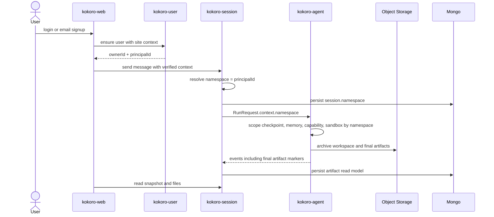

# 派工单:runtime namespace、能力、沙箱与最终产物下一阶段

状态: 2026-07-07 修订版  
用途: 取代旧派工单中的模糊项, 给后续 code agent 并行执行使用。  
人类评审入口: `docs/kokoro-handbook/technical/19-current-runtime-capability-review-plan.md`。本文只给 code agent 拆工作包, 不作为人类主读技术方案。
依据:

- `docs/CURRENT.md`
- `docs/CODEBASE_MAP.md`
- `docs/kokoro-handbook/technical/19-current-runtime-capability-review-plan.md`
- `docs/kokoro-handbook/technical/17-namespace-runtime-isolation.md`
- `docs/kokoro-handbook/technical/18-capability-namespace-auth-sandbox-artifacts.md`

## 0. 先定边界

1. UI 视觉实现排在能力和结构打底之后, 但 web 前端底座不能停: 先按 handbook 拆 ProductAppShell、TaskComposer、Auth surface、SettingsShell, 视觉细节等调研基准和截图评审后再细化。
2. platform/user 负责分配全局唯一 `principalId`; session 持久化 `namespace = principalId`; GA（kokoro-agent runtime）只认 opaque `namespace`。
3. `siteId` 是平台业务站点轴, 不能进入 GA runtime 隔离模型。
4. session list 属于 `kokoro-session` / web, 不派给 `kokoro-user`。
5. capability hub 是一个 registry 边界, V1 只覆盖 `skill` / `mcp`; 不拆两套重复 namespace/启用态/registry。DeepAgents graph 内部运行节点不是 capability kind, 不做 package 和 enablement。
6. dynamic skills 通过每次 run 的不可变 `RunCapabilityBinding`、agent 侧 `CapabilityResolver` / `ContextAssembler` 和稳定 list/read 工具闭环; 不让各运行节点自己追加 context。
7. 固定 skill 包放 MinIO/S3: skill zip、assets 等不可变大对象走 package_ref + content_hash; Mongo 只放 registry metadata、enablement 和索引字段。
8. MCP enabled names 由上游传入, agent 侧只暴露 Kokoro adapter tools: `mcp_list_tools` / `mcp_describe_tool` / `mcp_call`; 它们不是 MCP 协议方法名, 内部映射 `tools/list`、cache/schema 读取和 `tools/call`。
9. DeepAgents 是固定 agent runtime 底座; Kokoro 只在其上方编译能力、上下文和 cache contract, 不替换 `create_deep_agent`。
10. DeepAgents `system_prompt` 只能放稳定规则; 用户 task 进入持久 `HumanMessage`; 可选 `model_visible_runtime_note` 只在白名单触发时由 KokoroContextMiddleware 请求级注入, 不落 checkpoint。
11. active run 中的新用户消息是 steer, 不是新 run; 不重新 resolve capability, 不改当前 RunCapabilityBinding。
12. terminal 后的下一条用户消息、terminal_retry、regenerate 才创建新 `run_id`; 新 run 必须刷新 `scope.run_id`, resume/HITL/recover/retry_segment 才复用旧 scope。
13. `skill_read` / `mcp_describe_tool` 的长工具结果必须有 retention/压缩策略; 关闭或删除能力后, 下一 run 不能 replay 整段旧能力内容。
14. capability tools 的 run identity 优先来自本次 invoke 的 run context; 旧 checkpoint scope 只能用于 resume/recover, 且必须和 run ledger/request 校验一致。
15. 旧 MCP 动态工具注册和明文 headers 路径必须替换为 Kokoro MCP adapter + gateway-side `secret_ref`。

## 1. 总时序



## 2. WP-0: session namespace/auth 持久化

优先级: P0, 最先执行。  
写入面: `kokoro-session`。  
硬前置: 先单独完成并验收 WP-0。WP-1 / WP-2 / WP-3 / WP-4 合并前都必须以持久 `session.namespace` 契约为准。

目标:

- 已验证上下文解析出 `{ ownerId, principalId }`。
- session 持久化内部字段 `namespace = principalId`; public snapshot 不暴露 namespace。
- 本地直通模式: `namespace = local-user`。
- 创建 session 时持久化 namespace; run 不复制 namespace。
- relay/recover/snapshot/file read/workspace list 都通过 session_id 回到 session.namespace。
- 不再用进程级 namespace 做多用户 workspace/file key。
- 明确 run id 策略: 全局唯一 run_id + namespace/session 校验, 或 ledger/control/event key 统一包含 namespace。
- 不再让实例级 `KOKORO_NAMESPACE` 充当多用户 runtime 身份。

关键路径:

- `kokoro-session/src/http/auth.ts`
- `kokoro-session/src/http/server.ts`
- `kokoro-session/src/store/port.ts`
- `kokoro-session/src/store/mongo.ts`
- `kokoro-session/src/relay/start-message.ts`
- `kokoro-session/src/namespace/profile.ts`

验收:

- 两个不同 `principalId` 的 session workspace/file/snapshot 不串。
- refresh/recover 后 run 仍使用原 session namespace。
- 搜索不存在 `user:<` namespace 拼接。
- `npm test`, `npm run typecheck`, `npm run lint` 通过。

## 3. WP-1: capability resolve + MCP client + context assembly

优先级: P1, WP-0 完成后开。
写入面: `kokoro-agent`。  
依赖: agent runtime contract 已有 `RuntimeContext.namespace`; 不需要给 agent runtime 新增 user 字段。

目标:

- agent 启动期 skill 快照改为运行时按 `RunCapabilityInput` 生成 `RunCapabilityBinding`。
- 每个 run 生成不可变 RunCapabilityBinding: skill bindings、MCP server bindings、content_hash、package_cache。
- skill/MCP 启用、关闭、配额和 selection 由 user/session/capability 传 names; agent runtime 不做业务授权判断。
- `principal_skill_state.enabled` 表示可用池, 不表示每次 run 都自动进入 agent; `runtime.skills` 表示本次 run skill names。
- skill names 数量上限由 web/session/capability selection 层处理; agent runtime 不定义产品配额, 不把配额告诉模型。
- 新增 ContextAssembler 统一构造 GraphBundle、InvokeBundle、AuditBundle。
- GraphBundle: `static_system_prompt`、stable tools、agent graph config、capability tools、MCP client tools。
- InvokeBundle: 用户 task、initial files、可选 `model_visible_runtime_note`、ephemeral injection flag。
- AuditBundle: runtime/tool manifest、RunCapabilityBinding summary、cache keys、budget report; 默认 audit-only, 不给模型看。
- 新增 KokoroContextMiddleware: 用 `awrap_model_call` 在 note 非空时临时插入最新用户 task 之前, 不返回 state update, 不写 checkpoint。
- 固定 skill zip/assets 放 MinIO/S3; Mongo 只存 registry metadata、enablement、package_ref 和 content_hash。
- Mongo collection 至少拆成: `skill_registry`, `principal_skill_state`, `mcp_server_registry`, `principal_mcp_server_state`, `mcp_capability_cache`。
- registry/state/cache 统一软删除字段: `deleted_at`, `deleted_by`, `delete_reason`; runtime 查询默认只读 `deleted_at = null`。
- `skill_registry` 保留 public stable `name`、`source_type`、`read_only`、`required`、`file_count`、`package_size`; 前端只用 name 引用, 不暴露 package_ref/hash。
- 上传、导入、官方同步、runtime resolve 共用同一个 skill validator/parser。
- 支持从 registry metadata + object storage 读取 immutable skill package 字节。
- skill 包解析/读取单项失败可降级, 不应中断 run。
- skill 包按需读取/缓存; 沙箱或本地 cache 只是缓存, 不是能力包权威来源。
- agent 只消费上游传入的本 run skill/MCP names; 不把 namespace 下全量 skill/MCP 塞进 prompt。
- contract 先收窄 RunRequest: 只传本 run skill/MCP names/ref, 不传完整 package、MCP server config、MCP headers/token/key。
- agent ledger 持久化 request 前必须 scrub secret; 含 header/key/token 的 request_json 负向测试必须失败。
- 不把主体所有 enabled skills 自动合入 run; active set 只来自 entry required、product default、用户本轮 selected、runtime 显式 names, 再用 principal state 校验。
- run 内不做任意 hot append; 需要新增能力时记录 capability request, 下一轮由上游决定是否加入 enabled names。
- active run 中用户继续发消息走 steer, 只能影响当前 run 的自然语言指令, 不能改变本 run capability binding。
- active run 中 capability settings 变化只记录 pending change; 立即生效必须 cancel/restart 并创建新 run。
- dynamic skill 不通过 `create_deep_agent(skills=...)` 注入 DeepAgents Skills System; Kokoro 统一用 `skill_list` + `skill_read` 渐进披露。
- MCP 统一走 Kokoro adapter tools: `mcp_list_tools` + `mcp_describe_tool` + `mcp_call`; MCP tool list/schema 通过 client/gateway 动态查, 不把每个 MCP tool schema 都挂进 DeepAgents 工具面。
- 旧 `load_mcp_tools(runtime.mcp)` 只能作为 legacy/fixture; 正式路径不注册 `mcp__server__tool` 动态工具。
- RunRequest 不携带 MCP headers/token/key; MCP secret 只以 `secret_ref` 在 gateway 侧解析。
- MCP 按标准 primitive 处理: server 暴露 tools/resources/prompts, client/host 控制 roots/sampling/elicitation; resources/prompts 不进入 DeepAgents 稳定工具面。
- skill 包生命周期拆成 preview / publish / enablement / resolve / materialize; runtime 只消费本次 run skill names 和 registry 快照, 不拥有用户启用业务规则。
- `RunCapabilityBinding` 只存轻量引用和 hash, 不存完整包内容; SKILL.md 和辅助文件通过 `skill_read` lazy read。
- 新增 capability payload retention: terminal 后或下一 run 前压缩长 `skill_read` / `mcp_describe_tool` 工具结果, checkpoint 长期只留短审计摘要和 event ref。
- 新增 scope 回归测试: 同一 thread 新 run 会刷新 `scope.run_id`; HITL/resume/recover 不重供 scope 时复用当前 run scope。
- 新增 run identity 回归测试: 旧 checkpoint scope + 新 RunRequest 时, capability tool lookup 使用新 run identity 或 fail closed。
- 新增 direct-read 负向测试: session `/files/.skills/**`、sandbox file tools、archive 都不能读取或归档 capability cache。

关键路径:

- `kokoro-agent/src/kokoro_agent/content_source.py`
- `kokoro-agent/src/kokoro_agent/context/assembler.py`
- `kokoro-agent/src/kokoro_agent/capability/resolver.py`
- `kokoro-agent/src/kokoro_agent/capability/binding_store.py`
- `kokoro-agent/src/kokoro_agent/skills/package.py`
- `kokoro-agent/src/kokoro_agent/agents/assembly/pipeline.py`
- `kokoro-agent/src/kokoro_agent/tools/memory.py`

验收:

- 同一 skill name 在两个 namespace 下可得到不同 enabled/closed 结果或版本。
- namespace A active 的 skill 不泄漏给 namespace B。
- soft-deleted skill registry/state 不参与 active set; disabled state 能覆盖 default/collection enabled。
- 稳定输入重复 resolve 得到相同 RunCapabilityBinding。
- `skill_id + content_hash` 相同则包缓存复用; content_hash 改变则失效旧缓存; closed skill 从 active index 删除但不要求前台删除沙箱/cache 文件。
- 关闭后的 skill 即使沙箱目录残留, 也不能被 `skill_list` 列出或被 `skill_read` 读取。
- session `/files/.skills/**` 直接读取被拒绝, archive 不上传 capability cache。
- 改用户消息但不改能力集合时 DeepAgents `system_prompt` 不变; 无白名单触发时没有模型可见 runtime note; 有触发时 note 可见但不落 checkpoint。
- 工具描述不包含本次 active skills 全量列表; active skill 摘要只能通过 `skill_list` 工具结果出现。
- RuntimeNoteBuilder 输出必须过 allowlist validator; 禁止字段进入 note 时测试失败。
- 多轮后 checkpoint 中不累计旧 runtime note、retrieval candidates、workspace file index 或 RunCapabilityBinding summary。
- DeepAgents system prompt 中没有 Skills System 段; `SKILL.md` 正文不进 prompt。
- agent 通过 `skill_list` 查看 active skill, 再通过 `skill_read` 读取 active skill; inactive skill 读取失败并记录 denied event。
- active skill set 改变时, Kokoro 按新 RunCapabilityBinding 更新 `skill_list` / `skill_read` 可见性, 不依赖 DeepAgents `skills_metadata`。
- UI 的 `/skillName` 或 skill chip 必须同步结构化 selected names; 不能只把 slash 文本写进 prompt。
- required skill 不能被普通用户关闭覆盖; read_only skill 不能由当前 principal 替换、编辑或删除。
- MCP tool schema 不进 prompt; 只有通过 `mcp_describe_tool` 按需读取。
- 更换 MCP enabled names 不改变 DeepAgents 工具 schema。
- DeepAgents tool schema 不出现按 MCP server/tool 动态展开的工具名。
- runtime note / checkpoint / events / RunRequest 中没有 MCP header/token/key 明文。
- MCP tools/list 变化只刷新 `mcp_capability_cache`; disabled/soft-deleted MCP state 不可列出也不可调用。
- resume/HITL 重入不重新 resolve capability, 当前 run 的 RunCapabilityBinding 不变。
- active run steer 不重新 resolve capability; 带 skill/MCP chip 的 steer 只能产生 pending change 或触发 cancel/restart。
- 同一 session 终态后的新 run 会刷新工具层读取到的 `scope.run_id`。
- 长 capability tool output 不会在多轮 checkpoint 中无限累计; 关闭/删除能力后下一 run 不 replay 整段旧 skill/MCP schema。
- 若 DeepAgents graph 内部存在多个运行节点, 只能消费 ContextAssembler 分配的最小输入, 不能复制主 agent 全量 context。
- `uv run ruff check .`, `uv run pyright`, `uv run pytest` 通过。

## 4. WP-2: remote sandbox archive + Daytona dev sandbox

优先级: P1, WP-0 完成后可与 WP-1 / WP-3 并行。
写入面: `kokoro-agent` + contract backend enum。  
目标: 开发沙箱走可自托管方向, 不把 E2B Cloud 当唯一闭环。

目标:

- 新增 Daytona backend skeleton: exec, upload/read, start/stop/resume/delete。
- contract backend enum 增加 `daytona`。
- 本地 dev 可用 Daytona compose 跑 execute + 文件读写 + resume。
- 远程后端复用统一 workspace archive 接口; 旧远程后端不是本轮扩展主线。
- 定义 sandbox lifecycle state: creating、running、stopped、recovering、failed、archived。
- 定义 sandbox permission manifest: network、filesystem、secret exposure、archive scope。
- archive key 必须由 namespace + session_id + normalized path 经 key builder 生成。
- sandbox 不持有 Mongo/S3 长期凭据; 归档由 agent 侧受控执行。
- 增加 setup verification command; 失败返回可恢复错误。

关键路径:

- `contract/spec/control.yaml`
- `kokoro-agent/src/kokoro_agent/sandbox/backend.py`
- `kokoro-agent/src/kokoro_agent/sandbox/daytona_backend.py`
- `kokoro-agent/src/kokoro_agent/sandbox/archive.py`

验收:

- Daytona backend 产出的 workspace 文件可归档到对象存储。
- archive key 按 namespace 隔离, 不同 principal 同名 session/path 不串。
- sandbox permission manifest 和 lifecycle event 可观测。
- setup verification 失败能给可恢复错误。
- stop -> get/start 后文件仍可读。
- agent ruff/pyright/pytest 通过。

## 5. WP-3: web 产品入口、auth 与 settings

优先级: P1, WP-0 后开。
写入面: `kokoro-web`。
目标: 先把首页、登录注册、settings、app shell 的结构打正; 后续疯狂换皮时只替换 tokens/content config, 不改 session/GA 业务接线。

目标:

- `/` 是 public homepage, 首屏是任务输入入口, 不是纯营销页。
- `/app` 或等价入口承载 authenticated SessionShell。
- 新增 ProductAppShell: auth guard、top actions、mobile drawer、content max width、global overlays。
- 新增 TaskComposer: editor、attachment tray、capability chips、mode selector、submit/stop/retry lifecycle、auth-required handoff。
- 未登录 submit 保存 pending task, 登录/注册后继续。
- login/signup 共用 AuthLayout、AuthAdapter、redirect/pending task 处理和 token 写入。
- settings 使用 SettingsShell + SettingsCard: Profile、Workspace、Preferences、Security、Data 先落; 危险操作走 modal 二次确认。
- site skin/content/config 只影响展示, 不改变 session client、contract schema、namespace 或 GA。

关键路径:

- `kokoro-web/app` 或当前路由目录
- `kokoro-web/src/components` 或当前组件目录
- `kokoro-web/src/lib/auth` / `src/lib/session` 等现有 adapter 位置

验收:

- 首页未登录态可输入任务、看到能力入口、登录和邮箱注册 CTA。
- 未登录输入任务后, 登录/注册完成能继续进入会话入口。
- 登录后 token 就位; 退出清理 token; 受保护页面回登录。
- settings 桌面/移动端布局稳定, 表单状态和错误状态可见。
- Playwright 截首页、登录、注册、settings、app shell 的桌面和移动端截图。
- 换 theme tokens 或 homepage content config 不需要改 auth/session/canvas 业务代码。
- 正式源码和文档不出现外部参考来源路径、分支或代码标识。

## 6. WP-4: final artifacts 合同与读模型

优先级: P1, WP-2/WP-3 最小面后合并。
写入面: `contract` + `kokoro-session` + `kokoro-agent`; web 展示后置。
决策: agent 显式标记为主, web 用户 promote/demote 为辅, 目录约定只做启发式。

WP-0 后可以先准备 contract/read-model 设计草案；实现与合并必须等待 WP-2 archive 接口和 WP-3 文件展示底座可用。

目标:

- contract 增加 final artifact 事件或现有事件 payload 扩展。
- agent 能显式标记一个 workspace file 为 final artifact。
- session 将 final artifact 记录入 Mongo read model。
- snapshot 或 artifact endpoint 提供 final artifacts 投影。
- 普通 workspace files 与 final artifacts 语义分开。

关键路径:

- `contract/spec/events.yaml`
- `contract/spec/http.yaml`
- `kokoro-agent/src/kokoro_agent/execution/events.py`
- `kokoro-agent/src/kokoro_agent/tools/registry.py`
- `kokoro-session/src/store/port.ts`
- `kokoro-session/src/relay/relay-run.ts`
- `kokoro-session/src/http/server.ts`

验收:

- agent 标记的 artifact 可在 session snapshot/read endpoint 中稳定出现。
- 删除 session 时 artifact record 与 workspace 文件裁权一致。
- artifact 文件本体仍在对象存储, Mongo 只存 metadata/read model。
- contract 生成、session test/typecheck/lint、agent ruff/pyright/pytest 通过。

## 7. 平台协调项：site/user 最小契约

非当前 code agent 派工项。这里只保留接口契约，platform 子仓需要时单独开任务；不把 session list 放进 platform。

目标:

- `kokoro-site` 提供 public product context 读投影: host/app/surface -> site/app/skin/content/featureFlags/seo。
- `kokoro-user` 或 auth facade 完成 email identity -> user -> personal principal。
- platform/user 提供全局唯一 Principal 表或等价读模型; web/session 拿到 `{ ownerId, principalId }`; session 把 `principalId` 持久化为 namespace。
- capability display 第一版只读 site feature flags 或 display stub, 不暴露 registry 内部结构。

暂时不做:

- 不把 `siteId` 当 namespace。
- 不把 session list 放进 `kokoro-user`。
- 不复用 admin Auth.js/magic-link 作为消费者 auth。
- 不把 capability hub 塞进 `kokoro-user`。
- 不让 web 直接读 raw Prisma row。

## 8. UI track 规则

UI 视觉实现不抢在结构和能力闭环前面, 但 web 底座要按 WP-3 先拆好。后续细化视觉前必须先产出 `tmp/` 中间调研, 至少覆盖 5 到 8 个 AI agent / AI workspace 产品。

调研原始材料只允许进入 `tmp/`。正式代码、handbook、dated spec 和 handoff 不写外部项目路径、分支名、逐字文案、类名或资产。

UI 重启前验收门槛:

- 先有视觉基准和反面清单。
- 再出组件/路由改造方案。
- 最后实现, 并用真实浏览器桌面/移动截图验收。

## 9. 推荐派发顺序

```text
第 1 组:
  WP-0 session namespace/auth 持久化

第 2 组, WP-0 绿色后可并行:
  WP-1 agent capability/skill resolve
  WP-2 remote sandbox archive + Daytona
  WP-3 web 产品入口/auth/settings 底座

第 3 组:
  WP-4 final artifacts 合同与读模型

平台协调:
  principalId / capability service / MCP secret store 只做接口对齐, 暂不派当前 code agent

最后:
  UI research -> UI design -> web implementation
```

主控验收时不能只信 worker 输出。每个子仓必须在主仓重新运行对应验证命令。
