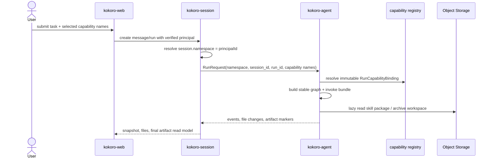

# 交接: runtime/capability 技术方案二次打磨

状态: 2026-07-09 给后续 code agent / ccc 的打磨交接  
用途: 只读优先, 继续审核和打磨技术方案; 不直接实现。若要实现, 需要另开对应 WP。  
当前主读入口: `docs/kokoro-handbook/technical/19-current-runtime-capability-review-plan.md`

## 0. 先读哪些

按这个顺序读, 不要递归扫完整 `docs/`:

1. `docs/CODEBASE_MAP.md`
2. `docs/kokoro-handbook/technical/19-current-runtime-capability-review-plan.md`
3. `docs/handoffs/2026-07-07-runtime-buildout-next-handoff.md`
4. `docs/kokoro-handbook/technical/18-capability-namespace-auth-sandbox-artifacts.md`

`19-current-runtime-capability-review-plan.md` 是人类评审主入口。`18` 是详细附录, 只在查字段、时序和边界时读。handoff 是短期派工材料, 不能反过来覆盖 handbook 结论。

## 1. 当前已经收敛的判断

- `principalId` 是平台分配的全局唯一主体 id; V1 代表个人, 未来可以代表 team/workspace。**由 platform 新增独立 `principal` 表分配, 独立于 `ownerId`/`User.id`**（决策 2026-07-09: `namespace = principalId` 是不可迁移隔离键, 焊死在 User.id 上会导致 team 上线时数据级迁移）。V1 每个个人 User 1:1 映射一个 `kind=personal` principal。
- final artifact 走 **agent 驱动的单工具 `submit_artifact`**: 调用瞬间冻结 content_hash + 归档不可变副本, 之后源文件再改不影响该记录。用户 promote/demote 为次级修正, 可后置。这不重蹈 `kokoro-agent` 曾删 `export_artifact`（commit `bbfbb42`, 理由"不要第二个写动词"）的覆辙——本工具的价值是 immutability, 不是复制文件。
- `kokoro-session` 内部持久化 `session.namespace = principalId`; public snapshot 不暴露 namespace。
- `kokoro-agent runtime` 只消费 opaque `namespace`, 不消费 `ownerId` / `userId` / `teamId` / `workspaceId` 做隔离。
- capability registry V1 只覆盖 `skill` 和 `mcp`; DeepAgents graph 内部运行节点不是用户可启用能力, 不进 registry。
- 每个新 run 生成不可变 `RunCapabilityBinding`; active run steer、HITL resume、crash recover 复用当前 binding。
- terminal 后的 retry/regenerate/new message 才创建新 run, 并重新 resolve capability。
- skill/MCP 由上游传入本 run names/ref; agent runtime 不做产品配额、用户授权或自动扩容。
- DeepAgents 稳定前缀不随 skill/MCP 变化; skill 内容通过 `skill_list` / `skill_read` lazy read。
- MCP 不动态展开成一堆模型工具; agent 只看到 Kokoro adapter: `mcp_list_tools` / `mcp_describe_tool` / `mcp_call`。
- skill zip/assets 等固定大对象放对象存储; Mongo 只放 registry metadata、state、package_ref、content_hash 和索引。
- sandbox/cache 不是权限事实源; 关闭能力后, list/read/call 必须 fail closed, 但不要求立刻删除沙箱残留。
- session `/files/.skills/**`、sandbox generic file tools、archive 都不能绕过 capability read path。
- UI 视觉放后; web 先整理 homepage、auth、email signup、settings、app shell 的结构底座。
- 外部参考来源的路径、分支、逐字文案、类名、截图和资产只能放 `tmp/`, 不进入正式 docs/code。
- 业务 agent 编排层（C 层）已在 `19` §3.2 / §3.3 + §1 第 10 条显式补出。要点（本轮核实 / 纠正后, 曾误判 prompt 与 agent 切换机制）:
  - (a) prompt 是 `kokoro-agent/src/kokoro_agent/prompts/` 专门目录里的**静态 .md**, 通用 agent 用统一 `general.md`, 业务差异**不靠运行时拼 prompt**, 靠"选哪份目录 .md + 挂哪些 skill/subagent/tool + 填哪些阶段策略"（探子证实: `prompts/library.py`、`agents/assembly/prompt.py:10-19`）。
  - (b) 通用 agent 与专属 studio agent 是 swarm 里**平级对等**的 top-level agent, 各自当主——通用 agent 下的垂类小模块（子）**≠** 平级同名专属 agent（自己当主）。
  - (c) agent 间切换走 **langgraph-swarm handoff**（`Command(goto=, graph=PARENT)`, 同 graph/checkpoint 对等移交, **非走新 run**、**非 deepagents 父等子 subagent**）。现状: `langgraph-swarm` 未依赖, 仅 P2 计划注释（`agents/base.py:5`、`agents/__init__.py:6-8`、`delegates.py:3-5`）, 当前临时用 deepagents task/subagent 桥接。
  - (d) 统一 `StageSpec` 阶段契约: intake / shape / produce / review / finalize; 阶段枚举固定, 各 agent 只填能力 / HITL / 产物 / 流转。
  - (e) binding 仍 run 级不可变: run 受理时按 swarm 成员集合一次性解析, handoff 切主 agent 不重解析, 各 agent 只用自己白名单子集。
  - 本轮只定边界, 不拆 WP、不建实现、不写垂类实例（music/video 仅口头背景, 未落正式 docs）。
- **完备性审查定案（2026-07-09, 4 路只读交叉代码）**已进 `19` §3.4 + §3.5。核心结论:
  - V1 只做单 `general` agent + WP-0/1/2/4 基础设施; stage 状态机 / swarm handoff / 专属 studio agent(扩 AgentType) / stage-aware HITL 全是 P2 需新建层——deepagents 0.6.6 扁平模型无 stage、langgraph-swarm 未依赖、HITL 按工具名非阶段。§3.2/§3.3 降格为 P2 蓝图 + 硬边界, 非 V1 接线清单。
  - 开工前必须先落的 8 项定案（见 §3.5）: (1) run_id 全局唯一 + 读取校验 namespace/session, streams.yaml 不改; (2) principalId 由 session 按 ownerId 查 `principal` 表映射, 不改 token + 存量 backfill; (3) 删 `McpServer.headers` 明文 → `mcp_server_names` + gateway `secret_ref`, 并把 RunCapabilityInput/Binding 落 contract、声明 `RuntimeConfig.mcp` 废弃策略; (4) final artifact 独立 keyspace `artifacts/<ns>/<content_hash>`, 与 path-keyed 覆盖写归档物理分离; (5) content_hash agent 侧算 + 统一字段名(修 `18` content_digest 漂移) + 幂等键 run_id+path; (6) recover 复用 binding 不比较 / fail-closed 只管同 run_id 并发写不同 binding; (7) 缺 authSecret 生产 fail-fast; (8) WP-2 为远程沙箱(E2B/Daytona)补 pull-archive 原语, WP-4 前置。
  - 审查确认**无需返工**的: 契约单源生成(generate.py --check 通过)、`RuntimeContext{namespace,session_id}` 已合规、同 thread 新 run vs resume scope 区分(supervisor `_start_run`/`_on_resume`)已正确。
- **遗留清零（末轮）**: `19` 已把所有 open item 定死, 现为 **V1 完整闭环、零开放项**——(i) promote/demote V1 不做(agent 唯一定稿); (ii) `RuntimeConfig.mcp`/`McpServer` 明文对象直接删、不做兼容层; (iii) final artifact 幂等键 = content_hash, hash 由 archiver 归档时算(非模型自报, session 不二次校验); (iv) platform `principal` 表 + 签发是 **WP-0 前置**(非"暂不派"); (v) stage/swarm/专属 agent 是边界已锁的 P2, V1 不依赖也能端到端跑通。文档内不再有"可后置/次级/要么/列为增强"类尾巴。
- **端到端环节交互核实（回答"是否闭环/讲清/交互全"）**: 二次走查确认——已 ready 且有跨栈 e2e(`scripts/e2e-v21-gate.py`)的: control 身份校验(`/sessions/:sid/runs/:rid/control` + ownerId 裁权 + getRun 归属校验, control body 不需带 namespace)、V1 HITL(`approvals.py` + SSE `tool.awaiting_approval` + `run.resume{decisions}`)、SSE 隔离(`liveStream(sessionId)`)、文件下载(`GET /sessions/:id/files/:path`)。真洞已补进 `19`: (1) **capability Selection 层完全不存在**(web 无选择 UI、session 只认静态 `KOKORO_NAMESPACES_FILE` profile、`StartMessageBody` 无能力字段、registry 表全无)→ §3.5 第 9 条定 V1 补最小闭环(registry + names 字段 + 按 principal 解析 + web UI), skill upload 划 P1.5; (2) final artifact 只有 list、无读/下载 → §9 加读接口(独立 keyspace 取回); (3) `run.steer` contract 有、web HTTP 未接通 → §5 加接通 TODO。§3.5 第 10 条明确 V1 HITL 沿用现有回路、不新建。
- **全链路一致性/交互走查（`19` §3.6，12 步单一事实源）**: 从登录→session→选能力→发起 run→resolve binding→执行→HITL→steer→产物冻结→回传→crash/recover→删除, 逐步标 ✓(已 ready)/⊕(V1 补)。探子证实已 ready: run claim upsert 互斥、idempotency 双保险、active_run CAS、tool decision keep-first、HITL e2e、SSE 物理隔离。新挖并定案的 ⊕ 洞: (1) principal 按 owner_ref 唯一 upsert 防并发首登双建; (2) capability names 受理瞬间快照; (3) binding 与 run claim 合一原子 upsert + 显式可续跑判据; (4) **epoch/fencing token**(现仅 owner 字符串覆盖, 代码注释自陈裂脑双跑审计缺口); (5) content_hash=sha256(全仓现无任何 hash); (6) submit_artifact 冻结前文件一致性读(现归档无 quiesce 会读半截); (7) snapshot 1000 条静默截断改显式标记; (8) completeMessageSegment 两步非原子改 $push+$set/乐观锁。均已按链路归 WP。

## 2. 运行链路一眼看



后续 agent 审核时, 请重点检查这条链路有没有被文档或代码路径打破: web 不构造 namespace, session 是 namespace 事实源, agent 只按 run binding 使用能力。

## 3. 这次需要 ccc 继续打磨什么

### 3.1 主文档可读性

- `19` 是否真的适合作为人类主读入口: 先结论、再术语、再依赖图、再 WP。
- WP 的 TODO 是否能让 code agent 直接执行, 有没有空泛词。
- `18` 是否过长但仍作为附录可接受; 如需拆分, 不能造成多个事实源冲突。
- Mermaid 时序图是否解释清楚 new run、active run steer、HITL resume、crash recover、terminal retry/regenerate 的差异。

### 3.2 namespace / principal 边界

- platform/user 侧可以叫 `principal_id`; session/agent runtime 侧只叫 `namespace`。
- runtime 表不要同时塞 `principal_id` 和 `namespace` 两个隔离字段。
- public snapshot、browser payload、web config 不暴露 namespace。
- run ledger/control/event 读取要么用全局唯一 run_id 并校验 namespace/session, 要么 key 里显式包含 namespace/session。

### 3.3 skills / MCP / context

- RunRequest 只携带本 run capability names/ref, 不携带 skill package、MCP server config、MCP header/token/key。
- agent ledger 持久化 request 前必须 scrub secret; 需要负向测试。
- `skill_list` / `skill_read` 是稳定工具, 不是把全部 skill 正文塞进 system prompt。
- `mcp_list_tools` / `mcp_describe_tool` / `mcp_call` 是 Kokoro adapter, 内部再映射 MCP primitive。
- active run 中 capability settings 变化不能热更新当前 binding; 只能 pending change 或 cancel/restart。
- long `skill_read` / `mcp_describe_tool` 结果需要 retention/压缩, 不能让 checkpoint 多轮无限增长。

### 3.4 sandbox / artifact

- WP-2 应聚焦 Daytona dev sandbox、lifecycle、permission manifest、archive key、setup verification。
- archive key 必须由 namespace + session_id + normalized path 构造。
- workspace archive 不等于 final artifact; final artifact 需要 agent marker 或用户 promote 后入 read model。
- capability cache 路径不进入普通 workspace 文件读和 archive。

### 3.5 web

- 当前只规划结构底座: homepage、login、email signup、settings、app shell、task composer。
- 视觉参考和截图评审只放 `tmp/`; 正式文档只保留抽象设计原则和 Kokoro 自己的实现结论。
- 一个 site 一个皮; skin/content/config 不能改变 session contract、namespace 或 agent runtime 接线。

## 4. 已知代码差距

这些是文档已经指出、但当前实现大概率还没完成的点。后续如果转实现, 请按 WP 拆, 不要一锅端。

### P0: namespace/auth

- 主干 `main` 仍是实例级单 namespace 模型（`KOKORO_NAMESPACE` env, 全实例共用, 完成度约 15%）: `kokoro-session/src/main.ts:84,104`、file key `${namespace}:${sessionId}` `kokoro-session/src/http/server.ts:159`。
- **已存在一份未提交的 gitwarp worktree `agent/session-namespace-auth-persistence`**, 已把 namespace 挪进 `payload.sub`、session 持久化、file/snapshot/RunRequest 改为按 `session_id -> session.namespace` 反查, 并加了跨 namespace 隔离测试（约 70%）。**未 commit/合并, 属于进行中的别人的活, 不得擅自覆盖或直接 merge; 收编前必须先完整 review 其 diff。**
- **收编时必改一处**: worktree 把 `namespace = payload.sub`, 而 sub 现在是 `ownerId`。按决策 principalId 独立于 ownerId, token 需同时带 `ownerId` + `principalId`, `namespace` 必须取 `principalId` 而非 sub。
- `kokoro-session/src/http/auth.ts:21,47` 主干 `AuthResult` 只有 `ownerId`, 需补 `principalId`。
- session store/schema 需要内部 `session.namespace`, 并确保 snapshot（`sessionMetaSchema.strict()`, `contract/http.ts:16-25`）不暴露。
- relay/recover/snapshot/file read/workspace list 需要从 session 反查 namespace。

### P0: platform principal 签发

- `kokoro-platform/kokoro-user` 有 `User`（`id/siteId/externalUserId/email`, `src/domain/user.ts:5-16`）, 但**无 `principalId`, 无签发 `{ownerId, principalId}` 的接口**。
- session auth 现为自签 HS256 JWT + `LOCAL_OWNER_ID="local-user"` 兜底（`auth.ts`）, 注释自认"签发归 platform 后续主线"。
- 需在 platform 侧新增独立 `principal` 表 + 签发路径, session 消费 `principalId` 作 namespace。principalId 独立于 User.id（见 §1）。

### P0: contract and secret hygiene

- `contract/spec/control.yaml` 当前 runtime config 仍可能承载过多 skills/MCP 明细, 需要收窄成 names/ref。
- agent request ledger 持久化需要 scrubber, 禁止 headers/token/key 明文进入 `request_json`。

### P1: skills / MCP（现状已核实）

- skill 确走启动期 `provision_skills -> create_deep_agent(skills=...)` 整包注入: `kokoro-agent` `pipeline.py:44,65`、`execution/build_agent.py:42,53`、`skills/provision.py`。需改成 Kokoro 自己的 stable `skill_list`/`skill_read`。
- MCP 确走 `load_mcp_tools(runtime.mcp)` 直接注册进静态 tools: `agents/assembly/toolset.py:39`、`mcp/tools.py:36-45`; 且 `headers` 明文直传: `mcp/servers.py:26-28`、`contract/control.py:40`。需替换为 `mcp_list_tools`/`mcp_describe_tool`/`mcp_call` adapter + `secret_ref`。
- `CapabilityResolver` / `RunCapabilityBinding` / binding store / 稳定 adapter 工具**全仓零命中, 要从零新增**, 不是改造已有实现。
- direct-read deny 需要覆盖 session files、sandbox file tools、archive。
- 版本已核实（uv.lock）: deepagents 0.6.6、langchain 1.3.2、langchain-core 1.4.0、langgraph 1.2.2、langchain-mcp-adapters 0.3.0。框架够新, 重点是上层抽象, 不追升级。

### P1: artifact 现状

- `kokoro-agent` 曾有 `export_artifact` + `ArtifactStore`（commit `15f19af`）, 在 `bbfbb42` 被删, 现仅 `write_file`（`tools/registry.py:21`）, session/web 直读目录。
- `kokoro-session/src/workspace/files.ts:50-115` 真实目录直读, `WorkspaceFile` 无 `content_hash`/版本, 文件可变。→ WP-4 的 `submit_artifact` 必须自带冻结（content_hash + 归档副本）, 不能依赖现有 files 层。

### P2: lifecycle tests

- 需要补同 thread 新 run 刷新 run identity 的回归测试。
- active run steer 只允许自然语言 steer; capability chip/settings 变化必须 pending change 或 cancel/restart。
- 长 capability tool output 的 retention/压缩还需要落测试。

## 5. 不要做什么

- 不要把 DeepAgents 内部运行节点设计成 capability kind。
- 不要把 namespace 改成 owner/user/team 业务字段; runtime 只拿 opaque namespace。
- 不要把主体所有 enabled skills 自动塞入每次 run。
- 不要把能力上限、产品配额、用户授权写进 agent prompt。
- 不要把 skill package、MCP headers/token/key 放进 RunRequest。
- 不要为了“动态”把 MCP 每个 server/tool 注册成模型可见工具。
- 不要在本轮交接里做 UI 视觉实现; 先打磨技术方案。
- 不要全量格式化 markdown; 当前文档有既有长行和表格, 只改必要内容。
- 不要 commit, 除非用户明确要求。

## 6. 建议验证命令

只做文档打磨时:

```bash
git -C /Users/nako/WebstormProjects/github/thefoxfairy/Kokoro diff --check
git -C /Users/nako/WebstormProjects/github/thefoxfairy/Kokoro status --short
```

另外用临时脚本或人工输入的禁用词清单扫描 `docs/`, 但禁用词清单本身不要写进正式 docs。

如果转实现, 在对应子仓重跑本地验证, 不接受 worker 的完成声明作为唯一依据:

```bash
uv run ruff check .
uv run pyright
uv run pytest
npm test
npm run typecheck
npm run lint
```

## 7. 当前相关改动文件

本轮相关:

- `docs/CODEBASE_MAP.md`
- `docs/kokoro-handbook/technical/18-capability-namespace-auth-sandbox-artifacts.md`
- `docs/kokoro-handbook/technical/19-current-runtime-capability-review-plan.md`
- `docs/handoffs/2026-07-07-runtime-buildout-next-handoff.md`
- `docs/handoffs/2026-07-09-runtime-capability-review-polish-handoff.md`

工作区里还有更早的文档改动:

- `docs/handoffs/2026-07-07-capability-buildout-handoff.md`
- `docs/kokoro-handbook/technical/00-system-overview.md`
- `docs/kokoro-handbook/technical/13-agent-docs-map.md`
- `docs/kokoro-handbook/technical/17-namespace-runtime-isolation.md`

后续 agent 接手前先看 `git status --short`, 区分本轮新增交接和已有历史改动。
