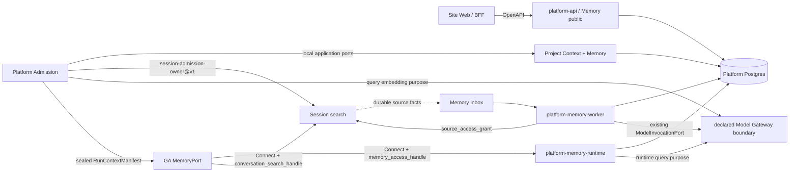

# ADR-013: Product Memory and Context Authority

## Status

Accepted. Architecture and independent P0/P1 review are closed; implementation remains gated by
phases M0-M4 and is not production-ready merely because this decision is accepted.

**Date:** 2026-07-30

**Deciders:** LordFoxFairy, Kokoro architecture review

## Context

Kokoro currently has a useful but deliberately small Agent memory primitive:

- `kokoro-agent/tools/memory.py` exposes `save_memory` and `search_memory` inside one opaque
  `namespace`;
- `kokoro-agent/storage/memory_store.py` stores a key plus free-form content in MongoDB;
- search lists at most 200 records, performs a case-insensitive substring scan, and returns at most
  eight matches;
- the memory is not a product authority and has no revision history, source provenance, confidence,
  temporal validity, citations, correction workflow, consent policy, semantic retrieval, deletion
  cascade, project isolation, or Admin/Web management surface.

That primitive is sufficient for an Agent-local experiment but not for a user-facing memory system.
It also places the authority in the wrong process: Web and Admin must be able to show, correct,
disable, export, and delete memory without invoking GA, while Session and GA need narrowly scoped
runtime access without sharing databases.

The product target is the useful intersection of current leading systems:

- explicit instructions and learned memories remain visibly distinct;
- past-chat search is a cited retrieval operation, not an invisible copy of all chat history;
- global/user memory and project memory are isolated;
- users can pause, reset, edit, prioritize, correct, export, and delete memory;
- temporary conversations neither read nor create product memory;
- context compression remains restorable through source references, files, and artifacts;
- changing facts retain time and provenance instead of becoming contradictory flat notes.

Kokoro has additional constraints:

- every Site is an independent product/account boundary; Sites do not implicitly share identity or
  memory;
- four top-level repositories remain independently released and communicate only through versioned
  HTTP, ConnectRPC, or SSE contracts;
- GA consumes an opaque `namespace` and must not learn Site/account internals;
- Platform is one repository and bounded context, but selected processes may be independently
  deployed from the same artifact;
- no separate vector database or new top-level repository is justified before the existing
  PostgreSQL deployment is exhausted;
- memory must never become an authorization, payment, policy, or hidden-prompt bypass.

## Decision

### 1. Separate five product concepts and four snapshot authorities

We will not use “memory” as a name for every kind of retained context.

| Concept | Meaning | Authority |
|---|---|---|
| Working context | The bounded material actually visible to one model call | GA context assembler |
| Conversation history | Immutable messages, parts, branches, summaries, and search source | Session |
| Explicit instructions | User- or administrator-authored standing guidance | Platform Project Context |
| Learned memory | Revisable facts/preferences inferred from authorized sources | Platform Memory |
| Restorable resources | Files, repositories, artifacts, connectors, and source handles | Their existing owner |

Episodic past-chat search remains a Session capability. It is not copied into the Memory database.
Project files and generated artifacts remain restorable resources. They are not flattened into
learned-memory text merely to make retrieval convenient.

Kokoro already uses “context” for several unrelated facts. The following four immutable objects are
separate authorities and must never be merged into one record or given interchangeable names:

| Object | Owner | Contains | Explicitly excludes |
|---|---|---|---|
| `ProductContextSnapshot` | existing Platform Authorization | Site release, enabled surfaces, model/Agent catalogs, locale and Web deployment policy | Project content, conversation history and learned memory |
| `ProjectContextRevision` | Platform Project Context | Explicit instructions plus immutable refs to project files/assets, repositories, connectors, output standards and execution defaults | Learned memory selection and Run authorization |
| `MemorySelectionSnapshot` | Platform Memory | Exact selected MemoryEntry revisions, ranking/index receipts, policy and memory generations | Project resources, permissions and Session messages |
| `RunContextManifest` | Platform Admission | Digests and refs for the exact Product, Project, Memory and Session context admitted for one Run | Mutable content and a second copy of any owner record |

`RunContextManifest` is the only context object sealed into the execution manifest. It references the
other authorities by exact revision and digest. `MemorySelectionSnapshot` may reference instruction
revisions for display/ranking explanation, but it never owns or mutates those instructions. The
existing `ProductContextSnapshot` name remains reserved for the Site/Web release exchange and cannot
be reused for Agent memory.

### 2. Put product Memory in Platform, not GA, and separate its trust planes

We will add a `memory` bounded context under `kokoro-platform/src/modules/memory` with normal
`domain`, `application`, `infrastructure`, and `interfaces` layers. The same Platform source artifact
exposes three separate trust planes:

- existing `platform-api` mounts authenticated user/BFF Memory OpenAPI operations. Its Memory
  composition uses the exact `platform_memory_public` PostgreSQL login, not the Admission, runtime,
  worker or migrator credential;
- `platform-memory-runtime` mounts the mTLS ConnectRPC surface consumed by GA. It uses the exact
  `platform_memory_runtime` PostgreSQL login and does not mount public OpenAPI operations;
- `platform-memory-worker` performs extraction, consolidation, embedding, expiry, revalidation and
  purge. It uses the exact `platform_memory_worker` PostgreSQL login and exposes health/control only.

All three logins are `LOGIN NOINHERIT NOBYPASSRLS`, own no schema/table/sequence, have no role
memberships and receive only operation-specific relation/routine grants. The migrator alone owns and
migrates the schema. Runtime composition resolves the actual `session_user`/role OID and fails closed
after role rename, drop/recreate, database `CREATE`/`TEMP`, `public` schema use or neighboring-role
impersonation. Public and private listeners have independent workload identities, TLS material, rate
limits, audit labels and readiness checks.

This does not create `kokoro-memory`, `kokoro-generation`, or another top-level repository. It does
not add a default infrastructure container. All process roles use the existing Platform PostgreSQL
authority and the same release provenance as the rest of Platform.

GA depends on a narrow Python `MemoryPort` implemented by the Root-generated ConnectRPC client. GA
receives only its existing opaque `namespace`, opaque audience-bound grants, immutable snapshot refs
and safe returned entries. It does not parse Site, account, subject, plan or policy fields and never
opens Platform or Session databases.

The current Mongo `save_memory`/`search_memory` behavior is not a product authority. At M0 these
tools are removed from every production Agent catalog and production startup fails closed if the old
store-backed tools are enabled. No old memory is migrated because the product is not live. Mongo may
continue to hold GA checkpoint/runtime state; an explicit non-production experiment may retain the
old store until M2 removes its production composition. A future Agent-private procedural note store
requires a separate decision and cannot reuse the Product Memory name or UI.

### 3. Preserve repository, caller and protocol boundaries



Platform Admission calls sibling Project Context and Memory application ports in process; Memory
does not call Admission and no Platform process calls `platform-memory-runtime` merely to cross a
module boundary. Snapshot/index reads are local PostgreSQL operations. Extraction/embedding uses the
existing `ModelInvocationPort`; its production remote adapter is permitted only when Model Gateway
is already declared by Root as an independent security/deployment boundary. This ADR creates no new
Memory-specific self-RPC exception.

Root owns and versions the cross-repository protobuf/OpenAPI contracts. The caller/operation matrix
is closed:

| Caller | Provider / transport | Allowed operations | Credential |
|---|---|---|---|
| Site Web BFF | `platform-api` OpenAPI | settings, list/search, explicit create/edit, history, restore, priority, delete/reset, export/import | authenticated user/workload context |
| Platform Admission | Project Context and Memory local application ports | resolve and verify Project/Memory snapshot revisions; ask the Memory owner to issue the initial run-bound Memory grant | Admission unit-of-work and exact Memory issuance receipt; no self-RPC credential |
| Platform Admission | existing `session-admission-owner@v1` Connect | verify/finalize the exact Session owner/context fact and ask the Session owner to issue a Run/command-bound conversation-search grant | command-bound Session admission grant + Admission mTLS identity |
| Platform Admission | existing Model Gateway boundary | embed only the prepared Memory-selection query | `memory-selection` purpose/model/data-policy authorization |
| GA | `platform-memory-runtime` Connect | get bound selection, search memory, fetch an immutable search receipt, submit proposal, refresh a run-bound grant | expired or active `memory_access_handle`, as operation permits, + GA mTLS identity |
| GA | Session search Connect | search past chats, fetch an immutable search receipt, and refresh a run-bound search grant | expired or active `conversation_search_handle`, as operation permits, + GA mTLS identity |
| Platform Memory runtime | existing Model Gateway boundary | embed an authorized on-demand Memory query and approved rerank only | `runtime-memory-query` purpose/model/data-policy authorization |
| Memory worker | Session source Connect | fetch an exact immutable conversation source/excerpt and refresh only that source grant | `source_access_grant` + worker mTLS identity |
| Session | Memory inbox over durable outbox delivery | source available/changed/deleted/retention facts | signed delivery identity and idempotency key |
| Memory worker | existing Model Gateway boundary | approved extraction, embedding and reranking roles | purpose/model/data-policy authorization |
| Platform Data Governance | Session Data Governance participant Connect | freeze a conversation-learning source producer cutoff and obtain purge completion receipts | deletion-plan grant + Data Governance mTLS identity |
| Platform Data Governance | Memory participant local application port | advance learning/use generations, freeze ingress/materialization watermarks, purge and receipt | Data Governance unit-of-work + deletion-plan identity; no self-RPC credential |

The initial contract set is:

- `platform-memory-runtime@v1`
  - `GetBoundMemorySelection`
  - `SearchMemories`
  - `GetMemorySearchReceipt`
  - `SubmitMemoryProposal`
  - `RefreshMemoryAccess`
- `session-conversation-search@v1`
  - `SearchPastChats`
  - `GetConversationSearchReceipt`
  - `RefreshConversationSearchAccess`
- existing `session-admission-owner@v1`, extended without creating a second owner service
  - `VerifyPrepareOwner` returns the immutable Session/context owner fact and digest;
  - `IssueConversationSearchAccess` issues the independently scoped search grant after the same
    owner verification;
  - `VerifyFinalizeOwner` revalidates the owner fact before Admission commit;
- `session-conversation-source@v1`
  - `GetConversationSourceExcerpt`
  - `RefreshConversationSourceAccess`
- `session-conversation-source-feed@v1`
  - idempotent `ConversationSourceAvailable`, `ConversationSourceChanged`,
    `ConversationSourceDeleted` and `ConversationRetentionChanged` facts containing authorized
    source references, generations and digests, never database coordinates;
- existing Session Data Governance participant contract
  - `FreezeConversationLearningSources`
  - `GetConversationLearningSourceFenceReceipt`
- Platform public OpenAPI operations for user memory settings, list/search, create, edit, history,
  restore, prioritize/deprioritize, delete, reset, export, and import.

`memory_access_handle` and `conversation_search_handle` are different opaque grants issued by their
respective owners; Admission only orchestrates issuance and cannot mint either credential. GA never
parses their internal claims. The Memory grant is bound to audience,
namespace-binding digest, Run/Session refs, `RunContextManifest` ref and semantic context-binding
digest, selection refs, policy and
memory generations, context policy, allowed operations, result/token/call ceilings, expiry,
revocation epoch and unique grant identity. The Session grant is independently bound to exact
Site-local Project/search scope, Run/Session refs, the same manifest ref/context-binding digest,
context policy, authorization/membership epochs, expiry, use ceilings and revocation. Neither grant
can authorize the other service.

Session source facts carry or reference a separately issued exact-source `source_access_grant` for
the worker. The worker cannot turn a source ref into a broader Session query. Expired worker grants
may be refreshed only by Session after rechecking source availability and retention; Platform
service identity alone does not authorize content access.

Session remains the only conversation owner. Memory stores opaque source refs, generations and
digests, not Session content. A bounded excerpt may exist only as an encrypted, expiring presentation
cache with the same revocation generation; it is never an authority copy. Session deletion and
retention facts are consumed asynchronously through transactional outbox/inbox, monotonic source
generations and idempotent receipts, not shared tables. There is no synchronous
`Session -> Memory worker -> Session` call chain: Session commits and delivers a source fact; the
worker later fetches the exact source. Memory or Model outages never block Session message commit.

### 4. Resolve and bind Run context in two fenced phases

Admission owns a two-phase protocol; neither browser nor Session is allowed to assert Memory,
Project Context, policy or namespace owner facts.

1. **Owner preflight and snapshot preparation.** Admission obtains the exact Session owner fact,
   including immutable `context_policy`, through `VerifyPrepareOwner` on the existing Session owner
   boundary. The fact is command-bound and carries an owner-fact ref/digest, Session/context
   generation, `context_revocation_epoch` and expiry. A short
   Platform read transaction verifies the Session grant, Site release, subject generation, Project
   membership/authorization epochs and context policy. Outside every PostgreSQL transaction, an
   optional query embedding may be obtained through the already-declared Model Gateway boundary.
   A second short local transaction resolves the exact `ProjectContextRevision`, creates the
   `MemorySelectionSnapshot`, and records input generations, query/model/index revisions and
   digests. Admission deterministically allocates the `RunContextManifest` ref from the command
   identity and computes a semantic `context_binding_digest` over all owner refs/digests, policies,
   generations and budgets. Opaque handle bytes and issuance receipt IDs are excluded from this
   digest, so grant issuance cannot create a manifest-digest cycle. No DB transaction spans a
   Session, model or other network call.
2. **Admission commit.** Before the local commit, Admission invokes `VerifyFinalizeOwner` when search
   is disabled, or `IssueConversationSearchAccess` when search is allowed. The latter atomically
   performs the same finalize checks and returns both the final owner receipt and independently
   scoped `conversation_search_handle`; no prior verification assertion is trusted. Both operations
   revalidate command binding, owner-fact ref/digest, Session/context generation,
   `context_revocation_epoch`, expiry and immutable `context_policy`. The existing Admission commit
   transaction revalidates
   Site/configuration revision, subject generation,
   membership/authorization epochs, `context_policy`, Project Context
   revision, Memory policy/space/revocation generations and snapshot digest. Any mismatch discards
   the prepared selection and restarts phase 1 under the same command identity; it never silently
   drops memory or accepts stale scope. Within that unit-of-work, the Memory owner issues the initial
   `memory_access_handle` from the exact snapshot, manifest ref and `context_binding_digest` and
   persists its issuance receipt. Only after both owner receipts and all local revalidation succeed
   does Admission reserve the Hold, persist lifecycle facts and seal the final
   `RunContextManifest`. The final manifest digest may cover the opaque handles and issuance receipts;
   owner grants bind the precomputed semantic context digest, never that later digest. A Session
   grant issued before a failed local commit remains command-bound, short-lived and unusable because
   no sealed manifest with that ref/context digest exists.

The sealed RunRequest adds an exact context envelope containing:

```text
run_context_manifest_ref / digest
context_binding_digest
project_context_revision_ref / digest
memory_selection_snapshot_ref / digest?   # absent when use is disabled
memory_access_handle?                     # absent when use is disabled
conversation_search_handle?               # absent when search is disabled
context_policy = standard | temporary
context_revocation_epoch
```

GA still receives only opaque `namespace`, refs, digests and grants; Site, subject, workspace,
membership and billing fields do not enter the Agent contract. Because RunRequest schemas are strict
in every repository, M2 is one Root-coordinated contract/pin promotion with real provider/consumer
incompatibility checks, not an optional field changed in one repository.

### 5. Use separate instruction, memory and proposal aggregates

Explicit instructions and learned memories have different authority and must not share one mutable
record type.

```text
InstructionEntry -> InstructionRevision[]

MemorySpace
  -> MemoryEntry
       -> MemoryRevision[]
       -> MemoryProvenance[]
       -> MemoryFeedback[]
       -> MemoryEmbedding[]
  -> MemoryProposal[]
  -> MemoryPolicyRevision[]
```

Every `MemorySpace` is Site-local and has an exact internal binding:

```text
space_ref
site_ref
scope_kind = user | project | agent_product
owner_subject_ref? / owner_subject_generation?
project_ref? / membership_epoch? / authorization_epoch?
agent_option_ref? / product_surface_ref?
space_generation / learning_generation / revocation_epoch
learning_state = active | paused
minimum_learnable_source_origin_seq
policy_revision_ref
state
```

`learning_generation` starts at 1 and is never decremented or reused. Pause, resume and reset each
advance it exactly once in their owner transaction. Every proposal, confirmation, lease, provider
job, ingress receipt and materialization CAS carries the generation under which it was admitted.
`minimum_learnable_source_origin_seq` is also owner-written and monotonic; resume and reset may move
it forward but no command can lower it. `space_generation` remains the broader aggregate
identity/lifecycle fence, while `revocation_epoch` fences use of already materialized content.

User scope always means one `site_ref + subject_ref + subject_generation`; a deleted and recreated
subject cannot inherit an older generation's memory. Project scope means one `site_ref + project_ref`
and requires a currently active membership/authorization epoch on every read and mutation. The
creator remains provenance, not exclusive ownership of shared Project memory. Agent/product scope is
an additional narrowing dimension inside one authorized user or Project space; it is never a
cross-subject product bucket.

Scope and category are orthogonal. `profile | preference | fact` describes what an entry means;
none of those values selects an owner. A public caller may eventually request the closed intent
`personal | current_project`, but never supplies Site, subject, Project or space identifiers. The
M0.1 public surface is personal-only. Project Memory remains feature-off until read, contribution,
policy, import/export, reset and purge permissions are frozen separately for member, editor,
Project owner/admin and Data Governance actors.

Workspace scope is deliberately reserved but not present in M0-M2 wire enums or production tables.
It may be added only after Workspace membership, member removal, ownership transfer, shared-memory
visibility and citation ACL semantics are accepted. Unknown scope kinds fail closed.

Every primary key, unique key, foreign key path, index predicate and RLS policy includes `site_ref`
directly or reaches it through a database-enforced parent. Application filters are defense in depth;
RLS binds the actual login role plus the verified Site/subject/project generations. GA sees only
opaque namespace and grants. Cross-Site memory is not representable by normal runtime contracts. A
future cross-product transfer is explicit export/import or OAuth-mediated user action, never a
broader query.

Every `MemoryEntry` has a stable identity and at least:

```text
memory_ref
space_ref
category
state = proposed | active | contested | superseded | disabled | quarantined | deleted
sensitivity
salience
confidence_micros
valid_from / valid_to
system_from / system_to
current_revision
created_by_kind / created_by_ref
last_validated_at
policy_revision_ref
space_generation / learning_generation / revocation_epoch
created_at / updated_at
```

Every append-only `MemoryRevision` has:

```text
revision
canonical assertion/content
structured subject/predicate/value when available
content_digest
source_set_digest
reason = explicit | inferred | corrected | merged | superseded | imported | restored
model_invocation_ref? / extraction_policy_revision?
valid_from / valid_to
system_from / system_to
supersedes_revision_ref? / conflict_set_ref?
recorded_at
```

`MemoryProvenance` links a revision to an exact authorized source such as Session message/part,
ArtifactVersion, user instruction command, connector record, or import receipt. It records source
digest, source time, trust class, and citation capability. It never contains a secret, cookie,
credential, hidden reasoning, or arbitrary executable instruction.

`MemoryFeedback` is append-only and records confirm, correct, reject, forget, prioritize,
deprioritize, or “do not learn this category” actions. User correction has higher authority than a
model inference and creates a new revision or supersession; it does not rewrite history.

`InstructionEntry` and its revisions remain aggregates of Platform Project Context, not tables or
write operations owned by Memory. Each instruction is bound to an exact Site plus managed,
user-global or Project scope, the relevant subject/Project generations, an authority class and an
immutable revision/content digest. Admission resolves those revisions into `ProjectContextRevision`.
Memory runtime and workers may rank an already-authorized instruction reference for explanation, but
cannot create, promote, edit, disable or reinterpret instruction authority.

### 6. Make memory writes proposals, not unrestricted Agent mutations

GA, subagents, connectors, and the background extractor submit `MemoryProposal` objects. They do not
write `MemoryEntry` rows directly.

The proposal state machine is closed:

```text
received -> evaluating | revoked | expired
evaluating -> accepted | confirmation_required | rejected | quarantined | expired | revoked
confirmation_required -> accepted | rejected | expired | revoked
accepted -> materialized | revoked | expired
```

Every command has a stable identity derived from caller/proposer identity, Run/ChildRun and proposal
ordinal when applicable, requested space/scope, authorized source-set digest, policy revision and
canonical proposal digest. Every proposal and worker lease additionally freezes the relevant
`space_generation`, `learning_generation`, `subject_generation`, project/membership/authorization
epochs, `source_generation` set and policy revision. `learning_generation` is an owned monotonic
field of `MemorySpace`; it is copied into every proposal, confirmation, lease, provider job and
materialization command. Same identity plus same digest returns the original
receipt; same identity plus a different digest is a conflict. Leased evaluation and materialization
use expected version, fencing token and transactional inbox/outbox. The `accepted -> materialized`
transaction compare-and-swaps every frozen generation/epoch against its current owner value before
writing a MemoryEntry revision. A stale proposal becomes a content-free `revoked` or `expired`
receipt and cannot be retried into the new generation. An `accepted` transition creates the
MemoryEntry or new revision and its receipt atomically; a worker crash never leaves a receipt claiming
a missing entry.

The owner service applies these rules:

1. An explicit, authenticated user command such as “remember this” may be accepted immediately when
   the requested scope is valid and the content passes policy.
2. An inferred preference/fact is accepted automatically only when the Site/user policy permits the
   category and its evidence/confidence thresholds are satisfied.
3. Sensitive, conflicting, low-confidence, cross-source, or behavior-changing proposals require
   user confirmation or remain proposed/contested.
4. Tool output, web content, MCP resources, assistant text, and other agents are untrusted evidence;
   they cannot become a user preference or instruction without an authenticated user source or
   explicit confirmation.
5. Multi-agent writes retain proposer AgentRevision, Run/ChildRun, source refs, and aggregation
   identity. A child Agent cannot overwrite a root/user memory. It submits a proposal to the same
   owner policy.

Explicit user “remember this” commands still use the owner command path, idempotency and policy
checks; “immediate” means no model confirmation is required, not an unjournaled direct row insert.
Behavior-changing text can become an `InstructionEntry` only through a separate authenticated
instruction command. A Memory proposal, import, tool result or model inference cannot promote itself
to an instruction.

Rejected/forgotten facts create a scoped suppression receipt so the same source is not immediately
relearned. Suppression stores a rotating-key fingerprint and category/scope generation, never the
deleted plaintext or a stable public content hash, and expires according to policy. Rotation keeps a
bounded overlap of active private key epochs so a new proposal can be checked against unexpired
suppression receipts without retaining the forgotten content.

The production Agent tools become `search_memory` and `propose_memory`. The latter returns a typed
accepted/pending/rejected receipt. It does not claim success merely because a local key was written.

### 7. Build immutable selections and journal every dynamic retrieval

Initial Memory use is frozen per Run through `MemorySelectionSnapshot`:

```text
memory_selection_snapshot_ref
namespace_binding_digest
space binding + subject/project generations
policy_revision_ref
space_generation / revocation_epoch
query_digest
selected memory_ref + revision pairs
source/citation refs
ranking/index/model revisions
token budget and actual token count
created_at / expires_at
snapshot_digest
```

The two-phase Admission protocol binds its exact ref/digest into `RunContextManifest`. Ordinary edits
do not change an admitted Run. A new Run or explicit rebase gets a new selection. A branch inside the
same Session inherits immutable conversation context up to its fork point but performs a new Memory
selection for its new Run; it records the parent manifest/snapshot lineage rather than copying
mutable Memory rows. A branch of a temporary Session remains temporary.

Initial context is deliberately split into two bounded sets rather than treating every retained fact
as either an unconditional prompt block or a tool-only vector result:

1. **Pinned profile set.** A very small, separately budgeted set of active user-pinned or
   policy-qualified stable facts is selected automatically. The owner, not GA, decides eligibility;
   sensitive, contested, expired, project-inapplicable and low-confidence inferred facts are
   excluded. The exact revisions remain read-only to GA for the Run and are never represented as a
   mutable Agent-owned profile blob.
2. **Turn-relevant set.** Admission performs policy-first retrieval using the current command/task
   query and selects only the cited facts that pass relevance, validity and token budgets. This gives
   normal chat personalization without requiring the model to remember that a search tool exists.

Both sets are carried by the same immutable `MemorySelectionSnapshot`, but record their selection
class independently so Web can explain whether an item was pinned or retrieved. Explicit managed,
user and Project instructions remain `ProjectContextRevision` material and are not smuggled into the
pinned Memory set. GA scratchpads, plans, summaries and tool-local notes remain bounded working
context; they do not become product Memory merely because they survive a checkpoint.

Additional on-demand Memory and past-chat searches are external reads with durable semantics, not
journal-exempt “pure” tools. Every request is keyed by:

```text
run_id + tool_call/search_ordinal + canonical_query_digest + scope/requested_budget_digest
```

The provider returns an immutable `selection_receipt_ref`, exact entry/source revisions, per-component
scores, citations, truncation facts, index/model/policy revisions and result digest. GA durably stores
the receipt and bounded result before the next model call. Retry, worker recovery, continue and exact
replay use that receipt; same identity with a different query is a conflict and never executes a live
replacement search. The provider retains receipt content at least for the Run replay horizon.

Receipt lookup is a first-class owner operation, not an accidental repeat-search path:
`GetMemorySearchReceipt` and `GetConversationSearchReceipt` accept the original immutable search
identity and return the exact bounded result or a typed content-free `revoked`/`purged` state. They
never rerank, re-embed or query live data. `RefreshMemoryAccess` and
`RefreshConversationSearchAccess` accept an expired handle only together with GA mTLS identity and
the same Run/Session plus `RunContextManifest` ref/context-binding digest. Before the first search,
refresh binds the original grant identity and the pending immutable search identity
(`run_id + ordinal + query/scope/budget digest`); it does not require a nonexistent receipt. Once a
receipt exists, refresh additionally binds that receipt/selection identity and may not authorize a
replacement live search. The owner validates the expired token's signature and original claims
without treating expiry as authorization, then revalidates every current generation, epoch, policy
and budget and may only narrow the renewed grant. Refresh failure is final for that boundary and
cannot fall back to a broader service token.

Grant expiry does not change selected content. A resumed Run whose credential expired obtains an
owner-issued replacement bound to the same RunContextManifest and selection digest; the rotation is
recorded and cannot widen scope. If the owner cannot revalidate the Run, generations or policy, the
refresh fails closed.

Immutability does not defeat privacy or security revocation. Memory reset/delete, Session source
revocation, subject/membership removal and managed policy changes advance a revocation epoch. After
that fence, receipt fetch returns `revoked` without content and every Memory/Session tool call fails
closed. A currently executing model call cannot be made to “unsee” submitted tokens, so revoke/reset
causes best-effort cancellation and is guaranteed before the next model/tool boundary; the UI states
that exact boundary. Data Governance subsequently purges affected GA checkpoint/evidence payloads.
Ordinary content correction without revocation remains frozen for the existing Run.

Working-context assembly uses this priority order:

1. managed security and organization/Site instructions;
2. explicit user/project instructions;
3. exact current Task/Session structured state;
4. relevant active project/user learned memories;
5. cited episodic chat search or restorable resources requested on demand.

Lower layers can add context but cannot override a higher-layer security policy. Memory never grants
a tool, changes a payment/credit decision, broadens a capability, selects a secret, or authorizes an
effect.

Learned memories, citations, imported entries, connector records, web/tool/MCP output and assistant
text are serialized into a typed, delimited data channel with source and trust metadata. They are
never concatenated into system/developer instructions, tool schemas or authorization prompts.
Instruction content is separately typed and ranked by managed/user/project authority; imported or
model-proposed text remains quarantined until an authenticated instruction command accepts it.

The policy taxonomy is default-deny:

- credentials, cookies, bearer tokens, private keys, raw payment-card data, recovery codes, hidden
  reasoning and arbitrary executable payloads are never stored, embedded, logged or exported;
- protected/special-category personal data, precise location, health, biometric, sexual, political,
  religious and minor-related facts require an explicit Site policy, user confirmation and bounded
  purpose/retention; absence of any element rejects the proposal;
- ordinary preferences and user-authored facts still pass secret/PII detection and category policy;
- embeddings, FTS terms, query vectors and ranking traces are personal derived data and receive the
  same Site/scope, retention, export and deletion controls as content.

Memory content, presentation caches and backups use approved encryption at rest and TLS in transit;
no plaintext or query is written to logs, metrics, traces, command receipts or error messages.
Extraction/embedding/reranking may leave the Platform only through a Model Control role whose
provider, region, retention and training-use policy is permitted for the Site and category. Fallback
to another provider/region/model is forbidden unless the frozen RoutePolicy proves equivalent data
handling. Otherwise the proposal remains pending/retryable or retrieval degrades according to the
explicit product policy; it never silently sends data elsewhere.

### 8. Use hybrid, policy-first retrieval behind a Root Infra gate

Policy and scope filtering occurs before ranking. The retrieval stack is:

- PostgreSQL exact filters and row-level security;
- PostgreSQL full-text/trigram retrieval;
- `pgvector` exact semantic retrieval inside an already authorized candidate set;
- optional structured entity/relationship expansion for categories that prove it useful;
- deterministic fusion and reranking with recency, confidence, salience, corroboration, temporal
  validity, explicit priority, and conflict penalties.

We will not deploy a separate vector database for the first production version. The current pinned
official PostgreSQL image does not contain `pgvector`; semantic retrieval is blocked until Root Infra
qualifies and pins either a signed derived image or an immutable upstream pgvector/PostgreSQL image.
The gate includes extension/version ownership, image digest and SBOM/provenance, Platform and Session
CI parity, migration permissions, backup/restore, point-in-time recovery, rollback rehearsal,
resource benchmarks and compatibility/BOM evidence. It changes the existing PostgreSQL service but
does not add a container.

Approximate HNSW/IVFFlat scans do not satisfy “filter before ranking” merely because a SQL `WHERE` or
RLS policy exists: pgvector applies ordinary filters after an approximate index scan. M1 therefore
uses exact vector distance only after Site/subject/Project/space authorization has reduced the
candidate set. Approximate indexes require benchmark evidence and either Site/space partitioning or
another proven prefilter plan, iterative scan configuration, cross-Site timing/leakage tests and
measured recall against exact search before promotion. RLS remains mandatory regardless of index
strategy.

Embeddings are versioned; a model change creates new rows and a dual-index reindex lifecycle. The old
index remains readable for receipts that reference it until the replay horizon ends. Promotion uses
shadow comparison, recall/latency/cost thresholds and rollback; it never reinterprets old vectors in
place.

Session owns a separate `ConversationSearchProjection` for messages, branches, source availability,
citations, lexical terms and embedding revisions. Platform Memory never stores chat text or becomes
the chat-search owner. M1a ships cited FTS/trigram search. M1b adds Session-owned semantic search only
after the same Root pgvector gate and an approved Model Gateway embedding role; query/source content
uses Session-authorized grants and Site data policy. The projection is rebuildable from Session
authority and source deletion advances its generation immediately.

A graph is not the default storage model. Temporal entity/relationship projections may be added
behind a port after benchmark evidence shows that flat assertions cannot answer required questions.
Graphiti is a design reference for temporal validity and provenance, not a dependency commitment.

Retrieval has a strict token budget by product/Agent profile. It must prefer a few cited current
facts over a large memory dump. Truncation preserves entry/source references so content can be
retrieved again; summaries are never the only copy of an authority fact.

### 9. Preserve bitemporal truth and deterministic conflicts

Memory is bitemporal. `valid_from/valid_to` describe when a fact is true in the user's domain;
`system_from/system_to` describe when Kokoro knew that revision. Ranges are half-open, database
constrained and use a recorded source timezone/reference time. Late-arriving evidence closes or
contests a valid-time range without rewriting the system-time history. Queries state both
`as_of_valid_time` and `known_at`; current retrieval defaults both to now and records them in its
receipt.

A changed fact creates a new revision with explicit `supersedes_revision_ref` or `conflict_set_ref`.
Entity merge/split never silently changes another assertion's subject. A purged payload may make a
historical assertion unavailable, but the content-free transition receipt remains auditable.

Conflict resolution is deterministic:

1. managed policy is outside Memory and always wins;
2. explicit user correction wins over inference;
3. exact project scope wins over user-global scope only inside that project;
4. a newer fact wins only when its source and validity are comparable;
5. unresolved contradictions become `contested` and are excluded from high-impact decisions;
6. the user can inspect both sources and choose, merge, or reject.

“Newest text wins” and silent LLM summarization are rejected because they erase temporal meaning and
make stale preferences indistinguishable from corrections.

### 10. Make controls, TemporaryChat and citations first-class

Web will present separate sections for:

- “Instructions I gave Kokoro”;
- “What Kokoro learned”;
- project memory;
- past-chat search and citation controls.

Users can see why a memory was selected, open its source when permitted, edit it, view/restore prior
versions, prioritize/deprioritize it, disable a category, pause learning, pause all memory use, reset
memory, and export/import it.

The product exposes four independent controls with explicit effective times:

| Control | Effect |
|---|---|
| generate learned memory | worker may create inferred proposals; default off until Site and user opt in |
| use saved/learned memory | new admissions may select Memory; disabling advances the use revocation epoch |
| search/reference past chats | Session may issue search grants; independent from learned Memory |
| TemporaryChat | immutable per Session and disables all three paths for that Session |

Site/organization policy may disable a feature globally but cannot silently enable a user-disabled
sensitive category. “Pause learning” preserves existing entries but rejects new inferred proposals;
it advances `MemorySpace.learning_generation` so already queued proposals, confirmations, provider
jobs and leases fail their materialization compare-and-swap. “Pause use” also revokes active runtime
grants before the next model/tool boundary.
Reset advances both use and learning generations and is a
Data-Governance-backed deletion workflow, not a UI-only clear operation.

Responses that use memory or past chats expose source chips/book-style details. Past-chat results link
to the source Session/branch and retain a delete action. A visible citation is part of the contract,
not a best-effort model phrase.

Every completed response also owns an immutable `ContextUseReceipt` that references the exact
`RunContextManifest`, initial `MemorySelectionSnapshot`, and any dynamic Memory or past-chat search
receipts actually made available to that model call. The receipt records only typed source kinds,
entry/source revisions, truncation/use outcomes and policy/index revisions; it never records hidden
reasoning or asks the model to self-report what it used. A model-generated sentence such as “I
remember” is not evidence. Session projects the safe receipt next to the response as a compact
`memory used` indicator with closed states (`none`, `instructions`, `saved_memory`, `project_memory`,
`past_chat`, or a bounded combination). Opening it shows an owner-derived activity view:

- exact source chips and current availability;
- scope, validity time and whether the item was explicit, inferred, corrected or imported;
- a bounded owner explanation such as explicit priority, project match, recency, corroboration or
  semantic/lexical relevance, without scores that become a cross-Site oracle;
- the correction, forget, source-delete and category-control actions the current user is authorized
  to perform.

Inline correction never edits a historical response or lets assistant text overwrite Memory. It
submits an authenticated correction/forget command to the relevant owner, advances the applicable
revision or suppression fence, and applies only at the next model/tool boundary. The historical
`ContextUseReceipt` remains immutable and resolves corrected/deleted sources to typed current states.

Project summaries are not anonymous learned-memory blobs. At M4, a generated summary is a proposed,
cited `ProjectContextRevision` derived from exact project resources and accepted Memory/source
revisions. Users can inspect its sources, compare revisions, edit or reject it, and choose whether it
is admitted. Background consolidation may propose a new revision but cannot silently replace the
active project context. This gives long-running projects a compact, restorable context comparable to
leading agent products without transferring Project authority to GA or the summarization model.

Citation refs are not raw URLs or bearer credentials. Opening a chip goes through the current owner
BFF/API and reauthorizes the viewer's current Site, subject generation, Project membership and source
generation. A caller may be permitted to use a shared derived Memory but not read another member's
raw source; the UI then shows `source_restricted`. Deleted, expired and unavailable sources have
typed states and never fall back to cached text. Cross-Site and unauthorized requests return the same
not-found envelope so citations do not become an existence oracle. Session, Artifact, Connector and
Import owners each implement a narrow citation resolver; Memory does not forge their source labels.

`TemporaryChat` is represented by an owner-written Session
`context_policy = temporary`; it is frozen at creation and inherited by every ConversationBranch:

- no product memory or past-chat context is read;
- Admission signs no Memory or conversation-search grant and GA does not install those tools;
- no conversation-source learning fact or memory proposal is produced;
- the chat follows the Site/organization retention policy but is excluded from ordinary history and
  memory retrieval;
- safety/audit enforcement remains active and is not presented as product memory;
- a standard Session cannot be converted to temporary after it has read context, and a temporary
  branch cannot be converted to standard. A different policy creates a new Session without inherited
  Memory/search material.

Ordinary user Memory export excludes temporary-chat content because it never entered Memory. A full
Data Governance export may include retained temporary Session data when law/Site policy requires it,
clearly marked as temporary; this never makes it searchable or learnable.

Admin configures Site/organization policy, categories, retention, model/index revisions, budgets,
and feature availability. Admin dashboards show aggregate health and audit receipts, not raw user
memory by default. Any exceptional content access requires a separately authorized, audited
break-glass path.

### 11. Define logical revoke, physical purge and Data Governance explicitly

Deletion has three explicit stages:

1. **Logical revoke.** The owner advances space/entry/source revocation generations in the command
   transaction. The entry immediately becomes ineligible for new snapshots/searches and runtime
   grants fail before the next model/tool boundary.
2. **Content purge.** A fenced worker removes revision payloads, embeddings, FTS terms, query/result
   caches, presentation excerpts, exports and every derived projection. It also drains or tombstones
   MemoryProposal payloads, pending confirmations, inbox/outbox payloads, provider jobs and all
   materialization queues through a frozen owner watermark. Backup/object-GC work is tracked rather
   than declared complete at API return.
3. **Content-free tombstone.** The minimum Site-scoped command identity, generation and purge receipt
   may remain for idempotency, legal/safety policy and suppression. It contains no plaintext, stable
   public content digest, source excerpt, embedding or credential.

Append-only revision history is an operational audit rule, not an exception to erasure. Revision
payloads and derived indexes are separately erasable; Data Governance may surrogate or purge
personal identifiers in retained headers. A purged revision cannot be restored. Restoring an
eligible active/superseded revision always creates a new current revision with reason `restored`, new
policy validation and a new system-time interval; it never rewinds or mutates history.

Deletion semantics are:

- deleting an automatically learned memory revokes and purges its derived payloads and indexes;
- Session commits `ConversationSourceDeleted` with a monotonic source generation in the same
  transaction as source deletion. Memory consumption is eventual but bounded; the UI displays
  completion only after the Memory participant receipt. Entries whose only support was that source
  are revoked, while multi-source entries are re-evaluated and lose the deleted citation;
- an explicitly promoted user memory is a separate user-owned fact, but chat deletion UI offers to
  include linked promoted memories in the same deletion plan;
- deleting a chat, deleting a saved memory and deleting a subject are distinct commands and are not
  silently treated as equivalent;
- Memory individual delete is owner-local, while account/Site reset, full export, subject deletion,
  retention and LegalHold are coordinated by Platform Data Governance through a versioned Memory
  participant contract;
- Data Governance freezes `legalHoldEpoch`, retention policy, Site, subject generation and mandatory
  participants in its plan. A newly registered subject generation never sees or is blocked by the old
  generation's tombstone;
- the Memory participant freezes and returns its proposal/materialization queue watermark. Completion
  requires proof that no proposal, pending confirmation, inbox/outbox delivery or provider job at or
  below that watermark retains payload or can materialize into the revoked generation; later work is
  required to carry the new generation and cannot inherit the purged content;
- reset and pause-learning additionally invoke a Session-owned source-feed fence. Session atomically
  returns a per-scope `producer_cutoff_seq`; every source fact already contains monotonically ordered
  `producer_seq`, immutable `source_origin_seq` and source generation. Pause advances
  `MemorySpace.learning_generation`, records its start cutoff and changes `learning_state` to
  `paused`; all arriving facts produce content-free paused receipts and cannot fetch source content.
  Reset also advances the generation and moves `minimum_learnable_source_origin_seq` beyond its
  cutoff;
- resume is a second fenced command, not a boolean flip. It obtains a fresh Session producer cutoff,
  advances `learning_generation` again and atomically sets
  `minimum_learnable_source_origin_seq = resume_cutoff_seq + 1` before changing the state to active.
  Therefore a fact created before or during the pause remains ineligible even when delivered after
  resume; a later update retains its immutable old origin and is also rejected. Only a genuinely new
  Session message/part source created after the resume cutoff may enter the new generation;
- the Memory participant separately freezes ingress and materialization watermarks after advancing
  `learning_generation`. Data Governance completes only when Session has receipted the producer
  cutoff and Memory proves that every ingress/proposal/confirmation/provider/materialization item at
  or below the two Memory watermarks is purged or content-free. Every later ingress first compares
  current `learning_state`, `learning_generation` and `minimum_learnable_source_origin_seq`; Session
  therefore need not know or assert a Memory generation;
- all mandatory payload/index/cache/GA-checkpoint/object/backup participants must return verifiable
  receipts before the workflow is `completed`; partial/unknown remains resumable.

No full-table scan runs in an API request. Every purge has an idempotency identity, lease/fence,
bounded batch, deadline, retry/backoff, progress/lag metric, dead-letter inspection and negative
cross-Site controls.

Export is a consistent, cursor/snapshot-based operation with human-readable and versioned machine
formats. It includes allowed instructions, memories, revisions, provenance metadata, policies and
deletion state, never secrets, hidden reasoning or inaccessible source content. Import validates
schema/version, size/count limits, content policy and scope remapping; external provenance is marked
unverified, unresolved citations stay unavailable, and all imported learned data starts quarantined.
Imports cannot create managed/user instructions, preserve foreign authorization or claim a foreign
Site identity. Cross-Site transfer is explicit export/import or OAuth-mediated user action.

### 12. Apply mature TypeScript and Python boundaries

Platform TypeScript will use:

- DDD aggregates and explicit application ports;
- hexagonal adapters for PostgreSQL, Model Gateway, Session RPC, and embedding providers;
- branded refs and closed discriminated unions for state/reason/source kinds;
- Zod only at untrusted/public boundaries, with domain constructors enforcing invariants;
- exhaustive `never` checks for state machines;
- transactional outbox/inbox, idempotent command receipts, leases, and fenced worker ownership;
- `AbortSignal` through every remote/model/index operation;
- no reflection-based dependency injection, dynamic service locators, raw Prisma leakage, or
  transaction-spanning network calls.

Agent Python will use:

- a narrow typed `MemoryPort` protocol and generated Pydantic/protobuf boundary models;
- immutable value models and explicit typed outcomes;
- `AsyncIterator` only for bounded streaming searches where necessary;
- structured concurrency and cancellation propagation;
- no raw dictionary payloads, `Any`, hidden `cast`, broad exception swallowing, or direct database
  client in Agent tools.

Contract versions, model/index versions, policy revisions, and snapshot digests are explicit wire
fields. TypeScript structural typing is not used as a substitute for runtime validation or protocol
compatibility.

### 13. Set capacity, SLO, degradation and observability gates

Contract maxima protect every caller even when a Site configures smaller budgets:

- proposal/query UTF-8 input: 32 KiB/8 KiB; one canonical Memory payload: 16 KiB;
- at most 32 provenance sources and 20 returned entries per selection/search;
- at most 4,096 injected Memory tokens per Run by default, with a lower product/Agent profile limit;
- public list/search pages at most 100 entries with opaque, scope-bound cursors;
- imports are streamed, content-count/byte limited and asynchronous above the public request budget;
- every remote/model/index operation has an `AbortSignal`, deadline, bounded retries and a global plus
  Site/space concurrency limit. Worker leases and provider semaphores provide backpressure.

Initial launch SLOs are:

| Path | Target |
|---|---|
| public DB-only Memory command/read | 99.9% monthly availability; p95 <= 300 ms |
| policy-filtered lexical runtime search | p95 <= 250 ms |
| hybrid search including query embedding | p95 <= 1,000 ms, with provider time reported separately |
| Admission Project/Memory preparation overhead | p95 <= 1,000 ms; no DB lock spans a remote call |
| owner-local logical revoke | p99 <= 2 seconds |
| Session-source deletion to Memory participant receipt | p99 <= 60 seconds; UI remains pending before receipt |
| cross-Site/cross-generation/temporary leakage | exactly zero in release and continuous canary suites |
| same search identity replay | byte-equivalent result digest in 100% of retries/resumes |

Managed security and explicit Project instructions are mandatory context: inability to resolve or
verify them fails Admission closed. Learned Memory is optional only when the Site product profile
explicitly permits degradation; the Run records `memory_unavailable` and uses no stale/cross-scope
fallback. TemporaryChat, revoked grants and authorization uncertainty always fail closed. A past-chat
search outage returns a typed tool error and never silently substitutes learned Memory. Worker/model
outages defer proposals with bounded backoff and do not block Session message commits.

Metrics cover proposal state/age, inbox/outbox lag, retrieval and embedding latency, candidate/result
counts, exact-vs-approximate recall, stale/conflict/irrelevant rates, token/cost overhead, grant
refresh/revocation, citation availability, purge/backup lag and Site-isolation denial counts. Logs,
metrics and traces use opaque refs and never raw Site/user/source/query/content labels. Capacity and
index promotion are based on representative per-Site/space cardinalities and production-like data,
not a unit-test fixture.

### 14. Deliver in gated phases

#### Phase M0: contract and authority foundation

- freeze the four authorities, two-phase Admission protocol, caller/operation matrix, grant claims,
  TemporaryChat policy and Data Governance participant contracts in Root;
- add Session `context_policy` and branch inheritance without yet changing Agent RunRequest;
- Platform Memory domain schema, proposal/revision/provenance/policy aggregates and the three exact
  actual-role/RLS authorities;
- explicit instruction and saved-memory CRUD, version restore-as-new-revision, controls, basic
  export/import quarantine and Web settings/source envelopes behind a disabled release flag;
- remove old Mongo memory tools from every production Agent catalog and add a production startup
  fence;
- no automatic learning and no Agent core change.

#### Phase M1a: cited lexical retrieval

- Platform FTS/trigram, exact `MemorySelectionSnapshot`/selection receipts and deterministic fusion;
- Session-owned `ConversationSearchProjection`, cited FTS/trigram search and exact source resolver;
- citation reauthorization, token/result budgets, TemporaryChat exclusion, pause/reset/delete/export
  and source deletion participant flow;
- real cross-Site, stale-fact, citation, deletion, cancellation and poisoning scenarios.

#### Phase M1b: semantic retrieval

- Root qualifies the pinned pgvector/PostgreSQL image, extension lifecycle, CI, backup/restore and
  rollback without adding an Infra container;
- Platform and Session versioned embeddings, exact policy-prefiltered vector search, shadow fusion
  and reindex lifecycle;
- approximate indexes remain disabled until partition/filter/iterative-scan recall and leakage gates
  pass on representative cardinalities.

#### Phase M2: Agent runtime integration

- Root atomically changes strict RunRequest mirrors; Admission binds both handles and
  `RunContextManifest` refs/digests after two-phase revalidation;
- Agent replaces direct Mongo product-memory tools with `MemoryPort`;
- hot-path search becomes a journaled immutable external-read receipt; proposal receipts are durable;
- exact continue/fork/retry/resume, grant rotation/revocation, context-source typed parts and Web
  display are proven across real provider/consumer calls;
- Session projects the owner-derived `ContextUseReceipt`, and Web proves the per-response memory-use
  indicator, source activity view and inline correction/forget flow without model self-reporting.

This phase changes the sealed RunRequest, Agent context assembly, tool journal/replay, durable
evidence, branch/continue/retry and revocation boundaries. It requires explicit Agent core review
before implementation and cannot be hidden inside a non-core tool refactor.

#### Phase M3: automatic learning and consolidation

- Session conversation-source outbox and Memory inbox; there is no synchronous learning callback;
- Memory worker extraction, deduplication, temporal supersession, conflict proposals, and
  revalidation;
- user confirmation policy, sensitive-category controls, multi-agent proposal attribution;
- Model Gateway-routed synthesis through approved provider/region roles with immutable usage,
  policy and evaluation provenance.

#### Phase M4: advanced project/context memory

- cited, reviewable Project Context summary proposals and branch copy-on-write context lineage;
- optional temporal relationship projection only after benchmark proof;
- coding-agent repository/file context that preserves restorable paths/digests instead of copying
  whole files into learned memory;
- Workspace Memory remains out of scope until its separate membership/citation ACL decision passes.

No phase is promoted by unit tests alone. Required launch evidence includes real provider/consumer
RPC calls, real PostgreSQL role/RLS and neighboring-role impersonation tests, two independent Site
projects and subject generations with negative leakage checks, TemporaryChat non-use/non-learning,
forced cancellation/retry/resume/delete/source-revocation races, exact receipt replay, pgvector
backup/restore when enabled, clean recursive clone and rollback rehearsal. Verification uses only the
default Infra authority and removes any temporary business/test container afterward.

### 15. Require product and safety evaluation

Memory is accepted only when it improves outcomes without unacceptable false recall. The maintained
evaluation set will include:

- explicit-memory exact recall and correction;
- temporal/stale fact handling;
- multi-session and project-isolation recall;
- citation correctness and source availability;
- cross-Site and cross-subject leakage (required zero);
- prompt-injection and memory-poison attempts;
- temporary-chat non-use/non-learning;
- delete/pause/reset latency and cache invalidation;
- irrelevant-memory rate, contradiction rate, token overhead, p95 retrieval latency, and model cost;
- long-horizon task success, not retrieval score alone.

LoCoMo and LongMemEval-style cases are useful starting points, but Kokoro's Site, project, tool,
artifact, and multi-agent boundaries require first-party adversarial cases.

Promotion requires zero isolation/temporary/authorization escapes, 100% citation revision binding,
100% delete/reset fence compliance at the documented boundary and statistically significant
long-horizon task improvement over a no-Memory baseline without exceeding the approved irrelevant
recall, latency, token and model-cost budgets. Approximate retrieval is compared continuously against
exact search. Online rollout proceeds shadow -> internal cohort -> one Site canary -> bounded Site
percentage, with signed rollback criteria; a retrieval benchmark alone is not product acceptance.

## Consequences

### Positive

- Web, Admin, Session, and GA receive one governed product-memory authority without coupling to GA
  Mongo internals.
- Site isolation, provenance, revision history, temporal truth, citations, and user controls are
  enforceable rather than prompt conventions.
- Memory becomes model- and product-agnostic and can serve Chat, Studio, future coding agents, and
  multiple Site projects.
- A single PostgreSQL operational model avoids a new vector service while retaining hybrid search.
- Explicit proposals prevent child agents, tools, web pages, or model hallucinations from silently
  rewriting user identity/preferences.

### Negative

- Platform gains two new process roles, a public API composition, three exact database logins,
  additional contracts, migrations, indexes, policy surfaces, and operational load. Session gains a
  conversation-search projection and source feed.
- Automatic learning requires model calls, evaluation data, moderation, reindexing, and careful
  product consent; it cannot be treated as a small CRUD feature.
- Admission/Agent integration changes a sealed cross-language contract and must be rolled out through
  compatibility scenarios rather than a local refactor.
- `pgvector` requires a qualified PostgreSQL build and reindex lifecycle even though it adds no new
  service.
- Privacy revocation can intentionally make an old immutable selection receipt's content
  unavailable, so reproducibility yields to deletion/security while its content-free receipt remains.

### Neutral

- Session remains the source of conversation history; Memory stores derived user-owned facts and
  revocable source links, so deleting one does not always mean deleting the other and cross-service
  completion is receipt-based.
- GA keeps its opaque namespace contract. Platform bears the cost of resolving real Site/subject/
  project scope.
- Memory availability remains controlled by Site product configuration and entitlements, but billing
  state never changes Memory's security boundary.

## Alternatives Considered

### Keep all memory inside GA Mongo

Rejected. It makes GA a product CRUD/admin authority, prevents clean Web/Admin access, duplicates
Session history, lacks relational policy/RLS and provenance, and encourages Agent tools to mutate
user facts without owner admission.

### Put memory in Session

Rejected. Session owns conversation history and cited episodic search, but learned user/project
memory is cross-session product state consumed by Web, Admin, Studio, and GA. Putting it in Session
would turn Session into a general product database and conflate source history with derived facts.

### Create a new `kokoro-memory` repository/service

Rejected for the current scale. Memory shares Platform identity, Site, project, policy, Model
Control, Admin, and PostgreSQL transaction/authority patterns. An independent deployable process from
the Platform artifact provides scaling isolation without another repository, release train, or RPC
hop between sibling business owners.

### Use a hosted vector database or graph database immediately

Rejected. The first product requirements need scoped hybrid retrieval, temporal metadata, and
governed revisions more than a new storage system. PostgreSQL FTS/trigram/pgvector is sufficient for
the first launch. A graph projection remains an evidence-driven extension.

### Let the Agent write memories directly in the hot path

Rejected. Hot-path tools are useful UX, but their output must be a typed proposal or explicit user
command receipt evaluated by the Memory owner. Direct writes make prompt injection and multi-agent
poisoning an authority bypass.

### Summarize all past chats into one mutable profile

Rejected. It is difficult to cite, delete, correct, scope, or reason about time and contradictions.
Kokoro will maintain individual governed entries plus optional derived summaries that can always be
rebuilt from revisions and provenance.

## References

- [Kokoro memory and context draft](../../product/04-architecture/memory-and-context.md)
- [Kokoro target architecture, section 16.5](../../superpowers/specs/2026-07-25-platform-web-session-target-architecture-design.md)
- [OpenAI Memory FAQ](https://help.openai.com/en/articles/8590148-memory-faq)
- [Gemini personalization from past chats](https://support.google.com/gemini/answer/16598469)
- [Claude chat search and memory](https://support.claude.com/en/articles/11817273-use-claude-s-chat-search-and-memory-to-build-on-previous-context)
- [Manus context engineering](https://manus.im/blog/Context-Engineering-for-AI-Agents-Lessons-from-Building-Manus)
- [Manus Branch](https://manus.im/blog/manus-branch)
- [LangMem](https://github.com/langchain-ai/langmem)
- [LangGraph memory concepts](https://docs.langchain.com/oss/python/concepts/memory)
- [Mem0](https://github.com/mem0ai/mem0)
- [Graphiti](https://github.com/getzep/graphiti)
- [Letta](https://github.com/letta-ai/letta)
- [Letta context hierarchy](https://docs.letta.com/guides/core-concepts/memory/context-hierarchy)
