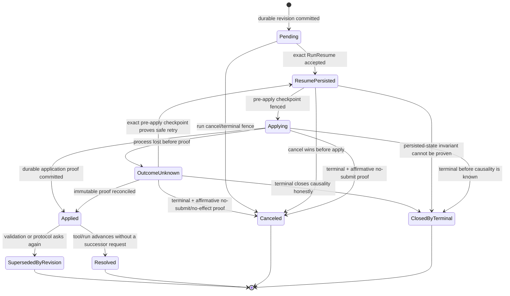

# ADR-014: Stable Interaction Owner and Decision Recovery

## Status

Accepted as the target cross-repository interaction protocol after independent P0/P1 review. Implementation remains pending;
because the Agent portion is core-adjacent, it requires an explicit implementation notice before code changes begin.

**Date:** 2026-07-30

**Deciders:** LordFoxFairy, Kokoro architecture review

## Context

Kokoro 已经具备一条正确的大方向：GA 是执行事实 owner，Session 只消费 GA durable evidence，Web 只读取
Session projection；人类决定由 Session 先持久化，再通过 durable control outbox 发送 `run.resume`。但当前
Interaction identity 把四种不同生命周期的身份压成了一个 `tool_id`，合法的多轮人机交互因此可能被判成
不可恢复的数据冲突。

### P0 根因

当前 Agent emitter 对 `tool.awaiting_approval` 使用：

```text
semantic_key = "action_owner:" + tool_id
```

同一个 semantic key 只允许一个 payload digest。这个不变量只适用于“一次工具调用最多产生一个且永不变化的
暂停请求”，不适用于已经存在的通用 `request_human` / `request_input` 语义：

1. `request_input` 首次以 `request_id == tool_id` 暂停；
2. 用户提交结构化值；
3. 值未通过 schema 校验时，GA 在同一个工具调用、同一个 `request_id` 上重新 interrupt；
4. 新帧合法地增加 `validation_error`，因此 payload digest 改变；
5. durable output source 和 critical-frame registry 仍把它认作同一个 immutable frame，抛出
   `semantic critical frame conflict for 'action_owner:<tool_id>'`；
6. 一个本应展示“请修正表单”的业务状态被错误收口为 `run.failed`。

这不是单点 key 命名问题。现有跨仓模型同时把错误假设固化了：

- Agent V1 `ActionOwnerEvidence.owner_version` 被约束为常量 `1`；
- Agent durable output source seed 同样只包含 `run/kind/tool_id`，无法表示下一轮；
- Session `human_decision_owner_projection` 以 `(site, session, run, owner_ref)` 为主键，重复 owner 只接受
  完全相同的 payload digest；
- Session 为初次 owner 创建一个 MessagePart，却没有“同一逻辑请求的新 revision”投影路径；
- Session 把最后一个浏览器 `command_id` 同时用作整组 `run.resume.decision_id`，混淆了“用户命令已记录”与
  “GA 已持久化/应用一次恢复控制”；
- Web 无法区分网络重试、旧表单提交、合法重问和真正的新请求。

简单地把 payload digest、event index 或 checkpoint id 拼进现有 key，只会把同一个逻辑交互伪装成多张互不
相关的卡片；原位覆盖旧 payload 则会抹掉决定、审计与 stale 检测。需要在 owner、revision、projection、
human decision 和 control resume 之间建立明确边界。

Kokoro 仍受以下约束：

- 四个 `kokoro-*` 仓库独立发布；跨仓只走 Root 权威的版本化 durable/Connect/HTTP/SSE contract；
- GA 只消费 opaque `namespace`，不得获得 Site、账户、支付或用户身份；
- LangGraph checkpoint、`interrupt` / `Command(resume=...)`、terminal fence 和 handoff 是 GA 核心语义，
  不能为投影方便而替换；
- Agent 是 Interaction 执行事实 owner；Session 是浏览器投影、人类 command/receipt 和 control outbox owner；
- 项目尚未上线，不存在必须迁移或兼容的旧生产数据，可以执行一次干净 hard cut；
- durable evidence 与 control inbox 必须在进程崩溃、消息重复、Redis 丢失和 worker lease 交接后保持一致。

## Decision

### 1. 冻结四个身份平面

我们将使用四个互不替代的身份平面。类型名必须在 Python、Protobuf、TypeScript 和数据库中保持同义，禁止
把它们都命名为 `id` 后依赖调用约定猜测。

| 身份平面 | Canonical fields | Owner | 生命周期 | 用途 |
|---|---|---|---|---|
| Interaction Owner | `interaction_owner_ref` + `owner_revision` | Agent | owner 在一个 Run 内稳定；revision 单调递增 | 表达“同一个逻辑问题/审批”的当前轮次 |
| Projection Event | `projection_event_ref` | Agent | 每个 owner revision 永久唯一、immutable | durable evidence、Session inbox、SSE projection 幂等 |
| Human Decision | `command_id -> decision_id + decision_receipt_ref` | Web command / Session decision | 每次针对某一 exact revision 的用户命令与 accepted decision 可对账 | 浏览器重试、审计、权限与 request digest |
| Resume Control | `resume_ref` + stable `resume_receipt_ref` + revisioned `resume_receipt_event_ref` | Session 发起、Agent 回执 | 每个完整 decision group 的一次 GA 恢复唯一；receipt event 单调追加 | `RunResume` inbox 去重、apply、recovery 与 receipt head 对账 |

`owner_revision` 不是可编辑的乐观锁版本，而是 Agent 分配的事实序号。一个 Interaction revision 的完整身份为
`(run_id, interaction_owner_ref, owner_revision)`。`projection_event_ref` 是这个 revision 的 durable 发布身份，
不能拿 Redis message id、producer instance、递增 stream index、Mongo `_id` 或 Session event cursor 替代。

`decision_receipt_ref` 与 `resume_receipt_ref` 也是不同对象：前者证明 Session 接受了哪一位用户对哪一个 revision
做出的决定；后者是一次恢复控制回执的稳定 owner，真正的状态事实由 revisioned、append-only
`resume_receipt_event_ref` 证明。UI 可以从前者链接到稳定 receipt owner，
但恢复入口始终是原 browser command identity 对应的 command receipt，再到 decision receipt，最后才到可选的
resume receipt；不得把三者状态合成一个模糊的 `applied`。

所有 transport locator（Kafka/Redis message id、durable sequence、PostgreSQL inbox row id、Mongo ObjectId）只是
投递元数据，不属于上述身份平面，也不得成为业务 join key。

### 2. 确定性生成 Owner、Projection 和 Resume identity

所有派生 ref 使用带版本和域分隔的 SHA-256，输出固定前缀加 base32/hex 截断；输入先按 contract 定义的
canonical protobuf bytes 或 canonical JSON bytes 序列化。不得使用 Python `hash()`、对象 `repr`、当前时间、
进程随机数、Redis index 或无序 map iteration。

#### 2.1 Interaction Owner

`application_request_ref` 表示工具/应用协议眼中的一次人类请求；它不是 LangGraph interrupt identity。GA 必须在
调用 `interrupt()` **之前**把 origin descriptor 持久化，并由该 journal 分配稳定 ordinal：

```text
application_request_ref = "areq_" + digest(canonical(
  "kokoro.application-request.v2",
  run_id,
  stable_task_path,
  origin_tool_call_ref,
  interaction_kind,
  elicitation_ordinal
))

origin_key = canonical(
  run_id,
  stable_task_path,
  origin_tool_call_ref,
  interaction_kind,
  application_request_ref
)

interaction_owner_ref =
  "iown_" + digest("kokoro.interaction-owner.v2\0" + origin_key)
```

- `run_id` 保证 Continue/Fork/Regenerate 创建新身份；不加入 Site/user 等 GA 不应理解的轴；
- `stable_task_path` 是经过 Agent adapter 资格验证并持久化的 task/subgraph path，不是 worker/pod 名；
- `origin_tool_call_ref` 对主图采用真实 LangChain tool call id，对 nested/subagent 采用稳定 task invocation ref；
- `elicitation_ordinal` 是 GA 对一个 persisted `(stable_task_path, origin_tool_call_ref)` 从 1 开始分配的逻辑请求序号；MCP server
  临时 request id、网络 attempt id 和当前 interrupt id 均不得参与 owner identity；
- middleware pre-approval/result-review 也通过同一 journal 使用明确的 application stage；一个 tool attempt 内的
  多次独立 elicitation 各有不同 ordinal；schema validation 重问复用同一 ordinal/application request/owner，但必须
  创建 `owner_revision + 1` 和新的 projection event，不能原位覆盖或复用已决定的 revision。

origin journal 是 immutable、keep-first 的 **origin/ordinal map**，只保存 `run_id`、stable task path、
`origin_tool_call_ref`、elicitation ordinal、application request ref、interaction kind、immutable base descriptor/schema
digest、continuation/effect idempotency ref/digest 和 origin key digest。它不保存 lifecycle state、checkpoint fence、
accepted response、decision、resume 或 application proof。checkpoint/frame 属于 immutable owner revision；accepted
decision/response/resume 属于下述按 owner revision append-only 的 `InteractionRevisionResumeBinding`；application
outcome 属于 transition/proof ledger。首次执行先提交 origin row，再创建 revision 和调用框架 interrupt。

每次同一 framework task/tool 的执行或 checkpoint re-entry 都建立一个只驻留于该次调用栈的
`invocation_elicitation_cursor`，初值为 1。它不是 durable identity，也不使用 MCP request id；它只表示本次远端调用
按协议实际到达的第 N 个独立 elicitation。每次到达时必须按下列算法处理：

1. 以 `(run_id, stable_task_path, origin_tool_call_ref, invocation_elicitation_cursor)` 查询 origin journal；task path 是
   identity/index 的组成部分，不能在查到行后才作为普通字段校验；
2. 已有行时复用该行的 elicitation ordinal、application request ref 和 owner，并逐字校验 interaction kind、base
   descriptor/schema、continuation/effect fence；任一 digest 改变即 `INTERACTION_ORIGIN_CONFLICT`；
3. 再读取该 owner 的 current revision/head 和 exact `InteractionRevisionResumeBinding`。current revision 尚未绑定
   response 时，只复用或发布该 pending revision；已有 binding 时，从 binding 指向的 immutable control inbox member
   取得 exact resume value，并在相同 task-local revision 位置调用 LangGraph `interrupt()` 让 checkpoint 消费；
   origin row 本身永远不能回答“用户已经响应了吗”；
4. response 通过 validation 时，该 logical elicitation 才完成；response 未通过 schema/protocol validation 时，在
   successor whole-frame transaction 中保留 revision N 的 decision/binding，写 validation proof，并创建同一 owner 的
   revision N+1、新 projection event 和新 group revision。cursor 保持 N，新的用户响应只能绑定 revision N+1；
5. 只有 exact cursor key 不存在 origin row 时，才能在 Mongo transaction 中把该 cursor 值分配为下一
   `elicitation_ordinal`；cursor 与该 `(run, stable_task_path, origin tool)` 的 durable head 不一致、跳号或已有更大
   ordinal 时 fail-closed；
6. 处理完一个**独立 remote elicitation** 后 cursor 才加一。validation successor 无论产生多少 revision 都不推进
   cursor，也不分配下一 ordinal；
7. replay 中远端 server 先重新发出已处理的 ordinal 1 时，步骤 1--4 必须复用 ordinal 1、current owner revision 和
   exact revision binding；只有该 logical request 已通过 validation 且 server 随后确实发出第二个独立请求时，步骤 5
   才分配 ordinal 2。

因此 origin journal 是“按 stable task 调用位置查询 immutable origin”的 replay map，不是 pending/response counter。
进程重启、连接重建、validation retry 和 continuation resume 都必须用 origin row + owner head + append-only revision
binding 三者恢复，任何一层缺失或 digest 不一致均 fail-closed。

MCP/工具在发起 elicitation 前若已经产生外部副作用，只有持久化的 effect idempotency receipt 或可恢复
continuation handle 才允许发布 revision。副作用 outcome 不明且两者都没有时，由独立 tool-effect journal / revision
transition 记录 `outcome_unknown`，停止自动重放并要求对账；immutable origin row 不承担 effect 状态，也不得靠重新
调用 MCP 来“找回”请求。

两个真正独立的询问不得共享 application request ref。base descriptor 不含 validation error、attempt number 等
revision presentation；这些变化只进入 projection payload。相同 `(run, stable task path, origin tool, ordinal)` 出现不同 **base**
descriptor/schema digest 是 `INTERACTION_ORIGIN_CONFLICT`，不可 last-write-wins；要改变请求契约必须分配下一
elicitation ordinal。Agent/框架升级必须先通过 snapshot replay vectors，证明 stable task path 与 origin tool ref
在 crash/restart 后保持稳定。

`decision_group_ref` 同样由 Agent 生成：它 hash `(run_id, logical frame origin, ordered
interaction_owner_refs)`，只描述逻辑 pending group，不包含 revision。member 顺序只能取
`(stable_task_path, langgraph_interrupt_ref, in_frame_ordinal)` 的框架稳定顺序，禁止按 tool id 字典序、事件到达顺序
或 Session 查询顺序重新排序。初次 group 为
`decision_group_revision = 1`；任一 member 合法进入 successor revision 时，Agent 用 CAS 把 group revision 加一并
冻结新的 ordered member-revision vector。成员集合改变表示新的 logical group，必须产生新的 group ref，不能在
旧 group 上增删成员。Session 不分配 group ref/revision。

初次请求分配 `owner_revision = 1`。相同 origin、相同 canonical payload、相同 checkpoint fence 的 replay 返回
已有 revision，不分配新号。同一 application request 的 schema/protocol validation 失败是明确的 successor cause：
前一 revision 的 decision + resume binding 与 validation proof 已持久化后，Mongo whole-frame CAS 分配
`owner_revision + 1`，复用 owner/application request/elicitation ordinal，但生成新的 group revision、projection ref、
payload 与 pending checkpoint fence。真正独立的新询问必须分配下一 elicitation ordinal 和新 owner。前一决定尚未
绑定却出现不同 payload、没有 validation/successor proof 就加 revision，或 revision 跳号，都是
`INTERACTION_OWNER_CONFLICT`，不可“最后写入者获胜”。

#### 2.2 Projection Event

```text
projection_event_ref = "ipev_" + digest(canonical(
  "agent-execution-evidence@v2",
  run_id,
  interaction_owner_ref,
  owner_revision
))

group_projection_ref = "igpev_" + digest(canonical(
  "agent-execution-evidence@v2",
  run_id,
  decision_group_ref,
  decision_group_revision
))
```

`projection_event_ref` **只**由 contract major、Run、owner 和 revision 派生。`predecessor_projection_event_ref`、
`predecessor_evidence_sha256`、`projection_payload_sha256`、`pending_frame_digest` 与 canonical evidence digest 是
彼此独立的受检字段，不参与 ref 生成。revision 1 的 predecessor ref/digest 都缺席；revision n 必须同时指向并
校验 revision n-1 的 ref 与 canonical evidence digest。
同一 revision replay 必须得到同一个 ref 和 byte-equivalent evidence；同 ref 任何 predecessor/frame/payload/evidence
bytes 变化都是 `PROJECTION_EVENT_IDENTITY_CONFLICT`，Agent 与 Session 都必须 fail-loud。revision 改变必然产生
新 ref。它是 group envelope 内 member 的 semantic event identity；envelope outer `event_id` 使用下述
`group_projection_ref`。`evidence_ref` 可继续作为读取 locator，但不能作为 projection identity。

`group_projection_ref` 遵守同一纪律：只由 contract major、Run、group 和 group revision 派生；frame/member-vector/
envelope digests 独立校验，同 ref mutated bytes fail-loud。

`recorded_at`、producer instance/generation 等不参与 identity 的 metadata 在首次事务 commit 时 keep-first 冻结；
任何 replay 都读取并发布已存 canonical bytes，不按当前时间或接管它的 worker 重新序列化 evidence。

#### 2.3 Application request 与 LangGraph interrupt 分离

Agent 私有 `PendingFrameTopology` 保存 exact checkpoint anchor/digest，以及按稳定框架顺序排列的：

```text
stable_task_path
langgraph_interrupt_ref
in_frame_ordinal
ordered (interaction_owner_ref, owner_revision, application_request_ref)
resume_adapter_kind
```

`application_request_ref` 用于业务请求/决定关联；`langgraph_interrupt_ref` 只用于 Agent 在当前 snapshot 中定位
框架 interrupt。二者不得相等假设、互相推导或复用字段名。Topology 的 public commitment 是
`pending_frame_digest`；Session 只接收 digest 和 ordered owner revision refs，不接收 graph route。

Agent 收到 V2 resume 后，必须同时读取当前 LangGraph snapshot 与 persisted topology，逐项核对 task path、
interrupt ref、ordinal、owner revision 和 application request，再由 `resume_adapter_kind` 构造
`langgraph_interrupt_ref -> adapter resume value` 的多-interrupt map。无法一一对齐时拒绝/ supersede；禁止降级成
“按列表顺序碰运气”。当前只 hash interrupt id 集合的弱 fingerprint 被删除，digest 无法取得时 fail-closed。

Pinned LangGraph 的 `Command.resume` 原生支持 `dict[interrupt.id, value]`，同一 node 内的多个 interrupt 又按 task
内调用顺序匹配；因此 adapter 应忠实持久化并使用该 topology，不再把 application request id 塞进 framework route。

构造结果先作为 Agent-private `ResolvedPendingFrame` 持久化到同一 control inbox transaction：每个 interrupt 保存
ordered owner revisions、adapter kind、bounded/encrypted adapter resume value 及 digest。`Command(resume=map)` 只从
这份 resolved frame 构造，绝不直接使用 Session JSON；restart 复用同一 bytes/digest，不能再次解释为另一条 route。

#### 2.4 Human Decision

Web 对一次点击生成 UUIDv7/同等 128-bit `command_id`，并在超时重试、页面 reattach 和 receipt 查询中复用；
它是 browser command identity，不是 accepted human decision identity。Session 先以 authenticated actor、subject
generation、operation、idempotency key 和 request digest keep-first 写 command receipt，再在接受命令时派生：

```text
decision_id = "dec_" + digest(canonical(
  site_id, session_id, run_id,
  interaction_owner_ref, owner_revision, projection_event_ref,
  actor_subject_ref, actor_subject_generation,
  command_id, request_digest
))

decision_receipt_ref = "drcpt_" + digest(canonical(
  site_id, session_id, run_id,
  interaction_owner_ref, owner_revision, projection_event_ref,
  actor_subject_ref, actor_subject_generation,
  decision_id
))
```

相同 `command_id`/idempotency key 与相同 digest 返回同一 command + decision receipt；相同 command identity 不同
digest 返回 `IDEMPOTENCY_CONFLICT`。不同 command 竞争同一 revision 时，唯一约束只接受一个 decision；失败的
command receipt 以 typed `INTERACTION_ALREADY_DECIDED` 链接 winning decision receipt，绝不生成第二个 decision。
决定必须精确绑定 owner revision、projection event、application request、input schema ref/digest、allowed action set
和 authorization epoch。Session 不接受只带 `owner_ref` 的决定。

#### 2.5 Resume Control

当一个 decision group 的 exact revision members 全部有有效决定时，Session 只能沿用 Agent group evidence 已冻结
的 member ordinal，不能自行 sort；然后派生：

```text
resume_ref = "rsm_" + digest(canonical(
  "kokoro.run-resume.v2",
  run_id,
  decision_group_ref,
  decision_group_revision,
  pending_frame_digest,
  ordered(projection_event_ref, decision_receipt_ref, decision_payload_digest)
))

resume_receipt_ref = "rrcpt_" + digest(canonical(
  "kokoro.run-resume-receipt.v2",
  run_id,
  resume_ref
))
```

任何 member、顺序、payload、frame 或 group revision 改变都会得到不同 `resume_ref`。同一组决定的事务重试得到
相同 ref。它不是最后一个 `decision_id`，也不是任一用户 command receipt。receipt 的状态变化不能覆盖这个稳定
identity；每次变化由下一节定义的 immutable receipt event 表达。

successor pending frame 必须从 GA 当前 snapshot 重新冻结 group。已经 `applied` 的 revision 不能作为新 group 的
member，旧 decision receipt 也不能跨 group revision 充当批准；若框架再次提出同一组逻辑请求，则所有重新出现的
member 都产生 successor revision。这样不会把上一轮批准自动带到已改变的风险、schema 或上下文。

### 3. 对 `RunResume` 和 receipt 执行 hard cut

Root 发布 successor `session-agent-control@v2`。V2 `RunResume` 采用下列语义，不保留 V1 字段的双重解释：

```text
RunResumeV2
  run_id
  resume_ref
  pending_frame_digest
  decision_group_ref
  decision_group_revision
  ordered decisions[]
    interaction_owner_ref
    owner_revision
    projection_event_ref
    application_request_ref
    decision_receipt_ref
    typed decision payload
```

V2 wire **没有** `thread_id`、checkpoint namespace/id、`langgraph_interrupt_ref`、tool id、task path、resume target、
interrupt ordinal 或任何可指定 graph route 的字段。Agent 通过 `run_id` 从自己的 execution-context authority 取得
已绑定 checkpoint；Session 只提交对 exact application request/owner revision 的决定。Agent 以当前 snapshot +
persisted `PendingFrameTopology` 验证 ordered decisions，再自行构造一个或多个 interrupt id 的 resume map。含未知
route 字段的 payload 在 strict contract boundary 被拒绝，Web/Session 永远不能选择 GA 从哪个 graph interrupt
恢复。其中 `application_request_ref` 由 Session 从 immutable member projection 组装，不接受 Web 覆盖。

typed decision payload 必须有 contract 级 byte/depth/item 上限和 data classification。用于展示的 schema/context
不能含 secret 值；OAuth token、API key 等凭据必须走 Platform/Hub secret broker 并在 decision 中只传 audience-bound
handle。确有敏感业务输入时，Session outbox 与 Agent control inbox 使用受控 envelope encryption、日志只记 digest，
并在 resume terminal/retention watermark 后清除 ciphertext；任何 secret/sensitive value 不进入 MessagePart、SSE、
receipt safe payload 或 tracing attribute。

Agent 在接受 exact member decision 时创建下列私有 immutable binding；它不是 origin journal 的字段，也不是可以原位
更新的 owner head：

```text
InteractionRevisionResumeBinding {
  run_id,
  interaction_owner_ref,
  owner_revision,
  projection_event_ref,
  application_request_ref,
  decision_group_ref,
  decision_group_revision,
  group_member_ordinal,
  decision_receipt_ref,
  decision_payload_digest,
  resume_ref,
  resume_request_digest,
  resolved_value_locator,
  resolved_value_digest
}
```

同一 `(run_id, interaction_owner_ref, owner_revision)` 最多一条 binding；相同 bytes 重放 no-op，不同 bytes
`REVISION_RESUME_BINDING_CONFLICT`。binding 只能指向该 revision 所在的 exact group/member/control inbox，resolved value
通过受限/encrypted locator 取得并逐 digest 校验。validation 失败不会修改这条 binding；successor revision 在收到新
决定前没有 binding，收到后追加自己的 binding。retention 清除 sensitive ciphertext 时保留 locator tombstone、digest
和 decision/resume lineage，确保历史不能被另一份 response 重新绑定。

Agent control inbox 以 `(run_id, resume_ref)` keep-first，并同时保存 request digest、pending frame digest、ordered
application-decision digest 和 current receipt head。第一次收到 control 时必须在同一事务中执行 proof-bound CAS：

- exact frame/group/member 全部匹配：`absent -> persisted`，同时插入每个 member 的 immutable revision binding；
- 非 terminal frame/head 已前进，且 durable successor/frame proof 与 inbox-absence/no-submit invariant 同时成立：
  `absent -> superseded`，持久化 proof ref/digest，不调用 `Command`；
- terminal fence 已赢且 terminal evidence 可验证：`absent -> closed_by_terminal`，持久化 terminal proof ref/digest，
  不把 late resume 伪装成 rejected/stale；
- 同 ref/同 digest：返回 current resume receipt head，不新增 event、不二次 apply；
- 同 ref/不同 digest：`RESUME_IDENTITY_CONFLICT`，fail-loud；
- 已存在 control 的 frame 随后前进或 owner revision 改变：只有 nonterminal successor + no-submit/no-apply proof 才记
  `superseded`；run terminal 则记 `closed_by_terminal`；
- frame 完全匹配：`persisted -> applying`，只有 durable application proof 才能进入 `applied`；
- apply outcome unknown：进入 `outcome_unknown`，按 checkpoint/progress/terminal evidence 对账，绝不盲目二次执行。

Agent 发出的 internal control receipt 改为：

```text
RunResumeReceiptV2 {
  run_id,
  resume_ref,
  resume_receipt_ref,
  resume_receipt_event_ref,
  resume_receipt_revision,
  predecessor_receipt_event_ref?,
  predecessor_receipt_event_sha256?,
  request_digest,
  receipt_event_sha256,
  status: persisted | applying | applied | superseded | rejected | outcome_unknown | closed_by_terminal,
  disposition_proof_ref?,
  disposition_proof_sha256?,
  application_proof_ref?,
  application_proof_sha256?,
  applied_checkpoint_ref?,
  terminal_evidence_ref?,
  safe_code?
}
```

`resume_receipt_ref` 是 receipt aggregate 的稳定 identity；每次合法 control transition 以 CAS 分配
`resume_receipt_revision`（从 1 连续递增）并生成：

```text
resume_receipt_event_ref = "rrcev_" + digest(canonical(
  "kokoro.run-resume-receipt-event.v2",
  run_id,
  resume_ref,
  resume_receipt_revision
))
```

revision 1 的 predecessor fields 必须缺席；revision N 必须引用 N-1 的 exact event ref 和 canonical event digest。
`receipt_event_sha256` 覆盖除自身字段外的完整 canonical receipt event，包括 status、request digest、predecessor 和
proof digests。同 ref/revision mutated bytes fail-loud；相同状态的 transport retry 返回现有 head，不制造空转 revision。
`superseded` 必须携带 nonterminal successor/frame + no-submit proof；`closed_by_terminal` 必须携带 terminal evidence；
`applied` 必须携带 application proof。receipt event、control head、proof 和 durable outbox 在同一 Mongo transaction
提交。

Session 的每个 human decision receipt 始终证明“决定已记录”。当 group 形成后，它只增加一个稳定的
`linked_resume_receipt_ref`；GA 的 revisioned control receipt events 更新独立 resume projection，不修改 human
decision receipt，也不把 mutable status 塞回 decision row。

V1 `run.resume.decision_id` 在切换时删除。因为没有生产数据，本 ADR 不授权 V1/V2 长期双写、payload 猜测、
缺字段默认值或从最后一个 decision 反推 resume identity。

### 4. 发布 Agent durable Interaction boundary V2

Root 发布 `agent-execution-evidence@v2` 的 `InteractionOwnerRevisionEvidence`，取代 V1 action owner 的
`owner_version = 1` 假设。每个 evidence 至少包含：

| Field | 约束 |
|---|---|
| `interaction_owner_ref` | 同一 Run 内稳定；由 Agent 决定 |
| `owner_revision` | 从 1 开始连续递增 |
| `projection_event_ref` | 本 revision 的 immutable semantic event id |
| `predecessor_projection_event_ref` | revision 1 缺席；其余必须指向 revision - 1 |
| `predecessor_evidence_sha256` | revision 1 缺席；其余精确校验 predecessor canonical bytes |
| `projection_payload_sha256` | canonical safe projection payload digest；与 ref 独立校验 |
| `interaction_kind` | `approval / question / structured_input / result_review / plan` 闭集 |
| `application_request_ref` | 应用请求关联；不是 graph interrupt/ref |
| `decision_group_ref/revision` | 当前 pending group identity |
| `group_member_ordinal` | Agent 冻结的 frame order；Session 不重排 |
| `required_owner_revision_refs` | 有序、唯一、包含自身 |
| `pending_frame_digest` | exact checkpoint/pending-frame fence |
| safe presentation fields | 继续受 Agent redaction、深度、大小与 schema 护栏 |
| `recorded_at` | 观测字段，不参与 identity |

V2 继续携带现有 authenticated common envelope 中的 run、dispatch、producer generation、durable sequence 和
evidence digest；这些字段的授权/fencing 不能因增加 projection identity 被删除。LangGraph interrupt ref/task path
只存在 Agent private topology，不能进入 Session projection、browser-safe payload、snapshot 或 SSE。

整帧不是 N 个可独立发布的 owner 事件。V2 `InteractionGroupRevisionEvidence` 是一个有界 envelope，包含 group
ref/revision、frame digest、group projection ref，以及按 `group_member_ordinal` 排列的全部
`InteractionOwnerRevisionEvidence`。Agent 在一次 Mongo transaction 中建立整组事实；Session 也在一次
Serializable transaction 中投影整组。单个 owner `projection_event_ref` 继续满足上节公式并建立唯一约束，group
envelope 只提供原子传输/校验边界，不能让半组先进入 browser projection。

单 owner 的展示修订是 successor revision，不是对旧 evidence 的 UPDATE。计划提案若真正重新提案，同样使用
owner/revision 模型；普通计划进度仍不是 Interaction owner。Session 不解析 checkpoint，不重算 owner ref，不从
raw event 猜 revision。

Agent 采用 Hexagonal Architecture：纯函数 `InteractionIdentityFactory` 负责 canonical identity，
`InteractionOriginJournal` 只固定 immutable application origin/ordinal，`InteractionRevisionBindingRepository` 按 exact
owner revision append decision/response/resume binding，`InteractionGroupRepository` 负责整 frame UoW/CAS，
`InteractionEvidenceOutbox` 与 `ResumeReceiptEventRepository` 负责两类 durable evidence，`ResumeTopologyAdapter` 才能把
已验证 binding 转成 framework map；
LangGraph adapter 只把框架 snapshot 收窄为 typed `PendingInteractionFrame`。框架 `Any`、Pydantic validation 和
protobuf parsing 只能出现在 adapter boundary，domain 不依赖 Redis/PyMongo/LangGraph object。

### 5. Agent 状态机与 successor durable boundary

逻辑 owner、group 和 immutable revision 分开建模。Group head 是一次 resume 的状态机 owner；member owner heads
随 group transition 在同一事务中推进，不能出现“半组 applied”。状态词汇由本节唯一拥有，Mongo、Proto、Session
和 Web 必须从 Root contract 生成 exhaustive discriminated union，不得各自增加近义状态或用自由字符串。

Group/member revision 的闭集为：

```text
pending | resume_persisted | applying | applied | outcome_unknown |
resolved | superseded_by_revision | canceled | closed_by_terminal
```

Control inbox/receipt 的闭集为：

```text
persisted | applying | applied | outcome_unknown | superseded | rejected | closed_by_terminal
```

`superseded` 只属于一次 control attempt：它证明 current frame 已经前进且该 control 没有 apply。interaction predecessor
被合法 successor 替代时使用 `superseded_by_revision`；terminal 造成的关闭一律使用 `canceled/resolved/
closed_by_terminal`，禁止把三种语义压成 `superseded`。

Group/member revision 只允许以下单调状态：



Control attempt 的完整 transition table 为：

| From | To | 唯一允许的 proof / cause |
|---|---|---|
| absent | `persisted` | exact resume identity、group/member/frame 与 request digest 在 inbox transaction 中通过 |
| absent | `superseded` | durable nonterminal successor/frame proof + inbox-absence/no-submit invariant；必须写 disposition proof ref/digest |
| absent | `closed_by_terminal` | terminal fence/evidence 已存在；必须写 terminal proof ref/digest |
| absent | `rejected` | contract/auth/digest/decision 不合法；不改变 group/member state |
| `persisted` | `applying` | exact pre-apply checkpoint fenced，resolved frame 已持久化 |
| `persisted` | `superseded` | 非 terminal 的 current frame/head 已前进，且证明 Command 从未提交 |
| `persisted` | `closed_by_terminal` | terminal fence 已赢；interaction group/member 按下述 terminal matrix 收口 |
| `applying` | `applied` | immutable successor/progress/effect/terminal application proof |
| `applying` | `outcome_unknown` | 进程丢失且没有足够 proof 判定是否 apply |
| `applying` | `superseded` | 非 terminal frame 已前进且有 affirmative no-submit proof |
| `applying` | `closed_by_terminal` | terminal 已赢；receipt 保留 applied/no-submit/unknown safe reason |
| `outcome_unknown` | `applied` | 后续取得 immutable application proof |
| `outcome_unknown` | `persisted` | exact pre-apply checkpoint、topology 与 no-effect proof 同时证明可安全重试 |
| `outcome_unknown` | `superseded` | 非 terminal successor/frame proof + affirmative no-apply proof |
| `outcome_unknown` | `closed_by_terminal` | terminal 已赢且不能或无需再执行；保留 causality reason |

`applied/superseded/rejected/closed_by_terminal` 是 control terminal states；同一 `resume_ref` 不得从这些状态重新进入
执行。Group/member 的 `resolved/superseded_by_revision/canceled/closed_by_terminal` 同样是 terminal states。

V2 首版不定义独立的超时 state。deadline 超时的 command 以 typed `INTERACTION_DEADLINE_ELAPSED` 拒绝；若产品策略要
主动关闭 pending interaction，必须经 Agent 的显式 cancel/terminal fence 进入 `canceled`，并携带
safe reason=`deadline_elapsed`。Session/Web 不得仅根据本地时钟发明 terminal state。

合法重问的 successor checkpoint + interaction candidate 本身就是 predecessor application proof：Agent 在**同一个**
Mongo transaction 中验证该 proof、把 predecessor 推进 `applied/superseded_by_revision`、创建整个 successor group
revision 与全部 owner revision、更新 heads、写 immutable evidence、分配 durable sequence 并加入 critical outbox。
不存在“先标 applied、稍后再尽力补 successor frame”的窗口。新 revision 状态为 `pending`，旧 payload、decision
和 receipt 永不覆盖。

仅仅调用/spawn `Command(resume=...)` 成功不是 `applied` proof。Agent 在 apply 前保存 exact checkpoint
ref/digest。状态只有在下列一种 immutable proof 出现后才能进入 `applied`：

1. successor checkpoint 的 parent/fence 等于 pre-apply checkpoint，且 checkpoint metadata 与 persisted
   interaction topology 共同绑定同一 `resume_ref`；
2. durable interaction successor、resolved/progress 或 tool-effect marker 显式引用该 `resume_ref`；
3. terminal evidence 显式携带 causal `resume_ref`。

proof row、control inbox transition、group/member transition、next immutable receipt event/head 和 receipt outbox 必须
同一 Mongo transaction 提交；若 LangGraph checkpoint 由 framework checkpointer 先独立提交，reconciler 读取其
immutable ref/digest 后，再用一个受 checkpoint fence 约束的短事务原子写入上述事实。不得从当前 graph state 文案
推测 applied。

`outcome_unknown` 不允许靠超时猜成未应用。只有 exact pre-apply checkpoint 仍是当前 checkpoint，tool-effect
journal 证明没有不可重放的 unknown effect，且 topology 仍逐项匹配时，才能把**同一** `resume_ref` 放回
`resume_persisted`；否则停止自动执行并告警。

终态 fence 仍优先：terminal 已分配后不得创建 successor revision；并发 terminal 与 re-interrupt 由同一 run
document 的 generation/terminal fence CAS 决胜。terminal evidence transaction 必须扫描并收口本 Run 的全部
nonterminal group/member/control head。每个起点只有下表中的合法终点：

| Terminal 到达时的 group/member state | Proof | Group/member 唯一终点 | 对应 control 唯一终点 |
|---|---|---|---|
| `pending` | 尚无 accepted resume | `canceled` | 不存在 control；若 late control 随后到达则 `closed_by_terminal` |
| `resume_persisted` | invariant 证明 Command 尚未提交 | `canceled` | `closed_by_terminal`，safe reason=`not_submitted` |
| `resume_persisted` | persisted-state/no-submit invariant 无法验证 | `closed_by_terminal` | `closed_by_terminal`，safe reason=`state_invariant_lost` |
| `applying` | immutable application proof | `applied -> resolved` | `applied`，terminal evidence 作为 application proof |
| `applying` | affirmative no-submit/no-effect proof | `canceled` | `closed_by_terminal`，safe reason=`not_submitted` |
| `applying` | apply causality 仍不明 | `closed_by_terminal` | `closed_by_terminal`，safe reason=`outcome_unknown` |
| `outcome_unknown` | immutable application proof | `applied -> resolved` | `applied` |
| `outcome_unknown` | affirmative no-submit/no-effect proof | `canceled` | `closed_by_terminal`，safe reason=`not_applied` |
| `outcome_unknown` | 无法取得肯定 proof | `closed_by_terminal` | `closed_by_terminal`，safe reason=`outcome_unknown` |
| `applied` | 没有 successor frame | `resolved` | `applied` |

若 successor whole-frame transaction 已先赢 CAS，predecessor 已是 `superseded_by_revision`，terminal transaction
只按同一张表收口 successor group；不得回写 predecessor。`superseded` 不出现在 group/member terminal matrix，因为它
只描述 control attempt。事务完成后该 Run 不得残留 `pending/resume_persisted/applying/outcome_unknown` head。输掉
fence 的 interaction proposal 不发布、不推进 live index，也不留下孤儿 head。

#### 5.1 Mongo collections

目标集合与职责如下；名称可遵守 Agent 现有常量风格，但职责和唯一约束不可合并回一个无界数组：

| Collection | 内容 | 关键索引 |
|---|---|---|
| `agent_run_ledger` | 现有 run claim、lease、terminal fence、active checkpoint、durable counter | unique `_id=run_id`; terminal/lease scan |
| `agent_interaction_origin_journal` | immutable tool origin/ordinal、descriptor/schema、continuation/effect identity；不含 response/resume/state | unique `(run_id,stable_task_path,origin_tool_call_ref,elicitation_ordinal)`；unique `application_request_ref`；unique origin key digest |
| `agent_interaction_owner_heads` | 每个逻辑 owner 的 origin digest、current revision/state/head digest | unique `(run_id, interaction_owner_ref)`；unique `(run_id, origin_key_digest)`；`(run_id,state,updated_at)` |
| `agent_interaction_revisions` | immutable revision payload、predecessor、frame/checkpoint fence | unique `projection_event_ref`；unique `(run_id, owner_ref, revision)` |
| `agent_interaction_revision_resume_bindings` | exact owner revision 的 immutable application request、decision/response digest、resume/member ref 与 encrypted-value locator/digest | unique `(run_id,owner_ref,owner_revision)`；unique decision receipt ref；unique `(run_id,resume_ref,member_ordinal)`；append-only |
| `agent_interaction_transitions` | append-only revision/control state transition + causation ref | unique transition ref；`(run_id,owner_ref,revision,recorded_seq)`；recovery scan |
| `agent_interaction_group_heads` | logical group current revision/state/frame digest | unique `(run_id,decision_group_ref)`；`(run_id,state,updated_at)` |
| `agent_interaction_group_revisions` | immutable group revision/checkpoint/frame/member-vector digest | unique group projection ref；unique `(run_id,group_ref,group_revision)` |
| `agent_interaction_group_members` | immutable ordered owner revisions for one group revision | unique `(run_id,group_ref,group_revision,member_ordinal)`；unique `(run_id,owner_ref,owner_revision)` |
| `agent_pending_frame_topologies` | Agent-private interrupt refs、task paths、adapter kinds 与 owner mapping | unique `pending_frame_digest`；checkpoint lookup；不对外投影 |
| `agent_control_inbox` | 一行一个 resume、private resolved interrupt→revisions→adapter-value map、digest、frame fence、状态、receipt head 和 applied checkpoint | unique `(run_id,resume_ref)`；`(status,updated_at)` recovery scan；TTL 禁止早于 Run retention |
| `agent_control_receipt_events` | immutable revisioned `RunResumeReceiptV2` canonical bytes、predecessor chain 与 proof digests | unique `resume_receipt_event_ref`；unique `(run_id,resume_ref,resume_receipt_revision)`；receipt head pull index |
| `agent_control_application_proofs` | checkpoint/progress/terminal proof ref+digest 与 causal resume | unique `(run_id,resume_ref)`；unique proof ref |
| `agent_execution_evidence` | Root contract canonical group evidence | unique `(run_id,durable_seq)`；unique `group_projection_ref`；pull index |
| existing durable output/outbox | browser output 与 critical delivery | interaction source identity 使用 owner/group projection ref，不再使用裸 tool id |

`control_inbox` 不再作为 run document 中无限增长的 array；否则长期 Run 会逼近 Mongo 16 MiB document limit，
单项 recovery/receipt 也无法获得数据库级唯一索引。

#### 5.2 Transaction boundaries

生产 Agent 必须连接 Mongo replica set 或 mongos；standalone Mongo 在启动 readiness 阶段 fail-fast。不得因为 CI
方便把 transaction 降级为若干顺序写。至少以下写入属于单事务：

1. **prepare origin**：interrupt 前 keep-first immutable origin/ordinal row；existing tool-effect journal 缺少可恢复 proof
   时在那里写 outcome unknown 并停止，绝不把 response/resume/status 回写 origin row；
2. **publish whole frame**：验证 run/terminal/checkpoint fence，在一次事务中 CAS group head 和所有 owner heads，
   插入 group revision/members、全部 owner revisions、private topology、一个 group evidence envelope、全部 durable
   output sources，分配 durable sequence 并 append critical outbox；任一步失败整组回滚；
3. **accept resume**：插入/核对 control inbox，绑定 exact immutable group/member/frame digest，为每个 member 插入
   一条 append-only revision resume binding，创建 receipt revision 1，并在同一事务中把 group 与所有 member heads
   推进到 `resume_persisted`；若 first delivery 已 stale/terminal，则分别以 proof-bound `absent -> superseded` 或
   `absent -> closed_by_terminal` 直接创建 terminal control row + receipt event，不创建 member binding、不调用 `Command`；
4. **record application proof/successor**：验证 checkpoint/progress/terminal/validation proof，原子写 proof、
   control/group/member transitions、next receipt event 和 receipt head；若 proof 是 validation successor interaction，
   保留旧 revision binding，把步骤 2 的整个 successor frame 创建合并进同一事务，复用 origin/ordinal/request/owner
   但分配 owner/group revision +1，不能先标 applied、不能逐 owner 补写；
5. **terminal**：保持现有 owner-completion + terminal evidence 原子分配，并将全部 nonterminal group/member/control
   heads 收口到诚实 terminal state；
6. **retention purge**：只有 Session consumption watermark、control receipt、terminal evidence 和 checkpoint
   retention 条件全部满足后，才事务性清理 child collections。

从 LangGraph 读取 snapshot、执行外部工具或发布 Redis 不能跨 Mongo transaction。application layer 先构造
canonical candidate，再在短事务中验证 checkpoint anchor/generation；commit 后 live publish，失败依赖 durable
outbox 重投。

### 6. Session 使用 immutable revision + mutable head projection

Session PostgreSQL 目标 schema 为：

| Table | Authority / key |
|---|---|
| `interaction_group_projection_inbox` | `group_projection_ref` unique，保存 source producer/generation、envelope digest 与 applied_at |
| `interaction_owner_projection` | `(site_id, session_id, run_id, interaction_owner_ref)` unique；只保存 current head/state |
| `interaction_revision_projection` | `(site,session,run,owner,revision)` PK；`projection_event_ref` unique；immutable safe payload |
| `interaction_group_projection` | `(site,session,run,decision_group_ref)` unique；只保存 current group head/state |
| `interaction_group_revision_projection` | `(site,session,run,group,group_revision)` PK；group projection ref/frame/member digest unique；immutable |
| `interaction_group_member_projection` | exact group revision 的 immutable member ordinal → owner revision/application request；group-revision ordinal unique，且 `(site,session,run,owner,owner_revision)` 全局唯一 |
| `human_decision_record` | `(site,session,run,owner,revision)` 最多一条；`decision_id`/receipt unique；append-only |
| `run_resume_group` | `resume_ref` unique；payload/frame digest、stable receipt ref、current receipt event ref/revision/digest/status；CAS head |
| `run_resume_member` | ordered join 到 exact revision 与 decision receipt；禁止漏项/重复 |
| `run_resume_receipt_inbox` | `resume_receipt_event_ref` unique；authenticated envelope/canonical digest、source cursor、applied_at；keep-first |
| `run_resume_receipt_event` | `(site,session,run,resume_ref,resume_receipt_revision)` PK；event ref unique；predecessor ref/digest 与 canonical bytes immutable |
| `command_receipt` | 保持 Session command authority；链接 decision receipt，不承担 GA resume receipt |

所有表继续按 exact Session login/RLS authority 隔离。GA projector 只能插入 group inbox、immutable group/member/
owner revisions 并单调推进 heads；browser actor 只能对 current pending revision 插入 decision；control worker 只能
读取完整 immutable group、写 resume outbox 和稳定 receipt link；authenticated receipt projector 才能 append receipt
event 并 CAS receipt head；purge login 才能按 retention plan 删除。
Session schema 不含 task path、LangGraph interrupt ref 或 adapter route。

Projector 在一个 Serializable transaction 内执行：

1. 验证 authenticated group envelope、dispatch/run/assistant message fence、group projection ref 与 envelope digest；
2. group inbox keep-first：同 ref/同 digest no-op，同 ref/不同 digest fail-loud；
3. 验证 member ordinal 连续唯一、member-vector digest、每个 owner projection ref/payload/frame/predecessor digest；
   任一 member 错误整组 fail-loud；
4. group revision 1 要求 group 不存在，n 要求 group head=n-1；每个 owner revision 也必须从自己的 head 连续前进；
5. 在写 browser event 前一次性插入 immutable group revision/members/owner revisions 并 CAS 全部 heads；
6. initial owner revision 创建稳定 `part_id = hash(run_id, interaction_owner_ref)`；successor revision 更新同一个
   MessagePart 的 `version/revision/payload/lifecycle`，不创建第二张逻辑卡；
7. 旧 revision 与旧 MessagePart event 保持在 durable event log，snapshot 只展示 head；
8. 初次 group revision 把 Run 投影为 `paused`；successor 到达时 Run 仍应为 `paused`，只推进 projection version/cursor；
9. 按 member ordinal 写全部 `message.part.updated`、一个 `run.view.updated`，推进 event counter，最后标记 group
   inbox applied。事务失败时 browser 看不到半组。

Resume receipt 使用独立的 authenticated projector，并在一个 Serializable transaction 中执行：

1. 以 `resume_receipt_event_ref` keep-first 插入 inbox；同 ref/同 canonical digest no-op，同 ref/不同 digest
   `RESUME_RECEIPT_IDENTITY_CONFLICT`；
2. 校验 `resume_ref` 已存在且 stable `resume_receipt_ref`、request digest 与 Session 发送的 control 完全一致；
3. revision 1 要求 current receipt head 缺席且 predecessor fields 缺席；revision N 必须是 current head revision +1，
   predecessor event ref/digest 必须逐字等于 current head；
4. 插入 immutable receipt event，以 expected old head 做 CAS 更新 `run_resume_group` 的 event ref/revision/digest/status，
   同事务写 resume SSE/outbox 并标记 inbox applied；CAS 失败回滚后按 authoritative head 重放；
5. 收到 future revision 或 predecessor 缺口时不跳号、不覆盖 status，进入有界 retry/DLQ，并调用 Agent 的 authenticated
   `GetRunResumeReceiptEvents(run_id, resume_ref, after_revision, limit)` pull；返回必须包含 stable receipt ref、current
   head ref/revision/digest 和连续 canonical event chain。Session 仍逐 event 执行同一 inbox + CAS，不能把 pull response
   当 snapshot 直接覆盖 head；
6. pull 发现 mutated history、缺失 predecessor 或 Agent head 低于已认证的 Session head时 fail-loud 并隔离该 Run；
   网络/Redis 丢失只允许重试，不允许由 Session 猜测 `applied`。

Agent 的 receipt pull endpoint 只暴露该 Run/resume 的有界 receipt event chain，不暴露 checkpoint、task path、adapter
value 或敏感 decision payload；authorization、retention watermark、response byte/item limit 与 normal internal RPC 一致。

Session 的 authenticated terminal projector 也必须在更新 Run terminal 的同一个 Serializable transaction 中，按
Agent terminal evidence 的 causal resume/proof refs 和 authenticated receipt event 收口所有 nonterminal
group/owner/resume heads，完成或取消对应 MessagePart，并发布 final part/run/resume deltas。terminal commit 后 Session
查询到的 pending/applying/unknown head
数也必须为 0；无法证明 control causality 时投影 state=`closed_by_terminal`、safe reason=`outcome_unknown`，不能假装
`applied`。

乱序 successor 不得跳号应用。它进入有界 retry/DLQ 并等待 predecessor watermark；超过窗口仍缺 predecessor 时
标 `PROJECTION_PREDECESSOR_MISSING`，不能把 n 当作 initial。duplicate、late 和 terminal-after-owner 均按明确
状态机处理，不以 catch-all 忽略。

Browser decision command 的 compare-and-set 必须同时检查：

- owner head 仍为 expected revision/projection event；
- revision 状态为 pending；
- Run 仍 paused 且 projection version 匹配；
- decision kind 在该 revision allowed set；
- input schema ref/digest 匹配；
- actor、authorization epoch、deadline 和 decision group membership 有效。

旧 revision 提交返回 typed `409 INTERACTION_REVISION_STALE`，响应只带 current revision ref、safe current part ref
和 snapshot cursor；不记录 decision、不构造 resume。已经记录的相同 decision retry 即使 head 后续前进，也必须
先命中 keep-first receipt 并返回原 receipt，不能误报 stale。

### 7. Web stale-safe UX

Web 的 Interaction card 以 `interaction_owner_ref` 为稳定 React/store key，以 `owner_revision +
projection_event_ref` 为提交 fence：

- Projection Head Store 与 Command Mutation Journal 是两个 store。SSE/snapshot 只能更新 head，永远不能删除尚未
  对账的 command identity；
- SSE replay 同 ref/同 revision 只合并一次；同 owner 的 revision +1 更新 head，但旧 mutation 保持
  `reconcile_required`，直到 receipt chain 给出终态；
- `command_id`、decision idempotency key、request digest 与 exact owner revision 必须先写 mutation journal 再发
  HTTP。恢复顺序固定为：`command identity -> command receipt -> decision receipt -> linked resume receipt`；Web 不
  允许跳过 command receipt 直接猜 decision/resume ref；
- mutation journal 以 `(site deployment, session, command_id)` keep-first，使用 IndexedDB transaction/CAS 与
  BroadcastChannel 在多 tab 共享；每个 Session 最多保留 256 条、已对账后保留 7 天（更严 Site policy 可缩短），
  超限先清理最旧**已对账**项，未对账项不得被 LRU 静默丢弃；
- 两个 tab 对同一 revision 点击时先竞争同一 journal intent；若仍产生两个 command identity，Session 的“每
  revision 一个 accepted decision”约束只接受一个，另一方查询 authoritative command/decision receipt 并显示
  已由另一窗口处理，不生成第二个 resume；
- journal 对普通字段保存有界 request；被 schema 标为 sensitive 的值只驻留内存。刷新后先查 command receipt，
  未落 Session 时要求用户重新输入而不把明文写入 LocalStorage/IndexedDB；
- 用户正在编辑时收到 successor revision，不静默覆盖草稿、不自动提交；卡片进入“请求已更新”状态，展示新
  validation error/schema，并允许用户显式复制仍兼容的字段；
- 仅在 schema ref/digest 和字段路径/类型一致时提供逐字段复制；secret、file token、permission choice 不复制；
- POST 后先展示“决定已记录”，再独立展示“正在恢复 / 已恢复 / 已取消或关闭 / 结果未知”；V2 首版不渲染独立的
  超时状态，deadline closure 只消费 Agent 投影的 `canceled` + safe reason；
- HTTP 响应丢失时先以 command identity 查询 command receipt；它链接 exact decision receipt，decision receipt 再
  链接可选 resume receipt；任一层暂缺都保持 pending/reconcile，不创建新 identity；
- `INTERACTION_REVISION_STALE` 触发 snapshot rebase，保留本地草稿供人工对照，不自动用新 revision 重发；
- invalid input 导致 revision +1 时，同一张卡展示服务端 safe validation error 和新表单，历史决定在审计视图可见；
- 多 owner group 中，每张卡各有 decision receipt；只有完整 group 才出现一个共享 resume receipt。

Web 不接收任何 LangGraph interrupt/route ref，不本地计算 owner/revision/resume ref，不从文案或 tool name 猜
状态。所有分支使用 TypeScript branded ids、Zod untrusted-boundary parsing 和 discriminated union exhaustive
render；未知 V2 state 显示安全 fallback 并触发 receipt/snapshot refresh，不把未知态当 `pending`。

### 8. Continue、Fork、Retry、Restart 与 Handoff 矩阵

| 场景 | Run identity | Owner identity | Revision / projection | Decision / resume | 规则 |
|---|---|---|---|---|---|
| SSE reconnect / projection replay | 相同 | 相同 | 相同 ref，幂等 no-op | 相同 receipt | 只恢复视图，不触发 GA |
| worker crash / lease adopt | 相同 | 相同 | 相同 | persisted/applying receipt 对账 | 复用 checkpoint；不得重建新 owner |
| `RunResume` transport retry | 相同 | 相同 | 相同 current revision | 相同 `resume_ref` | Agent inbox keep-first，不二次 `Command` |
| schema validation 重问 | 相同 | 相同 | revision +1，新 projection ref | 新 decision；完成后新 resume | 更新同一逻辑卡 |
| 同一 frame 多 owner | 相同 | 各自稳定 | 各自 revision | 多 decision、一个 group resume | ordered members 全齐才恢复 |
| pending 状态的 tool retry/reconcile | 相同 | 相同 | 无新展示事实则 revision 不变 | receipt 对账 | outcome unknown 先对账，不盲重跑 |
| 已知失败后的新 side-effect attempt | 相同或新 Run（由产品命令决定） | 新 owner | revision 从 1 开始，记录 predecessor lineage | 新 decision/resume | 新风险决策不能复用旧批准 |
| terminal 后 Continue | 新 Run | 新 owner | revision 1 | 新 identities | 同 branch 新 user Message；绝不 resume terminal Run |
| Regenerate / terminal retry | 新 Run | 新 owner | revision 1 | 新 identities | 可引用 predecessor Run，但不复用批准 |
| Fork / Branch from message | 新 branch + 新 Run | 新 owner | revision 1 | 新 identities | 历史卡只读，不把未决 owner 带入 fork |
| process/worker handoff | 相同 | 相同 | 相同 | receipt 对账 | lease/producer 变化不是业务 identity |
| Agent-to-Agent graph handoff | 相同 | pending owner 不变；handoff 后新请求为新 owner | pending revision 不变 | pending resume 仍对原 exact frame | handoff 不复制或篡改未决 interaction |
| cancel 与 pending race | 相同，走 terminal fence | owner canceled | 不创建 successor | late resume `closed_by_terminal` | terminal fence 胜出后不 apply；仅非终态 frame 前进时 control 才可 `superseded` |

“Retry”必须由 API/产品语义明确属于表中哪一类，禁止一个裸 `retry=true` 同时表示 transport retry、tool effect
reconcile 和 terminal regenerate。

### 9. 明确不变的 GA 核心不变量

本 ADR 只修复 identity 与 durable projection，不重新设计 Agent：

1. LangGraph `interrupt` 与 `Command(resume=...)` 仍是唯一暂停/恢复机制；不手搓第二套 graph scheduler；
2. checkpoint 是执行连续性 authority；Interaction tables 不能伪造 graph state；
3. application request 与 LangGraph interrupt identity 永久分离；只有 Agent 用 snapshot + private topology 构造
   resume route，Session/Web 不能发送或发明 tool/interrupt id；
4. `namespace` 仍是 GA 唯一 opaque isolation key；新增 identity 不包含 Site/user/payment/plan；
5. run claim、lease fencing、crash adoption、cancel、terminal、owner-completion、handoff 与 checkpoint scope 语义不变；
6. terminal critical evidence 保持一次且有 terminal fence；Interaction successor 不能越过 terminal；
7. Agent 不写 Session message/part，不解释浏览器权限，不扣积分；Session 不执行 Agent、不读 Mongo；
8. durable truth 先于 Redis live publish；Redis stream 仍是可丢失的实时加速层，不是 owner；
9. tool effect 的 keep-first/fencing 与 interaction approval 是两种 receipt，批准不能替代 effect idempotency；
10. graph/handoff 代码的任何额外变更必须另行通知和评审，不能夹在本 ADR 实现中。

此外，V2 只在 identity adapter、durable ledger/evidence 和 cross-repo projection 边界增加事实；不会让 Session
控制 graph route，也不会用 interaction journal 替代 checkpoint。整 frame 原子性和 terminal 全量收口是新的
durability invariant，不改变模型/工具/handoff 的业务编排语义。

### 10. 故障注入与上线验收

结构测试不能替代真实路径。验收必须使用 Root 默认 Infra、真实 PostgreSQL 和 **Mongo replica set**，至少覆盖
以下可重现 crash points；每个 point 在进程重启、消息重复和 projector replay 后验证数据库事实，而不只断言
HTTP 200：

| Fault point | 必须证明 |
|---|---|
| origin journal commit 后、调用 interrupt 前崩溃 | 重放按 `(run,stable_task_path,origin_tool_call_ref,cursor)` 查询 immutable ordinal 1 row，复用同 application request，不分配第二行 |
| 两个 stable task path 复用相同 tool call ref | 各自拥有 ordinal 1/origin/owner；compound unique index 不碰撞、不串 binding |
| MCP 已产生副作用、无 idempotency/continuation proof | 进入 outcome unknown，不重新调用 MCP、不伪造 interaction |
| ordinal 1 已决定后 MCP remote call 从头重放 | 重新到达的第一个 elicitation复用 immutable origin + current owner head，并从 exact revision binding 消费既有 resume；随后真正独立请求才分配 ordinal 2 |
| MCP replay 的第 N 个 elicitation descriptor/schema 漂移 | 对既有 ordinal N 报 `INTERACTION_ORIGIN_CONFLICT`，不按新 descriptor 分配 N+1 |
| decision/resume 已绑定后重读 origin | origin canonical bytes 完全不变；response/resume 只存在 exact owner revision binding |
| checkpoint 已写、revision transaction 前崩溃 | 重启从 snapshot 得到同 owner/revision/ref；不产生两张卡 |
| 整 frame 中第 N 个 owner 写入时注入异常 | group/所有 owners/evidence/outbox 全回滚，Session/Web 看不到半组 |
| evidence/outbox commit 后、Redis publish 前崩溃 | durable pump 重发同 projection ref；Session 只应用一次 |
| live publish 后、published ack 前崩溃 | 重发同 digest no-op，不推进新 revision |
| Session group inbox insert 后、第 N 个 member projection 前崩溃 | PostgreSQL 整组回滚并可重放 |
| successor revision 先于 predecessor 到达 | 有界等待/DLQ；不跳号、不覆盖旧决定 |
| 浏览器 decision commit 后、HTTP response 前断链 | 以原 command identity 查询 command receipt，再跟随 decision/resume receipt；无第二条决定 |
| 多 tab 同 revision 并发不同 command id | 一个 accepted decision；两个 command receipts 均能对账到 winning decision |
| group 最后一条 decision commit 后、control publish 前崩溃 | 同 deterministic resume ref 被 outbox 补发一次 |
| Agent resume inbox commit 后、apply 前崩溃 | recovery 校验 exact frame 后 apply；不丢失 |
| first `RunResume` 到达时 frame 已前进或 Run terminal | 分别以 durable proof 原子写 revision 1 `superseded` 或 `closed_by_terminal` receipt；没有 `persisted` 中间态、没有 `Command` |
| Session 注入 graph interrupt/tool route 字段 | strict V2 contract 拒绝；Agent route 只来自 snapshot + private topology |
| 多 LangGraph interrupt 同时 pending | Agent 构造 exact interrupt-id map；顺序/遗漏/错绑均 fail-loud |
| `Command` spawn 后、successor proof 前崩溃 | 不标 applied；checkpoint/progress/terminal proof 对账后一次推进 |
| invalid structured input | ordinal/application request/owner 不变；revision 1 decision+binding 保留，validation proof 原子创建 revision 2/new projection，revision 2 新响应追加独立 binding |
| stale Web revision submission | typed 409；数据库零 decision、零 resume side effect |
| resume 与 cancel/terminal 并发 | 仅一个 fence 胜出；terminal 获胜后的 late resume 为 `closed_by_terminal`；仅非终态 frame 前进时 control 才可 `superseded` |
| terminal commit 时存在 pending/applying/unknown owner/group/control | Agent Mongo 与 Session PostgreSQL 各自在 terminal projection 事务中全部进入诚实 terminal state，nonterminal count=0 |
| producer/worker lease handoff | owner/ref/revision 不变；producer metadata 可变 |
| duplicate ref with mutated bytes | Agent、Session 均 fail-loud 并告警，不 last-write-wins |
| receipt event N+1 先到或 Redis 丢失 N | Session 不跳 head；通过 authenticated head/chain pull 补齐 N，再逐 event inbox + CAS 应用 N+1 |
| receipt event 同 ref/revision mutated bytes | Agent/Session `RESUME_RECEIPT_IDENTITY_CONFLICT`；不得覆盖 head/status |
| standalone Mongo 配置 | readiness fail-fast；不得运行降级事务路径 |

Release gate 还必须证明：

- 同一逻辑请求在 100 次 snapshot replay/crash recovery 中得到同 owner/ref；
- 同一 MCP tool call 的每次 re-entry 都把 invocation-local cursor 重置为 1；按包含 stable task path 的 exact key 复用
  immutable origin row；validation retry 不推进 cursor，只有随后真正独立的 remote elicitation 才严格 +1；
- origin journal 在 decision/resume/application 全生命周期保持 byte-identical；每个 accepted response/resume 恰好绑定
  一个 owner revision，validation successor 使用同 ordinal/request/owner 的 revision +1；
- 每个 owner revision 恰有一个 immutable projection event；
- 一个 pending frame 的 group、N members、N owner revisions 和浏览器 events 要么全有要么全无；
- 每个 revision 最多一个 accepted human decision；
- 每个完整 group 恰有一个 resume identity，任意重复投递最多 apply 一次；
- first delivery 的 `absent -> superseded/closed_by_terminal` 均有可反查 proof ref/digest，零无 proof terminal receipt；
- 每个 resume receipt transition 恰有一个连续 immutable event；Session receipt inbox/head CAS 能用 authenticated pull
  从任意 event gap 恢复，且 mutated predecessor/digest 永不推进 head；
- `applied` 的每一行都可反查 exact checkpoint/progress/terminal proof ref+digest，零 spawn-only applied；
- group/member/control 的每个 persisted state 都属于本 ADR 闭集；对每个 terminal-race 起点按 terminal matrix
  恰好得到一个合法终点，且 interaction state 永不使用 control-only `superseded`；
- revision 1 → invalid → revision 2 → valid → tool completion 的 Agent→Session→Web 真链路闭环；
- Continue/Fork/Regenerate 不复用旧 owner/decision/resume；
- 双 Site、双 Session、同名 tool/request key 不发生交叉碰撞；
- Agent contract、Session projector/control、Web snapshot/SSE 在同一 compatibility scenario 中运行；
- 验证结束只停止额外测试进程，Root 默认四个 Infra 容器保持用户要求的状态，不创建多余业务 pod。

### 11. 实施与回滚顺序

四仓独立发布，但这是一个不可拆开的 cross-repository protocol cut。Root 是 contract、compatibility、BOM 和 pin
promotion authority。

1. **冻结 contract。** Root 增加 `agent-execution-evidence@v2` 与 `session-agent-control@v2`，包含 revisioned receipt
   event、authenticated receipt head/chain pull，写清唯一 transport、Buf breaking policy、identity vectors 和
   compatibility scenario；V2 尚未进入 active matrix。
2. **Agent storage foundation。** 在不启用 V2 traffic 的前提下建立 typed identity factory、Mongo collections/
   indexes、transaction capability 和 replica-set readiness；用真实 Mongo failure injection 证明原子性。
3. **Agent provider。** 实现 immutable origin、revision binding、owner/revision 状态机、successor evidence/outbox、
   revisioned receipt ledger/pull 与 V2 control inbox；保留现有 graph、checkpoint、terminal 和 handoff 代码边界，V2
   feature gate 默认关闭。
4. **Session consumer/owner。** 使用 forward-only migration 建 revision/head/resume/receipt-event schema，接 V2
   projector、decision CAS、receipt inbox/head CAS + gap pull、独立 receipts 和 control outbox；V2 listener 默认关闭。
5. **Web consumer。** 接 typed revision/stale UX、decision receipt → resume receipt 两段状态和 snapshot rebase；
   不在 Web 添加 identity 算法。
6. **Compatibility rehearsal。** Root 使用 pinned 四仓 artifact 跑真实 invalid→re-prompt、duplicate、crash、
   restart、continue/fork/handoff 矩阵；确认 Mongo replica set 与 PostgreSQL login/RLS。
7. **建立 Root cutover barrier。** Root 生成一个 immutable `interaction_protocol_release_epoch`，绑定四仓 artifact、
   contract major、stream namespace、数据库 migration 和 Web release。先停止 V1 new-Run 与 decision/control ingress；
   允许已有 V1 Run 走到 terminal，不能安全 drain 的 prelaunch Run 显式 cancel。
8. **证明 V1 quiescent。** cutover gate 必须同时看到：V1 active/pending Run=0、GA worker active execution=0、
   request/control/event/durable-evidence outbox backlog=0、Agent pump/Session consumer lag=0、Session projection inbox与
   DLQ=0、Web pending V1 command journal 已对账或失效。然后只清除未上线的 V1 Agent/Session **测试事实**；不删除
   Docker volume/image 或未知开发数据。
9. **同 epoch 启动 V2。** 在 barrier 保持关闭 ingress 时，先启动 V2 Session consumer/control，再启动 V2 Agent
   provider/worker，最后启动 V2 Web/Run ingress；所有进程必须报告同一个 Root release epoch 才放 traffic。禁止
   V1 producer 与 V2 consumer（或反向）共享 stream/consumer group，禁止普通 mixed rolling deploy。
10. **可选的无停机方式只有 major stream isolation。** 若未来必须并行 drain，V1/V2 使用不同 request/control/
    evidence stream names、consumer groups、contract endpoints 和 projection inbox；Admission 在 Run 创建时 immutable
    绑定 protocol major，同一 Run 终生不得换 major。该隔离需独立 compatibility evidence；不能以“consumer 同时
    猜两种 payload”替代。
11. **删除 V1。** V2 release epoch 完整闭环后删除 `owner_version=1` 常量语义、
   `action_owner:{tool_id}` semantic key、
   V1 `run.resume.decision_id`、旧 Session owner schema/projector 与 Web fallback；contract gate 禁止重新引入。
12. **发布与证据。** 四子仓各自 CI、artifact、annotated tag 绿后，Root 更新 compatibility matrix、gitlinks、BOM，
   执行 clean recursive clone 和 rollback rehearsal；Root remote CI 未绿不得创建 BOM tag。

回滚边界：

- V2 traffic 开启前，可以独立回退 dormant code/migration（forward drop 仅限空表且经显式确认）；cutover barrier
  失败则继续保持 ingress 关闭或整体恢复 V1 epoch，不能只滚一个 producer/consumer；
- V2 traffic 开启后，V1 无法表达 revision，**禁止**应用回滚到 V1 并继续写；
- hard cut 后若上线门失败，项目尚未上线，回滚方式是停 traffic、恢复切换前整库 snapshot 或重建空数据库、回退
  四仓 pin、stream namespace 和 release epoch；不能把 V2 revision 压回 V1 owner 行，也不能让回退的 V1 worker
  消费 V2 stream；
- 一旦产生需要保留的生产事实，数据库回滚只能 restore/forward-fix，任何 destructive reset 必须重新授权；
- rollback rehearsal 必须验证 Agent Mongo、Session PostgreSQL、Root pins 和 contract matrix 是同一个一致点。

## Consequences

### Positive

- 合法 validation re-prompt 不再变成 semantic conflict/run failure；同一张 Interaction 卡可安全进入多轮。
- owner、projection、human decision 和 resume receipt 各自拥有可证明的幂等与恢复语义。
- crash、重复投递和 producer handoff 不会生成重复卡片、重复批准或重复 `Command(resume)`。
- Session 可精确拒绝 stale decision；Web 能展示“决定已记录”和“执行已恢复”两个真实状态。
- Agent 仍只理解 opaque run/namespace/checkpoint 身份，不被 Site/账户业务污染。
- Mongo/PG 的唯一约束、CAS、transaction 和 append-only revision 提供可审计的事实链。

### Negative

- 需要同时修改 Root contract、Agent Mongo persistence、Session PostgreSQL schema/projector/control 和 Web state/UX，
  不能把它伪装成 emitter 一行 key 修复。
- Mongo 本地与 CI 必须使用 replica set，开发环境比 standalone 稍复杂。
- 增加 owner/group head、revision、origin/control journal 和 command→decision→resume receipt chain 后，运维指标与
  retention plan 需要更细。
- 一次 prelaunch hard cut 要求短暂停止 traffic 并重建未上线测试事实。

### Neutral

- application request ref 继续关联产品决定；LangGraph tool/interrupt refs 只保留在 Agent private topology，退出
  跨仓协议与产品 identity。
- Session snapshot 只展示 current head，历史 revision/decision 仍保留在审计与 event log。
- 该模型可复用于 approval、question、input、result review 和 plan，但不会把普通 tool progress、Media operation 或
  Artifact 状态错误归类成 Interaction。

## Alternatives Considered

### 把 payload digest 或 event index 拼进 `action_owner` key

能停止冲突，却把每次重问变成新的无关 owner；Session/Web 会出现多张卡，旧 decision 与新请求无法建立强
predecessor 关系。event index 还会随 replay/live delivery 改变，不是稳定 identity。

### 原位覆盖同一个 owner payload

实现最少，但会使已提交 decision 指向被修改后的问题，破坏审计、幂等和 stale detection；并发 Web 页面可能把
旧答案提交给新 schema，故否决。

### 每次重问创建全新的 owner ref

比覆盖安全，但产品无法表达“这是同一请求的校验修订”，也无法在一个逻辑卡中保留草稿、错误和 receipt lineage。
真正独立的 side-effect approval 应创建新 owner；validation successor 应使用同 owner 新 revision。

### 让 Session 根据重复 `tool_id` 自行分配 revision

Session 看不到 LangGraph checkpoint 和 pending frame，无法区分 replay、合法 successor 与 Agent bug。这样会把
执行 authority 转移给 projection consumer，故否决。

### 继续让最后一个 `decision_id` 代表整组 `run.resume`

单 owner demo 可工作，多 owner、receipt recovery 和 revision 场景下语义错误：一个用户 command 不能代表整组
控制 apply。确定性 `resume_ref` 是必要的独立 identity。

### 引入新的 Interaction 服务或仓库

问题发生在 Agent 执行事实与 Session 投影/控制边界，新增服务只会增加一致性与部署成本。现有四仓边界足够，
通过 V2 durable contract 和各自数据库 owner 收口。

## References

- [ADR-008 Agent / Session / Web Standard Runtime](ADR-008-agent-session-web-standard-runtime.md)
- [ADR-012 PostgreSQL Platform / Session Boundary](ADR-012-postgresql-platform-session-boundary.md)
- [PRD-05 Chat, Conversation, Run and Interaction](../../superpowers/specs/2026-07-25-prd-05-chat-conversation-run-and-interaction.md)
- [Agent HITL Tool Interception](../technical/12-agent-hitl-tool-interception.md)
- [Kokoro Codebase Map](../../CODEBASE_MAP.md)
- [LangGraph `Command.resume` source: interrupt-id map and task-local interrupt ordering](https://github.com/langchain-ai/langgraph/blob/main/libs/langgraph/langgraph/types.py)
