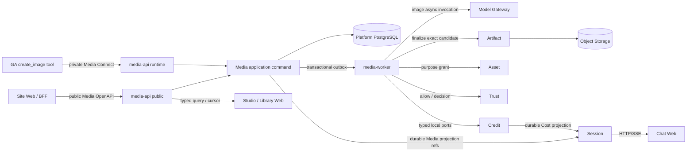

# ADR-015: Media Operation and Artifact Authority

## Status

Accepted as the target architecture after independent P0/P1 review. 本 ADR 只冻结目标架构，不代表 Media、Artifact、Image Studio 或 Chat 图片生成已经实现、可用或闭环。
只有本文的 contract、代码、真实数据库/对象存储/Model Gateway 故障验证、四仓兼容性门和发布证据全部落地后，
相关能力才可称为 production-ready。

**Date:** 2026-07-30

**Deciders:** LordFoxFairy, Kokoro architecture review

## Context

Kokoro 已经具备四个正确但尚未闭合的基础事实：

- GA 能在一个 Run 内选择工具和编排模型，但它不应成为长耗时媒体执行、Provider callback、积分或产物数据库；
- Platform 已拥有 Site、Admission、Model Control/Gateway、Credit、Asset 和 Trust 的业务边界，但没有可上线的
  Media execution 与 generated Artifact authority；
- Session 已拥有 Conversation/Run/MessagePart 投影，并且 Root contract 已预留 `media-operation`、`artifact` part，
  但这些 part 当前只是引用壳，不证明后端 owner、状态机、最终产物和费用已闭环；
- Web 已能渲染 typed Chat parts，但 Chat 卡片、专业 Studio 和 Library 还没有消费同一份 Media/Artifact 真相。

现有规划又同时使用了 `Generation`、`Job`、`Job Runtime`、`ImageJob`、`Artifact Job`、`sourceJobId` 等名词。
这些名字把三类不同概念混在一起：

1. 模型具备 image/music/video **generation capability**；
2. 一个用户可恢复的媒体业务请求；
3. worker queue item、Provider 原生异步 job 或后台维护 task。

继续建立一个顶层 `Generation` 模块会把“某类模型能力”误写成业务 owner；继续建立一个通用 `Job` 聚合则会诱使
Payment、Redemption、Data Rights、Media、导出和后台维护共享一个没有业务不变量的状态机。把这些能力放进 GA，
又会让 Web/Studio/Admin 必须绕过标准 Platform API，令浏览器断线、Agent restart、Provider callback 和 Artifact
finalization 无法独立恢复。

目标产品必须同时满足两种看似不同、实际上共享同一执行脊柱的入口：

- Chat：GA 理解用户意图，调用一个很薄的 `create_image` 工具；用户感觉是 Agent 直接完成图片生成；
- Studio：用户在独立 Site Web 中显式选择参数、候选数和 ModelOption，直接提交同一种图片 operation。

两条入口在准入后必须产生相同的 `OperationDefinitionRevision`、`MediaOperation`、Model Gateway invocation、
Credit allocation、ArtifactVersion、Trust decision 和 Usage evidence。它们不能形成“Agent 生成”和“后台 Job 生成”
两套实现。

Kokoro 尚未上线，旧文档、旧 contract 和旧测试事实没有兼容价值。现在应 clean replacement，而不是为错误抽象增加
别名、双写或迁移层。

## Decision

### 1. 删除 `Generation` 与通用 `Job` 业务抽象

我们采用以下命名和所有权：

| 名称 | 合法含义 | 禁止含义 |
|---|---|---|
| `generation` | Model capability、Operation family 的能力标签，例如 `image.generation` | 顶层仓库、服务、Platform module、数据库 owner |
| `Media` | Platform 内负责图片、音乐、视频等媒体 operation 的 bounded context | Provider SDK 集合、Artifact bytes owner、GA 的别名 |
| `MediaOperation` | 一次用户可见、可恢复、可计费的媒体业务执行聚合 | 任意后台任务或 LangGraph node |
| `MediaStep` | 已发布 Definition 编译出的有界步骤投影 | 任意用户 workflow graph、Provider attempt 真源 |
| `MediaCandidate` | Provider effect 前分配的稳定输出槽身份 | Blob、ArtifactVersion 或数组下标 |
| `Artifact` / `ArtifactVersion` | 稳定作品与不可变输出版本权威 | 上传输入、Provider URL、Session part 或 object key |
| `WorkerTask` / `Lease` | Media 基础设施内部调度事实 | 公共产品对象、跨仓 contract |
| `provider_job_ref` | Model Gateway 内部的 Provider 异步 effect 引用 | Kokoro operation identity 或浏览器可用 ID |

根仓、Platform 和 Web 不再新增 `kokoro-generation`、`generation-api`、`job-service`、`JobRuntime` 或通用
`Job` aggregate。后台确实需要运行的 reconciliation、purge、rendition 等任务使用它们所属 domain 的明确命令和
内部 `WorkerTask`，不能借一个通用 Job owner 逃避领域状态机。

### 2. 在 Platform 内建立两个相邻但独立的 authority

`Media` 与 `Artifact` 都位于 `kokoro-platform`，共享 Platform release provenance 和 PostgreSQL 基础设施，但各自拥有
aggregate、表、repository、application port、RLS policy 和 outbox。它们不是一个 aggregate，也不允许彼此直接
导入 repository。

```text
kokoro-platform
  Media bounded context
    OperationDefinitionRevision
    MediaOperation / MediaStep / MediaCandidate
    command receipt / projection journal / Inbox / Outbox

  Artifact bounded context
    Artifact / immutable ArtifactVersion
    Blob reference / lineage / finalization receipt
    delivery authorization / Inbox / Outbox

  existing owners
    Admission / Site / Model Control / Model Gateway / Credit / Asset / Trust
```

同一个 Platform workflow 通过窄 application port 和 `PlatformUnitOfWork` 协作。`MediaTransaction` 或 Prisma transaction
client 不得暴露给 Artifact、Credit、Asset 或 Trust；跨模块命令只返回 typed receipt/ref。未来需要独立部署时，必须先
把当前本地事务重画为版本化 RPC + saga，不允许一边跨进程、一边继续共享数据库写表。

数据库权限同样遵守 owner 边界。Media login 不获得 Credit、Asset、Trust 或 Artifact 表的普通 DML；跨模块 port 在
同一 Platform UoW 中只能调用由目标 owner 持有、以 exact caller role/OID、operation、receipt 和 expected revision
校验的窄 command routine。routine 使用固定 `search_path`、撤销 `PUBLIC`、只向精确 workload role 授予 `EXECUTE`，并在
真实非空数据上验证。不能通过共享 Prisma client、多域表权限或可伪造 GUC 达到“本地调用”。

本决策不创建新仓库、不增加新的基础设施种类，也不增加默认 Infra container。默认开发/CI 仍只启动现有 PostgreSQL、
MongoDB、Redis 和 MinIO。`media-api`、`media-worker` 是可选的 Platform 应用进程，不是数据库、队列或对象存储 Pod；
调试或验收结束必须停止多余应用进程。

### 3. 冻结各系统关系和唯一 owner

| Surface / module | Owns | Does not own |
|---|---|---|
| Chat | 用户意图和媒体卡片的对话体验 | Media 状态、Provider effect、Artifact、Credit |
| Studio Web | 专业参数、Canvas/compare UX、客户端临时草稿 | 可执行 operation、worker lease、Provider、bytes、账务 |
| GA | 何时调用能力、如何把结果用于当前 Agent 任务 | Site/account、Media 状态机、Provider callback、Artifact/Usage/Credit |
| Platform Admission | effect-point authorization、SiteRelease/Plan/ModelOption/Policy 快照、预算签发 | Media execution、Provider attempt、Artifact bytes |
| Platform Media | Definition、Operation、Step/Candidate execution projection、dispatch/finalization saga | Provider attempt、Credit journal、Asset/Artifact/Trust 真相 |
| Model Gateway | logical model invocation、Provider routing/effect、callback、outcome/usage/cost evidence | 产品价格、Media terminal、Artifact ready |
| Credit | root Hold、child allocation、rating/settlement/journal | 媒体进度和输出状态 |
| Asset | 输入 AssetVersion、DerivedInputVersion、purpose-bound input grant | generated Artifact identity |
| Trust | input/effect allow、output/publication Decision、appeal/restriction epoch | Provider execution和Artifact bytes |
| Artifact | output bytes reference、immutable version、lineage、delivery authorization | Operation execution和customer charging |
| Session | Chat 中的 Media/Artifact/Cost projection、cursor、SSE/replay | Platform 业务真相和对象存储 credential |
| Web | BFF、typed state/reducer、Chat/Studio/Library 展示 | 推断 terminal、拼 Provider URL、写 owner database |

Studio 与 Chat 是不同的产品交互面，不是不同后端。Chat 通过 GA 决定调用；Studio 通过 BFF 直接调用。两者在进入
Media application command 后不再分叉。Chat 生成的 Artifact 自动属于同一个 Artifact authority，可在 Library/Studio
继续使用；进入 Studio 只创建新的 draft/spec 或后续 operation，不复制 bytes、不改写原 ArtifactVersion。

### 4. 采用两个 API trust plane 和一个 worker plane

Platform 同一构建制品提供两个 `media-api` composition 和一个 `media-worker` composition：

| Process role | Caller / transport | Listener and database authority |
|---|---|---|
| `media-api --plane=public` | Site Web BFF，OpenAPI HTTP/JSON | public listener；exact `platform_media_public` login |
| `media-api --plane=runtime` | GA，ConnectRPC/mTLS | private listener；exact `platform_media_runtime` login |
| `media-worker` | durable outbox/queue lease，无普通业务入口 | health/control only；exact `platform_media_worker` login |

三个 workload identity、listener、TLS、rate limit、audit label 和 PostgreSQL role 分开。public composition 不加载 GA
mTLS trust 或 worker command；runtime composition 不挂载浏览器 OpenAPI；worker 不加载 public/runtime server。三个 login
均为 `LOGIN NOINHERIT NOBYPASSRLS`，不拥有 schema/table/sequence、没有 role membership，并按真实 `SESSION_USER` + role
OID + workload binding fail closed。应用不得用可伪造的 `app.workload_kind` GUC 代替数据库登录身份。

Artifact public query/delivery 和 worker finalization由 Artifact owner 的窄 port/routine执行。它们可以由同一 Platform
制品和 `media-api` / `media-worker` 进程托管，但托管进程不因此取得 Artifact 表 ownership。若一个进程角色无法在不
加载相邻 owner credential 的前提下维持最小权限，则使用同一制品的显式 `--role=artifact-finalizer` workload 和 exact
`platform_artifact_finalizer` login；仍不创建新仓库、镜像或基础设施种类。

#### 4.1 Opaque runtime authorization

Platform Admission 在 RunContextManifest 中为 GA 签发 `media_access_handle`。它在 owner 侧绑定 exact Site、subject/
membership generation、Run、opaque namespace audience、允许的 Definition/ModelOption、Project、Trust/rights policy、
ExecutionBudgetRoot、child-allocation ceiling、最大候选数、expiry 和全部 revocation epoch。wire 上是不可读、audience-bound
的 opaque capability；GA 不获得或解析这些字段。

`CreateAgentImageOperation` 在写 command 前必须向 Admission/owner port 复验 handle、Run/command binding、definition、
request digest、subject generation、SiteRelease、authorization epoch 和剩余预算，再由 Credit owner原子派生 child
allocation。过期 handle不能因“operation 已存在”被扩权：recovery可以返回已经授权的同 command安全状态，任何新effect/
cancel/delivery都必须重新满足当前owner policy。Direct Studio不使用GA handle，而由public plane从Site deployment和
authenticated actor构造同等强度、但caller不同的admission context。

对外边界如下：



Redis 只允许用于 wake-up、fanout、短期 lease hint 或 rate limit；PostgreSQL command receipt、operation、outbox/inbox、
Gateway outcome、Artifact receipt 和 Credit journal 才是恢复真相。Redis 丢失不能丢 operation 或触发第二次 Provider effect。

### 5. OperationDefinition 是唯一可执行产品定义

`OperationDefinitionRevision` 是 Media owner 发布的不可变定义。SiteRelease 只引用 exact revision 并决定是否开放；
浏览器、GA prompt 和用户不能提交任意 DAG、Provider payload 或 adapter name。

每个 Definition 至少冻结：

```text
definition_ref / revision / family / schema_revision
typed input and output contracts / candidate cardinality
allowed parameter combinations and canonicalization rules
required ModelOption roles and compatible modality/capability constraints
bounded acyclic MediaStep plan and dependency policy
input Asset purposes / Trust gates / rights and consent requirements
effect, timeout, cancel, reconciliation and fallback policy
usage dimensions / reservation ceiling rule / charge treatment
candidate validation / Artifact finalization / delivery eligibility policy
projection redaction schema / SiteRelease compatibility / certification refs
```

Definition 发布时编译并验证完整性；运行时不根据自由文本补结构。发布后的 revision 不原地修改，adapter/Provider 能力变化
只能发布新 revision 或实时 fail closed。Provider 支持某参数并不等于产品已开放；产品 schema 不支持的字段即使 Provider
接受也不能透传。

Image-first 的第一个 release 只启用一个最小 `image.text_to_image@v1` Definition：typed prompt intent、尺寸/比例、
候选数量、产品级 ModelOption 和输出格式约束。`image_variation`、`image_edit`、`inpaint`、`outpaint`、`upscale`、
`background_transform` 可以预先保留 family 名，但在各自 schema、Asset purpose、坐标/mask、rights、Trust、usage 和
Provider certification 完成前必须 disabled。不能用 `options: Record<string, unknown>` 偷渡这些能力。

### 6. 冻结核心对象和 identity

```text
MediaCommandReceipt
  command_ref / caller_audience / idempotency_key / caller_request_fingerprint
  owner_keyed_persistence_digest (never returned)
  definition_revision_ref / authorization_ref / operation_ref? / terminal result

OperationInputRevision
  input_revision_ref / operation_ref / definition+schema revision
  keyed canonical plaintext digest / encrypted bounded payload / encryption envelope+AAD digest
  exact Asset/Artifact source refs / retention+purge policy / safe projection digest

MediaOperation
  operation_ref / definition_revision_ref / source=studio|agent
  operation_input_revision_ref / canonical_spec_digest / admission_snapshot_ref / execution_budget_ref
  state / expected_version / cancel_policy / reconciliation_deadline

MediaStep
  step_ref / operation_ref / definition_step_key / dependency refs
  state / expected_version / lease_epoch
  model_invocation_command_ref? / logical_invocation_ref? / receipts

MediaCandidate
  candidate_ref / operation_ref / step_ref / output_slot
  model_invocation_command_ref / logical_output_slot
  state / provider_output_fact_ref? / trust_decision_ref?
  artifact_ref? / artifact_version_ref? / effect_budget_segment_ref?

ModelInvocationCommandBinding
  caller-preallocated model_invocation_command_ref / request_digest
  step+candidate/output-slot mapping / EffectBudgetCommit ref+digest
  logical_invocation_ref? / current attempt ref? / authorization_revision / Gateway receipt refs

Artifact
  artifact_ref / site-scoped project binding / media class / lifecycle

ArtifactVersion
  version_ref / artifact_ref / candidate ref / immutable identity
  finalization head + append-only staged/trust/promotion/purge receipts
  parent/source lineage / model+definition+policy+rights+usage evidence refs
```

身份规则是：

- `command_ref` 在 effect 前由入口生成并 keep-first 持久化；Studio 使用浏览器 command identity，GA 使用一个在
  Run replay/restart 后稳定的 Agent media command identity；
- command identity 的授权域绑定 caller audience、Site/subject generation、Run 或 browser actor、Definition revision
  和owner journal；GA只看opaque handle，不解析这些字段，也不持有owner digest；
- create请求带`caller_request_fingerprint`，它是Root canonicalizer对caller可见typed request的unkeyed fingerprint，仅供
  GA/Web本地keep-first和传输漂移诊断，不是授权或Platform持久化完整性证据；Platform从收到的typed request自行重算；
- Platform在校验可信Site/authorization/source/Definition后计算`owner_keyed_persistence_digest`：Site-scoped versioned HMAC
  覆盖完整canonical request和trusted bindings。只有它用于owner journal same/different判断，永不返回GA/Web；
- 同 identity + owner重算同 digest 返回同一 receipt/operation；同 identity + 不同 owner digest 返回
  `IDEMPOTENCY_CONFLICT`，且不得创建第二次 effect；
- `MediaOperation` 由 owner 分配，与 Provider operation/job ref 无关；
- Media application service 在 dispatch outbox 提交前，为 Definition 中每个 model effect **预分配**稳定
  `model_invocation_command_ref` 并持久化 `ModelInvocationCommandBinding`；worker、Gateway或Provider都不能临场换 ref；
- 所有 candidate slot 在 Provider I/O 前分配 stable `candidate_ref`，不能用数组 ordinal 或返回 URL 充当 identity；
- 相同 bytes 只允许 Blob 物理去重；不同 candidate/operation 的 ArtifactVersion、lineage、rights 和 charge 永不合并；
- object key、storage URL、content hash、Model deployment 和 Provider account 不进入浏览器/GA identity。

caller fingerprint与owner digest共享版本化、域分隔的canonical bytes，内容只含contract major、exact Definition revision、
typed spec、ordered exact source refs、ModelOption ref和output contract，不含时间、trace、queue顺序、Provider选择或mutable
projection。owner digest另加入trusted Site/subject generation/authorization/input revision bindings并使用HMAC。Root在
TypeScript/Python mirror提供canonical bytes/fingerprint golden corpus；owner HMAC corpus只使用固定测试key。入口不得各自
stringify/reorder，生产HMAC/key/version和完整digest preimage不返回浏览器或GA。

`OperationInputRevision` 是唯一可执行输入。它在 operation create transaction 中先通过 exact Definition schema校验、
canonicalize并计算digest，再用per-record DEK envelope encryption保存；AAD至少绑定Site、operation、input revision、
Definition revision和schema revision。密钥版本/密文/nonce/AAD digest与安全索引列持久化，plaintext prompt、negative
intent和媒体编辑参数不进入operation row、outbox、日志或Session event。只有purpose=`media-effect-input`、command/
step/lease-bound且未撤销的worker authorization可以在内存中解密，使用后清零；Admin/Support只见redacted projection。
InputRevision不可修改，重试/恢复必须复用exact revision；用户改prompt/参数创建新operation。Data Governance按retention
plan先停止解密授权，再删除密文/DEK envelope并留下content-free purge receipt；digest不能作为跨Site存在性探针。

### 7. 状态机按 owner 正交，而不是一个 `status` 字符串包办

#### 7.1 MediaOperation

```text
admission_pending
  -> authorized -> queued -> active -> finalizing
  -> completed | partial | failed | canceled

queued | active -> cancel_requested -> reconciling -> canceled | completed | partial | failed
active | finalizing -> reconciling -> active | finalizing | completed | partial | failed | canceled
```

`reconciling` 不是成功或失败的同义词；只要某个 required effect outcome 仍 unknown，Operation 就不能进入
`completed`、`partial` 或可安全重试状态。超过已发布 reconciliation deadline 后必须写不可变
`IrreconcilableOutcomeReceipt`，再按冻结 charge/retention/support policy 进入诚实 terminal。
terminal receipt 必须保留 `outcome_class=irreconcilable`，不能用 `failed` 对外暗示 Provider 确定未执行。

Operation `completed` 必须同时满足：

1. Definition 的 required steps 和 candidate 最小输出契约闭合；
2. 所有相关 Model Gateway invocation 都有 canonical outcome，不存在 submission/outcome unknown；
3. 每个 required allowed candidate 都有 Artifact finalization receipt；
4. 每个 effect 都有 durable AttemptUsageEvidenceReceipt 和 committed Credit allocation；
5. Trust/publication 状态被正确投影，restricted 输出没有 delivery；
6. operation terminal outbox 与 receipt 在同一 Media transaction 提交。

异步 customer rating/settlement 暂时不可用时，Media仍可`completed`，Credit owner的独立CostProjection保持
`cost_pending`；Media terminal不能保存或发布这个owner状态。此时仍不能缺usage evidence、EffectBudgetCommit或cost
projection ref/version。`partial`只在Definition明确允许且至少一个可用候选完成时成立；restricted/failed/unknown
candidate不能被另一个成功候选覆盖。

#### 7.2 MediaStep

```text
blocked -> ready -> leased -> running
running -> provider_async | finalizing
leased | running | provider_async -> reconciling
running | provider_async | finalizing -> completed | failed | canceled
reconciling -> running | provider_async | finalizing | completed | failed | canceled
```

`MediaStep` 只保存 orchestration projection、caller-owned `model_invocation_command_ref` 和 Gateway返回的opaque
`logical_invocation_ref`。Model Gateway 自己拥有
`definitely_not_submitted / submitted / submission_unknown / running / succeeded / failed / outcome_unknown` effect state。
Media 不复制 Provider attempt 表，也不根据 queue ack、HTTP timeout、lease expiry 或 progress=100 猜 effect outcome。

worker claim、renew、progress、complete 都使用 `(step_ref, lease_epoch, worker_identity)` fencing。lease 被抢只代表 worker
ownership 变化；若 Gateway 不能证明 effect 未提交，新 worker 必须 attach/query/reconcile 原 invocation，绝不能新建
一次图片生成。

#### 7.3 MediaCandidate 与 Artifact

```text
allocated -> producing -> output_received -> validating
validating -> ready | restricted | failed
producing | output_received | validating -> unknown -> validating | restricted | failed
allocated | producing -> cancel_requested -> canceled | output_received | unknown | ready | restricted
```

`output_received` 只代表 Gateway 有 canonical output fact，不代表图片可见。`ready` 必须链接 exact ArtifactVersion 和
允许当前私有用途的 Trust decision；`restricted` 可保留受控 ArtifactVersion/Usage/lineage，但普通 thumbnail、通知、
下载和 Support projection 不得泄漏内容。ArtifactVersion 不原地修改；edit/variation/upscale 创建新的 operation 和 lineage。

#### 7.4 ArtifactVersion finalization and purge

ArtifactVersion identity在retrieval前预留，但bytes/content facts只通过append-only receipt固化：

```text
reserved -> retrieving -> staged -> validating -> trust_pending
trust_pending -> promotion_authorized -> promoting -> ready_private | restricted
retrieving | staged | validating | trust_pending | promoting -> failed | reconciling
reconciling -> retrieving | validating | trust_pending | promoting | ready_private | restricted | failed
ready_private | restricted | failed -> purge_pending -> purged
```

`StagedBlobReceipt`至少冻结candidate、Gateway output/evidence ref、temporary object locator的内部digest、server-computed
content hash、byte size、sniffed media type、dimensions、decoder/scanner revisions、integrity result和storage generation。
Trust output decision必须覆盖`staged_blob_receipt_ref + receipt_digest + exact content/media digest + policy/rights/consent/
restriction epochs`；只看candidate或Provider URL的Decision无效。

Artifact owner随后创建`BlobPromotionAuthorization`。promotion effect前CAS验证ArtifactVersion expected state/version、同一
StagedBlobReceipt、Trust Decision digest、candidate/output digest、目标storage class/region/encryption和所有epoch未变化；
对象存储promotion使用独立same-key/same-digest command。成功后的`BlobPromotionReceipt`再以CAS激活
`ResourceBlobReference`、immutable content facts、lineage和ArtifactFinalizationReceipt。crash只能recover同promotion
command，不能重取另一Provider output或替换bytes。required receipt缺一时不能进入`ready_private/restricted`。

ArtifactVersion的identity、lineage、Usage/Trust refs和purge receipt长期保留；content availability由head表达。删除先撤销
delivery并进入`purge_pending`，只有Data Governance disposition、reference-graph watermark、retention/LegalHold、active
grant/operation和replica blocker全部通过，GCPlan effect CAS才可删managed bytes。每个replica写DestructionReceipt；timeout
为unknown并继续reconcile。全部目标确认后才`purged`，留下content-free tombstone；不能按age/hash或“查不到引用”直接删。

#### 7.5 Late outcome after terminal

Operation、Step和Candidate terminal state单调且不重开。任一completed/partial/irreconcilable/canceled/failed terminal后到达
新的Provider fact时，
Gateway先写`LateOutcomeObservationReceipt`，冻结原terminal receipt、logical invocation/Attempt、provider evidence、observed
time、usage/cost和late outcome digest；Media按receipt追加`late_outcome_class` projection，但不把terminal改成completed/partial。

- late success仍必须完整ingest Usage/ProviderCost，Credit以append-only correction/unknown-exposure policy结算；不得因为原
  Hold已按冻结policy关闭就丢usage、直接改余额或复活旧allocation；
- late bytes只可走同一Artifact staged/trust/promotion链并默认quarantine。若当前Site/rights/Trust允许，owner可创建独立
  `RecoveredLateArtifactReceipt`和ArtifactVersion链接，但原candidate/operation terminal不变，不能自动通知或交付；
- late confirmed failure/cancel/not-submitted允许Credit对仍open的exact segment做CAS settle/release，不能修改已关闭Journal；
- 用户若要基于late artifact继续创作，创建新的显式operation；Support只能对receipt执行reconcile/adopt policy，不能
  `MarkCompleted`。

`LateOutcomeObservationReceipt`、late usage/correction、recovered artifact或destruction没有全部收口时，reconciliation case
不能关闭。迟到事实绝不触发新的Provider effect。

### 8. Direct Studio 和 Agent 使用同一 application command

#### 8.1 Studio path

```text
Web typed form
-> Site BFF `SubmitStudioImageOperation`
-> media-api public authenticates Site/actor/project
-> canonicalize against exact Definition
-> Admission revalidates SiteRelease/Plan/ModelOption/Trust/Credit ceiling
-> one UoW persists encrypted InputRevision + command + Operation + root Hold/allocation
   + steps/candidates + preallocated Gateway commands + dispatch outbox
-> BFF reads operation/candidate/artifact projections by opaque cursor
```

Web 不传可信 `siteId`、billing account、Provider、price、storage key 或 authorization epoch；这些从 Site deployment
binding、authenticated actor 和 owner-issued snapshot 派生。重复点击复用同 browser command identity。页面关闭、刷新或
切换设备只执行 receipt/query recovery，不取消 operation。

#### 8.2 Agent path

GA 只新增一个窄 `create_image` product tool 和一个 `MediaOperationPort`：

```text
create_image(typed ImageCreateRequest, media_access_handle,
             media_projection_reservation_handle, stable_output_slot_ref,
             agent_media_command_ref)
  -> CreateAgentImageOperation
  -> optionally wait/read bounded progress
  -> return MediaOperationHandle + zero-or-more ArtifactVersionHandle

recoverByCommand(agent_media_command_ref, media_access_handle)
  -> authoritative command receipt / same MediaOperationHandle

cancel_media_operation(operation_ref, cancel_command_ref, expected_operation_version,
                       media_access_handle)
  -> CancelAgentMediaOperation
  -> durable cancel-intent receipt; never claims Provider cancellation
```

上述 access/projection handle、stable refs和command refs均由GA runtime注入，不出现在模型可编辑tool schema；模型只生成
`ImageCreateRequest`的产品字段。adapter必须忽略/拒绝模型文本中伪造的同名参数。

用户体验上它仍是 Agent “直接生成”：GA 决定何时调用并可以在当前 tool turn 内等待到 ready；如果超出 tool wait budget、
连接断开或 GA restart，则返回/恢复同一个 durable operation，而不是创建一个通用 Job 或让 Run 持有 Provider callback。
后端异步并不意味着用户必须手工去后台启动任务。

`create_image` 不能接受 Provider、Deployment、raw adapter payload、Site、account、price、bucket、object URL 或自定义 DAG。
它只提交产品级 prompt/尺寸/候选数/ModelOption ref、caller fingerprint和opaque grants。`recoverByCommand` 是read-only
owner-journal lookup，只提交command ref + media access handle，不提交caller fingerprint、typed input或owner HMAC。
Media owner验证handle audience、原Run/command binding、subject generation和recovery policy后，从journal自行校验stored
owner digest并返回redacted safe receipt；same-key/different-payload只在create/cancel命令重放时判断。过期handle只能通过
owner定义的窄refresh恢复同command读取权限，不能获得新effect/cancel/delivery权限。

`cancel_media_operation`只能针对同一Run/handle被授权的operation，以新的stable cancel command identity和expected version
提交intent；same key/same digest返回同cancel receipt，different digest冲突。Media随后对未开始step做CAS cancel，对已提交
image effect调用`RequestCancelImageEffect`并进入`cancel_requested/reconciling`。GA收到的是intent/owner receipt，不能把
HTTP 202、Gateway cancel ack或Run canceled投影成Provider/candidate canceled。create/cancel两类command都通过统一
`RecoverMediaOperationByCommand`对账，但receipt使用closed discriminated union，不能混淆operation create与cancel结果。

该改动是 **GA core-adjacent**：稳定 `agent_media_command_ref`/`cancel_command_ref` 必须在 tool replay、checkpoint restore、Run retry 和 crash 后
保持不变，并正确进入 durable output/projection；实现前必须单独通知用户并做 Agent 核心评审。它不得改变现有 graph、
checkpoint、terminal、handoff、HITL 或 namespace 语义，不得用 Media state machine 替换 Agent tool state。

### 9. Credit 只签发预算，Media 不扣积分

一次 operation 只有一个预算来源：

- Direct Studio 创建新的 `ExecutionBudgetRoot` 和 root CreditHold；
- Agent path 从当前 Run 的 root allocation 派生一个 purpose=`media.image.create` 的 child allocation；
- Media command、OperationInputRevision、Operation/Step/Candidate、Direct root Hold或Agent child allocation、
  `ModelInvocationCommandBinding`和dispatch outbox必须在**同一个Platform PostgreSQL transaction**中提交；Credit owner的窄
  command routine加入同一UoW，任一失败全部回滚，禁止先建operation再异步补Hold；
- Admission/Credit 在该事务内以CAS签发allocation，冻结 Site、BillingAccount、root、liability、RatingPolicy、
  ceiling、dimension envelope、audience、expiry 和 allocation epoch；
- GA、Media worker 和 Model Gateway 都不能增额、换 account、reparent 或创建第二个 root Hold；
- `model_invocation_command_ref`一一对应一个Gateway logical invocation；logical invocation下可以有多个Gateway Attempt，
  但每个可能触达Provider的Attempt必须在I/O前取得自己唯一的`effect_budget_segment_ref`和
  `EffectBudgetCommit(ref,digest,attempt_ordinal,ceiling,allocation_epoch)`；
- Media预分配的candidate只绑定logical output slot；Gateway append-only `CandidateAttemptBinding`记录每个Attempt如何映射
  candidate/slot。只有前一Attempt有`definitely_not_submitted` receipt时，同一logical invocation才可CAS到下一Attempt；
  submitted/unknown/已有output时不得换Attempt或重绑candidate；
- V1多Attempt路径只允许幂等`AttachNextAttemptAuthorization`：Media先recover Gateway journal并取得Gateway-signed
  `definitely_not_submitted` receipt；Credit owner在Platform transaction中验证该receipt、same logical invocation/command、
  current attempt ordinal、candidate mapping和allocation epoch，以CAS从原operation allocation追加next segment并签发只绑定
  `next_attempt_ordinal`的新EffectBudgetCommit。Media随后用stable `attempt_authorization_command_ref`调用Gateway attach；
- attach canonical digest覆盖logical invocation、原model command、previous attempt/receipt digest、next ordinal、new segment/
  EffectBudgetCommit digest、same InputRevision/ModelOption/candidate mapping。Gateway same-key/same-digest返回同authorization
  revision；different digest冲突；CAS只允许current attempt确为该receipt且还没有next authorization，随后append immutable
  `AttemptAuthorizationRevision`并创建planned next Attempt，**不执行Provider I/O**。attach响应丢失通过Get/RecoverByCommand
  返回authorization revision；只有attach committed后worker才可dispatch next Attempt；
- Gateway 持久化 AttemptUsageFact/ProviderCostFact，Usage Rating 生成 customer charge，Credit 捕获/归还原 Grant；
- candidate failed、restricted、canceled 或 irreconcilable 是否收费由冻结 RatingPolicy/ChargeTreatment 决定，不由
  Media 用状态名猜测；
- release只能由Credit owner CAS执行，并同时验证allocation/segment epoch、Gateway attempt receipt、没有submitted或unknown
  effect、没有Usage evidence/capture以及expected cumulative amounts；任一不确定即保持committed/reconciling；
- release 必须回到原 allocation/Grant 并遵循 expiry/revocation，绝不复活过期积分。root/child allocation只有在所有
  logical invocation/Attempt/segment closed且Journal守恒后才能closing->settled/released。

Media 只保存/转发 `cost_projection_ref + owner_version`关联，不拥有或复制`cost_state`、estimate/final amount。Credit/Usage
owner通过独立durable `CreditCostProjectionEvent`向Session发布状态和金额；Platform public API composition也从Credit read
port join安全投影。Session/Web的Cost part只消费该owner event，不能从Media candidate数、Provider price或模型名字推算
扣费。Media completion不因Rating异步而阻塞，但required Usage evidence和committed segment仍是terminal gate；UI可以组合
显示“Media completed + Credit cost pending”，`cost_pending`不是MediaOperation状态。

### 10. Asset、Trust、Model Gateway 和 Artifact 构成 effect spine

#### 10.1 Input and Trust admission

`text_to_image@v1` 无媒体输入，但仍需要 prompt/content/effect Trust allow receipt。后续 edit/variation/inpaint 等 family
只能消费 exact ready `AssetVersion` 或 `ArtifactVersion`。Asset owner 创建 purpose-bound `DerivedInputVersion`/grant，
冻结 source revision、transform/range、Site/Project、rights/consent/restriction epochs、allowed Model deployment、TTL 和
revoke state。浏览器 URL、data URL、filename、object key 或跨 Site hash 不能成为 Provider input。

Trust 的 scanner/provider safety 结果只是 evidence；只有 Trust owner 的 input/effect allow 才能 dispatch。input 在 queue
后被撤销时，未提交 effect 必须拒绝；已提交 effect 继续收集 Usage/outcome，但输出进入 quarantine/reconciliation，不能
发布。

#### 10.2 Model Gateway image async effect

Image effect不是现有Chat/LLM invocation boundary的“多传几个字段”。Root新增独立、机器可读、版本化的
`model-image-effect@v1` Connect contract，provider仍是Model Gateway deployable，official consumer是Platform Media worker。
首个service revision为`ImageEffectServiceV1`，至少包含：

- `CreateImageEffect`：唯一effectful create；
- `AttachNextAttemptAuthorization`：凭exact `definitely_not_submitted` receipt为同一logical invocation幂等追加下一
  Attempt authorization；本operation本身不调用Provider；
- `RecoverImageEffectByCommand`：按caller command读取authoritative receipt，不产生effect；
- `GetImageEffectByCommand`：读取logical invocation、Attempt/outcome/evidence；
- `RequestCancelImageEffect`：记录cancel intent并返回receipt，不伪造Provider canceled；
- `GetImageEffectEvidence`：按owner cursor读取bounded canonical facts。

该boundary拥有独立caller identity、mTLS audience、deadline、retry/receipt/failure owner、Buf source、registry entry和
真实Media consumer compatibility scenario。不得声称它沿用当前Agent->Model Gateway chat HTTP boundary，也不得让GA直接
消费image-effect service；两者共享Gateway内部的Provider control primitives，不共享wire operation。

Media application service在operation transaction中预分配`model_invocation_command_ref`。worker调用Gateway时提交exact
Definition role、ModelOption authorization、`OperationInputRevision` digest、DerivedInput grants、ordered candidate/output
slots、`EffectBudgetCommit` ref+digest和Trust allow。image-effect canonical request digest必须覆盖这些字段以及caller
workload identity；换budget segment、candidate mapping、input revision或ModelOption都会产生不同digest并被同key冲突拒绝。

`CreateImageEffect` request digest只绑定Attempt 1 authorization，不能预留未知未来Attempt。每个后续Attempt使用上节独立
attach command/digest；Gateway command journal对create与每次attach分别keep-first，并以unique
`(logical_invocation_ref, attempt_ordinal)`和unique EffectBudgetCommit ref阻止跳ordinal、双attach或segment复用。

Gateway在任何Provider I/O前，在自己的authority transaction中keep-first写
`(caller_identity, model_invocation_command_ref, request_digest)` command journal、logical invocation、Attempt 1、
EffectBudgetCommit binding和outbox。same key/same digest返回同journal/`logical_invocation_ref`；same key/different digest返回
`IDEMPOTENCY_CONFLICT`且无I/O。create响应丢失时Media只能调用`RecoverImageEffectByCommand`或
`GetImageEffectByCommand`；worker restart/lease steal也必须先recover，不能生成新command ref。

Credit owner在签发`EffectBudgetCommit`时已CAS把exact segment从reserved推进到committed，并把commit封装为audience-bound、
owner-signed sealed receipt，绑定Gateway caller、command、attempt ordinal、candidate mapping、ceiling、allocation epoch和expiry。
Gateway在每个Provider Attempt I/O前验证signature/audience/expiry和全部binding，并以unique commit ref + CAS标记attempt
effect fence；同commit不能被另一command/Attempt消费。V1不新增未登记的Gateway->Credit同步调用；若未来要求effect-point
online revocation，必须先新增独立contract/timeout/unknown语义，而不是暗中直连Credit。commit ref/digest同时进入Provider
request journal、AttemptUsageFact和terminal evidence。
Gateway选择受认证Deployment/adapter，拥有submit/poll/callback/retrieval和outcome reducer；Media只持opaque logical/
attempt refs与evidence receipts。

Image Provider 常见的 `submit -> provider job ref -> poll/callback -> output` 全部留在 Gateway。Provider webhook 不进入
Media public/runtime API；callback signature/replay/body/tenant mapping 由 Gateway 校验。网络 timeout、duplicate/out-of-order
callback 和 late success 都归并到同一个 invocation。submission/outcome unknown 禁止自动 fallback 或换 Provider 重跑。

Gateway terminal transaction 原子写 canonical outcome、ProviderCostFact、AttemptUsageFact 和 outbox。Media 只消费
authenticated durable fact，并按 `logical_invocation_ref + evidence_revision` keep-first；同 ref 不同 digest fail-loud。

#### 10.3 Artifact finalization

```text
canonical Gateway output fact
-> candidate output_received
-> Artifact owner validates attempt-bound retrieval grant
-> bounded fetch into quarantine + StagedBlobReceipt
-> checksum + media decode/metadata/integrity validation
-> Trust Decision bound to exact staged receipt/content digest
-> BlobPromotionAuthorization CAS + idempotent object promotion
-> BlobPromotionReceipt + ResourceBlobReference + immutable content facts/lineage/outbox
-> ArtifactFinalizationReceipt
-> candidate ready|restricted
```

Artifact owner使用 Gateway 签发的 attempt-bound retrieval grant，限制 host/object、redirect、size、MIME、checksum、TTL 和
decompression budget，防止 SSRF、body bomb 和 object substitution。Provider URL/progress/success 不是 Artifact。

finalizer crash 或 Artifact response 丢失时，以 `(operation_ref, candidate_ref, output_digest)` 查询/重放同一 finalization
command；同 identity 同 digest 返回已存在的staged/trust/promotion/finalization receipt，不同 digest quarantine/conflict。
每一阶段从owner receipt继续，不能跳过staged blob、让Trust判断另一份bytes、覆盖promotion目标或创建第二ArtifactVersion。
只允许重新 retrieval、validation、Trust evaluation、同command promotion或receipt persistence，**绝不重新调用 Provider**。

Artifact bytes 存对象存储，PostgreSQL 保存受控 ref、hash、size、metadata、lineage 和 lifecycle。下载/preview/export 每次由
Artifact owner签发短期 purpose/audience-bound DeliveryAuthorization，并复验 Site/subject/project/policy/rights/consent/
restriction epochs。storage URL 永不作为长期 ref，也不进入 Session snapshot。

### 11. Session 只保存可重建 Chat projection

Agent `create_image` 返回 operation/artifact opaque handles 后，Agent durable output 可以发布初始 Chat part；Platform Media
还必须通过独立 durable projection boundary 向 Session 发布后续状态，避免 GA tool 已返回后 Chat 卡片永远停在旧状态。

投影目标不能靠`operation_ref`在Session全库猜测。Session是target authority，并提供独立
`session-media-projection@v1` private Connect service：

1. Admission在准备Run时向Session取得一个短期、单Run、限额的opaque `media_projection_reservation_handle`，放入
   RunContextManifest；它绑定Site、session、Run、assistant message、subject generation、authorization/projection epoch、
   allowed producer audience和最大slot数，但GA看不到这些claims；
2. GA创建stable `agent_media_command_ref`和durable output/part slot ref后，把reservation handle和opaque slot ref交给
   `CreateAgentImageOperation`；Media runtime调用Session `BindMediaProjectionTarget`；
3. Session验证Run/message/slot尚可绑定、command和Agent output fence一致后，原子预留exact `part_id`并创建
   `media_projection_binding(state=pending)`，签发target-specific
   `media_projection_handle`，绑定operation、command、session、Run、message、part、producer generation和owner event
   watermark；同时签发同target、audience=`platform.credit.cost-projection`的独立`cost_projection_handle`。Media只保存前者；
   Credit owner在创建Hold/allocation的同一Platform transaction中保存后者及digest，Media不能使用或刷新它；
4. Platform UoW同时写owner-signed `MediaCommandCommitReceipt`和唯一`MediaProjectionBindingCommitted` outbox event，receipt
   覆盖command/operation/input/allocation/Gateway binding digest、Session binding ref和producer generation；
5. Session收到的首个事件必须是该commit event。它验证owner signature/digest、pending binding、exact target/command/
   operation和producer fence，在一个Session transaction中keep-first activation event、CAS `pending->active`并写初始
   operation projection；part仍需Agent durable output建立link后才可见。普通status/candidate/artifact event只对active binding生效；Cost handle与Media handle在同一
   activation transaction变为active。Direct Studio不申请Session handle。

为避免跨数据库事务，Media runtime先预分配operation ref并完成Session pending bind，此时尚未创建Hold、Operation或任何Provider
effect；随后Platform单事务持久化binding digest、command/operation/allocation/outbox。事务失败留下的unused Session binding
没有command commit receipt，永远不能active并按短TTL进入`expired`；Session bind失败则Platform transaction不开始。禁止在持有Platform DB
transaction时调用Session RPC，也禁止在Platform commit后用“稍后补binding”接受Agent operation。

activation delivery/response丢失时，outbox重投同event，或Media用
`RecoverMediaProjectionActivation(binding_ref, command_commit_receipt_ref)`触发同一验证/transaction；same receipt/digest
返回同active receipt。暂时性乱序保持pending并进入activation DLQ；signature、command、target、digest或fence冲突把binding
终结为`rejected`。`expired/rejected/revoked` binding永不改回active。若Platform command确已commit，Session只能通过
`CreateReplacementMediaProjectionBinding`，凭exact command commit receipt和Session-issued recovery grant为**同一**
session/run/message/part/operation创建带`supersedes_binding_ref`的新pending binding，再走同一activation；不能修补或复活失败binding。

active后的两个target handle都是短TTL effect authorization，不是长期身份；pending handle只可用于activation/recovery。
长operation由Media projection pump在到期前用
`RefreshMediaProjectionAccess(operation_ref,binding_ref,last_accepted_event_ref)`取得同binding的新handle；该操作只允许
Media workload mTLS和原binding，不得换Session/Run/message/part。过期event进入typed
`projection_access_expired` DLQ且不apply，refresh后重放**同一event_ref/digest**；revoked binding进入content-free
suppressed receipt，不通过刷新复活。Credit projection pump只能用`RefreshCreditCostProjectionAccess`刷新cost handle，并
重放同一cost event；两个audience不能互换。

Session projection 关系至少包含：

```text
media_projection_binding(binding_ref unique, state=pending|active|rejected|expired|revoked,
                         handle digests, operation/run/message/part fence, epoch,
                         command_commit_receipt_ref?, supersedes_binding_ref?)
media_projection_activation_inbox(activation_event_ref unique, binding_ref,
                                  command_commit_receipt_ref+digest, outcome)
media_operation_projection_inbox(event_ref unique, binding_ref, digest, producer_generation)
media_operation_projection(operation_ref, state, version, safe progress, cost_projection_ref+owner_version)
media_candidate_projection(candidate_ref, operation_ref, state, ordinal, safe failure)
media_artifact_link_projection(operation_ref, candidate_ref, artifact/version refs)
message_media_part_link(message_id, part_id, operation_ref)
credit_cost_projection_inbox(cost_event_ref unique, cost_projection_handle_digest,
                             cost_projection_ref, owner_version, digest)
```

Session 在一个 PostgreSQL transaction 内 keep-first event、连续推进 operation/candidate version、更新 typed MessagePart、
写 SSE event 和 cursor。相同 event/digest no-op；相同 identity 不同 digest、跳 version、错 dispatch/run/message fence、错
producer generation 或跨 Site/Session link 全部进 DLQ/fail-loud。Media event 不包含 prompt 原文、Provider payload、storage
URL、billing account、Trust secret reason 或对象存储 metadata。

Agent durable output 与 Platform Media event 是两个输入、不是两个 part owner：Agent output只建立
`message_media_part_link(part_id, operation_ref)`，Media event只推进以 `operation_ref` 为主键的权威 projection，Session在
自己的事务中 join 两者生成MessagePart view。任一输入先到都可保存在有界inbox等待另一方；两者都不能直接覆盖对方
payload，terminal只取Media owner version。这样既保留Agent叙事位置，也不会让Agent退出后状态停滞或发生双写竞态。

`RebuildMediaProjection`不允许Platform/Admin写Session表。Session先验证新refresh handle和Media owner的exact event high
watermark，在shadow rebuild generation中从event 1连续重放，校验每个digest/version/artifact link，再用CAS原子切换该
binding的projection head；旧generation保留到SSE/command cursor watermark通过。缺Media event、过期handle、Media DLQ未清
或head变化都中止swap。CostProjection使用自己的handle/event watermark和shadow generation独立重建；其缺口只让Cost part
保持pending/stale，不阻塞Media head swap。两种重建都只影响该binding，不扫描或覆盖其他Session/Run。

Chat Web 只从 Session HTTP/SSE/snapshot 读取；不能直连 Media、从 tool text 解析 artifact、从 progress=100 推断 ready，
也不能因为 SSE 断线重新提交 operation。Studio/Library Web 则通过 BFF 使用 Platform public Media/Artifact API；它不为
了复用 Chat reducer 把 Studio authority复制进 Session。

### 12. Root contract 必须 typed、bounded 并只有一个 transport

Root 是跨仓 contract 单源和 transport registry authority。目标 contract 至少包含：

| Boundary | Authoritative transport | Operations / events |
|---|---|---|
| Site BFF -> Platform Media public | OpenAPI 3.1 | list definitions/options、quote、`SubmitStudioImageOperation`、get/list operation、cancel intent、get command receipt |
| GA -> Platform Media runtime | ConnectRPC | `CreateAgentImageOperation`、`CancelAgentMediaOperation`、`RecoverMediaOperationByCommand`、`GetAgentMediaOperation`、bounded wait/watch |
| Platform Admission -> Session target authority | `session-media-projection@v1` Connect | `IssueMediaProjectionReservation` for exact Run/message scope |
| Platform Media -> Session target authority | same service, caller-scoped operations | bind pending、recover activation、create exact replacement、refresh active、get binding |
| Platform Credit -> Session target authority | same service, separate audience | `RefreshCreditCostProjectionAccess`、`GetCreditCostProjectionBinding` |
| Platform Media -> Session | durable authenticated event | first owner-signed command-commit activation；then operation/candidate/artifact refs with active handle；no cost amount/state |
| Platform Credit -> Session | durable authenticated event | independent `CreditCostProjectionEvent` owner revisions with exact cost projection handle |
| Platform Media -> Model Gateway | new `model-image-effect@v1` Connect | create、`AttachNextAttemptAuthorization`、recover/get by command、request cancel、get evidence |
| Platform Artifact -> Web BFF | public OpenAPI | get/list artifact/version、mint preview/download/export authorization |

所有Media read-only Recover/Get request只接受command ref、caller workload/access handle和可选safe field mask/cursor；不接受
caller fingerprint、owner keyed digest或原始input。Provider根据自己的journal验证caller/command binding并返回typed safe
receipt。Gateway Recover/Get同样不要求Media重传Gateway owner digest；attach的digest只存在attach create/journal路径。

同一个 caller/operation 只能有一个 transport。Platform 内 Media->Credit/Asset/Trust/Artifact 是本地 application port，
不为“看起来像服务”而 self-RPC。若未来真正拆部署，先登记新 boundary、protobuf、failure owner、deadline、receipt 和
compatibility scenario，再删除本地 port。

现有 projection contract 中以下 unbounded 或弱类型字段必须在 P0 hard cut 重写：

- `MediaOperationPartPayload.status: string` 改为 versioned closed enum；
- `MediaOperationPartPayload.safe_metadata: record` 改为 modality-discriminated bounded payload；
- `ArtifactPartPayload.safe_metadata: record` 和 Agent `safe_metadata_json: bytes` 改为 typed versioned arms；
- progress、candidate、artifact、cost 使用各自 owner ref/version，不把所有状态塞进一个 JSON bag；
- schema 对数组数量、字符串/bytes 大小、未知字段、optional/nullable、enum unknown 和 redaction strategy 明确限制。

OpenAPI/Protobuf 是跨仓单源，Platform/Session/Web/Agent 使用生成 mirror。TypeScript 不手写与 Python 平行的 DTO；GA
边界用 strict/frozen Pydantic v2 model 校验 generated/adapter input。typed MessagePart 的目标是可演进的 durable UI contract，
不是把 Provider 响应或任意 JSONB 原样存进数据库。

### 13. 目录和语言模式

目标目录职责如下；具体文件可在实现计划中按当前 package map微调，但 owner、依赖方向和公开入口不可改变：

```text
kokoro-platform/src/modules/media/
  domain/           operation-definition, media-operation, step, candidate, transition rules
  application/      commands, queries, ports, receipts, finalization saga
  infrastructure/   postgres repositories, outbox/inbox, queue/lease adapters
  interfaces/       public OpenAPI handlers, private Connect handlers, worker consumers

kokoro-platform/src/modules/artifact/
  domain/           artifact, version, lineage, availability
  application/      finalize candidate, delivery authorization, read ports
  infrastructure/   postgres/object-store adapters, outbox/inbox
  interfaces/       public query/delivery handlers, worker consumers

kokoro-platform/src/process/
  media-api.ts       explicit --plane=public|runtime composition roots
  media-worker.ts    dispatch/reconcile/finalize composition root

kokoro-agent/src/kokoro_agent/
  contract/          generated/narrow Media request and handle models
  platform/          MediaOperationPort Connect adapter
  tools/media/       thin create_image/cancel_media_operation/recover tools; no Provider/business branches

kokoro-session/src/
  projection/media/  authenticated inbox reducer and MessagePart projection

kokoro-web/apps/user/src/
  features/chat/     Session-owned media/artifact part presenters
  features/studio/   Platform BFF typed operation workflow
  features/library/  Artifact query/delivery workflow
```

TypeScript 实现遵守：

- branded opaque IDs，不能把 `OperationRef`、`CandidateRef`、`ArtifactVersionRef` 当普通 string 互换；
- Zod 4 `.strict()` 只用于不可信 HTTP/event/queue/storage边界，并从 schema 推导 type；domain 不依赖 Zod/Fastify/Prisma；
- closed discriminated unions + `assertNever` 表达 state/command/result，禁止裸 `status: string`；
- aggregate method 和显式 transition table 是状态变化唯一入口，repository 不接受任意 patch；
- Strategy + Registry 只注册已发布 family validator/compiler/adapter，禁止 reflection、动态 DI、字符串 import；
- transaction + outbox/inbox、same-key-same-digest、CAS/expectedVersion、lease fencing 和 append-only fact；
- 所有 I/O port 接受 `AbortSignal`、deadline、typed error 和 receipt recovery；watch 使用 bounded `AsyncIterable`/cursor；
- integer micros/basis points，禁止 float 计费；时间使用明确 UTC instant 和 owner clock；
- 允许严格校验、大小有界的 immutable spec envelope JSONB，同时提取权威索引列；禁止无界 event array、metadata bag、
  Provider payload 或 polymorphic JSONB 代替关系约束。

Python GA adapter 使用 strict/frozen Pydantic v2、窄 `Protocol`、typed exception 和显式 timeout/cancel；不得引入 Provider
SDK、Platform domain model 或 `dict[str, Any]` 边界。

### 14. P0 clean replacement，不保留旧影子系统

在第一行生产代码接线前，Root 建立一份删除清单并以 architecture gate 阻止错误抽象复活：

1. 将 `business-flows/artifact-job-result.md`、`business-flows/music-studio-generate.md`、旧 Studio handbook 中
   `kokoro-session/agent 发起并拥有 Job`、`sourceJobId`、`Job status -> Artifact` 等口径重写为本 ADR；
2. 将 PRD-07/08I/M/V 中通用 `Job Runtime` owner 和 `Job/JobAttempt` 产品身份改为
   `MediaOperation/MediaStep` + opaque `ModelInvocationRef`，保留经过评审的 unknown/finalization/Trust/Usage 不变量；
3. 删除旧 Generation/Job routes、schemas、tables、clients、env、deploy manifests 和测试夹具；没有 consumer 的旧 contract
   直接删除，不保留 deprecated alias；
4. 重写 Root `media-operation`/`artifact` typed parts 和 Agent durable output metadata，不做双版本长期兼容；
5. 在boundary registry登记public/runtime Media、`model-image-effect@v1`、Session projection target、Media durable projection
   和Credit cost projection；分别补真实provider + official consumer compatibility scenario；
6. 更新 handbook/CODEBASE_MAP/INDEX/deployables/BOM，使“当前实现”和“目标 ADR”状态可区分；
7. `rg`/AST architecture gates 阻止新增顶层 Generation/Job owner、GA Provider SDK、Session Platform DB client、Web storage URL
   和跨 Platform module repository import。

合法的 `provider_job_ref`、CI job、scheduled maintenance job 或内部 `WorkerTask` 不因文字相同被机械禁止；门禁检查的是
公开类型、模块/目录、数据库 owner、路由和 import 方向。

项目未上线，因此不迁移旧 Job/Artifact 测试数据，不双写，不建立 read compatibility adapter，也不让新 Media 查询旧表。
切换只保留可重放的外部 Provider/财务 receipt；若只读盘点发现真实外部 effect 或账务事实，必须停止并单独设计导入。

### 15. 故障和恢复由 owner receipt 驱动

| 故障点 | 恢复 owner / 行为 | 禁止行为 |
|---|---|---|
| public/runtime create response 丢失 | 按 command identity 查询同 receipt/operation | 新 command、新 Hold、新 effect |
| GA read-only recover | owner按command ref+access handle查journal并返回safe receipt | 要求GA回传owner HMAC、prompt或caller fingerprint |
| Admission/Hold/child allocation/operation任一步崩溃 | 同Platform transaction全部回滚；已commit则按command receipt读取同Operation/outbox | orphan Hold、异步补allocation |
| Input密文/AAD/HMAC不符或KMS不可用 | effect前失败并保持queued/reconciling；只恢复exact revision/key version | plaintext fallback、猜参数或新operation |
| outbox commit、Redis wake-up 丢失 | PostgreSQL outbox pump 重投；worker inbox去重 | 把 Redis 当 truth |
| Gateway create response丢失 | 用预分配`model_invocation_command_ref`调用Recover/GetByCommand，核对request+budget digest | 新command ref或第二logical invocation |
| worker lease 到期/被抢 | 新 epoch先按Gateway command journal recover，再读取step继续 | 因 lease loss 重跑 Provider |
| EffectBudgetCommit stale/被消费 | Gateway在I/O前CAS拒绝；Media向Credit按原segment reconcile | 换segment后复用同request digest |
| Gateway send 前确定失败 | 同 invocation policy允许安全 next attempt | 把所有 timeout 当未提交 |
| next-attempt attach响应丢失/重复 | 按attach command/GetByCommand恢复同authorization revision；same digest no-op | 第二segment、跳ordinal或Provider I/O |
| attach所引previous receipt非definitely-not-submitted | Gateway/Credit拒绝且不追加segment/Attempt | 将failed/unknown/canceled当safe retry |
| send 时连接断开 | `submission_unknown`，只 query/reconcile | fallback、换 Provider、重建 operation |
| callback duplicate/out-of-order | Gateway append fact reducer，same ref/digest去重 | 直接改 Media terminal |
| terminal后late outcome | Gateway写LateOutcomeObservationReceipt；Usage/Credit/Artifact按§7.5补偿，原terminal不重开 | 改completed、自动delivery或触发新effect |
| callback spoof/cross-Site mapping | Gateway拒绝并安全审计 | 将 Provider ID 当租户证据 |
| input grant/Trust epoch在effect前撤销 | refuse dispatch并归还未commit allocation | 使用缓存 allow |
| 撤销发生在effect后 | 收集 outcome/usage，output quarantine/reconcile | 丢 usage 或公开 output |
| output retrieval timeout | Artifact finalizer以同attempt-bound grant恢复同StagedBlob command | rerun generation或换bytes |
| bytes/checksum/media invalid | candidate failed/restricted，保留 evidence | 保存 URL 冒充 Artifact |
| Trust unavailable | 保持 validating/quarantine并重试同 evidence | timeout auto-allow |
| promotion response丢失 | 按promotion command查Staged/Trust/BlobPromotion receipts并CAS继续 | 第二ArtifactVersion或覆盖object |
| purge delete timeout | 保持purge_pending/unknown，按GCPlan target reconcile | 宣称purged或删除其他replica |
| Usage Rating/Credit settle不可用 | Media可terminal；Credit CostProjection保持pending、segment不误release | Media伪造cost或0费用 |
| Platform transaction在Session bind后失败 | binding保持pending，无commit event，TTL后expired且永不active | 空binding接受普通event |
| activation event/response丢失 | 重投同event或RecoverMediaProjectionActivation，原子返回同active receipt | 先apply状态再补activation |
| activation receipt/fence冲突 | 原binding terminal rejected；exact recovery grant创建replacement pending binding | 把rejected/expired binding改active |
| media_projection_handle过期 | Session拒绝并入typed DLQ；Media窄refresh后重放同event ref/digest | 换message/part或无handle apply |
| Session projection缺口/损坏 | shadow rebuild到exact Media watermark并CAS swap | Platform/Admin直写Session表 |
| Agent cancel response丢失 | 按cancel command恢复同intent receipt；继续query owner状态 | 重发create或宣称Provider canceled |
| Web SSE/BFF断开 | receipt/query/cursor recovery | 再次提交 operation |
| Site suspend/subject revoke | 停止新effect和新delivery；已effect按冻结policy reconcile | 删除账务/事实或跨Site恢复 |
| worker deploy rollback | drain/fence旧lease，新版本读取同 durable state | 退回旧 Generation/Job 双写路径 |

每个 `unknown`、`reconciling`、`cost_pending`、`restricted` 和 DLQ 都必须有 owner、age metric、deadline、typed
RecoveryAction、Admin/Support safe view 和 immutable outcome receipt；无限 spinner 或手工改库不是恢复方案。

Admin/Support只获得safe timeline和typed commands，例如 `ReconcileMediaOperation`、`RetryArtifactFinalization`、
`RebuildMediaProjection`、`RevokeArtifactDelivery` 和 `EscalateIrreconcilableOutcome`。高风险动作要求reason、expected
revision、idempotency、reauth/maker-checker和审计receipt；不存在 `MarkCompleted`、`MarkAllowed`、`EditUsage`、
`ReplaceArtifactBytes` 或直接换Provider重跑等越权命令。

### 16. 可观测性、SLO 和安全审计

全链路至少携带但按边界最小披露：`trace_ref`、`command_ref`、`operation_ref`、`step_ref`、`candidate_ref`、
`operation_input_revision_ref`、`model_invocation_command_ref`、`logical_invocation_ref`、`attempt_ref`、
`effect_budget_segment_ref`、`artifact_version_ref`、`usage_evidence_ref`、`allocation_ref`、`projection_binding_ref`和
`projection_event_ref`。日志不得记录
prompt全文、Provider payload/secret、storage URL、private media、Trust敏感原因或用户PII。

发布 dashboard 至少分开：

- admission/create latency、caller fingerprint mismatch、owner idempotency conflict和command-ref-only recovery rate；
- queue age、lease steal、step age、Gateway create/attach recovery、attempt authorization revision、same-key conflict、unknown age；
- candidate ready/restricted/failed/unknown 和 finalization stage age；
- Artifact staged/trust/promotion/purge receipt age、object-store integrity、late outcome age；
- usage evidence lag、Credit owner cost projection/rating/settlement lag、allocation/attempt segment conservation；
- projection pending/activation/rejection/replacement age、handle refresh/expiry、outbox/inbox lag、DLQ/rebuild、stale projection；
- cross-Site/invalid grant/provider callback/SSRF/oversize/redaction拒绝计数。

首发硬 SLO/不变量：同Media/Gateway command重复operation/root Hold/logical invocation/Provider effect为0；
invocation command与EffectBudgetCommit/candidate mapping不一致为0；无definitely-not-submitted proof追加Attempt为0；
binding无command commit receipt变active为0；recovery wire出现owner HMAC为0；unknown自动retry/fallback为0；required ready candidate缺
StagedBlob/Trust/Promotion/Artifact receipt为0；terminal effect缺Usage evidence为0；finalizer rerunProvider为0；
无有效projection handle写错Session/part为0；cross-Site source/output/delivery成功为0；响应丢失按receipt恢复率100%。
延迟百分位和容量目标在实现计划用真实 Provider
基线冻结，不能在 ADR 中编造数字。

### 17. Image-first rollout、验证与 rollback

首个 vertical 按独立仓库切成五个可验收工作包，禁止多人同时改同一子仓：

| Slice | Repository | Deliverable / stop condition |
|---|---|---|
| `ROOT-IMAGE-01` | Root | Media、image-effect create/attach/recover、Session pending activation/recovery/event、Credit cost contracts与compatibility |
| `PLATFORM-IMAGE-01` | Platform | encrypted Input、Media/Artifact、caller-vs-owner digest、Gateway journal+next-attempt attach、budget与finalization/late receipts |
| `SESSION-IMAGE-01` | Session | pending binding、command-commit activation/replacement、handle TTL/DLQ/rebuild、Media+Credit inbox、SSE replay |
| `WEB-IMAGE-01` | Web | Studio BFF create/recover/view、Chat part、Library Artifact delivery；不直连GA/Provider/storage |
| `AGENT-IMAGE-01` | Agent | stable create/cancel、thin create/cancel、command-ref-only recover、projection reservation passthrough；无owner HMAC/Provider分支 |

每个slice先在自己的仓库CI通过并产出独立artifact/ref；Root只在五者兼容性实证齐全后晋升gitlinks。Platform vertical
可先被Direct Studio真实验证，Agent slice不阻塞Media owner正确性，也不能反过来另建一条GA effect路径。

#### Phase I0 — contract and legacy cut

- 冻结Root OpenAPI/Proto/event schemas、image-effect create/attach/recover journal、Session pending/activation/recovery、Credit cost event、boundary
  registry、operation/input/Gateway identity digest和typed projection；
- 删除/重写旧 Generation/Job/Artifact 影子 contract/document；
- 发布 `image.text_to_image@v1` Definition schema 和 ModelOption/Trust/Credit/Artifact依赖清单；
- 四仓 generated mirror 二次生成零 diff，`buf lint/breaking` 和 contract parity通过。

#### Phase I1 — Platform authorities

- 建Media/Artifact schema、encrypted OperationInputRevision、caller/owner digest split、exact DB roles/RLS、Gateway attach、attempt budget、
  staged/trust/promotion/purge/late receipts、aggregate transitions、outbox/inbox和real backup/restore；
- 组合 public/runtime/worker三种 workload，证明 public不能调用runtime/worker，runtime不能挂public routes；
- 用真实 PostgreSQL nonempty rows证明 Site/subject/project/role隔离，不用 mock repository 盖章。

#### Phase I2 — one real image vertical

- 只接一个认证过的 image async adapter/ModelOption；
- Direct Studio 先完成 create->Gateway effect->candidate->Trust->Artifact->Usage/Credit链；
- 再接 GA thin tool，证明同一 application command和相同 owner contracts；
- Provider不可用时允许本地 deterministic fake做开发，不得将 fake E2E称真实 Provider evidence。

#### Phase I3 — Session and Web surfaces

- Session先建pending binding，由Platform command-commit event原子activate/可恢复replacement，再分别接Media refs和Credit cost；
- Chat reattach/replay、Studio operation view、Library Artifact view消费owner ref/version；
- 双Site、双tab、刷新/断线、慢/乱序event、partial/restricted/cost_pending全部验证。

#### Phase I4 — canary and promotion

- SiteRelease feature flag只对测试Site开放；额度和candidate count低上限；
- fault injection、load/soak、security、accessibility、backup/restore和manual recovery drill通过；
- Platform/Session/Agent/Web各自 CI、artifact/tag通过，Root pinned compatibility和clean recursive clone通过后原子晋升gitlinks/BOM；
- Root remote CI未绿或BOM evidence缺失时不得声称上线。

rollback 不恢复旧 Generation/Job 路径：停止新 admission、fence worker lease、drain 已提交 effect、对 unknown/callback/
Artifact/Usage进行同 identity reconciliation，SiteRelease关闭入口；数据库使用expand-first/forward-fix或restore point，
已授权 operation按冻结Definition继续安全finalize或按冻结cancel policy收口。代码回滚必须能读取当前schema/contract major；
不能把新事实写回旧表制造双真源。rollback前必须冻结Media/Gateway command high watermark、保留encrypted Input/command/
budget/staged/promotion/projection receipts、停止CAS release unknown segment，并让旧/新worker都能写LateOutcomeObservationReceipt；
无法理解new image-effect contract或Artifact receipt major的版本不得接管lease。

### 18. Release acceptance and No-Go

上线前必须用真实 owner路径证明：

1. Direct Studio 和 GA `create_image` 各创建一张图片，均经过同一 Definition/Media/Gateway/Credit/Trust/Artifact spine；
2. Media create和Gateway CreateImageEffect响应在commit前后各丢失，分别按Media/Gateway command journal恢复同一operation、
   logical invocation和effect；same key/different digest在Provider I/O前失败；
3. GA read-only recover只传command ref+access handle；caller fingerprint与owner keyed digest分离，生产owner HMAC在wire/log/
   safe receipt均不存在；
4. OperationInputRevision密文可由exact worker purpose解密且AAD/digest一致，日志/event/Admin无plaintext；purge后不可解密；
5. Media command/Operation/Hold或child allocation/bindings/outbox同事务；logical invocation、Attempt、candidate、budget segment
   映射唯一，stale segment/epoch和非法CAS release均失败；
6. 只有exact definitely-not-submitted receipt可通过幂等AttachNextAttemptAuthorization为same logical invocation/command
   CAS追加next segment/Attempt；duplicate/lost response不重复授权，unknown/failed receipt无法attach；
7. Provider submit 前失败可安全恢复，submit 时断线进入 unknown且不会 fallback/retry；
8. `cancel_media_operation`响应丢失恢复同cancel intent；已提交effect只显示cancel requested，绝不伪造canceled；
9. duplicate/out-of-order callback、worker crash/lease steal、Artifact/Trust/object-store/Usage outage均按故障表收口；
10. candidate在effect前分配，partial/restricted/failed/unknown不会串Artifact、Decision、Attempt、segment、Usage或charge；
11. required output没有StagedBlob、content-bound Trust、BlobPromotion、Artifact和Usage receipt时Operation不能completed；
12. terminal后late success/failure分别产生LateOutcomeObservationReceipt、usage/correction/recovered-artifact收口，原terminal不变且
    不触发新Provider effect；
13. Site A 的command/grant/input ciphertext/candidate/artifact/hash/delivery无法被Site B探测或使用；
14. Agent restart/checkpoint replay保持同create/cancel command identity，且不改变graph/terminal/handoff/HITL语义；
15. binding在Platform commit前为pending；只有owner-signed command-commit event可原子activate；失败binding永不active，replacement
    保持exact target；无/过期/撤销handle不能apply，DLQ/rebuild不影响其他Session/part；
16. Credit owner event独立驱动Cost part，Media event/API只携cost projection ref/version且不能伪造amount/state；
17. Studio/Library只拿短期delivery authorization，不出现Provider URL/storage key；
18. clean recursive clone可生成contracts、构建四仓、运行compatibility、部署/rollback并在结束后只保留默认四个Infra容器。

任一以下情形为 No-Go：顶层 Generation/Job owner；GA/Session/Web持有Provider或对象存储credential；浏览器自报Site/
account/price/provider；arbitrary workflow/provider payload；缺Definition revision；用Redis/queue ack/progress猜terminal；unknown
自动重试；worker lease loss重跑Provider；Artifact finalizer重跑generation；Trust outage auto-allow；同hash合并作品；长期storage
URL；unbounded JSON metadata；plaintext OperationInput；worker临场分配Gateway command ref；image effect伪装复用Chat boundary；
Operation与Hold/allocation异步拼接；Attempt缺EffectBudgetCommit；无definitely-not-submitted receipt直接追加Attempt/segment；
pending binding无command-commit receipt即active或复活failed binding；read recovery要求GA提交owner HMAC/input digest；
无valid projection handle写Session；Media拥有cost amount/state；
Artifact缺staged/content-bound Trust/promotion/purge receipt；late outcome重写terminal；Session/Web推断扣费；Agent core改动未通知
用户；只跑mock/空表测试即宣称闭环。

## Consequences

### Positive

- Chat 与 Studio 保持不同体验，却共享一个可恢复、可计费、可审计的媒体执行和产物脊柱。
- GA 继续专注智能编排；Web/Admin 可直接使用标准 Platform API；Session 继续专注对话投影。
- Provider async、unknown、Credit、Trust、Artifact 和 projection 故障各有唯一 owner，不会被一个通用 `status` 掩盖。
- Image-first 能以一个小但真实的 vertical上线，后续 Music/Video通过Definition/adapter扩展而不复制基础设施。
- 独立子仓、Root contract authority、Site白标和未来独立部署能力保持不变。

### Negative

- 需要 clean rewrite 多份旧 handbook/PRD/contract，并删除已经形成但方向错误的 Job/Generation 心智模型。
- Media、Gateway、Artifact、Credit、Trust、Session之间增加显式receipt、outbox/inbox和reconciliation，代码量与运维门高于
  一个同步 `generateImage()` endpoint。
- public/runtime/worker exact roles、真实故障验证和typed contract会增加首个图片vertical的交付时间。
- GA stable command identity触及core-adjacent replay路径，必须额外设计和回归，不能当普通工具文件改动。

### Neutral

- Provider仍可使用其原生“job”概念，但只存在Model Gateway adapter内部并以opaque ref记录。
- Platform首发仍是模块化产品而非微服务集合；`media-api`/`media-worker`独立扩缩容不等于新仓库。
- accepted ADR只表示架构方向；当前代码在上述发布门完成前仍不具备Media/Artifact上线闭环。

## Alternatives Considered

### 新建 `kokoro-generation` 仓库

会把同一套图片/音乐/视频能力拆成新的仓库和发布边界，并让Web/GA/Platform重复身份、计费、Trust和Artifact协调。
当前没有独立团队、存储或SLO证据支持这个分布式成本，故否决。

### 在 GA 内直接调用图片 Provider

demo 最短，但浏览器/Admin/Studio无法标准调用，Agent restart和Run terminal会绑架长任务，Provider secret、callback、
积分和Artifact authority进入错误边界，故否决。

### 建立一个全业务通用 Job Runtime

Payment、Redemption、Media、Data Rights和maintenance拥有不同状态、不变量和恢复责任。通用Job只能退化为无语义workflow
engine或巨型状态枚举，故否决。Media内部仍可有private worker task/lease。

### 让 Session 拥有 Media/Artifact

Session是Conversation/Run/browser projection owner，不应成为Provider/bytes/credit数据库；Direct Studio也不应为执行媒体
必须创建假Conversation，故否决。

### 每个 Image/Music/Video 建独立服务或仓库

三者共享Admission、operation、effect、usage、Trust、Artifact和projection不变量。差异应由typed Definition、validator和
adapter表达；没有独立伸缩/团队证据前拆分只会复制恢复逻辑，故否决。

### 一个同步 `generateImage` HTTP 请求完成全部工作

无法覆盖Provider async callback、浏览器断线、worker crash、unknown、finalization和cost_pending，且会诱使超时请求盲重试，
故只保留薄产品工具体验，不采用同步请求作为owner。

### 暂时保留旧 Job/Generation alias 和双写

项目未上线，兼容层没有用户价值，却会让新旧owner并存、测试无法证明唯一真相，故采用hard cut。

## References

- [ADR-004 Agent Orchestration](ADR-004-agent-orchestration.md)
- [ADR-011 Asset Source](ADR-011-asset-source.md)
- [ADR-012 PostgreSQL Platform and Session Boundary](ADR-012-postgresql-platform-session-boundary.md)
- [ADR-014 Stable Interaction Owner and Decision Recovery](ADR-014-stable-interaction-owner-and-decision-recovery.md)
- [PRD-07 Studio Common, Job and Cost UX](../../superpowers/specs/2026-07-25-prd-07-studio-common-job-and-cost-ux.md)
- [PRD-08I Image Studio](../../superpowers/specs/2026-07-25-prd-08i-image-studio.md)
- [Asset, Artifact, Blob Ownership, Promotion and GC](../../superpowers/specs/2026-07-25-asset-artifact-ownership-promotion-gc-design.md)
- [Model Control, Gateway and LiteLLM Architecture](../../superpowers/specs/2026-07-25-model-control-gateway-litellm-architecture-design.md)
- [Commerce, Redeem and Credit Design](../../superpowers/specs/2026-07-28-wave-2a-commerce-redeem-credit-design.md)
- [Vercel AI Chatbot](https://github.com/vercel/ai-chatbot) and [AI SDK persistence discussion](https://github.com/vercel/ai/discussions/4845),
  used for typed durable message-part and persistence boundary comparison, not as a Platform authority model
- [LangGraph Command and interrupt source](https://github.com/langchain-ai/langgraph/blob/main/libs/langgraph/langgraph/types.py),
  used only for Agent recovery/identity comparison; private interrupt routes remain inside GA
- [ComfyUI](https://github.com/Comfy-Org/ComfyUI), [InvokeAI](https://github.com/invoke-ai/InvokeAI), and
  [Diffusers pipelines](https://github.com/huggingface/diffusers/tree/main/src/diffusers/pipelines), used as Image workflow,
  Canvas and task-specific pipeline references; Kokoro does not expose their arbitrary graph/provider internals
