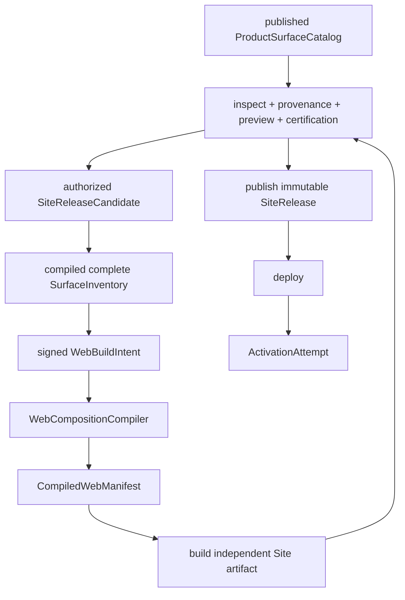

# ADR-016: Web Release Composition

## 状态

已采纳为目标架构，代码尚未完成。只有 Root contract、Web compiler、Platform SiteRelease owner、真实 artifact
inspection、两个独立 Site 的认证与回滚证据全部落地后，才能宣称通用多 Site 产品装配已完成。

## 背景

Kokoro 的增长模式是“一套可信后端，多个完全独立的用户站”。每个 Site 应拥有独立 Web 项目、品牌、域名、账户、
artifact、CI、部署与回滚，同时只开放该 Site 被批准的产品组合。

当前 Web 已经能生成独立 Site，但装配模型仍是一次性实现：

- `SiteProductId` 只有 `memory`；
- scaffold 通过 `memoryEnabled` 手工拼 dependency、route、navigation、template token 和 artifact verifier；
- Chat、Account、Media 与 Site BFF 总是进入 package closure，再依赖运行时 `notFound()`；
- Site BFF 暴露整组 account、asset、media、memory、session facade，Media 没有与 Memory 同等级的产品 gate；
- 当前 source digest 不能代表最终 Next artifact，也没有绑定完整 route/import/BFF/bootstrap/model inventory。

继续为 Image、Music、Video、Library、Memory、Chat 增加更多 `if (enabled)` 会把产品组合分散到 scaffold、template、
package.json、nav、BFF、bootstrap、verifier 和 Platform policy 中，无法证明“关闭”是否完整。另一方面，把这些做成运行时
plugin 或万能动态配置又会允许不受信代码、任意 npm spec、route 冲突和授权绕过。

还必须避免四个概念被混淆：

| 概念 | 含义与 owner |
|---|---|
| Product / Surface | 对用户和运营承诺的业务能力；Platform Product Catalog 是唯一业务 owner，Root 只拥有 schema/compatibility |
| Web composition unit | 一个 Surface 在 Web artifact 中的物理装配映射；Web owner |
| Package artifact | 代码交付单位；可能支撑多个 unit，也可能只是 headless dependency |
| Entitlement / feature policy | 用户和 Site 当前是否允许使用；Platform owner |

## 决策

### 1. 采用 Web Release Composition

整体能力称为 `Web Release Composition`，使用以下稳定名词：

| 名称 | 含义 |
|---|---|
| `WebCompositionUnit` | Web 源码内版本化、纯数据、封闭的物理装配定义 |
| `WebBuildIntent` | Platform 针对 release candidate 签发的不可变构建输入 |
| `CompiledWebManifest` | Web compiler 解析依赖闭包后的确定性物理清单 |
| `WebCompositionCompiler` | Web 仓内纯 TypeScript compiler/CLI，不是新服务 |
| `WebArtifactProvenance` | 构建后对真实 artifact、source、lock、builder 与 manifest 的证明 |

不使用 `ReleaseProductInventory`：它会让物理 Web 装配看起来像 Product Catalog owner。也不新增 `SiteXxx` 业务模块、
运行时 plugin service、新仓库或新的 Kokoro runtime 基础设施；构建侧复用既有 CI executor、package/OCI registry 与
签名/attestation 服务，但必须配置本文的隔离 trust stages。

### 2. 生命周期必须单向，不能让 artifact 自我引用

最终 `SiteRelease` 已冻结 Web artifact，因此 compiler 不能消费最终 SiteRelease。发布顺序固定为：



三种 digest 严格区分：

- `buildIntentDigest`：Platform 签发的业务 revisions 与请求装配集合；
- `compiledWebManifestDigest`：compiler 解析出的 route/package/BFF/bootstrap closure；
- `webArtifactDigest`：构建后真实输出 artifact 的 digest。

任何预先计算的 source/composition digest 都不能命名为 `webArtifactDigest`，也不能预先嵌入尚未产生的 artifact digest。

### 2.1 Canonical bytes 与签名

所有 digest-bearing JSON 使用 UTF-8 I-JSON + RFC 8785 JCS canonical bytes；parser 在 canonicalization 前拒绝 duplicate key、
lone surrogate、非有限数字、未知字段与非 NFC 文本。revision、epoch、size 和其他可能超过安全整数的值使用规范十进制
字符串，时间使用固定 UTC RFC 3339 格式，业务 payload 不使用浮点金额或版本。

WebBuildIntent 使用 DSSE envelope，`payloadType` 固定为 versioned Kokoro media type，payload 是上述 canonical bytes；
Platform Site signing key 通过受信 keyring、audience、environment、key status 与历史有效窗口验证。CompiledWebManifest
以同一 canonicalization 计算 digest，最终由 WebArtifactProvenance 的 DSSE/in-toto statement 绑定，不另建第二份可漂移
签名格式。signature/envelope 字段不进入自身 payload digest。

### 3. WebBuildIntent 是 Platform 签发的最小输入

Root 定义 `web-build-intent.v1` contract、canonicalization、signature corpus 和 breaking gate。Platform Site owner 在
release candidate 已冻结业务 revisions 后签发：

```text
contract/version
intentRef / siteRef / environment / audience
siteReleaseCandidateRef / digest / candidateAuthorizationEpoch
launchProductProfileRef / digest
productSurfaceCatalogRef / digest
surfaceInventoryRef / digest
webCompositionRegistryRevisionRef / webCompositionRegistryDigest
webBuildToolchainRevisionRef / webBuildToolchainDigest
contract floor / opaque modelRoleRef requirements
distinct modelInventory and modelCatalog refs/digests
webBuildMaterialBundleRef / webBuildMaterialBundleDigest
site config / legal / sales / capability assignment refs or digests
issuedAt / candidateAuthorizationEpoch
signingKeyId / signature
```

Platform 只传业务 ref/digest 与 Web 发布的 registry ref/digest，不能选择或传递具体 unit，也不能传 npm package path、
template path、shell、任意 URL、动态 import 或 Web 源码位置。Web compiler 根据完整 SurfaceInventory 与 registry 独立
派生 exact unit closure。签名输入不包含最终 artifact digest。

WebBuildIntent 本身不是 bearer credential，因此不设置会破坏 clean-clone/reproducibility 的 `expiresAt`。在线取件、构建与
回传是否仍被授权，由 candidate state + `candidateAuthorizationEpoch` 和短期 workload credential 决定；归档后的 intent
可离线重验但不能重新授权发布。撤销 candidate 会推进 epoch，使旧 runner 的提交失败。

`ProductSurfaceCatalogRevision` 由 Platform Product Catalog 通过 `draft -> validating -> published -> retired` 管理；发布后
不可变，retired 只禁止新 Release 引用。它为 Product/Surface 提供稳定 ref、revision、依赖、operation family 与 lifecycle。
SiteRelease、Commerce Plan/Offer/Entitlement、ModelOption、Memory policy 和 WebBuildIntent 都必须引用同一份 published
catalog revision，不能继续分别接受“格式合法即可”的 surface 字符串。Root 只发布 catalog schema、canonicalization 和
breaking gate，不拥有或在线编辑 catalog 业务记录。

### 3.1 构建物料是签名内容，不是任意路径

`WebBuildMaterialBundle` 是 Platform Site owner 发布的不可变、canonical 内容包，至少包含：

```text
bundleRef / schemaRevision / digest
brand tokens / logos / icons / public fonts
domain + canonical URL policy
locale inventory / default locale / translation catalog refs
legal document refs / consent and cookie presentation refs
SEO metadata / robots / sitemap / social card refs
typed public runtime config（不含 secret）
```

每个内联内容或 release-material ref 都绑定 media type、size、digest 与 schema；unknown 字段、任意文件路径、网络 URL、
shell、npm spec、template code、secret 或未扫描 binary 一律拒绝。原始品牌媒体可来自 Platform Asset，但进入构建前必须
由发布流水线扫描并提升成 supply-chain registry 中的 immutable release material；它不进入面向用户生成内容的 Platform
Artifact bounded context。敏感 provider/config secret 永不进入 bundle、WebBuildIntent、构建日志或 Next `NEXT_PUBLIC_*`。

### 3.2 构建工具链必须在构建前获批

`WebBuildToolchainRevision` 由 Web Release Composition owner 发布，Root 只定义 schema/compatibility。它在 intent 签名前
冻结：

```text
toolchainRevisionRef / digest
Web base source repository + commit/tree digest
base template revision/digest
compiler artifact OCI digest
inspector artifact OCI digest
build/inspection sandbox image digests
Node/pnpm/Next/TypeScript versions + toolchain BOM digest
lockfile format / install policy / reproducibility policy refs
```

Platform Site owner 只能选择已认证的 immutable revision。Provenance 必须证明实际 source/template、compiler、inspector、
images 与版本完全等于 intent 中的 toolchain revision；“构建完才记录用了什么”不能替代预先批准。Toolchain 不包含 Site
业务配置、secret 或 Product/Surface 定义。

### 4. WebCompositionUnit 只拥有物理映射

Web 仓拥有静态、可审查的 TypeScript registry：

```ts
type WebCompositionUnitKind = "shell" | "surface" | "dependency"

interface WebCompositionUnitDefinition {
  readonly unitRef: string
  readonly revision: string
  readonly kind: WebCompositionUnitKind
  readonly providesSurfaceRefs: readonly string[]
  readonly requiresUnitRefs: readonly string[]
  readonly packageRefs: readonly PackageArtifactRef[]
  readonly routes: readonly RouteContribution[]
  readonly navigation: readonly NavigationContribution[]
  readonly bffOperationGroups: readonly BffOperationAuthority[]
  readonly bootstrapRequirements: readonly string[]
  readonly modelRequirements: readonly ModelRoleRequirement[]
}

const WEB_COMPOSITION_REGISTRY = {
  // reviewed definitions only
} satisfies Readonly<Record<string, WebCompositionUnitDefinition>>
```

Definitions 是纯数据，不包含函数、class instance、任意文件路径、可执行 command、动态 npm spec、网络 URL 或运行时模块
加载器。Product/Surface、Entitlement、Policy、Journey、Pricing 和 certification 的业务语义继续由各 Platform owner
拥有；Root 只拥有跨仓 schema/compatibility，Web 只能声明其物理实现满足哪些已发布 requirement/ref。

Unit kind 的含义：

- `shell`：layout、error boundary、auth callback、health/readiness 等 Launch Profile 必需外壳；
- `surface`：Chat、Account、Memory、Library、Image/Music/Video Studio 等用户可见产品面；
- `dependency`：asset/session client、BFF trust core 等无独立导航与业务承诺的 headless 依赖。

Package 不等于 unit。一个 surface 可以需要多个 packages；一个 dependency package 也可以被多个 surface 复用。

Registry 每次发布形成不可变 `WebCompositionRegistryRevision` 与 digest，拥有唯一 Web 侧 lifecycle：
`draft -> verified -> published -> retired`。BuildIntent 绑定 exact published revision；Platform 不复制其物理 definitions，
Web 也不能用 registry 创建新的 Product/Surface 业务事实。

### 5. Compiler 必须确定性并 fail closed

`WebCompositionCompiler`：

1. 验证 WebBuildIntent 的 schema、签名、key trust、audience、environment、candidate epoch 与 contract floor；在线 build
   必须仍获 candidate authorization，evidence-only reproduction 只能重验、不能提交发布；
2. 验证 SurfaceInventory 是 exact ProductSurfaceCatalogRevision 的完整分区，并从 business surfaces + shell requirements
   通过 registry 派生 exact unit revisions；
3. 计算依赖闭包，unknown/missing/stale revision、环、重复不一致 definition 或未声明依赖全部失败；
4. 检测 pathname、HTTP method、route kind、nav id/order、BFF operation 与 bootstrap contribution 冲突；
5. 验证每个 requested Surface 的 route、BFF、bootstrap、model requirement 与 package closure 完整；
6. 验证未启用 Surface 没有残留 route、nav、facade、bootstrap advertisement 或 assignment；
7. 只从已认证的 immutable package artifact set 解析 exact version/digest；
8. 以固定排序和 canonical encoding 输出 `CompiledWebManifest` 与 digest；
9. 生成源码/lock/template fragment，但不自行签发最终 SiteRelease 或业务权限。

Compiler 不做运行时 Service Locator、不从环境变量发现产品、不根据任意 JSON import 代码，也不把字符串 operation id
变成通用 proxy。

### 6. CompiledWebManifest 与真实 artifact inspection

Root 定义 `compiled-web-manifest.v1` contract。清单至少冻结：

```text
intentRef / buildIntentDigest / releaseCandidateRef
compiler revision / registry digest
exact unit refs/revisions and dependency graph
package names/versions/digests
page/API routes and HTTP methods
navigation contributions
BFF operation family refs, same-origin handler IDs, and downstream operation IDs
bootstrap requirements and advertised surfaces
opaque model role requirements with distinct inventory/catalog bindings
compiled source closure digest / lockfile digest
toolchain revision/digest + actual measured tool artifact digests
compiledWebManifestDigest
```

构建后必须从真实 Next output 与 Site source inspection 得到并核对：

- App/Pages/API route graph、dynamic/catch-all segment 与每个 Route Handler method；
- `proxy.ts`/middleware、matcher、rewrites、redirects、headers、instrumentation 与 edge/runtime selection；
- Server Actions、RSC/server/client chunks、dynamic import 和构建 trace 的真实 import/package closure；
- public/static assets、source map policy、locale/SEO/robots/sitemap 输出与内容 digest；
- BFF operation inventory、embedded bootstrap/manifest、runtime config 与所有 `NEXT_PUBLIC_*`；
- lockfile、SBOM、license policy、package provenance、builder/runtime version 和 reproducibility inputs。

Inspector 必须按 exact Next/builder version 选择受审 adapter；遇到未知 manifest/version 或无法证明的 route/import 就 fail
closed。只验证模板输入、package.json 或单一 routes manifest 不足以证明 artifact。

`WebArtifactProvenance` 绑定 source revision、WebBuildIntent、CompiledWebManifest、lockfile、builder identity、构建环境和
真实输出 digest。其 envelope 采用 in-toto Statement/DSSE，predicate 对齐 SLSA provenance；签名与透明验证由受信
Sigstore/cosign policy 或等价企业 keyless/keyed profile 完成，不自造一套弱签名格式。Preview、业务旅程、a11y、安全扫描
与 certification 绑定同一组 digest。Platform 验证通过后才发布最终 SiteRelease。

`webArtifactDigest` 来自 OCI/package registry 对最终 immutable manifest/index/blob 的 content digest，并由 sandbox 外的
attestor 与 deployment admission evidence 绑定；它不是 Web artifact 内部自报字段。artifact 只嵌入
`compiledWebManifestDigest` 用于运行时比对，部署控制面提供期望的 OCI digest，二者共同防止自签与混版。

### 6.1 构建控制面、无凭据 sandbox 与独立 attestor

每个独立 Site Web 项目的 release pipeline 分成五个隔离 trust stage，不能让执行项目依赖的 build process 持有取件
凭据、compiler/inspector authority 或 provenance signing key：

1. `site-web-build-controller` 是注册 workload。它用短期 audience-bound credential 读取 exact WebBuildIntent，并从
   supply-chain/package registry 获取 digest-bound material、source 与 package inputs，冻结 measured read-only snapshot。
2. 受信 `WebCompositionCompiler` 以固定工具 artifact/revision 运行，只读取签名 intent、published registry 与 business
   catalog/inventory；它不执行 Site source、npm lifecycle 或 Next plugin，并把 manifest/build-plan 写入 controller-owned、
   build sandbox 不可写的 channel。
3. `site-web-build-sandbox` 使用固定 image，在无网络、无 workload credential、无签名密钥、只读 inputs 的隔离环境只
   执行不可信 Site/Next build；它只能写 bounded raw output directory，不能写 compiler/inspection evidence channel。
4. 受信 inspector 使用独立固定工具 artifact，在新的 credential-free inspection sandbox 以只读方式检查 raw output 与
   OCI staging image；build sandbox 不能写其 report channel。unknown Next/tool version、解析错误或报告不完整一律失败。
5. `site-web-attestor` 位于两个 sandbox 外，自行验证签名 intent、candidate epoch、compiler/inspector tool digests、
   measured input/output、CompiledWebManifest、inspection report 与 OCI digest；它不信任任意 controller label 或 build
   产生的 report。验证后签发 provenance，再由 controller 向 Platform Site owner 提交 evidence refs。

Source/package/release-material 与 Web image 保存在 CI package/OCI supply-chain registry；这是一项发布基础设施职责，不是
Platform Artifact（用户生成内容）业务域，也不新增通用业务 Artifact owner。Platform Site owner 只保存并验证 immutable
refs/digests、attestor issuer/subject、signature、candidate epoch 和 certification，然后决定是否发布 SiteRelease。
在线读取能力必须短时、单候选、最小权限；超时/撤销/重复回传按 command receipt 恢复，长期 registry/object-store
credential 不得进入 Web 项目或 sandbox。

### 7. 编译期裁剪与运行期授权同时存在

允许一次请求的集合是：

```text
physical composition in artifact
  ∩ exact SiteRelease / CompiledWebManifest digest
  ∩ current Site feature and policy
  ∩ actor/session scope
  ∩ entitlement/admission
  ∩ effect-point authorization
```

- 编译期负责“代码与入口是否存在”；
- SiteRelease 负责“这个不可变发布承诺什么”；
- feature/policy 负责 kill switch、suspension 与当前限制；
- entitlement/admission 负责“这个 actor 是否可用”；
- effect point 在真正创建 Run/Media/Credit/Artifact 副作用前重新授权。

Feature flag、entitlement、bootstrap 或浏览器状态只能关闭已编译能力，绝不能启用 artifact 中不存在的能力。任何缺失、
unknown、digest mismatch 或过期都 deny。

部署 readiness 必须校验 embedded manifest、artifact digest、workload binding 与 Platform ProductContext 完全匹配。临时产品
kill switch 只关闭对应 route/command，不应让整个 Site pod 失去基础 health；artifact/release 混版则必须 readiness fail。

### 8. BFF 不是万能 Platform proxy

`@kokoro/site-bff` 收缩为公共 trust core：Site workload binding、actor session、CSRF、request budget、timeout、错误映射、
审计 correlation 与 response bounds。

产品专属 server facade 与产品 package 一起发布，优先使用 `./server` 子路径，避免产生大量微型 package。Compiler 只为
已装配 unit 生成 import 和 route；disabled surface 没有 server facade 或可调用 public handler。

生成的公共客户端可以包含完整 schema，因为类型代码本身不产生 authority；但 Site artifact 不能存在接受任意 operation id
并转发 Platform 的通用代理。Media 可以共用 `/api/media` 前缀，但 Image/Music/Video operation family 必须同时受到编译期
allowlist 与运行期 release/product gate 限制。

### 9. Model requirement 只引用，不复制模型目录

Web unit 只声明浏览器体验需要的 opaque `modelRoleRef`；Platform 在 Candidate 中把每个 role 绑定到 distinct、
digest-bound ModelInventory 与 ModelCatalog：

- Chat：assistant catalog 与 default role；
- Image/Music/Video：generation catalog；有对话式提示编排时额外声明 assistant orchestration catalog；
- compiler 只验证 WebBuildIntent 提供的 exact inventory/catalog ref/digest 满足 role requirement；
- Platform Model Control 继续拥有完整 route、provider binding、fallback、availability 与 Site policy。

页面不能用“存在 image surface”推断所有模型都可用，也不能读取 provider list/secret。

### 10. current/candidate、drain 与 rollback

激活窗口允许 current 与 candidate 两个部署同时存在，但每个 workload binding 只能交换自身 artifact/release/manifest digest
对应的 ProductContext。旧浏览器在 drain 窗口内继续绑定旧 release；窗口结束后收到明确 refresh/gone，不静默切换到新
权限。

Rollback 创建新的 ActivationAttempt 指向旧 immutable SiteRelease，并重新验证当前 secret revocation、contract floor、
schema、policy 和 certification。每个 ActivationAttempt 在开始时和 active-pointer CAS 紧前都必须重新读取 authority
snapshot，重验 Candidate authorization epoch、Certification revocation epoch、签名 key status 与 `validUntil`；两次之间
的撤销或过期必须阻止 CAS。它不重新运行旧 compiler，也不覆盖当前 artifact。

### 11. 目录

```text
Root
  contract/spec/product-surface-catalog.yaml
  contract/spec/launch-product-profile.yaml
  contract/spec/site-release-candidate.yaml
  contract/spec/surface-inventory.yaml
  contract/spec/web-build-intent.yaml
  contract/spec/web-build-material-bundle.yaml
  contract/spec/web-build-toolchain.yaml
  contract/spec/compiled-web-manifest.yaml
  contract/spec/web-artifact-provenance-profile.yaml
  contract/spec/release-certification-instance.yaml
  contract/spec/release-certification-revocation.yaml
  contract/spec/site-release.yaml
  contract/corpus/web-release-composition-v1.json

kokoro-web/packages/release-composition
  src/domain/
  src/registry/
  src/compiler/
  src/inspect/

kokoro-web/packages/site-scaffold
  templates/base/
  fragments/<unit-ref>/
  src/scaffold.ts
  src/emit.ts

kokoro-platform/src/modules/site
  application/services/prepare-web-build-intent.ts
  application/services/publish-site-release.ts
  domain/web-build-intent.ts
  domain/compiled-web-manifest.ts
  infrastructure/crypto/

kokoro-platform/src/modules/product-catalog
  domain/product-surface-catalog.ts
  domain/canonical-journey-catalog.ts
  application/publish-catalog.ts
  infrastructure/postgres/
```

这些目录表达 ownership，不要求为了对齐示意图一次性搬动所有文件。Root contract 先于 provider/consumer code；生成 mirror
由各子仓提交，跨仓运行时仍只走版本化协议。

## 被否决方案

### 继续扩展 `enabledProductIds`

短期最少改动，但每个产品都会增加 package/template/route/nav/BFF/verifier 特判，无法证明完整关闭，也无法进行一致的
artifact inspection。

### 运行时插件系统

会引入动态代码执行、依赖/route 冲突、供应链和权限面；Kokoro 的 Site 组合在发布时已知，无需承担运行时插件复杂度。

### 一个共享生产 Web 根据 Host 动态换皮

虽然部署简单，但不符合一个 Site 一个独立项目/artifact/回滚单元的产品目标，也放大品牌、cookie、依赖和发布混版风险。

### Web definition 拥有 Product、Entitlement 与 Journey

会产生第二份业务真相，让 Platform 的 SiteRelease、Policy、Commerce 与认证无法线性化；Web 只拥有物理映射。

### 只做运行时 `notFound()`

能隐藏页面，不能移除 package、API route、BFF facade、bootstrap 或调用能力，既浪费 artifact，也不能作为关闭证据。

## 实施顺序

1. Root 发布 Product/Surface、SurfaceInventory、BuildIntent、MaterialBundle、BuildToolchain、CompiledManifest 与 provenance
   profile 的 v1 schema、canonicalization、corpus 与 architecture gate；
2. Platform Product Catalog 建立唯一 published catalog revision，Site/Commerce/Model 迁到同一 ref；
3. Web 在 shadow mode 建立 registry/compiler，先完全重现 reference Site 的当前输出；
4. 用 base shell + Memory unit 替换 `memoryEnabled` token fragments；
5. 为 Chat、Identity/Account、Asset、Media/Studio、Library 建立 unit 与依赖 closure；
6. 拆分 Site BFF trust core 与产品 `./server` facade；
7. Platform Site owner 发布 MaterialBundle、签发 WebBuildIntent；隔离 controller/compiler/build/inspector/attestor 生成证据后，
   Site owner 验证 CompiledWebManifest/provenance 并发布最终 SiteRelease；
8. ProductContext 绑定 exact catalog + compiled manifest + artifact digest；
9. 加入完整 Next route/import/package/BFF/bootstrap/runtime-config inspection；
10. 用两个差异明显的独立 Site 完成 compile/build/deploy/activation/rollback/cross-Site negative E2E；
11. 删除 `enabledProductIds`、Memory 专用 token fragments 和歧义 source/artifact digest 名称。

迁移期间旧 scaffold 只能作为 shadow comparison 输入，不能让两个 compiler 同时拥有发布 authority。

## 验收

以下全部满足才可宣布完成：

1. Chat-only 与 Music-only 两个 Site 生成不同 route/package/nav/BFF/model closure；
2. disabled Surface 在真实 artifact route/import/package/facade 中不可达，public command 也被 Platform 拒绝；
3. unknown unit、依赖环、route/method/nav/BFF 冲突、缺 artifact 或 catalog requirement 均在构建前失败；
4. tampered WebBuildIntent、CompiledWebManifest、lock、artifact 或 provenance 任一 digest 均拒绝发布/ready；
5. current/candidate 各自绑定 exact manifest，drain 后旧客户端获得明确刷新结果；
6. feature/entitlement 不能启用 artifact 缺席能力，kill switch 能关闭已存在 surface；
7. BFF 没有任意 operation proxy，disabled product server facade 未进入 import graph；
8. 两 Site 的 workload、cookie、cache、command recovery、ProductContext 和 owner data 无交叉；
9. clean clone 可重现 manifest/artifact digest，子仓 CI、Root compatibility、BOM 与 rollback rehearsal 通过；
10. Admin 能显示 candidate 的业务 diff、composition diff、artifact/provenance/certification 与明确失败原因。

## 影响

正面影响：新增/移除产品从多处手工条件收敛为一个受信 definition + compiler；每个 Site artifact 最小、可审计、可验证，
后端 authorization 与物理代码闭包能绑定同一 Release。

代价：需要 Root 新 contract、Platform SiteRelease workflow、Web scaffold/BFF 重构和真实 Next artifact inspector；在完成前，
当前 `memoryEnabled` 只能被描述为试验性裁剪，不能作为通用多 Site 装配完成证据。
