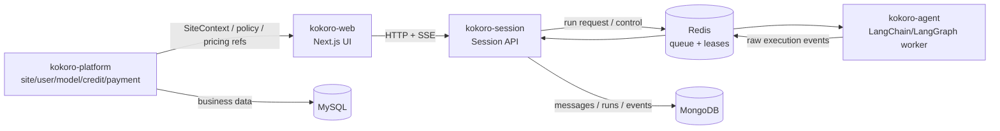

# 系统总览

## 目标

V1 目标不是一次性做完整中台，而是先把通用 agent platform 的三仓运行时做到稳定、可恢复、可扩展、可审计：

1. 用户在 web 发消息。
2. session 接收并保存用户消息，创建唯一 active run。
3. agent 按执行 manifest 选择 model、skills、MCP tools、内置工具、sandbox 和 permission policy，执行 LangChain/LangGraph 工作流，产生原始执行事件。
4. session 将原始执行事件转成产品会话事件，写入 Mongo，并通过 SSE 推给 web。
5. web 刷新或断线后，通过 session snapshot 恢复 UI，再继续 attach active run。

## V1 运行时边界

## 核心思想

### Session 是聊天产品真源

聊天窗口看到的消息、run 状态和浏览器事件属于 `kokoro-session`。Agent 可以有自己的 LangGraph checkpoint 和 memory，但 session 不读 agent 的 checkpoint，不把 agent 内部状态当聊天历史。

### Agent 是执行真源

Agent 负责 LLM、工具、子代理、sandbox、HITL 和 checkpoint。它可以使用 LangChain 的 `BaseMessage.id`、tool call id、run id、checkpoint id，但这些都是执行侧身份标识，不是跨 web/session/agent 的排序协议。

### Redis 是传输，不是数据库

Redis 用于 run request、raw event stream、live fanout、session/run lease 和短期去重。长期历史必须落 Mongo 或 MySQL。系统不能依赖轮询 Mongo 来做实时流，也不能把 Redis 当长期消息库。

### Web 是投影，不是事实源

Web 的 reducer 和 local cache 只负责体验。刷新后以 `GET /sessions/:sessionId` 的 snapshot 为准；如果有 active run，再打开 SSE 继续收事件。Web 不保存 `lastResumeId` 这类业务状态。

## V1 必须包含

- 通用聊天主链路。
- 通用 Skills 底座：官方 skill、用户 skill、workspace skill 的读取、触发和执行。
- 通用 MCP client：HTTP MCP server 连接、tool/prompt/resource 列表、工具调用、权限约束。
- AgentExecutionManifest：session 发给 agent 的一次执行清单，包含 model、skills、tools、MCP、sandbox、permission、context refs。
- 同 session 单 active run。
- Mongo session messages / runs / session_events。
- Redis run queue / raw events / live fanout / locks。

## V1 明确不做

- 不新增 `kokoro-contracts` 仓。
- 不引入 PostgreSQL。
- 不把 SQLite 作为 V1 runtime 存储策略。
- 不做完整 Skill Marketplace / MCP Marketplace 的评分、分成、公开上架。
- 不做 Music/Image/Video/Code Studio 的完整垂直业务后台。
- 不让 agent 直接扣积分。
- 不让 payment 直接写 credit ledger。
- 不让 model 决定最终价格。
- 不让 web/gateway 绕过 SiteContext。
- 不把 LangChain 原生事件或 provider 原始响应直接暴露给浏览器。
