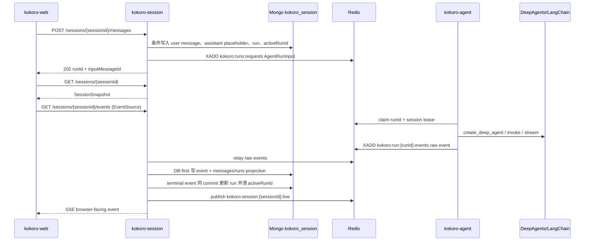

# Agent / Session / Web V1 运行时技术方案

本文只约束 `kokoro-agent`、`kokoro-session`、`kokoro-web`
三个子仓的第一版运行时。平台、账务、支付、模型市场、
后台运营等模块不在本文维护。

## 目标

V1 要先把通用聊天闭环做到稳定、可恢复、可扩展：

```text
kokoro-web 负责用户交互和渲染。
kokoro-session 负责聊天窗口事实源、消息、run、事件、SSE 和 replay。
kokoro-agent 负责基于 DeepAgents/LangChain/LangGraph
执行模型、工具、Skills、MCP、HITL 和 sandbox。
```

核心验收：

```text
用户发送一条消息后，系统只创建一个 active run。
刷新、断线、换标签页后可以通过 snapshot + SSE 继续恢复。
聊天消息长期事实源在 Mongo。
不在 Redis，不在 Web localStorage，不在 agent checkpoint。
Redis 只做 run queue、raw event stream、live fanout、control 和 lease。
Web 不消费 agent raw events，不维护业务 cursor，不依赖 seq 排序。
Agent 不直接写 session messages，不直接扣积分，不直接服务浏览器。
```

## 总体边界

```text
kokoro-web
  owns: UI、composer、snapshot load、EventSource、render reducer、
         HITL UI、Skill/MCP 管理入口。
  does not own: 权威消息、agent 执行、Mongo/Redis、MCP/tool 实际调用。

kokoro-session
  owns: ChatSession、ChatMessage、AgentRun、SessionEvent、
         active run admission、AgentRunInput build、SSE/replay。
  does not own: LangChain 执行、tool 执行、agent checkpoint、Web reducer。

kokoro-agent
  owns: AgentRunInput 解释、DeepAgents runtime、tool registry、
         Skills/MCP、HITL、sandbox、raw events。
  does not own: session messages、browser-facing event contract、Web UI、账务。
```

三仓之间只能通过明确接口通信：

```text
web -> session: HTTP + SSE
session -> agent: Redis run request / control / raw events
agent -> session: Redis raw execution events
session -> web: browser-facing SSE events
```

## V1 主链路



注意：`session` 必须 DB-first。先发 live 后落 Mongo 会造成浏览器
已收到、刷新后 replay 丢失。terminal event 必须和 run terminal
status、`activeRunId=null` 在同一个 Mongo commit 内完成，然后才
publish live。

## HTTP / SSE 接口

### `POST /sessions/:sessionId/messages`

创建用户消息并启动一次 run。

请求体：

```text
idempotencyKey
content
attachments
executionStyle
permissionMode
selectedSkillIds
selectedMcpServerIds
selectedToolNames
```

处理规则：

```text
idempotencyKey 命中旧请求时返回同一个 runId，不重复创建消息。
非同一 idempotencyKey 的请求，如果同 session 已有 active run，返回 session_run_active。
写 Mongo 成功后才投递 run.request。
投递失败时 run 标记 enqueue_failed，并清 activeRunId。
```

### `GET /sessions/:sessionId`

返回权威 snapshot：

```text
session metadata
messages page
activeRun
recent activity projection
eventWatermark
```

刷新、切换会话、SSE 失败恢复都先走 snapshot。Web 不能把 localStorage
当权威事实源。

`eventWatermark` 是 snapshot 已包含的 session event 水位。Web 不把它
保存成业务 cursor；session 服务端用它避免把 snapshot 已折叠进
messages/activity 的事件重复 replay 给同一次 attach。

### `GET /sessions/:sessionId/events`

标准 EventSource SSE。

规则：

```text
SSE id: 是传输层内部 replay anchor，不进入 Web domain state。
data.eventId: 是业务幂等去重锚，不排序。
Web 不拼 ?after=<lastResumeId>。
缺失 Last-Event-ID 时允许 snapshot + active run replay + eventId 去重。
Last-Event-ID 过期或未知时返回可恢复 replay，不静默空流。
```

为什么不做“单 POST 接口一直流到底”：浏览器原生 `EventSource`
的标准重连能力在 GET SSE 上，`Last-Event-ID` 是标准机制。
如果用 fetch POST stream，就需要自己发明 `after` 参数和恢复协议。
产品层可以封装成 `sendMessageAndStream()`，HTTP 层保留
message POST + EventSource。

Mongo replay 到 Redis live tail 的 handoff：

```text
1. SSE 连接建立后，先读取当前 Redis live stream tail id。
2. 从 Mongo replay Last-Event-ID 或 snapshot eventWatermark 之后的事件。
3. 再从第 1 步的 Redis tail id 之后开始 tail live。
4. 第 2、3 步重叠的事件由 eventId 去重。
5. 如果 live publish 失败，outbox retry；刷新时 Mongo snapshot/replay 仍是权威。
```

### `POST /sessions/:sessionId/runs/:runId/control`

HITL 和取消入口：

```text
approve / reject / edit / respond / cancel
```

Session 必须校验：

```text
run 属于该 session。
用户拥有该 session 权限。
run 仍处于可控制状态。
decision 指向明确 toolCallId 或 runId。
同一 HITL frame 内的多 tool 决策必须保持 action_requests 顺序。
```

## 存储设计

### Mongo: `kokoro_session`

Session 持久真源只用 Mongo。`kokoro-session` 不再提供 SQLite runtime 策略。

```text
sessions
  siteId
  sessionId
  ownerUserId
  workspaceId
  projectId
  title
  status
  activeRunId
  createdAt
  updatedAt
  version

messages
  siteId
  sessionId
  messageId
  runId
  role
  content
  parts
  attachments
  status
  createdAt
  updatedAt

runs
  siteId
  sessionId
  runId
  inputMessageId
  assistantMessageId
  status
  executionStyle
  permissionMode
  modelRuntime
  backendPolicy
  agentRunInput
  error
  startedAt
  completedAt

session_events
  siteId
  sessionId
  runId
  eventId
  sseId
  event
  payload
  createdAt

outbox
  outboxId
  sessionId
  runId
  eventId
  payload
  status
  retryCount
  createdAt
```

`messages` 是聊天展示的主数据；`session_events` 是 replay/live/debug/audit
数据。不要每次展示聊天都从 event log 全量重放。

### Redis

```text
kokoro:runs:requests
  run.request queue，建议 consumer group + ack。

kokoro:run:{runId}:events
  agent raw events，run 级原始事件流。

kokoro:session:{sessionId}:live
  session SSE live fanout，有界窗口。

kokoro:run:{runId}:control
  HITL/cancel control。

kokoro:agent:run:{runId}:lease
  防重复执行。

kokoro:agent:session:{sessionId}:lease
  防同 session 并行执行，作为 session activeRunId 的防御层。
```

Redis 不是长期历史。live bus 被裁剪后，刷新恢复必须靠 Mongo snapshot/replay。

## 排序、幂等和事件 ID

V1 不引入 `eventPosition`，Web 不依赖 `seq`。

```text
BaseMessage.id
  LangChain 消息身份，不是跨 pod 顺序。

toolCallId
  工具调用身份，不是全局顺序。

eventId
  幂等去重锚，不排序。
  必须稳定生成；不能 retry/reclaim 时随机变化。

sseId
  Session 传输层 replay anchor，可来自 Mongo 内部追加锚点，Web domain 不读取。

Mongo append order
  Session replay 的内部顺序依据。

SSE single connection order
  Web render reducer 的事件到达顺序。
```

同 session V1 只有一个 active run，所以不需要跨 run 合并排序。
未来如果开放同 session 多 active run，必须重新设计排序模型，
不能偷偷复用 V1 简化规则。

Run terminal event 种类保持收敛：

```text
run.completed
  status 可以是 completed / cancelled / timeout。

run.failed
  表示执行失败，payload 带 errorKind 和 message。
```

V1 不新增 `run.cancelled` 或 `run.timeout` 事件 kind。

## AgentRunInput

Session 发给 Agent 的不是散字段，而是一份完整 manifest：

```text
AgentRunInput
  siteId
  workspaceId
  projectId
  sessionId
  runId
  userId
  inputMessageId
  assistantMessageId
  context
    recentMessages
    summary
    artifactRefs
    toolResultRefs
    userProvidedFiles
  modelRuntime
    provider
    model
    temperature
    maxTokens
    responseFormat
  executionStyle
  permissionMode
  backendPolicy
  enabledSkills
  enabledMcpServers
  enabledTools
  traceContext
```

AgentRunInput 是 agent 的唯一产品上下文入口。Agent 不跨库读取
session Mongo，不自己查询全局 skill/MCP 列表。

`context` 必须是 session 已解析好的上下文包，或可由 agent 通过独立
artifact/content 服务读取的引用。V1 不允许 agent 为了补上下文直接读
`kokoro_session` collections。

## Agent 架构

Agent 要站在 DeepAgents/LangChain/LangGraph 能力上，不重写一套 agent framework。

```text
domain
  AgentRunInput
  AgentRuntimeConfig
  ToolPolicy
  SandboxPolicy
  RawExecutionEvent

application
  run_supervisor
  manifest_validation
  approval_flow
  event_projection
  run_lease

infrastructure
  deepagents_runtime
  langchain_event_adapter
  tool_registry
  skill_loader
  mcp_client
  backend_config
  redis_run_queue
  mongo_checkpoint_store

interfaces
  worker_main
  run_request_consumer
```

不要用 `ports/` 目录名。需要抽象时使用 `application/interfaces` 或 `application/protocols`。

### DeepAgents Backend / Sandbox

V1 不自研一套 sandbox framework。配置最终要构造成 DeepAgents
`create_deep_agent(..., backend=backend_instance)` 可直接使用的 backend。

```text
backend.kind
  state
  local_shell
  e2b
  agentcore
  langsmith
  daytona
  modal
  runloop
  custom

backend.options
  provider-specific settings
  artifact storage refs
  network policy
  timeout/resource policy
```

允许在配置里保留 `sandbox.provider` 作为用户友好的别名，但代码内
最终只产生一个 DeepAgents backend instance。

```text
sandbox.provider=e2b      -> backend.kind=e2b
sandbox.provider=custom   -> backend.kind=custom
```

约束：

```text
state 是安全默认，可用于生产的普通推理/工具编排。
local_shell 只允许 development/test/受控环境，不能作为多租户生产隔离。
远程 backend 需要显式配置依赖和密钥，缺依赖必须 fail loud。
S3 不是执行 sandbox，只能作为 artifact/object storage 或 custom backend 的存储组成。
```

V1 最小实现只需要 `state`、`local_shell`、`e2b`、`custom` 四类。
其它官方 backend 可以作为后续扩展，不在 V1 文档中承诺已实现。

### Tools

内置工具要少而清楚：

```text
now
  使用 manifest/user timezone，不能使用服务器本地时间当用户语义时间。

web_fetch
  默认带 allowlist/denylist/超时/大小限制/重定向限制，高风险可走 HITL。

filesystem / code execution
  只能通过 DeepAgents backend/sandbox，不能直接访问宿主文件系统。

task/subagent
  使用 manifest 声明的 subagent profile，不允许模型默认任意写 system_prompt 创建运行时子代理。
```

Runtime subagent creation 可以作为高级能力保留，但默认必须拦截为 `propose_subagent`，经策略或用户确认后才创建。
DeepAgents 默认的 `general-purpose` subagent 和 dynamic subagent 能力必须
显式替换或关闭；Code Interpreter 一类中间件不能隐式开启 dynamic
subagents 绕过 manifest。

### Permission / HITL

Permission 不应该散落在工具函数内部，应该优先使用 DeepAgents/LangChain
官方 HITL/permission 机制：

```text
HumanInTheLoopMiddleware / interrupt_on
  对需要审批的 tool 生成 action_requests。

checkpointer + thread_id
  保证 HITL 后可 resume 同一个 LangGraph thread。

resume command
  按 action_requests 顺序提交 approve / reject / edit / respond。

tool wrapper
  只补 Kokoro policy、审计、截断和 raw event 投影。
```

高风险工具：

```text
web_fetch 外部网络
filesystem write/edit
shell/code execution
MCP write/delete/send
runtime subagent creation
```

默认策略：开发可宽松，生产保守；manifest 可以收窄权限，不能扩大 site/workspace 授权。
DeepAgents `FilesystemPermission` 只覆盖官方文件工具，不覆盖 custom/MCP/
sandbox execute；这些工具仍必须进入 Kokoro tool policy。

## Web 架构

Web 的核心不是“保存流”，而是“从权威 snapshot + live events 渲染 UI”。

```text
domain
  SessionSnapshot
  RenderEvent
  ThreadItem
  AgentActivityItem

application
  SessionTransport
  SessionReducer
  SnapshotHydrator
  MessageComposerController
  HitlController

infrastructure
  HttpSessionClient
  EventSourceClient
  TransportSchema
  LocalUiCache

interfaces
  ThreadView
  Composer
  AgentActivityPanel
  HitlControls
  SkillMcpManagementEntry
```

规则：

```text
Web reducer 按 eventId 去重。
Web 不读取 sseId/cursor/seq 排序。
message.completed 以最终内容覆盖 delta 累积。
SSE 单条 malformed event skip-and-continue。
刷新先 GET snapshot，再 attach active run SSE。
localStorage 只存草稿、折叠态、activeSessionId，不能存权威 run status。
```

## 配置文件规范

三仓统一使用 YAML 配置和系统 env 覆盖：

```text
.env.example.yaml       提交到仓库，展示完整 schema 和安全默认。
.env.yaml               本地私有，不提交。
.env.development.yaml   开发 profile。
.env.test.yaml          测试 profile。
.env.prerelease.yaml    预发 profile。
.env.production.yaml    生产 profile。
```

加载优先级：

```text
code defaults
  -> .env.yaml
  -> .env.${KOKORO_ENV}.yaml
  -> KOKORO_CONFIG_FILE 指向的 YAML
  -> 系统 env / K8s Secret / ExternalSecret
```

禁止把 `.env.dev`、`.env.prod` 作为官方命名，避免别名过多。
Docker/K8s 通过 `KOKORO_ENV` 和 `KOKORO_CONFIG_FILE` 指定 profile；
镜像不内置真实密钥。

生产约束：

```text
kokoro-session 必须使用 Mongo，不支持 SQLite。
kokoro-session Redis 必须使用真实 Redis，不使用 memory。
kokoro-agent production 不允许 local_shell 作为默认执行 backend。
kokoro-web public env 只能放浏览器可见配置。
```

## 性能策略

### Token delta micro-batch

Micro-batch 不是把事件变成“不完整”。它的意思是：agent/model
可能每个 token 或字符都吐一次，但 session 不必每个字符都写一条
Mongo/SSE。

```text
错误理解：
  每个字符一条 message.delta，全部单独落库。

V1 目标：
  20-50ms 或 N 个字符合并成一条完整 message.delta event。
  每条 event 都是完整 JSON，有 eventId、messageId、segmentId、delta。
  message.completed 写最终完整内容。
```

这样减少 Mongo 写入和 SSE 帧数量，同时不破坏 replay 和幂等。

### 大输出

```text
MCP/tool 大返回截断到 UI 可读摘要。
完整输出写 artifact/object storage 或 Mongo content collection。
SSE 只传引用、摘要和状态。
二进制不进 SSE。
```

### Snapshot

```text
messages 分页。
activity 只返回 active/recent run。
长 session 用 summary 和 context refs 给 agent，不无限塞全文。
```

## P0 实施顺序

```text
1. kokoro-session
   建 ChatSession/ChatMessage/AgentRun/SessionEvent 模型。
   Mongo repository 替代当前 event-only MessageStore。
   实现 POST /messages、GET snapshot、GET events。
   加 active run admission 和 run ownership 校验。
   relay 改为 DB-first，再 publish live/outbox。

2. kokoro-web
   Transport 改为 message POST + snapshot + EventSource。
   Reducer 去掉 seq/cursor 排序语义。
   本地 cache 改成可丢弃 UI cache。
   HITL control 对齐新 session API。

3. kokoro-agent
   收敛 AgentRunInput。
   清理命名和目录，移除 __init__.py 业务逻辑。
   基于 DeepAgents backend/HITL/permission 组织 tool 和 sandbox。
   Runtime subagent creation 默认变成 gated proposal。
   删除 memory_store.py 这类额外 runtime store。
   SQLite 仅可作为 agent 独立测试 fixture。
```

## 禁止项

```text
禁止新增 kokoro-contracts。
禁止使用 ports 目录命名。
禁止 session 使用 SQLite runtime。
禁止 Web 直连 agent。
禁止 agent 写 session Mongo。
禁止 Redis 作为长期聊天历史。
禁止 eventId/seq/BaseMessage.id/toolCallId 承担全局排序。
禁止为兼容旧本地缓存保留大段污染代码。
```

## 官方参考

```text
DeepAgents overview/backends/HITL/tools/subagents/permissions/middleware。
LangChain BaseMessage.id 只作为消息身份字段，不作为 Kokoro 跨服务排序依据。
```
