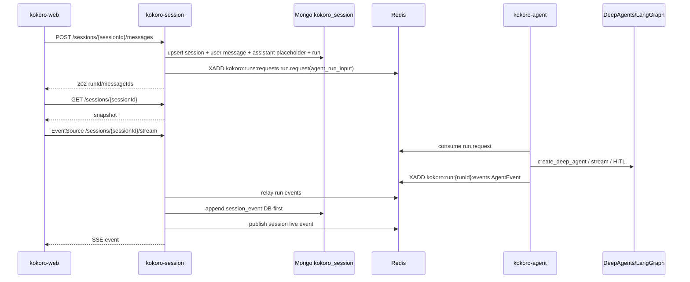

# Agent / Session / Web V1 运行时技术方案

本文只约束 `kokoro-agent`、`kokoro-session`、`kokoro-web` 三个子仓的
通用聊天运行时。平台、账务、支付、模型市场、官方后台、Music/Studio
等模块不在本文展开。

## 结论先行

V1 标准设计是：

```text
kokoro-web
  只负责用户交互、snapshot hydrate、SSE 消费和 render reducer。

kokoro-session
  拥有 ChatSession / ChatMessage / AgentRun / SessionEvent，
  Mongo DB-first 持久化，Redis 只做队列/live fanout。

kokoro-agent
  基于 DeepAgents/LangChain/LangGraph 执行模型、工具、HITL、子代理，
  只输出 agent 原始 wire events。
```

当前代码已经完成了一部分，但不能宣称三仓闭环完全正确：

```text
P0 阻断 1：
  kokoro-session 当前发布 manifest-first run.request：
    kind / site_id / run_id / session_id / agent_run_input
  kokoro-agent 当前接受旧扁平 RunRequest：
    kind / run_id / session_id / conversation_id / input / execution_style / permission_mode
  这两个契约未合流，真实三仓运行会在 agent 入站 parse 阶段断掉。

P0 阻断 2：
  session 已有 GET /sessions/:id snapshot，web 还没有 snapshot-first hydrate，
  当前 web 刷新恢复仍直接 reattach /stream。

P0 阻断 3：
  MCP、skills、backend/sandbox policy 尚未完整落地到 agent runtime，
  只能写为目标能力，不能写为已实现能力。
```

## 强制边界

```text
web -> session:
  HTTP + EventSource SSE。

session -> agent:
  Redis run request / resume / cancel。

agent -> session:
  Redis run event stream。

session -> web:
  browser-facing SSE events。
```

禁止：

```text
Web 直连 agent。
Web 直连 Redis/Mongo/MCP provider。
Agent 写 session Mongo。
Agent 直接扣积分。
Session 执行 agent 或 tool。
Redis 作为长期聊天历史。
eventId / seq / BaseMessage.id / Redis cursor 承担排序。
为了旧测试或旧 localStorage 保留兼容污染。
```

## 当前实现事实

### kokoro-session

已实现：

```text
POST /sessions/:sessionId/messages
GET  /sessions/:sessionId
GET  /sessions/:sessionId/stream
POST /sessions/:sessionId/runs/:runId/control

MongoSessionStore:
  sessions / messages / runs / session_events / outbox placeholder。

Session event replay:
  Last-Event-ID 使用 event_id。
  unknown Last-Event-ID 当前退化为全量 replay。

Normalizer:
  agent event/request_id/timestamp/data -> session AGUI event。
  event_id 是 opaque 幂等锚点，不排序。
```

未完成：

```text
run.request 与 agent Python 入站契约合流。
outbox retry。
assistant message completed content 完整 projection。
snapshot DTO 分页与正式 hydrate contract。
control endpoint 的完整 site/user/run ownership 校验。
```

### kokoro-agent

已实现：

```text
DeepAgents create_deep_agent。
LangChain HumanInTheLoopMiddleware interrupt_on。
run.request / run.resume / run.cancel 消费。
AgentEvent strict wire envelope:
  event / request_id / timestamp / data。
checkpoint backend:
  memory / sqlite / mongo。
run_state backend:
  memory / sqlite / mongo。
tools:
  now / fetch_url。
subagents:
  built-in researcher / env custom / runtime registry。
```

未完成：

```text
AgentRunInput manifest 消费。
MCP client 产品化。
skills manifest 产品化。
backendPolicy -> DeepAgents backend。
E2B/custom backend。
runtime subagent proposal/approval gate。
```

### kokoro-web

已实现：

```text
POST /sessions/:sessionId/messages。
EventSource /sessions/:sessionId/stream。
transport schema strict parse。
event mapper。
reducer eventId 去重。
stepsByRun append-order 展示。
HITL approve/reject/cancel UI。
preview simulator fallback。
localStorage conversation store。
```

未完成：

```text
GET /sessions/:id snapshot-first hydrate。
edit/respond HITL UI。
Skill/MCP 管理入口。
服务端 session list。
```

## 目标主链路



关键规则：

```text
Session 必须 DB-first。
Terminal event 必须同时更新 run terminal status 并清 activeRunId。
Live publish 失败不能让 Mongo 事实丢失。
Web 只把 eventId 当去重锚点。
Web 渲染顺序来自 SSE 单连接发送顺序和 reducer append order。
```

## HTTP / SSE 标准

### POST `/sessions/:sessionId/messages`

创建用户消息并启动 run。

```text
idempotencyKey
content
attachments?
executionStyle?
permissionMode?
selectedSkillIds?
selectedMcpServerIds?
selectedToolNames?
```

规则：

```text
idempotencyKey 命中旧请求时返回同一 runId。
非同一 idempotencyKey 且 session 有 activeRunId 时返回 session_run_active。
写 Mongo 成功后才能投递 run.request。
投递失败必须把 run 标记 enqueue_failed 并清 activeRunId。
```

### GET `/sessions/:sessionId`

返回 snapshot。当前代码返回：

```text
session
messages
runs
events
eventWatermark
```

目标态需要正式 DTO：

```text
session metadata
messages page
activeRun
recent activity projection
eventWatermark
```

Web 恢复必须先 snapshot hydrate，再 attach active run SSE。

### GET `/sessions/:sessionId/stream`

当前实际 SSE 路径是 `/stream`。如果将来改名为 `/events`，必须 session/web
一次性改净，不保留两个启动路径。

规则：

```text
SSE id 当前使用 event_id。
data.event_id 是业务幂等锚点，不排序。
浏览器同一 EventSource 自动重连会带 Last-Event-ID。
新建 EventSource 不能手动设置 Last-Event-ID header。
缺失或未知 Last-Event-ID 时，session 可全量 replay，web 用 eventId 去重。
```

### POST `/sessions/:sessionId/runs/:runId/control`

HITL/cancel 入口：

```text
run.cancel
run.resume(decisions: approve | reject | edit | respond)
```

当前 web 只实现 approve/reject/cancel UI；edit/respond 是 wire 能力，UI 未完成。

## run.request 契约

目标唯一契约是 manifest-first：

```text
kind: run.request
site_id
run_id
session_id
agent_run_input:
  siteId
  workspaceId
  projectId
  sessionId
  runId
  userId
  inputMessageId
  assistantMessageId
  context.recentMessages
  context.summary
  context.artifactRefs
  context.toolResultRefs
  context.userProvidedFiles
  modelRuntime
  executionStyle
  permissionMode
  backendPolicy
  enabledSkills
  enabledMcpServers
  enabledTools
  traceContext
```

下一步必须删除 agent 旧扁平入站契约，或在一次迁移中让 agent 只接受该 manifest。
不允许为了兼容同时长期支持两套 run.request。

## AgentEvent 契约

Agent 原始 wire 单源在 `kokoro-agent/src/kokoro_agent/interfaces/envelope.py`：

```text
event:
  agent_status
  text_chunk
  reasoning_chunk
  tool_call_start
  tool_call_awaiting
  tool_call_end
  agent_done
  agent_error

envelope:
  request_id
  timestamp
  data
```

`contract/events.yaml` 约束的是 session AGUI/web render 层，不是 agent Python
wire 的唯一来源。文档里不能把二者混写。

## 存储设计

### Mongo

```text
kokoro_session.sessions
kokoro_session.messages
kokoro_session.runs
kokoro_session.session_events
kokoro_session.outbox

agent checkpoint/run_state:
  production 建议使用独立 Mongo collections/database。
```

聊天消息事实源是 session Mongo，不是 Redis，不是 Web localStorage，不是 agent checkpoint。

### Redis

```text
kokoro:runs:requests
  run.request / run.resume / run.cancel。

kokoro:run:{runId}:events
  agent raw events。

kokoro:session:{sessionId}:live
  session live fanout，有界窗口。
```

Redis live 被裁剪后，恢复靠 Mongo snapshot/replay。

## 排序、幂等和 ID

```text
eventId / event_id
  opaque 幂等锚点，不排序。

SSE id
  传输层续点，当前等于 event_id，不进入 Web domain。

Mongo _id append order
  session replay 内部顺序依据。

SSE 单连接发送顺序
  web reducer append order。

BaseMessage.id / toolCallId / segmentId
  身份锚点，不是跨服务排序字段。
```

V1 同 session 只允许一个 active run。未来若开放同 session 多 active run，
必须重新设计排序模型，不能复用 V1 简化规则。

## DeepAgents / Tools / Sandbox

V1 要站在 DeepAgents/LangChain 能力上，不自研 agent framework。

当前已用：

```text
create_deep_agent
HumanInTheLoopMiddleware / interrupt_on
checkpoint
DeepAgents tool/subagent projection
```

目标但未完成：

```text
backendPolicy -> DeepAgents backend。
state/local_shell/e2b/custom 统一配置。
MCP client。
skills manifest。
runtime subagent gated proposal。
```

约束：

```text
local_shell 只能 development/test/受控单租户。
e2b/custom 缺依赖必须 fail loud。
S3 只能作为 artifact/object storage，不是 sandbox。
runtime subagent creation 默认必须拦截为 proposal。
```

## 性能策略

### Token Delta Micro-batch

Micro-batch 不是“不完整事件”。它是把多个 token/字符合并成一条完整
`message.delta` event：

```text
每条 event 仍是完整 JSON。
每条 event 有 eventId、segmentId、delta。
message.completed 写最终完整内容。
```

目标是减少 Mongo 写入和 SSE 帧数量，不破坏 replay 和幂等。

### 大输出

```text
MCP/tool 大返回进入摘要 + 引用。
完整输出进入 artifact/object storage 或 Mongo content collection。
二进制不进 SSE。
```

## P0 实施顺序

```text
1. 契约合流：
   agent Python RunRequest 改为 manifest-first agent_run_input。
   session/web/agent 端到端 smoke 必须覆盖真实请求。

2. Snapshot-first：
   web GET /sessions/:id hydrate。
   reattach 改成 snapshot 后 attach active run。

3. Session projection：
   message.completed 写 assistant message content。
   terminal event 清 activeRunId。
   control endpoint 校验 run/session/site/user 归属。

4. Agent runtime policy：
   backendPolicy 建模。
   runtime subagent proposal gate。
   MCP/skills manifest 最小实现。
```

## 官方参考约束

```text
DeepAgents/LangChain 是 agent runtime 地基。
LangChain BaseMessage.id 只能作为消息身份。
HumanInTheLoopMiddleware 是 HITL 首选机制。
```
