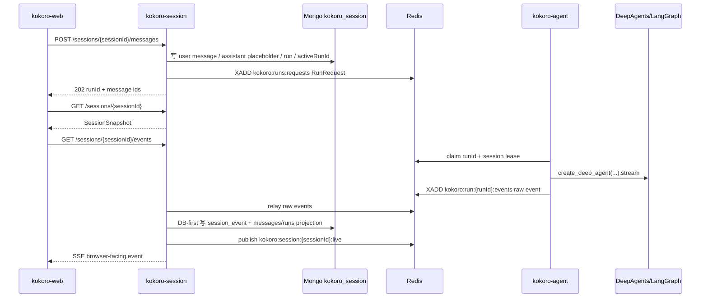

# Agent / Session / Web V1 标准运行时方案

> 状态：V1 三仓交互基线。它定义 Web → Session → Agent 的职责和 transport 语义；Agent
> 当前内部目录、S3Workspace、Capability/Storage 源码边界以
> [09-agent](backend-design/09-agent.md)、[kokoro-agent 技术方案](../modules/kokoro-agent.md)
> 与 [29 Storage 架构](29-capability-storage-runtime-architecture.md) 为准；完整业务链、Session
> checkpoint 连续性、动态 Skill 与 fork/cleanup 的目标决策以
> [36 GA 整体 Agent 最终技术方案](36-ga-final-agent-technical-plan.md) 为准。本文后半部的
> `RuntimeConfig.skills` 全量 mount、namespace profile、`assets/`、旧技能物化等实现注记仅作 V1
> 演进记录，不能直接生成新代码。

本文只约束 `kokoro-agent`、`kokoro-session`、`kokoro-web`
三个子仓的 V1 通用聊天运行时。平台、账务、支付、模型目录、
官方后台和公开 Hub 只作为上游能力来源，不在本文展开实现。

HIL、工具执行前后拦截、`ask_user_question` 和 Web 暂停点的专项方案见：
[Agent HIL 与工具拦截标准方案](12-agent-hitl-tool-interception.md)。

## 设计立场

V1 不再围绕自造的 Agent runtime 抽象设计，而是以主流框架为基座：

```text
LangChain / LangGraph:
  agent.invoke / agent.stream
  config.configurable.thread_id
  Runtime context
  checkpointer / store
  middleware
  interrupt / Command(resume=...)

DeepAgents:
  create_deep_agent
  tools
  skills
  backend
  permissions
  subagents / task tool
  interrupt_on

Browser:
  POST 创建消息
  GET snapshot
  EventSource SSE
  Last-Event-ID 自动续连
```

Kokoro 只在跨服务边界上补必要能力：会话事实源、事件持久化、
SSE replay、权限解析、能力挂载和审计。禁止为了实现方便再造一套
平行 Agent 协议。

## 目标

```text
用户发送一条消息后，只创建一个 active run。
刷新、断线、换标签页后，Web 通过 snapshot + EventSource 恢复。
聊天消息长期事实源在 kokoro-session 的 Mongo。
Redis 只做队列、live fanout、control 和 lease，不做长期事实源。
Agent 执行使用 DeepAgents/LangChain/LangGraph 原生能力。
Web 不消费 agent raw events，不维护业务 cursor；只使用 session 派生的 seq 做同一 run 内 UI 交错。
```

## 三仓边界

```text
kokoro-web
  owns:
    用户交互、composer、snapshot 加载、EventSource、
    render reducer、HITL UI、Skill/MCP 管理入口。
  does not own:
    权威消息、agent 执行、Mongo/Redis、MCP/tool 实际调用。

kokoro-session
  owns:
    ChatSession、ChatMessage、AgentRun、SessionEvent、
    active run admission、RunRequest 构建、SSE replay/live。
  does not own:
    LangChain 执行、tool 执行、agent checkpoint、Web reducer。

kokoro-agent
  owns:
    RunRequest 执行、DeepAgents harness、model/tools/skills/MCP、
    subagents、HITL、sandbox/backend、checkpoint、raw events。
  does not own:
    session messages、browser-facing event contract、Web UI、账务。
```

通信只能走明确接口：

```text
web -> session:
  HTTP + SSE

session -> agent:
  Redis run request / control

agent -> session:
  Redis raw execution events

session -> web:
  browser-facing SSE events
```

## 命名标准

### 保留

```text
sessionId
  产品侧聊天窗口 ID。Web、Session API 使用。

threadId
  Agent/LangGraph 边界 ID，对应 config.configurable.thread_id。
  V1 取值等于 sessionId，但命名只在 agent 边界使用。

runId
  一次 agent 执行 ID。

RunRequest
  Session 投递给 Agent 的一次执行请求。

RuntimeConfig
  本次 run 的模型、工具、skills、MCP、backend、权限、HITL 策略。

RuntimeContext
  LangChain Runtime context 的业务上下文输入。

eventId
  业务幂等去重 ID，不排序。

SSE id
  传输层 replay anchor，只给 EventSource/Last-Event-ID 使用。
```

### 删除

```text
RunJob
  太抽象，不贴近 LangGraph/DeepAgents/CLI 工具命名。

AgentRunInput
  语义过宽，容易变成所有字段的大杂烩。V1 改为 RunRequest。

conversationId
  与 sessionId/threadId 重叠。V1 删除。

permissionMode
  auto/default/plan 过粗，且 auto 容易成为危险默认。
  V1 改为 RuntimeConfig.permissions + interrupt_on。

seq
  不作为 agent 业务字段，也不作为 replay cursor；仅是 session 派生的 render order。

cursor / lastResumeId / after
  不作为产品 API。SSE id 是内部传输锚点。

respond
  不作为通用 control 动作。仅在 LangChain HITL 中作为 ask_user_question
  这类人工代答工具的原生 decision type。
```

## RunRequest

RunRequest 是跨 `session -> agent` 的唯一执行输入。

```text
RunRequest
  kind: "run.request"
  runId
  threadId
  input
  runtime
  context
  trace
```

### input

```text
input
  messageId
  content?
  contentRef?
  attachments?
```

规则：

```text
短文本可直接带 content。
大输入、附件、长上下文通过 contentRef / attachment refs 引用。
contentRef 由 session 持久化和授权，agent 只能按本次 run grant 读取。
```

### runtime

```text
RuntimeConfig
  model
  tools
  skills
  mcp
  subagents
  backend
  permissions
  interrupt_on
  checkpointer
  store
```

RuntimeConfig 是已解析配置，不是 Hub/catalog 源数据。
Agent 不拿 git/http/local_path 这类安装来源自己解析，也不跨站查询全局 Hub。

### context

```text
RuntimeContext
  siteId
  userId
  workspaceId?
  projectId?
  sessionId
  recentMessages
  summary?
  memoryScope?
  artifactRefs?
  toolResultRefs?
  featureFlags?
```

Context 对齐 LangChain Runtime context，用于工具和 middleware 的依赖注入。
不要起 `KokoroRunContext` 这类项目名前缀。

## V1 主链路


```mermaid
sequenceDiagram
  participant W as kokoro-web
  participant S as kokoro-session
  participant M as Mongo kokoro_session
  participant R as Redis
  participant A as kokoro-agent
  participant L as DeepAgents/LangGraph

  W->>S: POST /sessions/{sessionId}/messages
  S->>M: 写 user message / assistant placeholder / run / activeRunId
  S->>R: XADD kokoro:runs:requests RunRequest
  S-->>W: 202 runId + message ids
  W->>S: GET /sessions/{sessionId}
  S-->>W: SessionSnapshot
  W->>S: GET /sessions/{sessionId}/events
  A->>R: claim runId + session lease
  A->>L: create_deep_agent(...).stream
  A->>R: XADD kokoro:run:{runId}:events raw event
  S->>R: relay raw events
  S->>M: DB-first 写 session_event + messages/runs projection
  S->>R: publish kokoro:session:{sessionId}:live
  S-->>W: SSE browser-facing event
```

终态事件必须在同一个 Mongo commit 中更新：

```text
runs.status
messages.final content/status
sessions.activeRunId = null
session_events terminal event
```

commit 成功后才能 publish live。禁止先 live 再落库。

## HTTP / SSE 契约

### `POST /sessions/:sessionId/messages`

发送用户消息并启动一次 run。

请求体：

```text
idempotencyKey
content?
contentRef?
attachments?
selectedModel?
selectedSkillIds?
selectedMcpServerIds?
selectedToolNames?
```

规则：

```text
idempotencyKey 命中旧请求时返回同一 runId。
非同一 idempotencyKey 且 session 已有 active run，返回 session_run_active。
Mongo 写入成功后才投递 RunRequest。
投递失败时 run 标记 enqueue_failed，并清 activeRunId。
```

### `GET /sessions/:sessionId`

返回权威读取模型：

```text
session metadata
messages page
activeRun
recent activity
eventWatermark
```

`eventWatermark` 是服务端告诉自己“这个 snapshot 已折叠到哪里”的内部水位。
Web 不保存它作为业务 cursor，不用于排序。

### `GET /sessions/:sessionId/events`

标准 EventSource SSE。

规则：

```text
SSE id:
  传输层 replay anchor，不进入 Web domain state。

data.eventId:
  业务幂等去重锚，不排序。

Last-Event-ID:
  浏览器标准自动重连机制。Session 可用它做 replay anchor。

缺失/过期 Last-Event-ID:
  Session 退回 snapshot 水位或安全 replay；Web 用 eventId 去重。
```

不设计 `?after=<lastResumeId>`。产品代码可以封装为
`sendMessageAndStream()`，但 HTTP 层保留 POST message + GET SSE。

### `POST /sessions/:sessionId/runs/:runId/control`

控制 active run：

```text
cancel
resume(decisions)
```

`resume.decisions` 对齐 LangGraph `Command(resume=...)`：

```text
approve
reject
edit
respond 仅限 ask_user_question 这类人工代答工具
```

Session 必须校验 run 属于 session、用户有权限、run 仍可控制。
Agent 恢复时按 LangGraph interrupt 的 `action_requests` 顺序提交 decisions。

## SSE Replay 与 Live Handoff

不轮询 Mongo 追 token。

```text
实时：
  agent -> Redis raw events
  session relay -> Mongo commit
  session relay -> Redis live fanout
  SSE -> web

恢复：
  web -> GET snapshot
  web -> EventSource events
  session 捕获 Redis live tail id
  session 从 Mongo replay 水位之后的事件
  session 从 captured tail id 之后 tail live
  Web 按 eventId 去重
```

Redis live stream 可以有界裁剪；历史由 Mongo 补。

## 事件模型

Browser-facing events：

```text
session.created
run.created
message.delta
message.completed
thinking.delta
tool.invoked
tool.awaiting_approval
tool.returned
todo.updated
subagent.started
subagent.finished
subagent.text.delta
subagent.text.completed
run.completed
run.failed
```

约束：

```text
run.completed 必须带 status: completed | cancelled | timeout。
run.failed 表示异常失败。
tool.awaiting_approval 必须带 action description 和 allowed decisions。
eventId 稳定、唯一、只用于去重。
Web 按 eventId 去重；同一 run 内 thinking/tool/subagent/text 用 session 派生 seq 稳定交错。
```

高频 delta 可以 20-50ms 或按字符数合批。合批后的每一条仍是完整 JSON event，
只是 `delta` 更长，不是每个字符都落一条 DB。

## Agent Harness

Agent 使用 DeepAgents 原生 harness：

```text
create_deep_agent(
  model=...,
  tools=...,
  system_prompt=...,
  skills=...,
  backend=...,
  permissions=...,
  subagents=...,
  middleware=...,
  interrupt_on=...,
  context_schema=...,
  checkpointer=...,
  store=...,
)
```

Kokoro Agent 只做：

```text
RunRequest parser
RuntimeConfig resolver
DeepAgents harness factory
RuntimeContext builder
Raw event adapter
Redis worker
```

不做第二套 Agent framework。

## Subagents

Subagents 是 V1 能力，保留，但必须标准化。

```text
默认：
  使用 DeepAgents 默认 general-purpose subagent 或显式配置替换。

配置型：
  通过 RuntimeConfig.subagents 传给 create_deep_agent(subagents=...)。

临时型：
  可提供 delegate/task 类工具，但必须受权限策略控制。
```

临时子代理规则：

```text
模型可以提出 name/description/system_prompt/task。
是否允许创建由 permissions.subagent_create 决定，默认 ask 或 deny。
子代理默认不继承全部工具。
子代理默认不能再创建子代理。
子代理的 tools/skills/MCP/backend/permissions 只能是 RuntimeConfig 授权子集。
所有创建、审批、执行都要进入 audit。
```

当前“模型静默写 system_prompt 创建同权限子代理”的形态不可作为生产默认。

## HITL 和 ask_user_question

HITL 使用 LangChain/DeepAgents 原生：

```text
interrupt_on
action_requests
review_configs
allowed_decisions
Command(resume={"decisions": [...]})
```

`respond` 的边界：

```text
side-effect tool:
  approve / reject / edit

ask_user_question tool:
  respond
```

不要把 `respond` 当成拒绝危险工具的通用动作。拒绝就是 `reject`。

V1 需要内置 `ask_user_question` 工具，用于模型向用户提问。Web 渲染为明确的
用户输入 UI，而不是工具审批按钮。

## Skills

Skill 是 V1 通用能力，按 Agent Skills 规范组织：

```text
skill-name/
  SKILL.md
  scripts/
  references/
  assets/
```

运行时规则：

```text
Web/Session/上游管理安装、启用、禁用、审核、lock/hash。
Session 在 RuntimeConfig.skills 中传已授权 skill mount。
Agent 只拿路径/backend mount，不拿 git/http/local_path source union。
Agent 使用 DeepAgents skills 参数加载。
Skill 不能扩大工具权限，只能在授权范围内使用工具或请求确认。
```

历史 replay 里只保存运行时可见的 skill 名称、版本、风险等级等展示快照，
不保存会随时间漂移的 installState/enabledState。

## MCP

MCP 是 V1 外部工具接入能力。

```text
推荐主路径:
  HTTP / streamable HTTP MCP server

受限路径:
  stdio 仅本地开发、桌面宿主或明确 sandbox 场景。

兼容路径:
  SSE 只作为旧 server 兼容，不作为默认推荐。
```

运行时规则：

```text
Hub/管理侧负责 server 配置、OAuth/token、审核、启用状态。
Session 只把本次 run 可用 server/tool 解析成 RuntimeConfig.mcp。
Agent 只能连接 RuntimeConfig 授权的 MCP server/tool。
MCP tool 名称进入 Agent 时必须 namespace，例如 mcp__server__tool。
大结果写 artifact/content ref，消息流只给摘要和引用。
```

Secret grant 必须绑定：

```text
siteId
workspaceId/projectId
userId
runId
capability/tool
TTL
```

Agent 不能任意解析未授权 secretRef。

## Backend / Sandbox

V1 使用 DeepAgents backend：

```text
state
  生产安全默认，适合普通推理、受控文件状态和技能资料读取。

local_shell
  仅本地开发和明确测试，不能作为生产隔离边界。

e2b
  可配置远程隔离执行。

custom
  企业私有 sandbox/provider。
```

缺 provider、缺密钥、策略不允许时必须 fail closed。

## 存储

### Mongo: `kokoro_session`

```text
sessions
messages
runs
session_events
run_inputs 或 run_requests
runtime_configs
outbox
```

Session 的聊天展示主数据是 `messages`，不是每次从 events 重放。
`session_events` 用于 replay/live/audit/debug。

### Mongo: `kokoro_agent`

```text
checkpoints
memories
chat_messages
chat_events
```

Agent checkpoint/memory 不被 Session 读取，也不作为 Web 展示真源。`chat_messages/chat_events` 是 GA 自己的
用户聊天数据，使用独立的 GA ID，不镜像 LangChain native state。

### Redis

```text
kokoro:runs:requests
kokoro:run:{runId}:events
kokoro:run:{runId}:control
kokoro:session:{sessionId}:live
lease keys
```

### MySQL

三仓运行时不把聊天消息写 MySQL。MySQL 用于三仓外的平台管理、账务、
权限配置等结构化业务数据。Session 可消费上游已解析的 SiteContext/policy。

## 一致性规则

```text
同 session 单 active run:
  Mongo 条件写 + Redis session lease。

Run claim:
  runId lease，防多 worker 重复执行。

Session event:
  eventId 唯一索引，DB-first。

Terminal:
  run terminal + activeRunId clear + session_event terminal 同 commit。

Web:
  eventId 去重，session 派生 seq 做同一 run 内 UI 交错。
```

V1 不开放同 session 多 active run。以后若要开放，必须重新设计排序和并发语义。

## 必删项

实现时必须删除，而不是兼容：

```text
conversation_id / conversationId
agent-provided seq 业务排序字段
cursor 业务字段
lastResumeId / ?after=
POST /sessions/:id/runs 作为启动入口
GET /sessions/:id/stream
permission_mode auto/default/plan
RunJob
AgentRunInput 主命名
runtime-custom 无策略子代理注册器
Web localStorage 权威 run 状态
Session SQLite runtime
```

## 验收标准

```text
Web 不读取 cursor/order 字段；seq 只作同一 run 内 UI 交错。
EventSource 使用 /sessions/:sessionId/events。
发送消息只走 POST /sessions/:sessionId/messages。
刷新先 GET /sessions/:sessionId snapshot。
run.completed status 在 Web 可见。
tool.awaiting_approval 带 description 和 allowed decisions。
ask_user_question 有独立 UI，不滥用 respond。
Agent 使用 create_deep_agent 原生 subagents/skills/backend/interrupt_on。
Session relay 先写 Mongo，再 publish live。
Redis 清空 live 后，snapshot/replay 仍可恢复历史。
Production session 不存在 SQLite runtime。
Production agent 不默认 local_shell。
```

## 实现注记（2026-07-03，v2.1 落地）

```text
契约单源
  本文的 RunRequest / 事件 / 流名 / HTTP 形状由 contract/spec/*.yaml 统一立法，
  generate.py 生成三仓 contract/ 镜像并以 check.py 字节 diff 门禁。
  改协议只走 spec -> regenerate，禁止手改镜像。

tool.awaiting_approval.pending_tool_ids
  同帧完整待批 tool_id 列表（本文约束的扩展字段）：web 的"凑齐才提交"
  以契约字段为完备判据，不再内嵌 agent 对齐算法。

RuntimeConfig.checkpointer / store
  为进程级基础设施选择，不上 wire；agent 按自身部署配置装配。

终态同 commit
  单机 Mongo（无副本集事务）以固定顺序写（assistant 收口 -> pauses 收口 ->
  runs.status -> activeRunId 清零 -> terminal event）+ recover 幂等重放收敛实现；
  生产 replica set 后可升级为多文档事务。

wire 序列化
  契约 optional 字段的缺席语义 = 字段不出现；null 永不上 wire
  （Pydantic 端 exclude_none，zod 端 .optional()）。
```

## 实现注记（2026-07-03 追加：namespace profile 与具名入口）

> 2026-07-07 修订：本节记录 V1 配置形态。生产多用户闭环中，`KOKORO_NAMESPACE`
> 不能继续作为实例级运行时身份；session 必须从认证上下文解析并持久化每个
> session 的 namespace，再写入 `RunRequest.context.namespace`。GA 仍只消费 opaque
> namespace，不理解 user/team/site。

```text
RuntimeConfig 的解析来源已落地为 session 的 namespace profile（KOKORO_NAMESPACES_FILE，
JSON strict schema，启动 fail-fast）：namespace 拥有 skills / mcp / 具名 agent 预设 /
model_policy / permissions 覆盖；本实例租户由 KOKORO_NAMESPACE 决定，RuntimeContext.namespace
即该租户键（session 级隔离由 thread_id 承担）。

具名入口：POST messages 可带 entry=<预设名>——该预设的 system_prompt/model 作主 agent
（RuntimeConfig.system_prompt 上 wire，agent 缺省回内置人格），其余预设仍挂为可委派 subagents。
未知 entry / 越权 selected_model → 400，不落库。

设计文档：docs/superpowers/specs/2026-07-03-namespace-profile-and-entry-design.md、
2026-07-03-result-review-pause-design.md。
```

## 实现注记（2026-07-03 追加：清零轮——记忆 store / 截断显性化 / 真栈盲区压实）

```text
长期记忆（模块文档 Owns memory 落地）
  create_deep_agent(store=)：后端与 checkpoint 对齐（mongo=官方 langgraph-store-mongodb，
  集合 kokoro_agent_memory）。工具 save_memory / search_memory 恒挂载（核心工具，
  与 ask_user_question 同级）。工具是通用存取原语（体内无租户概念）：隔离政策
  在 worker 装配点经 make_memory_tools(scope) 注入，scope=租户 namespace，
  store 前缀 (namespace, "memories")——跨租户结构性不可见，跨 run 同 namespace 持久可读。

wire 截断法则
  tool.returned.truncated（契约可选 bool）：缺席 = 结果完整；true = wire 展示层
  截断（4000 字符护栏）。完整结果始终在后端（模型侧 ToolMessage 不受影响）；
  canvas 预览（P1）经 artifact_ref 读后端产物。awaiting 帧的 result 只作展示裁剪，
  无 truncated 位。

result_review 终局法则（设计决策，非缺陷）
  run 到达终态时仍未裁决的结果审核 = void-by-design：工具已执行、结果未回流模型，
  无事后补审通道；web 呈现"运行已结束，该结果未完成审核（工具已执行）"。

thinking 通道（真实模型已验证）
  GLM/DeepSeek 等 openai 兼容端点的 reasoning_content 被上游 ChatOpenAI 明文拒收
  （API scope 限定官方 OpenAI 规范）；agent 侧 KOKORO_OPENAI_REASONING=1 切
  ChatDeepSeek 包装（官方 reasoning 抽取，须配 OPENAI_BASE_URL）。
  真栈验证：scripts/real-model-verify.py（glm-5：thinking.delta + subagent.started/
  finished/text 全链 12/12 PASS）。

namespace profile 配置源（V1 法则）
  JSON 文件 + KOKORO_NAMESPACE 环境变量 = V1 唯一配置真源（单租户实例模型）；
  多租户上线时的升级路径 = 配置服务/DB 替换 loader（resolve 接口不变）。

第三方边界豁免政策
  pyright 文件级 pragma 全量清单锁死于 tests/test_boundary_pragmas.py 的 ALLOWED
  allowlist（现仅 2 处：deepagents 未解 ResponseT 泛型、langchain-core BaseTool.ainvoke
  裸 dict）；新增豁免必须改该测试 = 显式评审动作。type: ignore / pyright: ignore
  行内标记全仓为零（同测试执法）。

设计文档：docs/superpowers/specs/2026-07-03-agent-self-completion-design.md、
docs/superpowers/plans/2026-07-03-zero-debt-closeout.md。
```

## 实现注记（2026-07-03 追加：记忆工具分层修正 + 内建子代理原则）

```text
记忆工具分层（用户裁定后修正）
  save_memory / search_memory 是通用存取原语，工具体内零租户概念；
  隔离政策在 worker 装配点经 make_memory_tools(scope) 注入（scope=租户 namespace），
  store 走 langgraph 正统图挂载（create_deep_agent(store=) + get_store()）。
  同构 langmem 的 namespace-at-construction 模式。

内建子代理原则
  内建目录只收"带真实工具挂载的真能力"；人格类预设一律归 namespace profile
  （wire 下发，source=runtime-custom）。现阶段无 web_search 等专属工具可挂 →
  内建目录为空；原 researcher 空壳（能力与命名不符）已删。
  真栈委派验证改走产品正道：scripts/real-model-verify.py 以 namespace 预设委派，12/12 PASS。
```

## 实现注记（2026-07-03 追加：web 底层工具补齐）

```text
底层工具面对齐 Claude Code：文件/执行/todo/task=deepagents 内置，ask_user_question、
save_memory/search_memory、web_fetch 恒挂载；web_search 配置即挂载。

web_fetch：httpx + bs4 正文提取；SSRF 防御（仅 http/https，DNS 解析后拒非公网地址，
重定向逐跳复检 ≤5，15s/1MB/24k 上限；TOCTOU 残余 V1 注记接受）。
KOKORO_WEB_FETCH_ALLOW_PRIVATE=1 供本地开发（fake-IP 代理环境域名会解析进
198.18.0.0/15，守卫按生产语义正确拒绝——本地放行属机器级政策）。

web_search（用户裁定通用化）：工具层 tools/web_search.py 只含 SearchProvider
协议 + 格式化，工具原语零 vendor（测试执法）；适配器同文件下半部注册表
（tavily / searxng 自托管开放标准 / zhipu，
谁都不特权），响应 parse_hits 别名归一 + TypeAdapter 洗净，非 200 fail-loud。
KOKORO_WEB_SEARCH_PROVIDER(+API_KEY / searxng 用 _URL) 配齐才挂载——无配置
不挂空壳（与内建子代理同一诚实原则）。实证：用户 coding key 无 zhipu 资源包
（429/1113），故默认不挂。

设计文档：docs/superpowers/specs/2026-07-03-web-base-tools-design.md。
```

## 实现注记（2026-07-03 追加：skills 全文注入）

```text
实证缺陷：deepagents 原生 skills（渐进披露=模型 read_file 宿主路径）在 state/e2b
等虚拟 backend 下读不到 SKILL.md——skills 子系统事实性失效。
V1 法则：skills 走全文注入——mounts.py 在 lock（sha256）fail-closed 校验后读取
SKILL.md 全文（单 skill ≤32k，超限 fail-loud），渲染为 system prompt 的 ## Skills 段；
backend 无关、确定性。create_deep_agent 的 skills=/memory= 参数已从装配移除（死面）。
升级路径：沙箱供给（skill 文件真进沙箱文件系统）落地后回归 deepagents 渐进披露。
真栈验证：real-model-verify 场景 D——namespace profile 挂 skill，glm-5 遵循其输出
约定（19/19 PASS）。
```

## 实现注记（2026-07-03 追加：Langfuse trace 点亮）

```text
自托管 Langfuse v3（官方 compose，web:3310，LANGFUSE_INIT_* headless 预置项目/密钥；
内部组件不占宿主端口）。agent 侧 trace_config 原样生效：LANGFUSE_{PUBLIC_KEY,
SECRET_KEY,HOST} 三者齐备才开，缺任一静默关闭。
HITL trace 连续性法则（scripts/trace-verify.py 实证 7/7）：暂停/恢复的每个执行段
各自成 trace，靠 metadata.kokoro_run_id 归组同一 run、langfuse_session_id 归组
同一会话——续段不是断链，是可归组的多段。
```

## 实现注记（2026-07-03 追加：统一入口表）

```text
入口管理单表化（用户裁定）：general 是一等保留入口，与具名预设同住一张表
（session listEntries：内建 general + profile.agents，profile 可覆盖 general 人格）。
POST messages 缺省 entry ≡ entry=general；未知 entry 仍 400 fail-closed。
general 是协调者身份，恒不进委派下属名单。wire 契约零改动
（general 未覆盖时 system_prompt 缺席 → agent 内置人格，原语义）。
studio 入口选择器（P1 产品面）直接枚举 listEntries。
```

## 实现注记（2026-07-04 追加：自主时段两轮）

```text
韧性三件（全混沌实证）
  暂停 run control 监听收养：认领 worker 崩溃后由任意存活 worker 心跳收养
  （RunLedger.list_paused + consumer group 去重）——resume 永不石沉大海。
  session 崩溃恢复：重启后 snapshot 从持久层收敛，暂停现场完好续走（chaos 11/11）。
  SIGTERM 优雅停机：停止消费 + KOKORO_DRAIN_TIMEOUT_S 限时等活跃 run；超时如实上报，
  恢复权归 TTL 租约。

熔断双闸
  步数：KOKORO_RECURSION_LIMIT（默认 100）→ GraphRecursionError → run.failed。
  token：KOKORO_RUN_TOKEN_BUDGET（默认 0=关；数值属政策，未来 profile 覆盖位）——
  RunLedger.add_tokens 跨 HITL 段累计（resume 重建不清零），超限 TokenBudgetExceeded。

流式增量双 kind（契约 16 raw / 17 browser）
  tool.output.delta：长执行工具增量上 wire（累计上限同 result 护栏，超限静默停发）。
  subagent.thinking.delta：子代理推理不再弃置。web 侧 V1 均为 no-op 分支（渲染留 canvas 期）。

内建子代理法则（补充）
  实现但默认关（用户裁定）：KOKORO_BUILTIN_SUBAGENTS 按名启用（未知名 fail-loud）；
  装配点解析工具实例，声明工具缺任一则整个不挂且不入 deny 声明集。首个真内建：
  web-researcher（search+fetch，只读）。

system prompt 组合法则
  三段：人格（入口预设或内置 system.md）+ 行为指引（guidance.py，段落仅在其全部所需
  工具真挂载时出现——不教模型调用不存在的工具）+ skills 全文。真模型实证：无工具名
  提示下自发 save_memory。

wire 子代理定义
  SubagentDef.tools 按名解析为已挂载实例（未知名 fail-loud）、model 经工厂实例化；
  缺省继承主 agent。RunInput 契约减法至 message_id+content。
```

## 实现注记（2026-07-04 追加：cancel 语义与收养竞态收口）

```text
对抗复审（子代理）三实锤全修（agent 9c8de9b）：
① 多 worker 收养使 control 流常态多消费者，resume/cancel 可分投两 worker——三层闸收口：
   resume 长窗后终态复检、执行入口终态闸（store 故障降级放行，权威在 claim_terminal）、
   TerminalGuardMiddleware 每模型轮前熔断。
   cancel 语义定案：**轮边界尽力而为**（当前模型轮/在飞工具允许自然收尾，副作用止于下一轮），
   终态事件单胜者保证不变；残余=终态后至当轮末的少量 delta，接受并注记。
② 收养监听自退出（他处删流 NOGROUP）必须出表：done-callback pop；
   新增公开观测面 supervisor.control_listeners。
③ web_fetch 流式读取边读边封顶（原实现整包吞 body 后才截断=OOM 面）。

守卫下发法则（补）：子代理 middleware 链独立于主 agent——终态闸/预算闸对 catalog 与
wire 子代理逐个下发（不下发=task 委派旁路）。残余注记：deepagents 内生 general-purpose
仅在 subagent_create=allow 档可达且不带闸；默认 deny 档不可达，allow 档使用者自担。
```

## 实现注记（2026-07-05 追加：深度自审补刀——对偶性缺口与静默组合缺陷）

```text
自审发现并修复两处"没想明白"：
  入口对偶性缺口：成品降格为子代理时技能包丢失——契约 SubagentDef 加 skills
    （按名引用），resolve 透传，agent 侧与主链同一 compose 语义渲染进子代理 prompt。
  docker+s3 静默组合缺陷：归档装饰只挂 local_shell 分支，配 docker 隔离 + S3
    文件面时写宿主不归档、session 读 S3 为空——归档 Mixin 化
    （ArchivingWritesMixin，C3 线性化叠加 docker 变体），组合档真栈验证
    （容器写 → 宿主挂载 → minio → session 读）；verify-all 增 docker+s3 档。
部署红线（多 pod）：skills/personas 资产目录必须随镜像/共享卷一致分发——
  worker 启动各自建锁，pod 间内容漂移会导致同 run resume 前后 prompt 不一致。
  ［2026-07-05 更新：该红线仅剩 local 档；s3 资产源档已消解，见 ADR-011。］
```

## 实现注记（2026-07-05 追加：资产化——skills/persona 配置引用名称，资产统一入库）

```text
用户裁定：配置不内联资产。落地两库（CC plugins 心智）：
  skills 库：KOKORO_SKILLS_DIR/<name>/SKILL.md——worker 启动扫描建清单并锁内容
    （sha256），装配期按名取用并复核（篡改 fail-loud）；配置与 wire 只传名称
    （契约 runtime.skills: string[]，SkillMount 对象退役——path/lock 归库内部）。
  personas 库：prompts/<name>.md（内置随包）+ KOKORO_PERSONAS_DIR（部署扩展，
    同名覆盖）。契约 entry 上 wire（人格解析键）；system_prompt 降为可选内联覆盖
    ——解析链：内联 → 资产（prompts/<入口或子代理名>.md）→ GENERAL_PERSONA
    （仅主 agent；子代理两者皆无即 fail-loud，不设无人格下属）。
  namespaces yaml 从此零 path/零 lock/可零人格文本：poet 只需 description +
    swarm/tools 差异，人格放 personas 库。配置表整体后续归 platform 后台。
```

## 实现注记（2026-07-05 追加：agents/ 工厂层定案——Factory Method，一类型一 py）

```text
用户三轮裁定合刀（业务编排独立层 → CC-plugin 心智 → factory 模式一类型一 py）：
  契约 RuntimeConfig 加 agent_type（enum，V1=[general]）：web 传 entry →
    session 解析填 type 上 wire → agent FACTORIES 注册表分派。
  agents/ 三件：base.py（AgentFactory ABC + AssembleDeps/AssembledAgent 形状）、
    general.py（GeneralAgentFactory：create=装配管线，core_tools/pause_tools
    政策即类属性——看一个文件懂一个类型）、__init__.py（注册+分派+approval_names）。
  杂烩归位：子代理装配件（wire/catalog/general_purpose）归 subagents/assemble.py；
    web 工具构建内联回 worker/main（config 单点消费处）；人格回 prompts/
    （prompt 不进 .py 裁定）；parts.py/package.py/类型子包全部退役。
  新增 studio 类型 = 新 <type>.py 工厂 + 注册一行 + 契约枚举一值。

swarm 成员配置表（2026-07-05 落地）：
  per-entry 声明（profile agents.<name>.swarm: [成员名]）→ 契约
  RuntimeConfig.swarm_members（optional）上 wire；加载期校验（未知入口/自引用/
  general 皆 fail-loud）。V1 桥语义：成员同时是层级下属（task 可委派），配置即生效；
  配置表 V1=namespaces 文件，后续归 platform 后台管理（loader 即接口位）。

swarm 升级路径（P2，langgraph-swarm 已评估）：
  各工厂产物即 LangGraph agent，langgraph-swarm 的 create_swarm/create_handoff_tool
  可在 FACTORIES 之上把 general ⇄ studio 类型接成 handoff 图（active agent 随
  checkpointer 持久，与现有 thread checkpoint 同轴）；工厂形状不变，届时新增
  agents/swarm.py 组合装配入口即可。层级委派（task/subagent）仍是 V1 主形态。
```

## 实现注记（2026-07-05 追加：orchestration→assembly 正名，agents/ 空壳清除）

```text
用户裁定"看不懂 orchestration/agents 这环"后正名：
  该目录做的是装配（RunRequest+进程依赖 → 可运行 agent），不是运行时编排——
  orchestration 一词让给未来 swarm 域（多 agent 调度），目录更名 assembly/。
  agents/ 是 07-04 分域后的空壳残渣（人格已归 prompts/ 资产域），删除。
  context.py（9 行单函数）并入 general.py；包公开面收窄为 worker 真实消费的
  5 个名字（AssembleDeps/AssembledAgent/approval_names/assemble_general/build_web_tools），
  共享装配件归 assembly/parts.py（包内直取）。
```

## 实现注记（2026-07-04 追加：心脏重构——orchestration/agents/State 轴）

```text
四层分域定案（用户四点裁定合刀，agent 7d3fbef）：
  agents/=成品层（general 成品：人格资源+身份）；orchestration/=编排层
  （assemble 每请求主配方，只收领域设置不收 AppConfig——config 单点消费法则；
  context.py=模型可见面唯一拼装点）；worker/=纯调度域；execution/=纯运行域。
身份乘 State 轴：RunScope + KokoroAgentState（DeepAgentState 扩展键 scope，纯 dict）——
  随初始 input 进图、落 checkpoint、resume 不重供仍保持（真图测试钉死）；
  法则：图节点不得改写 scope；子代理不继承 scope（所需身份装配注入）。
  原 context_schema 轴（生产零消费者）整体删除；"context"一词让给上下文工程层。
context 层升级路径：运行时注入（steering/记忆预取）到来时经 ModelRequest.override
  middleware 化，须先实证与 deepagents 自身 prompt 改写（Skills/Memory middleware）的层叠序。
```

## 实现注记（2026-07-04 追加：深挖四缺陷全修）

```text
①多段 run 用量少报：run.completed.token_usage 改读 store 跨段累计（add_usage 双列；
  暂停段当场入账）——不再只报末段。
②崩溃重拾复制用户消息：初始 HumanMessage 带稳定 id=message_id，TTL 重拾重放经
  add_messages 按 id 去重（幂等重放实证）。
③子代理内审批帧：deepagents 会把 interrupt_on 下发子图（无执行旁路，实证），但帧构造
  曾按主图 tool_call 对齐而 fail-loud——approval_frame 回退嵌套帧（interrupt.id 派生
  合成稳定 tool_id，segment 归属 task 调用）；嵌套 approve/edit 直发占位 returned
  （子代理工具无投影通道）。
④审核政策委派旁路：ToolResultReviewMiddleware 逐个下发子代理链（主链保持 policy 在
  review 外层的顺序）；review 载荷自带子图真实 tool_id，帧天然成立。
命名对齐：AgentProduct→AgentEntry / GENERAL_ENTRY（入口层词汇与 session 一致）。
```

## 实现注记（2026-07-05 追加：可读性重构 + 资产源统一 ADR-011）

```text
用户裁定驱动的两包重构（行为保持，422 测试 + verify-all 六档复验全绿）：

agents/general/ 子目录化：100 行 create() 独木函数拆为一步一模块——
  toolset.py    工具面四路合流（注册表+记忆+联网+MCP）+ 授权白名单 + 派生索引
  guardrails.py 中间件链组成规则（主链=守卫→steering→policy→review；子代理链=守卫+审核）
                含 ask_user 审核悖论校验（ask_user 结果=人工答复，再送人审即死循环）
  delegates.py  可委派子代理三路合流（内生 general-purpose + catalog + wire）+ 声明集
  persona.py    system prompt 三级解析（内联→入口名资产→GENERAL_PERSONA）+ skills 注入
  __init__.py   工厂本体，create() 只是目录页。新类型=agents/<type>/ 同构包。

assets/ 域（ADR-011）：skills/personas 的"文件从哪来"与 workspace 同一套 type 判别
  配置（local/s3 + 凭据 env-only + 缺省零配置）。skills/mounts.py 与 prompts 里的
  PersonaLibrary 收编为 assets/{source,skills,personas}.py——源管装载、库管使用。
  快照语义取代 sha256 运行期复核：启动读一次，进程期恒定，装配零 IO；
  多 pod 资产分发红线在 s3 档消解（同 bucket 即同真源）。
  minio 实测：s3 源装载/缺 SKILL.md fail-loud/端到端库装配三组真栈跑过。
```

## 实现注记（2026-07-05 追加：ProcessToolbox——内置工具按参数轴归位）

```text
用户点破 AssembleDeps.web_tools 孤字段不对称。理论落成结构（tools/toolbox.py）：
内置工具按"参数来自哪根轴"分类——无参常量（ask_user→registry）/进程配置态
（web_search/web_fetch→启动构建入箱）/租户态（memory→箱按 run 的 namespace 实例化）；
wire 点名注册表工具与 MCP 外接不在箱内。装配面收敛为三路：注册表+核心 → 
toolbox.tools_for(namespace) 恒挂底座一口出 → MCP。未来配置态内置件（studio 系
专属服务工具等）进同一个箱，AssembleDeps 不再逐类加字段。
swarm 位置注记（delegates.py docstring 入册）：V1 桥语义 swarm_members ⊆ subagents，
成员挂层级下属即可达；P2 langgraph-swarm 在工厂加 swarm.py 一步建 handoff 图。
```

## 实现注记（2026-07-05 追加：web i18n 判断入册 + 误形态撤除）

```text
web i18n 高层判断定案（technical/14）：静态（构建期语言包，主体）+ 动态（运行时
覆盖集，运营/租户薄层）双源，统一解析层协同；platform i18n core 不扩、admin 不做
多语言、preview/workbench 双侧都不做。web 曾出现的 admin/i18n workbench +
api/i18n/preview 已撤（编辑面属 platform 后台方向，web 只消费）。
生产级缺陷入册（待排期，不随 web 启动自动生效）：
  ① web 42 文件硬编码中文——静态层缺失的量化底数；
  ② 契约错误自由文本（run.failed.error 等）——应 code 为准、文案为辅，web 按
     code 本地化；动契约，须单独裁决。
```

## 实现注记（2026-07-05 追加：run.failed 错误码化——错误本地化边界落地）

```text
用户裁定（"前端拿 text 走 i18n"的打磨定案）：code 为准、text 兜底，不做文本翻译。
契约 run.failed 载荷 [code, error_kind, message] 三层语义：
  code        闭集枚举 run_error_code（token_budget_exceeded / recursion_limit_exceeded
              / assembly_failed / internal_error），web 按码本地化的键；新失败形态
              必须扩枚举（单源扩表），internal_error 兜底。
  error_kind  诊断用异常类名（观测/排障），不作展示依据。
  message     人读原文：未知码/未译码时的兜底展示（用户"拿到 text"即此路径），
              绝不裸露 key。
归码住执行域（execution/events.failure_code，异常域 isinstance 归码）；装配期失败
由 supervisor 调用点显式传 assembly_failed（不猜类型）。session relay 透传零改动。
边界确认：tool.returned 错误文本=agent 域内容（工具真实输出），与模型回复同类，
不进 UI i18n；HTTP 4xx 本就是码形态，web 本地化两处同一张码表。
```

## 实现注记（2026-07-06 追加：Skills V2——backend 供给 + 原生渐进披露落地）

```text
V1 全文注入退役（SkillLibrary.render_prompt/compose_system_prompt skills 段/32k
上限全删，不留兼容层）。三层落成（technical/15 §2）：
  分发  资产源整包装载（SKILL.md 必带 YAML frontmatter：name=目录名、description
        必填，装载期 fail-loud；可携辅助文件）→ SkillPackage 快照。
  供给  agents/general/skills.provision_skills：授权包物化进 run 的 backend——
        state 档经官方 invoke files（FileData 口径，supervisor 首 invoke 注入）；
        真实 backend 走 upload_files（幂等覆盖，resume/重拾重供无害）。
        布局 /.skills/main/ 与 /.skills/sub-<name>/（点前缀：能力供给不进用户
        文件面——session 清单与 S3 归档按隐藏目录跳过，E2E-29 断言）。
  消费  create_deep_agent(skills=sources) 挂原生 SkillsMiddleware：prompt 只挂
        name+description，正文 read_file 按需读取（渐进披露真图断言：description
        在 system prompt、正文哨兵不在）。子代理经 SubAgent.skills 源同机制
        （入口对偶性保持：前缀隔离，授权面互不越界）。
S4（personas 迁出 assets）裁定缓行：装载面留 assets（源职责），消费面本就在
agents 工厂层；纯目录搬迁无行为收益，待 platform 配置管理主线一并归位。
RM-D（真模型 skill 遵循）行为语义变更：全文注入 → 按需读取，夹具已带
frontmatter，待下次 --real 复核。
```

## 实现注记（2026-07-06 追加：M1 审计遗留四件收口）

```text
① 裂脑 fencing：租约加 owner 维度——try_claim/reclaim/adopt 记属主，renew 严格
   属主校验（False=已失权）；心跳发现失权即取消本地任务且不发终态（终态权归新
   属主），双跑窗收窄到一个心跳周期。resume 收养经 adopt 完成所有权交接。
   矩阵项 owner_fencing（mongo）+ supervisor 让渡测试。
② 沙箱终态回收：终态统一漏斗（_teardown_control）挂 teardown——docker rm -f /
   e2b Sandbox.kill，尽力而为失败落回 TTL 自清；state/local_shell 无箱，custom
   归 BYO 作者（升级路径：工厂返回 teardown 钩子）。
③ steer 排空原子：drain 改 peek + 下一轮见证 ack——只有已随 checkpoint 落定
   （出现在消息史）的插话才从信箱删除；未落定的每轮重注入、稳定 id 去重。
   任意崩溃点收敛且绝不丢插话；run 终态后的信箱残留随 run TTL 清扫（设计内）。
④ web 409 对账：resume/裁决撞 run_not_active/no_pending_pause/session_deleted
   → 清暂存 + snapshot 对账重建，不再卡死 awaiting-hitl；普通网络错保留可重试
   语义不回归。
```

## 实现注记（2026-07-06 追加：M2——鉴权主线 P1 落地 + 失败可读性 P2 收口）

```text
P1 鉴权（最简正解，零新依赖）：
  session：KOKORO_AUTH_JWT_SECRET 未配置=直通模式（owner=本地常量，开发零配置
  不变）；配置后全路由强制 Bearer JWT（HS256 手写验签 ~30 行，node:crypto
  timingSafeEqual；sub=owner，exp 可选强校验）。属主裁权一处收口
  （rejectIfDeleted 并入）：他人会话六路（messages/snapshot/events/files/
  control/delete）一律 403 session_forbidden；软删 410 序后于 403。
  web：createSessionClient({token}) 全请求（含 fetch-SSE）携 Authorization；
  token 来源 localStorage kokoro.auth.token——platform 登录体系接入前的部署方
  通道（签发归 platform，session 只验不签）。
  e2e：gate 全程 auth-on 跑全部断言 + E2E-30 负例（401/403）。
  边界入册：agent 侧不加 user 维度——信任边界=session（RunRequest 只能由
  session 从内网 Redis 投递）；审计⑥的同租户互访由属主裁权在唯一入口收口。
P2 失败可读性：前几轮已交付（run.failed 按码文案表 failureCopy + enqueue/
  assembly 区分 + 重试语义），本轮收口确认，无新改动。
```
