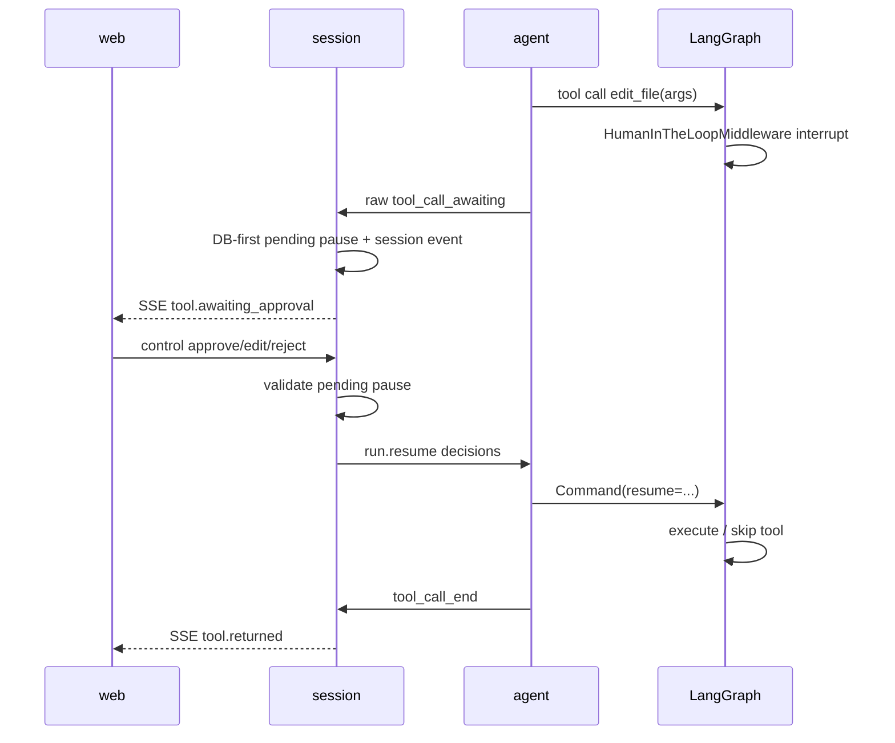

# Agent HIL 与工具拦截标准方案

本文约束 `kokoro-agent`、`kokoro-session`、`kokoro-web` 在 V1 中的
Human-in-the-loop、工具执行前后拦截、`ask_user`、候选结果确认和 Web 暂停点。

三仓总运行时方案见：
[Agent / Session / Web V1 标准运行时方案](11-agent-session-web-v1-runtime.md)。

## 结论

Kokoro 不自造第二套 Agent 暂停系统。

V1 采用 DeepAgents / LangChain / LangGraph 的原生能力：

```text
ToolPolicyMiddleware
  用 AgentMiddleware.awrap_tool_call 做工具执行前后通用拦截。

HumanInTheLoopMiddleware
  用 interrupt_on 暂停工具调用，等待 approve / edit / reject / respond。

LangGraph checkpoint
  保存暂停点和执行状态。

Command(resume=...)
  恢复暂停中的 graph。
```

Kokoro 只补三类跨服务能力：

```text
1. 把权限策略转换为 middleware / interrupt_on。
2. 把暂停点和工具结果投影成 session 可持久化、web 可渲染的事件。
3. 由 session 做 DB-first 持久化、归属校验和 resume control。
```

## 版本基线

当前 `kokoro-agent` 本地依赖版本：

```text
deepagents 0.6.6
langchain  1.3.2
langgraph  1.2.2
```

设计依据：

```text
DeepAgents create_deep_agent(
  middleware=...,
  interrupt_on=...,
  skills=...,
  backend=...,
  checkpointer=...,
  store=...
)

LangChain AgentMiddleware.awrap_tool_call(request, handler)
LangGraph ToolCallRequest.override(...)
LangChain HumanInTheLoopMiddleware(interrupt_on=...)
LangGraph Command(resume=...)
```

官方机制参考：

```text
https://docs.langchain.com/oss/python/langchain/human-in-the-loop
https://docs.langchain.com/oss/python/langchain/middleware
https://docs.langchain.com/oss/python/deepagents/human-in-the-loop
https://docs.langchain.com/oss/python/deepagents/skills
```

## 设计原则

### 1. Agent 负责执行暂停，不负责浏览器状态

Agent checkpoint 是执行恢复真源。它回答：

```text
这个 LangGraph thread 停在哪里？
当前有哪些 interrupted tool calls？
resume 后应该继续执行哪一步？
```

它不回答：

```text
Web 刷新后应该显示什么？
这个暂停点是否已经被浏览器看见？
用户点过什么按钮？
SSE replay 应从哪里开始？
```

后者属于 `kokoro-session` 的 snapshot / session_events / pending pauses。

### 2. Session 负责会话事实，不读 Agent checkpoint

Session 收到 agent raw event 后必须 DB-first：

```text
agent raw event
  -> strict parse
  -> 写 Mongo session_events
  -> 更新 runs/messages/pending_pauses projection
  -> publish Redis live
  -> SSE 给 web
```

Session 不读取 agent checkpoint，不推断 LangGraph 内部状态。

### 3. Web 只渲染暂停点，不决定暂停规则

Web 不直连 agent，不直连 MCP tool，不直接执行 skill。

Web 只做：

```text
展示 tool.awaiting_approval / ask_user。
展示 allowed decisions。
收集用户输入。
POST control 到 session。
等待 session SSE 回放权威结果。
```

Web 不做：

```text
自己判断某工具是否需要暂停。
自己改变 run 终态。
绕过 session 发 Command(resume=...)。
把候选列表选择直接变成工具执行。
```

### 4. 工具前后拦截与 HIL 分层

工具链分两层：

```text
ToolPolicyMiddleware:
  不暂停 graph。
  做确定性策略、参数规范化、审计、结果加工。

HumanInTheLoopMiddleware:
  暂停 graph。
  只处理需要用户参与的工具调用。
```

不要把所有需求塞进 `interrupt_on`。例如：

```text
定时工具参数标准化 -> middleware 前置改参。
工具结果写 artifact -> middleware 后置处理。
危险工具审批 -> interrupt_on。
模型主动问用户 -> ask_user 工具 + interrupt_on。
候选列表让用户选 -> 工具返回候选 + agent 调 ask_user。
```

## Agent 内部设计

### build_agent 装配

`execution/build_agent.py` 是唯一 agent 构建入口。目标形态：

```text
create_deep_agent(
  model=model,
  tools=tools,
  system_prompt=system_prompt,
  middleware=[
    ToolPolicyMiddleware(...),
    ToolAuditMiddleware(...),
  ],
  subagents=subagents,
  skills=skills,
  memory=memory,
  permissions=filesystem_permissions,
  backend=backend,
  interrupt_on=interrupt_on,
  checkpointer=checkpointer,
  store=store,
)
```

DeepAgents 的 middleware 顺序中，用户 middleware 位于 DeepAgents 基础工具栈之后、
HIL 之前。因此 Kokoro 的策略 middleware 可以先规范化/审计工具调用，
再交给 HIL 判断是否暂停。

### ToolPolicyMiddleware

文件归属建议：

```text
kokoro_agent/tools/middleware.py
```

存在理由：

```text
集中处理工具执行前后拦截。
使用 LangChain AgentMiddleware，不自造工具执行协议。
```

禁止：

```text
不写 Web 状态。
不写 session events。
不调用 Redis control。
不自己实现 interrupt/resume。
```

核心行为：

```text
before tool:
  校验工具是否在本次 run capabilities 内。
  根据 context 补全确定性参数。
  对定时、路径、namespace、URL、MCP server/tool 做规范化。
  必要时用 request.override(tool_call=...) 返回新 ToolCallRequest。

execute:
  await handler(request)

after tool:
  记录审计 metadata。
  大结果落 artifact / tool result ref。
  对 Web 只发摘要和 ref。
  保持 ToolMessage 能回到 agent 上下文，让 agent 感知结果。
```

执行前改参示例：

```text
模型生成:
  schedule_task({"time": "明天下午三点", "title": "发周报"})

middleware:
  根据 RuntimeContext.userTimezone 转换为
  {"time": "2026-07-03T15:00:00+08:00", "title": "发周报"}

HIL:
  如 schedule_task 需要审批，则展示规范化后的参数给用户确认。
```

### interrupt_on

`tools/permissions.py` 负责把运行时权限策略转换为 `interrupt_on`。

V1 不再使用粗粒度 `auto/default` 作为长期契约。目标是由 Session 传入已解析
`RuntimeConfig.permissions`，Agent 只消费结果。

决策集合必须按工具类型收紧：

```text
普通危险副作用工具:
  approve
  edit
  reject

ask_user:
  respond

只读但需确认的查询工具:
  approve
  edit
  reject

不可编辑工具:
  approve
  reject
```

禁止：

```text
不要给所有工具默认开放 respond。
不要把 reject 表示成 respond。
不要让 edit 跳过工具 schema 校验。
不要让 sandbox allow 覆盖 tool deny。
```

### approve / edit / reject / respond 语义

```text
approve:
  使用当前 tool args 执行工具。

edit:
  用户修改工具调用，HIL 用 edited_action 重写 tool_call。
  适合改时间、路径、搜索关键词、候选项范围。

reject:
  用户拒绝执行工具。
  对危险工具，这是正确拒绝语义。
  Agent 收到 synthetic ToolMessage，知道工具没有执行。

respond:
  用户代替工具给出结果。
  只允许 ask_user 或明确的人机问答工具。
  不用于危险工具。
```

`respond` 的边界必须严格，因为它会把人工内容作为成功工具结果喂回 agent。
如果普通危险工具也允许 `respond`，系统会分不清：

```text
用户拒绝执行 shell。
用户伪造 shell 的成功输出。
```

这会污染审计和后续推理。

### ask_user 工具

`ask_user` 是 Kokoro 默认工具，名称小写：

```text
ask_user
```

用途：

```text
模型主动向用户索取缺失信息。
让用户从候选列表中选择。
让用户确认非危险但业务上需要确认的选项。
```

`ask_user` 不直接调用 Web。它只触发原生 HIL 暂停：

```text
agent 调 ask_user
  -> HumanInTheLoopMiddleware interrupt
  -> Agent raw event: tool_call_awaiting(kind="ask_user")
  -> Session 持久化 pending pause
  -> Web 展示问题/选项
  -> 用户提交
  -> Session run.resume
  -> Agent Command(resume={"decisions":[{"type":"respond","message":"..."}]})
```

`ask_user` 的 allowed decisions：

```text
respond
```

不展示 approve / edit / reject。

## RawAgentEvent 契约

Agent 给 Session 的 raw event 应表达执行事实，不表达浏览器传输细节。

### tool_call_awaiting

目标 payload：

```text
{
  "segment_id": "...",
  "tool_id": "...",
  "name": "edit_file",
  "args": {...},
  "description": "Tool execution requires approval...",
  "allowed_decisions": ["approve", "edit", "reject"],
  "kind": "tool_approval",
  "risk": {
    "level": "high",
    "source": "filesystem",
    "reason": "writes workspace files"
  },
  "editable": true,
  "input_schema": {...}
}
```

字段说明：

```text
segment_id:
  归属到本次 assistant turn 的活动段。

tool_id:
  LangChain tool_call id。resume control 必须带它。

name:
  工具名。Web 展示和 Session 校验使用，不作为权限真源。

args:
  暂停时的工具参数。edit 基于它修改。

description:
  LangChain HIL ActionRequest.description。

allowed_decisions:
  本工具允许的用户动作。Web 只能展示这里声明的按钮。

kind:
  tool_approval | ask_user。

risk:
  面向 Web 的风险摘要，不是权限判断真源。

editable / input_schema:
  指导 Web 是否展示参数编辑 UI。
```

V1 可先不做复杂 JSON schema 编辑器。`editable=false` 时 Web 只读展示。
只有定时、搜索、路径等明确工具再做定制编辑 UI。

### tool_call_end

目标 payload：

```text
{
  "segment_id": "...",
  "tool_id": "...",
  "name": "search_skill_candidates",
  "result": "找到 5 个候选 skill。",
  "is_error": false,
  "rejected": false,
  "responded": false,
  "artifact_ref": "artifact://...",
  "summary": {...}
}
```

规则：

```text
result:
  给 agent 和简单 Web 展示的短文本。

artifact_ref:
  大结果、候选列表、文件、结构化结果放 Mongo/artifact，不塞进 SSE 大包。

summary:
  小型 JSON 摘要，可给 Web 展示预览。

rejected:
  用户拒绝执行时为 true。

responded:
  人工代答 ask_user 时为 true。
```

工具结果必须回到 agent 上下文。Web 看到的是 Session 归一化后的投影，
不是直接消费 ToolMessage。

## Session 设计

Session 是 Web 暂停点事实源。

### pending pauses

Session 收到 `tool_call_awaiting` 后，应在 Mongo 投影出 pending pause。

建议集合或嵌入模型：

```text
kokoro_session.pending_pauses
  siteId
  sessionId
  runId
  pauseId
  interruptFrameId
  toolId
  segmentId
  toolName
  kind
  args
  description
  allowedDecisions
  risk
  editable
  inputSchema
  status: pending | resolved | cancelled | expired
  decision?
  createdAt
  resolvedAt?
```

也可以先嵌入 `runs.pendingPauses`，但读取和审计会更弱。无论形态如何，
必须满足：

```text
GET /sessions/:sessionId snapshot 能恢复 pending pause。
SSE replay 能重放 awaiting event。
POST control 能校验当前 pause 仍 pending。
terminal commit 能把 pending pause 收口为 cancelled/resolved。
```

### control

Web 只调用 Session：

```text
POST /sessions/:sessionId/runs/:runId/control
```

Session 校验：

```text
site/session/run 归属。
用户能控制该 session。
run 仍 active 或 awaiting。
tool_id 属于当前 pending pause。
decision 在 allowedDecisions 内。
edit 的 edited_action 合法。
respond 只允许 kind=ask_user。
幂等 key 或 decisionId 防双击。
```

校验通过后：

```text
写 pending pause decision。
写 run.resume 到 Redis control/request stream。
由 Agent Command(resume=...) 恢复。
```

Session 不拼 `Command`，不读 checkpoint。

## Web 设计

Web 展示两类暂停点。

### 工具审批 UI

对应 `kind="tool_approval"`。

展示：

```text
工具名。
风险等级和来源。
description。
args 只读摘要。
allowed decisions。
编辑入口（仅 editable=true 且该工具有定制 UI 时出现）。
```

按钮规则：

```text
approve:
  allowed_decisions 包含 approve 时展示。

edit:
  allowed_decisions 包含 edit 且该工具有安全编辑 UI 时展示。

reject:
  allowed_decisions 包含 reject 时展示。

respond:
  不在普通工具审批 UI 展示。
```

不要给所有工具一个通用 JSON textarea。它容易误导用户、破坏 schema，
也会让工具 UI 难维护。V1 只给确定工具做定制编辑器。

### ask_user UI

对应 `kind="ask_user"`。

展示：

```text
问题。
choices。
自由输入框。
确认提交。
取消 run。
```

提交后：

```text
decision.type = "respond"
message = 用户输入或选择结果
```

Web 不把 ask_user 当普通审批按钮组。

## 典型链路

### 1. 危险工具执行前确认



### 2. 执行前自动改参数

```text
模型:
  schedule_task({"time":"明天下午三点"})

ToolPolicyMiddleware:
  解析用户时区和日期。
  request.override(tool_call={... ISO time ...})

HumanInTheLoopMiddleware:
  若该工具需确认，展示改写后的参数。

工具:
  执行规范化参数。
```

### 3. 工具后候选列表确认

GitHub skill 导入不应让 Web 自己根据工具结果暂停。

标准链路：

```text
agent 调 search_skill_candidates。
工具返回候选摘要 + artifact_ref。
ToolPolicyMiddleware 记录 artifact。
agent 看到候选结果后，调用 ask_user:
  "选择要导入的 skill"
  choices=[candidateId...]
Web 展示 ask_user 选择卡片。
用户选择。
Session resume respond。
agent 调 import_skill(candidateId)。
import_skill 是副作用工具，再走 approve/edit/reject。
```

这样 agent 完整感知候选列表和用户选择，Web 只是 UI。

### 4. MCP tool

MCP tool 和内建工具走同一机制：

```text
mcp 工具命名:
  mcp__{server}__{tool}

ToolPolicyMiddleware:
  校验 server/tool 属于本次 run capabilities。
  加 timeout、结果大小、artifact_ref。

interrupt_on:
  高风险 MCP tool 进入审批。
```

Web 不直接调用 MCP tool。

### 5. Subagent

主 agent 调 `task` 或 DeepAgents subagent 时：

```text
主 agent 的 interrupt_on 默认适用于 declarative SubAgent。
子代理可有自己的 interrupt_on。
CompiledSubAgent / remote AsyncSubAgent 的 HIL 由各自 graph 配置。
```

Kokoro 不做 RuntimeSubagentRegistry，不让模型静默创建同权限子代理。

## 错误与幂等

### stale resume

Session 或 Agent 发现以下情况必须拒绝：

```text
run 已 terminal。
run 不存在。
pending pause 不存在。
tool_id 不属于当前 interrupt frame。
decision 数量与 pending tools 不一致。
decision 不在 allowed decisions 内。
respond 用在非 ask_user。
```

### 多工具同帧暂停

LangChain HITL 同一帧可包含多个 action_requests。

Wire control 必须逐工具携带 `tool_id`：

```text
decisions: [
  {"tool_id":"tool-1","type":"approve"},
  {"tool_id":"tool-2","type":"reject","message":"不要执行"}
]
```

Agent 恢复前按 pending 顺序重排 decisions，再交给 LangGraph。

### 重复提交

Web 双击和网络重试不可造成二次 resume：

```text
Session pending pause resolved 后，同 decisionId 返回已有结果。
Agent 侧无 pending interrupt 时丢弃 stale resume。
终态 run 不再接受 resume。
```

## 禁止设计

```text
禁止 Web 直连 agent。
禁止 Web 自己推断暂停规则。
禁止 Session 读取 Agent checkpoint。
禁止 Redis 作为 pending pause 长期事实源。
禁止给所有工具默认开放 respond。
禁止用通用 JSON textarea 覆盖所有 edit 场景。
禁止自造 ToolApprovalStateMachine 替代 LangGraph interrupt。
禁止在 projection 里硬拼工具执行前后策略。
禁止把大候选列表塞进 SSE。
禁止 eventId / SSE id / cursor / seq 参与业务排序。
```

## 实现顺序

### P0

```text
1. Agent build_deep_agent 支持 middleware 参数。
2. 新增 tools/middleware.py，落 ToolPolicyMiddleware。
3. tool_call_awaiting raw event 补 description、allowed_decisions、kind、risk、editable。
4. 收紧 interrupt_on：respond 只给 ask_user。
5. 实现 ask_user 工具，allowed_decisions 只允许 respond。
6. Session pending pause 持久化和 snapshot 输出。
7. Web 分离 tool approval UI 与 ask_user UI。
8. 多工具同帧 resume 保持 tool_id 对齐测试。
```

### P1

```text
1. 定时工具参数规范化和定制 edit UI。
2. 工具结果 artifact_ref / summary。
3. GitHub skill 候选列表 -> ask_user -> import_skill 链路。
4. MCP 高风险工具审批策略。
5. pending pause 审计查询。
```

### P2

```text
1. 子代理专属 interrupt_on 策略 UI。
2. 复杂表单型工具的 schema-driven 定制编辑器。
3. 组织级审批和多人协作审批。
```

## 验收标准

```text
Agent:
  DeepAgents 原生 interrupt/resume 仍是唯一暂停机制。
  middleware 可执行前改参、执行后加工结果。
  respond 不会出现在普通危险工具上。
  ask_user 可暂停并用 respond 恢复。

Session:
  pending pause DB-first 持久化。
  snapshot 可恢复暂停点。
  control 校验归属、状态、allowed decisions。
  不读 agent checkpoint。

Web:
  工具审批和 ask_user 是两个 UI。
  只展示 allowed decisions。
  不直连 agent/MCP/tool。
  刷新后 pending pause 仍可继续处理。
```
