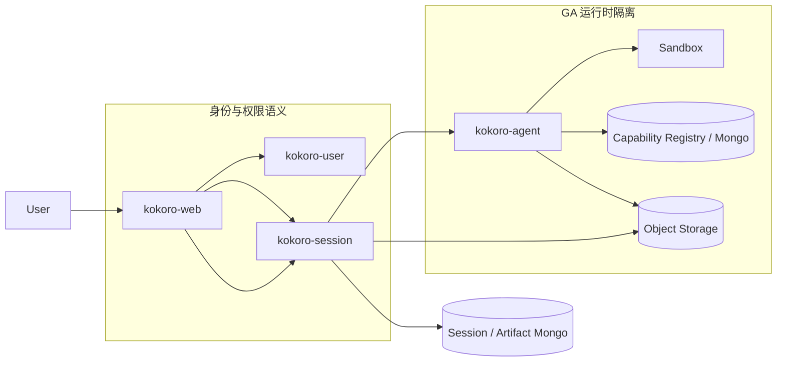
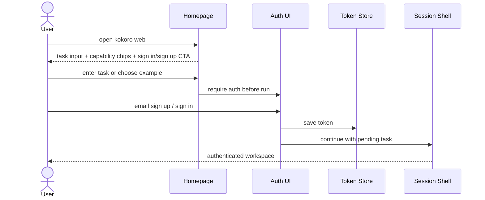
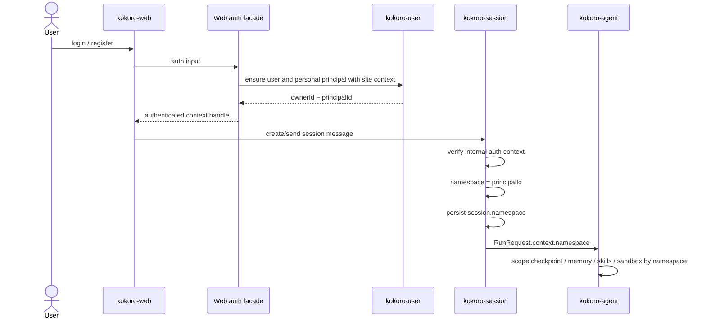
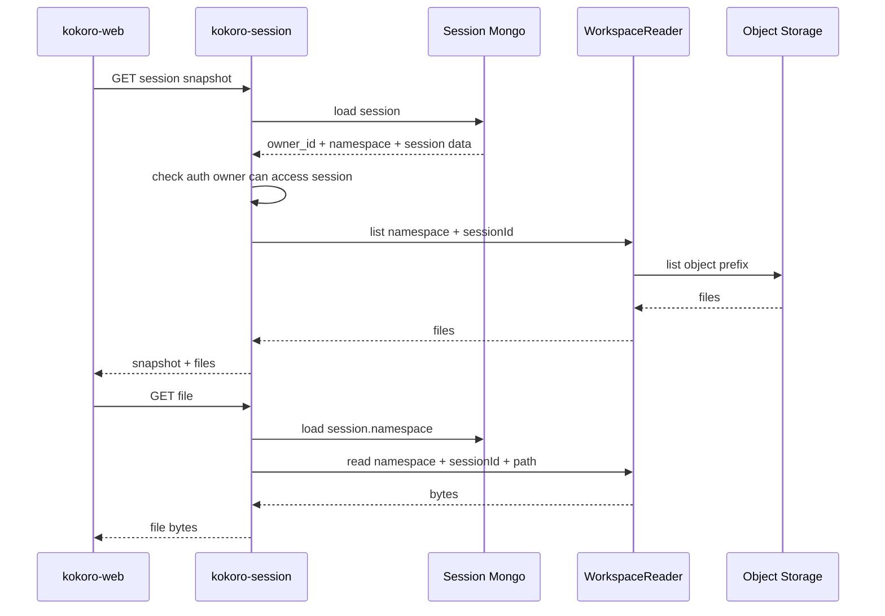
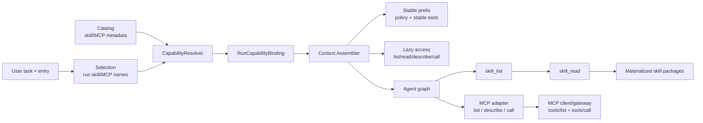
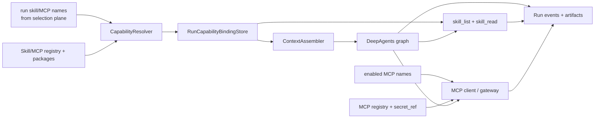
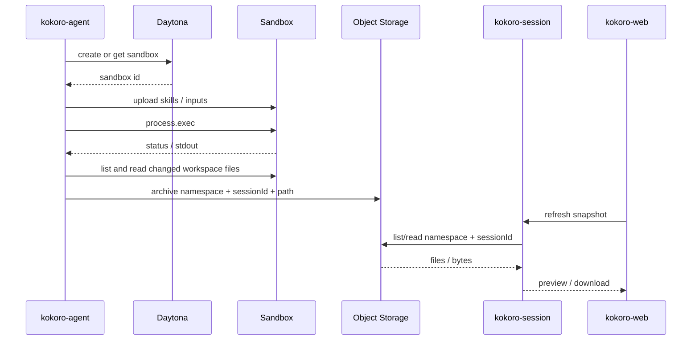
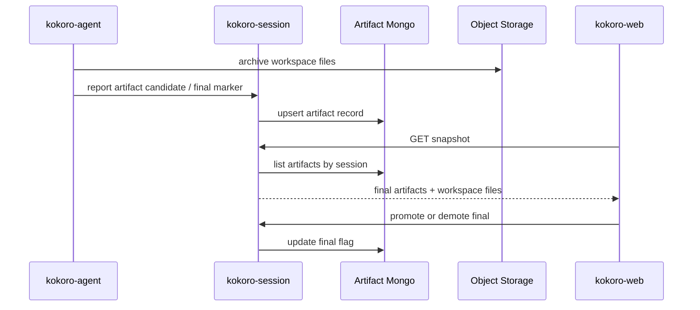
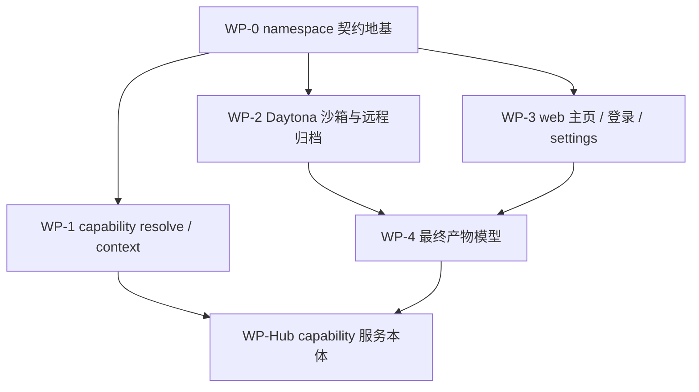

# Kokoro 能力中台、namespace、登录、沙箱与产物技术方案

状态：正式详细附录，当前主线的完整细节版
日期：2026-07-07
范围：kokoro-web / kokoro-session / kokoro-agent；platform 暂不直接改，后续需要时只新增能力子仓库或服务边界。

> 人类评审请先读 `19-current-runtime-capability-review-plan.md`。本文是详细附录，用于查字段、时序、WP 和验收细节，不再作为第一阅读入口。

## 0. 读这份方案先记住三句话

1. platform/user 负责分配全局唯一 `principalId`；人、team、未来 workspace 都是 principal。
2. session 把 `principalId` 冻结为 `session.namespace`；GA / kokoro-agent 只认不透明 `namespace`。
3. skill / mcp 共享一个 capability hub 注册骨架；DeepAgents graph 内部运行节点不是 capability，不做包、不做启用态、不进 registry。

这份方案要闭合的是一条真实产品链路：

```text
用户打开主页
  -> 直接理解 Kokoro 能做什么，并能输入任务或选择能力入口
  -> 登录 / 邮箱注册
  -> web/auth facade 拿到已验证的 ownerId + principalId
  -> session 持久化 namespace = principalId
  -> GA 用 namespace 隔离 checkpoint / memory / skills / sandbox / workspace
  -> 沙箱产物归档
  -> session 记录最终产物
  -> web 分区展示最终产物和普通 workspace 文件
```

第一阶段只做个人 principal。团队空间以后由 platform/user 选择另一个 principalId 并校验 membership；GA 不需要知道 namespace 代表个人还是团队。

### 0.1 本文档位置

本文档是当前能力中台 / namespace / 登录 / 沙箱 / 产物主线的详细附录，位置是：

```text
docs/kokoro-handbook/technical/18-capability-namespace-auth-sandbox-artifacts.md
```

当前人类评审入口是：

```text
docs/kokoro-handbook/technical/19-current-runtime-capability-review-plan.md
```

`docs/superpowers/specs/2026-07-07-capability-namespace-auth-technical-plan.md` 只保留为历史草案入口和跳转指针，避免两份正文漂移。

关系如下：

```text
docs/kokoro-handbook/     正式技术方案、长期规则和稳定结论
docs/superpowers/specs/   打磨期草案、方案对比和历史入口
docs/handoffs/            短期派工，解释这一轮怎么拆 worker
kokoro-*/docs/            子仓自己的实现细节、验收和运行说明
tmp/                      外部参考、截图、探索草稿和一次性中间产物
```

后续若本文方案有正式变更，直接改本文件。原始外部参考、截图、来源名称、路径、分支、类名、逐字文案和资产只允许放 `tmp/` 中间产物；handbook、dated spec 和 handoff 只保留抽象结论。

## 1. 已定决策

### 1.1 namespace 单轴隔离

`namespace` 是 GA 侧唯一隔离键。它的值来自 platform/user 分配的全局唯一 `principalId`。

允许：

```text
namespace = principal.id              # personal principal / team principal / future workspace principal
namespace = local-user                # 本地直通开发
```

禁止：

```text
namespace = user:<ownerId>
namespace = site:<siteId>:user:<userId>
RunRequest.context.userId / ownerId / workspaceId
GA 用 user/team/site 辅助隔离
```

解释清楚一点：platform/user 侧不要把这个值叫 namespace，正式业务概念是 `principalId`。个人、团队、未来 workspace 都是 principal。它进入 session 后持久化为 `session.namespace`，进入 GA 后仍叫 `context.namespace`。GA 不能根据它推断用户、团队、站点或权限。

### 1.1.1 Principal 统一主体模型

Principal 属于 platform/user 边界，不由 kokoro-session 分配。

建议最小表：

```text
Principal
  id        全局唯一主体 id，例如 prn_xxx
  kind      user | team | workspace
  ref_id    user.id / team.id / workspace.id
  site_id   所属 site，用于平台治理和查询，不进入 GA
  status
  created_at
  updated_at
```

V1 暂时没有 team，也照样按主体模型走：

```text
User.personal_principal_id -> Principal.id
VerifiedSessionContext.principalId = User.personal_principal_id
session.namespace = principalId
```

未来 team 接入时：

```text
Team.principal_id -> Principal.id
VerifiedSessionContext.principalId = Team.principal_id
session.namespace = principalId
```

session/GA 不需要知道 principal 的 kind。membership、owner、site、套餐和审计仍在 platform/web/session 上游处理。

### 1.2 hub 结构：一个 capability hub，内部按 skill / mcp 分模块

不拆 `skill-hub` 和 `mcp-hub` 两套服务骨架。

共享骨架：

- namespace 归属
- per-namespace 启用态
- 官方 / 自定义 / 共享 grant
- 版本、审核、配额
- 管理后台 CRUD
- runtime skill/MCP 读模型

按 kind 分交付：

```text
skill     文件包，agent 读对象存储后上传进沙箱
mcp       活连接和授权，agent 运行时建连接，不进沙箱文件面
```

DeepAgents graph 内部运行节点属于 agent runtime topology。它可以由 agent graph config 装配，但不是用户可启用能力，不进入 capability registry，不做 package 分发，也不单独维护 enablement 表。

固定能力产物的落点：

```text
Object Storage / MinIO / S3
  存不可变大对象：skill zip/tar、skill assets、长 README、示例文件。
  对象按 content_hash 版本化，原则上不原地覆盖。

Mongo
  存 registry metadata：name、skill_id、version、content_hash、package_ref、入口文件、文件 manifest、搜索 metadata、状态。
  存 enablement：default enabled names、user selected names、closed names、enabled MCP names、collection refs。

Secret Store
  只存 MCP token/header/key 等 secret；Mongo 和对象存储只保存 secret_ref。

Sandbox
  只存运行时物化缓存：agent 下载对象存储包后上传进去。
  沙箱不是能力包权威来源，残留文件不能绕过 RunCapabilityBinding active index。
```

`package_ref` 建议用内容寻址，避免同一包被每个 namespace 复制：

```text
kind = skill
storage = s3 | minio
bucket
key = capability-packages/skills/<skill_id>/<version>/<content_hash>.zip
content_hash = sha256:...
size_bytes
media_type = application/zip
entrypoint = SKILL.md
files_manifest_ref
```

上传或发布新 skill 时，先把 zip 写入对象存储，再写 Mongo metadata。更新 skill 不覆盖旧对象，而是写一个新 `content_hash` 和新 package_ref。关闭 skill 只改 enablement / active set；对象存储包可以等 GC 后清理。

Skill 包生命周期按五步走，避免“上传、启用、运行、下载”混在一个模块里：

```text
Preview
  解析上传 zip / 单个 SKILL.md / 仓库 archive / 官方目录。
  只做候选识别、结构校验、大小统计、同名提示和额度提示，不写正式 registry。

Publish
  校验通过后把不可变包写入对象存储，生成 package_ref、content_hash、files_manifest_ref。
  写入或更新 skill_registry；用户自定义 skill 只写 registry，不直接代表本轮可用。

Enablement
  web/session/hub 根据安装、启用偏好、collection、默认策略和关闭动作写 principal_skill_state。
  这里表示“这个主体可用/不可用”，不是“每次 run 都自动给 agent”。
  disabled 记录用于覆盖 default available；soft-deleted state 不参与可用池。

Resolve
  每次新 run 只接收上游传来的 run skill names / closed names。
  runtime 先按 principal_skill_state 校验这些 names 是否可用，再按 name 读取 registry，得到轻量执行快照；找不到、已禁用、软删除、包缺失则 blocked/skip。

Materialize
  CapabilityResolver 按 skill_id + content_hash 复用或失效包缓存；关闭 skill 不在主路径删除沙箱文件，只撤销 active index。
  skill_read 只按 RunCapabilityBinding active index 读取，不信任沙箱残留文件。
```

包校验的底线：

- 根级必须存在 `SKILL.md`。
- `SKILL.md` 必须是 UTF-8 文本，frontmatter 至少包含稳定 machine name 和 description。
- 包内路径必须是安全相对路径，禁止绝对路径、`..`、空段和路径穿越。
- content hash 覆盖相对路径和文件字节，任一文件变化都产生新 hash。
- 用户上传包有大小、文件数、命名和文案策略限制；官方包可放宽内容策略，但不能放宽结构安全。
- 二进制资源允许进入包，但默认不进入 prompt；只有 `skill_read` 或沙箱执行需要时才读取。
- 上传、导入、官方同步、后台发布和 runtime resolve 共用同一个 validator / parser；不要在 BFF、管理后台、agent worker 各写一套 SKILL.md 规则。

并发与补偿：

- 同一个 principal 新增/替换 skill 要有唯一索引和写锁，防止并发突破配额。
- “对象已写、metadata 写失败”允许出现短期孤儿对象，但必须有 package_ref 未引用 GC 和发布重试机制。
- registry 更新不覆盖运营态；下架、禁用、required、可见性这类状态由 state/运营字段控制。

Subagent V1 不做包分发。它只是 agent graph 的定义/配置，由代码或 Mongo metadata 提供，ContextAssembler 编译 graph 时装配；不进对象存储，不走 `package_ref`，不参与 CapabilityResolver。

#### Registry / state 表模型

这里统一按 Mongo collection 理解，文档里称“表”只是为了表达数据边界。所有 registry/state 表都只软删除，不做物理删除：

```text
deleted_at
deleted_by
delete_reason
created_at
updated_at
```

所有线上查询默认附带 `deleted_at = null`。恢复、审计、GC 可以查已删除记录，但 runtime 读模型、ContextAssembler、CapabilityResolver 和 MCP client 不读取软删除记录。

Skill 拆两张主表：

```text
skill_registry
  skill_id
  name
  version
  display_name
  description
  source_type = official | user | team | site
  read_only
  required
  visible
  package_ref
  content_hash
  entrypoint = SKILL.md
  file_count
  package_size
  files_manifest_ref
  search_metadata
  publisher
  status = draft | published | deprecated
  deleted_at / deleted_by / delete_reason

principal_skill_state
  principal_id
  skill_name
  skill_id
  version_pin
  source = default | selected | collection | runtime
  state = enabled | disabled
  collection_ref
  enabled_at
  disabled_at
  settings
  deleted_at / deleted_by / delete_reason
```

`name` 是 public stable key，web、session 和 runtime 都用它引用 skill；`skill_id`、`package_ref`、`content_hash`、存储路径和 hash 不暴露给前端交互。`skill_registry` 是 skill 信息表，只描述“这个 skill 是什么、包在哪里、内容 hash 是什么”。`principal_skill_state` 是用户/主体 skill state 表，只描述“这个 principal 是否可用这个 skill、是否被用户关闭、属于哪个 collection”。`RunCapabilityBinding` 记录本次 run 实际可列出/可读取的 skills 和可调用的 MCP server refs，是 run ledger，不是第三套启用态。

建议索引：

```text
skill_registry:
  unique active index: name + version where deleted_at = null
  index: skill_id
  index: status + deleted_at
  index: content_hash

principal_skill_state:
  unique active index: principal_id + skill_name + source + collection_ref where deleted_at = null
  index: principal_id + state + deleted_at
```

状态语义：

- `enabled` / collection / default 表示可用池，不表示每次 run 都自动进入 agent。
- `disabled` 表示用户/上游关闭；保留记录是为了覆盖 default available 或 collection available。
- `required` 表示入口或产品策略要求的 skill，普通用户关闭不能覆盖；只能由上游策略或管理员变更。
- `read_only` 表示官方/共享 skill 不能由当前 principal 替换、编辑或删除。
- `deleted_at` 有值表示这条 state 记录本身被移除，不再参与可用池计算。
- active set 计算时只处理本次 run 的结构化 names：entry required、产品默认、用户本轮 selected、runtime 显式 names；再用 `principal_skill_state` 做可用性校验和 disabled 覆盖。

MCP 也拆成 registry/state/cache 三层，但不做包：

```text
mcp_server_registry
  server_id
  name
  display_name
  description
  protocol_version
  transport = stdio | streamable_http
  command_ref / endpoint_ref
  config_schema
  declared_capabilities = tools | resources | prompts | logging | completion
  auth_type = none | env | oauth | api_key | custom
  secret_schema_ref
  status = draft | published | deprecated
  deleted_at / deleted_by / delete_reason

principal_mcp_server_state
  principal_id
  server_name
  server_id
  state = enabled | disabled
  server_config_ref
  secret_ref
  tool_allow_mode = all | allowlist | denylist
  enabled_tool_names
  disabled_tool_names
  resource_policy_ref
  prompt_policy_ref
  roots_policy_ref
  sampling_policy = deny | ask | allow
  elicitation_policy = ask | deny
  enabled_at
  disabled_at
  deleted_at / deleted_by / delete_reason

mcp_capability_cache
  namespace
  server_id
  kind = tool | resource | prompt
  name_or_uri
  title
  description
  schema_hash
  input_schema
  output_schema
  annotations
  last_seen_at
  deleted_at / deleted_by / delete_reason
```

`mcp_capability_cache` 只是发现缓存，不是权限源。MCP server 是否可用看 `principal_mcp_server_state`；某个 tool/resource/prompt 是否可展示或调用，由 MCP client/gateway 按 state、server 运行时返回、allow/deny 列表和 secret_ref 共同决定。`notifications/tools/list_changed`、`resources/list_changed`、`prompts/list_changed` 这类变更只刷新 cache，不改变 DeepAgents 工具 schema。

建议索引：

```text
mcp_server_registry:
  unique active index: name where deleted_at = null
  index: server_id
  index: transport + status + deleted_at

principal_mcp_server_state:
  unique active index: principal_id + server_name where deleted_at = null
  index: principal_id + state + deleted_at
  index: server_id + state + deleted_at

mcp_capability_cache:
  unique active index: namespace + server_id + kind + name_or_uri where deleted_at = null
  index: namespace + server_id + kind + last_seen_at
  index: schema_hash
```

按 MCP 标准映射：

- server 侧 primitive：`tools`、`resources`、`prompts`。
- client 侧 primitive：`roots`、`sampling`、`elicitation`。
- transport：优先支持 `stdio` 和 `streamable_http`；HTTP 场景走协议版本 header、session id、可选 authorization。
- trust boundary：host/client 控制用户同意、roots、sampling、elicitation 和 tool invocation；MCP server 不能看到完整会话，也不能跨 server 读取上下文。

Kokoro V1 的 MCP 执行策略：

```text
mcp_list_tools()                       # Kokoro adapter, not an MCP protocol method
  -> 读取 principal_mcp_server_state 中 enabled servers
  -> 对每个 server 通过 MCP client 做 tools/list 或读 cache
  -> 应用 enabled_tool_names / disabled_tool_names
  -> 返回短卡片，不返回完整 schema

mcp_describe_tool(server_id, tool)      # Kokoro adapter, maps to cached tools/list schema
  -> 按需调用 tools/list 或读取 cache 中 schema
  -> 返回 input_schema / output_schema / annotations

mcp_call(server_id, tool, args)         # Kokoro adapter, maps to MCP tools/call
  -> gateway 按 state + allow/deny + secret_ref 检查
  -> 连接 stdio 或 streamable_http server
  -> 执行 tools/call
  -> 记录 mcp.call event
```

这些 `mcp_*` 名称不是 MCP 标准方法名。MCP 标准侧是 server 暴露 `tools/list`、`tools/call` 以及 resources/prompts 等 primitive；Kokoro 的 `mcp_*` 是 agent-facing gateway 工具，用来保持 DeepAgents 工具面稳定。

MCP client/gateway 的责任：

- 根据 `namespace + enabled MCP names` 读取 active server state；soft-deleted 或 disabled server 不可见。
- 为每个 server 建立 transport/session，支持 `stdio` 和 `streamable_http`，并显式处理 timeout。
- `tools/list` 结果必须做 JSON Schema 校验、命名冲突过滤、allow/deny 过滤和 schema hash 记录。
- tool 的读写属性优先取 MCP annotations 或 server policy；写操作默认需要 HITL/approval。
- 所有 secret 只以 `secret_ref` 进入 registry/state，由 gateway 服务端解析成 header/env/token。
- 远端错误统一映射成可展示 tool error，并记录 `mcp.failure` 或 `mcp.call` 失败事件。
- cache 只是性能优化；调用前仍要校验 server state、tool allowlist、secret_ref 和当前运行策略。

明确不做：

- 不把每个 MCP tool 动态展开成 DeepAgents tool schema。
- 不让 MCP server 静默追加 prompt、读完整对话或跨 server 访问上下文。
- 不把 `tools/list` 返回值直接当成可信 UI/agent 指令。
- 不把 MCP package 化；MCP 是运行时连接和授权，不进入沙箱文件面。

resources/prompts V1 先不变成 DeepAgents 工具面。需要时通过 MCP client 的资源/提示发现能力返回引用或短摘要；长内容仍按需读取，不进入稳定 prompt。sampling 和 elicitation 默认 `ask/deny`，必须经过 Kokoro host 策略，不允许 MCP server 静默向模型追加上下文或向用户发问。

后端服务本体暂不动 platform 主树。需要正式管理 API 时，在 platform 侧新增一个 capability 子仓库/服务边界即可。

### 1.3 最终产物模型默认落法

为了让 WP-4 不继续卡住，本方案采用：

```text
agent 显式标记为主，web 用户覆盖为辅，目录约定只做启发式。
```

原因：

- 只靠目录约定，模型容易写错位置。
- 只靠用户勾选，自动化闭环不完整。
- agent 标记 + 用户 promote/demote 能兼顾自动归档和人工修正。

最终产物记录入 Mongo；文件本体仍在对象存储。web 展示时分成 Final artifacts 和 Workspace files 两区。

### 1.4 Web 产品入口层：先做可换皮 frontend shell

主页、登录、邮箱注册、settings 不是零散页面，它们是同一个 Web 产品入口层。这里先定前端结构：

```text
Homepage
  -> task input / capability chips / product proof
  -> sign in / email sign up
  -> authenticated session shell
  -> settings / capability hub / artifacts
```

当前 kokoro-web 的 `/` 直接渲染 `SessionShell`。下一步要把它拆成：

```text
/             public homepage, task-first product entry
/login        sign in
/signup       email registration
/app          authenticated session shell
/settings     authenticated user settings
```

如果实现时暂时不新增所有路由，也要保持同样的组件边界：public home、auth surface、app shell、settings 不能揉成一个大页面。

设计原则：

- 首页第一屏要直接表达“让 agent 干活”，不是传统介绍型 landing page。
- 首页可以有任务输入框、任务范例 chips、能力入口、工作流预览和明确登录/邮箱注册 CTA。
- 登录和邮箱注册走同一套 auth surface，表单状态、错误、loading、退出、token 存取集中管理。
- 后续会频繁换皮，所以视觉 token、文案、版式配置和功能接线必须分离。
- 先只动 kokoro-web 前端：把页面壳、组件边界、token、auth client adapter、路由状态整理好；真正消费者 auth 签发可以后接。

首页信息架构建议：

```text
HeroTaskEntry
  用户任务输入框
  任务范例 chips
  sign in / email sign up / continue CTA

CapabilityStrip
  Research / Slides / Code / Design / Data / Automation 等能力入口

WorkflowPreview
  展示从 prompt -> agent steps -> files/artifacts 的链路

ArtifactProof
  展示 Kokoro 不是只聊天，而是会产出文件、预览、下载、最终产物

TrustAndControl
  展示 HITL、可审阅、可取消、可恢复、文件归属
```

首屏合格线：

- 首屏中心是 task composer，不是纯品牌标语。
- 页面上方只保留必要导航：品牌、能力/资源入口、登录、注册或进入应用。
- H1 服务于任务入口，不能大到挤压 composer；桌面端第一屏必须能看到 composer 和一部分能力入口。
- composer 宽度、圆角、阴影、按钮、chips 和动效用 token 控制；不要在页面里写死。
- 未登录用户输入任务后，pending task 要进入 auth flow，注册/登录完成后继续。
- 视觉上走安静、精致、可长期工作的 AI workspace；避免堆卡片、重渐变、装饰网格和难读的大字。

Task composer 是一个独立系统，不是 textarea：

```text
TaskComposer
  editor
  attachment tray
  capability chips / mode selector
  model or execution mode slot
  submit / stop / retry lifecycle
  auth-required handoff
  pending task persistence
  quota / policy hint slot
```

第一阶段可以先只做文本输入、附件占位、能力 chips 和 submit lifecycle，但组件边界要按完整 composer 设计。后续接 skills、MCP、文件上传、停止运行、HITL，不应该重写首页。

可换皮契约：

- theme tokens 管颜色、字体、半径、阴影、密度、动效。
- homepage content config 管 headline、任务范例、能力 chips、workflow cards。
- visual components 只吃 props，不直接调用 session client。
- auth/session/canvas adapter 放在功能层，换皮不动它。
- CSS Modules 或现有样式组织继续随组件走，不新增重型 UI 框架。

### 1.5 Site 驱动的前端底座：一个 site 一个皮

Kokoro Web 的底座要先支持多站点产品化：

```text
site -> skin -> product surface -> capability visibility -> auth entry -> app shell
```

`site` 是前端产品面和平台业务面的组织轴，不是 GA 运行时隔离轴。一个 site 可以长成一个独立 AI 产品站：

- 独立域名、SEO、品牌、首页文案、导航、价格入口。
- 独立 theme tokens、layout preset、首页 content config。
- 独立 capability visibility：哪些能力入口露出、哪些默认启用、哪些只做 waitlist。
- 独立 auth entry：登录、邮箱注册、邀请、白标入口。
- 独立 analytics/growth 归因。

但底层 runtime 不随皮肤变化：

```text
siteId / SiteContext
  -> web 选择 skin、copy、layout、feature gates
  -> auth/session 仍签发和携带 token
  -> session 解析 namespace
  -> GA 只消费 namespace
```

也就是说：

- `siteId` 决定“这个站怎么展示、开放哪些入口、怎么增长归因”。
- `namespace` 决定“这个用户/空间的 runtime 数据怎么隔离”。
- GA 不读 site skin，不根据 site 改 checkpoint/memory/skills/sandbox 的身份模型。

前端底座建议分成四层：

```text
SiteContext adapter
  host/app/surface -> siteKey/siteId/locale/feature flags

Skin registry
  theme tokens / brand assets / layout preset / navigation

Content registry
  homepage copy / task examples / capability chips / workflow cards

Feature adapters
  auth token / session client / canvas file fetch / pending task
```

后续换皮只允许替换 skin registry 和 content registry；不能改 session client、contract schema、namespace 规则或 GA 接口。

前端不能做的事：

- 不把具体外部参考站的路径、文案、类名、组件结构写进正式代码或正式文档。
- 不把认证业务散落到每个页面。
- 不让换皮修改 session/auth/canvas 的业务调用。
- 不为了首页换皮去改 session/agent/platform。
- 不把 public homepage 写成只能展示不能进入任务的纯营销页。

Auth surface 统一结构：

```text
AuthLayout
  centered form surface
  brand / site skin
  redirect and pending task reader
  error / loading / success shell

LoginForm
  email-first
  password or code placeholder
  social provider slot
  forgot / resend / switch to signup

SignupForm
  email-first
  code or link verification placeholder
  accept terms
  switch to login
  continue pending task
```

settings 统一结构：

```text
SettingsShell
  sticky title + account action area
  optional tab bar
  content max width around 1080px
  responsive single column on mobile

SettingsCard
  title
  short form
  save state
  inline validation
  success/error feedback

DangerAction
  separate section
  modal confirmation
  audit event
```

第一阶段 settings 至少覆盖：Profile、Workspace、Preferences、Security、Data。后续再补 Billing、Integrations、Developer/API、MCP secrets、Capability defaults。所有设置页从 AccountContext / AuthAdapter / SettingsAdapter 取数据，不直接散落 API 调用。

## 2. 系统边界



边界原则：

- kokoro-user 是用户、团队、Principal 和成员关系的权威。第一阶段可以只消费既有 user；正式 Principal 表后续由 platform/user 落。
- kokoro-web 负责产品主页、登录/邮箱注册 UI、auth client adapter、settings、canvas 和产物展示；auth facade 只输出已验证的 `{ ownerId, principalId }`，传输格式可替换，不进入 GA 边界。
- kokoro-site / SiteContext 负责前端 skin、copy、layout、SEO 和 capability visibility 的上游配置；web 消费它构建站点面，不把 siteId 传成 GA 隔离轴。
- kokoro-session 是 namespace 进入 GA 的唯一闸门，负责接收已验证主体上下文、裁权、session.namespace 持久化。
- kokoro-agent 只消费 namespace，不查询用户主数据，不判断 owner/team/site，不扣积分。
- 对象存储承载 workspace 文件、不可变 skill 包字节、artifact 大文件。
- Mongo 承载 session history、capability metadata、enablement、artifact record。

## 3. 关键时序

### 3.0 首页、登录与邮箱注册入口



读法：

- 首页不是纯营销页，第一屏应当是产品入口：让用户马上知道可以交给 Kokoro 一个任务。
- 未登录用户输入的任务要能暂存，登录/注册完成后继续进入会话。
- 登录、邮箱注册、退出、token 读取、错误状态由统一 auth client adapter 管，不散在页面里。
- 首页换皮只能影响 presentation，不应该影响 token 管道、session client 和 canvas。

### 3.1 登录到 GA run



读法：

- `principalId` 在个人空间第一阶段来自 personal principal；V1 可由 user 初始化，但正式契约不要叫 user namespace。
- session 保留 `ownerId` 做 HTTP 裁权和审计，但 ownerId 不传给 GA。
- 本地直通模式可以让 HTTP owner fixture 和 namespace fixture 都取 `local-user`，但 GA 仍只接收 namespace。
- JWT/JWS/HMAC/internal header 都只是传输载体；正式业务契约是已验证的 `{ ownerId, principalId }`。

### 3.2 会话刷新与 workspace 文件读取



必须改变的点：

- 不能再用部署实例的 `KOKORO_NAMESPACE` 读多用户 workspace。
- session 创建时必须写 `session.namespace`。
- relay recover / 页面刷新 / 文件读取都通过 session_id 回到 session.namespace。
- snapshot 可以不向 web 暴露 namespace；web 只拿鉴权后的文件投影。
- WP-0 是 WP-1 的硬前置。只要 session/file/snapshot/recover 还可能从实例级 namespace 取值，就不能开始 capability resolve / MCP client；否则 skill、MCP、workspace 都会按错隔离轴入账。
- 旧 session 处理必须明确：
  - 多用户模式下，缺少 `session.namespace` 的 session 不允许继续 run / file / recover。
  - 本地开发模式可以用显式 fixture 回填，但回填动作要写入 session 文档并留下 migration marker。
  - 不能在请求过程中临时用 ownerId、userId 或 env namespace 代替。

### 3.3 capability resolve 与 skill 进沙箱

```mermaid
sequenceDiagram
  participant S as kokoro-session
  participant GA as kokoro-agent
  participant R as Capability Registry
  participant O as Object Storage
  participant SB as Sandbox

  S->>GA: RunRequest with namespace + skill names + closed names
  GA->>R: read skill metadata by names
  R-->>GA: skill_id + version + package_ref + content_hash
  GA->>GA: build RunCapabilityBinding active index
  loop new or changed skill
    GA->>O: read package_ref by content_hash
    O-->>GA: immutable zip/package bytes
  GA->>GA: cache or materialize package behind skill_read
  end
  loop closed skill
    GA->>GA: remove from active index
    GA->>GA: keep cached files; async GC later
  end
  GA->>SB: execute
```

运行原则：

- 沙箱不拿 Mongo/S3 凭据。
- agent 是解析器和受控读取器：它读 registry/object storage，生成 active index，并在 `skill_read` 需要时读取或物化包内容。
- 对象存储包是固定产物，按 `content_hash` 不可变；本地/沙箱 materialized path 只是运行时缓存。
- 单个 skill metadata/package 读取失败时记录 warning 并跳过，不中断整个 run。
- 现有 `skills/package.py` 的 SKILL.md 解析和 frontmatter 校验可以复用；`skills/provision.py` / `skills/supply.py` 这条“预先把包上传到 `/.skills` 并交给 DeepAgents SkillsMiddleware”的链路需要迁移为 `SkillPackageReader + skill_read`，不能继续作为正式能力边界。

### 3.3.1 Dynamic capability 与 context assembly

这里要避免一个常见错误：把所有已启用 skill、MCP 文档和 graph prompt 都直接追加进主 prompt。
这样表面上“能力全开”，实际会造成三类问题：

- 每轮 prompt 前缀变化，模型 context cache 命中率下降，成本上升。
- 每个运行节点自己拼 context，能力边界不可审计。
- MCP tool schema 和 skill 长文档一起膨胀，主 agent 还没开始做事就消耗大量窗口。

正式设计采用四层，把“定义、选择、绑定、使用”分开。agent runtime 不替用户决定开哪些能力，只消费已经传入的本 run names，解析成不可变 `RunCapabilityBinding`，再通过稳定工具使用 binding 中的能力。

```text
Catalog
  存 skill package metadata、MCP server definition、版本、软删除、package_ref、secret_ref

Selection
  web/session/capability 根据 principal、entry、默认项、用户选择、关闭项和配额，
  产出本次 run 的 skill_names 与 mcp_server_names

Binding
  agent runtime 把本次 run names 解析为不可变 RunCapabilityBinding：
  skill package refs + MCP server refs + policy refs + resolver warnings

Use
  agent 通过 skill_list / skill_read / mcp_list_tools / mcp_describe_tool / mcp_call
  读取或调用 binding 中的能力
```



关键规则：

1. **启用态来自用户侧/产品侧，不来自 agent 自己判断。**
   `RunRequest.runtime.skills`、session/profile 默认项、web 输入框动态选中的 skill names 是输入事实；关闭的 skill names 从 active set 中移除。agent runtime 的工作是按这些 names 查 registry 元数据、拿到 package_ref/content_hash、维护包缓存和 active index。它不做“这个用户是否应该有权限”的业务判断，也不能因为“觉得可能有用”就自行启用新 skill。

2. **RunCapabilityBinding 是 run 内不可变的能力引用账本，不是 prompt 清单。**
   它冻结的是本 run 可读取的 skills 和可调用的 MCP servers/tools 入口。业务引用直接用 `run_id`，不再引入额外 epoch、plan 或 snapshot 概念做主键。每个 skill 记录自己的 `content_hash`，用于判断包缓存是复用还是失效。

3. **skills 默认不进模型上下文，靠 `skill_list` 按需查看。**
   `RunCapabilityBinding` 是 run-local binding，不是 prompt 内容。模型不需要知道本 run 的 skill 配额，也不需要看到完整 enabled list。只有用户本轮显式点选了某个 skill、入口强绑定某个工作流，或上一轮刚关闭/替换了模型可能继续引用的 skill，ContextAssembler 才生成极少量模型可见提示。其余 active skills 只能通过 `skill_list()` 查看，再用 `skill_read(name_or_ref, file)` 读取正文。

4. **运行中可以动态发现能力，但不能动态改 prompt 或 tool schema。**
   `skill_list`、`skill_read` 和 MCP gateway adapter tools 都是 Kokoro 稳定工具。运行中发现新 skill/MCP 只是工具调用和事件，不修改 `system_prompt`、DeepAgents tool schema 或 checkpoint 私有字段。首次读取 skill 或调用 MCP 时记录 `skill.read` / `mcp.call`。

5. **ContextAssembler 是唯一编译运行输入的地方，但不是把内部事实都给模型看。**
   它负责稳定顺序、预算、去重、裁剪、ledger manifest、tool refs 和可选模型可见 note。各运行节点只能消费 assembler 的结果，不能自己把 registry 文档、SKILL.md、MCP 描述、文件索引或运行限制塞进 prompt。

6. **skill 信息默认只在工具层可发现。**
   `skill_list` 返回 compact cards；模型可见 runtime note 默认不列 skill。完整 `SKILL.md`、辅助文件和长示例不进 prompt，由 `skill_read` 按需读取。

7. **MCP server names 进入 binding，但 MCP tool schema 不进 prompt。**
   MCP 启用态同样来自用户侧/产品侧的 mcp names 或 server refs。Binding 只记录 server/config/policy/cache 引用，不提前展开全部 tool schema。MCP client/gateway 按 namespace、enabled mcp names、server_config_ref、secret_ref 和 policy 动态查询。模型侧只看到稳定的 Kokoro adapter schema：`mcp_list_tools` / `mcp_describe_tool` / `mcp_call`。MCP 配置变化不改变 DeepAgents prompt 或 tool schema。

8. **稳定系统提示、运行账本、工具结果和可选 runtime note 分离。**
   `static_system_prompt`、权限政策、工具规则按稳定排序渲染，尽量保持可缓存；用户原始 task 保持在持久 `HumanMessage`。`RunCapabilityBinding`、selection policy、sandbox manifest、workspace file index、cache key 和 token 预算默认只在 runtime ledger / audit bundle / tool result 中存在，不进入模型上下文。模型可见 `model_visible_runtime_note` 只放本次调用必须立即知道的少量事实，由 Kokoro middleware 请求级临时注入，不落 checkpoint。

9. **关闭 skill 只撤销 active index，不在主路径删除沙箱文件。**
   关闭不是“提示模型以后别用”，而是下一次 binding 不再包含它。同步顺序是：先更新 `RunCapabilityBinding` / active index，让 `skill_list` 和 `skill_read` 立即看不到它；沙箱或 cache 中残留的文件可以保留，后续用 TTL、LRU 或后台 GC 清理。即使物理文件仍在，也不能让旧 skill 被列出或读取。提示词只在模型上一轮见过或用户显式点选过该 skill 时做纠偏，不作为权限边界。

这里的“每次 run 重新装配”不是把旧上下文全文重建后再塞回 prompt。正确理解是：

- **状态连续**：历史对话、运行状态和长期记忆依赖 LangGraph checkpointer、store、workspace 和 session summary 承接，不靠 agent 自己把旧消息和旧 skill 文档反复追加。
- **调用装配**：每次 run 只重新生成一个薄的 invocation envelope，包括 stable system、稳定工具面、当前用户消息，以及按白名单生成的极少量模型可见提示。运行限制、文件索引、cache key、skill manifest 进账本和工具层，不默认给模型看。
- **能力变化**：skill set 不变时，`static_system_prompt` 和 tool surface 应保持一致；skill 启用态变化在下一次 run 生成新的 RunCapabilityBinding；MCP 配置变化由 MCP client/gateway 动态读取，不改变 agent graph。模型只在必要时看到“某个之前可见/被用户点选的能力现在不可用或已替换”这类短提示。

DeepAgents 是 Kokoro agent runtime 的固定底座，不作为可替换项讨论。`ContextAssembler` 的目标不是绕开 DeepAgents，而是把 Kokoro 的能力、上下文和缓存规则编译成 DeepAgents 能稳定消费的入参。

DeepAgents 支持这个模型，但边界要写死：

- `create_deep_agent` 可以按 run 传入 `system_prompt`、`tools`、agent graph config、`backend`、`checkpointer`、`store`，所以它适合“run 前装配稳定图”。
- dynamic skill 不交给 DeepAgents 原生 SkillsMiddleware 注入 prompt。Kokoro 自己把已授权 skill 包物化到 backend/sandbox，并通过 `skill_read` 暴露受控 lazy read。DeepAgents 仍提供 graph、checkpoint、backend 文件面和 tool call 执行。
- checkpointer/store 负责连续性，workspace/backend 负责文件连续性，因此旧上下文不需要由每个 agent 手工追加。
- 不把“运行中随便热插 prompt/tool schema”作为 V1 能力。模型调用过程中临时改变 system prompt 或 tool schema 会破坏可审计性、缓存稳定性和 graph 假设。agent 发现缺 skill 时，先用 `skill_list()` 查看本 run binding；仍找不到时发 `capability.request`，由下一轮 run 的 selection 处理。MCP 缺工具时交给 MCP client/gateway 返回不可用原因。
- DeepAgents 的 prompt 顺序是 caller `system_prompt` 在前，DeepAgents BASE prompt 在后。因此 **动态 context 不能放进 `system_prompt`**。否则用户消息、run_id、检索片段变化会出现在 DeepAgents BASE 之前，反而破坏底座 prompt 的 prefix cache。
- 可选 runtime note 也不应长期写入持久 `messages`。否则多轮后旧 note、检索候选和文件索引会随 checkpoint 历史 replay，重新制造 context 膨胀。

### 3.3.2 Skill 选择、发现与 context cache 契约

这里最重要的是把一句话讲清楚：**agent 不决定 skill 配额。** 外部 web/session/capability selection 层决定本次 run 传入哪些 skill names；agent runtime 只把这些 names 解析成可列出、可读取的 active index。

启用链路按下面理解：

```text
Skill Catalog
  系统、官方、用户导入、团队导入的全部候选 skills。可以很多，不直接进 run。

Available Skill Names
  用户侧、团队侧、site 默认策略、collection 和 settings 投影出的可用池。
  可用不等于本 run active；它只是校验本次 run skill names 的边界。

Run Skill Names
  本次请求结构化传入的 names：entry required、产品默认、用户本轮 selected、runtime 显式 names。
  这才是 RunCapabilityBinding 的候选输入，不由 agent 自己拍脑袋决定，也不自动等于所有 available skills。

RunCapabilityBinding
  agent runtime 在 run 前把 names 解析为 skill package refs 和 MCP server refs。
  这里是可使用的能力引用账本，不是 prompt 内容。

Startup Skill Cards
  ContextAssembler 可为 UI、日志或显式入口生成的短卡片。
  默认不注入模型上下文；只有用户显式点选、入口强绑定或恢复旧上下文时才允许进入 optional note。

Activated Skills
  本 run 实际通过 skill_list 查看、通过 skill_read 读取过的 skills。
  受 token、工具调用次数和 lazy read budget 控制。
```

选择层契约：

```text
run_skill_names_source = entry + product default + user selected + runtime explicit - closed
selection_limits = enforced upstream by web/session/capability layer
```

如果用户安装或导入了很多 skill，web/session 应让用户选择 collection、入口或本轮 selected names，并在 capability selection 层处理默认上限、套餐配额和错误提示。agent runtime 收到的是已经由上游裁好的 run skill names；它不做业务授权，也不定义产品配额，只做运行时解析、缓存和读取：找不到 registry 记录就记录 warning 并跳过；package_ref 下载失败就跳过。这样不会让 LLM 因为任务意图不同每次随机改启用态，也不会把用户所有 settings enabled skills 静默塞进 run。

active set 的计算规则：

```text
desired_skill_names =
  entry_required_skill_names
  + product_default_skill_names
  + user_selected_skill_names
  + runtime_skill_names
  - user_closed_skill_names

RunCapabilityBinding =
  accept names already selected by web/session/capability layer
  resolve skill_names to package refs
  resolve mcp_server_names to config/policy/cache refs
  keep deterministic order
```

包读取和可选物化按 content hash 增量处理：

```text
for each desired skill:
  if package cache has same skill_id + content_hash:
    reuse cached package when skill_read needs it
  if skill is new:
    keep lightweight package_ref in RunCapabilityBinding
  if content_hash changed:
    invalidate old cache entry; next skill_read reads the new package_ref

for each previously materialized skill not in desired_skill_names:
  remove from active index first
  keep cached/materialized files for reuse or async GC
  keep skill_read blocked even if cached files remain
```

这里要接受一个现实：物理文件不是权限事实源。真正决定当前 run 能不能列出和读取 skill 的，是 `RunCapabilityBinding` / active index。关闭 skill 的前台路径不做删除，避免 IO 抖动；清理只作为后台 GC。模型提示只能减少误尝试，不能替代 tool guard。

MCP 和 skills 类似也由用户侧/产品侧传 enabled names，但运行策略不同：

- MCP server refs 进入 `RunCapabilityBinding`，但 MCP tool schema 不进入 prompt。
- MCP client/gateway 按 namespace、enabled mcp names、server_config_ref、secret_ref 和 policy 动态查。
- 启用一个 MCP server 不等于把全部 tool schema 放进 prompt。
- `mcp_list_tools` 列出当前 binding 可用 MCP tools，不把数量配额暴露成模型参数。
- `mcp_describe_tool` 只在需要调用前按需取 schema。
- `mcp_call` 由 gateway 校验 server/tool allowlist 和 secret_ref。

所以核心压力在 skills：`SKILL.md` 和示例文档可能很长，必须 lazy read。MCP 主要靠 client/gateway 动态过滤，不能把全部 MCP tool schema 挂到 DeepAgents 工具面。

目标不是让所有 run 的完整 prompt 一模一样，而是让请求开头的大块内容尽量稳定。动态内容只能放在后段，长内容默认不进 prompt。

```text
L0 Stable System Prompt
  固定 Kokoro 规则、安全规则、artifact 协议、工作流原则。
  传给 create_deep_agent(system_prompt=...)。

L1 Stable Tool Surface
  固定核心工具 schema：
  files、shell、skill_list、skill_read、mcp_list_tools、mcp_describe_tool、mcp_call。

L2 Runtime Ledger
  RunCapabilityBinding、limits、package cache manifest、workspace file index、cache keys、budget。
  默认不给模型看，只给 tools、policy、audit、resume 使用。

L3 Model-visible Dynamic Note
  默认可以为空。
  只在触发条件满足时，给模型一小段当前调用必须知道的提示。

L4 Lazy Content
  SKILL.md、长 README、MCP schema、示例、历史文件正文。
  只通过工具结果进入上下文，不默认注入。
```

正确拼接形态分三层：

```text
Graph assembly
  create_deep_agent(system_prompt = stable_system_prompt, ...)

Persistent input
  HumanMessage(content = user_task)

Ephemeral model request
  KokoroContextMiddleware.awrap_model_call(...)
    -> optionally insert model_visible_runtime_note before latest user task
```

模型可见 dynamic note 的白名单：

```text
Allowed only when relevant:
- Resume / HITL continuation: why this call is continuing and what user-approved action resumed it.
- Explicit UI selection: the user selected this file/artifact/skill in the current turn, with a short label.
- Capability invalidation: a skill/tool the model previously saw or the user selected is now closed, deleted, or replaced.
- Current-turn system warning: a non-secret, user-relevant runtime failure that changes what the model should do now.

Never include by default:
- selection policy, full enabled skill list, RunCapabilityBinding details, sandbox manifest
- workspace file index or recently changed file list
- retrieved snippets or search results
- cache keys, token budget, run_id, session_id, namespace
- MCP schemas, secrets, headers, tokens
```

示例。只有当用户当前选择了一个文件，且上一轮用过的 skill 被关闭时，才可能出现：

```text
Runtime note for this call:

User selection
- The user selected artifact "brief.md" for this turn.

Capability change
- "old-slide-style" is no longer available. Do not try to load it.
```

这段 note 是给模型看的短提示，不是权限事实源。真正的可见性仍由 `RunCapabilityBindingStore`、tool policy 和工具层强制。没有触发条件时，`model_visible_runtime_note` 应为空，并且不注入。

运行规则：

1. **稳定内容在前，动态内容在后。**
   `system_prompt` 不包含 run_id、session_id、时间戳、检索结果、RunCapabilityBinding 明细或 MCP tool schema。用户原始 task 进入持久 `HumanMessage`；只有白名单触发的 `model_visible_runtime_note` 才进入请求级 ephemeral message。没有白名单触发时，本次调用不额外插入上下文。

2. **optional runtime note 不落 checkpoint。**
   使用 `AgentMiddleware.awrap_model_call` 修改 `ModelRequest.messages`，仅在 note 非空时让模型看到可选提示，但不返回 state update。不要用 `abefore_model` 注入运行账本、文件索引、检索候选或 skill 上限，因为它会进入 state/checkpoint。需要审计的用户 steer 仍可用 `abefore_model`。

   消息顺序固定：

   ```text
   stable system prompt
   DeepAgents base prompt / middleware system content
   persisted conversation history
   optional ephemeral runtime note
   latest persisted HumanMessage(user task)
   ```

   runtime note 不能 append 到普通用户任务后面，也不复制用户原始 task。最新用户 task 必须仍是最后一条持久 `HumanMessage`。resume / retry_segment / HITL 没有新用户 task 时，才把必要的 continuation note 放在本次模型调用末尾，并标记 `resume_context=true`。

3. **tool schema 保持稳定。**
   每次 run 都挂不同 MCP tool schema，会让请求形状抖动。第一阶段直接收敛到稳定工具面：

   ```text
   skill_list()                           # Kokoro skill adapter: 列出本 run RunCapabilityBinding 中的 skill 短卡
   skill_read(name_or_ref, file)           # 读取已授权 skill 文件
   mcp_list_tools()                        # Kokoro MCP adapter: 内部映射 MCP tools/list/cache
   mcp_describe_tool(server_id, tool)      # Kokoro MCP adapter: 按需读取 MCP tool schema
   mcp_call(server_id, tool, args)         # Kokoro MCP adapter: 内部映射 MCP tools/call
   ```

4. **skills 默认通过工具渐进披露，正文必须 lazy read。**
   模型默认不知道本 run 有多少 skill，也不需要知道配额。`skill_list` 返回 name、title、短说明、read_ref 这类短卡片；完整 `SKILL.md`、辅助文件和示例必须通过 `skill_read` 读取，读取结果按 token 预算计费并记录事件。只有用户显式点选或入口强绑定时，才允许把少量 skill label 写入 `model_visible_runtime_note`。

5. **CapabilityResolver 不做“智能启用”，只做解析和缓存复用。**
   新 run 可以重新读取上游结构化 run skill names；如果 names 和 content_hash 没变，RunCapabilityBinding 和包缓存应保持稳定。新增、更新、关闭 skill 必须来自用户设置、site 默认、entry required、collection 切换、输入框动态选择、关闭操作或显式 runtime names。

6. **run / resume 复用同一个 RunCapabilityBinding。**
   HITL、pause、recover、tool retry 不重新选 skill set。resume 只按 `run_id` 读取本 run 已持久化的 RunCapabilityBinding。

7. **summary 记录 skill 可用性变化。**
   会话摘要不能只写“之前用了某 skill”，还要在 skill 被关闭、删除、更新时压一句“某 skill 已不可用 / 已替换”，避免模型继续假设旧 skill 可读。

建议新增 cache 和成本观测字段：

```text
system_prompt_cache_key
tool_schema_cache_key
binding_record_id
model_visible_note_token_count
lazy_read_token_count
skill_list_count
skill_read_count
mcp_list_count
mcp_describe_count
mcp_call_count
```

成本策略按优先级排序：

1. 稳定 L0/L1，让 prefix cache 至少命中基础规则和核心工具面。
2. L2 只进 runtime ledger / audit，不进模型上下文。
3. L3 默认为空；确实需要时只放白名单 note，不放文件索引、检索片段或 selection policy。
4. 控制 L4，通过 lazy read 才付费；读过的长内容如果后续需要，优先写入摘要或产物索引，不反复塞回 prompt。

#### Skill 供给协议

正式路径只有一条：**用户侧/产品侧负责启用和关闭 names；kokoro-agent runtime 负责解析 metadata、维护包缓存、构造搜索索引和 lazy read；DeepAgents 负责执行 graph。**

具体规则：

1. `create_deep_agent(...)` 不接收 dynamic `skills`。
   也就是不把本轮选中的 skill 交给 DeepAgents 原生 SkillsMiddleware 追加 Skills System 段。这样 capability 变化不会污染 `system_prompt`，也不会依赖 DeepAgents checkpoint 里的私有 `skills_metadata`。

2. CapabilityResolver 生成 `RunCapabilityBinding`，不把全部 skill 写入 prompt。
   输入来自用户侧/产品侧结构化传入的 run skill names、entry required names、产品默认 names、用户本轮 selected names 和关闭列表。available/enabled pool 只用于 selection plane 校验，不自动合入。runtime 记录每个 active skill 的 `skill_id`、`name`、`version`、`package_ref`、`content_hash`、搜索 metadata 和 budget。未进入 `RunCapabilityBinding` 的 skill 对本 run 不可列出、不可读取。

   `RunCapabilityBinding` 也不存完整包内容。它只存可回放的轻量引用和 hash：`skill_id`、`package_ref`、`content_hash`、`entrypoint`、`search_metadata_ref`。`SKILL.md` 快照可以在 registry 中保留用于搜索和排查，但 run ledger 不能因为 skill 多而膨胀。

3. 模型默认没有启动区 skill 短卡。
   `RunCapabilityBinding` 中的 active skills 不直接进入 prompt。只有用户显式点选、入口强绑定或旧能力失效需要纠偏时，ContextAssembler 才能把必要的 short label 写入 `model_visible_runtime_note`。其余 active skills 只能通过 `skill_list` 发现。

4. `skill_list()` 列出当前 run active skill cards。
   返回短卡片，不返回 `SKILL.md` 正文。返回字段建议：

   ```text
   name
   title
   description
   version
   tags
   read_ref
   reason
   ```

   `skill_list` 只读取当前 `run_id` 对应的 `RunCapabilityBinding`；结果要记录 `skill.list` 事件，便于知道 agent 看到过哪些能力。

   工具返回的 `name` 是 public stable key；`read_ref` 是短期内部引用，允许实现把 `namespace/session/run/name/version` 编码进去。模型不需要看到 `skill_id`、`package_ref` 或 content hash。

5. `skill_read(name_or_ref, file)` 是唯一 skill 正文读取入口。
   它从当前 `run_id` 对应的 `RunCapabilityBinding` 查 active index、做路径归一化、按需物化 skill 包、读取文件、记录 token 和 read event。DeepAgents 的通用 `read_file` 只用于 workspace 文件，不允许读取 `/.skills/**` 或 capability package 路径。

   读取规则：

   ```text
   skill_read(name_or_ref, "SKILL.md")
     -> 返回 SKILL.md 正文 + compact file manifest + package metadata

   skill_read(name_or_ref, "relative/helper.md")
     -> 返回辅助文件正文
   ```

   辅助文件、示例、模板、图片引用不进 prompt；只有模型通过 `skill_read` 指定路径读取后才进入上下文。skill 文本优先级低于 system prompt、用户 task、tool policy 和权限规则；如果 skill 指令冲突，必须按上层规则执行。

6. CapabilityResolver / package cache 按 content hash 增量物化 active skill 包。
   如果实现上先把 active skill 包都物化，也不能让通用 `read_file` 直接读到。更推荐 lazy materialize：第一次 `skill_read` 时下载/解包到稳定路径：

   ```text
   /.skills/<capability_id>/SKILL.md
   /.skills/<capability_id>/...
   ```

   不要把 catalog 下所有 skills 放进 sandbox。

   同步规则：

   - 新增：active index 中出现、沙箱 manifest 中不存在，下载并物化。
   - 更新：`skill_id` 相同但 `content_hash` 不同，用临时目录替换旧目录。
   - 删除/关闭：active index 中不存在，先阻断 `skill_list` / `skill_read`；旧缓存不在前台删除，只交给后台 GC。
   - 复用：`skill_id + content_hash` 一致，复用现有目录，不重复上传。

   沙箱同步的 manifest 可以记录在 session/runtime state 中用于跳过重复写入，但它不是启用态真源。启用态真源仍是上游传入 names 生成的 `RunCapabilityBinding`。

7. 不 fork DeepAgents SkillsMiddleware。
   当前问题不是 DeepAgents 不能读 skill 文件，而是我们需要稳定前缀、统一审计和按 `RunCapabilityBinding` 强制可见性。fork 中间件会引入上游漂移成本，且仍然解决不了 MCP gateway、skill package sync、artifact attribution 这些 Kokoro 自己的闭环问题。

DeepAgents 原生 SkillsMiddleware 的结论只作为验证背景保留：它证明 `SKILL.md` 正文可以做到渐进披露，不需要塞进 prompt。但正式实现不依赖它，也不提供“切换模式”给业务路径选择。

checkpoint 规则：

- 同一 `scoped_thread_id` 可以继续复用，因为 dynamic skills 不依赖 DeepAgents `skills_metadata`。
- run / resume / retry_segment / HITL 复用同一个 `run_id` 对应的 `RunCapabilityBinding`；terminal_retry / regenerate 创建新 `run_id` 和新 binding。
- 新用户 turn 如果用户侧 enabled names 变化，产生新的 `RunCapabilityBinding`，但不需要为了刷新 skill metadata 新建 DeepAgents thread。
- 不修改 DeepAgents checkpoint 里的私有字段。Kokoro 的能力事实在 `RunCapabilityBindingStore` / run ledger 中。

#### 可行性验证

这不是只停留在纸面。已用当前 `kokoro-agent` + DeepAgents 跑过临时 spike。原始脚本和本地命令只作为 `tmp/` 中间产物保留，正式 handbook 只记录可复现结论和后续测试要求。

验证结果：

- `PASS runtime_note_in_human_keeps_system_stable`
  两次不同 runtime note 放入 `HumanMessage`，捕获到的 DeepAgents system message 完全相同。这证明“动态不进 system prompt”可行，但还不是最终最佳形态。
- 原生 SkillsMiddleware 只把 skill description 放进 system prompt，`SKILL.md` 正文没有泄漏。这用于验证“skill 正文不必进 prompt”，不是正式运行路径。
- 不传 `skills` 给 `create_deep_agent`，只把 skill 文件放进 initial files，agent 仍能通过 DeepAgents 内建文件面读到 `SKILL.md` 正文。这验证 Kokoro 可以绕开 Skills System 注入，自己做 manifest + lazy read。
- `PASS ephemeral_runtime_note_visible_to_model_not_checkpointed`
  用 `AgentMiddleware.awrap_model_call` 临时注入 runtime note，模型能看到，checkpoint state 里只保留用户原始 task，不保存 ephemeral note。正式实现需要把 runtime note 插入最新用户 task 之前，不把它 append 成最后一条任务消息。

因此方案的关键路径是可行的：DeepAgents 继续作为执行底座；Kokoro 可以不用原生 Skills System，也能通过受控文件面 + lazy tool access 完成 skill 渐进披露。
最终推荐实现不是把 runtime note 持久写进 `HumanMessage`，而是用 KokoroContextMiddleware 做请求级 ephemeral 注入。

#### ContextAssembler 与 DeepAgents 的关系

`ContextAssembler` 不做成 DeepAgents 内部扩展，也不依赖 DeepAgents 私有 API。它是 Kokoro 自己的运行输入编译层，位于 capability resolve、现有 assembly pipeline 和 DeepAgents graph 之间。

```text
RunRequest + SessionState + RunCapabilityBinding + MCP enabled names + RuntimeConfig
  -> ContextAssembler
  -> GraphBundle + InvokeBundle + AuditBundle

GraphBundle
  -> build_toolset / build_delegates / build_agent
  -> create_deep_agent(...)

InvokeBundle
  -> supervisor payload
  -> {"messages": [HumanMessage(user_task)], "scope": ..., "files": ...}
  -> KokoroContextMiddleware may insert model_visible_runtime_note before latest user task only in ModelRequest

AuditBundle
  -> run ledger / trace metadata
  -> cache keys, token budget, skill search/read counts, MCP call counts
```

边界划分：

- **ContextAssembler 负责**：稳定系统提示、运行账本、可选模型可见 note、lazy refs、预算、cache key、tool surface 策略。
- **DeepAgentsAdapter 负责**：把 `ContextBundle` 映射成 DeepAgents 入参，例如 `system_prompt`、stable tools、agent graph config、`backend`、`checkpointer`、`store`。正式 dynamic skill 路径不再传 `skills=`。
- **KokoroContextMiddleware 负责**：在 `awrap_model_call` 中把可选 `model_visible_runtime_note` 临时插入到最新用户 task 之前，不返回 state update，不写 checkpoint。note 为空时不插入。
- **DeepAgents 负责**：执行 graph、tool call、checkpoint、backend 文件面和 store 访问。

必须保持的 DeepAgents 不变量：

- `create_deep_agent(...)` 仍然是唯一 graph 创建入口。
- caller `system_prompt` 只放稳定 Kokoro 规则，不放动态 context。
- 持久 `messages` 只保存用户 task、用户 steer 和模型/工具历史；RunCapabilityBinding、workspace file index、cache/budget、retrieval candidate list 这类运行装配事实不落 messages。
- DeepAgents BASE prompt、TodoList、Filesystem、SubAgent、Summarization、PatchToolCalls、HITL、AnthropicPromptCaching、checkpointer、store 继续保留。
- Kokoro guard/tool policy/review/steering middleware 仍作为 DeepAgents user middleware 挂载。
- backend 仍是 workspace 文件面和执行面底座；skill 包若需要物化，也必须由 `skill_read` / capability backend 受控暴露，不能变成通用 `read_file` 可随意扫描的 workspace 文件。

所以 ContextAssembler 是“基于 DeepAgents 运行底座之上的 Kokoro 编译层”，不是“把所有问题交给 DeepAgents”，也不是“准备替换 DeepAgents”。DeepAgents 负责执行，Kokoro 负责在执行前把能力和上下文编译成稳定、可缓存、可审计的输入。

建议的 `RunCapabilityBinding` 形状：

```text
namespace
session_id
run_id
entry
resolver_version
source = runtime input from selection plane
skill_names:
  - name
closed_skill_names:
  - name
mcp_server_names:
  - name
skills:
  - skill_id
    name
    version
    package_ref
    content_hash
    entrypoint = SKILL.md
    search_metadata_ref
mcp_servers:
  - server_name
    config_ref
    policy_ref
    tool_cache_ref
resolver_warnings:
  - message
package_cache:
  resolved
  reused
  invalidated
  materialized_on_read
created_at
```

命名规则：

- `run_id` 是业务引用键。event、artifact、resume、tool call 都使用它定位本 run 的 `RunCapabilityBinding`。
- 每个 skill 的 `content_hash` 只用于包缓存复用：同 hash 复用，不同 hash 失效并读取新包，active set 中消失只撤销可见性，不要求前台删除文件。
- MCP server refs 放进 `RunCapabilityBinding`。MCP tool schema 仍由 MCP client/gateway 按需读取，并在调用时校验 allowlist、approval policy 和 secret_ref。

`RunCapabilityBindingStore` 契约：

```text
collection: agent_run_capability_bindings
unique indexes:
  - namespace + session_id + run_id

write:
  insert before graph invoke
  reject if the same namespace + session_id + run_id already exists with different binding

read:
  get_for_run(namespace, session_id, run_id)
  get_for_resume(namespace, session_id, run_id)

fencing:
  every InvokeBundle carries namespace + session_id + run_id
  skill_list / skill_read / ToolPolicyMiddleware reload RunCapabilityBinding by run_id
  mcp_list_tools / mcp_describe_tool / mcp_call reload MCP config by namespace and enabled mcp names
  a skill missing from the active index is invisible even if files still exist in the sandbox
  an MCP server missing from binding is invisible even if cache still has its old tools/list result
```

`RunCapabilityBinding` 写入失败时不能继续启动 graph。因为它是能力可见性事实源，不是审计副本；没有它就没有可列出、可读取的 skill，也没有可调用的 MCP server。runtime 可以降级跳过单个不可用 skill 包或 MCP server，但最终 `RunCapabilityBinding` 必须成功落库。

建议的 `ContextBundle` 形状：

```text
static_system_prompt
stable_base_digest
tool_surface_digest
graph:
  tools
  mcp_client_tools
  agent_graph_config
  capability_tools = skill_list + skill_read
  tool_authorization
invoke:
  model_visible_runtime_note = optional
  user_task
  initial_messages
  initial_files
  ephemeral_injection = true
audit:
  runtime_manifest
  tool_manifest
  enforcement_manifest
  run_capability_binding_summary = audit_only
  mcp_enabled_names_summary = audit_only
  lazy_refs
  cache_keys
budget_report = audit_only
```

缓存和成本防线：

- skill ids、versions、排序必须 deterministic。
- skill/MCP 的长描述、README、示例、schema 默认 lazy，不进入稳定前缀。
- `static_system_prompt` 中不出现 run_id、时间戳、用户消息、检索结果和 RunCapabilityBinding 明细。
- MCP 走稳定 `mcp_call`，不把每个 MCP tool schema 都挂进 DeepAgents 工具面。
- skill 走 `skill_read`，不让原生 Skills System 改 system prompt。
- 每个 run 记录 cache key 和 token 计数，方便观测 cache miss 是否来自工具面、model-visible note 或 skill set 变化。
- 若 graph 内部存在多个运行节点，也只能消费 ContextAssembler 分配的最小输入；共享 workspace 通过文件工具访问，不默认给文件索引。

这意味着我们还需要一个明确的 context 管理构造。它不一定是独立服务，第一阶段可以是 agent 侧模块：

```text
kokoro-agent/src/kokoro_agent/context/assembler.py
```

职责是把 `RuntimeConfig + RunCapabilityBinding + MCP enabled names + request.context` 编译为 graph 输入、invoke 输入和审计数据。session summary、workspace index、retrieval candidates 默认属于工具/存储/审计层；只有满足白名单触发条件时，才被裁剪成极小的 `model_visible_runtime_note`。
后续如果 capability hub 服务化，skill name 的选择、授权和配置可以移到 hub/session；agent 侧仍保留 package reader/cache、ContextAssembler 和 lazy read，因为它最了解模型、工具 schema、沙箱和 DeepAgents 运行方式。

`model_visible_runtime_note` 也要走 registry，不允许业务逻辑随手拼字符串。第一阶段建议四个 builder，固定顺序执行：

```text
RuntimeNoteBuilderRegistry
  1. resume_or_hitl_builder
     只说明为什么继续、用户批准了什么动作。
  2. explicit_ui_selection_builder
     只说明用户本轮显式点选的 artifact / file / skill label。
  3. capability_invalidation_builder
     只说明模型上一轮见过或用户点选过的能力已关闭、删除、替换。
  4. runtime_warning_builder
     只说明会影响本轮行动的非 secret runtime failure。
```

每个 builder 的输出都必须过 allowlist validator：

```text
allowed:
  short label
  user-visible reason
  immediate action constraint

forbidden:
  run_id / session_id / namespace
  selection policy / full enabled list / RunCapabilityBinding summary
  workspace file index / retrieval candidates
  cache key / token budget
  MCP schema / secret / header / token
```

这借鉴的是“动态 context sources 要集中注册、固定顺序、可测试”的思想，但 Kokoro 不把 available skills 列表放进 tool description。工具描述一旦包含本次 active skills，就会随 run 改变工具面，破坏 prefix cache。Kokoro 用稳定 `skill_list` 发现能力，用 `model_visible_runtime_note` 只处理极少数当前必须知道的提示。

#### Kokoro agent 迁移边界

当前 agent 已经有 skill 包解析、供给、DeepAgents graph 装配、MCP 工具加载和 tool policy。WP-1 不是推倒重写，而是把责任重新切开：

```text
保留:
  skills/package.py
    - SKILL.md frontmatter 解析
    - 包结构校验
    - SkillPackage 轻量模型

替换:
  skills/provision.py / skills/supply.py
    - 不再把本轮 dynamic skills 预上传到 /.skills 后交给 DeepAgents SkillsMiddleware
    - 改为 SkillPackageReader + SkillPackageCache，由 skill_read 按需读取

新增:
  capability/resolver.py
  capability/binding_store.py
    - 从 run skill names + principal availability 生成 RunCapabilityBinding
  capability/run_capability_binding_store.py
    - 持久化 namespace + session_id + run_id 的 active index
  tools/skills.py
    - skill_list
    - skill_read
  context/assembler.py
    - GraphBundle / InvokeBundle / AuditBundle
  context/middleware.py
    - KokoroContextMiddleware，只注入 optional runtime note

改造:
  execution/build_agent.py
    - dynamic skill 路径不再传 create_deep_agent(skills=...)
  agents/assembly/pipeline.py
    - provision_skills 位置替换为 CapabilityResolver + ContextAssembler
  agents/assembly/toolset.py
    - 固定挂 skill_list / skill_read / mcp_list_tools / mcp_describe_tool / mcp_call
    - 不把每个 MCP server tool schema 直接展开成 DeepAgents tool schema
```

如果第一阶段为了兼容现有沙箱而仍把 skill 包物化到文件系统，必须满足两条：

- 物化路径是 capability cache，不进入 workspace 文件列表、归档、最终产物候选和普通 `read_file`。
- shell / execute 能访问到该路径时，不能把它当安全边界；真正边界仍是 `RunCapabilityBinding`、`skill_read`、tool policy 和必要时的 sandbox mount policy。关闭 skill 不删文件，但当前 run 不再通过工具暴露。

### 3.3.3 Skill / MCP 闭环与强制边界

闭环不能只靠 prompt。prompt 只是让模型知道“本轮有哪些短入口和发现工具”；真正的隔离、授权、审计和回放必须由运行时强制执行。

这里分两条事实源：

1. **Skill bindings**：用户侧/产品侧传 entry required、product default、用户本轮 selected、runtime 显式 names 和 closed names。agent runtime 只解析 metadata、维护包缓存、写入 `RunCapabilityBindingStore`。`skill_list` 和 `skill_read` 只认当前 `run_id` 的 binding。
2. **MCP bindings**：用户侧/产品侧传 enabled MCP names。agent runtime 把 server refs 写入 `RunCapabilityBinding`；MCP client/gateway 按 namespace 动态读取 MCP registry、config_ref、secret_ref 和 policy。MCP tool 列表和 schema 不提前塞进 prompt。



闭环规则：

1. **`RunCapabilityBinding` 是 skill 可见性事实源，runtime note 不是事实源。**
   `skill_list`、`skill_read`、tool policy、artifact marker 和审计都必须按 `namespace + session_id + run_id` 回读持久化 `RunCapabilityBinding`。模型即使“自称”拥有某 skill，也不能绕过 active index。`KokoroContextMiddleware` 默认不把 skill 列表渲染给模型；只有用户显式点选、入口强绑定或旧能力失效需要纠偏时，才插入极小 `model_visible_runtime_note`。

2. **`RunCapabilityBinding` 必须先入账，再启动 graph。**
   capability resolve 在 DeepAgents graph 创建或 invoke 前写入 run ledger。ledger 绑定 `namespace`、`session_id`、`run_id`、`thread_id`、desired skill names、closed skill names、resolved skill ids、content hashes 和 package_cache 结果。resume、retry_segment、HITL 回来时复用同一个 `RunCapabilityBinding`；terminal_retry、regenerate 或新的用户 turn 才允许读取新的 run skill names / closed names。

3. **tool 层是强制边界。**
   - `skill_list()` 只读取当前 `RunCapabilityBinding`，返回短卡片和 read_ref。
   - `skill_read(name_or_ref, file)` 只允许读取当前 `RunCapabilityBinding` active index 中的 skill 包根目录，拒绝路径逃逸和 inactive skill。
   - 通用 `read_file` 不允许读取 `/.skills/**`。如果 skill 包仍物化在 DeepAgents backend，可通过 Filesystem middleware 或 Kokoro tool guard 拦截该路径；更理想的实现是把 skill 包放入 capability backend，只让 `skill_read` 暴露。
   - `mcp_list_tools()` 通过 MCP client 列出当前 binding 下可用工具。
   - `mcp_describe_tool(server_id, tool)` 按需返回 MCP tool schema。
   - `mcp_call(server_id, tool, args)` 只允许调用 gateway 判定通过的 server/tool，并在 gateway 层读取 secret store，不把 secret 暴露给 agent。
   - `RunRequest.runtime.skills`、`RunRequest.runtime.closedSkills`、`RunRequest.runtime.mcp` 不是随便的 hint；它们是用户侧/产品侧传来的启用/关闭 names 输入。agent runtime 不能越过它们自行扩大 active set。
   - MCP 凭据只允许以 `secret_ref` 出现在 registry / gateway 配置中。runtime note、checkpoint、events、RunRequest payload 和 agent state 都不能出现明文 header/token/key。
   - 原生工具若有危险面，例如 shell、network、browser，也要经过 `ToolPolicyMiddleware` 对照 sandbox policy 和 namespace policy 判定。

4. **关闭/删除 skill 只要求更新 active index，沙箱/cache 不做前台删除。**
   关闭是 active set 删除。实现必须先让 `skill_list` 和 `skill_read` 不再看到该 skill。沙箱或 package cache 中的旧文件可以保留，减少 IO；清理走后台 GC：

   ```text
   active index removed
     -> skill_read returns inactive_skill
     -> generic read remains blocked for capability paths
     -> cached files may remain until async GC
   ```

   不允许因为 `/.skills/<target>/<skill_id>/` 或 capability cache 目录残留，就让关闭的 skill 在当前 run 被读取。物理文件只是缓存，active index 才是可见性事实源。`model_visible_runtime_note` 可以提醒“旧 skill 已不可用”，但这只是减少模型误尝试，不是安全边界。

5. **缺能力只能变成结构化事件，不能热插进当前 run。**
   agent 发现缺 skill 或 MCP 时发 `capability.request`，字段至少包含：

   ```text
   run_id
   requested_kind = skill | mcp | tool
   requested_name_or_query
   reason
   evidence
   urgency = continue_without | pause_for_user | retry_next_turn
   ```

   session/web 可以展示这个 request；下一轮由用户或产品策略决定是否把对应 name 加入 enabled list。当前 run 不因此修改 system prompt、tool schema 或 DeepAgents checkpoint。

6. **观测必须覆盖成本、同步和质量。**
   每个 run 至少记录：

   ```text
system_prompt_cache_key
tool_schema_cache_key
binding_record_id
skill_binding_active_count
skill_package_cache_hit_count
skill_package_cache_miss_count
skill_package_cache_stale_count
model_visible_note_token_count
lazy_read_token_count
skill_list_count
skill_read_count
mcp_list_count
mcp_describe_count
mcp_call_count
mcp_schema_fetch_count
tool_denied_count
capability_request_count
final_artifact_count
   ```

   这样才能知道 cache miss 是工具面变化、可选 runtime note 过大，还是 skill set 变化导致；也能知道某个 skill/MCP 是否实际被用过、失败率如何。

   这些事件必须进入 contract / run event 流，而不是只写 agent 内部日志：

   ```text
   capability.request
   capability.failure
   skill.list
   skill.read
   mcp.list
   mcp.describe
   mcp.call
   tool.denied
   ```

   每个事件都带 `namespace`、`session_id`、`run_id` 和可展示的 reason。secret_ref 可以进入事件，明文 secret 不允许进入事件。

7. **artifact 也进入能力闭环。**
   final artifact 记录应带 `produced_by.skill_ids`、`produced_by.mcp_calls`、`workspace_refs` 和 `marker_source`。这不是为了把 web 做复杂，而是为了后续回答“哪个能力产生了最终结果、失败时该修 skill 还是修 prompt、用户最终采纳了什么”。

8. **失败要可降级、可审计。**
   - registry metadata 缺失：记录 warning，跳过该 skill。
   - skill 包下载失败：跳过该 skill，runtime note 和工具结果中都不暴露不可读 ref。
   - MCP 不可用：gateway 返回 recoverable error，并可生成 `capability.request` 或 `capability.failure`。
   - skill 被关闭：下一轮 `RunCapabilityBinding` 不再包含它；summary 明确“旧 skill 已不可用”；`skill_list` 和 `skill_read` 按新 active index 拒绝旧 skill。
   - tool 被拒绝：模型收到简短拒绝原因和可选替代路径，ledger 记录 denied event。

最小可落地 WP-1 闭环不是一次性做完整 hub，而是先做下面这条链：

```text
run skill names / entry defaults / selected names
  -> registry fixture / Mongo reader
  -> principal skill state availability check
  -> CapabilityResolver(content_hash cache resolve)
  -> RunCapabilityBindingStore(run ledger)
  -> ContextAssembler
  -> DeepAgentsAdapter(create_deep_agent)
  -> KokoroContextMiddleware(optional runtime note)
  -> skill_list / skill_read / mcp_list_tools / mcp_describe_tool / mcp_call / ToolPolicyMiddleware
  -> RunEventSink(metrics + capability.request + artifacts)
```

这条链跑通后，hub 服务、web 能力管理、质量评分、自动推荐都可以后续加；但 run 的事实源、上下文、权限和观测已经闭环。

自审后的能力闭环检查：

| 能力点 | 正确事实源 | 模型默认可见吗 | 强制边界 |
|---|---|---:|---|
| 主体隔离 | `session.namespace = principalId` | 否 | session / storage / checkpoint key |
| skill 可用池 | `principal_skill_state` + registry | 否 | resolve availability check |
| 本次 active skills | `RunCapabilityBindingStore` | 否 | `skill_list` / `skill_read` |
| skill 正文 | object storage package | 否 | `skill_read(name_or_ref, path)` |
| skill cache / 沙箱残留 | package cache / sandbox fs | 否 | active index + generic read guard |
| runtime note | `RuntimeNoteBuilderRegistry` | 仅白名单 | allowlist validator + middleware no-op default |
| MCP 可用性 | principal MCP state + gateway | 否 | `mcp_list_tools` / `mcp_describe_tool` / `mcp_call` |
| MCP secret | secret store | 否 | gateway server-side resolve |
| workspace 文件 | workspace backend / session file read model | 仅工具结果 | file tools + namespace key |
| final artifact | artifact marker + session read model | 仅展示结果 | artifact record + user promote/demote |

如果某个实现方案需要“把这些事实先告诉模型才安全”，说明边界设计错了。模型可以被提示，但不能成为权限、隔离、可见性或审计事实源。

### 3.3.4 多轮运行、加载顺序与 checkpoint retention

本节补齐一个容易被实现误解的点：多轮对话不是每次用户发字都等于新 run。

运行状态分四类：

1. **新 run**：session 没有 active run 时，用户消息创建新的 `run_id`，selection 层产出 `RunCapabilityInput`，agent 在 graph invoke 前写入新的 `RunCapabilityBinding`。
2. **同 run steer**：active run 中用户继续发送消息，只是 `RunSteer`。它进入当前 run 的信箱，由 `SteeringMiddleware` 注入模型轮，并落同一 checkpoint；不重新 resolve capability。
3. **HITL / retry segment / crash recover**：同一个 `run_id` 继续执行，必须读取已有 `RunCapabilityBinding`。如果没有 binding，run 不能继续。
4. **终态后 terminal_retry / regenerate / 下一条用户消息**：创建新的 `run_id`。可以沿用同一 `thread_id = session_id` 保持对话连续性，但必须用 fresh scope 覆盖 checkpoint state 中的 `run_id`。

加载顺序必须是：

```text
verified principal
  -> session.namespace
  -> session message + run record
  -> RunCapabilityInput names
  -> RunRequest
  -> CapabilityResolver
  -> persisted RunCapabilityBinding
  -> ContextAssembler
  -> DeepAgents graph invoke
  -> stable tools lazy read/call binding
```

禁止把 `RunCapabilityBinding`、MCP tool schema、skill 正文、文件索引、cache key 放进 `system_prompt`。这些内容要么是 audit-only，要么通过工具按需返回。

**DeepAgents 接线规则：**

- DeepAgents graph、checkpointer、store、middleware 仍是底座。
- dynamic skills 不再走 `create_deep_agent(skills=...)`。正式路径只注册稳定 `skill_list` / `skill_read` 工具。
- 旧的 skills 物化路径可以作为 fixture/legacy 过渡，但不能作为权限、可见性或 prefix cache 的正式设计依据。
- 当前 run 的 scope 来自 `RunRequest.context`。新 run 必须刷新 `scope.run_id`；resume/HITL/recover 不重供 scope 时才复用 checkpoint 里的当前 run scope。
- capability tools 查 binding 时，`namespace/session_id/run_id` 优先来自本次 invoke 的 run context；只有 resume/recover 才允许从 checkpoint scope 续接，并且必须和 ledger 中保存的 request 校验一致。
- 旧 MCP 装配把 MCP server 的工具动态注册进 DeepAgents tool schema，也允许 headers 随 RunRequest 进入 agent；正式路径必须改为 Kokoro MCP adapter tools + gateway-side `secret_ref`。

**checkpoint retention 规则：**

`skill_read` 与 `mcp_describe_tool` 的结果会以 tool output 形式被模型看到。如果长期原样留在 checkpoint，下一轮即使该能力已关闭，模型也可能继续看到旧内容。因此 WP-1 必须补 retention：

1. tool output 记录 capability metadata：kind、name、version、content_hash、file、event_ref、token estimate。
2. terminal 后或下一 run 前，把长 capability payload 压缩成短摘要，不长期保留整段 SKILL.md、辅助文件正文或 MCP schema。
3. 能力关闭、soft delete、policy 降级后，下一 run 必须先应用 retention 或切到新 checkpoint segment；不能只靠 prompt 提醒。
4. 历史摘要可以说明“过去用过某能力”，但当前工具调用仍只能由本 run `RunCapabilityBinding` 决定。

这条规则不改变安全边界：已经让模型看到过的内容无法在同一个上下文内强制遗忘。真正的强撤销策略是取消当前 run，并在 retention / segment rollover 后开启新 run。

### 3.4 Daytona 自托管沙箱与远程归档



当前 local/docker 归档依赖宿主目录。Daytona/E2B 是远程沙箱，必须补“远程文件拉出并归档”路径。为了 dev 自闭环，优先跑 Daytona compose；E2B Cloud 可作为配置态可选后端，不作为自托管主线。

### 3.5 最终产物归档与用户修正



artifact record 建议字段：

```text
namespace
sessionId
runId
path
storageRef
kind
mimeType
size
content_digest
isFinal
source = agent | user | heuristic
createdAt
updatedAt
```

## 4. 数据所有权

| 数据 | 权威位置 | 说明 |
|---|---|---|
| User / Team / Membership | kokoro-user MySQL | 第一阶段 web 调用，不直接改 platform |
| Principal / principalId | kokoro-user MySQL | 全局唯一运行主体；个人、团队、未来 workspace 都映射到 Principal |
| verified session context | kokoro-web auth facade / 内部鉴权层 | 输出 `{ ownerId, principalId }`; JWT/JWS/HMAC/header 只是可替换载体 |
| session.namespace | kokoro-session Mongo | 每个 session 的运行时 namespace，值等于 principalId |
| checkpoint / memory scope | kokoro-agent | 只按 namespace |
| workspace 文件 | 对象存储 | key 由 storage key builder 生成，不直接拼接原始 namespace |
| skill 包字节 | 对象存储 | 不可变内容资产；官方、共享、用户导入都通过 package_ref 引用 |
| capability metadata | Mongo | registry 读模型：name、version、content_hash、package_ref、搜索 metadata |
| capability enablement | Mongo | principal 的 default enabled、selected、closed、collection refs、enabled MCP names |
| MCP secret | secret store | 不进明文 Mongo，不进沙箱 |
| artifact record | Mongo | 记录最终态、展示分区和 storageRef |
| SiteContext / site skin | kokoro-site + kokoro-web adapter | site 决定皮肤、文案、SEO、功能可见性，不进入 GA |
| homepage content/theme | kokoro-web | 前端可换皮配置，不拥有 runtime 真源 |

storage key 规则：

```text
encoded_namespace = base64url(namespace)
safe_session_id = validated uuid/string id
safe_path = normalized relative path, no absolute path, no ".."
object_key = workspace/<encoded_namespace>/<safe_session_id>/<safe_path>
```

不要直接拼 `namespace:sessionId:path`，也不要假设 principalId 永远不含 `:`, `/`, 空格或 URL/path 敏感字符。checkpoint key、memory key、skill package prefix 和 artifact storageRef 同样走统一 key builder。

不新增：

- 不新增 `kokoro-contracts`。
- 不引入 PostgreSQL。
- 不把 Redis 当长期真源。
- 不让 GA 增加 user/owner/workspace 第二身份轴。

## 5. 工作包

### WP-0：namespace 契约地基

目标：

```text
session 持久绑定 namespace。
RunRequest.context.namespace 来自 session.namespace。
workspace list/read 使用 session.namespace。
GA 继续只消费 namespace。
```

主要改动：

- kokoro-session 从已验证上下文读取 `{ ownerId, principalId }`，其中 `ownerId` 只用于 session HTTP 裁权，`principalId` 映射为 `session.namespace`。
- 直通开发模式：HTTP owner fixture 和 namespace fixture 都取 `local-user`。
- sessions 文档新增 `namespace`。
- 创建 session 时持久化 `session.namespace = principalId`。
- run 记录不复制 namespace；发送 run.request、relay recover、snapshot、file endpoint 都通过 session_id 回到 session.namespace。
- `KOKORO_NAMESPACE` 不再作为多用户 runtime 身份；最多作为部署 profile selector。
- namespace profile 改成 request-time resolve：
  - 无 profile 文件：所有 namespace 走默认空 profile。
  - 有 profile 文件：支持 default profile + 显式 namespace override。
  - 不能要求每个真实用户 namespace 都预声明。

验收：

- 两个 principalId 创建会话，checkpoint/memory/workspace 不串。
- 他人 session 仍 403。
- 文件 endpoint 不再读取实例级 `KOKORO_NAMESPACE`。
- GA 契约没有 userId / ownerId / workspaceId。
- session snapshot 不需要向 web 暴露 namespace；web 只读鉴权后的 files/artifacts 投影。
- 契约生成检查稳定。

### WP-3：web 主页、登录/邮箱注册与消费者 settings

目标：

```text
先把 kokoro-web 的产品入口层整理好。
主页、登录、邮箱注册、settings、会话入口是 site-driven、可换皮的 frontend shell。
功能通过 auth/session/canvas adapter 套进去，不把业务接线写死在视觉层。
一个 site 可以是一套独立皮肤和产品入口，但 GA/runtime 不变。
```

主要改动：

- Site-driven 前端底座：
  - 增加 site context adapter，先可用静态 fixture / env / host 映射，后续接 kokoro-site resolve。
  - 定义 `SiteSkin`：theme tokens、brand assets、layout preset、navigation。
  - 定义 `SiteContent`：homepage headline、task examples、capability chips、workflow cards、SEO copy。
  - 定义 feature gates：哪些入口展示、哪些能力默认露出、哪些需要登录或 waitlist。
  - site config 只驱动前端展示和功能可见性，不改变 session client、contract schema、namespace 或 GA。
- 新增 `ProductAppShell`：
  - auth guard、top actions、mobile drawer、content max width、global overlays 集中处理。
  - `/app`、`/settings`、后续 capability 管理页共享 app shell。
  - SessionShell 作为 app shell 内的工作区 surface，不再由 public homepage 直接持有。
  - 左侧导航、会话列表、文件/canvas 区域和 settings 页不要互相依赖。
- 路由和入口整理：
  - 将现有 `/` 从直接 `SessionShell` 调整为 public homepage。
  - 将 authenticated app shell 挪到 `/app` 或等价受保护入口。
  - 登录页、邮箱注册页、settings 页与 app shell 分层。
  - 已登录用户访问 `/` 时可展示 continue CTA 或自动进入 `/app`，但不要让 homepage 直接持有 engine 单例。
- kokoro-web 增加产品主页：
  - 第一屏保留任务输入入口。
  - 提供任务范例 chips / 能力 chips。
  - 登录、邮箱注册、进入应用 CTA 明确。
  - 已登录时直接进入 SessionShell 或保留“新建任务”入口。
  - 展示 prompt -> agent steps -> artifacts 的工作流预览，不需要真实后端数据。
- 新增 `TaskComposer` 组件族：
  - text editor、attachment tray、capability chips、mode selector、submit/stop/retry lifecycle 分组件。
  - 未登录 submit 进入 auth-required handoff，并保存 pending task。
  - 登录后从 pending task 创建或进入会话。
  - 发送按钮、停止按钮、loading、disabled、error、quota/policy hint 状态齐全。
  - composer 视觉尺寸稳定，不因 chips、错误、loading、附件变化造成布局跳动。
- kokoro-web 增加登录与邮箱注册页面：
  - email-first 表单。
  - 注册至少覆盖 email、验证码/链接态占位、继续任务态。
  - 登录至少覆盖 email、密码/验证码态占位、忘记/重发态占位。
  - loading / error / success / resend / disabled 状态齐全。
  - 登录和注册共用 auth layout、auth state、token 写入逻辑。
  - `redirect` 和 pending task 都由 auth adapter 处理；页面不自己拼 session 创建逻辑。
- 新增或整理 auth client adapter：
  - 统一读写 `localStorage("kokoro.auth.token")`。
  - 统一向 session client 注入已验证 auth credential。
  - 支持 pending task：未登录首页输入的任务，登录后继续。
  - 后续接 kokoro-user/auth facade 时只换 adapter 内部实现。
- 已登录状态进入 SessionShell；退出清理 token。
- settings 覆盖账户、空间、偏好、安全、数据入口：
  - `SettingsShell` 提供 sticky header、content max width、移动端单列。
  - `SettingsCard` 统一 title、表单、save state、inline validation、success/error feedback。
  - Profile / Workspace / Preferences / Security / Data 先落静态/fixture + adapter。
  - 危险操作走独立卡片 + modal 二次确认 + audit event。
  - 后续 Billing / Integrations / Developer/API / MCP secrets / Capability defaults 复用同一 settings 模型。
- 样式体系支持换皮：
  - 颜色、字体、半径、阴影、密度、动效用 token 管。
  - 首页 sections 用数据配置或小组件组合，避免 copy/布局硬编码在业务调用里。
  - 首页视觉组件不直接调用 session API，只通过 action props / adapter。
  - 主页视觉风格先走“任务输入优先 + 克制高端 AI workspace”方向，避免过重卡片堆叠；后续换皮只替换 tokens 和 content config。
  - 不同 site 的皮肤、文案、功能入口通过配置切换，不复制一套页面代码。
  - token 只保留一套 Kokoro 语义变量，再映射到 Tailwind/CSS Modules/组件样式；不要长期并存多套主题变量。
- 外部消费者 UI 参考只作为 tmp 中间产物：不把来源路径、分支名、逐字文案、命名或 CSS/组件结构写进正式文档和源码。

非目标：

- 不改 kokoro-session / kokoro-agent。
- 不改 platform / kokoro-user。
- 不在本包内实现 capability 后端。
- 不为了首页换皮改 canvas 业务数据结构。

验收：

- 主页在未登录态能展示任务输入、能力入口、登录和邮箱注册 CTA。
- 未登录输入任务后，登录/注册完成能继续进入会话入口。
- 登录后 localStorage 有 token；退出后 token 清空，受保护页面回登录。
- token 能访问 session；Playwright 走通登录 -> 发消息 -> 刷新恢复。
- 登录、邮箱注册、错误、loading、退出都有可见状态。
- 换一套 theme tokens 或 homepage content config 不需要改 auth/session/canvas 业务代码。
- 换一个 site config 可以改变主页皮肤、导航、能力入口和 SEO 文案，但同一条 session/GA 链路不变。
- siteId 不进入 GA 契约，也不被当作 namespace。
- 首页、登录、注册、settings 在移动端和桌面端都无文本溢出、无遮挡、CTA 清晰。
- Playwright 至少截桌面和移动端首页、登录、注册、settings、app shell；人工评审首屏 composer 是否自然、视觉是否稳定、交互状态是否完整。
- 正式源码和正式文档不出现外部参考来源路径/分支/代码标识。

### WP-2：Daytona 沙箱与远程归档

目标：

```text
新增 daytona backend。
远程沙箱文件能拉出归档到对象存储。
dev 自闭环优先 Daytona compose。
```

主要改动：

- contract backend enum 加 `daytona`。
- agent sandbox settings 加 Daytona 配置。
- 新增 `daytona_backend.py`。
- `make_backend_for_run` 注册 Daytona connector。
- ledger 绑定 sandbox id，支持 resume。
- 新增 remote workspace archiver：
  - list/read 远程 workspace 文件。
  - 上传对象存储 key：`namespace + sessionId + path`。
  - E2B 后端后续可复用同一接口。

验收：

- Daytona compose 可启动。
- execute 可跑。
- 文件写入后能在 web canvas 看到。
- stop -> get -> start 后文件保留。
- terminal 后对象存储存在归档文件。

### WP-1：capability resolve、MCP client 与 context assembly

硬前置：WP-0 必须完成。`RunRequest.context.namespace`、workspace list/read、capability resolve、recover 都必须来自持久 `session.namespace`，不能再从实例 env namespace 取值。

目标：

```text
每次 run 生成不可变 RunCapabilityBinding。
skill 启用/关闭由 user/session/hub 传 names；agent runtime 不做业务授权判断。
agent runtime 按 skill name 解析 package_ref/content_hash，生成 active index；skill 包按需读取/缓存，关闭不做前台沙箱删除。
skill names 数量上限由 web/session/capability selection 层处理；agent runtime 不定义产品配额，不把配额告诉模型。
新增 ContextAssembler，统一构造 GraphBundle、InvokeBundle、AuditBundle。
system_prompt 只放稳定 Kokoro 规则；用户 task 进持久 HumanMessage；可选 runtime note 仅在白名单触发时请求级 ephemeral 注入。
skill 统一走 skill_list + skill_read，不接入 DeepAgents Skills System。
MCP 统一走 mcp_list_tools + mcp_describe_tool + mcp_call。
skill 包支持二进制和对象存储引用。
skill 包解析/读取单项失败可降级，不中断整个 run。
不让各运行节点自己追加 context。
```

主要改动：

- 新增 skill registry reader 抽象。
- 新增 S3/MinIO skill package reader。
- 新增 Mongo collection / reader：
  - `skill_registry`：skill 信息表，存 name、version、package_ref、content_hash、搜索 metadata。
  - `principal_skill_state`：主体 skill state 表，存 enabled/disabled、collection、settings。
  - `mcp_server_registry`：MCP server 信息表，存 transport、config_schema、declared_capabilities、secret_schema_ref。
  - `principal_mcp_server_state`：主体 MCP state 表，存 enabled/disabled、server_config_ref、secret_ref、tool allow/deny、roots/sampling/elicitation policy。
  - `mcp_capability_cache`：MCP tools/resources/prompts 发现缓存，不作为权限源。
  - 所有表统一 `deleted_at/deleted_by/delete_reason` 软删除，runtime 查询默认 `deleted_at = null`。
- 新增 CapabilityResolver：
  - 输入 namespace、session_id、run_id、entry、entry required names、product default names、user selected names、closed names、runtime skill names。
  - 明确 `runtime.skills` 是本次 run skill names，不是主体所有 available/enabled skills。
  - contract 层先收窄 RunRequest：只允许本 run capability names/ref；完整 skill package、MCP server config、MCP headers/token/key 不进 RunRequest。
  - agent ledger 持久化 request 前必须做 secret scrub；含 header/key/token 的 request_json 负向测试必须失败。
  - 计算 `desired_skill_names = entry_required + product_default + selected + runtime - closed`。
  - 先按 `principal_skill_state` 校验 desired names 是否在可用池中，再解析 registry metadata。
  - 按 name 读取 registry metadata，得到 `skill_id`、`version`、`package_ref`、`content_hash`、search metadata。
  - 输出 `RunCapabilityBinding`，包含 desired names、closed names、active skills、package_cache 结果和可搜索 metadata。
  - 如果上游传入的 skill names 超出产品配额，应由 web/session/capability selection 层拒绝；agent runtime 不承担配额决策。
  - 不做用户权限判断，不自行扩大 active set。
- 新增 RunCapabilityBindingStore：
  - graph invoke 前写入 active set。
  - `namespace + session_id + run_id` 唯一。
  - 同一 run 已存在不同 active set 时 fail closed。
  - resume/HITL/retry_segment 按 run_id 读取原 RunCapabilityBinding，不重新同步。
  - crash recover 先查已有 binding；不存在时 run 不能继续到模型调用。
  - 同一 thread 的新 run 必须用 fresh scope 更新 `run_id`；resume/HITL/recover 才允许依赖 checkpoint 中的旧 scope。
  - capability tool lookup 必须校验当前 invoke run context、checkpoint scope、binding store 三者一致；不一致时 fail closed。
- 新增 skill package cache / reader：
  - `skill_id + content_hash` 相同则复用。
  - `skill_read` 首次需要时读取 package_ref，必要时解包到受控 cache。
  - content_hash 变化时失效旧 cache，下次读取新 package_ref。
  - active set 删除的 skill 只从 active index 移除；旧 cache 不在前台删除，交给后台 GC。
  - 物理文件残留不影响可见性，`skill_read` 只认 active index。
- 新增 ContextAssembler：
  - 输出 GraphBundle：`static_system_prompt`、stable tools、agent graph config、capability tools、MCP client tools。
  - 输出 InvokeBundle：用户 task、initial files、可选 `model_visible_runtime_note`、ephemeral injection flag。
  - 输出 AuditBundle：runtime manifest、tool manifest、RunCapabilityBinding summary、MCP enabled names summary、lazy refs、budget report、cache keys；这些字段默认 audit-only，不给模型看。
  - 保证 deterministic order、system_prompt_cache_key、tool_schema_cache_key、binding_record_id。
  - 若 graph 内部存在多个运行节点，只能拿 ContextAssembler 分配的最小输入；共享 workspace 通过文件工具访问，不默认给文件索引。
- 改造 `assemble_agent()`：
  - DeepAgents `system_prompt` 只接收 `static_system_prompt`。
  - 不把用户消息、run_id、检索片段、RunCapabilityBinding 明细放进 `system_prompt`。
  - 继续通过 `create_deep_agent(...)` 构建 graph，不绕过 DeepAgents 底座。
- 改造 supervisor 初始 payload：
  - 现在是 `HumanMessage(content=request.input.content)`。
  - 保持 `HumanMessage(content=request.input.content)` 只承载用户原始 task。
  - 保留 `message_id` 去重语义。
- 新增 KokoroContextMiddleware：
  - 在 `awrap_model_call` 读取 InvokeBundle 中的可选 `model_visible_runtime_note`。
  - note 非空时，通过 `request.override(...)` 把它临时插入最新用户 task 之前；note 为空时不插入任何消息。
  - 不返回 state update，不写 checkpoint。
  - 与需要持久审计的 `SteeringMiddleware.abefore_model` 分工清楚。
- `SkillPackage.files` 支持 bytes 或对象存储引用。
- 不通过 `create_deep_agent(skills=...)` 注入本轮 dynamic skills；DeepAgents 原生 Skills System 不进入正式能力路径。
- `skills/provision.py` / `skills/supply.py` 只能作为旧路径或测试 fixture 过渡；正式 dynamic skill 路径不依赖它们给 DeepAgents 注入 Skills System。
- 新增 `skill_list()`：
  - 只列出当前 RunCapabilityBinding 的 active skills。
  - 返回短卡片；结果数量由实现侧安全默认控制，不暴露成模型参数。
  - 记录 `skill.list` 事件。
- 新增 `skill_read(name_or_ref, file)`：
  - 只读取当前 RunCapabilityBinding active index 中的 skill 包。
  - 拒绝路径逃逸和 inactive skill。
  - 记录 read event、token 估算和 lazy read 计数。
- 拦截通用 `read_file('/.skills/**')` 或把 skill 包放入 generic filesystem 不可直接读取的 capability backend。
- session HTTP `/files/**`、sandbox file tools 和 workspace archive 都必须拒绝 capability cache 路径，例如 `/.skills/**`；列表隐藏点目录不等于读取安全边界。
- runtime skill 输入：
  - runtime 显式 skills 是上游传来的本次 run names，不是 LLM 自行追加的 hint。
  - available/enabled skills 只是校验池，不能自动全部进入 RunCapabilityBinding。
  - entry required + product default + selected + runtime - closed 是 active set 来源。
  - UI 若支持 `/skillName` 或 skill chip，必须同步结构化 selected names；不能只把 slash 文本塞进用户 prompt。
  - 单项失败记录 warning，跳过该 skill。
- 新增 `mcp_list_tools()` 和 `mcp_describe_tool(server_id, tool)`：
  - 通过 MCP client/gateway 列出/描述当前 namespace + enabled MCP names 下的可用工具。
  - 返回短卡片；结果数量由实现侧安全默认控制，不暴露成模型参数。
  - 启用一个 MCP server 不默认把全部 tools/schema 放进 prompt。
  - `resources` / `prompts` 只按需发现和引用，不进入 DeepAgents 稳定工具面。
  - `sampling` / `elicitation` 默认 ask/deny，必须经 Kokoro host 策略。
- MCP 统一走稳定 `mcp_call`，只允许调用 MCP gateway 判定通过的 server/tool，不把 MCP tool schema 变成 DeepAgents 工具面。
- MCP secret 只用 `secret_ref`，由 gateway 服务端解析；RunRequest、runtime note、checkpoint 和事件不写明文 header/token/key。
- 移除旧的 dynamic MCP tool registration：`load_mcp_tools(runtime.mcp)` 只能作为 legacy/fixture，不作为正式 WP-1 路径。
- run 内不做任意 hot append；需要新增能力时记录 capability request，下一轮由上游决定是否加入 enabled names。
- HITL / pause / recover / retry_segment 复用同一个 run_id 的 RunCapabilityBinding；terminal_retry / regenerate 创建新的 run_id 和 binding。
- active run 中用户继续发消息属于 steer，不属于新 run；这类消息不能改变当前 RunCapabilityBinding。
- capability settings 在 active run 中变化时，只能记录 pending change，或由用户显式 cancel/restart 后创建新 run。
- terminal 后或下一 run 前执行 capability payload retention，把长 `skill_read` / `mcp_describe_tool` 工具结果压成短审计摘要。
- 记录 cache、resolve 和质量观测字段：system_prompt_cache_key、tool_schema_cache_key、binding_record_id、model_visible_note_token_count、skill_binding_active_count、skill_package_cache_hit/miss/stale_count、skill_list_count、skill_read_count、mcp_list_count、mcp_describe_count、mcp_call_count、tool_denied_count、capability_request_count。
- capability 事件进入 contract / run event 流：`capability.request`、`capability.failure`、`skill.list`、`skill.read`、`mcp.list`、`mcp.describe`、`mcp.call`、`tool.denied`。

验收：

- MinIO 放一个 skill 包。
- Mongo 放 `skill_registry` 和 `principal_skill_state`，至少覆盖 enabled、disabled、soft delete 三种状态。
- Mongo 放 `mcp_server_registry`、`principal_mcp_server_state` 和 `mcp_capability_cache`，soft delete 后 runtime 读模型不可见。
- graph invoke 前存在一条 persisted RunCapabilityBinding；写入失败时 run 不启动。
- 跑一次 run 后沙箱里出现 `/.skills/main/<skill>/SKILL.md`。
- agent 能通过 `skill_list` 找到 active skill，再通过 `skill_read` 读取该 skill；inactive skill 读取失败并记录 denied event。
- 通用 `read_file` 读取 `/.skills/**` 被拒绝，不能绕过 `skill_read`。
- session `/files/.skills/**` 直接读取被拒绝；archive 不上传 capability cache；sandbox file tools 不能绕过 `skill_read`。
- agent runtime 不做 active skill 数量配额决策；配额超限应由 web/session/capability selection 层在传入前拒绝。
- 模型可见 skill labels 默认 0；只有用户显式点选、入口强绑定或能力失效纠偏时，`model_visible_runtime_note` 才能带必要的少量 skill label。
- 未进入 runtime note 但 active 的 skill 可通过 `skill_list` 发现，不进 prompt。
- `skill_id + content_hash` 不变时包缓存复用；content_hash 变化时失效旧缓存；closed skill 从 active index 删除但不要求前台删除沙箱/cache 文件。
- 关闭后的 skill 即使沙箱目录残留，也不能被 `skill_list` 搜到或被 `skill_read` 读取。
- 稳定输入重复 resolve 得到相同 active set 顺序和 binding_record_id。
- 改用户消息但不改能力集合时，DeepAgents `system_prompt` 完全不变；无白名单触发时没有模型可见 runtime note；有触发时 note 位于最新用户 task 之前且不落 checkpoint。
- 工具描述不包含本次 active skills 全量列表；`skill_list` 的结果来自工具调用，不来自 tool description。
- RuntimeNoteBuilder 输出必须过 allowlist validator；禁止字段进入 note 时测试失败。
- 多轮后 checkpoint 中不累计旧 runtime note、retrieval candidates、workspace file index 或 RunCapabilityBinding summary。
- 不传 dynamic `skills` 给 `create_deep_agent`；DeepAgents system prompt 中没有 Skills System 段。
- `SKILL.md` 正文不进 prompt；dynamic refs 中只有 read ref 和短说明。
- active skill set 改变时，不需要新建 thread 刷新 DeepAgents skill metadata；Kokoro 按新 RunCapabilityBinding 更新 `skill_list`/`skill_read` 可见性。
- 若 graph 内部存在多个运行节点，也不能复制主 agent 全量 context；文件索引不默认进入节点 prompt。
- MCP tool schema 不进入 prompt；只有通过 `mcp_describe_tool` 按需读取。
- 更换 MCP enabled names 不改变 DeepAgents 工具 schema，只改变 MCP client/gateway 查询结果。
- DeepAgents tool schema 不出现 `mcp__server__tool` 这类按 server/tool 动态展开的工具。
- RunRequest、runtime note、checkpoint 和事件中不出现 MCP header/token/key 明文。
- MCP tools/list 变化只刷新 `mcp_capability_cache`，不改变 DeepAgents 工具 schema。
- disabled MCP server 或 soft-deleted MCP state 不可被 `mcp_list_tools` 搜到，也不可被 `mcp_call` 调用。
- `runtime.skills` / `runtime.closedSkills` / `runtime.mcp` 来自上游，不由 LLM 自行追加。
- runtime note / checkpoint / events 中没有明文 MCP secret，只允许 `secret_ref`。
- contract event 流能看到 `skill.read`、`mcp.call`、`tool.denied`、`capability.request/failure`。
- resume/HITL 重入时不重新 resolve capability，不改变当前 run 的 RunCapabilityBinding。
- active run steer 不重新 resolve capability；带 skill/MCP chip 的 steer 也只能进入 pending change 或触发 cancel/restart。
- 同一 session 的下一 run 会刷新 `scope.run_id`，不会把上一 run 的 `RunScope.run_id` 泄进工具层。
- 构造旧 checkpoint scope + 新 RunRequest 的测试时，capability tool lookup 必须使用新 run identity 或 fail closed。
- terminal 后或下一 run 前，长 capability tool output 已被压缩；多轮 checkpoint 不累计整段 SKILL.md、辅助文件正文或 MCP schema。
- 关闭、删除或 policy 降级的能力在下一 run 不会通过历史 replay 重新暴露整段旧内容。
- DeepAgents 内建文件、execute、task、HITL、checkpoint、store 仍按原链路工作。
- pyright / ruff / 定向 pytest 通过。

### WP-4：最终产物模型

目标：

```text
workspace 文件和最终产物分开展示。
最终产物记录入 Mongo，文件本体仍在对象存储。
```

主要改动：

- session 新增 artifact record read model。
- agent 新增 final marker 输出。
- session 收到标记后 upsert artifact record。
- web canvas 分区：
  - Final artifacts
  - Workspace files
- web 允许用户 promote/demote final。

验收：

- agent 标记后 web 自动显示 final。
- 用户能把普通文件设为 final。
- 刷新后 final 状态不丢。
- 下载仍走鉴权 file endpoint。

### WP-Hub：capability 服务本体，后置

目标：

```text
需要正式管理 UI / API 时，在 platform 下新增 capability 子仓库或服务边界。
```

建议边界：

```text
kokoro-capability
  registry CRUD
  enable / disable
  publish / import
  package upload / package_ref generation
  content_hash verification
  S3/MinIO object refs
  object GC for unreferenced immutable packages
  Mongo metadata
  MCP secret refs
  admin manifest
```

这不是第一阶段阻塞项。前几包可以先通过 registry reader、测试 fixture、MinIO/Mongo 直连完成闭环。等需要 hub 服务 API 时再落 platform 能力子仓库。无论是否有服务，固定包的权威存储都应是对象存储，Mongo 只保存 package_ref 和索引字段。

## 6. 推荐执行顺序



实际派工建议：

1. 第一波只做 WP-0，先把 namespace 轴打正。
2. WP-0 稳定后，WP-3、WP-2、WP-1 可并行，分别在 web/session、agent sandbox、agent skills 三个 surface。
3. WP-4 依赖 web 能看文件、远程归档能落对象存储。
4. WP-Hub 等 platform 协调或需要管理 API 时再开。

并行 worker 规则：

- 每个 worker 必须注入 `docs/CODEBASE_MAP.md`。
- 每个 worker 只写自己工作包内文件。
- worker 报成功不算完成，主仓必须重新跑验证。
- 外部 UI 参考、截图和探索记录只放 tmp。

## 7. 风险与防护

| 风险 | 防护 |
|---|---|
| namespace 又被写成 user/owner 双轴 | 文档、契约、测试都只断言 GA 消费 namespace |
| user/team id 来自不同表导致 namespace 碰撞 | platform/user 统一 Principal 表，session.namespace 只承接全局唯一 principalId |
| site 被误当成 runtime 隔离轴 | site 只驱动皮肤、SEO、功能可见性和业务策略；GA 仍只消费 namespace |
| JWT/sub 变成业务概念 | 正式契约使用 verified context `{ ownerId, principalId }`; JWT/JWS/HMAC/header 只是载体 |
| session 刷新后丢 namespace | session 创建时持久化 namespace，snapshot/file/recover 都从 session 恢复 |
| workspace 仍用实例级 env namespace | 文件端点测试覆盖两个 namespace 同名 path 不串 |
| profile 文件要求每个用户预声明 | default + override，不要求枚举真实用户 namespace |
| 动态 skill/MCP 全量塞进 prompt 导致 cache 失效和成本上升 | RunCapabilityBinding 冻结本次 run capability refs；长内容走 list/read/describe/call；runtime note 默认空 |
| 把主体所有 enabled skills 自动合入 run | enabled/available 只是可用池；RunCapabilityBinding 只来自 entry required、product default、用户本轮 selected、runtime 显式 names |
| 把动态 context 放进 DeepAgents `system_prompt`，导致 BASE prompt cache 失效 | `system_prompt` 只放稳定规则；只有白名单触发的 optional runtime note 通过 KokoroContextMiddleware 请求级注入 |
| 把 runtime note 写入持久 HumanMessage，导致旧 retrieval/capability 在多轮 replay 中膨胀 | 用户 task 才落 HumanMessage，装配上下文用 `awrap_model_call` ephemeral 注入 |
| 每个运行节点自己追加 context 导致不可审计 | ContextAssembler 是唯一上下文构造点，各节点只消费分配给自己的最小输入 |
| MCP tool schema 过多膨胀工具面 | MCP 统一走 `mcp_call`，DeepAgents 工具 schema 保持稳定 |
| DeepAgents SkillsMiddleware 的 Skills System 随 skill 变化影响 system prompt | 正式路径不使用 `create_deep_agent(skills=...)` 注入 dynamic skills，skill 统一走 `skill_read` |
| skill 文档绕过 active set 或无法计量 | `skill_read` 按 RunCapabilityBinding active index 查找、归一化路径、记录 read event 和 token 估算 |
| skill 文本覆盖用户请求或系统规则 | 明确优先级：system/tool policy/user task 高于 skill；skill 只提供执行方法 |
| skill resolve 抖动拖垮 run | 单项失败跳过，整体 run 继续 |
| 沙箱拿到对象存储凭据 | agent 负责搬运，sandbox 无凭据 |
| 远程沙箱写出的文件 web 看不到 | 新增 remote archive 接口，terminal 后拉取并归档 |
| 最终产物全靠目录约定 | agent marker 为主，用户 promote/demote 为辅 |
| hub 两仓重复骨架 | capability 单边界，kind-specific delivery |
| 外部 UI 参考污染正式 repo | 来源路径/分支/代码标识只允许 tmp，中间产物不提交 |

## 8. 完成定义

这条主线可认为闭环，需要同时满足：

1. platform/user 能返回全局唯一 `principalId`，V1 personal principal 可由 user 初始化。
2. session 创建时持久化 `namespace = principalId`。
3. run.request、workspace key、snapshot/file/recover 使用同一个 session.namespace。
4. GA 侧没有 userId / ownerId / workspaceId 隔离字段。
5. 两个 namespace 的 checkpoint、memory、workspace、skills 不串。
6. 一个 site config 可以换首页皮肤、文案、能力入口和 SEO，而不改 session/GA 代码。
7. web 可以登录、进入会话、刷新恢复、查看文件。
8. Daytona dev 闭环能 execute、resume、归档远程文件。
9. RunCapabilityBinding 能冻结本次 run active skills；active 来源、availability 校验、lazy read 都可观测。
10. ContextAssembler 输出 GraphBundle、InvokeBundle、AuditBundle，各运行节点不各自拼接 registry 文档。
11. DeepAgents `system_prompt` 只含稳定规则；用户 task 进入持久 HumanMessage；session summary、retrieval candidates、RunCapabilityBinding summary 不默认进模型；只有白名单 runtime note 通过 KokoroContextMiddleware ephemeral 注入。
12. capability registry 只覆盖 skill/MCP；agent graph 内部运行节点不进入 registry。
13. skill 统一通过 Kokoro capability manifest + `skill_read` 渐进披露；DeepAgents Skills System 不进入 dynamic capability 主线。
14. artifact record 能区分 final artifacts 和 workspace files，刷新后不丢。
15. 外部 UI 参考只作为 tmp 中间产物，不进入正式源码和正式文档来源路径。

## 9. 给人类评审的检查点

评审时先看这四个问题，不需要先读代码：

1. `namespace` 是否已经被写成唯一运行时隔离轴？
2. `site` 是否只驱动前端皮肤、SEO、功能可见性和业务策略，而没有泄漏进 GA 隔离模型？
3. kokoro-user 是否只作为身份来源，不把 user/team/site 语义泄漏进 GA？
4. capability hub 是否共享一套 registry 骨架，而不是 skill/mcp 各写一遍？
5. dynamic skills 是否通过 RunCapabilityBinding/ContextAssembler/stable tools 闭环，而不是每个 agent 自己追加 context？
6. DeepAgents `system_prompt` 是否保持稳定，动态 context 是否请求级注入且不落 checkpoint？
7. skill/mcp 动态能力是否统一走 `skill_read` / `mcp_call`，而不是依赖原生 prompt/tool schema 变化？
8. 产物链路是否从沙箱写文件一直闭到 web 展示和 final 标记？

如果这些点成立，就可以先开 WP-0。WP-0 完成后，再并行推进 web 登录、Daytona 和 capability/context 主线。
