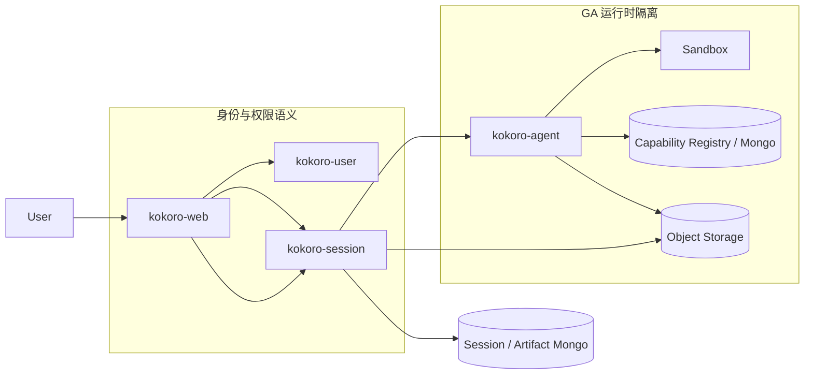
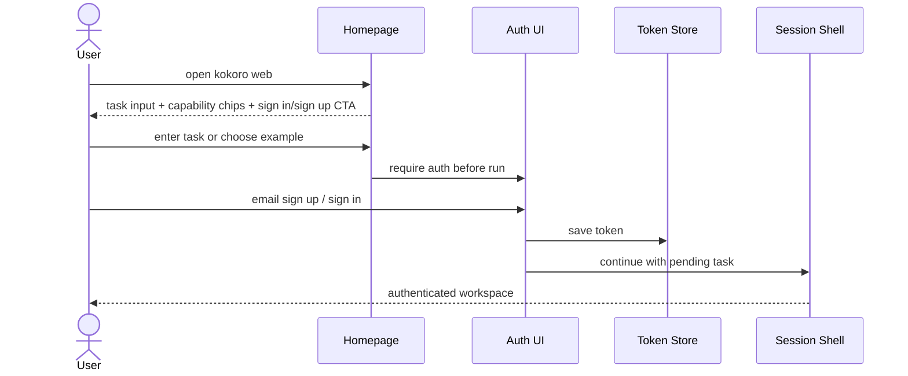
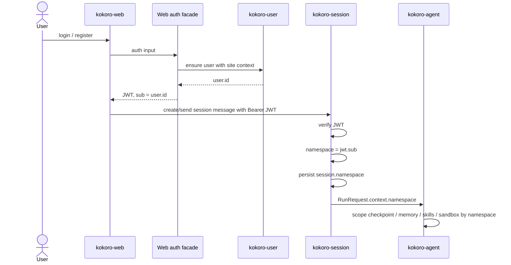
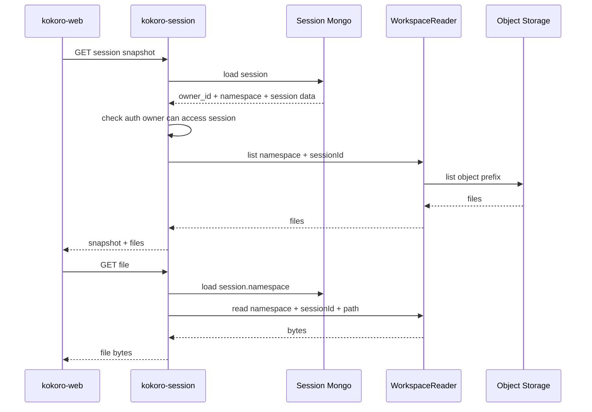
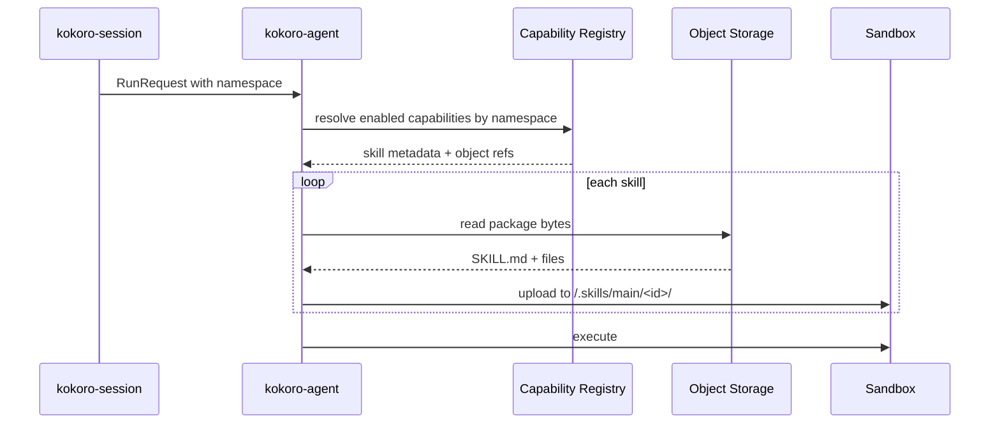
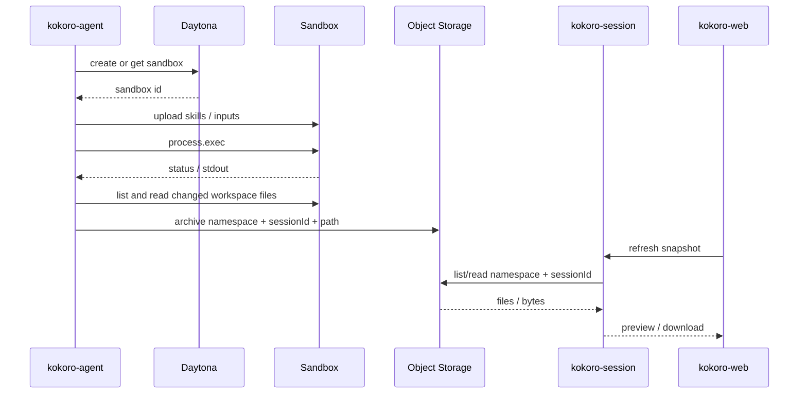
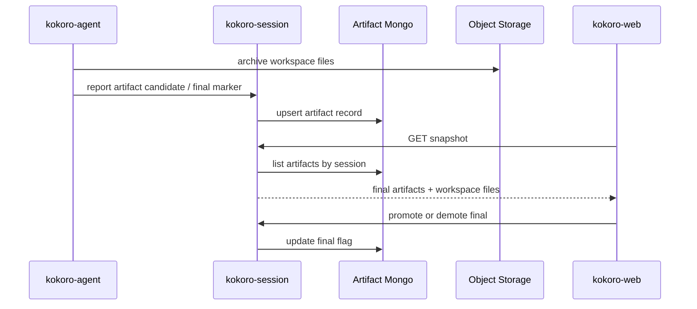
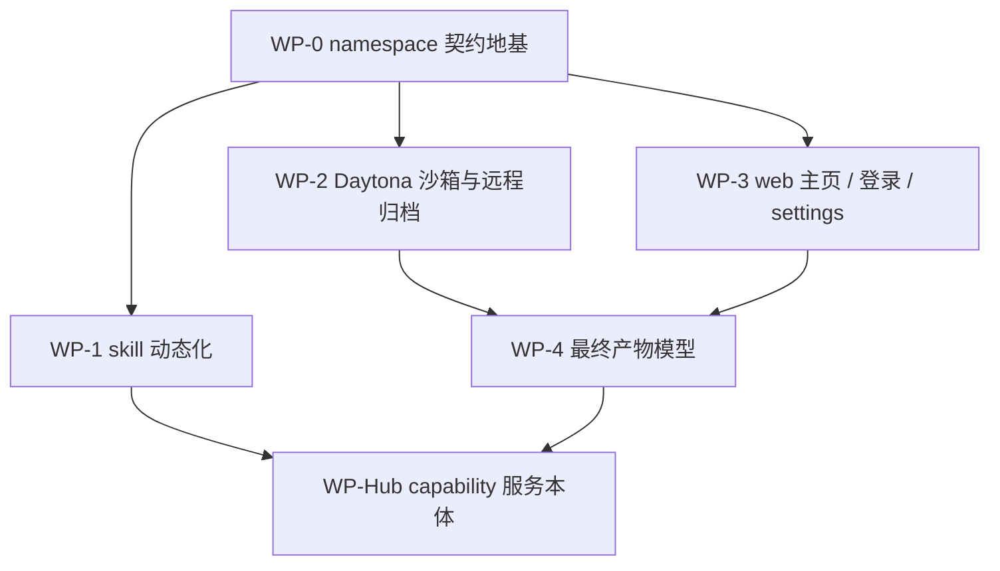

# Kokoro 能力中台、namespace、登录、沙箱与产物技术方案

状态：正式技术方案，当前主线版本
日期：2026-07-07
范围：kokoro-web / kokoro-session / kokoro-agent；platform 暂不直接改，后续需要时只新增能力子仓库或服务边界。

## 0. 读这份方案先记住三句话

1. GA / kokoro-agent 只认不透明 `namespace`，它是运行时隔离的唯一 key。
2. kokoro-user 会进入登录闭环，但 user/team/site 语义停在 web / session / platform，不进入 GA。
3. skill / mcp / subagent 共享一个 capability hub 注册骨架，按 kind 分交付方式，不拆成两套重复 registry。

这份方案要闭合的是一条真实产品链路：

```text
用户打开主页
  -> 直接理解 Kokoro 能做什么，并能输入任务或选择能力入口
  -> 登录 / 邮箱注册
  -> web 拿到 session 可验的 JWT
  -> session 选择并持久化 namespace
  -> GA 用 namespace 隔离 checkpoint / memory / skills / sandbox / workspace
  -> 沙箱产物归档
  -> session 记录最终产物
  -> web 分区展示最终产物和普通 workspace 文件
```

第一阶段只做个人 namespace。团队空间以后由 web/session/platform 选择另一个 namespace 并校验 membership；GA 不需要知道 namespace 代表个人还是团队。

### 0.1 本文档位置

本文档是当前能力中台 / namespace / 登录 / 沙箱 / 产物主线的正式技术方案，canonical 位置是：

```text
docs/kokoro-handbook/technical/18-capability-namespace-auth-sandbox-artifacts.md
```

`docs/superpowers/specs/2026-07-07-capability-namespace-auth-technical-plan.md` 只保留为历史草案入口和跳转指针，避免两份正文漂移。

关系如下：

```text
docs/kokoro-handbook/     正式技术方案、长期规则和稳定结论
docs/superpowers/specs/   打磨期草案、方案对比和历史入口
docs/handoffs/            短期派工，解释这一轮怎么拆 worker
kokoro-*/docs/            子仓自己的实现细节、验收和运行说明
tmp/                      外部参考、截图、探索草稿和一次性中间产物
```

后续若本文方案有正式变更，直接改本文件；探索性对比、截图和外部参考仍放 `tmp/` 或新的 dated spec 草案中。

## 1. 已定决策

### 1.1 namespace 单轴隔离

`namespace` 是 GA 侧唯一隔离键。

允许：

```text
namespace = kokoro-user User.id       # 个人空间第一阶段
namespace = future workspace/team id  # 未来团队空间
namespace = local-user                # 本地直通开发
```

禁止：

```text
namespace = user:<ownerId>
namespace = site:<siteId>:user:<userId>
RunRequest.context.userId / ownerId / workspaceId
GA 用 user/team/site 辅助隔离
```

解释清楚一点：个人空间第一阶段可以让 `namespace` 的值等于 kokoro-user 的 `User.id`。但它进入 session/GA 后就是一个 opaque namespace，不再带 user 语义。GA 不能根据它推断用户、团队、站点或权限。

### 1.2 hub 结构：一个 capability hub，内部按 kind 分模块

不拆 `skill-hub` 和 `mcp-hub` 两套服务骨架。

共享骨架：

- namespace 归属
- per-namespace 启用态
- 官方 / 自定义 / 共享 grant
- 版本、审核、配额
- 管理后台 CRUD
- runtime resolve 读模型

按 kind 分交付：

```text
skill     文件包，agent 读对象存储后上传进沙箱
mcp       活连接和授权，agent 运行时建连接，不进沙箱文件面
subagent  定义，agent 编译 graph 时装配
```

后端服务本体暂不动 platform 主树。需要正式管理 API 时，在 platform 侧新增一个 capability 子仓库/服务边界即可。

### 1.3 最终产物模型默认落法

为了让 WP-4 不继续卡住，本方案采用：

```text
agent 显式标记为主，web 用户覆盖为辅，目录约定只做启发式。
```

原因：

- 只靠目录约定，模型容易写错位置。
- 只靠用户勾选，自动化闭环不完整。
- agent 标记 + 用户 promote/demote 能兼顾自动归档和人工修正。

最终产物记录入 Mongo；文件本体仍在对象存储。web 展示时分成 Final artifacts 和 Workspace files 两区。

### 1.4 Web 产品入口层：先做可换皮 frontend shell

主页、登录、邮箱注册、settings 不是零散页面，它们是同一个 Web 产品入口层。这里先定前端结构：

```text
Homepage
  -> task input / capability chips / product proof
  -> sign in / email sign up
  -> authenticated session shell
  -> settings / capability hub / artifacts
```

当前 kokoro-web 的 `/` 直接渲染 `SessionShell`。下一步要把它拆成：

```text
/             public homepage, task-first product entry
/login        sign in
/signup       email registration
/app          authenticated session shell
/settings     authenticated user settings
```

如果实现时暂时不新增所有路由，也要保持同样的组件边界：public home、auth surface、app shell、settings 不能揉成一个大页面。

设计原则：

- 首页第一屏要直接表达“让 agent 干活”，不是传统介绍型 landing page。
- 首页可以有任务输入框、任务范例 chips、能力入口、工作流预览和明确登录/邮箱注册 CTA。
- 登录和邮箱注册走同一套 auth surface，表单状态、错误、loading、退出、token 存取集中管理。
- 后续会频繁换皮，所以视觉 token、文案、版式配置和功能接线必须分离。
- 先只动 kokoro-web 前端：把页面壳、组件边界、token、auth client adapter、路由状态整理好；真正消费者 auth 签发可以后接。

首页信息架构建议：

```text
HeroTaskEntry
  用户任务输入框
  任务范例 chips
  sign in / email sign up / continue CTA

CapabilityStrip
  Research / Slides / Code / Design / Data / Automation 等能力入口

WorkflowPreview
  展示从 prompt -> agent plan -> files/artifacts 的链路

ArtifactProof
  展示 Kokoro 不是只聊天，而是会产出文件、预览、下载、最终产物

TrustAndControl
  展示 HITL、可审阅、可取消、可恢复、文件归属
```

可换皮契约：

- theme tokens 管颜色、字体、半径、阴影、密度、动效。
- homepage content config 管 headline、任务范例、能力 chips、workflow cards。
- visual components 只吃 props，不直接调用 session client。
- auth/session/canvas adapter 放在功能层，换皮不动它。
- CSS Modules 或现有样式组织继续随组件走，不新增重型 UI 框架。

前端不能做的事：

- 不把具体外部参考站的路径、文案、类名、组件结构写进正式代码或正式文档。
- 不把认证业务散落到每个页面。
- 不让换皮修改 session/auth/canvas 的业务调用。
- 不为了首页换皮去改 session/agent/platform。
- 不把 public homepage 写成只能展示不能进入任务的纯营销页。

## 2. 系统边界



边界原则：

- kokoro-user 是用户、团队、成员关系的权威。第一阶段只调用，不改 platform。
- kokoro-web 负责产品主页、登录/邮箱注册 UI、auth client adapter、settings、canvas 和产物展示；auth facade 如需签发 JWT，也只作为 web 内部薄接线，不进入 GA 边界。
- kokoro-session 是 namespace 进入 GA 的唯一闸门，负责验签、裁权、session.namespace 持久化。
- kokoro-agent 只消费 namespace，不查询用户主数据，不判断 owner/team/site，不扣积分。
- 对象存储承载 workspace 文件、skill 包字节、artifact 大文件。
- Mongo 承载 session history、capability metadata、artifact record。

## 3. 关键时序

### 3.0 首页、登录与邮箱注册入口



读法：

- 首页不是纯营销页，第一屏应当是产品入口：让用户马上知道可以交给 Kokoro 一个任务。
- 未登录用户输入的任务要能暂存，登录/注册完成后继续进入会话。
- 登录、邮箱注册、退出、token 读取、错误状态由统一 auth client adapter 管，不散在页面里。
- 首页换皮只能影响 presentation，不应该影响 token 管道、session client 和 canvas。

### 3.1 登录到 GA run



读法：

- `jwt.sub` 在个人空间第一阶段就是 namespace id。
- session 可以保留 `ownerId` 做 HTTP 裁权，但 ownerId 不传给 GA。
- 本地直通模式可以让 HTTP owner fixture 和 namespace fixture 都取 `local-user`，但 GA 仍只接收 namespace。

### 3.2 会话刷新与 workspace 文件读取



必须改变的点：

- 不能再用部署实例的 `KOKORO_NAMESPACE` 读多用户 workspace。
- session 创建时必须写 `session.namespace`。
- relay recover / 页面刷新 / 文件读取都从 session/run 记录恢复 namespace。
- snapshot 可以不向 web 暴露 namespace；web 只拿鉴权后的文件投影。

### 3.3 capability resolve 与 skill 进沙箱



运行原则：

- 沙箱不拿 Mongo/S3 凭据。
- agent 是搬运工：它读 registry/object storage，再把需要的文件上传进沙箱。
- 单个 skill resolve/read 失败时记录 warning 并跳过，不中断整个 run。
- `skills/provision.py` / `skills/supply.py` 交付链尽量不动，主要替换资产来源和 package 表达。

### 3.4 Daytona 自托管沙箱与远程归档



当前 local/docker 归档依赖宿主目录。Daytona/E2B 是远程沙箱，必须补“远程文件拉出并归档”路径。为了 dev 自闭环，优先跑 Daytona compose；E2B Cloud 可作为配置态可选后端，不作为自托管主线。

### 3.5 最终产物归档与用户修正



artifact record 建议字段：

```text
namespace
sessionId
runId
path
storageRef
kind
mimeType
size
hash
isFinal
source = agent | user | heuristic
createdAt
updatedAt
```

## 4. 数据所有权

| 数据 | 权威位置 | 说明 |
|---|---|---|
| User / Team / Membership | kokoro-user MySQL | 第一阶段 web 调用，不直接改 platform |
| JWT | kokoro-web auth facade 签发，kokoro-session 验签 | `sub` 使用 kokoro-user `User.id` |
| session.namespace | kokoro-session Mongo | 每个 session/run 的运行时 namespace |
| checkpoint / memory scope | kokoro-agent | 只按 namespace |
| workspace 文件 | 对象存储 | key 由 namespace + sessionId + path 组成 |
| skill 包字节 | 对象存储 | namespace 拥有的能力资产 |
| capability metadata / enablement | Mongo | capability hub 注册读模型 |
| MCP secret | secret store | 不进明文 Mongo，不进沙箱 |
| artifact record | Mongo | 记录最终态、展示分区和 storageRef |
| homepage content/theme | kokoro-web | 前端可换皮配置，不拥有后端业务真源 |

不新增：

- 不新增 `kokoro-contracts`。
- 不引入 PostgreSQL。
- 不把 Redis 当长期真源。
- 不让 GA 增加 user/owner/workspace 第二身份轴。

## 5. 工作包

### WP-0：namespace 契约地基

目标：

```text
session/run 持久绑定 namespace。
RunRequest.context.namespace 来自认证上下文。
workspace list/read 使用 session.namespace。
GA 继续只消费 namespace。
```

主要改动：

- kokoro-session auth result 扩展为 `{ ownerId, namespace }`，其中 `ownerId` 只用于 session HTTP 裁权，`namespace` 才进入 GA。
- 直通开发模式：HTTP owner fixture 和 namespace fixture 都取 `local-user`。
- JWT 模式：`namespace = sub`，签发方用 kokoro-user `User.id` 作为 sub。
- sessions 文档新增 `namespace`。
- 创建 session、发送 run.request、relay recover、snapshot、file endpoint 都从同一个 namespace 来源读取。
- namespace profile 改成 request-time resolve：
  - 无 profile 文件：所有 namespace 走默认空 profile。
  - 有 profile 文件：支持 default profile + 显式 namespace override。
  - 不能要求每个真实用户 namespace 都预声明。

验收：

- 两个 JWT sub 创建会话，checkpoint/memory/workspace 不串。
- 他人 session 仍 403。
- 文件 endpoint 不再读取实例级 `KOKORO_NAMESPACE`。
- GA 契约没有 userId / ownerId / workspaceId。
- 契约生成检查稳定。

### WP-3：web 主页、登录/邮箱注册与消费者 settings

目标：

```text
先把 kokoro-web 的产品入口层整理好。
主页、登录、邮箱注册、settings、会话入口是可换皮的 frontend shell。
功能通过 auth/session/canvas adapter 套进去，不把业务接线写死在视觉层。
```

主要改动：

- 路由和入口整理：
  - 将现有 `/` 从直接 `SessionShell` 调整为 public homepage。
  - 将 authenticated app shell 挪到 `/app` 或等价受保护入口。
  - 登录页、邮箱注册页、settings 页与 app shell 分层。
  - 已登录用户访问 `/` 时可展示 continue CTA 或自动进入 `/app`，但不要让 homepage 直接持有 engine 单例。
- kokoro-web 增加产品主页：
  - 第一屏保留任务输入入口。
  - 提供任务范例 chips / 能力 chips。
  - 登录、邮箱注册、进入应用 CTA 明确。
  - 已登录时直接进入 SessionShell 或保留“新建任务”入口。
  - 展示 prompt -> plan -> artifacts 的工作流预览，不需要真实后端数据。
- kokoro-web 增加登录与邮箱注册页面：
  - email-first 表单。
  - 注册至少覆盖 email、验证码/链接态占位、继续任务态。
  - 登录至少覆盖 email、密码/验证码态占位、忘记/重发态占位。
  - loading / error / success / resend / disabled 状态齐全。
  - 登录和注册共用 auth layout、auth state、token 写入逻辑。
- 新增或整理 auth client adapter：
  - 统一读写 `localStorage("kokoro.auth.token")`。
  - 统一向 session client 注入 Bearer token。
  - 支持 pending task：未登录首页输入的任务，登录后继续。
  - 后续接 kokoro-user/auth facade 时只换 adapter 内部实现。
- 已登录状态进入 SessionShell；退出清理 token。
- settings 覆盖账户、空间、偏好、数据入口。
- 样式体系支持换皮：
  - 颜色、字体、半径、阴影、密度、动效用 token 管。
  - 首页 sections 用数据配置或小组件组合，避免 copy/布局硬编码在业务调用里。
  - 首页视觉组件不直接调用 session API，只通过 action props / adapter。
  - 主页视觉风格先走“任务输入优先 + 克制高端 AI workspace”方向，避免过重卡片堆叠；后续换皮只替换 tokens 和 content config。
- 外部消费者 UI 参考只作为 tmp 中间产物：不把来源路径、分支名、逐字文案、命名或 CSS/组件结构写进正式文档和源码。

非目标：

- 不改 kokoro-session / kokoro-agent。
- 不改 platform / kokoro-user。
- 不在本包内实现 capability 后端。
- 不为了首页换皮改 canvas 业务数据结构。

验收：

- 主页在未登录态能展示任务输入、能力入口、登录和邮箱注册 CTA。
- 未登录输入任务后，登录/注册完成能继续进入会话入口。
- 登录后 localStorage 有 token；退出后 token 清空，受保护页面回登录。
- token 能访问 session；Playwright 走通登录 -> 发消息 -> 刷新恢复。
- 登录、邮箱注册、错误、loading、退出都有可见状态。
- 换一套 theme tokens 或 homepage content config 不需要改 auth/session/canvas 业务代码。
- 首页、登录、注册、settings 在移动端和桌面端都无文本溢出、无遮挡、CTA 清晰。
- 正式源码和正式文档不出现外部参考来源路径/分支/代码标识。

### WP-2：Daytona 沙箱与远程归档

目标：

```text
新增 daytona backend。
远程沙箱文件能拉出归档到对象存储。
dev 自闭环优先 Daytona compose。
```

主要改动：

- contract backend enum 加 `daytona`。
- agent sandbox settings 加 Daytona 配置。
- 新增 `daytona_backend.py`。
- `make_backend_for_run` 注册 Daytona connector。
- ledger 绑定 sandbox id，支持 resume。
- 新增 remote workspace archiver：
  - list/read 远程 workspace 文件。
  - 上传对象存储 key：`namespace + sessionId + path`。
  - E2B 后端后续可复用同一接口。

验收：

- Daytona compose 可启动。
- execute 可跑。
- 文件写入后能在 web canvas 看到。
- stop -> get -> start 后文件保留。
- terminal 后对象存储存在归档文件。

### WP-1：skill 动态化

目标：

```text
SkillLibrary 从启动快照升级为按 namespace resolve。
skill 包支持二进制。
resolve 降级不中断 run。
```

主要改动：

- 新增 capability registry reader 抽象。
- 新增 S3/MinIO skill package reader。
- `SkillPackage.files` 支持 bytes 或对象存储引用。
- 保持 `provision` / `supply` 交付路径。
- runtime resolve 合并：
  - runtime 显式 skills
  - namespace enabled skills
  - official required skills
- 单项失败记录 warning，跳过该 skill。

验收：

- MinIO 放一个 skill 包。
- Mongo 放 metadata/enabled 记录。
- 跑一次 run 后沙箱里出现 `/.skills/main/<skill>/SKILL.md`。
- agent 能读该 skill。
- pyright / ruff / 定向 pytest 通过。

### WP-4：最终产物模型

目标：

```text
workspace 文件和最终产物分开展示。
最终产物记录入 Mongo，文件本体仍在对象存储。
```

主要改动：

- session 新增 artifact record read model。
- agent 新增 final marker 输出。
- session 收到标记后 upsert artifact record。
- web canvas 分区：
  - Final artifacts
  - Workspace files
- web 允许用户 promote/demote final。

验收：

- agent 标记后 web 自动显示 final。
- 用户能把普通文件设为 final。
- 刷新后 final 状态不丢。
- 下载仍走鉴权 file endpoint。

### WP-Hub：capability 服务本体，后置

目标：

```text
需要正式管理 UI / API 时，在 platform 下新增 capability 子仓库或服务边界。
```

建议边界：

```text
kokoro-capability
  registry CRUD
  enable / disable
  publish / import
  S3 object refs
  Mongo metadata
  MCP secret refs
  admin manifest
```

这不是第一阶段阻塞项。前几包可以先通过 registry reader、测试 fixture、MinIO/Mongo 直连完成闭环。等需要 hub 服务 API 时再落 platform 能力子仓库。

## 6. 推荐执行顺序



实际派工建议：

1. 第一波只做 WP-0，先把 namespace 轴打正。
2. WP-0 稳定后，WP-3、WP-2、WP-1 可并行，分别在 web/session、agent sandbox、agent skills 三个 surface。
3. WP-4 依赖 web 能看文件、远程归档能落对象存储。
4. WP-Hub 等 platform 协调或需要管理 API 时再开。

并行 worker 规则：

- 每个 worker 必须注入 `docs/CODEBASE_MAP.md`。
- 每个 worker 只写自己工作包内文件。
- worker 报成功不算完成，主仓必须重新跑验证。
- 外部 UI 参考、截图和探索记录只放 tmp。

## 7. 风险与防护

| 风险 | 防护 |
|---|---|
| namespace 又被写成 user/owner 双轴 | 文档、契约、测试都只断言 GA 消费 namespace |
| JWT sub 不是 kokoro-user User.id | web auth facade 统一签发，sub 固定用 user.id |
| session 刷新后丢 namespace | session 创建时持久化 namespace，snapshot/file/recover 都从 session/run 恢复 |
| workspace 仍用实例级 env namespace | 文件端点测试覆盖两个 namespace 同名 path 不串 |
| profile 文件要求每个用户预声明 | default + override，不要求枚举真实用户 namespace |
| skill resolve 抖动拖垮 run | 单项失败跳过，整体 run 继续 |
| 沙箱拿到对象存储凭据 | agent 负责搬运，sandbox 无凭据 |
| 远程沙箱写出的文件 web 看不到 | 新增 remote archive 接口，terminal 后拉取并归档 |
| 最终产物全靠目录约定 | agent marker 为主，用户 promote/demote 为辅 |
| hub 两仓重复骨架 | capability 单边界，kind-specific delivery |
| 外部 UI 参考污染正式 repo | 来源路径/分支/代码标识只允许 tmp，中间产物不提交 |

## 8. 完成定义

这条主线可认为闭环，需要同时满足：

1. 登录后 JWT `sub` 是个人 namespace。
2. session 创建、run.request、workspace key 使用同一个 namespace。
3. GA 侧没有 userId / ownerId / workspaceId 隔离字段。
4. 两个 namespace 的 checkpoint、memory、workspace、skills 不串。
5. web 可以登录、进入会话、刷新恢复、查看文件。
6. Daytona dev 闭环能 execute、resume、归档远程文件。
7. skill registry 设计能同时覆盖 skill/mcp/subagent，不重复骨架。
8. artifact record 能区分 final artifacts 和 workspace files，刷新后不丢。
9. 外部 UI 参考只作为 tmp 中间产物，不进入正式源码和正式文档来源路径。

## 9. 给人类评审的检查点

评审时先看这四个问题，不需要先读代码：

1. `namespace` 是否已经被写成唯一运行时隔离轴？
2. kokoro-user 是否只作为身份来源，不把 user/team/site 语义泄漏进 GA？
3. capability hub 是否共享一套 registry 骨架，而不是 skill/mcp 各写一遍？
4. 产物链路是否从沙箱写文件一直闭到 web 展示和 final 标记？

如果这四点成立，就可以先开 WP-0。WP-0 完成后，再并行推进 web 登录、Daytona 和 skill 动态化。
