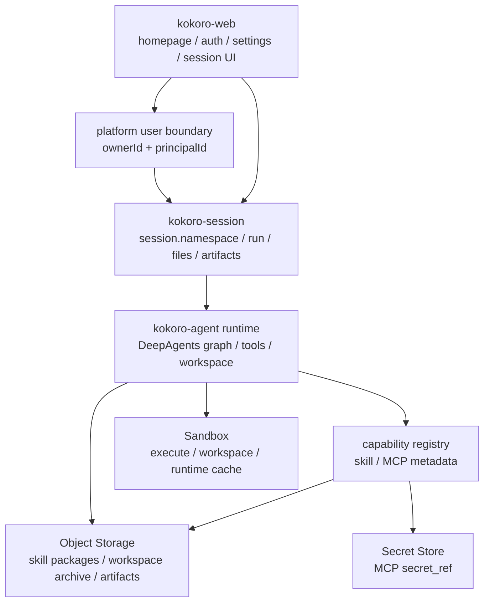
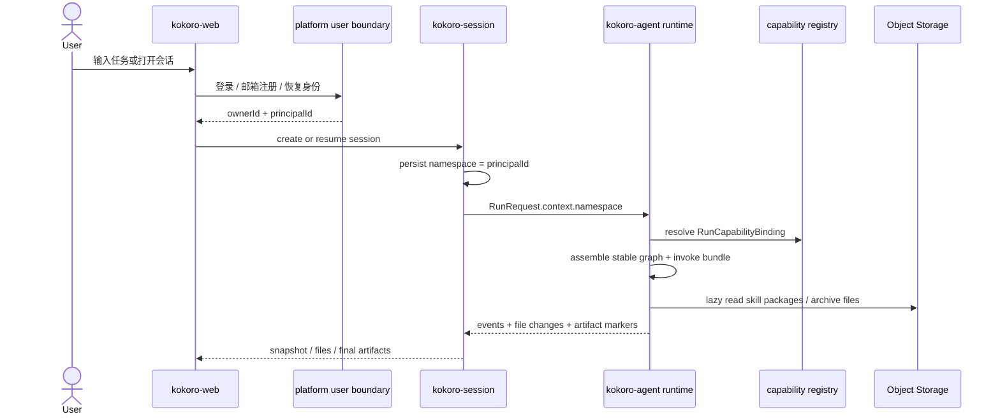
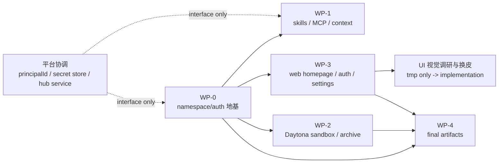
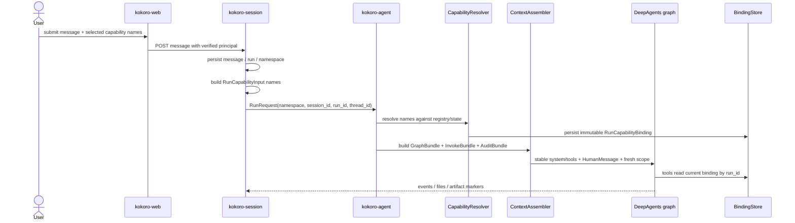
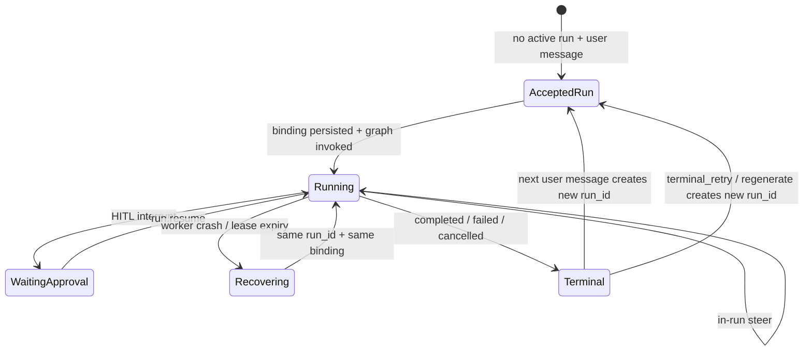

# Kokoro 当前主线技术方案与执行计划（评审版）

> **已被取代**：V1 定稿事实源是 [`20-kokoro-v1-technical-plan.md`](20-kokoro-v1-technical-plan.md)。
> 本文保留为扩展附录（打磨全记录、风险细节、P2 蓝图）；本文与 20 冲突时以 20 为准。
> 特别注意：本文中的 registry 四层、binding store、principal 表、独立 selection 服务、stage 状态机、
> `submit_artifact` 独立 keyspace 等设计已在 20 中被明确砍掉或替换，不要照本文实现。

状态：扩展附录（被 20 取代）  
日期：2026-07-08  
范围：kokoro-web / kokoro-session / kokoro-agent；platform 仅需交付 V1 前置的 `principal` 表 + 签发（§3.5 第 2 条），其余平台能力（capability hub、secret store 完整实现）V1 用最小 reader/adapter，不在本轮派实现。

## 0. 历史阅读边界

本文**不是**当前主线的 human review source of truth；标题中的“当前”仅保留历史日期语义。它描述的
`principalId -> namespace`、registry 四层、selection、`RunCapabilityBinding`、`skill_list/skill_read`、stage 骨架与
ContextAssembler 都不进入当前 target。当前评审以 00、36、38、33、29、ADR-015~022 为准。

| 文档 | 角色 | 使用方式 |
|---|---|---|
| 本文 | 方案演进记录 | 只查历史背景、已识别风险与旧字段。 |
| `18-capability-namespace-auth-sandbox-artifacts.md` | 同期详细附录 | 只查历史时序，不新增 target 设计。 |
| `docs/handoffs/2026-07-07-runtime-buildout-next-handoff.md` | 历史派工单 | 不再按其拆分新工作。 |

三份历史文档发生冲突时，不再用它们裁定 target；以 `00-system-overview` 的权威层级与 36 的总体方案为准。

评审时只需要先确认四件事：

1. `namespace = principalId` 是否作为唯一 agent runtime 隔离轴。
2. skill / MCP 是否都走稳定工具 + lazy describe/read，不污染 prefix cache。
3. web/session/agent 的边界是否清楚，platform 是否只提供主体身份。
4. 每个 WP 的 TODO 和验收是否足够派给 code agent。

## 1. 核心判断

1. **主体统一成 principalId，且独立分配。**  
   ownerId 是账号身份，principalId 是全局唯一主体，由 platform 侧独立的 `principal` 表分配，**不复用 ownerId / User.id**。V1 每个个人 User 1:1 映射一个 `kind=personal` 的 principal；未来 team/workspace 也映射成 principal，不必新造隔离轴。kokoro-agent runtime 不关心主体类型。理由：`namespace = principalId` 是写进 session、workspace 对象存储 key、binding store 的**不可迁移隔离键**，主体类型必然扩展；若把它焊死在 ownerId/User.id 上，未来 team 上线要做数据级迁移。

2. **agent runtime 只认 namespace。**  
   session 持久化 `namespace = principalId`，后续 relay / recover / snapshot / file read / workspace list 都从 session 反查 namespace。禁止拼 `user:<ownerId>`。

3. **当前只做 capability registry/read path，不先做完整 hub service。**  
   capability registry 只覆盖 skill 和 MCP。DeepAgents graph 里的内部运行节点不是用户可启用能力，不进 registry，不做 package，不做 enablement 表。

4. **能力分四层，agent 不负责选择能力。**  
   Catalog 存定义，Selection 产出本次 run names，Binding 把 names 解析成不可变引用，Use 只通过稳定工具读取/调用 binding。agent 只在绑定结果里使用能力，不做配额、授权或自动扩容。

5. **skills 不无限塞入 context。**  
   system prompt、tool schema、tool description 保持稳定。skill 内容只通过 `skill_read` 被模型按需读取。active skills 变化不能改变稳定前缀。

6. **MCP 也不把全部 tool schema 挂进模型。**  
   MCP 协议标准仍是 `tools/list` / `tools/call` 等 primitive；Kokoro 只向 agent 暴露稳定的 adapter tools：`mcp_list_tools` / `mcp_describe_tool` / `mcp_call`。具体 server/tool/schema 由 MCP client/gateway 按需查询。

7. **dynamic context 默认空。**  
   `ContextAssembler` 生成 GraphBundle / InvokeBundle / AuditBundle。只有极少数 allowlist runtime note 可以请求级注入，且不写 checkpoint。

8. **sandbox/cache 不是权限事实源。**  
   关闭 skill 不做前台删除；binding 拦住 list/read，generic file read 不能绕 capability 路径。

9. **UI 视觉放后，但 web 底座要先整理。**  
   首页、登录、邮箱注册、settings、app shell 先打通。视觉调研和换皮只进入 `tmp/` 中间产物，正式 docs/code 不写外部参考路径或标识。

10. **业务 agent 是编排岗位，不是能力包。**  
    业务 agent 由统一编排骨架 + `AgentProfile`（对应 `prompts/` 目录的一份 system prompt、任务形状、阶段、每阶段能力、HITL / 委派 / 产物策略）定义，既不是 capability registry 里可 enable/disable 的能力项，也不是 DeepAgents graph 内部运行节点。业务 agent 是 swarm 里的 named node，各有 `prompts/` 目录里稳定的一份前缀；agent 间切换走 **langgraph-swarm handoff**（详见 §3.2 / §3.3），不是走新 run。本轮**只定义这层边界，不拆 WP、不建实现**，实现待通用 agent 跑通后再谈。

## 2. 术语边界

| 术语 | 含义 | 不能做什么 |
|---|---|---|
| `ownerId` | 账号/用户记录 id | 不进入 agent runtime 隔离 |
| `principalId` | 全局唯一主体 id；由 platform `principal` 表独立分配，个人、team、workspace 未来都可映射成主体 | 不等于 `ownerId` / `User.id`；不带 `user:` / `team:` 这类运行时前缀 |
| `namespace` | kokoro-agent runtime 唯一隔离键，值等于 principalId | 不再并行引入 userId/workspaceId/teamId 做隔离 |
| `siteId` | 产品站点/皮肤/业务入口轴 | 不进入 agent runtime |
| capability registry | skill/MCP 元数据和 state 的统一边界 | 不承载 agent graph 内部节点 |
| principal skill pool | 主体可用池，来自默认、collection、settings | 不代表每次 run 都 active |
| `RunCapabilityInput` | session/capability selection 层传给 agent 的本 run names | 不包含 package_ref、secret、tool schema |
| `RunCapabilityBinding` | agent runtime 解析 names 后得到的不可变能力引用账本 | 不做用户授权和配额决策 |
| MCP enabled servers | 主体启用的 MCP server name 集合 | 不把所有 tool schema 放进 prompt |
| workspace archive | sandbox/workspace 文件归档到对象存储 | 不等于最终产物 |
| final artifact record | agent `submit_artifact` 冻结提交的不可变最终产物读模型 | V1 无用户 promote/demote，agent 是唯一定稿者；不替代普通 workspace 文件列表 |
| runtime note | 少量请求级、模型可见的动态说明 | 不放 session_id/run_id/namespace/文件索引/secret |
| AuditBundle | runtime 事实、cache keys、RunCapabilityBinding summary、tool manifest | 默认不给模型看 |
| `AgentProfile` | 业务 agent 的声明式岗位定义：对应 `prompts/` 目录的一份 system prompt、任务形状、阶段、每阶段能力、HITL / 委派 / 产物策略 | 不是 capability 项，不是 graph 节点，不在 run 内热切 |
| 业务 agent 编排层 | 统一编排骨架 + `AgentProfile` 组成的 C 层 | 不做 enable/disable，不下沉 graph，不改写稳定前缀 |
| 通用 agent / 专属 studio agent | swarm 里**平级对等**的 top-level agent：通用 = 统一 `general.md` prompt 的默认编排入口；专属 = 某 studio 里自己当主的 agent，各有目录 prompt 和能力白名单 | 通用 agent 下的能力小模块（子）≠ 平级的同名专属 agent（自己当主） |
| swarm handoff | langgraph-swarm 的 `Command(goto=<agent>, graph=PARENT)`：同 graph/checkpoint 内在平级 agent 间切换"谁当主" | 不开新 run；不等于 deepagents 父等子 subagent |
| stage 骨架 / `StageSpec` | 所有业务 agent 共享的统一阶段槽位与每阶段契约（§3.3） | 各 agent 只填能力/策略，不新增骨架阶段 |

字段命名规则：

- platform/capability 服务侧可以叫 `principal_id`。
- agent/session runtime 侧只叫 `namespace`。
- 同一张 runtime 表不要同时放 `principal_id` 和 `namespace` 两个隔离字段。

## 3. 目标架构



主链路：



### 3.1 公开设计信号校准

这不是竞品复刻。正式文档只保留抽象设计信号和 Kokoro 结论；来源名称、路径、截图、逐字文案、类名和资产都只能进入 `tmp/` 中间产物。

| 设计信号 | 关键约束 | Kokoro 结论 |
|---|---|---|
| MCP host/client 标准形态 | 标准 primitive 是 `tools/list`、`tools/call`；host 必须控制工具暴露、调用批准、审计和缓存失效。 | `mcp_*` 只能是 Kokoro adapter，不是协议方法名；必须有 allow/deny、approval、trace、cache invalidation。 |
| MCP gateway 工程形态 | 需要 tool filtering、tool list cache、approval policies、per-call metadata、server failure handling。 | Kokoro MCP gateway 不能只做 call proxy；要把 tool filter、approval policy、schema cache、failed server state 和 per-call metadata 作为 V1 contract。 |
| graph persistence 形态 | checkpointer 适合 thread-scoped graph state；store 适合跨 thread durable data；checkpoint 会增长，需要 retention。 | RunCapabilityBinding / AuditBundle / capability state 不写进 messages；checkpoint 只承接会话连续性，长期主体配置和能力状态走 registry/store/read model。 |
| software-agent sandbox 形态 | sandbox lifecycle、权限、远程执行、用户界面和安全分析是平台能力，不是临时 execute wrapper。 | WP-2 不能只实现 execute；必须有 lifecycle、permission manifest、archive、recover、setup verification 和事件可观测性。 |

### 3.2 系统分层与业务 agent 编排边界

把当前主线显式拆成五层，避免继续把"agent"误解成"capability binding + graph"：

| 层 | 职责 | 本轮主线 |
|---|---|---|
| A. Identity | ownerId / principalId / namespace | platform `principal` + WP-0 |
| B. Capability | skill / MCP 的 catalog / selection / binding / use（稳定 adapter 工具） | WP-1 |
| C. Legacy `AgentProfile` composition（已否决） | 业务 agent 岗位定义：`AgentProfile` + 统一编排骨架 | 本轮只定边界，不建实现 |
| D. Runtime Execution | DeepAgents graph / middleware / checkpointer / store / sandbox | WP-1 / WP-2 |
| E. Artifact | workspace file / archive / final artifact | WP-4 |

**C 层是本轮显式补出的边界，不是新派工。** 它回答一个 B/D 层都不回答的问题：一个业务 agent 是什么岗位、处理什么任务形状、走哪些阶段、每阶段挂哪些能力、何时委派 / HITL、如何判定最终产物。没有这层，新增业务 agent 会退化成两种坏形态——要么塞一坨大 prompt（不可维护），要么按垂类各改 graph 接线（破坏 §1.5/1.6 稳定前缀）。

**Agent 拓扑：通用 agent 与专属 studio agent 平级对等，各自当主，swarm 内切换。**

- 通用 agent（`general`）与各专属 studio agent 是 swarm 里**同一等级的 top-level agent**，各自在自己场景当"主 agent"，**不是上下级**：
  - 通用 agent：默认入口，统一 `general.md` prompt，通过 subagent / skill 挂各能力小模块（**其中就含一个垂类小模块**）做泛化调度——这里"通用当主，垂类只是它下面的子模块"。
  - 专属 studio agent：进对应 studio 直接以它当主，有自己 `prompts/` 目录里的一份 .md、自己的阶段骨架和能力白名单——这里"该垂类自己当主"。
  - 关键：**通用 agent 下的垂类小模块（子）≠ 平级的同名专属 agent（自己当主）**。同一个垂类名，一个是通用主之下的子模块，一个是与通用平级、自己当主的 top-level agent。它们是同一套 agent 机制、不同配置。
- agent 间切换 = **langgraph-swarm handoff**（`Command(goto=<agent>, graph=Command.PARENT)`）：同一 graph / checkpoint 内在这些**对等 top-level agent** 间移交主导权，不走新 run，也不是 deepagents 父等子 subagent。
- 两个委派机制别混：**swarm handoff 在平级 agent 间换"谁当主"（岗位切换）**；**subagent task 是当前主 agent 在阶段内往下调子能力（父等子返回，主导权不变）**。

**统一骨架 + 局部自由度。** 不是纯统一流程，也不是每个 agent 各写一套：

- 所有业务 agent 共享：统一阶段骨架（§3.3）、统一 HITL 位置、统一 `submit_artifact` 产物语义、统一 handoff / subagent 委派心智、统一"只消费本 run capability binding"。
- 每个业务 agent 差异化的：`prompts/` 目录里对应的一份静态 .md、任务形状、各阶段能力白名单、各阶段 HITL 策略、review policy、artifact metadata。差异**不靠运行时拼 prompt**，靠"选哪份目录 .md + 挂哪些 skill/subagent/tool + 填哪些阶段策略"。

**边界（防误解）：**

- C 层不是 capability registry：`AgentProfile` 不是可 enable/disable 的能力项。
- C 层不是 DeepAgents graph 内部节点：它是 product-owned 的声明式岗位模板，装配时映射到稳定 graph + 稳定 prompt。
- **每个 agent 的 system prompt 是 `prompts/` 目录里的静态一份，run 内不动。** 无论通用还是专属 agent，其 prompt 都是"按 agent 名取一份现成 .md"，不是运行时逐字段拼。这与 §1.5/1.6 稳定前缀**不冲突**：每个 named agent 各有一份稳定前缀；swarm handoff 是在同一 graph 内切到另一个平级 named agent 的稳定前缀，不是动态改写某一份 prompt。
- **swarm handoff 与 capability binding 的接缝：** `RunCapabilityBinding` 仍 run 级不可变、run 内不重解析。一次 run 可能涉及多个平级 agent（swarm 成员），binding 在 run 受理时按"本 run 可参与的 agent 集合"一次性解析；handoff 切主 agent 时，各 agent 只使用 binding 里属于自己白名单的子集，不触发重解析。
- C 层消费 B 层 binding、产出 E 层 artifact、运行在 D 层之上；不下沉进 D 层实现，也不上浮成 B 层能力。

**与框架的对位**（够新的 langgraph / deepagents 正好承接，无需升级）：graph-first 承接阶段编排、interrupt/resume 承接阶段确认 / HITL、subagent（deepagents task）承接阶段内委派、langgraph-swarm handoff 承接跨 agent 岗位切换、middleware 承接阶段边界治理、稳定 tool surface 承接 `skill_*` / `mcp_*` adapter。当前 `langgraph-swarm` **尚未依赖**（代码里仅 P2 计划注释：`agents/base.py`、`agents/__init__.py`、`delegates.py`），是明确落地方向，不是既成实现。

### 3.3 统一 stage 契约

> **定位：P2 目标蓝图（见 §3.4），不是 V1 接线清单。** deepagents 现无 stage 概念、HITL 按工具名而非阶段，`StageSpec` 是需新建的状态机层；V1 不实现，先用单 agent 跑通基础设施。本节是 P2 落地时的硬边界约束（防止乱长）。

业务 agent 共享一套阶段骨架；每个 agent 只填充各阶段的能力白名单、HITL 策略和产物动作，**不改骨架结构**。

**统一阶段槽位：**

| stage | 职责 | 典型 HITL | 产物动作 |
|---|---|---|---|
| intake | 受理任务，结构化理解输入与本 run 选定的能力 / agent | optional（澄清） | none |
| shape | 把任务拆成计划 / 结构 | optional（确认方案） | none |
| produce | 执行主要工作，调 skill/MCP/subagent 生成候选，写 workspace 文件 | none | candidate（workspace 文件） |
| review | 质量检查，可委派 review subagent，可让用户选 | optional / required | none |
| finalize | 调 `submit_artifact` 冻结最终产物 | none | final（`submit_artifact`） |

阶段是槽位不是硬流水线：某 agent 可省略 review、可在 produce↔review 间循环、也可在 intake 就 handoff 到别的平级 agent。

**每阶段契约字段（`StageSpec`）：**

```text
StageSpec
  stage              # intake | shape | produce | review | finalize（骨架固定枚举）
  capabilities       # 本阶段允许的 skill / MCP / subagent 白名单（binding 子集）
  hitl               # none | optional | required
  artifact           # none | candidate | final
  next               # 允许流转到的 stage，或 handoff:<agent_name>
```

**流转与 handoff：**

- 阶段内推进：`next` 指向本 agent 的下一 stage。
- 阶段内委派：调 subagent（deepagents task），父等子返回，主导权不变。
- 跨 agent 切换：`next = handoff:<agent>`，走 langgraph-swarm handoff 把主导权交给另一平级 named agent，由它从自己的 intake（或指定 stage）接手；共享同一 graph / checkpoint，binding 不重解析。
- HITL：`hitl = required` 的 stage 用 interrupt 暂停、`Command(resume)` 继续；HITL 位置由骨架约束，不由各 agent 随意插。

**契约边界：**

- `StageSpec` 是声明式配置，装配时映射到稳定 graph + 稳定 prompt，不在 run 内改写。
- 阶段枚举固定；各 agent 只填能力 / HITL / 产物 / 流转，不新增骨架阶段（避免每垂类各造一套流程）。
- `capabilities` 只能引用本 run binding 的子集，阶段不能自行扩权。
- 只有 finalize（或显式产物阶段）能触发 `submit_artifact`；其他阶段产出的是可变 workspace 候选文件。

### 3.4 V1 实现范围与 P2 边界

完备性审查（4 路只读交叉代码）暴露一个必须讲清的事实：**C 层 / stage 契约 / swarm 目前在代码里是"要新建的层"，不是"接线"。** deepagents 0.6.6 是扁平模型（`AgentPolicy` 一类型一份工具 + 一份 prompt，`AgentType = Literal["general"]`），全仓无 stage/phase 概念，`langgraph-swarm` 未依赖，HITL 是工具名 → config 的全局静态映射。因此明确 V1 / P2 边界，避免 code agent 照 §3.2/§3.3 字面去做没有底座的层。

**V1 做（可直接开工）：**

- WP-0/1/2/4 基础设施（namespace、capability 稳定工具面 + 不可变 binding、sandbox/archive、`submit_artifact` 冻结）。
- 单一 `general` agent + deepagents task subagent 委派（已跑通，`delegates.py` / `catalog.py` / `assemble.py` 是真实现）。
- binding 按**单 agent**解析，不涉及 swarm 成员集合。
- HITL 沿用**现有已跑通**的工具审批回路（见 §3.5 第 10 条），不新建。
- capability Selection 最小闭环（见 §3.5 第 9 条）：registry + 用户选 names + session 按 principal 解析；skill 上传划 P1.5。

**V1 不做（P2，需单独立层 / 单独 WP）：**

- `StageSpec` 阶段状态机（§3.3）——新增一层，deepagents 无 stage 概念。
- stage-aware HITL（按阶段而非按工具名审批）。
- 专属 studio agent（扩展 `AgentType` 枚举，属跨仓契约变更）。
- 真正的 langgraph-swarm handoff（对等 agent 接管）。当前 `swarm_members` 字段存在，但 V1 桥语义只把它降成 subagent 委派（能调用、不能接管）——**不要因为字段存在就以为 handoff 能跑**。

**§3.2/§3.3 的定位：** 是 C 层的**目标蓝图 + 硬边界约束**（防未来乱长），不是 V1 接线清单。P2 落地时按它建状态机层；V1 先用单 agent 把基础设施跑通。

**V1 是完整闭环。** V1 不依赖任何 P2 项即可端到端跑通：用户任务 → 单 agent + subagent 委派 + capability binding → workspace → `submit_artifact` 冻结产物。P2 是边界已锁死的范围扩展，不是本方案的未决问题。

### 3.5 关键实现决策（全部已定死）

以下决策已全部定死，无开放项；照此派工即可，不需要再选型。

1. **run_id 隔离键：全局唯一 run_id + 读取校验 namespace/session。**  
   run_id 由 session 铸造、保证全局唯一（足够熵）；`run_events` / `run_control` / lease 的 key 沿用 `{run_id}`（`streams.yaml` 不改），但所有读取 ledger/control/event 时必须校验 `run_id` 归属的 `namespace/session_id` 与请求方匹配。不采用"key 里拼 namespace"方案（避免改 streams 契约）。

2. **principalId 获取：session 按 ownerId 实时查 `principal` 表映射，不改 token 格式。**  
   token 仍只带 `sub`(=ownerId)；session 在 auth 后按 ownerId 查 `principal` 表得 principalId，持久化 `session.namespace`。存量 SessionDoc 补一次性 backfill（`namespace = 查表(owner_id)`）。避免改 JWT claim 引发跨系统迁移。

3. **MCP wire 形状：删除 `McpServer` 明文对象，改 `mcp_server_names: array<string>` + gateway 侧 `secret_ref`。**  
   `contract/spec/control.yaml` 的 `McpServer` 明文对象**整体删除**，换成 `mcp_server_names: array<string>`；RunRequest 只带启用的 server names，config/secret 由 gateway 按 `principal_mcp_server_state.secret_ref` 解析。`RunCapabilityInput` / `RunCapabilityBinding` 字段正式落 `contract/spec`。旧 `RuntimeConfig.mcp` 对象**直接删除、不做兼容层**（V1 无存量生产依赖）。属 WP-1 前置的跨仓契约变更。

4. **final artifact 独立 keyspace：`artifacts/<namespace>/<content_hash>`，与增量归档物理分离。**  
   现有 archiver 是 path-keyed 覆盖写（`workspace/<ns>/<sid>/<path>`），会覆盖已冻结对象。`submit_artifact` 必须写入独立的 content-hash 寻址 keyspace，保证"冻结不漂移"。final artifact 副本受 retention 保护，不随 workspace 归档 GC。

5. **content_hash：agent 侧计算并归档，session 记录 ref；统一字段名 `content_hash`。**  
   `submit_artifact` 在 agent/沙箱侧由 archiver **归档时计算** `content_hash`（hash 是归档动作的产物、非模型自报，本就可信，session 不二次校验），归档冻结副本，上报 marker 带 `content_hash` / `archive_ref`，session 只记录读模型。统一字段名 `content_hash`（修正 `18` 的 `content_digest` 漂移）。**幂等键 = `content_hash`**：内容寻址天然去重，同内容重复 submit 返回同一 record；`path` / `run_id` 作为 record 元数据。

6. **crash recover vs fail-closed 语义划清。**  
   recover / lease 续跑：**复用**已存在 binding，不重 resolve、不比较，直接续跑。fail-closed 只针对"同一 run_id 并发/重复 resolve 尝试写入**不同** binding"的竞态（首个写入胜，后续不同结果 fail）。两者不是同一路径。

7. **local-user fallback 生产防呆：缺 `authSecret` 时非本地/共享部署 fail-fast。**  
   `local-user` 只允许单机 dev；生产/共享环境启动时缺 authSecret 直接拒绝启动，避免多用户全落同一 namespace。

8. **远程沙箱归档原语（WP-2 前置于 WP-4）。**  
   E2B/Daytona 远程 backend 当前无 archive 路径；`submit_artifact` 的 download → hash → archive 依赖它。WP-2 必须为远程 backend 补 pull-archive 原语，WP-4 才能在远程沙箱下冻结产物。

9. **capability Selection 层：V1 做"选已有能力"的最小闭环，skill 上传/import 划 P1.5。**  
   现状核实：Selection 层**完全不存在**——web 无 capabilities 选择 UI，session 只认部署方静态 profile（`KOKORO_NAMESPACES_FILE`），`StartMessageBody` 不带能力字段，registry/state 表全无。V1 必须补最小闭环：(1) 建 `skill_registry` / `mcp_server_registry` / `principal_skill_state` / `principal_mcp_server_state` 存储；(2) `StartMessageBody` + `RunRequest` 增加本 run capability names 字段；(3) session `resolveRuntime` 从"读静态 profile.skills/mcp"改为"按 principal 读 state 并入本 run names"；(4) web 一个基础 capabilities 选择 UI（只传 names）。**skill 的用户上传/import** 依赖 registry 写入 + 包校验，工作量独立，划 **P1.5 紧接增量**：V1 先由 official/管理侧 seed registry、用户"选已有"，"传新的"随后叠加。这样 V1 capability 链真闭环（源头 = registry + 用户选择），upload 不是前置。

10. **HITL 与 steer。**  
    V1 HITL 沿用**现有已跑通**的工具审批回路（`approvals.py` + SSE `tool.awaiting_approval` + control `run.resume{decisions}`，有跨栈门禁 `scripts/e2e-v21-gate.py`），不新建；stage-aware HITL 才是 P2。`run.steer` 在 contract 已定义但 web HTTP 层未接通，V1 需接通（属 WP-0 session HTTP 层）。

### 3.6 端到端一致性与交互契约

从业务链路**逐步**走查，每步的交互点 + 一致性保证（这是一致性/交互的单一事实源，避免再出现整环漏掉）。✓ = 探子证实现状已 ready；⊕ = V1 需补。

| # | 链路步骤 | 交互 | 一致性保证 |
|---|---|---|---|
| 1 | 登录/注册 | platform 签发 `{ownerId, principalId}` | ⊕ `principal` 按 `owner_ref` 唯一约束 + upsert，防同 ownerId 并发首登建两个 principal |
| 2 | 创建/恢复 session | session 查 `principal` 表 → persist namespace | ⊕ `session.namespace` 一经写定不可变；存量 backfill 幂等 |
| 3 | 选能力 | web 选 names → session 按 principal 读 state | ✓ active run 中改 settings 走 pending / cancel-restart（§6.0），不热插 binding |
| 4 | 发起 run | `StartMessageBody`(+names, idempotency_key) → claim active run → 铸 run_id | ✓ active_run CAS + idempotency 唯一索引双保险；⊕ capability names 在**受理瞬间快照**进 RunRequest，之后改 settings 不影响本 run |
| 5 | resolve binding | names → `RunCapabilityBinding` → binding store | ⊕ binding 写入与 run claim **合一原子 upsert**（比照现有 request+claim 合写），写失败则 run 不启动；同 run_id 重复 resolve fail-closed |
| 6 | 执行 | stable graph + skill_read/mcp_call/subagent/write_file | ✓ tool decision keep-first；⊕ **epoch/fencing token**（现仅 owner 字符串覆盖，裂脑双跑有审计缺口）；binding 只读当前 run |
| 7 | HITL | interrupt → SSE `tool.awaiting_approval` → `run.resume{decisions}` | ✓ 已端到端跑通（e2e 门禁），decision keep-first + is_terminal/pending 闸 |
| 8 | steer | `run.steer` → `msg_steer_{idempotency_key}` | ✓ 去重已有；⊕ web HTTP 层接通 steer（§5） |
| 9 | 产物冻结 | archiver 算 content_hash → 写 `artifacts/<ns>/<hash>` → marker | ⊕ **content_hash=sha256**（现无任何 hash）；⊕ 冻结前**文件一致性读**（现归档无 quiesce、会读半截）：`submit_artifact` 对目标文件确认写完 / 复制到临时再 hash+上传；内容寻址天然幂等去重 |
| 10 | 回传展示 | events/files SSE、snapshot、artifact list+read | ✓ SSE 按 session 物理隔离、`GET /sessions/:id/files/:path` 下载已有；⊕ artifact read/download 接口（§9）；⊕ snapshot 1000 条截断改**显式标记**（现静默丢文件） |
| 11 | crash/recover | lease 过期 reclaim → message_id 重放 → 复用 binding | ✓ claim upsert 互斥、message_id 重放去重；⊕ epoch fencing（同 #6）；⊕ binding 显式"已提交可续跑"判据，不靠 lease 过期推断 |
| 12 | 删除/清理 | `rejectIfDeleted`、artifact 副本保留 | ⊕ final artifact 副本受 retention 保护，workspace 归档 GC 不删 artifact |

**⊕ 项 WP 归属：** #1/#2 → WP-0 + platform；#4/#5/#6/#11（names 快照、binding 原子写、epoch fencing、可续跑判据）→ WP-1；#8 → WP-0；#9/#10/#12（content_hash sha256、文件一致性读、artifact 读接口、snapshot 截断显式化、副本 retention）→ WP-2/WP-4。

**另需加固（WP-0 session 存储）：** `completeMessageSegment` 现为"读全量再覆写"两步非原子，并发 segment 可能覆盖——改单次 `$push`+`$set` 或加乐观锁版本号。

## 4. 依赖图与派工顺序



执行原则：

1. 第一波只合并 WP-0。namespace 轴没有打正前，不合并 WP-1。
2. WP-0 绿色后，WP-1 / WP-2 / WP-3 可以并行，写入面不同。
3. WP-4 等 WP-3 有文件展示底座、WP-2 有归档接口后再做。
4. platform V1 只交付 `principal` 表 + 签发（WP-0 前置）；其余平台能力 V1 用最小 reader/adapter，不混进 agent/web 派工。
5. UI 视觉实现最后做；但 WP-3 的产品路由、auth、settings 底座必须先做。
6. 业务 agent 编排层（C 层）的 stage 状态机 / swarm / 专属 agent 是明确的 P2（见 §3.4），V1 不做、V1 闭环不依赖它们；P2 落地按 §3.2/§3.3 已锁死的边界建实现，无需重新设计。

## 5. WP-0：namespace/auth 地基

**目标：** session 成为 namespace 的唯一事实源，agent runtime 只拿 opaque namespace。

**写入面：** `kokoro-session`；platform/user 只提供接口假设或 adapter。

**关键文件面：**

- `kokoro-session/src/http/auth.ts`
- `kokoro-session/src/http/server.ts`
- `kokoro-session/src/store/port.ts`
- `kokoro-session/src/store/mongo.ts`
- `kokoro-session/src/relay/start-message.ts`
- `kokoro-session/src/namespace/profile.ts`

**TODO：**

- [ ] 定义 verified auth context：`ownerId`、`principalId`、可选 `siteId`。
- [ ] 创建 session 时写入内部字段 `session.namespace = principalId`；public snapshot 不暴露 namespace。
- [ ] store/schema 增加内部 session namespace 字段；不要把它塞进 `SessionMeta` 给浏览器当构造参数。
- [ ] 本地直通模式只允许稳定 fallback：`namespace = local-user`。
- [ ] run request 不复制 ownerId/userId/workspaceId；只传 `RunRequest.context.namespace`。
- [ ] relay / recover / snapshot / file read / workspace list 全部通过 `session_id -> session.namespace`；禁止继续用进程级 `BuildServerDependencies.namespace` 做多用户 key。
- [ ] 按 §3.5 第 1 条实现 run_id 策略：session 铸造全局唯一 `run_id`，ledger/control/event 读取时校验 `run_id` 归属的 namespace/session 与请求方匹配（`streams.yaml` key 不改）。
- [ ] 删除或降级实例级 `KOKORO_NAMESPACE` 的多用户语义；它最多作为 local/dev fallback。
- [ ] 增加两个 principal 的隔离测试，覆盖 workspace、snapshot、recover、file read。
- [ ] 增加同名 session_id / 同名 file path 在两个 principal 下不串的测试。
- [ ] 增加搜索/单测，确保不存在 `user:<` namespace 拼接。
- [ ] 接通 `run.steer` 的 web HTTP 层（contract 已定义，但 `kokoro-session` HTTP control body 未暴露 steer），使 active run 自然语言 steer 可用。

**验收：**

- 两个不同 principal 的 checkpoint、memory、workspace、files、snapshot 不串。
- refresh/recover 后 run 继续使用原 session namespace。
- agent runtime contract 没有新增 userId/ownerId/teamId/workspaceId 隔离字段。
- `npm test`、`npm run typecheck`、`npm run lint` 通过。

**不做：**

- 不在 agent runtime 里解释 namespace 的业务含义。
- 不把 `siteId` 当 namespace。
- 不让 web 直接构造 namespace。

## 6. WP-1：skills / MCP / context

**目标：** 用稳定 DeepAgents 底座承接动态能力；能力变化只影响 run capability binding，不影响稳定 prompt/tool prefix。

**写入面：** `kokoro-agent`；需要 session 传结构化 skill/MCP names。

**关键文件面：**

- `kokoro-agent` 的 runtime request/context 装配路径
- `kokoro-agent` 的 skill package parser/validator
- `kokoro-agent` 的 tool registration
- `kokoro-agent` 的 MCP client/gateway adapter
- `kokoro-agent` 的 context/middleware 层
- agent runtime tests / contract tests

### 6.0 Runtime 链路、加载机制与多轮规则

这部分是本轮自审后新增的硬边界。核心不是“多传几个字段”，而是把 **新 run、同 run 插话、HITL resume、crash recover、多轮新消息** 分清楚。

**运行不变量：**

1. `namespace = session.namespace = principalId` 是唯一 runtime 隔离轴。
2. 每个被正式受理的新 run 都有新的 `run_id`，并生成一份不可变 `RunCapabilityBinding`。
3. 同一 run 的 steer、HITL resume、tool retry、crash recover 复用同一份 binding，不重新 resolve。
4. DeepAgents `system_prompt`、稳定 tool schema、graph config 不随 skill/MCP names 变化。
5. capability 事实不写入 checkpoint messages；tool 层每次按 `namespace + session_id + run_id` 回读 binding。
6. skill/MCP 的物理 cache、沙箱残留、MCP tools/list cache 都不是权限事实源。
7. tool 层的 `namespace/session_id/run_id` 优先来自本次 invoke 的 run context；checkpoint scope 只用于 resume/recover 连续性，不能成为新 run 的唯一 run_id 来源。

**新 run 时序：**



**多轮状态机：**



**不同入口的处理：**

| 入口 | 是否新 `run_id` | 是否重新 resolve capability | checkpoint 行为 |
|---|---:|---:|---|
| 无 active run 时用户发消息 | 是 | 是 | 同一 thread 追加 `HumanMessage`，并写入 fresh scope |
| active run 中用户继续发消息 | 否，作为 steer | 否 | `SteeringMiddleware` 注入当前 run，落同一 checkpoint |
| HITL approve/edit/reject/respond | 否 | 否 | `Command(resume)` 继续 pending interrupt |
| worker crash / lease recover | 否 | 否；已存在 binding 必须复用 | checkpoint 按 `namespace:thread_id` 续跑 |
| 终态后 terminal_retry / regenerate | 是 | 是 | 同一 session 可继续 thread，也可按策略分支 |
| active run 中改 capability settings | 默认否 | 否 | 记录 pending change；立即生效必须取消当前 run 后开新 run |

这里最容易误解的是“用户又发了一句话”。如果当前 session 已有 active run，它不是新 turn，而是 steer；不能因为这句话里带了 skill chip 或 MCP chip，就热插当前 run 的 binding。带能力变更的消息一律排队到下一 run；用户要立即生效则显式 cancel 当前 run 再开新 run。二者都是已定策略，不是未决项。

**加载分层：**

| 内容 | 加载者 | 何时加载 | 模型默认可见吗 | 持久位置 |
|---|---|---|---:|---|
| `RunCapabilityInput` names | session / capability selection | publish run 前 | 否 | session run read model / audit |
| `RunCapabilityBinding` refs | agent `CapabilityResolver` | graph invoke 前 | 否 | agent binding store |
| static system prompt | `ContextAssembler` | graph assembly | 是 | 不写 messages |
| stable tools | graph assembly | graph assembly | tool schema 可见 | process / graph config |
| user task | supervisor | run start | 是 | checkpoint messages |
| in-run steer | `SteeringMiddleware` | active run 下一模型轮 | 是 | checkpoint messages |
| runtime note | `KokoroContextMiddleware` | 请求级 allowlist 触发 | 是 | 不写 checkpoint |
| skill package content | `skill_read` | 工具调用时 lazy read | 仅工具结果可见 | object storage / cache |
| MCP tool schema | `mcp_describe_tool` | 工具调用时 lazy describe | 仅工具结果可见 | MCP gateway cache |
| AuditBundle | runtime/event layer | run start + tool call | 否 | logs/events/debug |

**DeepAgents 接线结论：**

- 继续使用 `create_deep_agent`、checkpointer、store、middleware、tool runtime。底座不换。
- dynamic skills 不走 `create_deep_agent(skills=...)`。这个参数会把本轮 skill source 绑到 graph assembly，和“稳定 prefix + run binding + lazy read”的目标冲突。
- 可以复用 SKILL.md 目录约定、parser、validator、package reader，但正式动态能力面由 Kokoro 的 `skill_list` / `skill_read` 实现。
- 当前代码里的 `runtime.skills -> provision_skills -> skills=` 路径属于待替换旧路径；WP-1 必须把它降级为 fixture/legacy，不能作为正式 capability runtime。
- 当前代码里的 MCP 路径会把 `runtime.mcp` 的 allowed tools 直接注册成 DeepAgents tools，并可能把 headers 放进 RunRequest。WP-1 必须替换为稳定 `mcp_list_tools` / `mcp_describe_tool` / `mcp_call` adapter，secret 只走 `secret_ref`。

**checkpoint 与多轮污染控制：**

工具边界能挡住“再次读取/调用 inactive skill”，但挡不住模型已经在上一轮看到过的长工具结果。因此需要单独的 retention 规则：

1. `runtime note` 绝不走 `SteeringMiddleware`，只走请求级 middleware，避免变成长期历史。
2. `skill_read` / `mcp_describe_tool` 结果是正常 tool output，允许当前 run 使用，但必须带 capability metadata，便于 terminal 后压缩。
3. terminal 后或下一 run 前，checkpoint retention 要把长 capability payload 压成短审计摘要：name、version、content hash、file、token estimate、event ref；不长期保留整段 SKILL.md 或大 schema。
4. 如果 capability 被关闭、soft delete、policy 降级，下一 run 必须先压缩或分支 checkpoint，再按新 binding 执行；强撤销不能指望模型“忘记”当前上下文。
5. 即使历史里还有旧 skill 名称，`skill_list` / `skill_read` / `mcp_call` 也只认当前 run binding。

**本轮代码核对出的实现差距：**

- session 当前请求里仍有实例级 namespace fallback，WP-0 要改为持久 `session.namespace = principalId`。
- 当前 agent 装配仍会把 `runtime.skills` 物化到 `/.skills/**` 并传入 DeepAgents `skills=`，WP-1 要替换为稳定 Kokoro skill tools。
- 当前 MCP 装配仍把 MCP tools 注册进 DeepAgents tool schema，且 contract 允许 headers；WP-1 要改成 gateway/adapter + `secret_ref`。
- 当前 `RunScope` 会落 checkpoint；新 run 必须用 fresh scope 覆盖 `run_id`，resume/recover 才复用旧 scope。需要补“同 thread 新 run 更新 scope.run_id”的回归测试。
- 当前 `SteeringMiddleware` 会把 active run 插话写入 checkpoint；runtime note 不能复用这条路径。
- 当前没有 capability tool output 的 checkpoint 压缩策略；WP-1 需要把 retention/compaction 作为验收项，而不是后置优化。

### 6.1 Capability 四层模型

正式模型按四层拆开：

| 层 | 负责 | 不负责 |
|---|---|---|
| Catalog | skill package metadata、MCP server definition、版本、软删除、package_ref、secret_ref | 不决定某次 run 用哪些能力 |
| Selection | web/session/capability 根据 principal、entry、默认项、用户选择、关闭项、配额，产出本次 run names | 不把 package 内容或 MCP schema 塞给 agent |
| Binding | agent runtime 把本次 run names 解析成不可变 `RunCapabilityBinding` | 不做用户授权、配额、自动追加能力 |
| Use | agent 通过稳定 adapter tools 读取/调用 binding 里的能力 | 不扩大 active set，不改 tool schema |

这个拆分是为了避免把 `skill_list`、`mcp_list_tools` 误设计成“选择系统”。它们只是 Use 层工具，只能看见本 run binding。

### 6.2 Catalog / Selection 数据

**最小表：**

```text
skill_registry
  name                  # public stable key
  version
  display_name
  description
  source_type           # official | user | team | site
  read_only
  required
  visible
  package_ref
  content_hash
  entrypoint            # SKILL.md
  file_count
  package_size
  files_manifest_ref
  search_metadata
  status
  deleted_at

principal_skill_state   # capability/session selection plane owns this
  principal_id
  skill_name
  version_pin
  state                 # enabled | disabled
  source                # default | selected | collection
  settings
  deleted_at

mcp_server_registry
  server_name
  transport
  config_ref
  secret_schema_ref
  declared_capabilities
  status
  deleted_at

principal_mcp_server_state
  principal_id
  server_name
  state                 # enabled | disabled
  config_ref
  secret_ref
  tool_allow
  tool_deny
  deleted_at
```

这些表属于 capability/session selection plane。agent 可以通过只读 resolver adapter 使用它们，但不拥有这些表，也不在这里做用户业务授权。

**RunCapabilityInput：**

```text
run_capability_input
  namespace
  session_id
  run_id
  skill_names           # 已由 selection 层裁剪和授权
  closed_skill_names
  mcp_server_names      # 已由 selection 层裁剪和授权
  source_map            # entry/default/user_selected/runtime_explicit
```

**RunCapabilityBinding：**

```text
agent_run_capability_bindings
  namespace
  session_id
  run_id
  skills:
    - name
      version
      package_ref
      content_hash
      entrypoint
      read_ref
  mcp_servers:
    - server_name
      config_ref
      policy_ref
      tool_cache_ref
  resolver_warnings
  package_cache_refs
  created_at
```

同一张表只保留 `principal_id` 或 `namespace` 之一：selection plane 用 `principal_id`，agent runtime binding 用 `namespace`。

**TODO：**

- [ ] 复用现有 SKILL.md parser/validator，统一 upload/import/official sync/runtime resolve 的校验规则。
- [ ] 新增 CapabilityResolver adapter：输入 `RunCapabilityInput`，输出 `RunCapabilityBinding`。
- [ ] 新增 object package reader：按 `package_ref + content_hash` 读取不可变包。
- [ ] 新增 RunCapabilityBinding store：run 启动前写入，失败则 run 不启动。
- [ ] soft delete 统一使用 `deleted_at`，runtime 查询默认过滤。
- [ ] `required`、`read_only`、产品配额、collection 展开都在 selection plane 处理；agent runtime 只消费结果。

### 6.3 RunCapabilityBinding 生成

**selection plane 输入算法：**

```text
skill_names =
  entry_required_skill_names
  + product_default_skill_names
  + user_selected_skill_names
  + run_requested_skill_names
  - user_closed_skill_names
```

**agent binding 算法：**

```text
RunCapabilityBinding =
  accept already-selected names
  resolve skill name -> package_ref/content_hash/read_ref
  resolve mcp server name -> config_ref/policy_ref/tool_cache_ref
  keep deterministic order
  persist before model invocation
```

**TODO：**

- [ ] 明确 session -> agent 的结构化输入字段：`run_skill_names`、`closed_skill_names`、`mcp_server_names`。
- [ ] 修改 contract：RunRequest 只携带本 run capability names/ref，不携带完整 skill package、MCP server config、MCP headers/token/key。
- [ ] agent ledger 持久化 request 时必须先过 secret scrubber；含 header/key/token 的 request_json 负向测试必须失败。
- [ ] 空数组表示本 run 无用户选中；缺省字段表示沿用产品默认，不表示自动启用所有 available。
- [ ] resume / tool_retry / retry_segment 默认复用已持久化 RunCapabilityBinding；terminal_retry / regenerate 创建新 run 并重新 resolve。
- [ ] active capability 变化不热插当前 run；需要新增能力时由上游发起下一轮 run 或显式 resume 策略。
- [ ] 如果上游传入的 names 超出产品配额，应在 selection plane 拒绝；agent 不把配额说明写进 prompt。
- [ ] resolver 可以因单个 skill package 缺失产生 warning 并跳过，但不能自行补另一个 skill。
- [ ] 同一 `run_id` 已有 binding 时必须复用；若同 run 重新 resolve 得到不同结果，fail closed。
- [ ] 同一 thread 的新 run 必须刷新 `scope.run_id`；resume/HITL/recover 不重供 scope 时仍保留当前 run scope。
- [ ] capability tools 获取 run identity 时优先使用本次 invoke 的 run context；若从 checkpoint scope 读取，必须和 run ledger/request 校验一致。

### 6.4 Skill 使用工具面

**Kokoro agent-facing adapter tools：**

```text
skill_list()
skill_read(name_or_ref, file)
```

**规则：**

- `skill_list` 不是选择接口；它只列出本 run binding 里的 compact skill cards。
- 若未来需要语义检索，可以在 Use 层增加搜索 helper，但它仍只能读取当前 binding，不能扩大 active set。
- `skill_read` 只读 RunCapabilityBinding.skills 允许的包和文件。
- `SKILL.md` 内容优先级低于 system、tool policy、user task、权限规则。
- generic file read 不能访问 capability cache 路径。
- 关闭 skill 后不前台删除 cache，但 list/read 必须立即不可见。

**TODO：**

- [ ] `skill_list` 返回短卡片：name、title、description、version、tags、read_ref、reason。
- [ ] `skill_read` 支持 `SKILL.md` 和 manifest 允许的辅助文件，拒绝路径穿越。
- [ ] skill 正文包装成“能力指南”，明确不能覆盖用户意图或系统权限。
- [ ] DeepAgents graph 注册稳定 skill tools，不使用动态 `skills=` 注入。
- [ ] tool description 不包含 active skill 全量列表。
- [ ] session `/files/**`、sandbox file tools、archive 全部 deny capability cache 路径，例如 `/.skills/**`；补 direct-read 负向测试。
- [ ] 增加 inactive/closed/deleted skill 的 list/read 拒绝测试。

### 6.5 MCP 使用工具面

**Kokoro agent-facing adapter tools：**

```text
mcp_list_tools()
mcp_describe_tool(server_name, tool_name)
mcp_call(server_name, tool_name, args)
```

**设计：**

- `mcp_list_tools` / `mcp_describe_tool` / `mcp_call` 不是 MCP 协议方法名；它们在内部映射到 MCP `tools/list`、cache/schema 读取和 `tools/call`。
- MCP enabled server names 由上游传入或 settings 提供，不由模型自行授权。
- MCP server 数量上限属于 web/session/capability selection 层；agent 不把配额暴露成工具参数。
- tool schema 只在 `mcp_describe_tool` 时返回。
- secret 只在 gateway/client 服务端用 `secret_ref` 解析。
- resources/prompts/sampling/elicitation 按 MCP 标准能力记录，但 V1 不直接暴露成 DeepAgents 稳定工具面。

**TODO：**

- [ ] 建 `mcp_server_registry` / `principal_mcp_server_state` / `mcp_capability_cache` read path。
- [ ] disabled 或 soft-deleted server 在 list/describe/call 全部不可用。
- [ ] `mcp_list_tools` 返回 server/tool 摘要，不返回完整 schema。
- [ ] `mcp_describe_tool` 懒加载 schema，并有 cache invalidation。
- [ ] `mcp_call` 只接受已启用 server + 已描述/可验证 tool。
- [ ] 替换旧 `load_mcp_tools(runtime.mcp)` 动态注册路径；DeepAgents tool schema 中只保留 Kokoro MCP adapter tools。
- [ ] `RunRequest.runtime.mcp` 不携带明文 headers/token；server config 和 secret 只通过 registry/gateway 的 `secret_ref` 解析。
- [ ] 增加 MCP tool filter：按 server/tool allow/deny、namespace policy、sandbox policy 过滤 discover 和 call。
- [ ] 增加 MCP approval policy：危险 tool 进入 HITL / approval request，不靠模型自觉。
- [ ] 处理 `notifications/tools/list_changed`、TTL 和手动刷新，避免 stale schema。
- [ ] 统一 tool identity：内部用 `server_name/tool_name`，展示名可以短，审计名必须不冲突。
- [ ] MCP tool annotations / description 只当不可信元数据，不能覆盖 Kokoro policy。
- [ ] RunRequest、checkpoint、events、runtime note 不允许出现明文 token/header/key。

### 6.6 ContextAssembler 与 DeepAgents 接线

**设计：**

```text
GraphBundle
  static_system_prompt
  stable tools
  agent graph config
  capability tools
  MCP gateway tools

InvokeBundle
  user task
  initial attachments
  optional model_visible_runtime_note

AuditBundle
  RunCapabilityBinding summary
  tool manifest
  cache refs
  budget report
```

**TODO：**

- [ ] 在 graph/invoke 前集中调用 `ContextAssembler`。
- [ ] `static_system_prompt` 不随 skills/MCP 变化。
- [ ] 用户 task 进入持久 HumanMessage。
- [ ] `KokoroContextMiddleware` 仅在 runtime note 非空时请求级插入，不写 checkpoint。
- [ ] 建 `RuntimeNoteBuilderRegistry`，仅允许 resume/HITL、显式 UI 选择、能力失效纠偏、非 secret warning。
- [ ] allowlist validator 拒绝 run_id/session_id/namespace/RunCapabilityBinding/file index/cache key/token budget/MCP schema/secret。
- [ ] AuditBundle 只进日志/事件/调试，不给模型默认可见。
- [ ] RunCapabilityBinding、MCP state、AuditBundle 不写入 graph messages；checkpoint 只保留 thread-scoped 连续性。
- [ ] 跨 thread 的用户偏好、capability state、artifact read model 进入 registry/store/session read model。
- [ ] checkpointer 增加 retention/GC 策略，避免长期会话无限膨胀。
- [ ] 增加 capability payload retention：terminal 后或下一 run 前压缩长 `skill_read` / `mcp_describe_tool` 工具结果，只长期保留短审计摘要和 event ref。
- [ ] active run 中的 capability settings 变化只产生 pending change / cancel-restart 策略，不修改当前 RunCapabilityBinding。
- [ ] 新 run 开始时，tool runtime 读取到的 run identity 必须等于当前 `RunRequest`，不能继承上一 run 的 checkpoint scope。

**WP-1 总验收：**

- DeepAgents `system_prompt` 在 active skills/MCP server 变化时 diff 不变。
- active skill A/B 切换不会改变稳定 tool schema，只改变 list/read 结果。
- RunCapabilityBinding 写入失败时 run 不启动。
- inactive/closed/deleted skill 不能被 list/read。
- generic file read 不能读 capability cache。
- MCP schema 不默认进 prompt；secret 只出现 `secret_ref`。
- runtime note 默认空；禁止字段进入 note 会测试失败。
- 同一 session 新 run 会刷新 `scope.run_id`，HITL/resume/recover 会复用原 run scope。
- capability tool lookup 使用当前 run identity；构造一个旧 checkpoint scope + 新 run request 的测试必须 fail closed 或覆盖成新 run。
- 旧 `skill_read` / MCP describe 长结果不会在多轮 checkpoint 中无限累计；关闭或删除能力后下一 run 不再 replay 整段旧能力内容。

**不做：**

- 不让各运行节点自己拼 context。
- 不把全部 enabled skills 塞进 system prompt。
- 不用 prompt 代替权限边界。
- 不实现完整 capability hub 服务本体。

## 7. WP-2：Daytona sandbox / workspace archive

**目标：** dev 自闭环沙箱和归档接口可用，workspace archive 与 final artifact 分清。

**写入面：** `kokoro-agent` sandbox/backend/archiver；必要时 session file read contract。

**TODO：**

- [ ] contract backend enum 增加 `daytona`。
- [ ] 新增 Daytona backend 配置、启动、执行、停止、恢复。
- [ ] ledger 记录 sandbox id，resume 后能重新绑定。
- [ ] 定义 sandbox lifecycle state：creating、running、stopped、recovering、failed、archived。
- [ ] 定义 sandbox permission manifest：network、filesystem、secret exposure、archive scope。
- [ ] 定义 remote workspace archiver：list/read/hash/upload。
- [ ] 对象存储 key 必须包含 namespace + session_id + normalized path。
- [ ] sandbox 不持有 Mongo/S3 长期凭据；归档由 agent 侧受控执行。
- [ ] 归档结果生成 workspace file index，供 session/web 读取。
- [ ] stop -> resume -> archive 后文件一致。
- [ ] 为 dev sandbox 增加 setup verification command，失败时给可恢复错误。

**验收：**

- Daytona compose 可启动并执行命令。
- 写入文件后 web/session 能看到 workspace 文件。
- stop/recover 后 workspace 文件仍可归档。
- 对象存储存在 namespace 隔离的归档文件。
- 不同 namespace 的 archive key 不冲突。

**不做：**

- 不把 sandbox 文件系统当权限事实源。
- 不在 sandbox 内直连 Mongo 或暴露对象存储主凭据。

## 8. WP-3：web homepage / auth / settings

**目标：** web 先成为可换皮产品底座，而不是只做视觉壳。

**写入面：** `kokoro-web`。

**路由目标：**

```text
/
  public homepage, first-screen task composer

/auth/sign-in
/auth/sign-up
  login and email registration

/app
  authenticated session shell

/settings
  profile / workspace / preferences / security / data / capabilities
```

**TODO：**

- [ ] 梳理 Auth adapter：登录、邮箱注册、退出、token 存储、token 清理。
- [ ] 未登录输入任务后保存 pending task；登录/注册后继续创建 session。
- [ ] app/settings 受保护路由未登录时跳 auth，登录后回原目标。
- [ ] SettingsShell 拆出 profile、workspace、preferences、security、data、capabilities。
- [ ] capabilities UI 只传 skill/MCP names，不传内部 package_ref/content_hash。
- [ ] site skin/content config 只影响 tokens、copy、入口卡片、SEO，不改 session/agent contract。
- [ ] 首页、auth、settings、app shell 都有 loading/error/empty 状态。
- [ ] UI 视觉调研只放 `tmp/`；正式 docs/code 不写外部来源路径、分支、类名、逐字文案。

**验收：**

- 未登录首页可以输入任务、进入登录/注册、返回后继续。
- 登录后能创建 session 并发起 run。
- 退出后 token 清空，保护页不可访问。
- settings 可以读写基础偏好和 capability names。
- 换一套 skin config 不需要改 session/agent 业务代码。
- 桌面和移动端首页/auth/settings/app shell 无文本溢出、遮挡和错位。

**不做：**

- 不把视觉终稿和能力闭环绑在一起。
- 不让 web 直接访问 raw registry/package/secret。
- 不把 `siteId` 传给 agent runtime。

## 9. WP-4：final artifact（agent 驱动 + 产出即冻结）

**目标：** 普通 workspace file（可变、直读）、workspace archive（归档面）、final artifact（不可变业务产物）三者分清。final artifact 的**主路径是 agent 主动提交**，不是从事件流里猜，也不是靠用户手动挑。

**写入面：** `kokoro-agent`（提交工具 + 冻结）+ `kokoro-session` read model + `kokoro-web` 展示。

**核心设计：一个 agent 驱动的产物工具。**

```text
submit_artifact(path_or_paths, title, mime?, summary?)
```

- 语义：agent 判断产物成型时显式调用。调用瞬间对内容做**冻结快照**——计算 `content_hash` 并归档一份不可变副本，生成 final artifact record。此后 workspace 文件再改、再删，**不影响这条已固化记录**（记录指向冻结副本，不跟随目录漂移）。
- 纯 agent 驱动：agent 是最终产物的**唯一定稿者**。**V1 不含用户 promote/demote**——agent 判断即定稿已足够；独立 keyspace + record 模型天然支持未来追加人工覆盖，不影响本设计闭环。
- 记录字段：`namespace`、`session_id`、`run_id`、`path`、`title`、`mime`、`size`、`content_hash`、`archive_ref`、`created_at`。
- **独立 keyspace（见 §3.5 第 4 条）：** 冻结副本写入 `artifacts/<namespace>/<content_hash>`，与增量归档 `workspace/<ns>/<sid>/<path>`（path-keyed 覆盖写）**物理分离**——否则同路径再写会覆盖已冻结对象。副本受 retention 保护，`content_hash` 由 agent 侧算（见 §3.5 第 5 条）。

**为什么重新引入工具（回应历史删除）：**

`kokoro-agent` 曾有 `export_artifact` 工具，后在 commit `bbfbb42` 删除，理由是"a path is a preview entry, not a second verb"——反对一个只是复制文件的第二写动词。该理由成立。本工具**不是第二个写动词**：它引入 `write_file` 天然给不了的语义——**冻结 / 不可变快照**（现状 `kokoro-session` 的 `files.ts` 是真实目录直读、文件可变、无 `content_hash`，做不到固化）。正当性来自 immutability，不是再写一次文件。

**TODO：**

- [ ] `kokoro-agent` 新增稳定工具 `submit_artifact`；调用时算 `content_hash` + 归档冻结副本（复用 WP-2 archiver）。
- [ ] 定义 artifact marker event：path、title、mime、size、`content_hash`、`archive_ref`、`source=agent`、created_at；用于事件流和审计。
- [ ] session 写 final artifact read model，关联 namespace/session_id/run_id/content_hash/archive_ref。
- [ ] session 新增 final artifact **读接口**：list（不可变记录）+ read/download（从独立 keyspace `artifacts/<ns>/<content_hash>` 取回冻结副本），与 workspace file 读接口（`GET /sessions/:id/files/:path`，可变直读）区分。产物必须能被 web/用户取回，不能进得去出不来。
- [ ] web 分区展示：final artifacts、workspace files、run events。
- [ ] 删除/归档/恢复时，final artifact record 因指向冻结副本而**保持稳定**，不随 workspace 文件状态变化。

**验收：**

- agent 调 `submit_artifact` 后，final artifact record 进入 read model 且带 `content_hash`。
- 提交后修改或删除原 workspace 文件，final artifact 内容不变（指向冻结副本）。
- final artifact 不影响普通 workspace 文件读取。
- 不同 namespace/session 的 final artifact 不串。
- 重复提交、归档延迟、源文件缺失都有可预期状态。

**不做：**

- 不把所有输出文件自动当 final artifact（避免重蹈"路径即产物"）。
- 不用文件夹约定替代 artifact record。
- 不让 web 仅靠本地目录状态判断最终产物。
- 不把 `submit_artifact` 变成又一个通用写文件动词；它只做冻结 + 登记。

## 10. 平台协调项

其中 `principal` 表 + 签发是 **V1 前置**（WP-0 依赖，见 §3.5 第 2 条），必须先交付；其余项 V1 用最小 reader/adapter，接口留准即可：

- [ ] platform 侧新增独立 `principal` 表分配稳定 `principalId`，登录/注册后返回 `{ ownerId, principalId }`。`principalId` 独立于 `User.id`，agent runtime 只当 opaque namespace 消费。最小结构：

  ```text
  principal
    principal_id      # PK，全局唯一，opaque；session 直接当 namespace
    kind              # personal（V1 唯一值）| team | workspace（预留）
    owner_ref         # kind=personal 时指向 User.id
    status
    created_at
  ```

  V1 每个个人 User 创建时 1:1 生成一个 `kind=personal` principal。
- [ ] capability service 后续承接 registry/state 写路径；V1 agent 可先用 reader/fixture/adapter。
- [ ] MCP secret store 只向 gateway 暴露 `secret_ref` 解析能力。
- [ ] kokoro-user 不承担 session list、workspace file、agent run 语义。

## 11. 跨 WP 验收矩阵

| 领域 | 必须证明 | 负向测试 |
|---|---|---|
| namespace | 两个 principal 全链路隔离 | 搜不到 `user:<` 拼接；agent contract 无 userId 隔离 |
| capability selection | registry + 用户选 names + session 按 principal 解析进 run | 静态 profile 不再是唯一能力源；skill upload 划 P1.5 |
| skills | RunCapabilityBinding 固化本次 run 的 skill names | enabled pool 不会自动全进 run |
| skill read | list/read 只看 binding active index | inactive/closed/deleted/path traversal 全拒绝 |
| prefix cache | skills/MCP 改变不改 system/tool prefix | tool description 不含 active 列表 |
| MCP | schema lazy describe，call 走 gateway | prompt/checkpoint/events 无 secret 明文 |
| context | runtime note 默认空且 allowlist | run_id/session_id/namespace/file index 进 note 会失败 |
| sandbox | archive key namespace 隔离 | sandbox 无长期对象存储/Mongo 凭据 |
| artifacts | agent `submit_artifact` 冻结进 read model（带 content_hash） | 提交后改源文件不影响已固化记录；普通文件不会自动变 final artifact |
| web | pending task、auth、settings、app shell 打通 | siteId 不进 agent runtime |
| 一致性 | 见 §3.6 全链路 12 步交互契约（✓/⊕） | binding 原子写、epoch fencing、content_hash、submit 文件一致性读、principal 并发幂等、snapshot 截断显式化 |

## 12. 明确不做

- 不新增任何 namespace 派生中间字段。
- 不在 agent runtime 里理解 user/team/workspace。
- 不把全部 enabled skills、workspace index、retrieval candidates 塞入 context。
- 不使用动态 skill list 改写 DeepAgents system prompt 或 tool description。
- 不用 foreground delete sandbox/cache 来表达权限。
- 不把 MCP tool schema 全量注册为 DeepAgents tools。
- 不在正式 docs/code 写外部参考项目路径、分支名、类名、逐字文案或资产来源。
- 不把业务 agent 写成 capability kind，或塞进 registry 做 enable/disable package。
- 不把 `AgentProfile` 下沉成 DeepAgents graph 内部运行节点。
- 不为切换业务 agent / profile 而在 run 内动态改写 `system_prompt` 或 tool prefix。

## 13. 下一步

确认本文后，执行顺序是：

```text
1. 修正 handoff 与本文依赖图一致。
2. 开 WP-0，先把 namespace/auth 地基合并。
3. WP-0 绿色后并行 WP-1 / WP-2 / WP-3。
4. WP-4 接在文件展示和归档接口后。
5. UI 视觉调研进入 tmp，再做换皮实现。
```
