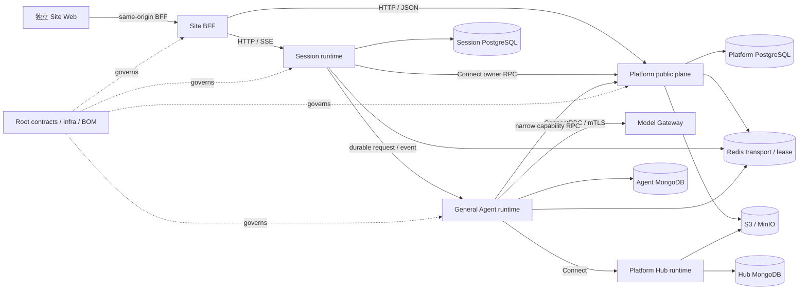
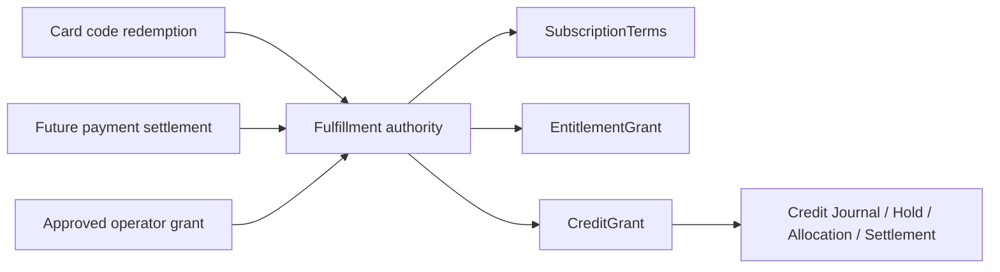

# Kokoro 联邦产品平台总架构

## 0. 文档地位

本文是 Kokoro 当前整体架构的唯一总入口，覆盖 Root、Platform、Session、Agent、Web 及其产品装配关系。
它取代 `20-kokoro-v1-technical-plan.md` 作为全局事实源。旧文档仍可用于理解具体能力的演进历史，但不得用来
推导当前仓库拓扑、数据存储、传输协议、业务 owner 或上线状态。

每项能力必须分别记录三条状态轴，禁止再用一个含糊的“完成百分比”混在一起：

- implementation maturity：`absent | planned | partial | implemented`；
- activation authorization：`not-applicable | denied | authorized`；
- launch readiness：`blocked | candidate | ready`。

本文其他位置的 `dormant` 是 `partial + denied + blocked` 的简写。测试通过只能证明某个实现满足已写出的约束，不能
自动获得 activation 或 launch readiness。升级必须同时满足 owner、业务链、真实基础设施、跨仓兼容、可观测、回滚和
发布证据。

## 1. 一句话架构

Kokoro 是一个由同一套后端能力支撑、但面向用户呈现为多个完全独立品牌站点的 AI 产品工厂：每个 Site 拥有独立
Web 项目与发布单元；Platform 拥有站点、身份、商业、模型、媒体、产物、记忆和能力中台等业务真相；Session 拥有
对话与浏览器实时投影；Agent 只负责通用智能编排；Root 负责跨仓契约、基础设施、兼容矩阵和经过验证的版本组合。



## 2. 仓库、部署与发布边界

四个 `kokoro-*` 目录永久保持独立 Git 仓库：

| 仓库 | 责任 | 发布与扩缩容 |
|---|---|---|
| Root | 跨仓 contract、Infra、兼容矩阵、BOM、gitlink pin、全局手册 | 只发布经过兼容验证的组合，不承载业务 runtime |
| `kokoro-platform` | 业务 owner 与后端运行 composition | 同仓模块化核心；API、worker、gateway、listener 可独立部署 |
| `kokoro-session` | Conversation、Message、Run、浏览器 snapshot/SSE/control 投影 | 独立 artifact、部署、回滚和存储 authority |
| `kokoro-agent` | LangGraph/DeepAgents 执行、工具、Skills/MCP 消费、checkpoint | Python 独立运行时；只消费 opaque `namespace` |
| `kokoro-web` | Site 项目工厂、品牌无关产品包、Site BFF、独立 Admin | 每个外部 Site 生成独立项目、artifact、CI、部署和回滚单元 |

Root 不复制子仓源码，不建立单根 lockfile，也不把四仓重组为一个发布单元。一次跨仓发布只能通过以下顺序完成：

```text
子仓独立验证与发布
  -> Root compatibility scenarios 使用候选 pin
  -> 生成并验证 BOM/evidence
  -> 原子更新四个 gitlink 与 federated manifest
  -> clean recursive clone 重放
  -> rollback rehearsal
  -> Root CI 绿后创建组合 tag
```

### 2.1 Platform 是模块化核心，不是分布式单体

Platform 内同一业务事务需要协作的 bounded contexts 使用本地 application interface 和一个
`PlatformUnitOfWork`。它们禁止为了“看起来微服务化”而 self-RPC，也禁止互相导入 repository、Prisma client 或表。

只有出现真实的进程、部署、信任或伸缩边界时，才暴露版本化远程协议。一个 Platform 仓库可以产出多个显式
composition，例如 public API、runtime API、worker、Admin listener、Model Gateway 和 Hub runtime。它们共享源码版本，
不自动共享数据库权限、凭据、listener 或部署生命周期。

未来拆仓的前提不是“模块很多”，而是某一 bounded context 已同时具备：稳定远程 contract、独立数据 ownership、
独立 SLO/伸缩需求、清晰 saga 和可单独回滚。拆分前继续保持本地调用，避免网络往返与伪分布式事务。

## 3. 身份与隔离轴

系统刻意保留不同层级的隔离轴，不把所有身份塞入 Agent：

| 轴 | Owner / 使用者 | 规则 |
|---|---|---|
| `siteId` | Platform 业务域 | 站点业务隔离；浏览器不得自报，必须由可信部署上下文解析 |
| Subject / membership | Platform Identity/Authorization | 用户、项目与授权事实；同邮箱跨 Site 默认是不同账户 |
| `namespace` | Agent runtime | 唯一 GA 隔离键；opaque、非空、无业务前缀，不附加 `userId/workspaceId/siteId` |
| `sessionId/runId` | Session | 对话与运行身份；不能替代 Site、Subject 或 Agent namespace |
| workload identity | 每个 deployable composition | 决定 caller、audience、最小数据库/RPC 权限，不能由普通 header 伪造 |

Site Web BFF 使用自身 workload binding 交换短期 `ProductContext/SiteContext`，再与站内 actor principal 组合为
`RequestSecurityContext`。Host 只用于路由，不能成为授权事实。缺少 Site、actor、audience、release 或 epoch 的受保护
请求全部 fail closed，不回退到默认 Site。

## 4. 远程协议与信任面

每个 operation 只有一个权威 transport contract：

| 边界 | 协议 | 原因 |
|---|---|---|
| Browser -> Site BFF | same-origin HTTP | CSRF、cookie、限流与浏览器错误语义由各 Site 自己承担 |
| Site BFF -> Platform public | OpenAPI 3.1 / HTTP JSON | 公共产品 API，可生成客户端和运行时校验 |
| Web -> Session | HTTP + SSE | 浏览器 snapshot、command、replay 和实时状态 |
| privileged/control plane | ConnectRPC / Protobuf / mTLS | 强 schema、跨语言生成、caller identity 和 breaking gate |
| Session -> Agent | durable async request/event | 断线、重试、lease、unknown outcome 与回放 |
| Agent -> Model Gateway | ConnectRPC / Protobuf / mTLS | 强类型调用、流式响应、caller identity 与 effect receipt |
| Agent -> Hub runtime | ConnectRPC / mTLS | 解析授权能力与流式拉取发布 artifact |

Model Gateway 到 LiteLLM 或其他 provider adapter 才使用 OpenAI-compatible HTTP；这是 Platform 内部 provider
适配边界，不是 Agent 到 Platform 的跨仓 contract。不得把 adapter 协议反向暴露成 Agent 的权威调用面。

tRPC 不作为跨仓标准：四仓没有共享 TypeScript 类型图，且 Agent 是 Python。它只可能在同仓、同发布单元、没有跨语言
消费者的局部 UI/BFF 场景通过单独 ADR 使用。

## 5. 业务 owner 地图

| 能力 | 唯一 owner | 明确不属于 |
|---|---|---|
| Product、Surface、CanonicalJourney 定义与发布生命周期 | Platform Product Catalog | Root schema、SiteRelease、Web unit、Commerce/Model 自定义字符串 |
| Site、Release、部署绑定、激活与回滚 | Platform Site | Web、Admin、Root |
| 注册、登录、凭据、安全设置、Subject generation | Platform Identity | Session、Agent |
| Workspace、Membership、Project、ExecutionSpace mapping | Platform Workspace | Agent namespace、Session、Web |
| 产品上下文、Session grant、授权 feed | Platform Authorization | Web cookie、Session 自定义 ACL |
| Plan/Offer/Fulfillment/Redemption/SubscriptionTerms/EntitlementGrant | Platform Commerce | Product Catalog、Payment provider adapter、Credit |
| Grant/Journal/Hold/Allocation/Usage/Rating | Platform Credit | Agent、Model、Payment |
| 全局模型目录、Provider binding、ModelOption、Site product policy | Platform Model Control | LiteLLM、Web、Agent 配置 |
| Provider invocation、fallback execution、usage/cost evidence | Platform Model Gateway | Model Control、Media、Agent |
| Skill/MCP 发布、审核、连接与 runtime 解析 | Platform Hub | Session、Agent 数据库 |
| 图片/音乐/视频业务执行 | Platform Media | 泛化 Generation、GA、Session |
| 生成产物身份、版本、lineage、delivery | Platform Artifact | Media、Session、对象存储 key |
| 上传输入及安全扫描 | Platform Asset | Artifact、Web upload state |
| Saved Memory | Platform Memory | Session history、Agent checkpoint |
| Explicit instructions、Project resource refs 与 execution defaults | Platform Project Context | Saved Memory、Session、Agent checkpoint |
| 输入/输出/工具/媒体权利的 Policy、Decision、Restriction、Appeal | Platform Trust | Provider safety label、Web 隐藏、Agent prompt |
| Notification preference、request、delivery receipt、suppression | Platform Notification | Identity/Commerce 自行发信、provider callback |
| Export/Delete/Retention/LegalHold plan 与 participant receipt | Platform Data Governance | 跨域 cascade delete、Support 手工删库 |
| SupportCase、case participant、evidence timeline、SLA/escalation | Platform Support | 万能业务 mutation、跨 Site 搜索 |
| Attribution、Experiment、Assignment、Exposure | Platform Growth | Entitlement、Authorization、业务 owner terminal |
| Conversation、Message、Run、branch、snapshot、SSE | Session | Platform、Agent checkpoint |
| 智能编排、tool call、handoff、checkpoint | Agent | 商业、Site、媒体长任务、记忆产品 owner |
| Web unit registry、物理 route/package/BFF/bootstrap mapping | Web Release Composition | Product/Surface catalog、Site policy、Entitlement |

Admin 与 Library 是产品/操作面，不是新的业务真相：Admin 只能调用上述 owner 的 typed command/query；Library 是
Project、Asset、Artifact、Media 等 owner facts 的用户投影。SEO/品牌/法务内容属于 Site Web artifact 与 Platform
SiteRelease 的签名 revision，不建立一个可以越过 Release 的动态 CMS owner。

### 5.1 不建立泛化 Generation 或 Job

`generation` 只是模型/operation capability 标签。图片、音乐、视频的用户可见长任务统一称为各自的
`MediaOperation`；Provider 原生 job 只保留为 Gateway 内部 effect ref；队列条目只叫所属 domain 的 `WorkerTask/Lease`。

Payment reconciliation、Memory purge、Asset scan、Media execution 等不能共享一个没有领域不变量的通用 Job aggregate。
它们共享可靠性模式和基础库，但保留各自状态机、receipt、重试判定、审计与 owner。

## 6. 多 Site 产品装配

每个 Site 对用户是完全独立的产品：独立域名、品牌、账户、cookie、Web 项目、发布、回滚和数据范围。共享后端只表示
复用同一套实现，不表示用户知道或感知多个 Site 属于同一平台。未来确有跨站账户需求时使用标准 OAuth/OIDC account
linking，不在数据库中默认共享账号。

产品装配先经过同一业务目录，再分发给各 owner，不能让 Site、套餐、模型与 Web 各自解释一个同名字符串：

```text
ProductSurfaceCatalogRevision（Platform Product Catalog）
  -> LaunchProductProfile（exact Catalog + enabled Surface/Journey closure；不引用 Inventory）
  -> SiteReleaseCandidate（Site/environment + exact owner-revision closure + business/model bindings + authorization epoch）
  -> complete SurfaceInventoryRevision（exact Candidate/Profile/Catalog partition；Platform Site compiler）
  -> Plan/Offer/Entitlement refs（Platform Commerce）
  -> ModelOption requirements（Platform Model Control）
  -> WebBuildIntent exact SurfaceInventory revision（Platform Site）
  -> WebCompositionRegistryRevision / physical closure（Web）
  -> immutable SiteRelease
```

Catalog revision 使用 `draft -> validating -> published -> retired`；published 后不可变，retired 不改写已发布 Release。
Root 只定义 schema、canonicalization 与 breaking gate。当前代码尚未建立该统一目录，因此这是首要架构迁移而不是已实现
事实。

### 6.1 SiteRelease 的 Root 合同基线与目标 runtime

Root 已硬切 unpublished v1 schema：Candidate、WebBuildIntent 与最终 immutable `SiteRelease` 携带同一份 exact
owner-revision closure。Site config、Legal、Sales、Assortment 与 Memory policy 都绑定 owner ref/revision/digest；Auth/Identity
直接绑定 issuer、authentication policy 与 authorization policy，不藏进 LaunchProfile；Commerce 显式关闭 Offer、
EntitlementTemplate、CreditProgram revisions；Hub 同时绑定 CapabilityAssignment、CapabilityCatalog 与 AgentCatalog。各闭包
都有 canonical digest，缺项、latest-only ref 或跨文档漂移均由 corpus fail closed。

控制 RPC 按 owner 拆开：Product Catalog boundary 只发布 Catalog/Profile；operator Site Publication boundary 只批准 Candidate、
Inventory、Material、Intent、Certification 与 immutable SiteRelease；machine Evidence Admission 只接收已签名 immutable evidence；Site Lifecycle 只负责 approval、ActivationAttempt
和 active-pointer CAS。`platform-site-provisioning@v1` 只保留 `RegisterSite`，不再是假发布 authority。以上四个新增/硬切
boundary 全部为 `contract-only`。联邦清单只登记未来的 `kokoro-platform` provider 与独立
`web.release-attestor` consumer 角色；这不代表 Platform provider implementation、Web generated runtime mirror、
admitted producer deployment 或 runtime migration 已存在。

Evidence Admission 的 workload context 绑定 command、registered workload、固定 audience/attestor producer role、
Site/environment/region、producer identity、producer-registration revision/digest 与 immutable workload-attestation
revision/digest。Platform 必须对照 authenticated transport axes，并重新验证 DSSE/provenance、
producer registration 与 artifact digest；CI/build/attestor workload 不能冒充 operator，也不能签发 Intent、Certification 或
SiteRelease。operator 对 Material/Intent/Certification 的 command 只批准或引用已验证不可变事实，不提供 artifact bytes、
credential、签名密钥或 producer identity。

`PublishSiteReleaseEffect` 只接受完整 Candidate ref/version/authorization epoch/digest binding 与 reason，未来 Site owner 生成 SiteRelease ref/digest 及所有
authority-bound facts。SiteRelease 不是可变的 current/candidate row；active pointer 是独立 generation aggregate。Lifecycle
approval 冻结 typed Candidate ref/version/authorization epoch/digest、target SiteRelease ref/revision/digest、expected pointer
generation、CAS command/fence/precondition digest，以及 begin/before-CAS/eligibility evidence refs。旧的
`candidate_release_ref` / `expected_active_release_ref` 只保留为 protobuf reserved name，不再是字段。

这是 unpublished R0a 的一次性 hard cut，不新增 Root V2、不提供 compatibility adapter。schema/protobuf exception registry 固定
exact predecessor/candidate digest；基线推进后门禁恢复完整 breaking compare，不能成为长期豁免。

R0b 进入 runtime 前，四个 `contract-only` boundary 必须分别完成以下 promotion checklist；任何一项都不能由 Root 合同声明替代。

#### `platform-product-catalog-publication@v1`

- runtime/provider：登记并部署唯一的 `kokoro-platform` Product Catalog/Profile provider。
- persistence：持久化 immutable Catalog/Profile revisions 与发布审计记录。
- authorization：只允许 Product Catalog owner 的 operator/admin command authority。
- CAS：此 boundary 不拥有 active-pointer CAS；测试必须证明无法调用 Site Lifecycle CAS。
- live evidence：保留 Profile 发布所读取 Catalog head 的 owner evidence。
- generated mirror：生成并验证 provider/consumer runtime mirrors。
- compatibility promotion：完整兼容性证据通过后才可从 `contract-only` 提升。

#### `platform-site-publication@v1`

- runtime/provider：登记并部署唯一的 `kokoro-platform` Site publication provider。
- persistence：持久化 Candidate、Inventory、Material、Intent、Certification 与 immutable SiteRelease revisions。
- authorization：operator approval 与 machine evidence 权限分离，并逐命令 fail closed。
- CAS：此 boundary 不切换 active pointer；验证其无法越权执行 Lifecycle CAS。
- live evidence：发布时重读 Candidate authorization 与 Certification/revocation authority。
- generated mirror：生成 Platform provider 与 Web release consumer mirrors。
- compatibility promotion：运行 schema/protobuf/corpus compatibility promotion 后解除 `contract-only`。

#### `platform-site-evidence-admission@v1`

- runtime/provider：登记 admission provider 与独立 `web.release-attestor` workload producer。
- persistence：持久化 immutable evidence revision、producer registration 与 admission receipt。
- authorization：以 server-verified workload authorization/revocation epochs、固定 audience 和 producer role 授权。
- CAS：不拥有发布或 pointer CAS；权限测试必须证明机器 caller 无法调用 operator/Lifecycle command。
- live evidence：在 authoritative `now` 内重读 workload authorization、revocation、producer/key policy 与 artifact digest。
- generated mirror：生成 attestor consumer 与 admission provider mirrors。
- compatibility promotion：以真实 admitted producer 的端到端证据完成 promotion。

#### `platform-site-lifecycle@v1`

- runtime/provider：登记并部署唯一的 Site Lifecycle/active-pointer provider。
- persistence：持久化 ActivationAttempt、双 authority snapshot、eligibility evidence 与 committed generation。
- authorization：只接受完整 Candidate/Release/CAS/evidence binding 的 operator approval。
- CAS：同一数据库事务按 authoritative `now` 重读 authority rows 并执行 generation compare-and-swap。
- live evidence：begin 与 immediate-before-CAS 两次 owner-signed reads 均须新鲜且不可复用。
- generated mirror：生成 Lifecycle provider/consumer mirrors 并验证 typed receipts。
- compatibility promotion：以并发、撤销、过期、replay 与 rollback 证据完成 promotion。

每个候选 Release 经过 compile、preview、contract/schema 校验、业务旅程验证和 certification 后才能激活。
激活使用可恢复 `ActivationAttempt` 与独立 active-pointer generation/CAS；开始时和 CAS 紧前必须分别读取新的 authority snapshot，
重验 Candidate authorization epoch、Certification revocation epoch、签名 key status 与证书 expiry，第二次撤销/过期
必须阻止 CAS。两个 snapshot 与 eligibility evidence 都是持久化合同，使用 exact JCS material digest，并冻结完整 active
producer registry/policy/key trust tuple。外部流量切换和数据库指针不是伪原子事务。回滚是对旧的
不可变 Release 发起新的 ActivationAttempt，而不是覆盖文件或破坏性逆迁移。

DSSE verifier 的 SPKI 与 current producer/policy epochs 只来自 Root trust-anchor registry，corpus vector 不能提供公钥。
每次 authority read 必须持久化六个 owner-signed live head receipt，并把 expected active-pointer generation 与 CAS
precondition 绑定到同一 ActivationAttempt digest。

### 6.2 Web Release Composition（target）

本节是待实现的目标，不是当前已闭环事实。当前 Web 仍只有 Memory 的部分物理裁剪；Chat、Account、Media 和 Site BFF
大部分能力仍被总是打包后再运行时 `notFound()`。

Web scaffold 不应为 Memory、Chat、Account 或某个 Studio 逐个写 `if (enabled)`。目标形态是一组版本化、封闭且可编译的
`WebCompositionUnit`。它只拥有物理 Web 装配映射，不成为 Product、Surface、Entitlement、Policy、Journey 或
SiteRelease 的业务 owner：

```text
compositionId / definitionRevision / kind = shell | surface | dependency
package artifacts + digests
routes and navigation contributions
BFF same-origin/downstream operation authority
bootstrap and opaque model-role requirements
dependencies on other composition units
```

Package 不等于 Product，也不等于 composition unit。一个 surface unit 可以需要多个 packages；asset/session client 这类
无独立入口的能力是 headless dependency；layout、auth callback、health、error boundary 等由 Launch Profile 声明为 shell。

正确生命周期不存在循环依赖：

```text
published Catalog -> Profile -> authorized SiteReleaseCandidate -> compiled complete SurfaceInventory
  -> Platform 签发 WebBuildIntent（exact candidate/profile/catalog/inventory/business/model refs；不选择 Web unit）
  -> Web compiler 从受信 registry 将完整 SurfaceInventory 派生为 WebCompositionUnit closure
  -> CompiledWebManifest（物理 route/package/BFF authority/bootstrap/model closure + digest）
  -> build Site web artifact（独立 artifact digest）
  -> provenance / scan / preview / journey evidence / certification
  -> Platform 发布最终 immutable SiteRelease
     （绑定完整 authority chain、WebBuildIntent、CompiledWebManifest、artifact、certification 与 bootstrap digests）
  -> deployment / ActivationAttempt
```

BFF authority 明确拆成同源 handler operation IDs 与 downstream operation IDs；两组在 registry 与 manifest 中各自唯一、
互不重叠。Model requirement 使用 opaque `modelRoleRef`，Candidate/Intent/Manifest 只携带 distinct ModelInventory 与
ModelCatalog digest bindings，不复制 provider 目录。

Compiler 输出 `CompiledWebManifest`，不能把它谎称为 Web artifact。产品定义不能携带任意代码路径、shell 命令、动态 npm
spec 或外部 URL。编译必须对 unknown composition、依赖环、route/nav 冲突、BFF operation 越界、缺 package artifact、
contract/model requirement 不满足和多余未引用输入 fail closed，并生成可验证 provenance。

未启用 surface 必须物理缺席：没有 package、route、navigation、BFF handler 或 bootstrap advertisement；Platform 最终
SiteRelease 也不得授权。运行时可用集合严格等于：

```text
CompiledWebManifest
  ∩ exact SiteRelease/composition digest
  ∩ current Site feature/policy
  ∩ actor scope
  ∩ entitlement/admission
```

Feature flag、entitlement 和 capability 可以关闭已编译能力，永远不能启用 artifact 中不存在的能力。BFF、ProductContext
和部署内嵌 manifest 必须验证相同 digest，防止 Web artifact 与 Platform release 混版。

Identity 基础页面和 health/readiness 可被 Launch Profile 声明为必需 platform shell；Chat、Memory、Library 及每个 Studio
都是可组合产品。General Chat 与 Studio 是同级产品体验，不把 Studio 做成 Chat 换皮。

## 7. 商业闭环

商业系统采用成熟的 acquisition -> fulfillment -> grant 分层：



- 卡密和支付不是两套套餐逻辑，只是不同 acquisition source；
- `FulfillmentService` 是 SubscriptionTerms、EntitlementGrant 和 CreditGrant 的唯一签发入口；
- Payment adapter 不直接写 Credit journal，Agent/Model/Media 也不能决定套餐与最终价格；
- Credit 使用 append-only Grant/Journal，执行前 Hold，执行中 child allocation，结果后 settle/release/reconcile；
- Site、Plan、Surface、ModelOption、Capability 和时间窗口共同决定 entitlement，不靠前端隐藏按钮；
- 当前正式上线采用 redeem-first，真实支付 provider、checkout、refund、dispute 和 recurring renewal 保持 feature-off；
  未来接入支付时复用相同 Fulfillment，不改变用户权益与扣费脊柱。

### 7.1 标准运营后台

Admin 是独立的运营产品和部署，不是任一 Site 用户站的隐藏路由，也不直连 Platform 数据库。它通过 Platform-owned
OIDC 建立 Operator session，并只调用生成的 Connect control clients。

- 每个操作必须显式声明 `GlobalScope|SiteScope`、permission、step-up freshness、reason 和审计对象；
- 高风险发布、卡密批次、Credit、Site 激活、模型策略和密钥相关命令使用 maker-checker；
- mutation 采用 command identity、canonical digest、expected version 和 durable receipt，unknown outcome 只做精确恢复；
- 资源列表可以复用 table/filter/pagination 组件，但业务 workflow 不能退化为万能 CRUD/resource proxy；
- Support 读取面与 Platform Operator 写面分离，Support 不能因为“方便排查”获得跨站修改权；
- Admin 展示的 readiness、worker、payment、media、memory 状态来自 owner 事实与证据，不由前端推断。

## 8. Model、LiteLLM 与多模态

模型数据只维护一份全局目录：LogicalModel、Provider、ProviderAccount、Binding 和 operation capability 不按 Site 复制。
Site 与套餐的差异通过发布的 ModelOption 和 product policy 表达。

```text
Global Model Catalog
  -> provider bindings / availability / routing pool
  -> ModelOption revisions
       Chat: ordered assistant route
       Image/Music/Video: ordered orchestration route + independent generation route
  -> SiteRelease product publication
  -> PlanModelGrant / entitlement
  -> runtime selection decision
```

General Chat 有默认主模型；Music/Image/Video 同时需要自己的 generation route 与用于理解意图、改写 prompt、解释结果的
assistant orchestration route。产品只拿到自己已发布的 ModelOption，不直接读取底层 provider list 或 secret。

LiteLLM 是 Model Gateway 内的 provider adapter，不是模型目录、业务 fallback、预算或价格真源。Fallback 必须由 Model
Control 的候选决策和 Gateway 的真实 availability/effect evidence驱动，不能由 LiteLLM 隐式改变产品承诺。

## 9. Chat、Session 与 Agent

### 9.1 Chat 主链

```text
Web 创建 standard/temporary Session
  -> Session 冻结 conversation 与 context policy，并保存 caller 选择的 opaque intent/ref
  -> Platform Admission 解析并校验 Site/Project/Agent/Model/Capability owner facts
  -> Platform Admission 冻结 owner snapshots，签发 owner-bound sealed RunRequest
  -> durable dispatch 到 Agent
  -> Agent 执行模型、Skills/MCP、工具与 handoff
  -> raw events 回到 Session
  -> Session 写 owner projection / snapshot / SSE
  -> Web 只渲染 typed parts 和可恢复 command state
```

Session 不自行解析、拥有或冻结 Platform owner facts，不执行 Agent；Agent 不写 Session message，Web 不直连 Agent。
Agent graph/checkpoint/terminal/handoff 语义保持稳定；业务能力通过预先审核的 agent preset、Skill/MCP 和窄 Platform
capability port 注入，而不是在 GA 中复制业务 owner。

Root 已冻结一个 strict AG-UI presentation profile，但它当前仍是 `contract-only`，不能据此宣称 Chat runtime 已迁移。
Session 是 durable presentation row、snapshot、repair、cursor 和 SSE projection 的唯一 owner；Web 最终只消费其严格 typed
presentation subset。Agent 只承担内部 event-candidate producer 角色，不是浏览器 endpoint、durable projection owner 或
cursor owner，也不得 raw passthrough。Root 把 Python `ag-ui-protocol@0.1.19` 的 Git repository、`sdks/python` subdirectory
与 commit 精确固定到 TypeScript `@ag-ui/core@0.0.57` 的同一 upstream commit；这只是未来 Agent adapter 的依赖与角色
合同，不代表 runtime 已实现。Agent candidate 比浏览器 subset 更窄：只允许 safe RUN、TEXT 和已登记 ACTIVITY，禁止
`CUSTOM`、Artifact/Cost owner activity、native tool wire、raw/provider payload、reasoning/thinking/state/delta。Session 接收
candidate 后仍须验证 closed envelope 的 Agent source/route refs、uint64 ordinal、canonical recorded time、JCS event digest
和 domain-separated candidate ref，再结合 owner facts 规范化、持久化并生成浏览器 presentation；envelope 不携带
Site/user/Session cursor/SSE 轴，Agent 也不能直接发送浏览器 wire。`RUN_FINISHED` candidate 必须显式声明 success；Session
验证后剥离 outcome，并通过 presentation binding 将内部 route refs 映射成浏览器 run/thread/message refs。Agent
`sourceOrdinal` 是每个 internal run 从零开始、按 owner log 严格递增的独立 uint64 序列，与 Session `durableSeq` 没有
相等关系；Session 可把 Agent `sourceEventRef` 保存为 provenance，但 durable sequence 必须自行分配。合同 corpus 的
`agentSourceFixtures` 按每个 run 的 owner-log 顺序排列并验证这一点。`internalThreadRef` 使用
`agent.thread:<opaque-id>` 品牌化 owner ref，由 ordinal-zero `RUN_STARTED` 为该 run 建立权威，后续 candidate 必须完全一致；
它不从 Session identity 派生。v1 candidate `RUN_STARTED` 禁止 `parentRunId`，浏览器
所见 parent run 只能由 Session 的 run-binding authority 派生，Agent 不能注入 presentation lineage。

Root 使用精确固定的 `EventType`/`EventSchemas` 验证上游词汇与事件 schema，再应用 Kokoro closed schema。HTTP snapshot
携带 Session 权威 durable-head `lastRecordedAt`：`durableSeq=0` 时必须为 null，非零时必须是 canonical UTC 毫秒时间且不早于
全部 snapshot binding 时间，后续事件不得倒退。零 head 不得携带 binding，binding evidence 数量不得超过 durable head；
全部 binding 时间必须 canonical、同一 snapshot 只能有一个 presentation thread、parent lineage 必须无环，M0 terminal 只允许
`finished/success` 或 `error/error`。Snapshot 的 binding source IDs 只用于播种 binding evidence；完整历史 source-event
唯一性仍由 Session 数据库保证。官方 stock client transport 会丢失或无法表达
Kokoro 必需的 SSE `id/event`、`Last-Event-ID`、opaque durable cursor、HTTP snapshot repair 和 non-durable draining 语义，
因此被明确禁用；未来 Session/Web adapter 必须保留这些字段并提交真实 provider/consumer compatibility evidence。
Root 的本地 promotion gate 在安装 Agent 精确 lock 后，会用官方 Python event model 与 Agent builder 重建 registry 声明的
全部 event arm 和 activity discriminator，并与 TypeScript gate 的 Root corpus 逐对象精确比较；registry 漏项、重复替代、
语义 role 漂移都会失败。这证明双 SDK/双实现 parity，但在 Agent gitlink、manifest、兼容性证据与 BOM 原子提升前仍不进入 CI，
也不等于 runtime activation。

### 9.2 Temporary Chat 与长期记忆

`standard|temporary` 是 Session 创建时冻结的不可变 context policy，不是 UI 偏好。Temporary Chat 必须同时满足：

- 历史列表与普通搜索不展示，但当前持有精确授权的客户端仍可读取当前会话；
- 不签发 Saved Memory、past-chat 或自动学习来源；
- 不把 draft、上传恢复或 command journal 长期写入跨会话浏览器存储；
- header 明示临时状态，不能在同一 Session 内切换；
- Site retention、Trust、abuse、legal hold 仍按冻结政策执行，不能承诺无条件即时物理删除。

长期记忆分三层，禁止混成一个 `memory`：

| 层 | Owner | 当前阶段 |
|---|---|---|
| Saved Memory（用户显式记住/修正/遗忘） | Platform Memory | M0 数据面落地中，默认 dormant |
| conversation history/search | Session | 历史已存在；可解释搜索与 Temporary 抑制待闭环 |
| Agent runtime context injection | Agent 通过窄 opaque MemoryPort | 未获 Agent 核心变更批准前保持 planned |

Saved Memory 的“遗忘”先产生不可逆逻辑撤销，再由 owner worker 完成物理 purge；任何 list/detail/history/restore 路径
都必须在数据库侧服从 generation/revocation fence，不能等缓存或 UI 自觉清理。

### 9.3 CLI、Desktop 与 IDE 客户端

未来类似 Claude Code 的客户端不是第二套 Agent，也不复制 Web 后端。它复用同一 Platform、Session、Agent、Model、Hub、
Credit 和 Artifact owner，只增加独立的 Client Access Plane：

```text
CLI / Desktop / IDE
  -> Site-scoped OAuth PKCE or device flow
  -> Session developer transport（snapshot + durable event stream + control）
  -> same Admission / Agent / Model / Credit path
```

本机文件、shell、浏览器或 IDE 动作属于一个显式 `ExecutionTarget`。Client 保存本机 consent 与短期 target credential；
Platform/Session 保存 target identity、permission revision、online state 和审计 ref；Agent 只看到 audience-bound opaque handle
与工具结果。高风险动作仍走 HITL，断线后不把旧批准复用于新 command。Workspace 同步、patch、terminal 输出和交付产物
使用版本化 refs，不把整个本机目录或长期 token 写入 Session/Agent prompt。

这样 General Chat、专业 Studio 和开发者客户端可以共享 Agent/Skill/MCP/Model 能力，同时保留完全不同的 UX、权限和
发布节奏。

## 10. Media、Artifact 与 Studio

Chat 和 Studio 共享一条后端执行脊柱，但保持不同交互：

```text
Chat -> Agent thin tool -----\
                             -> Platform Media command -> Gateway effect
Studio -> Site BFF ---------/                           -> Trust / Credit
                                                          -> ArtifactVersion
                                                          -> Session projection / Library
```

Agent 看起来“直接生成”，实际只决定何时调用窄工具并消费 opaque operation/artifact ref。Media owner 负责长任务、worker
lease、Provider callback、终态与恢复；Artifact owner 负责不可变版本和 delivery；Session 只投影 Chat 卡片；Studio/Library
通过 Platform public API 获取同一份 owner 真相。Chat 产物进入 Studio 不复制 bytes，只创建新的 draft/spec 或后续
operation。

Image、Music、Video 共享 operation/credit/artifact/recovery 机制，但各自拥有专业 Definition、参数与 UI；不能用一个万能
JSON 表单假装完成专业 Studio。

## 11. TypeScript/Python 工程规范

### 11.1 统一与允许的差异

- Web、Session、Platform 统一 Node 24 与 TypeScript 5.9.x；框架-facing Web 统一 Next 16.2.x、React 19.2.x；
- Web 与 Platform 使用 pnpm；Session 当前使用 npm，迁移必须独立成机械工具链变更，不与业务切片混合；
- Platform 的 Vitest 2 与 Web/Session Vitest 4 属于明确欠账，先建立 Root toolchain BOM，再单独升级；
- Agent 继续 Python 3.11。它是跨语言独立运行时，不为“版本数字整齐”迁到 TypeScript 或 Python 3.12；
- 每个子仓拥有自己的 lock、formatter、typecheck、test、CI 和 release，不建立跨仓隐式 workspace。

### 11.2 模块内部结构

Platform bounded context 使用：

```text
domain/           纯状态机、不变量、值对象
application/      use case、owner ports、UoW 编排
infrastructure/   PostgreSQL、S3、crypto、queue、provider adapters
interfaces/       HTTP / Connect / worker ingress
composition/      唯一允许选择真实 adapter 与进程角色的位置
index.ts          面向同仓消费者的窄公共入口
```

同一业务规则只允许一个 state machine。SQL routine 负责锁、RLS、CAS 与已验证 transition 的持久化，不能复制 TypeScript
领域决策；TypeScript 也不能绕过数据库 owner fence。跨模块只能依赖公开 application contract，禁止深导入实现。

Session 与 Web 分别保持类似的责任分离：

```text
Session: domain/projection -> application command/query -> transport -> persistence -> composition
Web:     view -> runtime hook/controller -> pure projection/reducer -> generated client/transport -> scoped recovery store
```

React component 不应同时承担大段视图、网络并发、owner-version reconciliation、浏览器存储和上传恢复。复杂度达到难以独立
证明时，按责任拆分，而不是以任意行数为目标拆文件。所有 async response 必须被 scope、generation/version、request
identity 三重 fence；切换 Site/Subject/Project 时先清除旧明文，再发新请求。

### 11.3 TypeScript 约束

- trust boundary 使用生成 schema + Zod/Protobuf validation；TypeScript 类型不能代替运行时校验；
- 业务状态使用 closed discriminated union，terminal 和错误 taxonomy 不接受自由字符串；
- owner ref/version/digest 在入口验证，禁止 `as` 把不可信对象伪装成 domain 类型；
- command 必须带稳定 identity、canonical request digest、expected version 和 receipt recovery；
- 时间、金额、Credit、版本和 cursor 不用浮点或宿主 locale 隐式比较；
- secrets、raw card codes、provider URLs、object keys 和 plaintext Memory 不进入 log、receipt 或公共 event；
- `AbortSignal`、timeout、bounded body/stream 和 backpressure 是远程调用的必需部分；
- 生成代码只由 Root contract generator 更新，消费仓不得手改。

## 12. 当前能力状态

当前没有任何“整个平台”级 surface 被本文标记为 launch-ready。Platform inventory 中除 Artifact Data Plane 外，多数
deployable 仍是 `activationAuthorized: false`；Session inventory 目前只声明 projection recovery worker；Web 的完整
Chat 类型与 Temporary Chat 链路仍待收口。Artifact Data Plane 的单进程授权也不能替整个 Artifact/Library 业务 surface
背书。

| Surface | Implementation | Activation | Launch readiness / 当前事实 |
|---|---|---|---|
| Federated repo / contract / infra / compatibility | partial | not-applicable | blocked：候选 pins、remote CI、兼容证据、clean clone、rollback 与组合 tag 尚未全部闭环 |
| Product Catalog / Site / Identity / Authorization / Admin | partial | denied | blocked：Product/Surface 仍无统一 revision，核心 deployables 未授权，Web Release Composition 未完成 |
| Redeem / Fulfillment / Entitlement / Credit | partial | denied | blocked：当前 redemption 只支持 permanent Credit pack；daily/period 三 bucket 必须继续 fail closed，production journey 未认证 |
| General Chat / branch / edit / regenerate / HITL / SSE | partial | denied | blocked：Session 主 runtime inventory、Web ContextPolicy/Temporary Chat、浏览器 E2E 与发布证据未闭环 |
| Skills / MCP Hub runtime | partial | denied | blocked：runtime 只有 Agent 消费；Hub deployable 未获 activation authorization，Session 不是 Hub consumer |
| Model Control / chat routing | partial | denied | blocked：Agent→Gateway 为 ConnectRPC；Gateway/LiteLLM、统一 Product Catalog ref 与 production activation 未闭环 |
| Media / Artifact / Studio / Library | partial | denied | blocked：部分 domain/vertical 与 Artifact Data Plane 已有，真实 provider/Trust/Credit/worker/产品旅程未闭环 |
| Saved Memory | partial | denied | blocked：owner data plane 仍在安全复审；无 Site activation、production classifier/keyring 前不得挂 public route |
| conversation search / Context Activity | planned | denied | blocked：归 Session 与后续 Agent narrow port，不混入 M0 CRUD |
| Workspace / Project / ExecutionSpace / Project Context | planned | denied | blocked：PRD 已定义 owner，但 Platform 尚无可发布 bounded contexts 与 personal-workspace bootstrap |
| Trust / Notification | planned | denied | blocked：登录验证、附件、模型和媒体 effect 不能依赖 fake adapter 或散落临时逻辑 |
| Support / Data Rights | planned | denied | blocked：最小 Case、导出/删除/retention participant 未实现；Admin 直改库不能代替 |
| Growth / Experiment / Attribution | planned | denied | blocked but not core-launching：在 redeem-chat profile 中必须连 route/event/cookie/secret 一起关闭 |
| Payment / refund / dispute / recurring renewal | partial | denied | blocked but feature-off：不阻塞 redeem-first，不能用 fake payment 取得 readiness |
| 每 Site 物理产品裁剪 | partial | denied | blocked：Memory 特判与 always-included 产品必须由 WebCompositionCompiler 取代 |

这张表描述的是当前上线可信度，不是代码文件数量。任何一项只有在其完整业务旅程通过后才能升级状态。

## 13. 上线与维护门

一个 Site 的上线候选必须满足：

1. WebBuildIntent、CompiledWebManifest 与 artifact provenance 可复现，未启用 surface 在 artifact 与后端授权面同时缺席；
2. Site workload、domain、release、contract floor、model/agent/capability/commerce refs 全部精确绑定；
3. 注册/登录、卡密兑换、权益、Credit、Chat 或启用的 Studio、Artifact delivery、Support/Data Rights 形成闭环；
4. command retry、unknown outcome、worker crash、SSE reconnect、provider timeout、credit reconciliation 有恢复证据；
5. 两个独立 Site 的跨站读取/写入/缓存/浏览器恢复攻击全部 fail closed；
6. 真实 PostgreSQL、MongoDB、Redis、MinIO 路径通过，测试结束只保留默认四项基础设施；
7. 子仓 CI、Root compatibility、clean clone、BOM、rollback rehearsal 和 release certification 全绿；
8. 日志、metrics、trace、audit、dashboard、alert 和 runbook 能定位 owner、Site、release、command 与 outcome；
9. feature-off 能力在 artifact route、release/bootstrap、BFF/API、owner/effect authorization 和该 Site 新 dispatch
   credential 五层都关闭；共享 worker 可继续 drain 旧 operation 或服务其他 Site；
10. 文档、OpenAPI/Proto、生成客户端、部署 inventory 与代码事实一致。

## 14. 收敛顺序

当前不再横向增加新服务或产品名，按依赖收敛：

```text
1. 修正事实源与 Web Release Composition 模型
2. 完成 immutable Temporary Chat 全链（Session + Web + retention/search suppression）
3. 完成 Saved Memory owner data plane，保持 feature-off
4. 建立 SiteRelease Memory activation 后再挂 public route
5. 完成 purge/import/export worker 与真实数据库/对象存储证据
6. 收口 ModelOption + Media image vertical + Artifact + Credit/Trust
7. 用同一 Media spine 扩展 Music/Video 专业 Studio
8. 统一工具链 BOM、全栈安全/性能/browser E2E、BOM promotion 与回滚
```

Agent 核心只在步骤需要改变 graph/checkpoint/terminal/handoff 或增加 MemoryPort 时暂停并与用户对齐。其余 Platform、
Session、Web 和 Root 治理面可以在上述架构内自主重构。

## 15. 文档与 Agent 协作治理

`CLAUDE.md` / `AGENTS.md` 只放稳定工作规则和最短阅读路由，不复制会快速过期的模块状态。进入仓库后的读取顺序固定为：

```text
CLAUDE.md / AGENTS.md
  -> docs/CURRENT.md
  -> docs/CODEBASE_MAP.md
  -> technical/24 + 与任务直接相关的 accepted ADR
  -> 子仓或模块 INDEX
  -> 源码与测试
```

- PRD 说明用户、旅程、状态、失败面和验收，不决定 repository/RPC/数据库 owner；
- ADR 冻结不可随实现自由改变的设计决策；
- technical/24 负责整体关系与当前状态，不复制每个模块的 SQL/函数细节；
- 子仓/模块 `INDEX.md` 只写当前代码事实、公共边界、非职责、恢复和验证；
- dated spec/plan 是设计与执行记录，完成或被推翻后必须从 `docs/CURRENT.md` 降级；
- `docs/task.md` 只保存当前 campaign、阻塞、候选 commit 与下一步，不继续累积历史流水账；
- Subagent 每次只写一个独立 repository/file tree，主控必须复审 diff 并在主仓重新验证，不能以 worker exit 代替完成。
