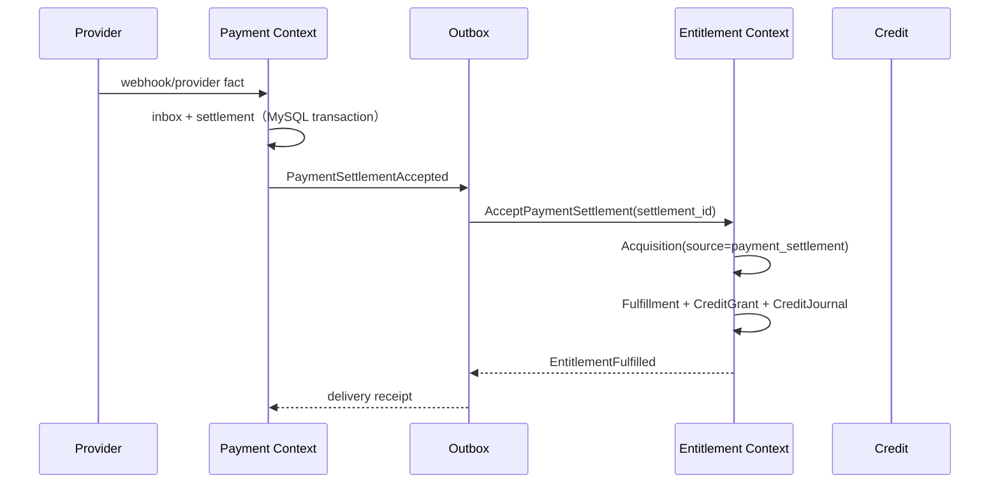
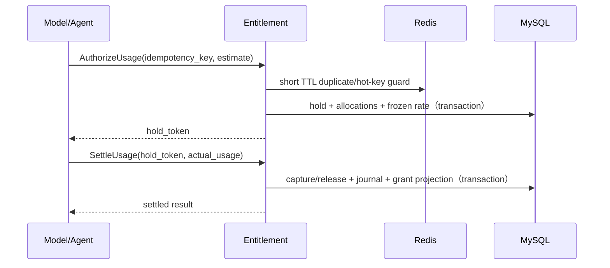

# Billing 事务矩阵 v1

> 状态：V1 实现基线。已实现命令必须与 `kokoro-billing/docs/API_CONTRACT.md`、`billing-sql-standard.md` 一起验证；未纳入
> V1 的扩展命令明确标注为 planned，不伪装成已实现能力。
>
> 本文将 PRD-03（Entitlement/Credit）与 PRD-04（Checkout/Payment）中的事务边界落到 MySQL 8.4。一个 `kokoro-billing` 子仓库内仍保持 Payment 与 Entitlement 两个 bounded context；跨上下文只通过稳定事实、应用端口和 outbox 协作。

## 1. 事务原则

1. MySQL 是最终业务事实；Redis 只做短 TTL 去重、热点读缓存和异步协调，不承载余额、支付成功、退款成功或幂等最终状态；通用限流由平台边缘层负责。
2. 每个 command 先写 `command_receipt`（或领域等价的幂等记录），相同 key + payload hash 返回第一次结果；payload 不同返回冲突。
   Hold/settle 使用领域唯一事实作为等价 receipt，并显式比较 account、金额、usage event 和 pricing 输入，避免同一 key/hold 静默接受变更参数。
3. Provider webhook 先写 `payment_provider_event` inbox，再处理业务；重复 webhook 不重复生成 settlement、fulfillment 或 reversal。
4. 每次跨边界动作写 outbox，同一数据库事务提交；消费者至少一次投递，业务端以 source fact 做幂等。
5. Credit 余额只能由 CreditJournal 驱动；`credit_account` 的 projection 可重建，不能作为唯一账本。
6. `RecordUsageEvent` 只是事实摄入；只有 `AuthorizeUsage`/`SettleUsage` 改变 hold、grant remaining 和 journal。

## 2. 命令矩阵

| Command | 锁定顺序 | 同事务写入 | 提交后动作 | 重试/对账 |
|---|---|---|---|---|
| `Redeem` | **planned V1 extension**：command receipt → code/campaign → account | redemption attempt、acquisition、fulfillment、entitlement grant、credit grant、journal、outbox | 发放结果事件 | 目标模型、卡密 hash、quota、状态机和 API 以 [46-billing-package-credit-redeem-architecture](46-billing-package-credit-redeem-architecture.md) 为准；实现前必须先完成该方案的 contract/schema/test 门禁 |
| `AcceptPaymentSettlement` | payment receipt → provider event/settlement | provider event 状态、settlement、payment outbox；调用 Entitlement application port 生成 acquisition/fulfillment | 发布 settlement accepted | settlement source 唯一；pending settlement 可重放 |
| `AcceptPaymentReversal` | payment receipt → settlement → reversal | reversal、payment outbox；调用 Entitlement reversal port | 发布 reversal accepted | reversal source 唯一；部分退款必须按 allocation 反向扣减 |
| `AuthorizeUsage` | command receipt → credit account → eligible grants | usage authorization、credit hold、hold allocation、冻结 price revision、outbox | 返回 hold token | 同一 authorization key 返回原 hold；未知状态进入 reconcile |
| `SettleUsage` | command receipt → hold → allocated grants → credit account | usage settlement、hold allocation capture/release、credit journal、grant remaining projection、outbox | 发布 usage settled | 不能重复扣账；usage event 必须绑定同一 tenant、subject 和 feature；未知 committed exposure 不自动释放 |
| `CreateCheckout` | `payment_checkout` idempotency row → offer revision | quote snapshot、checkout；hosted provider session 在事务外创建后回写 | 调用 provider adapter | `(site_id, idempotency_key)` 返回同一 checkout；quote hash 不同返回冲突 |
| `AcceptWebhook` | provider event inbox | 原始 payload、payload hash、签名验证结果、处理状态、`PaymentProviderEventReceived` outbox | enqueue settlement/reversal processing | provider event id + payload 唯一语义；重复事件 no-op |
| `RecordUsageEvent` | command receipt → usage event key | 原始 usage event、normalized dimensions、outbox | 投递 metering pipeline | event id + source 唯一；不直接扣 Credit |
| `ExpireUsageHolds` | expired hold → account → allocations | allocation release、hold expired、account projection、outbox | 周期 job 扫描过期 hold | Redis TTL 不作为账务释放依据；重复扫描 no-op |
| `ExpireCreditGrants` | expired grant → active allocation check → account → journal | grant expired、remaining 清零、expiry journal、account projection、outbox | 周期 job 扫描过期 grant | 有未完成 active hold allocation 时延后过期；重复扫描 no-op |

## 3. 关键跨上下文流程

### 3.1 支付购买积分

Payment 不直接插入 `entitlement_credit_grant`；Entitlement 不直接修改 `payment_settlement`。Admin refund 先在
`payment_command_receipt` 记录幂等命令，再写 `payment_reversal`，随后由独立的 entitlement reversal transaction
逆向未消费 grant。失败时按 source fact 重试，不用补偿 HTTP 猜测当前余额。

### 3.2 用量扣减

Redis 失效、淘汰或重启不能导致重复扣账；MySQL receipt、hold 和 journal 才是恢复依据。

## 4. 状态机约束

- Payment settlement：`pending → succeeded | failed | unknown`；`unknown` 保留 exposure，等待 provider 查询/人工对账。
- Fulfillment：`pending → fulfilled | failed | reversed | partially_reversed`。
- Credit hold：`active → captured | released | expired`；captured 金额不可重新释放。
- Command receipt：`processing → succeeded | failed | unknown`；当前 command 与业务 mutation 同事务，异常回滚不留下半笔 processing receipt；未来引入异步长 command 时才启用 lease/reconciler 接管。
- Provider event：`received → processed | ignored | failed`；原始 payload 不覆盖。

## 5. 必须验证的性质

- 同一个 purchase source 最多一个 fulfillment。
- 同一个 reversal source 最多一个 fulfillment reversal。
- 同一个 usage authorization 最多一个 active hold。
- 所有 journal entry 的 debit/credit 总额平衡，且引用真实 grant/account。
- 任何查询余额都能由 grant + journal + hold projection 重建。
- outbox 可重复投递，消费者不会产生第二笔业务事实。

## 6. V1 范围边界

当前 V1 闭环覆盖：套餐报价与 checkout、支付成功、provider webhook、订阅周期、退款逆向、Admin grant、
usage hold/capture/release、积分 journal、outbox、对账和旧 writer 切流门禁。

兑换码/活动码（Redeem）与争议/拒付（Dispute/Chargeback）需要独立的 code/campaign 与 provider dispute
事实模型，当前没有伪造一套接口或表来“占位完成”。它们保留在后续扩展清单；不影响 V1 已实现的支付、积分和
用量闭环验收。
