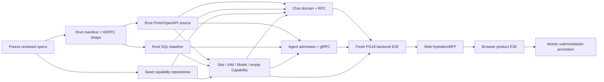

# SQL-backed Chat Slice A Master Phase Roadmap

> **Document type:** Reviewed phase roadmap, not direct `executing-plans` input. Before a lane starts, its next milestone MUST be expanded into a separately reviewed JIT implementation cut with exact files, actual RED test/code, self-contained commands and one precise commit; workers never invent omitted code from this roadmap.

**Goal:** Deliver the backend chain first—Site resolution → IAM login/AuthZ → Conversation → message → existing GA/LiteLLM → complete owner snapshot + watermark-tail SSE/HITL—with PostgreSQL as the only business truth; attach the existing Web only after that service chain passes without a browser.

**Architecture:** Root owns Protobuf/OpenAPI, the exact 50-table Slice A SQL baseline, the four pinned LangGraph checkpointer tables, owner inventory, generation and cross-repo E2E. Capability repositories own their transactions and write only their own table prefixes. Existing GA execution and Web reducer/state machine stay intact; only persistence, admission, RPC and hydration adapters change.

**Tech Stack:** PostgreSQL 18, SQL, Python 3.11+, psycopg 3, Prisma Client PostgreSQL, Node.js 22+, TypeScript 5, Protobuf, Buf, Connect RPC, grpcio, Redis Streams, LangGraph PostgreSQL checkpointer, Next.js 16, Vitest, pytest.

## Global Constraints

- One physical PostgreSQL 18 database, one `kokoro` schema, one deterministic Root baseline.
- Slice A installs exactly 50 owner business tables plus four pinned LangGraph checkpointer tables.
- Root is the only DDL/migration authority; child repositories never run `migrate`, `db push` or whole-schema `db pull`.
- Runtime uses one `kokoro_app` credential; ownership is enforced by repository boundaries, owner inventory and fail-closed tests, not per-service DB accounts or RLS.
- Cross-repository TypeScript calls use generated Protobuf + Connect RPC; Chat TypeScript → Agent Python uses the same Protobuf contract over gRPC-compatible transport.
- Browser calls Web/BFF with HTTP/OpenAPI/SSE; MCP remains an Agent tool protocol, not an internal service bus.
- Preserve current GA assembly/supervisor/HITL/checkpoint/control/tool-effect behavior and current Web reducer/SSE/machine behavior.
- Slice A is explicitly `usage_mode=unmetered`; it persists terminal run usage but creates no Credit hold.
- Capability resolves one explicit empty snapshot; no Skill/MCP item table or fake default capability is installed in Slice A.
- Model production selection uses the existing LiteLLM path; `direct` and `local` transports are test/local only.
- No MySQL/Mongo/PostgreSQL dual write. A capability flips only when its PostgreSQL adapter and product E2E are green, then its old adapter becomes zero-call.
- Every implementation task starts with a failing behavior/contract/catalog test and ends with a focused green gate plus a small commit.

---

## Plan Set and Ownership

| Plan | Repository ownership | Merge dependency |
|---|---|---|
| [`Contract barrier roadmap`](2026-08-14-slice-a-contract-manifest-barrier-roadmap.md) | Root toolchain, machine manifest, Proto/OpenAPI and consumer generation | Expanded through separately reviewed executable cuts |
| [`Authority-validation executable cut`](2026-08-14-slice-a-contract-authority-validation-implementation-plan.md) | Root installed machine manifest and fail-closed validator | Execute first; does not yet release consumers |
| [`Root database and contracts`](2026-08-14-slice-a-root-database-contracts-plan.md) | Root `contract/`, `database/`, Root generation/tests | First source commit; all consumers generate from its exact commit |
| [`Site/IAM/Model/Capability`](2026-08-14-slice-a-site-iam-model-capability-plan.md) | New `kokoro-site`, `kokoro-iam`, `kokoro-model`, `kokoro-capability` candidate repositories | Root SQL/Proto source commit |
| [`Chat PostgreSQL hard cut`](2026-08-14-slice-a-chat-postgres-plan.md) | New `kokoro-chat` candidate derived from `kokoro-session` | Root SQL/Proto + IAM/Agent contracts |
| [`Agent PostgreSQL and gRPC admission`](2026-08-14-slice-a-agent-postgres-grpc-plan.md) | Existing `kokoro-agent` | Root SQL/Proto + Capability/Model endpoints |
| [`Backend E2E, Web adapter and atomic promotion`](2026-08-14-slice-a-web-e2e-promotion-plan.md) | Root backend composition first; `kokoro-web` and Root promotion second | All backend candidate commits |

Only the plan owner edits its repository. Root pin, `.gitmodules`, release fixture and generated baseline changes are reserved for the final promotion plan.

## Stable Interfaces Between Plans

### Identity context

```proto
message PrincipalContext {
  string principal_id = 1;
  string site_id = 2;
  string organization_id = 3;
  repeated string permission_keys = 4;
}
```

IAM signs/validates browser sessions and returns this context. Chat receives it through a verified Connect interceptor. Agent admission receives only `(site_id, organization_id)` plus the opaque Conversation namespace needed to resolve Model and Capability; the GA execution core and frozen run payload receive none of the Principal/RBAC context.

### Exact Slice A service inventory

All request/response field numbers, enum values, errors, browser operations and SSE frames are frozen in
the machine authority [`../specs/2026-08-14-slice-a-contract-manifest.yaml`](../specs/2026-08-14-slice-a-contract-manifest.yaml); the adjacent
[`Markdown summary`](../specs/2026-08-14-slice-a-contract-manifest.md) is for review. The inventory below is the service-level summary, not a second source.

```proto
service SiteService {
  rpc ResolveSiteByHost(ResolveSiteByHostRequest) returns (ResolveSiteByHostResponse);
}

service IamAuthenticationService {
  rpc RequestMagicLink(RequestMagicLinkRequest) returns (RequestMagicLinkResponse);
  rpc ConsumeMagicLink(ConsumeMagicLinkRequest) returns (ConsumeMagicLinkResponse);
  rpc RefreshSession(RefreshSessionRequest) returns (RefreshSessionResponse);
  rpc Logout(LogoutRequest) returns (LogoutResponse);
  rpc GetSession(GetSessionRequest) returns (GetSessionResponse);
}

service IamAuthorizationService {
  rpc Authorize(AuthorizeRequest) returns (AuthorizeResponse);
}

service CapabilityRuntimeService {
  rpc ResolveRuntimeSnapshot(ResolveRuntimeSnapshotRequest) returns (ResolveRuntimeSnapshotResponse);
}

service ModelCatalogService {
  rpc ResolveModel(ResolveModelRequest) returns (ResolveModelResponse);
}
```

IAM also exposes exact HTTP `GET /.well-known/jwks.json`; it is public key material, not another business API. The Web BFF resolves request Host through `SiteService` before requesting a magic link. No Site admin, Hub, Billing, Storage or provider-invocation method is exposed in Slice A.

### Runtime endpoints and minimal workload identity

The Slice A fixture and release inventory use one stable internal registry:

| Process | Internal listener |
|---|---|
| Site | `http://site:7201` |
| IAM | `http://iam:7202` |
| Model | `http://model:7203` |
| Capability | `http://capability:7204` |
| Chat | `http://chat:7205` (Connect/gRPC, including generated server-streaming events RPC) |
| Agent | `http://agent:7206` (gRPC) |
| LiteLLM | `http://litellm:4000` |
| User Web, optional after backend gate | `http://user-web:3000` |

TS services expose exact `GET /healthz` and `GET /readyz` on their service listener; Agent exposes standard gRPC health on 7206. Slice A does not add a second business listener.

Workload authentication is deliberately small and explicit: Root mounts three random secret files, one each for Web, Chat and Agent. Generated clients send `authorization: Bearer <file-content>`; servers compare the expected caller token in constant time before decoding a business request. The exact method map is Web → Site, IAM Authentication and Chat; Chat → IAM Authorization and Agent; Agent → Model and Capability; IAM JWKS is public. A token valid for one caller is rejected on every other method, including Chat token on IAM Authentication and Web token on IAM Authorization. Chat additionally verifies the IAM-signed user access JWT against IAM JWKS and derives `PrincipalContext` from it—identity fields in request bodies are ignored/rejected. Root E2E uses the Web workload token plus a real IAM-issued user token. No token value appears in SQL, browser storage, image, logs or Git.

The stable permission catalog is exactly:

```text
chat.conversation.create
chat.conversation.list
chat.conversation.read
chat.message.submit
chat.interaction.decide
```

IAM startup idempotently seeds those five keys. Personal-organization creation creates organization role `personal_owner`, binds all five permissions and assigns it to the owner membership in the same transaction. Chat maps each RPC to one exact permission key and denies missing/disabled membership or permission.

### Chat owner commands

```proto
service ChatCommandService {
  rpc CreateConversation(CreateConversationRequest) returns (CreateConversationResponse);
  rpc SubmitMessage(SubmitMessageRequest) returns (SubmitMessageResponse);
  rpc DecideInteraction(DecideInteractionRequest) returns (DecideInteractionResponse);
}

service ChatQueryService {
  rpc ReadConversationSnapshot(ReadConversationSnapshotRequest) returns (ReadConversationSnapshotResponse);
  rpc ListConversations(ListConversationsRequest) returns (ListConversationsResponse);
  rpc StreamConversationEvents(StreamConversationEventsRequest) returns (stream StreamConversationEventsResponse);
}
```

All mutating requests carry `command_id` and `request_digest`; receipt scope is `(organization_id, command_id)`.

### Agent admission

```proto
service AgentRuntimeService {
  rpc LaunchRun(LaunchRunRequest) returns (LaunchRunResponse);
  rpc ApplyControl(ApplyControlRequest) returns (ApplyControlResponse);
  rpc ReadRunEvidence(ReadRunEvidenceRequest) returns (ReadRunEvidenceResponse);
  rpc AckProjection(AckProjectionRequest) returns (AckProjectionResponse);
}
```

`LaunchRunRequest` carries `launch_id`, launch request digest, `message_id`, immutable user `content`, opaque `namespace`, `session_id`, `thread_id`, `site_id`, `organization_id`, requested Agent preset key and requested Model/Capability selectors. Chat maps `session_id = thread_id = conversation_id`; Agent generates `run_id`. Agent resolves the code-owned preset and freezes its digest in the execution manifest. Admission requests are scoped by Site/organization; Capability echoes organization for binding and Model's selected policy is FK-bound to the requested Site. The dispatcher strips both axes before constructing the existing `RunRequest`, whose GA scope remains exactly `(namespace, session_id, run_id, thread_id)`. It carries the frozen input and runtime config, but no principal, membership, role, permission, plan or payment object.

A deterministic admission rejection returns `ADMISSION_FAILED` without a manifest or Agent event outbox. Chat converges that response in one transaction: mark RunLaunch and the assistant placeholder failed, delete the active-run slot and append exactly one synthetic browser `run.failed` with code `agent_admission_rejected`. Same response replay is exact; digest drift conflicts; restart cannot leave a permanently active Conversation.

### Snapshot and tail

```proto
message ReadConversationSnapshotResponse {
  Conversation conversation = 1;
  repeated Message messages = 2;
  RunView active_run = 3;
  repeated Interaction pending_interactions = 4;
  uint64 watermark = 5;
}
```

Chat reads this response in one repeatable-read transaction. Web hydrates the existing reducer from it, then opens SSE with `after_seq=watermark`. Expired pre-watermark stream rows must not affect historical reconstruction.

## Backend-first delivery order

The first acceptance milestone is a **browser-independent backend closure**. It calls the real Site, IAM, Chat, Agent, Capability and Model service endpoints, exercises the existing GA/LiteLLM path, persists and replays HITL, restarts Chat and Agent, and reconstructs the complete conversation from PostgreSQL. Web work is not allowed to hide or block a backend failure; it starts only after that gate is green.

With four active implementation lanes, the aggressive target is backend closure in 4–6 active development days (P80: 8). Rebinding the already mature Web BFF/reducer is a later 0.5–1 day adapter step. A 2–3 day run is an integration spike only, never completion evidence.

## Parallel Execution Graph



Maximum concurrency is four active lanes:

1. Root database/contracts.
2. Site/IAM/Model/Capability candidates.
3. Chat candidate.
4. Agent candidate.

The manifest and exact RPC/message shape are the only short shared barrier. Root then continues SQL/catalog work while the other three lanes port domain tests and implement contract-facing code. Their PostgreSQL integration steps wait for the committed baseline, not their entire repository implementation. The backend E2E begins as soon as Site/IAM/Model/Capability, Chat and Agent candidates are frozen. Web begins only after the backend E2E is green. Atomic promotion begins only after the backend and browser gates are both green and all child commits are frozen and clean.

Storage, Entitlement/Commerce/Payment and full Skill/MCP are separate capability lanes, not hidden modules inside Slice A services. Their reviewed target tables remain in the canonical model and may start whenever a lane becomes free, but none may change the 50+4 Slice A baseline or delay its first backend closure. This is scheduling isolation, not architectural coupling.

### Milestone 1: Freeze the reviewed design source

**Files:**
- Add: `docs/reports/2026-08-13-sql-first-capability-audit.md`
- Add: `docs/superpowers/specs/2026-08-13-kokoro-canonical-data-model-design.md`
- Add: `docs/superpowers/specs/2026-08-13-sql-first-capability-architecture-design.md`
- Add: `docs/superpowers/specs/2026-08-14-slice-a-contract-manifest.md`
- Add: `docs/superpowers/specs/2026-08-14-slice-a-contract-manifest.yaml`
- Add: this roadmap, its five child roadmaps, the contract-barrier roadmap and the first executable authority-validation cut

**Interfaces:**
- Consumes: independent architecture review with P0/P1/P2 all zero.
- Produces: immutable design commit used by every implementation review.

**JIT cut requirement 1 — Verify the design artifacts are the only Root changes**

Run:

```bash
git status --short
```

Expected: only the audit, four specs and eight plan files are untracked (thirteen paths total).

**JIT cut requirement 2 — Run document integrity checks**

Run:

```bash
python3 - <<'PY'
from pathlib import Path
import re

files = [
    Path("docs/reports/2026-08-13-sql-first-capability-audit.md"),
    Path("docs/superpowers/specs/2026-08-13-kokoro-canonical-data-model-design.md"),
    Path("docs/superpowers/specs/2026-08-13-sql-first-capability-architecture-design.md"),
    Path("docs/superpowers/specs/2026-08-14-slice-a-contract-manifest.md"),
    Path("docs/superpowers/specs/2026-08-14-slice-a-contract-manifest.yaml"),
    *sorted(Path("docs/superpowers/plans").glob("2026-08-14-*.md")),
]
for path in files:
    for target in re.findall(r"\[[^]]+\]\(([^)#]+)", path.read_text()):
        assert (path.parent / target).resolve().exists(), (path, target)
print("design_links_ok")
PY

```

Expected: `design_links_ok`. Whitespace is checked after staging with `git diff --cached --check`; `git diff --no-index` is intentionally not used because it returns 1 for any new non-empty file.

**JIT cut requirement 3 — Commit only reviewed design and plans**

```bash
git add -- \
  docs/reports/2026-08-13-sql-first-capability-audit.md \
  docs/superpowers/specs/2026-08-13-kokoro-canonical-data-model-design.md \
  docs/superpowers/specs/2026-08-13-sql-first-capability-architecture-design.md \
  docs/superpowers/specs/2026-08-14-slice-a-contract-manifest.md \
  docs/superpowers/specs/2026-08-14-slice-a-contract-manifest.yaml \
  docs/superpowers/plans/2026-08-14-*.md
git diff --cached --check
git commit -m "docs: define SQL-first capability architecture"
```

### Milestone 2: Prepare clean candidate repositories without changing Root pins

**Files:**
- Create candidate Git repositories outside the Root checkout: `kokoro-iam`, `kokoro-site`, `kokoro-chat`, `kokoro-model`, `kokoro-capability`.
- Do not modify: `.gitmodules`, Root submodule pins, production compose/Kubernetes/BOM.

**Interfaces:**
- Consumes: current `kokoro-platform` and `kokoro-session` Git history.
- Produces: independent clean Git roots for the four parallel implementation lanes.

**JIT cut requirement 1 — Verify repository creation credentials and source cleanliness**

```bash
gh auth status
git -C kokoro-platform status --short
git -C kokoro-session status --short
```

Expected: GitHub authentication succeeds and both source repositories are clean.

**JIT cut requirement 2 — Create history-preserving seed commits in a temporary directory**

```bash
rm -rf /tmp/kokoro-slice-a-seeds
mkdir -p /tmp/kokoro-slice-a-seeds

git -C kokoro-platform subtree split --prefix=kokoro-user -b slice-a-iam-seed
git -C kokoro-platform subtree split --prefix=kokoro-site -b slice-a-site-seed
git -C kokoro-platform subtree split --prefix=kokoro-model -b slice-a-model-seed
git -C kokoro-platform subtree split --prefix=kokoro-hub -b slice-a-capability-seed
git -C kokoro-session branch slice-a-chat-seed HEAD
```

Expected: five local seed branches resolve to commits.

**JIT cut requirement 3 — Create or verify private target repositories and push seeds**

```bash
gh auth status
gh auth setup-git
for repo in kokoro-iam kokoro-site kokoro-model kokoro-capability kokoro-chat; do
  if gh repo view "LordFoxFairy/$repo" --json owner,visibility,defaultBranchRef >/tmp/"$repo".json 2>/dev/null; then
    test "$(jq -r .owner.login /tmp/"$repo".json)" = "LordFoxFairy"
    test "$(jq -r .visibility /tmp/"$repo".json)" = "PRIVATE"
    test "$(jq -r '.defaultBranchRef.name // ""' /tmp/"$repo".json)" = ""
  else
    gh repo create "LordFoxFairy/$repo" --private --disable-issues --disable-wiki
  fi
done

git -C kokoro-platform push https://github.com/LordFoxFairy/kokoro-iam.git slice-a-iam-seed:main
git -C kokoro-platform push https://github.com/LordFoxFairy/kokoro-site.git slice-a-site-seed:main
git -C kokoro-platform push https://github.com/LordFoxFairy/kokoro-model.git slice-a-model-seed:main
git -C kokoro-platform push https://github.com/LordFoxFairy/kokoro-capability.git slice-a-capability-seed:main
git -C kokoro-session push https://github.com/LordFoxFairy/kokoro-chat.git slice-a-chat-seed:main
```

After each push, fetch `refs/heads/main`, compare it with the exact local seed commit and re-query owner/visibility. Expected: every private repository is owned by `LordFoxFairy`, had no default history before its first seed, and remote `main` equals the matching seed commit. Any pre-existing branch or unrelated object history stops the cut before push; do not force-push or repurpose a repository.

**JIT cut requirement 4 — Clone independent candidate worktrees**

```bash
for repo in kokoro-iam kokoro-site kokoro-model kokoro-capability kokoro-chat; do
  rm -rf "/tmp/$repo-slice-a"
  git clone "https://github.com/LordFoxFairy/$repo.git" "/tmp/$repo-slice-a"
done

git -C kokoro-agent worktree add -b codex/slice-a-postgres /tmp/kokoro-agent-slice-a 18b394dc3df019244875e643c142c2b08b9db708
git -C kokoro-web worktree add -b codex/slice-a-web /tmp/kokoro-web-slice-a f3936befb7ae4c219273ae9b7f4efb97cb6a1425
(cd /tmp/kokoro-chat-slice-a && npm ci)
(cd /tmp/kokoro-agent-slice-a && uv sync --frozen)
(cd /tmp/kokoro-web-slice-a && pnpm install --frozen-lockfile)
```

Expected: seven clean independent Git roots. Implementation plans use these roots until final promotion; canonical Root submodule checkouts remain untouched.

### Milestone 3: Execute the four implementation lanes

**Files:** Defined in the five child plans.

**Interfaces:**
- Consumes: frozen Root source commit and clean candidate repositories.
- Produces: frozen commits for Root source, Site, IAM, Model, Capability, Chat and Agent, followed by Web only after the backend closure gate.

**JIT cut requirement 1 — Execute the authority cut, then complete the reviewed contract barrier**

Execute `2026-08-14-slice-a-contract-authority-validation-implementation-plan.md` first. Then expand the renderer and consumer-generation milestones in `2026-08-14-slice-a-contract-manifest-barrier-roadmap.md` into separately reviewed executable cuts. Only after Proto/OpenAPI, first breaking image, generation and full contract gates form the clean contract-source commit may consumers generate or the child backend lanes start. Continue the Root database roadmap's SQL milestones after that barrier while the three child lanes begin domain/contract work. Record separately the exact Root contract-source commit and the later exact baseline/catalog commit; generated provenance always references the contract-source commit.

**JIT cut requirement 2 — Generate Root E2E and every child consumer from that exact Root commit**

First create the barrier roadmap's separate Root descendant-output commit for `root-e2e`; it stages only declared `scripts/e2e/generated/**` outputs and provenance, while retaining the earlier contract-source SHA as `sourceRootCommit`. In parallel, use the same Root generator with explicit clean child repository paths. Every generated manifest must contain the same contract-source commit and source-tree digest. Backend E2E and any `--check --all` gate start only after the Root E2E output commit exists.

**JIT cut requirement 3 — Run Site/IAM/Model/Capability, Chat and Agent plans in parallel**

Each lane begins from its seed commit, writes only its candidate repository and requests independent review before commit promotion.

**JIT cut requirement 4 — Run the browser-independent backend E2E after child APIs freeze**

Use the backend profile from `2026-08-14-slice-a-web-e2e-promotion-plan.md`. Do not start User Web. The gate must prove Site resolution, magic-link request/consume, personal organization and permission bootstrap, Conversation creation, Submit, Agent admission, deterministic LiteLLM, event projection, HITL control, process restart, retention, stale-cursor recovery and complete snapshot readback through service APIs.

**JIT cut requirement 5 — Run the Web adapter tasks only after the backend gate is green**

Web consumes generated clients and changes only BFF/hydration adapters; it does not reimplement owner logic.

### Milestone 4: Prove Slice A and atomically promote

**Files:** Defined in the Web/E2E/promotion plan.

**Interfaces:**
- Consumes: all clean child candidate commits.
- Produces: one Root promotion commit containing exact submodule paths/pins, generated baseline manifest, integration fixture and current maps.

**JIT cut requirement 1 — Apply the committed Slice A baseline to two fresh PostgreSQL 18 databases**

Expected catalog digest and owner inventory must match byte-for-byte.

**JIT cut requirement 2 — Run the real backend chain twice with a process restart between reads**

Expected chain:

```text
ResolveSite → Request/ConsumeMagicLink → Authorize
→ CreateConversation → SubmitMessage
→ Agent admission → existing LiteLLM/local deterministic fixture
→ Chat projection → complete snapshot + SSE tail → HITL decision through Chat RPC
→ expire old stream rows → restart → complete snapshot reconstructs history
```

**JIT cut requirement 3 — Attach Web and repeat the user-visible chain**

The browser gate starts a fresh backend composition from the same reviewed candidate commits, repeats the already-green backend assertions, then adds User Web. It may verify BFF/session sealing, reducer hydration and user interaction, but it must not substitute mocks for an owner service or infer success from the earlier backend process lifetime.

**JIT cut requirement 4 — Prove zero-call old truths**

Mongo/MySQL clients for the migrated Slice A capability set must not be constructed, called, deployed or required by environment inventory.

**JIT cut requirement 5 — Run full gates and independent review**

Run Root database/contract/E2E tests plus each child repository's full lint/typecheck/test/build gate. Any red gate blocks pin promotion.

**JIT cut requirement 6 — Update Root pins in one commit**

The exact commands and file set are specified in `2026-08-14-slice-a-web-e2e-promotion-plan.md`. Do not advance a child pin separately.

## Stop Conditions

- Do not promote a repository with uncommitted generated output or a provenance source commit different from the frozen Root contract commit.
- Do not replace a failing cross-repository call with a direct database write, self-HTTP compatibility route or shared TypeScript business interface.
- Do not shrink the reviewed 50+4 Slice A manifest to make a test green; fix the implementation or revise the reviewed design through a new design review.
- Do not install Slice B/C tables, secrets, workers or routes in Slice A.
- Do not call the Day 2–3 integration spike complete until fresh DB, restart, retention and zero-call gates pass.
