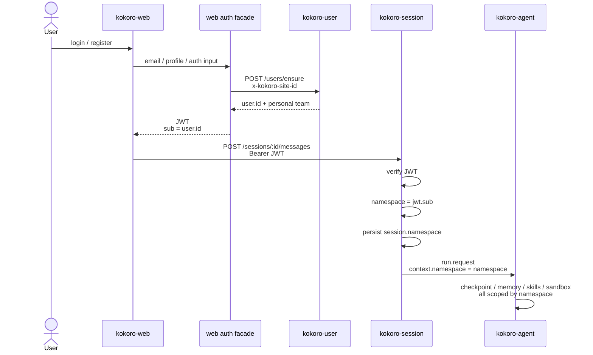
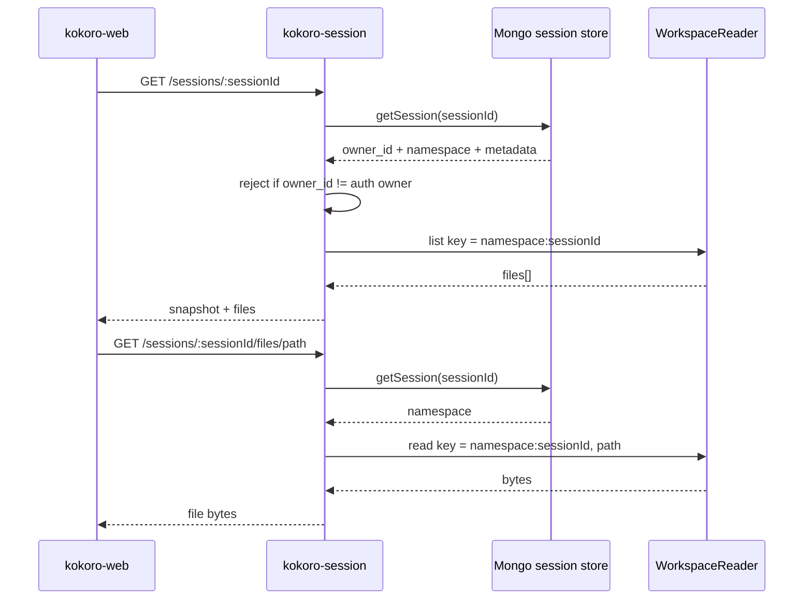
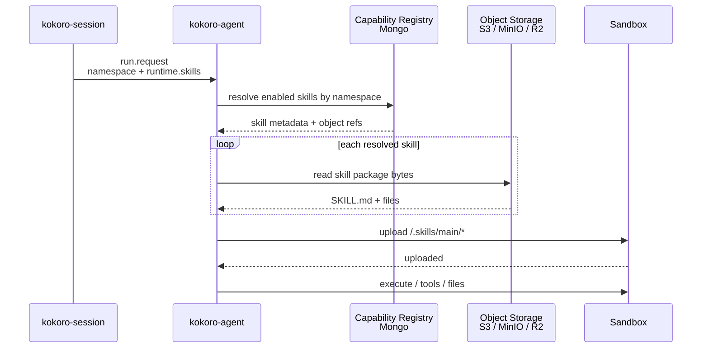
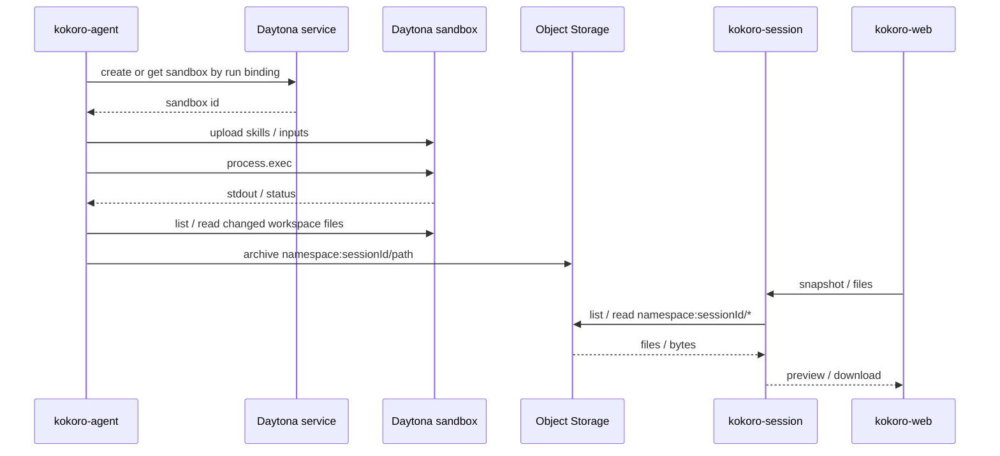
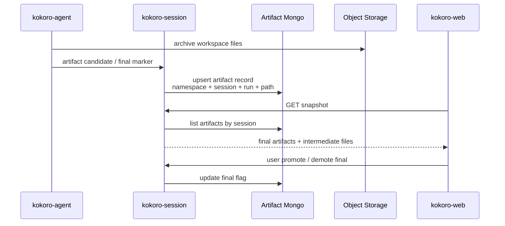

# Kokoro 能力中台、namespace、登录与沙箱技术方案

状态：方案打磨稿，待用户审阅
日期：2026-07-07
范围：kokoro-web / kokoro-session / kokoro-agent，platform 暂不直接改；后续可在 platform 下新增能力子仓库。

## 0. 先纠偏

这份方案的核心修正是：

```text
GA 侧只认 namespace。
```

`ownerId`、`userId`、邮箱、外部 OAuth subject、team membership 都是 web / session / platform 的上游身份语义。它们可以用来鉴权、裁权、签 token、查用户，但不能作为第二条身份轴进入 GA。

对 GA 来说，`namespace` 就是一个独立空间的唯一隔离键。个人空间可以直接使用 kokoro-user 的 `User.id` 作为 namespace；未来团队空间也可以使用某个 team/workspace namespace id。GA 不需要知道这是用户、团队还是别的空间。

明确禁止：

```text
禁止把 ownerId 包装成带业务前缀的 namespace。
禁止在 GA 契约里再加 userId / ownerId / workspaceId 来辅助隔离。
禁止让 session 的实例级 KOKORO_NAMESPACE 继续充当多用户运行时 namespace。
禁止 skill-hub 和 mcp-hub 两仓各写一套 namespace / registry / 启用态骨架。
禁止把外部参考项目的路径、分支名、命名、代码、文案带进正式方案或正式代码；来源信息只能放在 tmp 中间产物里。
```

## 1. 目标闭环

北极星闭环：

```text
用户登录 / 注册
  -> kokoro-user 确认用户身份
  -> web 拿到可给 session 验签的 JWT
  -> session 从 JWT 得到 namespace
  -> session 按 namespace 创建会话、工作区 key、run.request
  -> GA 只用 namespace 隔离 checkpoint / memory / skills / sandbox
  -> 产物按 namespace + session 归档
  -> web 展示会话、文件、最终产物
```

第一阶段先做到个人 namespace。团队 namespace 以后通过 session/web 选择空间并由 kokoro-user 校验 membership，但 GA 仍然不变。

## 2. 架构判断

### 2.1 namespace 是单轴隔离键

身份与 namespace 的关系：

```text
kokoro-user User.id
  -> 个人 namespace id
  -> JWT sub
  -> kokoro-session auth result
  -> run.request.context.namespace
  -> kokoro-agent RunScope.namespace
```

这里的箭头不是说 GA 理解 user，而是说上游选择把哪个空间 id 签给 session。GA 只消费最终的 namespace 字符串。

当前代码已有 `RunRequest.context.namespace`，所以第一阶段不是从零加字段，而是修正 namespace 的来源、持久化和使用点：

- session 现在主要用实例级 `KOKORO_NAMESPACE`。
- workspace 文件读取也用实例级 namespace 拼 key。
- profile 解析在启动期绑定单个 namespace，不适合真实用户动态 namespace。

这三处需要改成按请求/session 解析。

### 2.2 kokoro-user 会被接进闭环，但先不改 platform

当前 kokoro-user 已经有：

- `POST /users/ensure`
- `GET /me/teams`
- site header 上下文
- MySQL + Prisma 的真实用户、团队、成员关系

当前缺的是面向消费者的完整登录签发面。为了不先改 platform，第一阶段建议在 kokoro-web 增加一个极薄的 auth facade：

```text
kokoro-web /api/auth/*
  -> 调 kokoro-user /users/ensure
  -> 使用服务端 secret 签 session 可验的 JWT
  -> JWT sub = kokoro-user 返回的 User.id
```

这样 web 能闭环登录和 token 管道，session 能继续只验 HS256 JWT。等 platform 正式提供消费者 auth 后，替换 auth facade 的实现即可，session 和 GA 不需要改。

### 2.3 hub 仓结构采用一仓分模块

决策 A 收敛为：

```text
一个 capability hub 边界，内部按 kind 分 skill / mcp / subagent。
```

后续如果落 platform 子仓，建议叫 `kokoro-capability` 或 `kokoro-agent-capability`，不要拆成 `skill-hub` 和 `mcp-hub` 两个服务本体。原因是 registry 骨架天然共享：

- namespace 归属
- 启用态
- 官方/自定义/共享 grant
- 版本
- 审核状态
- 配额
- 管理后台 CRUD
- resolve 读模型

skill 和 mcp 的差别在交付方式：

```text
skill    文件包，agent 读对象存储后上传进沙箱。
mcp      活连接，agent 运行时建连接并注入授权，不进沙箱文件面。
subagent 定义，agent 编译 graph 时装配。
```

所以它们应该共享 registry，不应该共享 delivery。

## 3. 关键时序

### 3.1 登录到 GA run



重点：

- JWT `sub` 在这个闭环中就是 namespace id。
- session 可以继续把 `owner_id` 用作属主裁权字段，但这是 session 自己的 HTTP 权限语义。
- GA 不接收 owner/user 字段。

### 3.2 会话与 workspace 文件读取



重点：

- 文件 key 不能再用部署实例的 `KOKORO_NAMESPACE`。
- session 必须持久化 `namespace`，否则刷新后不知道该从哪个 workspace 前缀读文件。
- snapshot 可以不把 namespace 暴露给 web；web 只需要文件清单和鉴权后的 file endpoint。

### 3.3 capability resolve 与 skill 进沙箱



重点：

- 沙箱不拿 Mongo/S3 凭据。
- resolve 失败降级：某个 skill 读不到就跳过并记录，不中断整个 run。
- `skills/provision.py` / `skills/supply.py` 交付链尽量不动，改资产来源和 package 表达即可。

### 3.4 Daytona 自托管沙箱与归档



重点：

- local/docker 现在靠 `ArchivingWritesMixin` 从宿主目录归档。
- e2b/daytona 这类远程沙箱没有宿主目录，需要单独补“远程文件拉出并归档”路径。
- 为了整体自闭环，推荐 dev 直接以 Daytona compose 为主，E2B Cloud 只保留为可选验证后端。

### 3.5 最终产物模型



推荐方案：

```text
agent 显式标记为主，web 用户覆盖为辅，目录约定只做启发式。
```

原因：

- 只靠目录约定容易让模型写错位置。
- 只靠用户勾选会让最终产物没有自动闭环。
- agent 标记 + 用户覆盖能兼顾自动化和人工修正。

## 4. 工作包

### WP-0：session namespace 地基

目标：

```text
每个 session/run 持久绑定 namespace。
run.request.context.namespace 来自认证上下文。
workspace list/read 使用 session.namespace。
GA 侧只继续消费 namespace。
```

主要改动：

- kokoro-session auth 结果扩展为 `{ ownerId, namespace }`。
- 直通开发模式：`ownerId = namespace = local-user`。
- JWT 模式：`namespace = sub`，前提是签发方用 kokoro-user `User.id` 作为 sub。
- session store 的 `sessions` 文档增加 `namespace`。
- start message 创建 session 时写入 namespace。
- snapshot / file endpoint 读取 session 后用 `session.namespace:sessionId` 作为 workspace key。
- relay 恢复时从 run/session 重新拿 namespace，不依赖实例 env。
- namespace profile 改为 request-time resolve：
  - 没有 profile 文件：所有 namespace 走默认空 profile。
  - 有 profile 文件：支持 default profile + 显式 namespace override，不能要求每个 user namespace 都预声明。

验收：

- session 单测：两个 JWT sub 访问不同 session，文件 key 不串。
- session 单测：他人 session 仍 403。
- agent 单测：checkpoint key 和 memory scope 仍只来自 `RunScope.namespace`。
- 契约生成检查仍稳定。

### WP-3：web 登录/注册与 settings

目标：

```text
用户可以从 web 完成身份 bootstrap，拿到 token，进入会话。
settings 与能力入口 UI 可以参考外部设计稿的交互和前端界面，但正式代码零来源路径、零逐字、零命名依赖。
```

主要改动：

- kokoro-web 增加登录/注册页面。
- kokoro-web 增加服务端 auth facade：
  - 调 kokoro-user `/users/ensure`。
  - 需要 `KOKORO_USER_BASE_URL`。
  - 需要 `KOKORO_SITE_ID` 或等价 site header 配置。
  - 签发 JWT，`sub = user.id`。
- 客户端继续把 token 存 `localStorage("kokoro.auth.token")`。
- 已登录状态下进入 SessionShell。
- settings 页面包括普通用户需要的账户、空间、偏好、数据入口。
- 外部参考只能作为 tmp 中间产物做观察和截图，不进入 import、文案、路径、CSS 类名，也不把具体来源路径写入正式方案。

验收：

- 登录后 localStorage 有 token。
- token 能访问 session。
- 退出后 token 清空且受保护页面回登录。
- Playwright 走登录 -> 发消息 -> 刷新恢复主路径。
- 正式源码和正式文档不出现外部参考项目的路径、分支名、代码标识；tmp 除外。

### WP-1：skill 动态化

目标：

```text
SkillLibrary 从启动快照升级为按 namespace resolve。
skill 包支持二进制。
resolve 降级不中断 run。
```

主要改动：

- 新增 capability registry reader 抽象。
- 新增 S3/MinIO skill package reader。
- `SkillPackage.files` 支持 bytes。
- 保持 `provision` / `supply` 交付路径。
- runtime resolve 时合并：
  - runtime 显式 skills
  - namespace enabled skills
  - official required skills
- 单项失败记录 warning，跳过该 skill。

验收：

- MinIO 放一个 skill 包。
- Mongo 放 metadata/enabled 记录。
- 运行一次 run 后沙箱里出现 `/.skills/main/<skill>/SKILL.md`。
- agent 能读该 skill。
- pyright / ruff / 定向 pytest 通过。

### WP-2：Daytona 沙箱与远程归档

目标：

```text
新增 daytona backend。
远程沙箱文件能拉出归档到对象存储。
dev 自闭环优先 Daytona compose。
```

主要改动：

- contract backend enum 加 `daytona`。
- agent sandbox settings 加 Daytona 配置。
- 新增 `daytona_backend.py`。
- `make_backend_for_run` 注册 daytona connector。
- ledger 绑定 sandbox id，支持 resume。
- 新增 remote workspace archiver：
  - list changed files 或 terminal 全量拉取。
  - 上传到对象存储 key `namespace:sessionId/path`。
- e2b 可复用同一 remote archive 接口。

验收：

- Daytona compose 可启动。
- execute 可跑。
- 文件写入后可在 web canvas 看到。
- stop -> get -> start 后文件保留。
- terminal 后对象存储有归档文件。

### WP-4：最终产物模型

目标：

```text
workspace 文件和最终产物分开展示。
最终产物记录入 Mongo，文件本体仍在对象存储。
```

主要改动：

- session 新增 artifact record read model。
- agent 新增最终产物标记事件或 summary 结构。
- session 收到标记后 upsert artifact record。
- web canvas 分区：
  - Final artifacts
  - Workspace files
- web 允许用户 promote/demote final。

验收：

- agent 标记后 web 自动显示 final。
- 用户能把普通文件设为 final。
- 刷新后 final 状态不丢。
- 下载仍走鉴权 file endpoint。

### WP-Hub：capability 服务本体，后置

目标：

```text
需要正式管理 UI / API 时，在 platform 下新增一个 capability 子仓库。
```

建议边界：

```text
kokoro-capability
  registry CRUD
  enable/disable
  publish/import
  S3 object refs
  Mongo metadata
  MCP secret refs
  admin manifest
```

暂时不动 platform 主树。前几包可以先通过 registry reader、测试 fixture、MinIO/Mongo 直连完成闭环。等需要 hub 服务 API 时再落子仓。

## 5. 文件与数据所有权

```text
kokoro-user
  User / Team / Membership 权威。
  第一阶段只读/调用，不改。

kokoro-web
  登录 UI。
  auth facade。
  settings UI。
  token 存取。
  canvas / artifacts 展示。

kokoro-session
  JWT 验签。
  owner 裁权。
  namespace 选择与持久化。
  session history / snapshot / files / artifact read model。

kokoro-agent
  只消费 namespace。
  checkpoint / memory / skills / sandbox 全按 namespace 隔离。
  不知道 ownerId/userId。

object storage
  workspace 文件。
  skill bytes。
  artifact 大文件。

Mongo
  session history。
  capability metadata。
  artifact record。

MySQL
  kokoro-user 的用户、团队、成员、服务账号。
```

## 6. 并行策略

符合 AGENTS.md 的并行偏好，但要先满足两个条件：

```text
1. 生成或提供 docs/CODEBASE_MAP.md。
2. 每个 worker 只写自己包内文件，主仓最后统一验证。
```

建议派发顺序：

```text
第一波：
  WP-0 session namespace 地基

第二波，可并行：
  WP-3 web auth/settings
  WP-2 Daytona sandbox

第三波：
  WP-1 skill 动态化

第四波：
  WP-4 最终产物模型
  WP-Hub capability 服务本体
```

WP-1 依赖 WP-0 的 namespace 正确性。WP-3 可以和 WP-2 并行，因为一个主要在 web/session HTTP 边界，一个主要在 agent sandbox。WP-4 等 artifact 判定模型确认后再做。

## 7. 主要风险与防护

| 风险 | 防护 |
|---|---|
| namespace 又被解释成 user 之外的第二身份模型 | 文档和测试都只断言 GA 消费 namespace，不断言 user 字段 |
| JWT sub 不是 kokoro-user User.id | web auth facade 统一签发，sub 固定用 User.id |
| session workspace 仍用实例 env namespace | 文件端点测试必须断言不同 namespace 同 session path 不串 |
| profile 文件要求每个用户 namespace 预声明 | 改成 default + override 模型 |
| skill resolve 抖动拖垮 run | resolve 单项失败跳过，整体继续 |
| 沙箱拿到对象存储凭据 | agent 负责搬运，sandbox 无凭据 |
| 外部 UI 参考污染正式代码或方案 | 只放 tmp，正式源码和正式方案不记录来源路径/分支/代码标识 |
| hub 两仓重复骨架 | capability 单边界，kind-specific delivery |

## 8. 完成定义

方案认为闭环成立，需要满足：

```text
1. 登录后 token 的 sub 是 namespace。
2. session 创建、run.request、workspace key 都使用同一个 namespace。
3. GA 侧没有 userId / ownerId 新字段。
4. 两个 namespace 的 checkpoint、memory、workspace、skills 不串。
5. web 可以登录、进入会话、查看文件。
6. 沙箱产物能归档并被 session/web 读取。
7. capability registry 设计能同时覆盖 skill/mcp/subagent，不重复骨架。
8. 外部 UI 参考只作为 tmp 中间产物，不进入正式源码和正式方案来源路径。
```

我建议按这份方案开始第一阶段，先打 WP-0。WP-0 完成后，后面的 web auth、Daytona、skill 动态化才不会在错误身份模型上堆代码。
