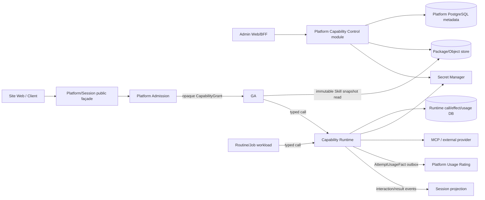

# Capability Control、Runtime、Connection 与 Effect 目标架构

## 1. Purpose

本文是 [PRD-18](2026-07-25-prd-18-capability-catalog-connection-consent-runtime-ux.md) 的技术 child Spec，冻结
Skill/MCP 从 package qualification、Site assignment、Workspace connection、consent/approval 到 runtime call、usage、
unknown reconciliation、live revoke 和运营恢复的边界。

它不重写 GA。现有 GA immutable Skill body、tool schema/name、MCP interaction、checkpoint、HITL、event ordering、cancel 和
terminal 语义默认保持。任何 adapter 无法用差分测试证明零语义变化时，本 cut 停止并请求用户专项批准。

## 2. Invariants

1. `CapabilityDefinition/Revision/Package/Qualification/Assignment/Connection metadata` 归 Capability Control；
   `CapabilityCall/ExternalCall/CredentialLease/EffectRecord/AttemptUsageFact` 归 Capability Runtime。
2. Secret Manager 拥有 secret bytes/version；Control 只存 SecretRef，Runtime 只取得短期 audience-bound lease。
3. Platform Admission 解释 Site、Plan、Entitlement、Agent、subject、budget；Capability 不解释商业规则。
4. GA 只消费 opaque namespace、不可变 Skill content/digest 与 opaque CapabilityGrant/Call interface；不接收 Site/User/Plan/
   Price/Secret 作为第二身份轴。
5. 每 Run 不调用 Hub 管理写面。GA Skill assembly 热路径读取已经发布、content-addressed、不可变的 qualified snapshot；
   Control outage 不影响仍在授权期内的 frozen Run。
6. 所有外部 effect 在 IO 前 durable claim；unknown 不自动 retry、fallback、换成员或从头执行。
7. Capability Runtime 记录原始 usage/provider cost signal，不计算客户价格、不写 Credit Journal。
8. revoke/deny/permission/consent 在 effect point 重新校验；projection/cache 不是授权真源。
9. Admin、Support、Session、Web 不直写 Control/Runtime 表，也不获取 secret 或通用 execute endpoint。
10. `skill` 与 `mcp` 是 V1 唯一正式 Capability kinds；Connector/Plugin/Hook 可复用协议但必须单独 qualification/assignment。

## 3. Containers and deployment



- V1 Capability Control 是 Platform modular core 内的 module，由 Platform API/Worker process 托管并共享 Platform UoW。
- Capability Runtime 是独立 execution bounded context/process，可独立扩缩容和持有受限 egress/credential lease authority。
- Package scanning/build worker 可以与 Control worker 同部署，但不把不可信 package code 带入 Platform API process。
- GA 对 immutable Skill snapshot 的直读使用发布 manifest/digest 和只读 credential；不能查询 draft、secret、connection 或用户数据。

## 4. Ownership and storage

### 4.1 Platform Capability Control

```text
CapabilityDefinition
CapabilityRevision
PackageArtifactRef
PackageReview / QualificationAttestation
CapabilityOperationRevision
CapabilityAssignmentRevision
ConnectionDefinitionRevision
Connection (metadata only)
ConsentRevision / PermissionTemplateRevision
RevocationCampaign / ImpactSet
```

Platform PostgreSQL 保存业务 metadata/state/version/outbox。Package bytes、SBOM、scan report、rendered docs 和 immutable Skill
content 存对象存储，以 digest 绑定。SecretRef 指向 Secret Manager，不携带 secret bytes。

### 4.2 Capability Runtime

```text
CapabilityGrantResolutionRecord
CapabilityCall
ExternalCall
EffectRecord
CredentialLeaseReceipt
InteractionRecord
RuntimeAttempt
AttemptUsageFact
RuntimeEventOutbox / ControlInvalidationInbox
```

Runtime 使用独立 PostgreSQL schema/database authority。Control/Platform 不跨 context 直接查询 Runtime 表；Admin timeline 由
events/projections 构建。未来抽离部署不传递 transaction handle、不 self-RPC、不共享写权限。

### 4.3 Secret Manager

```text
SecretVersion / encryption / region / audience policy
lease issue/revoke/rotate audit
```

Runtime 以 workload identity + connectionRef + operation + grant/epoch 请求短租约。Secret 不进入 DB、event、prompt、trace、
analytics、Support bundle 或 browser。provider refresh token rotation 先写新 secret version，再 CAS 更新 Connection pointer；失败
保留可回滚版本和 reconcile state。

## 5. Revision and qualification

```text
draft → validating → review_pending → qualified → published
                     ↘ rejected
qualified/published → restricted → revoked | superseded
```

`CapabilityRevision` 发布后不可变，至少冻结：

```text
kind / package digest / publisher signing identity
operation schemas / side-effect class / retry safety
data classes / destinations / network policy / sandbox profile
required connection/scopes / consent copy / retention
usage dimensions / estimate inputs / observability contract
compatibility / dependencies / migration / rollback target
```

Qualification 执行 schema、package provenance/SBOM/license、malware/static/dynamic sandbox、operation/effect、timeout/cancel/
unknown、secret、privacy/rights、a11y/i18n、usage、load 和 runbook 检查。`CapabilityQualificationAttestation` 先于 Profile
candidate compile；ReleaseCertificationInstance 在具体 SiteRelease compile/build/preview 后产生，二者 digest 单向无环。

## 6. Assignment and discovery

Effective eligibility 是交集：

```text
active SiteRelease inventory
∩ CapabilityAssignmentRevision
∩ Plan/Entitlement grant
∩ Workspace/User assignment
∩ current restriction/qualification epoch
∩ operation/input/data-region policy
```

Control compiler 产生 signed `EffectiveCapabilityInventoryRevision`，包含 stable public ID、safe display、operation refs、risk/data
summary、connection need、price presentation ref、qualification/assignment digests 和 expiry。Catalog projection 只展示该 inventory；
Runtime 在 effect point 使用 server-side authorization record重验，不信任客户端 discovery payload。

GA Skill assembly 输入为 `QualifiedSkillSnapshotManifest`：只包含冻结内容/digest、tool schema、operation binding、兼容版本和
opaque grant ref。不得包含 Site/Plan/Price/Secret/Connection/token。每 Run 不跨 Hub RPC；manifest 缺失、digest mismatch 或
qualification/restriction epoch不匹配时 fail closed。

## 7. Connection and consent state machine

```text
unconfigured
→ authorization_pending
→ callback_received
→ validating
→ active
↔ reauth_required | degraded
→ revoking → revoked
↘ failed | unknown
```

- OAuth 使用 state/nonce/PKCE、exact redirect、Site+subject+Workspace binding；callback code 只能由 server-side adapter兑换。
- custom MCP endpoint 先通过 URL canonicalization、DNS/IP resolution、SSRF/private-range、TLS、redirect、egress policy 和
  endpoint fingerprint；Runtime 每次连接重验 resolved target/allowlist，不只在保存时检查。
- 同一外部账号跨 Site 建立独立 Connection/consent/SecretRef/epoch；email/provider account ID 不做共享 identity。
- permission/data/destination/retention/external write 增加时创建新 revision 并重新 consent；静默扩权禁止。
- revoke commit 立即提高 connection epoch 并阻止新 effect；provider revoke 可后台完成。provider outcome unknown 时本地保持
  `revoking/unknown`，但不恢复新调用权限。

Connection commands：`StartConnectionAuthorization`、`CompleteConnectionCallback`、`ValidateConnection`、
`PublishConnectionConsent`、`RequestConnectionReauth`、`RevokeConnection`、`RotateConnectionSecret`、
`ReconcileConnectionOutcome`。全部使用 idempotency key+canonical body digest+expectedVersion+receipt。

## 8. CapabilityGrant

Platform Admission 创建 server-side authorization record并给执行 workload高熵 opaque handle：

```text
grantHandle / audience=capability-runtime
subjectGeneration / executionRootRef / operation allowlist
capability revision digest / connection ref+epoch?
permission/consent/policy/qualification/restriction epochs
child allocation ref+ceiling / usage dimension allowlist
target/data-region/network restrictions
issued/expiry / revoke epoch / authorization digest
```

Readable Site/Billing/Plan claims只存在 Admission/Runtime server-side record。GA 不解析 handle。Runtime 本地 resolve或通过
authorization service验证，不在 effect 热路径向多个业务模块扇出查询。TTL 到期后已 claim 的 Call 只允许收口原 effect；新
segment/new effect 需要新 authorization。

## 9. Call and effect protocol

```text
CreateCapabilityCall(callId, grantHandle, operation, typed input digest)
→ resolve frozen authorization/revision/connection/epochs/allocation
→ durable CapabilityCall + EffectRecord(intent/claimed)
→ acquire credential lease
→ provider/MCP IO with stable external identity when supported
→ durable ExternalCall outcome + AttemptUsageFact + outbox
→ project interaction/result
→ canonical usage ingest/rating/settlement async
```

Call state：

```text
proposed → awaiting_permission | awaiting_elicitation
→ claimed → submitted → streaming
→ completed | partial | failed_no_effect | canceled | unknown
unknown → reconciled_completed | reconciled_failed | irreconcilable
```

### Retry classes

| Class | Rule |
|---|---|
| pure/read | bounded transport retry with same call/effect identity |
| idempotent_with_provider_key | same provider key and queryable receipt only |
| definitely_not_submitted | new transport attempt allowed under same logical effect |
| submitted/unknown | no retry/fallback；query/reconcile original identity |
| post-output/post-effect | no hidden replay；surface partial/failure and explicit new user intent if safe |

timeout/connection loss不等于 failure。`failed_no_effect` 必须有证据证明 provider 未接收/未执行；否则是 `unknown`。

## 10. Interaction、approval and elicitation

- Runtime 发出 typed `CapabilityInteractionRequested`，Session 只投影并接收用户 response；authorization owner 以
  expectedVersion/interaction identity CAS 接受一次。
- Approval 绑定 capability/revision/operation/input safe digest/resource set/destination/side-effect class/expiry；不存在通配
  “允许所有工具”。
- `once`、`session_revision`、`bounded_routine_revision` 是不同 grant。Payment、secret reveal、security recovery、cross-Site、
  high-risk publish、rights/consent 和 unknown retry 永远不能预授权。
- MCP elicitation 维持同一 CapabilityCall/ExternalCall/provider session；若之前可能产生 effect 且 provider 无 resume/query，
  Call 进入 unknown，不能从头重跑。
- revoke/permission/consent/policy epoch在响应提交与真正 effect 前再次检查，防 TOCTOU。

## 11. Usage、budget and cost

- Platform Credit owner为 ExecutionRoot创建唯一 root Hold，并原子创建 Capability child allocation；Runtime 不能看到整个
  root ceiling，也不能创建第二 root Hold。
- `AttemptUsageFact` 与 RuntimeAttempt terminal/unknown在同一 Runtime transaction写入，并由 outbox交给 usage-rating。
- Usage identity至少绑定Site server-side auth ref、executionRoot、call、attempt、capability revision、operation、provider evidence。
- Rating outage不阻止安全交付：Call可 `completed + cost_pending`，但 committed allocation不释放。
- unknown 保留其 committed allocation；irreconcilable deadline后由 Finance policy明确 write-off/platform loss/customer
  disposition，Runtime不得猜零费用或让用户形成静默负债。
- correction追加新 evidence/rating/journal entries，不改写旧 usage fact。

## 12. Revocation、restriction and supply-chain incident

```text
PublishRestriction / RevokeRevision / RevokeConnection
→ Control transaction + outbox + epoch
→ Runtime invalidation inbox
→ reject new claim/effect
→ classify active calls: pre-effect cancel | submitted continue reconcile | completed preserve fact
→ impact graph over Site/assignment/connection/run/routine/artifact
→ notification/support campaign
→ per-target receipt + unresolved/unknown queue
```

- emergency deny可短路正常发布等待，但仍需 authenticated command、reason、scope、expiry、audit和事后 maker-checker。
- 已生成 Artifact 不因 revision revoke 自动删除；Trust/Data Governance 根据来源、rights、share、LegalHold分别决定。
- package/object/connection/secret/runtime replica的清除都需要 target receipt；partial/unknown不得显示“已全部处理”。
- rollback只影响未来 assignment/calls；历史 Call/Usage/Artifact仍引用原 revision和decision。

## 13. APIs and events

### Control application commands

```text
CreateCapabilityDraft / SubmitCapabilityReview / QualifyCapabilityRevision
PublishCapabilityRevision / RestrictCapabilityRevision / RevokeCapabilityRevision
PublishCapabilityAssignment / RollbackCapabilityAssignment
Start/Complete/Reauth/RevokeConnection
StartRevocationCampaign / ReconcileCampaignTarget
```

### Runtime RPC

```text
DiscoverAuthorizedOperations(grantHandle, manifestDigest)
CreateCapabilityCall(callIdentity, grantHandle, operation, typedInput)
RespondCapabilityInteraction(callId, interactionId, expectedVersion, response)
CancelCapabilityCall(callId, expectedEpoch)
GetCapabilityCall(callId)
AttachCapabilityCall(callId, cursor)
```

RPC schema定义caller/audience/deadline/idempotency/receipt/retry/failure/fallback。跨 context没有distributed transaction、DB
handle或generic execute。typed input严格schema/unknown-field策略，异步refine在边界完成。

### Events

```text
CapabilityRevisionQualified/Published/Restricted/Revoked
CapabilityAssignmentPublished/RolledBack
ConnectionAuthorizationStarted/Activated/ReauthRequired/Revoking/Revoked/Unknown
CapabilityCallProposed/Claimed/Submitted/InteractionRequested/Completed/Partial/FailedNoEffect/Unknown/Reconciled
CapabilityAttemptUsageRecorded
CapabilityRevocationTargetProcessed/Partial/Unknown
```

event envelope包含eventId、server-side Site partition、aggregateId/version、schema、occurred/recorded、correlation/causation、
classification。事件陈述已提交 fact，不把 `retry_external_call` 伪装为可 replay fact。

## 14. Failure matrix

| Failure | Required outcome |
|---|---|
| Control unavailable, frozen valid Run | immutable snapshot + unexpired grant可继续；新 discovery/assignment fail closed |
| Runtime unavailable before claim | no effect；same call identity可重试 transport |
| Runtime crash after claim before IO | inspect durable phase；only definitely-not-submitted proceeds |
| Runtime crash after provider submission | unknown/query/reconcile；no new effect |
| Secret Manager unavailable | no credential/no effect；queue/wait，不能用 cached raw secret |
| OAuth callback response lost | query same connection identity；no second authorization guess |
| connection revoke races call | effect-point epoch CAS decides；submitted Call truthful reconcile |
| user answers interaction twice/two devices | one owner CAS wins；other receives already_resolved |
| provider result succeeds, Usage outbox down | local terminal+UsageFact durable；deliver cost_pending, allocation retained |
| package drift/digest mismatch | quarantine/readiness fail；never read draft/unknown bytes |
| cross-Site same IDs/provider account | authorization partition rejects without existence leak |
| projection rebuild | replay owner facts only；no provider/OAuth/notification effect |

## 15. Security and privacy

- package build/scan in isolated sandbox with CPU/memory/time/network limits；archives defend path traversal/symlink/bomb。
- MCP endpoint and provider URLs defend SSRF, DNS rebinding, redirect, private metadata IP, TLS downgrade and wildcard egress。
- Runtime egress按 revision/operation allowlist；Connection不能自行扩展 destination。
- workload identity按 environment/region/audience；dev/staging/prod package、connection、secret和call不可混用。
- logs/traces/events使用 field allowlist；input/output内容默认不进入 metrics，debug access用短期 ContentAccessGrant。
- Support/Admin只看 safe projection；secret reveal、raw package/content、cross-Site查询需要专用 JIT workflow且普通流程默认无此能力。
- Data Rights participant依据 connection/account metadata、call content、usage、audit与legal hold分别export/delete/deidentify/retain。

## 16. Migration and cutover

1. inventory 当前 Hub/GA Skill/MCP schemas、package storage、namespace assignment、connection credential、tool events和调用路径。
2. 冻结 generated contract 与 golden corpus；为旧 published revision生成不可变 migration manifest，不把 draft直接视为qualified。
3. expand新 Control tables/Runtime store/SecretRef；迁移 secret必须由受控 importer写Secret Manager，禁止导出明文到脚本/log。
4. dual-read/shadow比较 catalog/manifest/operation schema；只有单 authority，禁止长期双写。
5. Runtime adapter shadow/record-only验证后，使用 GA differential corpus证明 tool name/schema/args、interaction、event、checkpoint、
   cancel、terminal与namespace语义零差异。
6. 若差分不能证明零差异，停止；提交 GA专项批准包。未经批准不切换。
7. canary按Site/Profile/Capability revision，监控 deny/latency/error/unknown/usage/secret/drift；rollback只切future assignment。
8. clean cut删除旧可变package/明文credential/generic endpoint/双owner/兼容分支并更新INDEX/handbook。

## 17. Verification and acceptance

### AC-CAPARCH-01 — Qualification and release DAG

```gherkin
Given a Capability revision has package and review evidence
When a SiteRelease candidate is compiled and certified
Then qualification exists before compile and ReleaseCertification after build/preview
And no placeholder, self-reference or other Site evidence is accepted
```

### AC-CAPARCH-02 — GA hot path has no Hub RPC

```gherkin
Given a Run is admitted with a frozen qualified Skill snapshot
When Capability Control is unavailable
Then GA reads the immutable digest-bound snapshot without a per-Run Hub request
And it cannot discover draft, revoked epoch or secret data
```

### AC-CAPARCH-03 — Secret containment

```gherkin
Given an MCP call requires an external credential
When Runtime executes the authorized operation
Then only an audience-bound short credential lease reaches the adapter
And browser, Session, GA, event, trace and Support never receive secret bytes
```

### AC-CAPARCH-04 — Effect exactly once semantically

```gherkin
Given Runtime crashes at any phase before or after provider submission
When the call is recovered
Then the durable effect identity and provider receipt determine continuation
And unknown never causes a second external effect
```

### AC-CAPARCH-05 — Revoke wins before new effect

```gherkin
Given a revision or connection is revoked while calls are active
When a new effect reaches the effect point
Then current restriction, connection and permission epochs are revalidated and deny it
And submitted calls reconcile without rewriting history
```

### AC-CAPARCH-06 — Budget is bounded and price authority separated

```gherkin
Given a CapabilityCall receives a child allocation from one ExecutionRoot Hold
When it records terminal or unknown usage
Then allocation conservation and durable AttemptUsageFact hold
And Runtime does not calculate customer price or write CreditJournal
```

### AC-CAPARCH-07 — Interaction resumes same call

```gherkin
Given an MCP call requests approval or elicitation
When the user responds after reconnect or on another device
Then one owner CAS resumes the same CapabilityCall and ExternalCall identity
And no prior effect or interaction is replayed
```

### AC-CAPARCH-08 — Two Sites remain isolated

```gherkin
Given two Sites use identical names, user emails, provider account IDs and operation inputs
When inventory, connection, grant, call, usage and Support paths are exercised
Then every authorization and record remains in its immutable Site partition
And denial reveals no cross-Site existence signal
```

### AC-CAPARCH-09 — Usage outage does not falsify result

```gherkin
Given a call safely completes while Rating is unavailable
When the user receives the result
Then state is completed plus cost_pending with durable local usage evidence
And committed allocation remains until canonical settlement
```

### AC-CAPARCH-10 — GA semantic preservation gate

```gherkin
Given the current GA Skill/MCP path and candidate adapters process the golden corpus
When graph, tool, interaction, event, checkpoint, cancel and terminal traces are compared
Then they are semantically identical under the approved normalization
Or cutover stops and requests explicit user approval
```

Test suites：schema/property、package/supply-chain、OAuth/SSRF/secret、effect crash matrix、permission/revoke race、usage/allocation、
two-Site/security、projection rebuild/DR、load/backpressure、Admin/Support UAT、GA differential corpus。

No-Go：per-Run Hub RPC；GA可读 Site/Plan/Secret；draft/unqualified package执行；install即永久授权；secret出边界；generic execute；
unknown blind retry；revoke只改UI；Runtime定价/改账；second root Hold；Admin直改表；cross-Site connection；replay触发effect；
差分失败仍切GA adapter。

## 18. Approval boundary and related documents

- [PRD-18 Capability](2026-07-25-prd-18-capability-catalog-connection-consent-runtime-ux.md)
- [Execution Budget Allocation](2026-07-25-execution-budget-allocation-protocol-design.md)
- [Platform Modular Core/Internal RPC](2026-07-25-platform-modular-core-internal-rpc-design.md)
- [Platform/Web/Session P0 Closure](2026-07-25-platform-web-session-p0-contract-closure-design.md)
- [PRD-05 Chat](2026-07-25-prd-05-chat-conversation-run-and-interaction.md)
- [PRD-A4 Routine/Connector/TaskView](2026-07-25-prd-a4-routine-connector-and-taskview.md)
- [Capability Hub current handbook](../../kokoro-handbook/technical/22-capability-hub.md)

本文批准不授权实现、迁移、secret导入、provider/MCP调用或生产切流。任何 GA graph、assembly、prompt、tools/skills/MCP
装配、checkpoint、effect journal、HITL、cancel、Handoff、namespace、event order 或 terminal 变化均保持
`gaRuntimeSemanticChangeAuthorized: false`，必须停止并与用户专项对齐。
