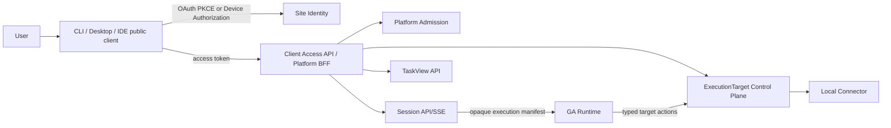

# Client Access Plane：CLI、Desktop 与 IDE

## 1. Purpose

Kokoro未来可以提供Claude Code类CLI、Desktop和IDE扩展，但不能为了客户端便利暴露GA control、checkpoint、namespace mapping、
Site workload credential或内部RPC。本文冻结公共客户端的身份、授权、兼容、feature discovery、attach/fork/new-run、设备撤销和
ExecutionTarget边界，作为PRD-A2/A3的上游。

本文不定义新的Agent runtime。Web、CLI、Desktop和IDE共享Platform Admission、Session、TaskView、Job、Artifact、Credit和GA；
客户端只是不同入口与本地ExecutionTarget connector。

## 2. Product principles

1. 每个Site从用户视角是独立产品和OAuth security domain；授权不跨Site继承。
2. Client是public client，没有可保密的client secret；Site workload identity永不分发到设备。
3. 用户登录授权、设备注册、workspace permission和一次Run execution grant是不同层。
4. 客户端只调用公开Platform/Session/Task/ExecutionTarget façade，不直连GA、Model Gateway、Capability Runtime或数据库。
5. attach、fork和new run是三种显式产品命令，不能由UI根据本地状态猜测。
6. 本地文件、命令、浏览器和credential访问默认deny，按target/action/resource/duration逐次授权。
7. client release、protocol和feature compatibility可机械判断；旧客户端不得静默忽略安全字段。

## 3. Actors and containers



- Client Access API是public edge façade，负责OAuth audience、client/release policy、rate limit和safe contract；不是新业务真源。
- Site Identity拥有Account/AuthSession/OAuth grant；Device Registry拥有client installation/device binding与revoke facts。
- ExecutionTarget Control Plane拥有target registration、permission lease、action intent/receipt；local connector只执行明确动作。
- Session/TaskView继续拥有对话和跨设备任务projection；GA只消费opaque handles/namespace。

## 4. Canonical objects

```text
PublicClientDefinitionRevision
  clientId / kind=cli|desktop|ide / publisher+signing identity
  redirect/loopback policy / protocol range / supported platform / update policy

ClientReleaseAttestation
  clientId+version / binary+package digest / signature+SBOM+provenance
  protocol range / security fixes / minimum server policy / issued+revoked

DeviceRegistration
  immutable siteId / deviceId / subjectGeneration / clientId+release
  platform+key attestation / trust state / created+lastSeen / deviceEpoch

OAuthGrantRevision
  immutable siteId / subjectGeneration / clientId+deviceId / audiences+scopes
  issued/expiry / refresh family / auth+consent revisions / grantEpoch

ClientFeatureManifestRevision
  immutable siteId / SiteRelease / protocol range / enabled feature IDs
  required client versions / route+scope+contract refs / expiry+signature

WorkspaceBindingRevision
  immutable siteId / projectRef / targetRef / local root opaque identity
  repository/worktree metadata policy / permission profile / revision

ClientTaskIntent
  immutable siteId / taskId? / command=attach|fork|new_run
  session/run/task refs / workspace binding / user-visible reason / idempotency digest
```

不得在任一对象中存raw local path、repository credential、Site workload secret、GA namespace mapping、Provider secret或用户token。

## 5. OAuth and authentication

### 5.1 Interactive default

- Desktop/IDE/CLI有浏览器时使用Authorization Code + PKCE S256、state、nonce和exact redirect binding。
- Desktop使用claimed HTTPS/app link或经认证loopback redirect；CLI loopback listener绑定localhost随机端口并在一次使用后关闭。
- embedded webview不收集Site password/MFA；登录在system browser完成。
- OAuth issuer、authorization server和token audience绑定具体Site/domain；Site A token对Site B完全无效。

### 5.2 Headless fallback

- 无浏览器环境可使用标准Device Authorization，但必须显示Site、verification URI、短user code、expiry和phishing提示。
- device poll遵守interval/slow_down，成功后code立即失效；日志、shell history和analytics不得记录user/device code。
- 禁止让用户把access token、cookie或Site workload secret粘贴进CLI作为常规登录。

### 5.3 Token policy

- access token短期且audience-bound；refresh token rotation、family replay detection和device/grant epoch revoke。
- public client没有client secret；每installation生成hardware/OS-backed non-exportable key，条件允许时使用DPoP sender constraint。
- token存入OS credential store/keychain；headless使用权限收紧的credential helper，不写repo、shell rc、env文件或日志。
- high-risk target action仍需fresh user presence/step-up；长期OAuth grant不等于永久shell/file approval。
- logout可选择当前session、device或all devices；Site/account revoke在SLO内终止refresh、SSE和target grants。

## 6. Scopes and audiences

最小public scopes：

```text
profile.read
projects.read
sessions.read / sessions.write / sessions.control
tasks.read / tasks.write
artifacts.read / artifacts.create_delivery
targets.read / targets.register / targets.request_action
devices.read / devices.revoke
```

- scope只决定可请求的API类别；每次resource/effect还需Site/Project/membership/restriction和Operation authorization。
- 不存在`ga.*`、`checkpoint.*`、`namespace.*`、`provider.*`、`credit.write`或`admin.*` public scope。
- model/agent/skill/MCP选择通过Site published Option/Assignment/Capability ID，不暴露secret、Deployment或内部package storage。
- background refresh不能自动取得新scope；增权重新authorization/consent。

## 7. Client compatibility and feature discovery

- 启动时Client发送clientId、release attestation ref、protocol version与platform class，不发送完整设备指纹。
- Server返回签名`ClientFeatureManifestRevision`：enabled feature、contract version、minimum/recommended client、deprecation date、
  required scopes和safe fallback。
- unknown required field/feature、低于security minimum、被revoked binary或protocol不重叠时fail closed并提供signed update channel。
- feature四层关闭：manifest、route、API authorization和backend assignment；隐藏命令不代表disabled。
- 客户端不得根据server版本字符串猜功能，也不得对unknown error自动改用内部endpoint。
- update package必须publisher signature、digest、provenance和rollback protection；IDE marketplace status不是唯一信任证据。

## 8. Device and workspace onboarding

1. 登录并选择当前Site；若用户授权多个Site，每个Site保存完全独立OAuth grant和local profile。
2. 注册DeviceRegistration，展示设备名、client release、last seen、scopes和revoke入口。
3. 选择Project并创建ExecutionTarget；本地connector显示exact root、repository/worktree facts与permission profile。
4. Server只保存opaque root identity与必要repo metadata；不默认上传整个目录、git config、credential或ignored files。
5. 初始扫描遵守ignore、安全预算、symlink/path boundary与secret detection；发现敏感数据先阻断/提示，不写日志。
6. 绑定变化（repo remote、root、worktree、device key、Project transfer）创建新revision并使旧execution grants失效。

## 9. Attach、fork and new run semantics

| Command | Meaning | Must preserve | Must not do |
|---|---|---|---|
| attach | 在另一设备/客户端查看并继续同一Task/Session/paused Run允许的交互 | same task/session/run identity、cursor、budget facts、pending interaction | 新建Run、重放effect、改变workspace binding |
| fork | 从选定Message/Task checkpoint的产品projection创建新Session/branch与新execution root | parent lineage、selected context digest、new Hold/authorization | 复制GA checkpoint、复用旧Hold、继承未授权target grant |
| new_run | 在当前或新Session显式提交新用户intent | new submit identity、Quote/Hold、current Site/Profile/permissions | 把unknown/failed Run当retry、隐藏复制旧effect |

- attach只允许owner projection声明的active/paused/recoverable状态；terminal Run只能查看或创建显式new run/fork。
- Provider outcome unknown时attach/query/reconcile；客户端不得用fork/new run同参数绕过uncertain effect，Admission按source lineage阻断。
- device切换不改变GA namespace或Run identity；Session把current Site/subject授权映射为既有opaque namespace。
- pending HITL/permission需要当前设备fresh authorization，不能因另一设备已批准而扩大resource/action范围。

## 10. ExecutionTarget and local connector

- connector以user process或受管daemon运行，只有outbound authenticated channel；默认不开放本地公网监听。
- 每个TargetActionIntent冻结siteId、project/target revision、action kind、resource set、parameter digest、working directory boundary、
  permission lease、deadline、idempotency和expected state。
- action kinds使用有限schema：read/list/search、write patch、run command、browser interaction、git operation等；不接受任意remote code envelope。
- command execution明确argv/cwd/env allowlist、timeout/output budget、network/sandbox policy；secret通过non-persistable credential lease注入。
- symlink、path traversal、mount crossing、worktree变化、repo ownership和nested repository在effect point重验。
- connector先持久化local action receipt/outcome digest，再ack；断线后query同identity，不盲重放可能有副作用的command。
- user可pause/revoke target；已启动外部effect按certainty收口，revoke不伪造cancel成功。

## 11. Offline and degraded behavior

- offline允许浏览本地缓存的低敏Task summary、draft和diff，但明确freshness，不允许提交需要server authorization的effect。
- 未提交prompt/draft可本地加密；登出、Site切换和device revoke后按policy清除。raw token/evidence/secret不进入draft cache。
- reconnect先刷新OAuth/feature manifest/target revision，再恢复Session snapshot+SSE；不能直接flush离线command queue。
- server/Session不可用时可保存draft，不fallback到直连GA/Provider或本地未认证agent runtime。
- client version被emergency revoked时停止新effects，保留安全export/log collection和升级路径。

## 12. Security and privacy

- deep link只接受allowlisted HTTPS/custom scheme、exact Site和single-use state；防open redirect、command injection和repo path injection。
- IDE workspace内容、terminal output和clipboard是不可信数据；rendering、link、ANSI、Markdown、file URI全部sanitized。
- telemetry默认低敏：client/release/platform class、latency、safe error、feature ID；不含path、repo URL、prompt、diff、command、output、token。
- crash report用户review/consent，secret/path redaction后上传；Support bundle有manifest、size/field policy和短期delivery grant。
- extension/plugin不能继承主client OAuth token；第三方扩展使用独立client identity/scope或本地受限IPC。
- Site切换清空Project/Task/Target selection和cache partition；相同email/repo remote不建立跨Site关联。

## 13. User-visible states and recovery

| State | Meaning | Recovery |
|---|---|---|
| signed_out / authorization_pending | 未授权或等待浏览器/device flow | login/cancel/restart safely |
| device_registered / device_restricted | 设备可用或被policy限制 | continue/step-up/revoke/support |
| update_required / incompatible | release或protocol不满足 | verify signed update/export draft |
| target_ready / permission_required | workspace已绑定或动作需授权 | inspect/request exact permission |
| connected / reconnecting / offline | transport状态 | wait/re-auth；不replay effects |
| attached / paused_interaction | 同Task/Run已恢复或等待输入 | respond with current grant/detach |
| stale_binding / target_revoked | workspace/device/Project revision变化 | rebind/review diff/new authorization |
| action_unknown / reconciliation_required | local/server effect结果不明 | query same identity/wait/support |

## 14. Acceptance criteria

### AC-CLI-01 — Site tokens never cross products

```gherkin
Given one installation is authorized to two independent Sites
When a token, refresh family, device binding, task cursor or target grant from Site A is used at Site B
Then authorization rejects without disclosing account, Project, Task or repository existence
And local profiles, caches and telemetry remain partitioned
```

### AC-CLI-02 — Public client has no shared secret

```gherkin
Given the CLI or IDE package is inspectable by its user
When OAuth authorization is configured
Then PKCE and device-bound keys protect the flow without embedding a client or Site workload secret
And copied binaries cannot use a static secret to impersonate a trusted workload
```

### AC-CLI-03 — Attach does not create an effect

```gherkin
Given a Run continues while the original device is offline
When another registered client attaches
Then it loads the same Session/Task projection and resumes after the durable cursor
And no new Run, Hold, Provider invocation, target action or terminal event is created
```

### AC-CLI-04 — Fork creates new business authority

```gherkin
Given a user forks from an earlier Message or Task point
When the fork is admitted
Then parent lineage is preserved while Session branch, execution root, Hold and authorizations are new
And no GA checkpoint, old target lease or unsettled effect is copied as reusable authority
```

### AC-CLI-05 — Unknown action cannot replay

```gherkin
Given a local command may have executed before connector disconnect
When client reconnects or changes device
Then the same action identity is queried and reconciled
And no offline queue, retry button, fork or new client silently reruns it
```

### AC-CLI-06 — Client compatibility fails safely

```gherkin
Given a client lacks a required security field or is below the minimum signed release
When it fetches the feature manifest or submits a command
Then new effects are blocked with a verifiable update path
And it does not ignore the field or fallback to an internal endpoint
```

### AC-CLI-07 — Target permission is exact

```gherkin
Given a permission authorizes one command and file set in one target revision
When path, symlink, worktree, command, network need or target revision changes
Then the connector requires a new current authorization before effect
And the prior approval cannot widen itself through parameters or shell expansion
```

### AC-CLI-08 — Revoke closes every channel

```gherkin
Given a device or OAuth grant is revoked while SSE and connector channels are active
When revocation epoch propagates
Then refresh, API, SSE and new target effects stop within the published SLO
And submitted uncertain effects reconcile without claiming cancellation
```

## 15. Verification and release gates

- OAuth：PKCE/state/nonce/loopback/device flow、refresh rotation/replay、DPoP、Site issuer/audience、logout/revoke。
- supply chain：signed release、rollback attack、revoked package、SBOM/provenance、protocol/feature compatibility。
- client security：credential storage、deep link、IPC/plugin isolation、cache partition、telemetry/crash redaction。
- target：path/symlink/worktree/argv/env/network/sandbox、permission race、disconnect/unknown、receipt idempotency。
- product：attach/fork/new run、multi-device HITL、offline draft、Site switch、update required和cross-Site negative matrix。
- load/ops：connector reconnect storm、SSE/mobile sleep、device fleet revoke、minimum-version campaign和Support bundle。

No-Go：embeddedSite secret；粘贴token登录；跨Site grant/cache；直连GA/Provider；public `ga.*` scope；客户端读取namespace/checkpoint；
offline effect queue自动flush；attach创建Run；fork复用Hold/target grant；任意remote code envelope；未签更新或unknown字段静默忽略。

## 16. Related documents and approval boundary

- [Platform/Web/Session P0 closure](2026-07-25-platform-web-session-p0-contract-closure-design.md)
- [Session HTTP/SSE transport](2026-07-25-session-http-sse-production-transport-design.md)
- [PRD-01 Identity](2026-07-25-prd-01-site-identity-and-account-security.md)
- [PRD-02 Workspace/Project](2026-07-25-prd-02-workspace-membership-and-project.md)
- [PRD-05 Chat](2026-07-25-prd-05-chat-conversation-run-and-interaction.md)

本文批准不授权实现，也不授权GA runtime改动。任何为了CLI/Desktop/IDE而暴露GA control/checkpoint、改变namespace、tool、
Handoff、cancel、terminal或checkpoint schema的提案必须停止并单独与用户对齐。
