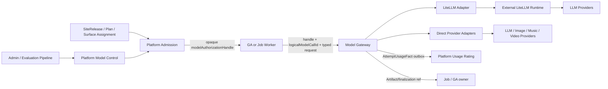

# Model Control、Model Gateway 与 LiteLLM 目标架构

## 0. Document Position

本文是 Umbrella §9 与 Wave 5A 的 Model 技术子设计草案，覆盖唯一 Model Catalog、产品组合、路由、Provider IO、
LiteLLM adapter、多模态、Usage、评测、发布、Admin、故障恢复和 clean cutover。它不授权实现，也不授权修改
GA graph、assembly、prompt、tool、checkpoint、effect、Handoff、namespace 或 terminal semantics。

GA 当前 LangGraph/DeepAgents 核心保持不变。Wave 5A 允许的最小变化仅是把现有 provider-specific model factory
外围调用收敛到一个 Model Gateway adapter；如果 contract spike 证明会改变 streaming/tool-call/reasoning/HITL/
checkpoint 行为，必须暂停并单独与用户对齐。

## 1. Current-state Findings

源码取证结论：现有实现适合早期闭环，不适合作为生产模型平台继续扩展。

1. `kokoro-model` 的 `ModelBinding` 同时承载真实 provider model、product `featureKey`、用户 `labelKeys`、
   transport、LiteLLM alias、priority 与 fallback，目录/部署/产品/路由没有分层。
2. `SiteModelPolicy` 只有 `visible|hidden` label，无法表达 SiteRelease、Plan grant、role completeness、默认项、
   hidden internal model、专业 generation model 或版本化 assignment。
3. Session 在 `billing/service.ts` 中 resolve binding、改写 `runtime.model`、创建 Credit Hold 并用 Run terminal token
   usage settle，承担了 Model/Commerce/Usage owner；目标架构中这些职责均不属于 Session。
4. GA factory 直接支持 `openai|anthropic|litellm`，每个 provider 的 reasoning/thinking 参数在 GA 内翻译；继续增加
   media/provider 会把 GA 变成 Gateway。
5. LiteLLM YAML、`ModelBinding.gatewayModelName`、Session default 与 GA wire name 多点对齐，存在 alias drift；
   LiteLLM 与 ModelBinding priority 又可能形成两层不一致 fallback。
6. 当前 LiteLLM contract 允许 runtime 失败后释放 active hold，并允许 agent usage 上报 credit；这与 committed Hold、
   AttemptUsageFact 和 canonical usage-rating 目标冲突。
7. 当前 `claude-code` 是 UI label、logical model、gateway alias 与 runtime model name 的四合一名称，无法安全支撑
   Chat/Music/Video 各自组合主模型、专业模型和 fallback。

因此结论是 clean rewrite `kokoro-model` 数据/接口和 Session billing/model path；LiteLLM 保留为外部 adapter；
GA 核心保留，只替换外围 provider adapter cutover。

## 2. Goals、Non-goals and SLO Envelope

### 2.1 Goals

1. 底层 `ModelDefinition/Deployment` 全平台一份；Site、Chat、Music、Image、Video 只组合引用，不复制 model list。
2. 用户看到产品 ModelOption；Surface/Agent 看到 role；Gateway 才看到 Deployment/provider secret。
3. General Chat 有内置 default primary model；Music/Video 同时解析 orchestrator/main model 与专业 generation model。
4. Model Control 是 catalog/policy/assignment/promotion authority；Gateway 是 invocation/attempt/route/usage authority。
5. LiteLLM 只是 Gateway 内 LLM transport adapter，一条 alias 精确绑定一个 Kokoro Deployment。
6. 每次 Attempt 都可解释、可计成本、可恢复，失败/unknown/fallback 不重复副作用或客户扣费。
7. 目录、Route、Prompt、Agent 与 Provider 只有通过 evaluation→certification→shadow/canary→promotion 才可生产。

### 2.2 Non-goals

- 不自建基础模型、tokenizer、媒体编解码器或 LiteLLM fork。
- 不让 LiteLLM 拥有 Plan、Credit、budget、business fallback、Site authorization 或 canonical usage。
- 不把所有媒体 Provider 强塞 OpenAI-compatible protocol。
- 不允许浏览器、Session、GA 或 Job 自选 ProviderAccount/secret/deployment。
- 不在本 Spec 实现高级 Agent Handoff/AgentRevision；仅消费已冻结的 role/manifest refs。

### 2.3 Architecture envelope

| Signal | Target |
|---|---:|
| unauthorized/unknown deployment invocation | 0 |
| alias→multiple Kokoro Deployment ambiguity | 0 |
| duplicate Provider Attempt from unknown retry | 0 |
| canonical terminal/reconciled Attempt missing AttemptUsageFact/outbox | 0；submission/outcome unknown 不计 terminal |
| cross-Site/Plan/model-option bypass | 0 |
| Gateway admission overhead excluding Provider | p95 ≤ 50ms cached、≤150ms control lookup |
| route explanation lookup | p95 ≤ 2s |
| control-plane outage with valid compiled bundle | no interruption until bundle expiry |
| revoked deployment used after propagation SLO | 0；p99 enforcement ≤ 10s |

## 3. Context and Containers



### 3.1 Model Control

Platform modular Core 内的 bounded context，不单独拆数据库微服务。拥有定义、部署 metadata、product model
composition、route policy、evaluation/promotion、compiled bundle 和 Admin command。Control Plane 不执行 Provider
inference，也不持明文 secret。

### 3.2 Model Gateway

独立 deployable，拥有 invocation admission、attempt selection、provider adapter IO、stream normalization、attempt
terminal、ResolutionRecord、HealthObservation、ProviderCostFact、AttemptUsageFact 与 outbox。Gateway 不拥有
Product/Plan/Credit/Rating/Artifact/Run/Job terminal。

### 3.3 LiteLLM Runtime

独立外部 runtime，仅由 Model Gateway 调用。部署/config/health/runbook 可以保留在 `kokoro-litellm` package，
但 production config 由已发布 `GatewayConfigRevision` 生成，不能手改 YAML 成为第二目录。

### 3.4 Callers

- GA：同步/streaming LLM invocation；只消费 manifest 中的 role/route grant，通过一个 Gateway adapter。
- Job Worker：Image/Music/Video、provider async/callback 与 evaluation Job。
- Direct Studio：经 Platform Admission/OperationAuthorization→Job，不直连 Gateway。
- Session：只保存用户 ModelOption selection/projection，不 resolve Deployment、不改 runtime provider、不扣费。

## 4. Canonical Model Objects and Ownership

```text
ProviderDefinition
ModelProviderAccount
ProviderAdapterRevision
ModelProtocolContractRevision
ParameterMappingRevision
ModelDefinition
ModelDeployment
DeploymentCapabilityRevision
ProviderCostRateRevision
DeploymentHealthObservation

ModelProfileRevision
ModelPoolRevision
FallbackEquivalenceRevision
RoutePolicyRevision
ModelBundleRevision
ModelOptionRevision
SurfaceModelAssignmentRevision
EffectiveModelBundleRevision
PlanModelGrantRevision
GatewayConfigRevision

ModelEvaluationSuiteRevision
ModelEvaluationRun / EvaluationReportArtifact
ProviderCertification
ModelPromotionDecision

ModelExecutionAuthorization
ModelInvocationAuthorization
ModelInvocation
InvocationEventJournal
ResolutionRecord
ModelAttempt
ProviderOutcomeFact
ProviderCostFact
AttemptUsageFact
```

### 4.1 Definition versus Deployment

- `ModelDefinition`：canonical logical model identity/family/revision、vendor声明、modalities、context/parameter taxonomy，
  不含账号、region、secret、价格、Site、feature 或用户 label。
- `ModelDeployment`：一个 ProviderAccount/environment/region 上的确切 upstream model/version/endpoint/adapter；一个
  deployment 只有一个 credential boundary 和 capability certification set。
- `ModelProtocolContractRevision` 冻结 request/stream/tool-call/structured-output/reasoning/usage/finish/error/cancel
  canonical semantics；`ParameterMappingRevision` 对每个 Deployment/Adapter 声明 exact mapping、unsupported 与
  semantically-optional fields。Provider SDK 升级会使相关 certification evidence 失效。
- 一个 ModelDefinition 可以有多个 Deployment；同 deployment 不能同时属于两个 Definition revision。
- Provider 发布会漂移的 alias（如 `latest`）默认不能成为 production Deployment version。只有能观察确切 provider
  revision、具有 drift class、短 certification TTL、自动 quarantine 和重新评测门槛的明确例外才可启用；observed
  model string 不冒充 immutable provider revision。

### 4.2 Product abstractions

- `ModelProfileRevision`：一个 role 的质量/能力/parameter/route contract，引用一个 Pool 与 RoutePolicy。
- `ModelPoolRevision`：允许的 Deployment candidates；不存瞬时 health，也不因 membership 暗示 fallback 等价。
- `FallbackEquivalenceRevision`：以独立 evaluation evidence 明确哪些 Deployment/Definition 可在什么 role/request
  class 下 fallback。
- `ModelOptionRevision`：用户可见的稳定选择，例如 Standard/Fast/Quality；只声明允许覆盖的 role→Profile patch，
  不暴露 Provider/Deployment，也不是客户端自由拼装 Profile 的能力。
- `ModelBundleRevision`：`roleKey → ModelProfileRevision` 的完整组合。
- `SurfaceModelAssignmentRevision`：Site/Surface 的 default bundle、visible options、hidden roles、rollout/expiry。
- `EffectiveModelBundleRevision`：SiteRelease compile 的唯一完整 runtime 组合。顺序固定为 Assignment default bundle →
  published default option（用户未选择）或显式 Option 声明的 role override → hidden/internal role 从 Assignment/Agent
  manifest 补齐；禁止运行时临场 global default。结果必须满足 OperationSpec/AgentRevision role-requirements digest。
- `PlanModelGrantRevision`：某 Entitlement 可使用的 published Option/limits，不允许客户端按 Profile 自由组合。

### 4.3 Runtime facts

- `ModelExecutionAuthorization`：execution root/authorization segment级server-side授权记录，冻结EffectiveBundle、
  Site/Billing/root Hold/Rating linkage、允许roles、bounded invocation budget与epochs；Gateway原子消费budget。GA adapter
  只持有opaque handle，不读取record，也不为每个turn回调Platform。
- `ModelInvocationAuthorization`：Gateway 从 ExecutionAuthorization 原子派生的一次 logical model call 授权，绑定
  stable `logicalModelCallId`、role/request digest 与 invocation budget ordinal。
- `ResolutionRecord`：Gateway 在 effect point 对一个 Attempt 的确定选择和排除解释。
- `ModelInvocation`：caller 的一次 logical intent；可有多个严格受控 Attempt。
- `ModelAttempt`：一次真实 Provider IO，拥有 terminal/outcome/cost/usage facts。

## 5. Model Roles and Product Composition

role 是功能需求，不是 Provider 名称：

```text
assistant.primary
assistant.fast
assistant.reasoning
assistant.summarizer
research.primary
music.assistant
music.generation
image.assistant
image.generation
video.assistant
video.generation
moderation.text/image/audio/video
embedding.default
rerank.default
```

每次 SiteRelease 只发布确定的 `EffectiveModelBundleRevision`：default bundle 是完整 base；用户未选择时应用已发布
default option，显式 Option 只覆盖声明 role；hidden/internal role 只从 Assignment/Agent manifest 获得，客户端不可
覆盖。compile 后逐项满足 role-requirements digest，缺 role/跨 Site ref/unentitled Option 直接失败，运行时不补全。
“role 对用户隐藏”与“default Option 是否显示在 selector”是两个独立属性。

### 5.1 General Chat

- 必须有 hidden/default `assistant.primary`，即使用户没有模型选择器。
- 可选 `assistant.fast/reasoning` 和 summarizer，但 Release compile 检查 Agent manifest 要求的全部 role。
- 用户选择 ModelOption 只影响 option 明确声明的 role mapping；不能用 raw provider/model string。

### 5.2 Image/Music/Video

- 每个专业 Surface 至少有 `*.assistant`（理解、prompt/parameter 编排）和 `*.generation`（真实生成）。
- assistant role 可以复用与 Chat 相同底层 ModelDefinition/Profile；generation role 引用专业 Pool。
- Video storyboard/shot/upscale、Music lyrics/generation/stem、Image edit/upscale 可以有更细 role，但必须由专业
  PRD/OperationSpec 声明，不能以 `featureKey` 自由字符串临场添加。
- 用户看到专业 generation option；内部 orchestrator/safety/summarizer 默认隐藏，但仍需 entitlement、cost、
  evaluation 和 Release inventory。

### 5.3 Site and Plan

- SiteRelease 绑定 assignment revision；Site 不复制 ModelDefinition/Deployment。
- PlanModelGrant 决定 option eligibility、limits 和 customer RatingPolicy，不直接决定 deployment。
- unknown/disabled/unentitled option fail closed，不静默回 default。只有用户未选择时才使用发布的 default option。

## 6. Control-plane Lifecycle

### 6.1 Provider account and deployment

```text
draft → validating → certified → active
active ↔ degraded
active → disabled → retired
```

- account/deployment mutation typed、expectedVersion、reason、step-up；secret rotation 使用 current/next overlap 与
  explicit revoke epoch。
- disabled/retired 不改写历史 Attempt；新 route effect point 立即排除。
- health observation 不是 deployment lifecycle authority；automated circuit/managed deny 可以临时排除，正式状态由
  command/policy 管理。

### 6.2 Evaluation and promotion

```text
candidate
→ offline evaluation
→ provider contract certification
→ shadow
→ canary
→ signed ModelPromotionDecision
→ assignment candidate
→ SiteRelease certification/activation
```

- EvaluationSuite 冻结 dataset Artifact/Data refs、license/PII/safety metadata、metrics/thresholds、judge model refs、
  seed/parameter/parser versions。
- evaluation 通过普通 Operation/Job→Gateway 产生 AttemptUsageFact/ProviderCostFact；不扣 user Credit。
- judge/eval dataset/model candidate 不能形成未声明循环或数据泄漏；报告记录 confidence/variance。
- promotion signature 绑定 source/image/config/dataset/suite/report/adapter/provider versions、validity 与 revocation。
- Prompt、Agent、Route、Model 任一变化按影响图重跑所需 suite；不能只测试 model name。

### 6.3 Compiled bundles

- Control Plane 发布 immutable ModelControlBundle/GatewayConfigRevision，带 digest/signature/validity/supersedes。
- Gateway 使用 last-known-good valid bundle；Control Plane outage 不影响已授权调用，过期后新 Admission fail closed。
- emergency managed deny/revocation epoch 独立短路径覆盖 bundle；不能通过 cache staleness继续调用。

## 7. Admission and Authorization Contract

Platform Admission 输入可信 SiteRelease、Surface/Agent role、ModelOption、PlanModelGrant、ContentPolicy、data region、
Restriction、budget/rating refs，持久化server-side授权记录并向GA/Job Worker只输出高熵随机、不可解析的
`modelAuthorizationHandle`：

```text
ModelExecutionAuthorization {
  executionAuthorizationId
  audience = model-gateway
  callerKind / immutable siteId / billingAccountRef / executionRootRef
  rootHoldRef / holdAllocationRef / ratingPolicyRevisionRef / planModelGrantRevisionRef
  surface+operation+agent revision refs / effectiveModelBundleRevisionRef
  allowedRoles / routePolicyRevisionRefs / allowedParameterEnvelopes / requiredCapabilities
  dataClassification / allowedRegions / contentPolicyRevisionRef
  authorizationSegmentRef / invocationBudget / delegatedBudgetAllocationRef
  modelControlEpoch / restrictionEpoch / contentConsentEpoch
  issuedAt / expiresAt / nonce / commandDigest / signature
}
```

`ModelExecutionAuthorization`是Platform/Gateway可解析的server-side record，不是交给GA的claims token。Admission通过
outbox将加密记录预物化到Gateway authorization store；Gateway确认materialized后execution才可dispatch。GA只透传handle，
不得decode、branch、index、join或记录raw value，日志最多保存salted correlation hash。

- Browser/Session 不能提交 SiteId/Plan/Deployment 扩权；BFF/Platform 从 trusted context 编译。
- Gateway 校验 signature/audience/expiry/command digest/epoch/budget before effect，并原子派生/消费单 logical-call
  `ModelInvocationAuthorization`。同一 authorization + logicalModelCallId + request digest 可查询/attach，不能创建第二
  logical invocation；相同 grant 配不同 digest/ID 拒绝。
- 一个 execution root 只允许一个 root Hold；每个 Invocation/Attempt allocation 从该 root Hold 原子派生，总和不超过
  reservation。AttemptUsageFact 直接携带 Site/Billing/rootHold/allocation/rating settlement linkage，不靠事后按 Run 搜索。
- handle不包含任何可读claim、Provider secret、customer price或业务PII。GA仍只使用opaque namespace作为runtime isolation；
  Site/Billing/Plan/rootHold等refs只存在于Gateway解析的server-side record，不成为GA第二身份轴。
- token expiry 阻止新 Invocation/Attempt，不截断已不可逆提交的 Attempt；Gateway 在有效 ExecutionAuthorization 的
  bounded budget 中服务多 turn，GA adapter 不新增 Platform dependency。HITL/resume 超过 TTL 时由现有 Session/
  Platform admission 边界续发 execution segment；旧 authorization 不可创建 Attempt。managed deny/revocation 对未
  effect Attempt立即生效，对已提交 effect 按 Content/Security policy cancel/quarantine/reconcile。
- Phase A 前必须做 contract spike，证明能从现有 LangGraph metadata 得到 crash-replay 稳定 logicalModelCallId；若
  必须写入 checkpoint，则属于 GA semantic change，停止并请求用户专项批准。

## 8. Invocation and Routing

### 8.1 Command flow

```text
caller persists invocation intent/idempotency
→ Gateway accepts opaque modelAuthorizationHandle + logicalModelCallId + typed ModelRequest
→ atomically derives ModelInvocationAuthorization and allocation
→ persist ModelInvocation
→ resolve eligible candidates at effect point
→ persist ResolutionRecord + Attempt intent/provider operation key
→ Provider adapter IO
→ atomically persist Attempt terminal/ProviderOutcome/Cost/AttemptUsageFact + outbox
→ stream/terminal projection to GA or Job owner
→ usage-rating ingest/rate/settle asynchronously
```

Gateway 接受后响应丢失时，caller query/attach 同 invocation/attempt，不创建新 logical invocation。

Attempt 由 append-only `ProviderOutcomeFact` reducer 驱动，状态固定为：

```text
planned
→ dispatching
→ definitely_not_submitted | submitted | submission_unknown
→ streaming | provider_async
→ succeeded | failed | canceled | reconciliation_required
→ reconciled_succeeded | reconciled_failed | irreconcilable
```

provider operation key 在 IO 前持久化并绑定 account/deployment/request digest。只有 `definitely_not_submitted` 可创建
fallback Attempt；submission/outcome unknown 禁止 retry/fallback。ProviderCertification 必须声明 idempotency、retrieval、
callback、observed operation ID、cancel certainty、billing reconciliation source 与 maximum reconciliation window；
到期进入明确 `irreconcilable`，按冻结 policy 处理 customer charge、Provider exposure、Finance/Support 与 allocation，
不得永久冻结 Hold。

normalized stream/event contract 至少覆盖 start、content delta、reasoning delta（若产品允许）、tool-call start/
delta/end、structured-output、provider safety fact、usage update、finish reason、error 和 terminal。Adapter 必须保持
logical message/tool-call ID stability、ordering 与 terminal exactly-once projection；不支持的语义在 Admission/
capability filter 阶段拒绝，不能流中途降级。

Phase A 选择持久化 `InvocationEventJournal` 支持 attach：per invocation 单调 sequence、stable message/tool-call IDs、
encrypted content、bounded TTL/size、client ack cursor，并定义 journal event/terminal/outcome 的原子关系与 PRD-15
retention/data-rights participant。断线后只从 journal cursor 重放，不重新执行 Provider/tool；TTL 到期返回 typed
`stream_replay_expired` 与已有 terminal/evidence，不触发 Provider retry。若 contract spike 证明无法在不改 GA
checkpoint/graph 的前提下保持 byte/ID/order fidelity，则 Phase A 改为明确“不支持 delta replay + typed unrecoverable”并
删除 recover-stream 承诺，不能混合两种语义；任何需要 GA semantic change 的方案必须先获用户批准。

### 8.2 Candidate filtering order

1. grant/profile/pool exact revisions and role。
2. deployment lifecycle、managed deny、account/secret/adapter active。
3. modality/tool/stream/reasoning/context/parameter compatibility。
4. Site content/data region/provider policy and consent epoch。
5. budget/provider rate/capacity/concurrency constraints。
6. health/circuit and RoutePolicy deterministic ordering。

每个 excluded candidate 写 safe reason code；Admin 可查看细节，用户只见 ModelOption 层解释。

### 8.3 Fallback semantics

1. 同 canonical ModelDefinition 的 equivalent Deployment failover 优先。
2. 跨 ModelDefinition fallback 必须显式列入 RoutePolicy equivalence set，并通过独立 evaluation。
3. pre-effect connection failure 可在同 invocation 创建 next Attempt，前提是 original provider operation 确定未提交。
4. Provider outcome unknown 时禁止 fallback/retry，先 retrieval/reconcile。
5. 已产生任何 user-visible token、Artifact、tool call/effect 后禁止无感跨模型续接；失败终止或创建用户明确的新
   retry/branch/Operation。
6. async media retry/fallback 创建新 JobAttempt/ModelAttempt，保留 partial candidates，不冒充同一次 Attempt。
7. hedging/speculative parallel attempts V1 禁止；未来需单独成本、cancellation、privacy 与 duplicate-effect设计。

### 8.4 Parameters

- caller 提交 product-level typed parameters；Gateway 按 Profile envelope + AdapterRevision 映射 provider params。
- unsupported 参数 fail before effect；禁止 `drop_params=true` 静默改变用户/Agent语义。仅明确标记 optional+
  semantically-ignorable 的字段可由 adapter 删除，并写 ResolutionRecord。
- reasoning/thinking、tool schema、structured output、stream usage、seed、safety settings 分别做 capability contract；
  不以 OpenAI 参数名假设所有 Provider 等价。
- `drop_params` 类全局静默删除在 production 禁止。optional mapping 只能逐字段、逐 adapter revision批准，并在
  ResolutionRecord 记录；tool/reasoning/safety/response-format/seed 等行为字段默认不可忽略。

## 9. LiteLLM Adapter Boundary

### 9.1 Allowed responsibility

- OpenAI-compatible transport、connection pooling、provider protocol translation 和 adapter-level telemetry。
- Gateway 为每个 Kokoro `ModelDeployment` 生成唯一 alias，例如 opaque deployment alias；一个 alias 精确映射一个
  upstream provider/account/model/region config。
- LiteLLM master/internal key 仅 Gateway workload 持有；GA/Session/Web 不直连 LiteLLM。

### 9.2 Forbidden authority

- 不配置多 deployment business routing、cross-model fallback、Plan/Site budget、customer rate、virtual-key user
  policy、canonical cost/usage 或 model availability authority。
- LiteLLM internal retry 默认关闭；若某 adapter 必须进行网络级 retry，只允许在能证明 Provider effect 未提交
  的错误类上，由 Gateway Attempt policy 精确计数并纳入 certification。
- LiteLLM spend tracking 仅运营交叉校验，不写 Credit/Rating。
- LiteLLM DB/config drift 不能直接生效；GatewayConfigRevision compiler/diff/certification 是唯一发布路径。

### 9.3 Bypass and fallback

- 至少一个 certified direct adapter 可用于 LiteLLM outage 的运维 fallback，但切换也是 RoutePolicy/
  GatewayConfigRevision candidate + canary，不在单请求中无声绕过。
- direct 与 LiteLLM transport 使用独立 `ModelDeployment`（即使 upstream model/account 相同），不得在同一 Deployment
  运行时改 adapter；用户/Plan/Surface 不感知 transport，但 certification、cost、observed revision 与 Resolution 可区分。
- GatewayConfig/LiteLLM 激活使用 `prepare -> alias smoke/validate -> candidate-readiness -> activate same epoch`；保留
  previous digest 供 rollback，Gateway 不选择 LiteLLM 尚未确认加载的 alias。

## 10. Multimodal and Async Providers

- Model Gateway 是统一 provider control/effect boundary，不等于统一 wire protocol。
- LLM/text 可走 streaming sync adapter；Image/Music/Video 常走 async submit→providerJobRef→poll/callback→result。
- Job owns queue/lease/cancel/progress/retry/finalization；Gateway owns each ModelAttempt/provider outcome/usage/cost。
- callback 先进入 provider-account-bound Inbox，验签/去重/normalize；send 时建立 immutable
  `(providerTenantRef, providerAccountRevision, providerOperationId) -> (siteId, invocationId, attemptId)` mapping，
  mismatch/unresolved quarantine；unknown/out-of-order 使用 canonical retrieval。
- Provider binary 不直接成为 Artifact；Job finalizer 校验 canonical outcome、content policy/publish decision、checksum、
  Blob receipt、ArtifactVersion、durable `AttemptUsageEvidenceReceipt` 与 committed root Hold/allocation 后完成，不等待异步
  `CanonicalUsageIngestReceipt` 或 Rating/SettlementReceipt；后两者 outage 只使 `cost_pending`。
- generation model 与 orchestrator model 使用不同 roles/attempts/usage；不能把主模型 token 和 media generation
  unit 混成一条 usage。

## 11. Usage、Cost and Customer Rating

```text
ModelAttempt terminal
→ ProviderCostFact + AttemptUsageFact + Outbox (same local transaction)
→ Platform usage-rating canonical ingest
→ CanonicalUsageEvidence
→ RatingSnapshot / RatedUsage
→ Credit HoldAllocation capture/release
```

- 每个成功、失败、canceled、unknown-reconciled Attempt 都有 cost/usage evidence（无 usage 时明确 zero/unavailable
  reason），不只依赖 Run terminal token total。
- `AttemptUsageFact` 固定 immutable siteId、attemptId、evidenceRevision、dimension key/unit/value、raw source digest、
  adapter/deployment/provider observed revision、availability reason、correctionOf、rootHold/allocation/authorization refs、
  occurred/observed times 与 unique reducer key。Provider-reported、Gateway-tokenizer estimate 与 invoice correction 标明
  evidence grade，不静默覆盖。normalized dimension 包括 LLM input/output/cache/reasoning tokens、image count/size/
  quality、audio seconds/features、video seconds/resolution/frames、embedding units、provider fixed operation。
- Provider cost rate 与 customer RatingPolicy 分离；Gateway不决定收费，LiteLLM不扣 Credit。
- correction 新增 evidence revision/correction，不覆盖 Attempt fact；重复 outbox 不重复 canonical ingest/capture。
- failed Attempt 是否向客户收费由 Admission冻结 RatingPolicy；Provider 成本始终记录。
- caller/browser/stream disconnect 本身不等于 Provider cancel。`CancelInvocation(expectedVersion)` 记录 cancel intent，
  adapter 尝试 provider cancel/query；只有 canonical outcome 证明 canceled/未执行才释放对应未使用 allocation，
  unknown 保持 reconciliation_required 并继续记录 cost/usage。
- GA RunCancel 与 Gateway CancelInvocation 在 Phase A 保持现有轮边界 best-effort 语义：HTTP disconnect 不等于 cancel；
  GA terminal ownership/顺序不改，run.cancelled 后 late model output 不进入 graph/tool，但 late Usage/Cost 仍结算。任何
  更强 cancel 或 terminal 改动必须专项批准。

## 12. Health、Capacity and Reliability

- HealthObservation 区分 synthetic probe、real traffic、provider status、rate limit/capacity、adapter/config error；
  health 不写 lifecycle status。
- circuit key 至少 ProviderAccount/Deployment/region/operation kind；half-open probe 与 real traffic有预算。
- multi-pod Gateway 的 authoritative capacity/rate/concurrency lease 使用具 fencing 的原子 quota owner，按 ProviderAccount/
  Deployment/Site/workload partition；half-open probe 有单一 lease owner。interactive Chat 与 batch eval/media 使用
  versioned fair-scheduling weights、queue deadline 和 typed admission rejection，Redis 若承载 lease 则在该窄边界是
  runtime authority而非普通 cache，并须持久化/恢复策略。
- control-plane、Gateway、LiteLLM、Provider、Usage outbox 分别有 SLO/alert；不能把 provider outage记为 Gateway healthy
  success，也不能把 readiness 绑定所有 provider 均健康。
- backpressure 在 Provider IO 前拒绝/排队；已 accepted async Job 由 durable Job queue处理。
- Gateway graceful shutdown 停止新 Attempt、drain stream/callback、持久化 unknown intent并交 reconciler。
- Site disabled、Plan/model grant revoked、content consent/restriction 等 deny epoch 通过 locally verified signed feed
  快速传播；feed 失联时按 epoch class fail closed 或仅允许已不可逆 Attempt reconcile，不能用 LKG availability 覆盖
  revoke。active stream、pre-effect Attempt 与 async callback 各自遵循冻结 revocation policy。

## 13. Admin and Operator Experience

专用 Model Console：

1. ProviderAccount/secret rotation/capability/certification。
2. ModelDefinition/Deployment diff、observed provider version、regions/cost rates。
3. Profile/Pool/RoutePolicy/Bundle/Option/Surface assignment dependency graph。
4. Evaluation suite/run/report/promotion/shadow/canary。
5. Invocation/Resolution/Attempt/usage/cost/health/reconciliation timeline。
6. GatewayConfig/LiteLLM generated diff/drift/rollback。

高风险 account/deployment/policy/promotion/kill switch/secret/config mutation typed、step-up、maker-checker、
expectedVersion、idempotency、reason/audit。禁止直接编辑 active DB row、YAML 或 LiteLLM UI 绕过 Control Plane。

## 14. Interfaces and Events

Control Plane commands/query（逻辑 contract，具体 transport 在 Wave 5A child plan冻结）：

```text
PublishModelDefinitionRevision
RegisterProviderAccount / RotateProviderAccountSecret / DisableProviderAccount
RegisterDeploymentCandidate / CertifyDeployment / DisableDeployment
PublishModelProfile/Pool/RoutePolicy/Bundle/Option/Assignment
StartEvaluation / RecordPromotionDecision
CompileModelControlBundle / CompileGatewayConfig
ResolveProductModelOptions(siteRelease,surface,plan)
ExplainRouteCandidate(routeRevision,inputClass)
```

Gateway：

```text
InvokeModel(invocationId,logicalModelCallId,idempotencyKey,executionAuthorization,typedRequest)
AttachInvocation(invocationId,ackCursor) / GetInvocation / CancelInvocation(expectedVersion)
ProviderCallback(providerAccountBinding,signature,payload)
GetResolutionRecord / GetAttemptEvidence
```

Events：Deployment/Policy/Promotion/Bundle published or revoked、Invocation accepted、Attempt started/terminal/unknown、
UsageFact produced、HealthObservation、Reconciliation required/resolved。All at-least-once；consumer 按 immutable ID+
revision 幂等。

## 15. Security and Privacy

- workload identity + mTLS/audience-bound token；不以共享 `X-Internal-Secret` 作为 production authority。
- Provider secret envelope/Secret Manager ref、short-lived fetch、memory/log redaction、rotation/revocation audit。
- prompt/output/tool schema 属内容数据；logs/traces 默认只存 digest/size/classification，不存全文。
- data residency/provider training/retention/content policy 成为 route hard constraints；fallback 不能降低。
- Provider callback防 SSRF/replay/signature confusion/body bomb；object retrieval endpoint allowlist/pinning。
- evaluation dataset license/PII/consent/retention evidence必须可追踪，judge output也按敏感数据治理。

## 16. Failure Matrix

| Failure | Required behavior |
|---|---|
| Model Control unavailable, valid bundle cached | existing authorized/new admission within bundle validity continue；operator alert |
| bundle expired/revoked | new Admission/Attempt fail closed；active irreversible attempt only reconcile |
| LiteLLM down before effect | one certified safe next adapter/attempt only if no effect proof；otherwise fail |
| provider timeout unknown | persist unknown, retrieve/reconcile, no fallback/retry |
| stream drops after tokens | no cross-model continuation；attach/recover available stream or terminal partial/failure |
| browser/caller disconnects | invocation continues unless authoritative cancel command；no automatic release/retry |
| cancel request timeout | query same invocation/provider operation；unknown allocation remains committed/reconciling |
| deployment revoked mid-Run before next call | next Attempt denied by epoch；Run pauses/fails per GA existing semantics |
| terminal saved, usage outbox publish fails | same transaction outbox recovery；do not rerun provider |
| Usage ingest/rating down | result may complete as cost_pending；committed allocation remains, async settle |
| LiteLLM alias/config drift | drift alert and readiness/candidate block；active config rollback from signed revision |
| media callback duplicated/out-of-order | Inbox/retrieval/reducer idempotent；one Attempt terminal/finalization intent |
| no eligible candidate | fail with typed availability/policy reason；never silently use default/unentitled model |

## 17. Data and Deployment

- Model Control tables live in Platform PostgreSQL schema/UoW；Gateway attempt/evidence tables in Model Gateway owned
  PostgreSQL schema。No cross-context table query。
- Gateway bundle/config Artifact can use S3 with signed digest；Redis only cache/circuit/rate auxiliary, not authority。
- Model Gateway API/worker/reconciler and optional callback ingress can be process roles of one deployable/codebase；不为
  每个 provider/model建服务或仓库。
- LiteLLM independent deployment pinned image digest/SBOM/config digest；Admin and Gateway know exact revision。

## 18. Clean Cutover and Repository Shape

目标目录（Wave 0 monorepo 后的逻辑 shape，不要求现在创建）：

```text
apps/platform-api
apps/platform-worker
apps/model-gateway
packages/platform/model-control
packages/model-contract
packages/model-adapters/litellm
packages/model-adapters/openai-compatible
packages/model-adapters/anthropic
packages/model-adapters/media-*
deploy/litellm
```

Clean cut：

1. 固定当前 Session→model→GA corpus：default/label/site hidden、stream/tool/reasoning、failure/usage。
2. 建新 Control schema、compiled bundle、Gateway contract 和 fake provider contract harness。
3. 生成一 deployment一 alias 的 LiteLLM config，禁止手写 routing/fallback。
4. 让 Platform Admission 编译 Model route + Hold；Session 删除 resolve/model rewrite/credit owner。
5. 建 Gateway Attempt/Usage/Cost/unknown reconciliation；先 Direct Job/evaluation，再 GA外围 adapter。
6. GA adapter cutover前运行 behavior-differential test；发现 graph/checkpoint/tool/HITL/stream terminal变化即暂停告知用户。
7. 原子切换后删除 `ModelBinding/ModelLabel/SiteModelPolicy` 旧 schema/API、Session billing/model rewrite、
   `featureKey/labelKey/gatewayModelName` 三点别名、GA direct provider production branches、旧 LiteLLM YAML authority。
8. 更新 INDEX/handbook/ADR/CODEBASE_MAP；不保留 compatibility shadow path。

GA cutover 明确分两期：

- **Phase A（本 Spec 唯一允许范围）**：主图、general-purpose/catalog subagent 与 swarm handoff 全部继续绑定同一个
  `assistant.primary`；只替换保持 `BaseChatModel` 行为的外围 `make_chat_model` adapter。assembly、prompt、middleware、
  tool/HITL、checkpoint、state keys、terminal/cancel、subagent继承和 `active_agent` 不变；Run terminal token usage 仅
  保留非权威 observability projection，不能计费。
- **Phase B（未授权）**：AgentRevision role manifest、per-subagent/per-agent/handoff model binding、model-call ordinal
  checkpoint 或新的 authorization graph participant。它们改变 GA assembly/checkpoint/行为，必须另写 GA semantic
  proposal 并获用户专项批准后才能计划或实现。

## 19. Verification and Certification

### 19.1 Static and contract

- runtime schema strict/unknown-field、generated TypeScript/Python contract parity。
- forbidden import：Session→model-control/credit、GA→Provider SDK/secret、LiteLLM→business package。
- role completeness、one alias→one deployment、assignment/plan/site refs、config drift。

### 19.2 Functional and property

- candidate filter/order/explanation property tests。
- retry/fallback state machine：pre-effect/unknown/post-output。
- parameter compatibility and no silent drop。
- Attempt/Usage outbox atomicity、canonical ingest uniqueness、cost/rating separation。
- multi-modal callback duplicate/out-of-order/property tests。

### 19.3 Integration/E2E/chaos

- fake provider contract suite for stream/tool/reasoning/usage/error。
- protocol differential corpus verifies logical IDs、event ordering、tool schema/args、reasoning visibility、finish/error、
  cancel and usage are unchanged across current GA factory vs Gateway adapter；any semantic delta triggers GA user gate。
- LiteLLM pinned image smoke + alias/config/secret rotation + outage。
- real sandbox provider certification per adapter/account/modality。
- Site/Plan/option negative matrix；Chat default、Music/Video dual-role bundle。
- provider timeout/late outcome、Gateway crash at every intent/IO/terminal/outbox point、Control outage/bundle expiry。
- 一个 Run 五个 model turns 只产生五个 logical invocation；Provider send 前后、首 chunk 前后、journal/terminal/
  checkpoint commit 前后 crash 不重复 logical invocation/tool execution。HITL 超 authorization TTL 后只接受新 segment。
- 两 Site 同 Option/request/provider operation ID 严格隔离；Site A authorization 与 Site B execution/allocation 拼接
  effect 前拒绝；并发 Attempt allocation 总和不超过唯一 root Hold。
- 每个 normalized event 后断线，attach 从 ack cursor 恢复 byte/ID/order一致的剩余 journal；TTL 后只返回 typed
  replay-expired，不 retry Provider。若 spike 选择 no-delta-replay，则相同 corpus 必须确定性返回 typed unrecoverable。
- unknown 到 reconciliation deadline 的 irreconcilable、late success、zero/unavailable/correction evidence 与 Hold
  disposition property/Finance runbook 演练。
- GatewayConfig/LiteLLM prepare/activate epoch、direct-vs-LiteLLM Deployment、signed deny feed loss 与 multi-pod quota/
  half-open fencing 测试。
- GA differential behavior suite before adapter cutover；主仓重跑全量 GA/Session/Web contract。

### 19.4 No-Go

- any user/Site/Plan can select Deployment/provider。
- unknown outcome triggers retry/fallback。
- one alias routes multiple Kokoro deployments。
- LiteLLM owns business fallback/budget/usage。
- Session still resolves model or settles from Run terminal token total。
- terminal Attempt lacks cost/usage outbox。
- enabled Surface bundle misses hidden main/safety/generation role。
- EffectiveModelBundle 仍需运行时补 role/default，或 Plan/客户端可直接拼 Profile。
- ExecutionAuthorization 未绑定 immutable Site/Billing/rootHold/allocation/Rating facts，或 allocation 可超 root reservation。
- logicalModelCallId 无 crash-replay 证明却继续 GA adapter cutover。
- unknown 可无限占 Hold 而没有 irreconcilable deadline/disposition。
- AttachInvocation 同时承诺 delta replay 却没有 journal，或 journal 无 retention/ack/terminal atomicity。
- Phase A 改变 subagent/handoff model role、checkpoint/state、assembly/tool/HITL/cancel/terminal semantics。
- any GA graph/checkpoint/tool/HITL/effect semantic regression without user approval。
- production adapter silently drops behavior-affecting parameters or changes normalized stream/tool/terminal semantics。

## 20. Architecture Decisions

### ADR-M01 — One catalog, layered product composition

选择 Definition→Deployment→Profile/Pool→Bundle/Option→Assignment，而不是每个 product/Site 自建 model list。代价是
Control schema 更多，但消除复制、支持统一评测/成本/治理，并满足 Chat/Music/Video 组合需求。

### ADR-M02 — Gateway owns attempts, Platform owns business policy

选择独立 Model Gateway 执行 Provider IO；Platform Admission/Model Control 拥有 entitlement/route authorization，
usage-rating 拥有客户价格。避免 Session/GA/Adapter 变成跨域编排中心。

### ADR-M03 — LiteLLM as replaceable one-deployment adapter

保留 LiteLLM 的成熟协议适配，但禁止其成为 model catalog、fallback、budget 或 usage authority。相比完全直连，
减少 LLM provider glue；相比让 LiteLLM 全权路由，保留 Kokoro 可解释、可认证、跨多模态的统一事实链。

### ADR-M04 — Health chosen at Attempt effect point

Admission 冻结可允许的 revision set，不冻结瞬时 Deployment；Gateway effect point 选择并记录 ResolutionRecord。
这样允许健康 failover，同时不让瞬时路由逃出用户 entitlement/safety/data/price envelope。

## 21. External References

- [LiteLLM](https://github.com/BerriAI/litellm)：参考 OpenAI-compatible proxy/provider adapter；不采纳其数据库/
  virtual-key/budget 为 Kokoro authority。
- [LiteLLM routing](https://docs.litellm.ai/docs/routing) 与
  [proxy reliability](https://docs.litellm.ai/docs/proxy/reliability)：LiteLLM 本身支持 retry/fallback/cooldown；Kokoro
  有意只启用可由 Gateway Attempt ledger 证明安全的 transport behavior，避免双层路由和 unknown 重试。
- [Portkey AI Gateway](https://github.com/Portkey-AI/gateway)：参考 gateway observability、guardrail 和 provider
  abstraction 思路；Kokoro 使用自身 immutable route authorization/attempt ledger。
- [Langfuse](https://github.com/langfuse/langfuse)：参考 trace/evaluation/prompt observability；不把 observability
  store 作为 Run、Usage 或 PromotionDecision 真源。
- [Vercel AI SDK provider model](https://ai-sdk.dev/providers/ai-sdk-providers)：参考 Web/TypeScript provider UI
  abstraction；生产 Provider IO 仍经 Kokoro Gateway。
- [LangGraph interrupt/checkpoint semantics](https://github.com/langchain-ai/langgraph/blob/main/libs/langgraph/langgraph/types.py)：
  resume 会从 node 起点重执行且 durability mode 改变持久化时序，因此 logical model-call idempotency 先做 contract
  spike，不能假定外围 adapter 天然 exactly-once。
- [Vercel AI message persistence discussion](https://github.com/vercel/ai/discussions/4845)：其公开讨论说明 UI/Core/DB
  message shape 与 client disconnect persistence 的复杂性；Kokoro 因此显式选择 InvocationEventJournal 或 typed
  no-replay，不把浏览器 stream 当 durable authority。

外部项目仅提供模式比较；本设计的 owner、状态、路由、usage、权限和上线门以 Kokoro contract 为准。

## 22. Approval Gate

本 Spec 进入内部批准前必须由 Model Platform、GA、Job、Usage Rating、Security/SRE/Finance/Trust 独立红队，
关闭 P0/P1，并验证与 PRD-03/04/05/07/08I/M/V/16 的 Journey/Usage/Cost/ContentPolicy 一致。

批准本文仍不授权实现。Wave 5A architecture child/implementation plan 必须在用户批准 Umbrella、产品 PRD 和
本 Spec 后生成；任何 GA runtime semantic change 仍需专项用户对齐。
