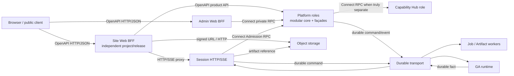

# Kokoro Contract、Transport 与 Internal RPC 统一技术方案

## 1. 决策摘要

Kokoro 不使用一种 RPC 框架覆盖所有边界。协议由**信任面、运行角色、交互生命周期和一致性要求**决定：

| 边界 | 权威技术 | 说明 |
|---|---|---|
| Browser / public client → Site Web BFF | OpenAPI 3.1 + HTTP/JSON | 面向浏览器、CLI、Desktop 和第三方客户端的稳定公开契约 |
| Browser → Session live transport | HTTP snapshot + resumable SSE | 完整 snapshot 是恢复基线，SSE 只传增量；不用 RPC stream 替代 |
| Site Web BFF → Platform 普通产品 API | OpenAPI 3.1 + HTTP/JSON | 套餐、目录、账单、checkout、redeem、成员等资源/产品语义；生成 server client |
| Privileged/control-plane service → service | ConnectRPC + Protobuf + Buf | Admin、Admission、grant/token exchange 等命名 command/query；生成 client/server |
| Platform 同 bounded context / 同 Unit of Work | 本地 application interface | 禁止 self-RPC，禁止为了未来拆分提前引入网络失败 |
| 长任务、外部 effect、跨 owner workflow | Durable command/event + outbox/inbox | RPC 只可作为 admission façade，不是完成事实或唯一恢复源 |
| Blob、Artifact、multipart、download | HTTP upload、signed URL、object reference | 大对象不进入 protobuf message 或事件正文 |

核心选型：

- 内部 privileged/control-plane RPC 标准：**ConnectRPC + Protobuf + Buf**。
- 公开边缘标准：**OpenAPI 3.1 + generated HTTP client + runtime validation**。
- Site Web BFF 到 Platform 的普通产品查询和命令也使用 OpenAPI；“服务端调用”本身不构成采用 Connect 的理由。
- 浏览器增量标准：**resumable SSE**。
- 异步工作流标准：**owner-local outbox/inbox + durable transport**。
- tRPC 不作为跨仓或跨语言协议标准；仅允许未来在同仓、同发布单元内经 ADR 批准后局部使用。
- raw gRPC 不作为 Node 服务默认开发协议；Connect 服务需要 Python 或基础设施互操作时可以同时暴露 gRPC。
- GA 核心、graph、checkpoint、namespace、terminal 和 Session↔GA 当前控制语义不在本方案的直接修改授权内。

当前未提交的 Admin Auth HTTP 实现验证了“Web 不得直连 Platform DB”的正确方向，但其手写 URL、版本头、双份 Zod、错误和认证机制不得合入为正式 transport。它是迁移输入，不是目标实现。

## 2. 设计目标与非目标

### 2.1 目标

1. 每条跨仓边界只有一个 machine-readable 契约事实源。
2. Server、client、消息类型和校验器由标准工具生成，不手工镜像。
3. 四个子仓保持可独立 clone、构建、测试、发布和回滚。
4. 不出现 sibling source import 或跨服务 DB 写。
5. Site、actor、namespace、workload、environment 和 audience 的语义不由调用方裸 header 自签。
6. effect command 的 timeout、重复请求、commit outcome unknown 和恢复路径可以机械验证。
7. current / previous release rolling window 和 breaking change 在合并前失败。
8. 支持未来 CLI、Desktop、IDE 和 Python consumer，而不把协议绑定到 TypeScript router 类型。
9. 保留浏览器原生 HTTP、缓存、SSE、文件下载和调试体验。
10. 框架解决 transport boilerplate，但不吞掉 domain owner、事务、幂等、receipt 和 saga 语义。

### 2.2 非目标

- 不把 Platform 每个 package 变成微服务。
- 不为同进程模块创建 Connect endpoint。
- 不把 Redis Streams、Kafka 或任一 broker 声称为领域契约本身。
- 不通过自动 retry 掩盖 effect outcome unknown。
- 不让浏览器直接持有内部 workload credential。
- 不在本方案中改变 GA 的执行内核或 namespace 规则。
- 不要求一次性把全部历史 YAML wire contract 迁成 protobuf。
- 不创建第五个业务子仓或独立 contracts 仓库。

## 3. 当前问题

### 3.1 多套手写 transport 已经漂移

当前至少存在：

- Platform `callService()`：手写 fetch、Zod、`{data}/{error}` envelope 和 caller secret。
- Session billing/model/hub clients：再次手写 fetch、Zod、路径、错误和 headers。
- Web user BFF：为 Session、User、Site、Hub、Payment 分别维护代理和 DTO 映射。
- Admin Web：页面 schema、generic fetch、Next rewrite 和数据库访问混合。
- 在途 Admin Auth：又创建 contract-version header、proxy secret、重复 Zod 和错误字符串。

结果是 payload 只有局部单源，service、method、错误、metadata、deadline、receipt、retry class 和版本窗口仍由每个调用方自行实现。

### 3.2 边界方向错误不能靠换框架修复

- Admin Web 直接读写 Platform Admin 数据库，违反唯一 owner。
- Session 当前分别调用 Hub、Model 和 Credit，把 Platform admission 业务编排泄漏到 transport 层。
- Platform payment→credit、credit→site/user 等调用中，有些实际属于同一 Platform workflow，却被网络接口切碎。
- Session 与 Agent 在部分 Mongo collection 和 workspace 上共享可变状态，破坏独立部署和回滚。

这些问题必须先重画 owner 和 workflow。把手写 HTTP 机械替换成 Connect 只会把错误边界类型化。

### 3.3 当前契约生成器覆盖不完整

根 `contract/spec/*.yaml` 和 `contract/generate.py` 已为 Agent/Session/Web 事件与部分 payload 提供单源和 mirror parity，这是可保留的基础。但它没有完整描述：

- service 与 method；
- request / response / error details；
- query、path、headers 和 content types；
- workload identity、deadline 和 trace；
- idempotency、request digest 和 receipt；
- streaming framing、heartbeat 和 recovery；
- 标准 breaking rules。

新 internal RPC 不再扩展自制抽象类型系统，而采用 Protobuf/Buf。公开 HTTP 不再由不完整 Fastify route metadata临时拼装，而以完整 OpenAPI 文档为事实源。

## 4. 目标上下文与容器



### 4.1 Site Web

- 每个 Site Web 是独立项目、artifact、部署和 public origin。
- 浏览器只与自己的同源 BFF 通信，不感知其他 Site 使用同一后端。
- Site 选择、开放 surface、套餐展示和功能入口由部署配置与 Platform Site 配置共同决定。
- 普通产品 API 使用按 contract/audience 拆分的 generated OpenAPI server client；控制面 client 使用独立 Connect package。
- 所有 server-only client 必须通过 export/build gate 证明不会进入浏览器 bundle。
- Site Web 不直连任何 Platform、Session 或 Hub 数据库。

### 4.2 Platform

- 一个 `kokoro-platform` repository 可构建一个或多个 immutable artifact，并运行多个 role。
- repository、artifact 和 deployment role 是不同轴；role 独立伸缩不要求新建子仓。
- Platform 内同一 bounded context 使用本地 application interfaces 和 owner-local repository。
- 只有真实独立 process / failure / scaling / security boundary，且 operation 属于 privileged/control plane 时才暴露 Connect service。
- 面向 Site 产品的资源、查询和普通命令由版本化 OpenAPI façade 暴露，即使调用方 BFF 也不改成 Connect。
- Platform 对 Session 暴露粗粒度 Admission façade，而不是让 Session 编排 Model/Credit/Hub。

### 4.3 Session

- 对 Browser/BFF 拥有 HTTP snapshot、message/control API 和 SSE。
- 拥有 sessions/messages/runs/session_events、cursor 和浏览器 projection。
- 不执行 Agent，不拥有 Model/Credit/Plan/Payment 业务决策。
- 对 Platform 只依赖 `PrepareRun`、`FinalizeRun` 和 receipt/reconcile 等窄 application port。
- 对 GA 使用 durable command/event，不把 run execution 改成同步 RPC。

### 4.4 GA

- 继续只消费 opaque `namespace`。
- 不接收 `siteId/userId/ownerId/workspaceId` 第二身份轴。
- 本方案不改变 graph、handoff、checkpoint、terminal 和能力装配内核。
- 未来若为 GA 增加 gRPC/Connect client，必须单独评审并取得用户授权。

## 5. 契约事实源与目录

目标根目录：

```text
contract/
  proto/
    kokoro/common/v1/
      error.proto
      identity.proto
      receipt.proto
    kokoro/platform/admin/v1/
      admin_auth.proto
    kokoro/platform/admission/v1/
      admission.proto
    kokoro/platform/site/v1/
      site_query.proto
    kokoro/platform/commerce/v1/
      commerce.proto
    kokoro/platform/capability/v1/
      capability.proto
  openapi/
    site-web-v1.yaml
    admin-web-v1.yaml
    session-v1.yaml
  events/
    execution/
    platform/
  spec/
    ... existing transition-era YAML sources
  registry/
    boundaries.yaml
    releases.yaml
  buf.yaml
  buf.gen.yaml
  check.py
  generate.py
```

规则：

1. `.proto` 定义 private privileged/control-plane service-to-service RPC。
2. OpenAPI 3.1 定义 public/browser HTTP，以及 Site BFF 使用的普通 Platform 产品 API。
3. Event schema 定义 durable facts/commands；transport binding 独立登记。
4. 既有 `spec/*.yaml` 在迁移完成前继续作为对应旧 wire 的事实源，不允许出现同一个边界的三套 authority。
5. 生成物提交进各子仓，使独立 clone 不需要读取 sibling source。
6. 每个生成 mirror 带 source path、source digest、generator/runtime version。
7. 根 CI 运行 generate + diff、Buf lint/breaking 和 mirror parity。
8. 子仓 CI 运行本仓生成物 typecheck、client/server tests 和 pinned contract digest check。
9. 根 compatibility registry 记录 provider、consumer、service/version、artifact digest 和 N/N-1 scenarios。
10. V1 不依赖托管 BSR；未来可把 BSR 作为分发和审查增强，但本地/CI 必须可离线复现。

## 6. Internal ConnectRPC 标准

Connect 的采用条件不是“双方都是 TypeScript”或“双方都是服务端”，而是 operation 属于私有 application control plane，例如：

- Admin Auth、operator approval 和 privileged receipt；
- Session→Platform `PrepareRun` / `FinalizeRun` / receipt；
- audience-bound workload grant/token exchange；
- 独立 Job/Capability role 的窄控制命令或 typed internal stream。

套餐、目录、账单摘要、checkout、redeem、成员管理和 Site 产品 projection 使用 OpenAPI product API，不因 BFF 是服务端而切换 Connect。

### 6.1 Server 与 client

- Node provider：`@connectrpc/connect` + `@connectrpc/connect-fastify`。
- Node consumer：`@connectrpc/connect` + `@connectrpc/connect-node`。
- Schema/runtime：Protobuf-ES 与 Buf generation，精确 pin major/minor。
- Validation：Protovalidate rules + owner application validation；security/effect input 不依赖默认值猜测。
- 默认开发 transport：Connect JSON / HTTP 1.1，便于现有 ingress 和本地调试。
- production 可使用 Connect binary / HTTP 2；需要 Python 时由同一 server 暴露标准 gRPC。
- Python 首发 client 优先成熟 `grpcio`；不把 beta Connect Python 设为 GA 硬依赖。

### 6.2 Version

- protobuf package 必须含 major：`kokoro.platform.admin.v1`。
- v1 内只做 additive、compatible evolution。
- 删除、改变 wire type、改变 required semantic 或复用 field number 均禁止。
- incompatible change 新建 v2 service/message，并提供迁移窗口。
- 不再使用 `x-kokoro-contract-version` 手工协商版本。
- Buf `FILE` breaking gate 为默认；若生成语言布局需要放宽，必须有 ADR 和 consumer inventory 证据。

### 6.3 Metadata 与 identity

Transport metadata 只承载 hop-level context：

- workload credential / mTLS identity；
- audience、environment、role 和 release revision；
- deadline；
- W3C `traceparent` / `tracestate`；
- correlation/causation safe refs；
- request ID。

Domain/security request message 承载 owner 需要持久化或签名验证的业务引用。调用方不能通过裸 metadata 自签 Site、actor、scope 或 entitlement。

统一 server interceptor：

1. 验证 workload identity、audience、environment 和 credential rotation window。
2. 解析并只收紧 deadline。
3. 创建 RequestSecurityContext。
4. 绑定 trace/correlation。
5. 限制 header、message size、compression ratio 和 concurrency。
6. 记录安全审计与 RPC metrics，不记录 secret/PII/raw payload。
7. 把 transport error 映射为 canonical Connect code + typed safe detail。

本地开发可以由 interceptor 暂时兼容 per-caller static secret，但必须集中封装、标记 migration expiry，业务 handler 不得读取这些 legacy headers。

### 6.4 Error

Connect canonical code 只表达 transport/application error class；Kokoro domain detail 使用生成 message：

```text
KokoroErrorDetail {
  domain_code
  retry_class
  request_id
  correlation_id
  safe_details
  retry_after
  receipt_ref
  required_contract_version
}
```

推荐映射：

| 场景 | Connect code | Retry |
|---|---|---|
| schema / semantic validation | InvalidArgument | no |
| missing workload credential | Unauthenticated | no |
| scope / Site / action denied | PermissionDenied 或 non-disclosing NotFound | no |
| optimistic version / digest conflict | Aborted / FailedPrecondition | refresh/reconfirm |
| quota / concurrency | ResourceExhausted | bounded retry-after |
| pre-effect dependency unavailable | Unavailable | same identity only if registry allows |
| deadline expired | DeadlineExceeded | query same receipt before retrying effect |
| unknown owner failure | Internal | no blind retry |

`accepted_pending`、`committed` 和 `outcome_unknown` 是业务 receipt 状态，不应只靠 Connect code 表达。

### 6.5 Command 与 query

不是每个 request 都套万能 envelope。

- Query 使用具体 request message；通用 hop context 放 interceptor metadata。
- 只有会产生持久 effect 的 command 显式包含：
  - `command_id`
  - `idempotency_key`
  - `request_digest`
  - `expected_version`（需要时）
  - `issued_at`
  - `security_epoch_refs`
- Owner 必须持久化 authoritative receipt。
- 同 identity + 同 digest 返回同 receipt；同 identity + 不同 digest 返回 conflict。
- Caller timeout 后调用 `GetCommandReceipt`，不得换 command identity 或 fallback owner。
- Query 可以按 registry 有界 retry；command 默认不自动 retry。

### 6.6 Streaming

- Connect server streaming 只用于 typed、短期、可重建或有明确 resume token 的内部数据流。
- Browser Chat 继续 SSE，不切 Connect-Web stream。
- Provider、Payment、Grant、Credit、Notification 等 effect 的最终事实必须 durable，不能只存在于 RPC stream。
- Full duplex 只有真实需求与基础设施证据后启用，不因框架支持而默认使用。

## 7. Public HTTP/OpenAPI 标准

### 7.1 适用边界

- Browser → Site Web BFF。
- Browser → Admin Web BFF。
- Site Web BFF → Session HTTP/SSE（Session 是浏览器 transport owner）。
- Site Web BFF → Platform 的普通产品查询和命令。
- CLI/Desktop/IDE 的稳定 public access plane。
- Upload/download、signed URL、share、webhook 和第三方 integration。

### 7.2 生成链

- OpenAPI 3.1 文件是 public route、method、params、body、response、error 和 security 的事实源。
- Server registration 必须被契约约束；禁止只有 summary/request 而缺 response/error。
- TypeScript 使用生成的 `openapi-fetch` client 或等价薄 client。
- Runtime validator 从同一 schema 生成；不能以 TypeScript compile-time 类型代替入站校验。
- 测试 fixture、MSW handler 和 client types 从相同 document 派生。
- CI 运行 schema validation、breaking comparison、generated diff 和 route coverage。

### 7.3 BFF 安全

- Browser client 只发送同源 cookie、CSRF/interaction token 和公开 request body。
- BFF 从 session/auth state 构造 RequestSecurityContext，再通过 server-only client 调用后端。
- 禁止浏览器提交或覆盖 workload identity、Site grant、namespace、operator role 或 internal secret。
- BFF route 必须 allowlist method/path/content type；删除无边界的 generic catch-all proxy。
- request/response body、upload、header、timeout 和 downstream concurrency 有明确限制。
- Site Web 的 server client 不进入 client bundle，构建测试必须证明 secret-free。
- OpenAPI product command 与 Connect command 一样必须定义 command identity、digest、expected version、typed receipt 和 outcome-unknown；禁止按 HTTP 5xx 猜重试。

## 8. Session HTTP/SSE 标准

- `GET session snapshot` 返回完整可渲染 projection 和 watermark。
- SSE 只传 watermark 之后的增量，不要求浏览器回放全历史建立真相。
- cursor 是绑定 Site、session、subject generation、stream epoch、schema revision 和 expiry 的 opaque token。
- cursor malformed、ahead、expired、cross-Site 分别返回 typed recovery/error；过期要求重新获取 snapshot。
- SSE 支持 heartbeat、server retry hint、deploy drain、slow-consumer byte bound 和 max connection duration。
- Web 使用成熟 SSE parser，覆盖 CRLF、`id`、`event`、`retry`、partial chunk 和 max buffer；不再用 `\n\n` 手切。
- reconnect 使用 exponential backoff + jitter，并服从 server retry hint 和 retry classifier。
- browser stream credential 短期、resource-bound；revoke/expiry 在预算内关闭 active connection。

## 9. Durable command/event 标准

- 每个 mutable collection、aggregate、outbox 和 inbox 只有一个 owner。
- Producer 在 owner transaction 内 append outbox。
- Consumer 使用 `(event_id, consumer, handler_revision)` inbox 去重。
- Broker ack 只在 consumer-local durable commit 后发生。
- Event 只陈述 owner 已提交事实；command 请求 owner 执行动作。
- duplicate、out-of-order、late、gap、trim 和 replay 必须有 reducer/recovery 策略。
- DLQ 不是 terminal；记录 user impact、owner、next action、SLA 和 replay policy。
- replay 不得重复 Provider、Payment、Grant、Credit、Notification 或 target effect。
- Redis Streams 可以作为 V1 transport，但不能是唯一持久真源或跨服务共享数据库的替代品。

Session↔GA 的目标边界：

- Session owner-local：RunLaunch projection + command outbox + control outbox。
- Agent owner-local：command inbox + execution ledger + event outbox。
- 会改变长期 Session snapshot 的 Agent fact 必须 durable；只有纯 delta 可 best effort。
- Session projection failure 进入 quarantine/DLQ，不得反向伪造 GA `run.failed`。
- 该迁移涉及 GA storage adapter 时必须先与用户对齐；本方案本身不授权修改 GA core。

## 10. 关键 façade

### 10.1 Platform Admission Service

Session 不再逐个调用 Hub、Model 和 Credit。目标 service：

```text
PrepareRun(request)
  → admission_receipt
  → resolved opaque execution manifest/reference
  → accepted / denied / pending / outcome_unknown

FinalizeRun(request)
  → settlement_receipt
  → committed / pending / outcome_unknown

GetAdmissionReceipt(command_id, request_digest)
GetSettlementReceipt(command_id, request_digest)
```

Platform 内部负责：Site、account、plan/entitlement、model policy、capability policy、credit hold 和 restriction 的一致业务编排。Session 只保存不可变 manifest/ref 和 receipt projection。

### 10.2 Admin Auth Service

首个 Connect pilot：

```text
AdminAuthService.v1
  GetOperatorByEmail
  GetOperator
  CreateVerificationToken
  ConsumeVerificationToken
  RecordAuthEvent
```

要求：

- Operator、verification token 和 auth event 的数据 owner 是 Platform Admin。
- Web Auth.js adapter 只依赖 application-level `AdminAuthClient` port。
- email 放 request body，不放 query URL。
- consume 原子、不可重复。
- create/event 有 idempotency identity 或明确 at-most-once/reconcile 语义。
- 登录安全审计是否 fail-closed 由 Admin Auth policy 明确，不由 Web 吞错决定。
- 切换后删除 Web Prisma schema/client/env/scripts/dependencies。

### 10.3 Site/Product façade

- Site resolution、公开 product config、plan catalog 和 feature exposure 由 Platform façade 提供。
- Site Web BFF 使用生成的 OpenAPI product client；浏览器只看到该 Site 的同源 public HTTP view。
- `ExchangeSiteContext`、audience-bound grant/token exchange 等 control-plane operation 使用单独的 Connect service/client。
- Site 隔离是默认 query context，不在表名、package 名或 URL 中机械添加 `site*` 前缀。
- 不同 Site 不共享账户；未来共享身份通过标准 OAuth/federation 建立显式关系。

## 11. 契约发布与独立子仓

为兼顾独立部署与零 sibling import：

1. 根仓拥有 schema source、generator config 和 compatibility registry。
2. 生成代码提交到 provider/consumer 子仓的 `src/generated/` 或专用 generated package。
3. 子仓只 import 自己仓内生成物，不从根或 sibling runtime import。
4. 每次 schema promotion 生成各子仓 commit，再由根仓更新精确 gitlink 和 BOM。
5. 根 runner 在 clean recursive clone 中验证所有生成 mirror、provider/consumer scenarios 和 artifact digest。
6. 根 checkout 之外的 Site Web 独立项目使用固定 contract artifact/digest；不使用 workspace source 作为生产依赖。
7. 外部 Site Web 使用按 contract、audience 和 major version 拆分的 immutable SDK，例如 `@kokoro/platform-site-api-v1`，不发布万能 `@kokoro/api-client`。
8. Browser/server、OpenAPI/Connect、Site/Admin/Session SDK 分包；server credential interceptor 不得进入 browser package。
9. 将来可以使用 npm/Python registry 或 BSR 分发，但不得让 registry availability 成为本地构建单点。

同一个远程 operation 只能有一个权威 transport contract。Browser façade 可以映射到 internal application handler，但不能让同一 `PrepareRun` 同时存在可写 OpenAPI 和 Connect 两个 authority。

## 12. 可观测性与运行

统一指标：

- RPC latency/count by service/method/code/retry class；
- deadline exhaustion；
- auth/audience/environment reject；
- command accepted/unknown/receipt lookup；
- contract mismatch；
- outbox lag、inbox duplicate、DLQ age、replay；
- SSE open/reconnect/cursor recovery/slow consumer/drain；
- per-Site fairness，但禁止高基数 Site ID 直接作为通用 metrics label。

日志与 trace：

- 记录 contract、service、method、release、request/correlation/receipt safe refs。
- 不记录 token、cookie、verification token、email query、prompt、raw provider payload 或卡密。
- OTel interceptor/middleware 统一注入；业务模块不自行拼 trace headers。

运行手册必须覆盖：

- command timeout after commit；
- receipt missing/unknown；
- contract version skew；
- credential rotation；
- outbox stuck / poison event；
- SSE drain / cursor expiry；
- provider N + consumer N-1 rollback。

## 13. 迁移顺序

### Wave T0 — Contract foundation

- 建立 proto/OpenAPI/events 三类 source 目录。
- Pin Buf、Protobuf-ES、Connect 和 OpenAPI generation versions。
- 增加 lint、breaking、generate、diff、digest 和 N/N-1 gates。
- 建立 boundary registry：owner、caller、audience、protocol、deadline、retry、receipt 和 failure owner。
- 冻结每个 operation 的唯一 transport；禁止同名 OpenAPI/Connect 双 authority。
- 不改变运行行为。

### Wave T1 — Admin Auth pilot

- 用 `AdminAuthService.v1` 替换未提交手写 transport。
- Platform Fastify 注册 Connect handler。
- Admin Web 使用生成 Node client，完成 Auth.js wiring。
- 删除 Web 对 Platform Admin DB 的全部访问和 Prisma 依赖。
- 增加真实 provider/consumer compatibility、timeout-after-commit 和 auth negative tests。

### Wave T2 — Public Admin API

- 为 Admin Browser API 建完整 OpenAPI。
- 生成 browser client/runtime validators。
- 删除透明 catch-all rewrite、页面手写 schema 和丢失 domain code 的 generic fetch。
- 普通 Admin browser HTTP 与 privileged Admin BFF→Platform Connect 保持两个不同 trust plane，不共享万能 client package。

### Wave T3 — Platform Admission

- 定义 Prepare/Finalize/Receipt。
- Platform 内部先收拢 Site/User/Model/Capability/Credit orchestration。
- Session shadow compare 新旧决策，随后切 generated Connect client。
- 删除 Session 对 Hub/Model/Credit 的分散业务调用；billing product read 迁 Web BFF→Platform。

### Wave T4 — Session HTTP/SSE

- 标准化 Session OpenAPI、完整 snapshot 和 generated Web client。
- 使用成熟 SSE parser，落地 opaque cursor、heartbeat、backpressure、drain 和 typed recovery。
- 删除依赖全历史 SSE hydrate 的路径。

### Wave T5 — Durable ownership closure

- 为 Session/Agent 建 owner-local outbox/inbox 和 migration evidence。
- 消除共享 mutable Mongo collection 和 writable workspace。
- GA adapter/core 变更前暂停并与用户对齐。

### Wave T6 — Legacy removal

- consumer inventory 归零后删除 hand-written internal clients、重复 Zod mirror、legacy version headers 和 shared-secret business reads。
- 保留 public HTTP adapter 和必要的 current/previous compatibility window。

## 14. 验证矩阵

| 面 | 必须证明 |
|---|---|
| Schema | Buf/OpenAPI lint、breaking、generated diff、digest determinism |
| Compatibility | provider N + consumer N/N-1；incompatible client 得到 upgrade-required |
| Boundary | no sibling import、no cross-service DB access、no self-RPC |
| Auth | workload/audience/environment/Site/action/epoch/revocation negative matrix |
| Command | duplicate、digest mismatch、timeout-after-commit、same receipt reconcile |
| Query | deadline、bounded retry、non-disclosure、pagination/cursor binding |
| Admin Auth | atomic consume、email 不进 URL/log、Web 无 Platform DB credential |
| Admission | Prepare/Finalize/Receipt 守恒；Session 不编排 Model/Credit/Hub |
| SSE | clean snapshot、race、resume、expiry、cross-Site、heartbeat、slow consumer、drain |
| Durable | outbox crash、publish failure、duplicate、gap、trim、replay、DLQ |
| Deployment | 四子仓独立 build/release/rollback；immutable BOM/gitlinks |
| Load | 10k SSE/24h、100 admission/s、per-Site fairness 和 dependency outage |
| Secrets | browser bundle、logs、metrics、fixtures 和 docs 均无真实 credential |

## 15. No-Go 条件

任一成立则不得 promotion：

- 新增手写 internal fetch + duplicated schema。
- 同一远程 operation 同时存在 OpenAPI 与 Connect 两个可写 authority。
- tRPC router type 跨子仓 import。
- Web/Session 读写 Platform 数据库。
- Platform 同事务模块通过 loopback/self-RPC 交互。
- effect command 没有 idempotency/receipt/outcome-unknown 策略。
- timeout 后换 identity 或 fallback owner。
- 浏览器收到 workload secret 或可自签 Site/namespace header。
- RPC stream/Redis stream 被当作唯一 durable truth。
- generated code 与 schema digest 不一致。
- browser/server、OpenAPI/Connect 或不同 audience 被打进一个万能 generated client package。
- 仅 provider 测试通过，没有真实 consumer compatibility。
- 以 `latest` 或未记录 digest 的 artifact 声称可独立回滚。
- 未获授权修改 GA core、namespace 或 terminal semantics。

## 16. 验收标准

### AC-CT-01 — 公开与内部协议不会混淆

```gherkin
Given 浏览器访问一个独立 Site Web
When 它执行产品查询、创建消息并订阅会话增量
Then 浏览器只使用该 Site 的 OpenAPI HTTP/SSE
And 内部 workload credential 与 Connect endpoint 不进入浏览器 bundle
```

### AC-CT-02 — 独立服务使用生成 RPC

```gherkin
Given Admin Web 与 Platform Admin 独立部署
When Auth.js 查找 operator 或消费 verification token
Then Web 使用由同一 proto 生成的 Connect client
And Platform 使用同一 proto 生成的 handler
And 两边不存在重复手写 schema、URL 或版本头
```

### AC-CT-03 — Platform 不 self-RPC

```gherkin
Given Plan、Credit 和 Payment 属于同一 Platform workflow 与 Unit of Work
When Redeem 或 Checkout 产生 Grant
Then workflow 使用 owner-local application interfaces 和明确事务
And 不通过网络 adapter 假装本地原子性
```

### AC-CT-04 — Session 不拥有 Platform 决策

```gherkin
Given 用户启动一个 Run
When Session 请求 admission
Then Platform 在 PrepareRun 内解析 Site、entitlement、model、capability 和 credit hold
And Session 只保存 manifest/ref 与 receipt projection
And Session 不分别调用 Hub、Model 和 Credit 做业务编排
```

### AC-CT-05 — Timeout 不重复 effect

```gherkin
Given owner 已 commit command 但 response 在返回前丢失
When caller deadline 到期并恢复
Then caller 使用相同 command identity 与 digest 查询 authoritative receipt
And 不创建新 identity、不 fallback、不重复 effect
```

### AC-CT-06 — SSE 可恢复

```gherkin
Given 浏览器拥有完整 snapshot 与合法 opaque cursor
When SSE 断开、服务 drain 或 cursor 过期
Then 合法 cursor 可无重复恢复
And 过期 cursor 返回 typed snapshot-required
And cross-Site 或 stale-subject cursor 在读取前被拒绝
```

### AC-CT-07 — 子仓独立

```gherkin
Given 任一 provider 或 consumer 子仓被独立 clone
When 它在无 sibling source 的环境构建和测试
Then 它只使用本仓生成 mirror 与固定 contract digest
And root clean-clone compatibility runner 证明 provider N 与 consumer N/N-1 可互操作
```

## 17. 参考与关联文档

- `docs/superpowers/specs/2026-07-25-platform-modular-core-internal-rpc-design.md`
- `docs/superpowers/specs/2026-07-25-platform-web-session-target-architecture-design.md`
- `docs/superpowers/specs/2026-07-25-platform-web-session-p0-contract-closure-design.md`
- `docs/superpowers/specs/2026-07-25-session-http-sse-production-transport-design.md`
- `docs/superpowers/specs/2026-07-25-wave-0-repository-contract-foundation-design.md`
- `docs/kokoro-handbook/decisions/ADR-007-kokoro-platform-submodule.md`
- `docs/kokoro-handbook/decisions/ADR-008-agent-session-web-standard-runtime.md`

外部技术依据只用于技术选择，长期 Kokoro 规则以上述本地规范为准：ConnectRPC、Buf、Protobuf、OpenAPI、Fastify、Next.js BFF 和标准 SSE。
