<!-- markdownlint-configure-file {"MD013": {"line_length": 120, "code_blocks": false, "tables": false}} -->

# Kokoro 代码分类法与 Presentation 边界硬切方案

## 1. 决策摘要

Kokoro 采用一次 prelaunch hard
cut，纠正当前把 AG-UI 协议名、运行角色、持久化实现和业务 owner 堆叠进同一目录与符号的问题。

核心决策：

1. **Presentation 是 Session 拥有的浏览器安全读模型边界。**
   AG-UI 只是该边界的一种 wire adapter，不是 domain、数据库或 application
   service 的 owner。
2. **跨 Agent 到 Session 的未接纳输入统一叫 Submission。** `Candidate`
   保留给 Media 的输出候选，避免同一词同时表示协议输入和业务输出。
3. **目录提供上下文，符号只表达剩余差异。** `@kokoro/session/presentation`
   下使用 `PresentationReader`，不重复写成 `SessionAguiPresentationReader`。
4. **Authority 只表示真实决策权或安全权威。** 普通值和窄协作者分别使用
   `Snapshot`、`Update`、`Resolver`、`Allocator`、`Issuer`、`Policy`。
5. **Generated code 使用一种可预测布局。**
   每个子仓本地提交生成物，保持独立构建；TypeScript compilation unit 统一为
   `src/generated/{proto,schema,contracts}`，Python
   protobuf 保持 package-derived output，不再混用 `generated-*`、`*-generated`
   和邻接 `*.generated.*`。
6. **Platform 的 Admin、runtime 和 workflow 命名同步校正。**
   认证访问、查询、命令是三个职责；可执行入口、composition、host 和安全加载不再混在
   `src/process`。
7. **不保留内部兼容层。** 项目未上线，不创建旧名 alias、compat
   re-export、旧表 view 或 rename
   migration；直接重写 baseline、生成物、调用方和验证。
8. **本方案不修改 GA 核心语义。** Agent 只调整 presentation adapter、delivery
   contract 和模块拆分；DeepAgents
   graph、checkpoint、namespace、handoff、terminal、control
   semantics 均保持不变。

推荐结构采用务实的 hexagonal/ports-and-adapters。稳定 domain/application 不依赖 AG-UI、Connect、PostgreSQL。

Next.js、assistant-ui 等边界技术只出现在 interfaces/infrastructure/adapters。

## 2. 背景与当前问题

### 2.1 名字过长是边界混乱的症状

当前 Session `src/presentation/agui/` 同时包含：

- Session presentation domain state；
- submission admission 与 projection application service；
- Agent Presentation Connect client/consumer；
- PostgreSQL repository、reader 与 unit of work；
- AG-UI schema、codec、profile 与 JCS；
- browser snapshot/SSE；
- generated contract 与 vendored schema source；
- compatibility provider。

因此公开 API 被迫重复
`Agent + Agui + Candidate + Presentation + Runtime + Postgres` 等上下文，产生
`createPostgresAgentAguiCandidateRuntime`
一类无法快速理解的符号。与此同时，目录 INDEX 声称该边界“transport-agnostic”，核心 projector 却直接依赖
`@ag-ui/core`，职责描述与依赖事实矛盾。

### 2.2 协议品牌进入持久化 owner

Session 当前 durable tables、trigger、policy 与 grants 使用
`agui_presentation_*` 和
`agui_agent_candidate_*`。这些表实际保存 Session 拥有的 stream、binding、owner
state、submission inbox 与 receipt。以 wire
protocol 命名数据库会让 Session 的长期事实生命周期错误绑定到一个第三方协议版本。

### 2.3 五个阶段使用了重叠词汇

现有实现混用 `candidate`、`presentation`、`activity`、`projection`、`authority`
和 `runtime`，但真实链路包含五个不同阶段：

```text
Agent display fact
  -> submission
  -> Session admission
  -> durable presentation stream record
  -> AG-UI event / SSE frame
  -> Web chat projection
```

同一个词跨阶段复用，会使错误重试、幂等键、sequence 和 owner
version 的含义难以判断。

### 2.4 Generated 目录没有统一语法

当前四仓存在 `generated-*`、`*-generated`、`generated/`、邻接
`*.generated.ts`、两套重复 contract source
tree。目录名有时编码 peer，有时编码 operation，有时编码 version，有时什么都不编码。开发者无法从路径判断：

- 生成来源是 Protobuf 还是 JSON Schema；
- 当前仓是 provider 还是 consumer；
- contract family 与 version；
- 文件是否允许手改；
- 多个 common proto 是否是同一类型实例。

### 2.5 Platform 与 Web 也有相同分类错误

- Platform `admin` 同时承担 OIDC、operator
  session、authorization 和 query；`admin-control`
  承担 command、approval、receipt；deployable 又叫 `platform-admin`。
- `src/process` 混合 executable、composition root、reusable host 和 secret
  loading。
- `src/workflows/commerce` 实际是 Commerce 内部 application
  policy，不是跨 bounded-context orchestration。
- Web `chat-surface` 实际是 browser projection 与 assistant-ui adapter；其
  `ChatAguiPresentationMutation` 又把 wire 名带入产品状态。

## 3. 目标与非目标

### 3.1 目标

1. 新开发者从目录和公开 barrel 即可判断 owner、职责、依赖方向和运行角色。
2. AG-UI 只出现在 wire-specific
   schema、codec、frame、profile、compatibility 和 upstream lock。
3. Session presentation core 可在不加载
   `@ag-ui/core`、PostgreSQL、Connect 或 browser server 的情况下测试。
4. Web Chat state 不暴露 AG-UI
   discriminant；未来 CLI/Desktop/IDE 可消费同一 Session
   contract，而不复制产品 reducer。
5. Root Proto/Schema、Agent producer、Session consumer、Web
   consumer 使用一套阶段词汇和 sequence 语义。
6. 数据库对象以 Session domain fact 命名，而不是以第三方协议或 ORM 命名。
7. 生成目录在四仓一致，并由机器阻止手改、漂移和跨仓 sibling import。
8. Platform Admin 的 access/query/command 职责可独立理解，但继续由同一个
   `platform-admin` deployable 按需组合。
9. hard cut 后没有旧路径、旧符号、旧表、兼容 view 或双 contract authority。

### 3.2 非目标

- 不创建第五个业务仓库或 contracts 仓库。
- 不把 Platform 每个 module 变成微服务。
- 不建立通用 multi-wire plugin framework；当前只隔离 AG-UI
  adapter，为未来替换保留边界。
- 不修改 Agent graph、checkpoint、handoff、terminal、namespace 或 tool-control
  semantics。
- 不改变 Session、Platform、Agent、Web 的既定 data owner。
- 不把 presentation 误写成 Web rendering owner；Session 只拥有 browser-safe read
  model 和 stream，Web 拥有 UI composition。
- 不为旧数据编写迁移或双写。开发数据库按新 baseline 重建。

## 4. 统一语言

| 概念                                     | 唯一术语             | 禁止混用                                       |
| ---------------------------------------- | -------------------- | ---------------------------------------------- |
| Session 浏览器安全读模型边界             | `Presentation`       | `AguiPresentation` 作为 domain 名              |
| Agent 到 Session 的待接纳输入            | `Submission`         | `Candidate`                                    |
| Agent append-only transport 包装         | `DeliveryRecord`     | `PresentationCandidateRecord`                  |
| Session 接受/拒绝决定                    | `Admission`          | `ProjectionResult`                             |
| Session 持久化可重放项                   | `StreamRecord`       | `Row` 作为公开 API                             |
| HTTP/SSE 传输单元                        | `Frame`              | `Record`                                       |
| 完整恢复状态                             | `Snapshot`           | `SnapshotAuthority`                            |
| 私有执行 identity 到公开 identity 的关联 | `Binding`            | `MappingAuthority`                             |
| 一次完整 binding replacement 或 none     | `BindingUpdate`      | `BindingAuthorityDelta`                        |
| 版本化 display fact 的逻辑身份           | `Owner`              | `Activity`，除非确指 AG-UI `ACTIVITY_SNAPSHOT` |
| Session 最新 owner read state            | `OwnerState`         | `OwnerProjectionRow`                           |
| Session materialized read model          | `Projection`         | Agent planner state                            |
| Agent 传输顺序                           | `deliverySeq`        | `presentationSeq`                              |
| Session durable 顺序                     | `durableSeq`         | `deliverySeq`                                  |
| owner replacement 版本                   | `ownerVersion`       | `projectionVersion`                            |
| materialization 版本                     | `projectionRevision` | `ownerVersion`                                 |
| contract family 版本                     | `contractRevision`   | `profileRevision`                              |
| shape 版本                               | `schemaVersion`      | `schemaRevision`                               |
| cursor codec 版本                        | `cursorRevision`     | `cursorProfileRevision`                        |

`Candidate` 只保留在 Media bounded
context，表示同一次 MediaOperation 的多个输出候选。`Activity` 只保留在 AG-UI
wire event 和 Web 展示 activity 概念。`Runtime` 只用于真正拥有 process
lifetime、start/stop、资源和 concurrency 的组件，不用于普通 application
service 或 transaction wrapper。

### 4.1 Sequence、revision 与幂等语义

以下语义是 hard cut 后的规范，不是命名建议：

| Axis                 | Scope                                               | Initial/advance                                                             | Replay and failure rules                                                                                                                   |
| -------------------- | --------------------------------------------------- | --------------------------------------------------------------------------- | ------------------------------------------------------------------------------------------------------------------------------------------ |
| `eventOrdinal`       | one Agent internal run and immutable producer fence | first submission is `0`; every submission advances exactly one              | same ordinal + same submission digest is replay; different digest is collision; gap is permanent rejection                                 |
| `deliverySeq`        | `(runId, producerInstanceRef, producerGeneration)`  | first record is `1`; `deliverySeq = eventOrdinal + 1`; contiguous uint64    | pull freezes a head; ACK advances only a contiguous prefix; quarantine is exactly first unacknowledged record; terminal seal is write-once |
| `durableSeq`         | `(siteId, sessionId, streamEpoch)`                  | empty head is `0`; first record is `1`; every committed record advances one | same source identity + same frame digest is replay; mismatch is collision; gap rolls back the entire admission transaction                 |
| `projectionRevision` | same Presentation stream epoch                      | empty projection is `0`; each accepted StreamRecord advances one            | semantically independent from `durableSeq` even when values currently match; overflow fails closed; new epoch resets to `0`                |
| `ownerVersion`       | one immutable `presentationOwnerBindingRef`         | first version is positive; later versions are non-decreasing and may skip   | same version requires identical canonical owner state; lower version conflicts; terminal owner cannot revive                               |

`producerGeneration` is part of the producer fence and never silently resets a
run stream. A different generation without the exact execution-owner reclaim
evidence is fenced. `streamEpoch` is Session-issued; a new epoch creates a new
empty Presentation stream while prior epochs remain immutable and replayable
under their original grant. Neither axis is inferred from timestamps.

Submission deduplication identity is
`(runId, producer fence, deliverySeq, submissionRef, submissionDigest, recordDigest)`.
Presentation domain deduplication identity is
`(siteId, sessionId, streamEpoch, publicSourceEventId, durableSeq, streamRecordDigest)`；wire
materialization identity adds `(wireProfileRevision, frameDigest)` and must bind
that exact domain record. Any partial match with a different digest is an
identity collision, not an idempotent replay. A browser cursor names an already
committed durable head; it never authorizes a write or repairs a server-side
gap. Gap repair always starts from an authoritative HTTP Snapshot and a frozen
replay head.

Revision fields are assigned per schema:

- domain StreamRecord and Snapshot: `contractRevision` + `schemaVersion`；
- AG-UI encoded event/frame: `wireProfileRevision`；
- opaque cursor claims only: `cursorRevision`；
- owner state only: `ownerVersion`；
- materialized Presentation state only: `projectionRevision`。

No persisted object carries all revision axes merely for convenience.

## 5. 系统上下文与依赖方向

```mermaid
flowchart LR
    GA["Agent presentation planner"]
    Delivery["Agent Presentation delivery service"]
    Admission["Session submission admission"]
    Core["Session Presentation domain/application"]
    Store["Session PostgreSQL presentation store"]
    Agui["AG-UI wire adapter"]
    Http["Session HTTP snapshot + SSE"]
    Client["Web session-client"]
    Chat["Web chat-projection"]
    UI["Chat app / assistant-ui adapter"]

    GA --> Delivery
    Delivery -->|"ConnectRPC delivery records"| Admission
    Admission --> Core
    Core -->|"domain record/state"| Store
    Core --> Agui
    Agui -->|"exact wire frame"| Store
    Store --> Http
    Http --> Client
    Client --> Chat
    Chat --> UI
```



依赖规则：

```text
Agent core events -> Agent presentation planner -> AG-UI submission encoder -> delivery
Connect client -> submission decoder -> Session admission -> Presentation domain
Presentation application -> StreamRecord + state -> ports <- PostgreSQL infrastructure
Presentation StreamRecord -> AG-UI encoder -> persisted wire frame -> HTTP/SSE interface
Web AG-UI decoder -> PresentationEvent -> ChatUpdate -> ChatProjection -> assistant-ui adapter
```

禁止边：

- Session `presentation/domain` 或 `presentation/application` import
  `@ag-ui/core`。
- Session domain/application import Prisma、pg、Connect generated code 或 HTTP
  server。
- Web `chat-projection/domain` import `@ag-ui/core` 或 Session generated wire
  schema。
- Agent presentation refactor import或修改 DeepAgents graph/checkpoint/handoff
  internals。
- 任一子仓 import sibling repository source 或 runtime filesystem path。

## 6. 目标目录

### 6.1 Root contract

```text
contract/
  proto/kokoro/agent/presentation/v1/
    presentation.proto
  spec/presentation/
    submission-v1.yaml
    domain-event-v1.yaml
    stream-record-v1.yaml
    binding-v1.yaml
    binding-update-v1.yaml
    owner-state-v1.yaml
    snapshot-v1.yaml
    ag-ui-frame-v1.yaml
  registry/presentation/
    ag-ui-version-lock.yaml
    submission-policy-v1.yaml
    owner-policy-v1.yaml
    event-map-v1.yaml
  corpus/presentation-v1.json
```

Root 继续是 contract single source of
truth。子仓只提交生成物与 provenance，不复制两套可编辑 schema source。

### 6.2 Agent（Python idiomatic layout）

```text
src/kokoro_agent/presentation/
  INDEX.md
  __init__.py
  model.py              # PresentationState、Submission、DeliveryRecord
  planner.py            # raw Agent event -> presentation facts
  delivery.py           # append/pull/ack/quarantine/status
  integrity.py          # typed digest/chain/fence
  adapters/
    ag_ui.py            # official model conversion + closed wire validation
    connect.py          # generated provider adapter
  generated/            # provenance/metadata only when not package-derived protobuf
```

Python protobuf 仍按 package-derived `kokoro/agent/presentation/v1`
生成。`presentation`
模块不采用为 TypeScript 设计的深层目录模板；通过小而聚焦的 modules 和 Pydantic
boundary models 保持 Python 惯用性。

允许修改范围：`kokoro_agent/presentation/**`、对应 generated
contract、tests 和 composition import。禁止修改 `agents/**`、graph
builder、checkpoint、handoff、terminal 和 namespace owner。

### 6.3 Session（TypeScript bounded context）

```text
src/presentation/
  INDEX.md
  index.ts
  domain/
    event.ts
    stream.ts
    binding.ts
    owner-state.ts
    transition.ts
  application/
    admit-submission.ts
    project-event.ts
    build-snapshot.ts
    read-stream.ts
  ports/
    binding-resolver.ts
    identity-allocator.ts
    stream-store.ts
    cursor-issuer.ts
  interfaces/
    ag-ui/
      profile.ts
      submission-codec.ts
      event-codec.ts
      frame-codec.ts
      canonical-json.ts
      safe-json.ts
  infrastructure/
    postgres/
      stream-store.ts
      stream-reader.ts
      admission-unit-of-work.ts
      identity-map.ts

src/interfaces/
  connect/
    clients/agent-presentation.ts
  http/
    browser-v3/
      presentation.ts

src/generated/
  proto/kokoro/...
  schema/presentation/...
  provenance.json
```

`src/generated/proto` 是每个子仓唯一 Protobuf-ES
tree；package/version 已在路径中表达，不再创建
`generated-admin-v2`、`evidence-v2-generated` 等多个平行生成根。Connect
client/provider 是 handwritten interface adapter，方向由
`interfaces/connect/clients|providers` 表达，生成 message 不复制方向性命名。

Admission 将 AG-UI Submission 解码成 protocol-neutral
`PresentationEvent`。Application projector 只处理该 domain event，生成 immutable
`StreamRecord`、BindingUpdate 和 OwnerState；随后 AG-UI encoder 生成 exact
`AgUiFrame`。同一个 PostgreSQL transaction 原子写入 domain record、wire
frame、binding/owner state、submission inbox 和 admission receipt。

`StreamRecord` 不包含官方 AG-UI event literal 或
`wireProfileRevision`；`AgUiFrame` 通过
`(siteId, sessionId, streamEpoch, durableSeq, streamRecordDigest)`
外键绑定 exact domain record。Browser replay 读取已持久化 wire
frame，Snapshot/repair 从 domain
state 构建。这样 profile 变化不会重写历史 domain facts，而 exact
replay 也不依赖重新编码得到相同 bytes 的假设。

### 6.4 Web

```text
packages/session-client/src/
  presentation/
    model.ts
    source.ts
  adapters/ag-ui/
    decoder.ts
    schemas.ts
    frame.ts
  generated/

packages/chat-projection/
  src/domain/
    update.ts
    state.ts
    owner-state.ts
  src/application/
    store.ts
  src/adapters/
    session-presentation.ts
    assistant-ui.ts

packages/chat-app/
  # controller + React product composition
```

`@kokoro/chat-surface` hard cut 为 `@kokoro/chat-projection`。其 domain 只接收
`ChatUpdate`：

```text
run.started | run.finished | run.failed
message.started | message.delta | message.finished
owner.replaced
control.draining
```

`session-client/adapters/ag-ui` 是 Web 仓唯一 AG-UI decoder owner。它验证 wire
frame，并输出 `DecodedPresentationFrame`；该类型由
`session-client/presentation/model.ts` 定义，不 re-export 官方 AG-UI 类型。
`chat-projection/adapters/session-presentation` 再把已验证的 Presentation
event 映射成一个 `ChatUpdate`。因此 AG-UI -> Presentation 与 Presentation ->
Chat 各有一个明确 owner，不存在两套 decoder 或两套 event mapping。

`agui.activity`、`agui.text`、`agui.lifecycle` 不得进入 Chat domain
discriminant。`@ag-ui/core` 只能被 `session-client/adapters/ag-ui`
导入，`chat-projection`
整个 package 都不得依赖它。assistant-ui 的适配器明确命名为
`createAssistantUiChatAdapter` / `useAssistantUiChatRuntime`，不再使用泛化
`KokoroExternalStore`。

### 6.5 Platform

```text
src/modules/
  admin-access/         # OIDC、operator session、authentication/authorization
  admin-query/          # privileged query/read model
  admin-command/        # command、approval、receipt、terminalization

src/runtime/
  entrypoints/          # executable main only
  compositions/         # dependency wiring only
  hosts/                # reusable HTTP/Connect/worker lifecycle
  security/             # secret/config/workload loading

src/orchestration/      # 只允许真正跨 bounded-context journey
src/generated/
  proto/kokoro/...
  schema/...
  provenance.json
```

`src/modules/admin` 按职责拆到 `admin-access` 与 `admin-query`；`admin-control`
hard cut 为 `admin-command`。deployable 继续叫
`platform-admin`，它是组合 access/query/command
providers 的运行角色，不是第四个 domain。

`src/process` 按 entrypoint/composition/host/security 移动。泛化
`createPlatformAdmissionProcess` 改为按真实职责命名的
`createConnectServiceHost`。`src/workflows/commerce` 中只依赖 Commerce
owner 的 command authorization 与 lock order 移回
`modules/commerce/application`；只有跨 owner journey 才允许进入
`src/orchestration`。

`kokoro-platform-admin` 已被 Platform
README、workspace、build、image 和 deployable inventory 定义为 retired source
archive，本方案将其从 active tree **删除**，不移动到仓内
`archive/`。删除前的 gate 只验证它确实不在 workspace、lock importer、TypeScript
build、test、Docker context、runtime selector、CI 和 release
artifact 中；任一 active edge 出现都先迁移到 root Platform
owner，再删除目录。Root CODEBASE_MAP 同步删除其 active-owner 描述。Git
history 是唯一历史恢复入口。

### 6.6 Generated provenance contract

Root 新增 `contract/spec/generated-artifact-provenance-v1.yaml`。每个子仓的
`src/generated/provenance.json` 必须由该 schema 验证，并包含：

```text
contractRevision: kokoro.generated-artifact-provenance.v1
boundaryId: registry 中的稳定 boundary ID
consumerRepository: kokoro-agent | kokoro-session | kokoro-web | kokoro-platform
sourceRootCommit: 40-char Root commit
sourceFiles[]: { path, sha256 }
generator: { name, version, lockDigest, argv[] }
toolchain: { language, runtimeVersion, packageManagerVersion? }
outputs[]: { path, sha256 }
manifestDigest: sha256 of canonical manifest without manifestDigest
```

所有 path 是相对仓库根的 NFC/UTF-8 POSIX path，按 bytewise
ascending 排序且唯一；digest 使用 lowercase
`sha256:<hex>`。manifest 不含 wall-clock timestamp、absolute
path、hostname 或随机值。`argv` 是规范化参数数组，不是可执行shell
string。`outputs` 必须覆盖 generated
root 下除 provenance 自身外的完整文件闭包；未登记文件、缺失文件、digest 不符、source
commit 不存在、generator lock 不符均 fail closed。

Root generator 先产生临时目录，再原子替换目标 generated
tree。子仓 verifier 只根据 committed provenance 和 output 重算；Root mirror
verifier 还会 checkout `sourceRootCommit`、重跑 exact generator
argv，并要求 byte-for-byte 相同。任何生成物均不得手改。

## 7. 命名规则

### 7.1 路径压缩上下文

同一上下文不在符号中重复：

```text
@kokoro/session/presentation -> PresentationReader
presentation/infrastructure/postgres -> createPostgresPresentationStore
presentation/interfaces/ag-ui -> AgUiFrameDecoder
```

不使用：

```text
SessionAguiPresentationDurableFrameReader
PostgresAgentAguiCandidateRuntimeUnitOfWork
BrowserAguiPresentationSnapshotAuthority
```

跨 package/public contract 仍保留不能从 import path 推断的 owner 或 trust
axis。安全角色、provider/client 方向、协议 major、claimed
lease 等语义不得为了变短而删除。

### 7.2 动词

| 动词               | 只用于                                  |
| ------------------ | --------------------------------------- |
| `parse` / `decode` | untrusted wire input                    |
| `encode`           | wire output                             |
| `admit`            | 接受或拒绝 submission                   |
| `project`          | fact 到 materialized read model         |
| `append`           | immutable durable record                |
| `read`             | application query                       |
| `issue`            | authority 生成 credential/cursor/ref    |
| `resolve`          | 已存在 binding/owner lookup             |
| `allocate`         | 新 identity 分配                        |
| `create`           | factory/composition，不表示业务 command |

### 7.3 后缀

| 后缀                   | 含义                                |
| ---------------------- | ----------------------------------- |
| `Envelope`             | wire DTO                            |
| `Record`               | append-only durable fact            |
| `Frame`                | transport unit                      |
| `State`                | domain/read model value             |
| `Repository` / `Store` | persistence port/adapter            |
| `Reader`               | application query service           |
| `Source`               | remote/read port                    |
| `Resolver`             | lookup collaborator                 |
| `Allocator`            | identity creation collaborator      |
| `Issuer`               | signed/opaque authority output      |
| `Service`              | cohesive application or RPC service |
| `Runtime`              | process-lifetime coordinator only   |

### 7.4 AG-UI 拼写

- prose：`AG-UI`；
- directory/package subpath：`ag-ui`；
- TypeScript/Python adapter identifier：`AgUi` / `ag_ui`；
- official upstream symbol 保持原样，例如 `AGUIEvent`、`EventType`；
- domain、database 和 product state 禁止 `agui`。

## 8. 关键 hard-cut ledger

### 8.1 Contract 与字段

| Before                                          | After                                                                 |
| ----------------------------------------------- | --------------------------------------------------------------------- |
| `agent-agui-candidate-envelope-v1`              | `presentation-submission-v1`                                          |
| `agent-agui-event-candidate-v1`                 | `agent-presentation-event-v1`                                         |
| `kokoro-agui-presentation-event-v1`             | split: `presentation-domain-event-v1` + `presentation-ag-ui-frame-v1` |
| `session-agui-projection-payload-v1`            | `presentation-ag-ui-frame-v1`                                         |
| `session-agui-presentation-row-v1`              | `presentation-stream-record-v1`                                       |
| `session-agui-owner-projection-row-v1`          | `presentation-owner-state-v1`                                         |
| `session-agui-snapshot-authority-v1`            | `presentation-snapshot-v1`                                            |
| `presentation-binding-authority-delta-v1`       | `presentation-binding-update-v1`                                      |
| `profileRevision`                               | `contractRevision` 或 wire-only `wireProfileRevision`                 |
| `schemaRevision`                                | `schemaVersion`                                                       |
| `cursorProfileRevision`                         | `cursorRevision`                                                      |
| `candidateRef` / `candidateDigest`              | `submissionRef` / `submissionDigest`                                  |
| `bindingAuthorityDelta`                         | `bindingUpdate`                                                       |
| `projectionPayload` / `projectionPayloadDigest` | wire-only `frameData` / `frameDigest`                                 |
| `projectionVersion`                             | `projectionRevision`                                                  |
| `ownerProjectionRows`                           | `ownerStates`                                                         |
| `agui_candidate:sha256:`                        | `presentation.submission:sha256:`                                     |

Domain `StreamRecord` carries `eventData`, `recordDigest`, `contractRevision`
and its `schemaVersion`. AG-UI adapter frame carries `wireProfileRevision`,
`frameData`, `frameDigest` and the exact `streamRecordDigest`. Cursor revision
only enters cursor claims；these axes are not copied into every row.

### 8.2 Proto

Proto package 保持 `kokoro.agent.presentation.v1`，在 package 内删除冗余
`Presentation` 前缀：

| Before                                  | After                         |
| --------------------------------------- | ----------------------------- |
| `AgentPresentationService`              | `PresentationService`         |
| `PresentationProducerFence`             | `ProducerFence`               |
| `PresentationCandidateRecord`           | `DeliveryRecord`              |
| `PresentationDeliveryStatus`            | `DeliveryStatus`              |
| `PullCandidateBatches`                  | `PullRecords`                 |
| `CandidateAdmissionReceipt`             | `AdmissionReceipt`            |
| `AcknowledgeCandidateAdmissions`        | `AcknowledgeAdmissions`       |
| `QuarantineCandidateAdmission`          | `QuarantineSubmission`        |
| `presentation_ref` / `presentation_seq` | `record_ref` / `delivery_seq` |

RPC full name 仍包含 package + service +
method，因此较短 message/method 不损失跨仓诊断上下文。

### 8.3 Agent closed ledger

| Before                                                                      | After                                                        |
| --------------------------------------------------------------------------- | ------------------------------------------------------------ |
| `contract/.../agent_presentation.proto`                                     | `contract/.../presentation.proto`                            |
| generated `agent_presentation_pb2.py` / `_connect.py`                       | generated `presentation_pb2.py` / `_connect.py`              |
| `presentation/candidate.py`                                                 | submission models in `presentation/model.py`                 |
| `presentation/profile.py` + `presentation/adapter.py`                       | `presentation/adapters/ag_ui.py`                             |
| planner/state portion of `presentation/runtime.py`                          | `presentation/planner.py`                                    |
| delivery/read/ACK/quarantine portion of `presentation/runtime.py`           | `presentation/delivery.py`                                   |
| `presentation/provider.py`                                                  | `presentation/adapters/connect.py`                           |
| `presentation/integrity.py`                                                 | same path, renamed Delivery symbols                          |
| presentation-owned declarations in `storage/ledger.py` / `storage/mongo.py` | same storage paths, renamed Submission/Delivery symbols only |
| presentation imports in `worker/supervisor.py`                              | new presentation composition imports only                    |
| `test_agui_presentation_candidate.py`                                       | `test_presentation_submission.py`                            |
| `test_agui_production_presentation.py`                                      | `test_presentation_planner.py`                               |
| `test_agui_compatibility_candidate_provider.py`                             | `test_ag_ui_compatibility_provider.py`                       |

| Before                                   | After                                   |
| ---------------------------------------- | --------------------------------------- |
| `AgentAguiEventCandidate`                | `PresentationSubmission`                |
| `AgentAguiCandidateRoute` / `Source`     | `SubmissionRoute` / `SubmissionSource`  |
| `build_agui_candidate`                   | `build_submission`                      |
| `CandidateProtocolError`                 | adapter-local `SubmissionProtocolError` |
| `PresentationProjectionState`            | `PresentationState`                     |
| `PresentationCandidateBatch` / `Record`  | `DeliveryPage` / `DeliveryRecord`       |
| `PresentationCandidateReader` / `Writer` | `DeliveryReader` / `DeliveryWriter`     |
| `AgentPresentationService`               | `PresentationDeliveryService`           |
| `AgentPresentationConnectService`        | `PresentationConnectService`            |

Agent hard cut scan roots are `src/kokoro_agent/presentation`, generated
`src/kokoro/agent/presentation/v1`,
`src/kokoro_agent/storage/{ledger,mongo}.py`,
`src/kokoro_agent/worker/supervisor.py` and the listed tests. After
implementation, `AgentAgui|AGUI_CANDIDATE|agui_candidate|`
`PresentationCandidate|presentation_seq` may remain only in a compatibility
fixture explicitly listed by the Root compatibility manifest; production source
and public exports have an empty allowlist.

### 8.4 Session API

| Before                                    | After                                             |
| ----------------------------------------- | ------------------------------------------------- |
| `AgentAguiCandidateRuntime`               | `PresentationAdmission`                           |
| `AgentAguiCandidateRuntimeRequest`        | `AdmitSubmissionRequest`                          |
| `AgentAguiCandidateAdmissionResult`       | `AdmissionResult`                                 |
| `AguiPresentationRepository`              | `PresentationStore`                               |
| `AguiPresentationReader`                  | `PresentationReader`                              |
| `AguiPresentationDurableFrame`            | wire-only `AgUiFrame`; domain uses `StreamRecord` |
| `AguiProjectionState`                     | `PresentationProjection`                          |
| `AguiSnapshotAuthority`                   | `PresentationSnapshot`                            |
| `buildAguiSnapshotAuthority`              | `buildPresentationSnapshot`                       |
| `AgentAguiCandidateBindingAuthority`      | `BindingResolver`                                 |
| `AgentAguiCandidateIdentityOwner`         | `IdentityAllocator`                               |
| `AguiPresentationCursorAuthority`         | `CursorIssuer`                                    |
| `createPostgresAgentAguiCandidateRuntime` | `createPostgresPresentationAdmission`             |
| `createPostgresAguiPresentationReader`    | `createPostgresPresentationReader`                |

### 8.5 Web API

| Before                                             | After                                              |
| -------------------------------------------------- | -------------------------------------------------- |
| `@kokoro/chat-surface`                             | `@kokoro/chat-projection`                          |
| `ChatAguiPresentationMutation`                     | `ChatUpdate`                                       |
| `AguiProjectionPort`                               | adapter-local `ChatUpdateSink`                     |
| decoder half of `createAguiProjectionAdapter`      | session-client `createAgUiFrameDecoder`            |
| Chat mapping half of `createAguiProjectionAdapter` | chat-projection `createSessionPresentationAdapter` |
| `AguiPresentationSource`                           | `PresentationSource`                               |
| `createKokoroExternalStoreAdapter`                 | `createAssistantUiChatAdapter`                     |
| `useKokoroExternalStoreRuntime`                    | `useAssistantUiChatRuntime`                        |

### 8.6 PostgreSQL

| Before                                      | After                                                           |
| ------------------------------------------- | --------------------------------------------------------------- |
| `agui_presentation_stream`                  | `presentation_stream`                                           |
| `agui_presentation_run_binding`             | `presentation_run_binding`                                      |
| `agui_presentation_message_binding`         | `presentation_message_binding`                                  |
| `agui_presentation_owner_binding`           | `presentation_owner_binding`                                    |
| `agui_presentation_owner_projection`        | `presentation_owner_state`                                      |
| `agui_presentation_row`                     | split: `presentation_stream_record` + `presentation_wire_frame` |
| `agui_presentation_private_owner_reference` | `presentation_identity_map`                                     |
| `agui_agent_candidate_inbox`                | `presentation_submission_inbox`                                 |
| `agui_agent_candidate_cursor`               | `presentation_delivery_cursor`                                  |
| `agui_agent_candidate_receipt`              | `presentation_admission_receipt`                                |

`presentation_stream_record` stores the protocol-neutral event and canonical
`record_digest`. `presentation_wire_frame` stores `wire_profile_revision`, exact
encoded frame JSON/bytes and `frame_digest`, with a composite FK to the exact
stream record and the same durable sequence. One stream record has exactly one
active V1 wire frame; adding a future wire profile requires a separately
reviewed uniqueness/versioning rule, not a nullable protocol column spread
across domain tables.

Trigger、policy、constraint、grant 和 RLS
GUC 同步使用 domain 名。表名、role 和 RLS purpose 不使用协议品牌。

### 8.7 Platform closed ledger

Admin source mapping is exhaustive:

| Before                                                                               | After                                                           |
| ------------------------------------------------------------------------------------ | --------------------------------------------------------------- |
| `modules/admin/application/services/admin-oidc-service.ts`                           | `modules/admin-access/application/admin-oidc-service.ts`        |
| `modules/admin/domain/admin-authorization.ts`                                        | `modules/admin-access/domain/admin-authorization.ts`            |
| `modules/admin/infrastructure/{jose,oidc}/**`                                        | `modules/admin-access/infrastructure/{jose,oidc}/**`            |
| Admin OIDC/operator/session/authenticator/security Postgres files                    | same relative layers under `modules/admin-access`               |
| `admin-identity-service.ts` + shared Connect error policy                            | `modules/admin-access/interfaces/connect/**`                    |
| `admin-query-reader.ts`, `control-command-receipt-reader.ts`, `admin-page-cursor.ts` | `modules/admin-query/{infrastructure,domain}/**`                |
| `admin-query-service.ts`                                                             | `modules/admin-query/interfaces/connect/admin-query-service.ts` |
| entire `modules/admin-control/**`                                                    | same relative tree under `modules/admin-command/**`             |

`admin-query` may read Admin Command receipts only through a narrow
`AdminCommandReceiptView` port exported by `admin-command/application`; it
cannot import the command repository. `admin-access` owns request
authentication/authorization, not business command admission.

`src/process` is completely eliminated by this closed classification:

| Target                 | Complete source class                                                                                                                                                                                                                                                                                                                                      |
| ---------------------- | ---------------------------------------------------------------------------------------------------------------------------------------------------------------------------------------------------------------------------------------------------------------------------------------------------------------------------------------------------------- |
| `runtime/entrypoints`  | `admin.ts`, `admin-worker.ts`, `admission.ts`, `api.ts`, `artifact-data-plane.ts`, `asset-data-plane.ts`, `asset-worker.ts`, `authorization-maintenance.ts`, `authorization.ts`, `commerce-worker.ts`, `identity-worker.ts`, `media-worker.ts`, `model-gateway.ts`, `model-image-worker.ts`, `site-worker.ts`, `worker.ts`, `admin-authority-bootstrap.ts` |
| `runtime/compositions` | every `*-composition.ts`, `*-owner.ts`, `*-database.ts`                                                                                                                                                                                                                                                                                                    |
| `runtime/hosts`        | `worker-health-server.ts`, `worker-process-host.ts`, `worker-deployment-contract.ts`, `platform-api-runtime-contract.ts`                                                                                                                                                                                                                                   |
| `runtime/security`     | `secret-files.ts`, `memory-content-protection.ts`                                                                                                                                                                                                                                                                                                          |

If a file matches two classes, the explicit host/security list wins, then
entrypoint, then composition. No file may remain in `src/process`. Deployable
manifests, Docker verifier, runtime selector, runbooks and architecture tests
must reference the new paths.

Other Platform moves are closed:

- `workflows/commerce/authorize-command.ts` ->
  `modules/commerce/application/command-authorization.ts`；
- `workflows/commerce/lock-order.ts` ->
  `modules/commerce/application/command-lock-order.ts`；
- delete `workflows/commerce/INDEX.md` and `src/workflows` when empty；
- all `interfaces/connect/generated*` protobuf output -> one
  `src/generated/proto/kokoro/**` tree；
- boundary digest/metadata helpers ->
  `src/generated/contracts/<boundary-id>/{digest,metadata}.ts`；
- JSON Schema validators -> `src/generated/schema/<contract-family>/**`；
- delete retired `kokoro-platform-admin/**` after the active-edge negative gate
  passes；
- `modules/admin-control`, `modules/admin`, `src/process`,
  `src/workflows/commerce`, `interfaces/connect/generated*` and
  `kokoro-platform-admin` must all be absent after the hard cut.

## 9. 数据与契约切换

项目未上线，本次采用 baseline replacement：

1. 修改 Root contract source 与 registry。
2. 重新生成 Proto/Schema/corpus/digest/provenance。
3. 更新 Agent provider 和 Session/Web consumers。
4. 重写 Session presentation 初始 migrations、runtime grants、RLS
   tests 和 Prisma mappings。
5. 删除旧 migration 中的 `agui_*` object；不新增 rename migration。
6. 重建仅用于开发/验证的 Session PostgreSQL database。
7. 运行 real PostgreSQL
   concurrency、RLS、rollback、replay、privacy 和 compatibility verifier。

任何可疑非开发数据、外部 receipt 或生产连接出现时必须停止 destructive
reset；当前授权只覆盖确认是 prelaunch 开发数据库的 baseline 重建，不授权删除未知 volume 或共享环境。

Contract rename 会改变 JCS digest、submission identity、corpus、descriptor
digest 和 compatibility fixture。这是预期的原子 hard
cut，不能混用旧 producer/new consumer 或 new producer/old consumer。

## 10. 静态架构门

新增以下 machine-enforced gates：

1. `presentation/domain` 与 `presentation/application` 禁止 import
   `@ag-ui/*`、Connect、Prisma/pg、HTTP server。
2. `chat-projection/domain` 禁止 import `@ag-ui/*`、`@assistant-ui/*`、Session
   generated schemas。
3. domain/database/product-state 路径与 exported identifiers 禁止
   `Agui|AGUI|agui`，adapter allowlist 除外。
4. handwritten source 禁止 import `src/generated`
   内的私有文件；只通过生成 package/barrel。
5. generated tree 必须由 provenance manifest 覆盖，生成后
   `git diff --exit-code`。
6. 四个子仓禁止 sibling source import；Root mirror parity 检查 exact digest。
7. `Runtime`、`Authority`、`Candidate` 新增使用需通过 allowlist/architecture
   test。
8. Platform `src/orchestration` import 至少两个 bounded contexts；单 domain
   workflow 必须回到 owner application。
9. executable entrypoint 只能 import
   composition/host，不包含业务 handler 或 repository query。
10. public barrel 只导出该边界稳定 API，不导出 Postgres transaction、generated
    internals 或 compatibility fixtures。

### 10.1 Agent core freeze gate

Agent semantic baseline is commit `d3939dab673224318d4ddd2304b8831b917b7ef4`.
Root adds `contract/registry/presentation/agent-core-freeze-v1.yaml` with:

- `baselineAgentCommit`；
- exact allowed changed paths；
- SHA-256 of every protected file；
- symbol-level normalized Python AST digests for partially allowed files；
- frozen behavior corpus digest；
- approved spec commit/digest。

Allowed production paths are closed to:

```text
src/kokoro_agent/presentation/**
src/kokoro/agent/presentation/v1/**
src/kokoro_agent/storage/ledger.py
src/kokoro_agent/storage/mongo.py
src/kokoro_agent/worker/supervisor.py
```

Tests, INDEX/docs and generated provenance may change alongside them. Every
other Agent production file must be byte-identical to the baseline. In
`storage/{ledger,mongo}.py`, the verifier permits only AST nodes belonging to
Presentation Submission/Delivery storage symbols; all other
module/class/function AST digests remain identical. In `worker/supervisor.py`,
it normalizes only old/new presentation import paths and constructor
identifiers, then requires the full remaining AST digest to match.

Root adds `contract/corpus/agent-core-freeze-v1.json`, generated at the baseline
and replayed by the candidate. It freezes graph node and edge identity,
checkpoint key/namespace behavior, opaque namespace input, handoff routes,
terminal dispositions, control/HITL decisions and representative raw-event
ordering. Baseline and candidate must produce identical canonical outputs and
digest. Any required delta outside this allowlist or corpus is an Agent core
semantic change and stops implementation for user alignment.

### 10.2 Intentional Proto breaking rebaseline

The Presentation contract is unpublished prelaunch V1, so the hard cut keeps
package `kokoro.agent.presentation.v1`; it does not invent a repository or
service “V2”. The one intentional breaking reset is explicit rather than hidden
from Buf.

Root adds `contract/registry/breaking-resets/presentation-v1-hard-cut.yaml`
containing:

- baseline Root commit `b7bba1fb843e475ac353820a35d7a86154e42b37`；
- approved spec commit and document SHA-256；
- exact changed Proto files；
- every removed/renamed fully-qualified service, method, message, enum and
  field；
- preserved field numbers and reserved removed numbers/names where applicable；
- expected pre-cut and post-cut descriptor digests；
- `singleUse: true`。

The breaking gate runs ordinary `buf breaking` against the baseline descriptor
and requires its diagnostics to match the manifest exactly; an extra or missing
diagnostic fails. It then validates the candidate descriptor digest and writes
the new committed `contract/baseline/presentation-v1.binpb`. A second ordinary
`buf breaking` against that candidate baseline must pass. After the Root
contract candidate is accepted, CI rejects reuse or modification of the
single-use reset manifest, and all future changes compare against the new
baseline normally.

## 11. 实施顺序

这是一个 umbrella architecture
decision，不使用一份巨型实现 plan。`writing-plans`
必须产生六份可独立执行的 child plan：Root contract/provenance、Agent
presentation、Session presentation、Web chat projection、Platform taxonomy、Root
integration/promotion。Platform track 与 Presentation main
chain 可以并行，但只在共同 Root promotion gate 汇合。

### 11.1 Promotion state machine

| Phase                      | Entry                         | Work                                                                                                                     | Required exit evidence                                                                                                    |
| -------------------------- | ----------------------------- | ------------------------------------------------------------------------------------------------------------------------ | ------------------------------------------------------------------------------------------------------------------------- |
| P0 Design freeze           | internal spec review approved | freeze exact spec commit/digest and ledgers                                                                              | approved spec, no unresolved choice                                                                                       |
| P1 Root contract candidate | P0                            | Root contract/schema/registry/generator/provenance and breaking reset                                                    | immutable Root contract commit `R1`, pushed to candidate branch; Root contract tests pass                                 |
| P2 Child candidates        | P1                            | Agent, Session, Web and Platform implement in parallel against exact `R1`                                                | candidate commits `A1/S1/W1/P1`, each clean, pushed, independently green, recoverably tagged and carrying `R1` provenance |
| P3 Integration commit      | P2                            | create candidate manifest; update all four gitlinks, handbook/index/runbook and DB baseline IDs                          | local Root commit `R2` that reproduces the complete candidate with recursive clone                                        |
| P4 Runtime proof           | P3                            | quiesce old dev roles, establish reset safety, rebuild candidate DB baseline, run clean-clone compatibility/E2E/rollback | signed evidence bound to `R2` and exact child SHAs                                                                        |
| P5 Promotion               | P4                            | push `R2`, pass remote Root CI, then create Root BOM tag                                                                 | immutable remote commits/tags and release manifest                                                                        |

`R1` is immutable once any child provenance references it. Fixing Root contract
after P2 starts creates `R1b` and invalidates all affected child candidates.
`R2` must be committed locally before clean recursive clone verification; failed
P4 evidence produces a new integration commit, never an amended/pushed commit or
force-moved tag.

### 11.2 Candidate handoff manifest

P3 writes a typed Root manifest containing `specCommit`, `specDigest`,
`contractCommit`, `contractDescriptorDigest`, the four child repository SHAs and
recoverable tag names, generated provenance digests, Session/Platform database
baseline revisions, compatibility corpus digest and required verification
commands. Every child CI receipt and P4 evidence repeats the manifest digest. A
SHA mismatch, dirty child worktree, unpublished child commit, or provenance
source other than `R1` prevents `R2` creation.

### 11.3 Quiesce, cutover and rollback

No production traffic exists, but mixed old/new local roles remain prohibited
because producer and consumer contracts are mutually incompatible. P4 performs:

1. stop/drain old Agent, Session, Web and Platform candidate-facing roles；
2. verify only default PostgreSQL/MongoDB/Redis/MinIO Infra remains；
3. identify database name/role/baseline and prove it is disposable prelaunch
   development state；
4. create a recoverable schema/volume inventory receipt without printing
   secrets；
5. rebuild Session and affected Platform development databases at candidate
   baseline；
6. start the exact `R2` child set and run compatibility/E2E；
7. stop it, restore the previous Root BOM's declared database baseline, start
   previous pins and run rollback smoke；
8. stop previous roles, rebuild candidate baseline, restart `R2` and rerun
   forward smoke。

Rollback never points old code at the new hard-cut database and never writes
candidate facts into the old baseline. Because data is explicitly disposable,
rollback is baseline reconstruction rather than data migration. Discovery of
unknown user, financial, external receipt or shared-environment facts stops
reset and requires a separate migration decision. No volume deletion is implied.

### 11.4 Parallel ownership

Workers are split by Root, Agent, Session, Web and Platform repositories/file
trees. Root contract source and generator output have one writer until `R1`;
child workers never hand-edit generated files. The main agent owns the contract
ledger, reviews every child diff, reruns verification in the canonical worktree
and creates `R2`. Worker exit status alone is never promotion evidence.

## 12. 验证与验收

### 12.1 结构验收

- `rg` 证明 domain/application/database/product-state 中无
  `agui`，allowlist 仅剩 adapter、upstream lock、compatibility。
- 不存在
  `src/presentation/agui`、`generated-*`、`*-generated`、`src/process`、`src/workflows/commerce`、`admin-control`。
- public exports 无旧符号、alias 或 compat re-export。
- SQL schema 无 `agui_*` table/function/trigger/policy/role/GUC。
- Root contract registry、corpus 和 generated provenance 只引用新 IDs。

### 12.2 Agent

- full pytest、Ruff、Pyright。
- presentation parity tests 使用官方 pinned Python event models。
- delivery chain/fence/ack/quarantine/replay/terminal seal tests。
- `agent-core-freeze-v1` protected-file、normalized-AST 与 frozen-corpus
  gates 全部通过。
- `git diff --name-only d3939dab673224318d4ddd2304b8831b917b7ef4...candidate`
  只包含 closed allowlist。

### 12.3 Session

- full Vitest、typecheck、lint。
- real PostgreSQL
  admission/replay/RLS/concurrency/rollback/privacy/collision/malformed tests。
- Agent submission -> admission -> stream record -> snapshot/SSE exact
  compatibility。
- official AG-UI Submission -> PresentationEvent -> StreamRecord -> persisted
  AgUiFrame -> Web PresentationEvent round-trip preserves every domain field,
  exact frame digest and source/binding identity；malformed or lossy mapping
  fails closed。
- sequence-zero、paged replay、gap repair、terminal non-revival、HITL owner
  chain。
- `eventOrdinal`、`deliverySeq`、`durableSeq`、`projectionRevision`、`ownerVersion`
  的 scope、initial、replay、collision、gap、overflow、epoch/fence 和 terminal
  invariants 各有正负测试。
- architecture import gates。

### 12.4 Web

- full pnpm tests/typecheck/build for
  session-client、chat-projection、chat-app、reference-site。
- AG-UI decoder negative corpus 与 Session provider exact compatibility。
- ChatProjection reducer 不依赖 AG-UI types。
- `@ag-ui/core` import scan 只允许 `session-client/adapters/ag-ui`；AG-UI ->
  Presentation -> ChatUpdate 只有一条 mapping chain。
- assistant-ui adapter reconnect、duplicate frame、gap/repair、draining、HITL
  control tests。
- browser bundle inspection 证明 server/generated privileged code 不泄漏。

### 12.5 Platform

- full tests/typecheck/lint 与 deployable role smoke tests。
- module boundary/import/table-owner tests。
- Admin access/query/command provider compatibility。
- generated tree provenance 与 no-duplicate common message identity。
- runtime entrypoint/composition/host ownership tests。
- active-edge gate 证明 retired `kokoro-platform-admin`
  可删除，删除后 production image/workspace/lock/CI parity 保持通过。
- negative scan 证明 §8.7 所列全部旧 Platform paths 为空。

### 12.6 Root promotion

- 从本地 integration commit `R2` 执行 `git submodule update --init --recursive`
  clean clone。
- contract generate/diff、Buf lint、single-use breaking reset、post-reset
  ordinary breaking 和 mirror parity。
- 四仓 generated provenance 均绑定 exact `R1`，candidate handoff
  manifest 均绑定 exact `R2` child SHAs。
- Agent provider -> Session -> Web consumer compatibility matrix。
- two-Site isolation与独立 Site Web build/deploy evidence。
- only default PostgreSQL/MongoDB/Redis/MinIO Infra。
- 按 manifest 的 database baseline 先 rollback 到上一组 Root
  pins，再重建 candidate baseline 并前滚。
- Root CI 成功后才创建 BOM/release tag。

## 13. 风险与缓解

| 风险                                      | 缓解                                                                    |
| ----------------------------------------- | ----------------------------------------------------------------------- |
| 大范围 rename 掩盖行为回归                | contract-first、每仓独立 commit、semantic tests、main-agent diff review |
| Root/Agent/Session/Web 生成物短暂不兼容   | 原子 compatibility matrix 和 root gitlink promotion，不混合发布         |
| 过度缩短丢失 owner/security 语义          | 路径压缩上下文，但保留跨边界 owner、trust、version、lease 轴            |
| 为未来协议过度抽象                        | 只隔离 AG-UI adapter，不建立 plugin registry                            |
| baseline rewrite 误伤未知数据             | reset 前只读识别环境；未知事实立即停止                                  |
| generated common proto 重复导致类型不等价 | 每仓单一 `src/generated/proto` package-derived tree                     |
| Platform Admin 拆分变成不必要的独立服务   | module 拆职责，deployable 仍由 `platform-admin` 组合                    |
| Agent presentation refactor误触核心       | file allowlist、core diff audit、完整 Agent regression suite            |
| 大文件机械移动后仍难维护                  | generated 与 handwritten 分离；按职责拆 planner/decoder/store/reducer   |

## 14. 被否决方案

### 14.1 只缩短符号

把 `AgentAguiCandidateRuntime` 缩成 `AACRuntime`
会降低可读性，同时保留协议、domain、storage 混杂。拒绝。

### 14.2 保留旧路径并加新 alias

会形成双 public surface、双 INDEX 和永久 migration
debt。项目未上线，没有收益。拒绝。

### 14.3 所有层统一叫 AG-UI

第三方 wire protocol 不能成为 Session 数据、Web state 或 PostgreSQL
owner。拒绝。

### 14.4 建立通用 PresentationProtocol plugin framework

当前没有第二个已批准协议，实现 registry/factory/plugin
lifecycle 属于投机抽象。通过 ports/adapters 隔离已经足够。拒绝。

### 14.5 所有类型都增加 Session/Platform/Web 前缀

package 和 import
path 已表达 owner，重复前缀制造当前长名问题。只在跨包冲突或安全语义无法从路径判断时保留 owner。拒绝。

### 14.6 把 generated code 集中到 Root runtime package

会破坏四仓独立 clone/build/release，并诱发跨仓源码依赖。Root 只拥有 source
contract；每个 consumer 本地提交生成物。拒绝。

## 15. 完成定义

本方案只有在以下条件全部成立时完成：

1. Root、Agent、Session、Web、Platform 的 hard-cut ledger 全部落地。
2. 旧目录、符号、schema ID、database object 和 generated layout 全部消失。
3. 六份 child plan 各自完成，candidate handoff manifest 关闭每一个 before/after
   inventory item。
4. domain/application import gates、generated provenance、single-use Buf
   rebaseline 与 Agent core freeze 通过。
5. 四个子仓独立验证和远端 CI 通过。
6. real PostgreSQL 与跨仓 provider/consumer compatibility 通过。
7. Root clean recursive clone、two-Site E2E、database-baseline rollback
   rehearsal 和 BOM promotion 通过。
8. handbook、CODEBASE_MAP、INDEX、runbook、deployable manifest 与实现一致。
9. Agent protected-file/AST/frozen-corpus evidence 证明没有未授权核心语义变化。

通过单元测试或完成目录移动都不足以宣称完成；必须以跨仓运行证据和 Root 原子 pins 证明整条链路。
