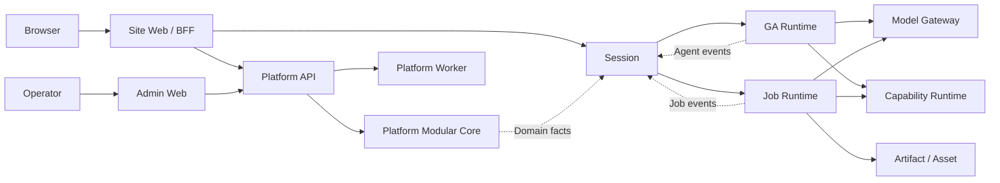

# Kokoro 架构权威矩阵：Owner、RPC/Event 与核心词汇

## 0. 文档定位

本文把 Kokoro 整体目标架构压缩为三张可执行的权威表：

1. **Bounded Context Owner Matrix**：每类事实由谁唯一写入，谁只能保存引用或投影。
2. **RPC/Event Registry**：跨 Context 如何调用、如何鉴权、如何幂等和恢复。
3. **Core Architecture Glossary**：Site、Workspace、Session、Run、Job、namespace 等核心词汇的唯一含义。

本文是目标架构评审稿，不描述当前代码已经完成迁移。当前实现事实仍以
`docs/kokoro-handbook/technical/20-kokoro-v1-technical-plan.md` 和相邻当前事实文档为准。
本文完成书面复审后，三张表分别迁入 handbook，并成为后续子 Spec、实现计划、INDEX、契约、代码命名和
架构门禁的共同上游。

本文收敛但不替代以下详细设计：

- `2026-07-25-platform-web-session-target-architecture-design.md`
- `2026-07-25-platform-modular-core-internal-rpc-design.md`
- `2026-07-25-platform-web-session-p0-contract-closure-design.md`
- `2026-07-25-session-http-sse-production-transport-design.md`
- `2026-07-25-model-control-gateway-litellm-architecture-design.md`
- `2026-07-25-capability-control-runtime-connection-effect-architecture-design.md`
- `2026-07-25-asset-artifact-ownership-promotion-gc-design.md`

冲突裁决：本文只统一 owner、调用方向和词义；领域内部状态机、字段和验收细节仍由对应 child Spec 决定。
若 child Spec 需要改变本文三张表，必须先更新本文并完成跨域架构复审。

## 1. 一句话架构

> Kokoro 采用产品接入层、Platform 模块化业务核心、Session 会话投影、GA/Job 执行层、专用
> Gateway/Runtime，以及统一契约和事件骨架；独立 deployable 不等于独立 Git 仓库，也不等于所有模块都使用 RPC。



## 2. 总体决策

### 2.1 独立性的判据

一个模块或进程只有同时满足以下条件，才称为独立边界：

- 有唯一事实 Owner 和明确的非职责。
- 可通过窄公开契约理解和测试，不要求读取内部实现。
- 不跨边界直接访问 Repository、ORM entity、私有集合或表。
- 远程调用有版本、身份、deadline、幂等、receipt、失败 Owner 和恢复语义。
- 可独立发布、扩缩、降级或回滚，不靠共享可变状态维持正确性。

独立性不要求独立 Git 仓库。Backend、Platform、Session、Admin、Capability source 和共享 runtime contract
采用一个受管 polyglot monorepo；产品命名 Site Web Project 拥有独立 repo/lock/CI/release。

### 2.2 本地 Port 与远程 RPC

```text
同一 bounded context + 同一数据库事务
  → transaction-scoped application interface
  → 一个 UnitOfWork / 一个 commit

跨 bounded context 或跨进程
  → versioned command/query contract
  → owner-local transaction
  → outbox/inbox fact 或显式 saga
```

禁止把本地 interface 换成 HTTP adapter 后宣称服务已可独立提取。提取服务必须重新定义 Owner、事务、
中间状态、unknown outcome、补偿和恢复。

## 3. Bounded Context Owner Matrix

### 3.1 Platform 业务核心

| Context | 唯一拥有的事实 | 只消费/保存 | 明确不拥有 |
|---|---|---|---|
| `site-fleet` | Site、DomainBinding、SiteProjectBinding、SiteRelease、ActivationAttempt | deployment observation、brand/legal manifest digest | 用户身份、Session、Web 品牌源文件、Provider effect |
| `identity` | User、Credential、AuthSession、SubjectGeneration、ServiceAccount | SiteRef、restriction epoch | Workspace membership、Session、Credit |
| `workspace-project` | Workspace、Membership、Project、ExecutionSpace assignment | UserRef、SiteRef | GA namespace 内部结构、Agent checkpoint |
| `catalog-offering` | Product、Offering、Price revision、Eligibility rule、Redeem program | Site assortment、model/capability refs | Order、Payment、Credit ledger |
| `commerce` | Quote、Order、SubscriptionTerm、Refund/Dispute request、commerce state | Payment/Grant/Settlement receipt | Payment provider事实、Credit ledger |
| `payment` | PaymentAttempt、ProviderEvent、Refund、Dispute、ReconciliationCase | OrderRef、Fulfillment receipt | Credit ledger、Entitlement、Session |
| `fulfillment-entitlement` | Fulfillment、EntitlementGrant、Grant lifecycle | Order/Payment/Redeem fact | Credit ledger、Provider payment fact |
| `credit-usage` | CreditGrant、Account、Hold、Allocation、JournalEntry | RatedUsage、EntitlementRef、ExecutionRootRef | Payment、模型路由、Provider usage fact |
| `usage-rating` | CanonicalUsageEvidence、RatingSnapshot、RatedUsage、Settlement | AttemptUsageFact、pricing revision | Provider attempt、余额直接修改 |
| `model-control` | ModelDefinition、ProviderAccount metadata/SecretRef、Deployment、Profile、Pool、RoutePolicy、Assignment | health observation、cost evidence | 实际 ModelInvocation、客户价格、Credit |
| `agent-registry` | AgentDefinition、AgentRevision、SelectionPolicy、Handoff manifest | Model/Capability refs | RunExecution、Session、Provider effect |
| `risk-policy` | RiskDecision、Restriction、RestrictionEpoch、policy revision | owner facts、安全 evidence | 业务 aggregate 和投影 |
| `data-governance` | RetentionPolicyRevision、Export/DeletionRequest、LegalHold、DeletionPlan | participant receipt | 各 Context 的业务表直接写入 |
| `notification` | NotificationIntent、Preference、DeliveryAttempt、Template revision | owner fact、recipient ref | 业务 aggregate、AuthSession |
| `audit` | 不可变 AuditRecord、approval/actor/effect evidence | 各 Owner 的 safe refs | 业务状态机、管理员万能写权限 |
| `admin-facade` | 不拥有独立业务事实 | Owner query/projection、typed command | 任何业务表、Repository、Prisma model |

Platform API 与 Platform Worker 使用同一组模块和同一数据库所有权规则；Worker 不复制领域规则，也不形成第二套真源。

### 3.2 运行时与产品投影

| Context / Process | 唯一拥有的事实 | 只消费/保存 | 明确不拥有 |
|---|---|---|---|
| `session` | Session、Message、MessagePart、Branch、RunLaunchProjection、RunView、Approval/Interaction projection、SessionEvent、ControlOutbox | Platform authorization/manifest、GA/Job facts、Artifact refs | RunExecution、模型/Capability 商业决策、Credit、checkpoint |
| `task-projection` | TaskView、timeline/search projection、projection watermark | 各 Owner 的 versioned fact | 任何领域 mutation 或 terminal decision |
| `ga` | RunExecution、Checkpoint、RunLease/Epoch、EffectRecord、AgentEventOutbox | opaque namespace、ExecutionManifest、授权 handle | Site/User/Plan/Price、Provider account、Artifact 真源 |
| `job` | Operation、Job、JobAttempt、WorkerLease、Progress、provider-independent finalization | ExecutionGrant、Model/Capability/Artifact receipt | Session Message、Credit、Model Provider account |
| `model-gateway` | ModelInvocation、ModelAttempt、ResolutionRecord、runtime HealthObservation、AttemptUsageFact | opaque model authorization、Model Control config | CanonicalUsageEvidence、客户价格、余额 |
| `capability-control` | Skill/Connector/Plugin/Hook/Command Revision、Package、Connection、SecretRef | Site/Workspace refs | 调用 effect、套餐/积分 |
| `capability-runtime` | CapabilityCall、EffectClaim、SecretLease、runtime observation | Capability revision/grant | 长期 secret 明文、Plan/Credit、Session |
| `asset` | upload、scan、AssetVersion、AssetGrant | BlobRef、TrustDecision | Artifact identity、Job |
| `artifact` | Artifact、ArtifactVersion、Lineage、Rendition、Promotion | BlobRef、Job/Run refs | Provider effect、Session Message |
| `blob-lifecycle` | physical object ref、retention、replication、GC receipt | Asset/Artifact retention claims | 业务 identity 合并 |
| `execution-runtime` | TargetRegistration、Connection、CapabilityObservation、Lease、Environment、BrowserSession | ExecutionGrant、Workspace binding | Workspace/Project authority、Provider secret |
| `developer-workspace` | RepositoryBinding、Revision、Worktree、ChangeSet、CodeCheckpoint、Git refs | Project/Target refs | Git provider secret 明文、ExecutionTarget |
| `automation` | Routine、Revision、Trigger、Schedule、RoutineRun | Admission/Job refs | 绕过 Admission 直接执行 GA |
| `application-runtime` | Application/Revision、EnvironmentDeployment、Rollout、ServiceInstance | Artifact/Target refs | SiteRelease、Job、Routine |

### 3.3 Web 边界

| Surface | 拥有 | 不拥有 |
|---|---|---|
| 产品命名 Site Web | route、品牌、SEO、UI composition、Cookie、浏览器草稿、BFF adapter | 业务数据、报价、余额、namespace 选择、Agent 执行 |
| Admin Web | 运营 UI、只读聚合视图、专用命令入口 | Platform 业务表、Operator authority 真源、通用高风险 mutation |

每个生产 Site 对应独立 Web Project、deployment、domain、lock、CI 和 rollback cycle。Backend 只保存 opaque
SiteProjectBinding 和 release evidence，不维护第二份可编辑品牌/路由真源。

## 4. Core Architecture Glossary

### 4.1 身份、站点和空间

| 词汇 | 唯一含义 | 禁止用法 |
|---|---|---|
| `siteId` | Platform 业务隔离和产品站点身份 | 不传给 GA 作为第二隔离轴；不从 Host/default 静默回退 |
| `subjectId` | Identity 认证主体的稳定引用 | 不等于 namespace；不直接代表 Workspace |
| `userId` | Identity 用户身份 | 不作为 GA 隔离键 |
| `workspaceId` | Workspace 业务身份与成员授权边界 | 不等于 Project、Session 或 namespace |
| `projectId` | Workspace 内项目身份 | 不作为 Artifact、Job 或 GA thread 身份 |
| `executionSpaceId` | Platform 对执行空间的业务引用 | 不要求 GA 理解其业务语义 |
| `namespace` | 上游解析后传给 GA 的 opaque execution-space key | 不拼 `user:`/`team:`；不附带 userId/ownerId/workspaceId 第二轴 |
| `GlobalScope` | 显式、受审计的平台级查询/命令范围 | 不表示“缺少 siteId”；不由普通 runtime caller 自报 |

### 4.2 会话与执行

| 词汇 | 唯一含义 | Owner |
|---|---|---|
| `sessionId` | 产品会话身份 | Session |
| `messageId` | 会话中的产品消息身份 | Session |
| `branchId` | 会话分支身份 | Session |
| `runId` | 产品侧 Run/launch 关联身份 | Session projection |
| `runExecutionId` | GA 真正执行状态机身份 | GA |
| `threadId` | GA checkpoint/thread identity | GA；不得代替 sessionId |
| `operationId` | 一个可观察、可授权、可结算的后台业务操作 | Job |
| `jobId` | Operation 下的具体执行单元 | Job |
| `attemptId` | Worker/Provider 的单次 effect attempt | Effect Owner |
| `logicalModelCallId` | 可跨 crash/attach 识别的逻辑模型调用 | Model Gateway |
| `effectId` | 外部副作用的稳定幂等身份 | Effect Owner |

### 4.3 契约、恢复和事件

| 词汇 | 唯一含义 |
|---|---|
| `commandId` | 远程命令的幂等与恢复身份 |
| `idempotencyKey` | 业务提供的重放身份；必须和 canonical request digest 绑定 |
| `requestDigest` | canonical request 的不可变摘要；同 key 不同 digest 必须冲突 |
| `receipt` | Owner 对 accepted/committed/rejected/unknown 的权威回执 |
| `eventId` | 消费幂等身份，不表达领域顺序 |
| `aggregateVersion` | 同 aggregate 的领域顺序和并发控制 |
| `correlationId` | 一条业务链路的关联身份 |
| `causationId` | 当前 command/event 的直接原因 |
| `projection` | 可重建的只读模型，不拥有来源领域事实 |
| `snapshot` | 页面或读取面的完整长期投影；SSE 只补增量 |
| `cursor` | 绑定 caller/resource/revision/expiry 的不透明续点凭据 |

### 4.4 商业、模型、能力和产物

| 词汇 | 唯一含义 | 禁止混用 |
|---|---|---|
| `quote` | 某一时点的价格/资格快照 | 不等于 PaymentAttempt 或 Credit Hold |
| `hold` | 预算或 Credit 的冻结事实 | 不等于最终 capture/settlement |
| `allocation` | root budget 下的可消费切片 | 不等于余额账户 |
| `usageFact` | effect producer 本地持久化的用量事实 | 不等于 canonical rated usage |
| `settlement` | canonical usage 经 rating 后的最终商业结算 | 不阻塞已有 durable usage evidence 的产品完成 |
| `modelDefinition` | Platform 模型目录身份 | 不等于 Provider deployment |
| `modelAuthorizationHandle` | 执行侧不可解析的模型授权句柄 | 不含可读 Site/Plan/Price claims |
| `capabilityRevision` | Skill/Connector 等不可变能力版本 | 不等于一次 CapabilityCall |
| `secretRef` | 长期凭据的受控引用 | 不等于可传给 GA 的明文 secret |
| `assetVersion` | 用户输入资源的不可变版本 | 不等于输出 ArtifactVersion |
| `artifactVersion` | 可交付产物的不可变版本与 lineage | 不等于物理 Blob |
| `blobRef` | 物理对象存储引用 | 不作为业务产物身份 |

### 4.5 代码和 wire 命名

- TypeScript 内部属性与函数使用 `camelCase`；类型、Schema 对应类型和组件使用 `PascalCase`。
- Python 使用 `snake_case`；类使用 `PascalCase`。
- 跨语言 JSON wire 使用 `snake_case`，只在 adapter 边缘映射到语言内部命名。
- Event kind 使用 dot-separated past tense，例如 `credit.granted`、`run.completed`。
- Command 使用祈使语义，例如 `AuthorizeRun`、`LaunchRunExecution`；Query 使用读取语义，例如
  `GetCommandReceipt`、`GetSessionSnapshot`。
- ID 字段使用完整领域名，例如 `workspaceId`、`runExecutionId`；禁止无法区分 Owner 的裸 `id` 穿越边界。
- `Manager`、`Helper`、`Utils`、`Row`、`Record<string, unknown>`、`dict[str, object]` 不得成为跨 Context 公开契约。
- `Service` 只用于窄 application façade；底层 transport 不得以 `callService` 的形态直接暴露给业务用例。

## 5. RPC/Event Registry

### 5.1 远程 Command envelope

所有会改变 Owner 状态或触发 effect 的跨 Context Command 必须包含：

```text
contractId / schemaVersion
commandId / idempotencyKey / requestDigest
callerWorkload / audience
immutable siteId or explicit GlobalScope
actor/delegation safe refs
correlationId / causationId / traceContext
expectedVersion
issuedAt / deadline / attemptOrdinal
restriction/security epochs
payload
```

Owner 在 effect point 重新验证 audience、workload、Site/scope、actor/delegation、epoch、deadline、digest 和
expectedVersion。Caller 不能自签 Site、actor、namespace、Plan、Price 或 permission claims。

Command 结果只允许：

```text
committed
accepted_pending
rejected
outcome_unknown
```

timeout 只表示 Caller 没收到结果。恢复必须查询同一 `commandId + requestDigest` 的权威 receipt；禁止生成新
identity、切换 Owner、直接回退 Provider 或把 queue accepted 当业务完成。

### 5.2 初始同步调用注册表

| Caller → Owner / Operation | 模式 / Audience | 身份、幂等与恢复 | Failure Owner / 禁止 fallback |
|---|---|---|---|
| Site BFF → Platform `ExchangeSiteContext` | sync / `platform.site-context` | deployment binding + request key | Platform；禁止 Host/default Site fallback |
| Site BFF → Platform `AuthorizeSessionAccess` | sync / `platform.session-access` | AuthSession/subject/workload + resource digest | Platform；禁止浏览器自构造 Site/namespace |
| Site BFF → Session HTTP/SSE/read/control | HTTP/SSE / `session.*` | SessionAccessGrant；command key+digest；opaque cursor | Session；禁止浏览器直连 GA、全历史 SSE 作真源 |
| Session → Platform `PrepareRun` | sync / `platform.admission` | admission key + input digest + expected policy epochs | Platform；禁止 Session 自行选价、授权或扣费 |
| Session → Platform `FinalizeRun` | sync / `platform.admission` | execution root + terminal fact revision + CAS | Platform；unknown 时 reconcile，禁止伪造 completed |
| Session → GA `LaunchRunExecution` | command / `ga.run-control` | launch key + manifest digest + expectedVersion | GA；禁止共享表创建 RunExecution |
| Session → GA `CancelRunExecution` | command / `ga.run-control` | same execution identity + expectedVersion | GA；Session 只更新 projection |
| Web/GA → Job `SubmitOperation` | command / `job.submit` | operation key + spec digest + delegated budget slice | Job；禁止 GA 自建后台 Job 或重复 Hold |
| GA/Job → Model Gateway `InvokeModel` | typed stream / `model-gateway.invoke` | opaque authorization + logicalModelCallId | Gateway；禁止直连 Provider |
| GA/Job → Capability Runtime `InvokeCapability` | sync/stream / `capability.invoke` | capability revision/grant + effect identity | Capability；禁止调用方获得长期 secret |
| Job → Artifact `CreateArtifactVersion` | command / `artifact.write` | attempt + output ordinal + content/lineage digest | Artifact；timeout 查 receipt，禁止重跑 Provider |
| Admin Web → Platform Admin API | HTTP/JSON / `platform.admin` | per-request operator auth + actionId/digest/version/approval | Owner/Admin façade；禁止 email+shared secret 代替授权 |
| Platform → Deployment Provider `ApplyRelease` | durable intent / provider audience | ActivationAttempt + provider key + release digest | Site reconciler；unknown 禁止再次 promote |
| Provider Callback → owning Context | authenticated callback / owner audience | provider account + environment + event id | Domain Owner；禁止 callback 跨域写表 |

### 5.3 Event envelope

所有跨 Context durable fact 使用统一 envelope：

```text
eventId / eventType / schemaVersion
producer / environment / region
immutable siteId or explicit platform scope
aggregateType / aggregateId / aggregateVersion
occurredAt / recordedAt
correlationId / causationId
securityClassification
payload
```

Producer 在 Owner transaction 内原子 append Outbox。Consumer Inbox 以
`eventId + consumer + handlerRevision` 去重。Event 只陈述已提交事实，不承担“让消费者替 Owner 完成事务”的伪命令。

### 5.4 初始异步事实注册表

| Producer → Consumer | Fact | 顺序/幂等 | Replay 约束 |
|---|---|---|---|
| Platform Owner → Session/Task Projection | authorization、grant、restriction、artifact/job refs | aggregateVersion + Inbox | 只重建 projection，不写回 Owner |
| GA → Session | RunExecution/AgentEvent fact | eventId + execution version/durable sequence | 不重复 tool/provider effect |
| Job → Session/Task Projection | Operation/Job progress、terminal fact | operation/job version | 不重复 Worker/Provider effect |
| Model Gateway → Usage Rating | AttemptUsageFact | producer/attempt/kind/revision | 不直接 capture；late correction 追加 revision |
| Capability Runtime → Usage Rating/Projection | CapabilityCall/Effect fact | capabilityCallId/effectId | 不重新调用 Connector |
| Payment → Commerce/Fulfillment | payment/refund/dispute fact | provider event + aggregateVersion | 不重复 Provider 或 Credit grant |
| Fulfillment → Credit/Entitlement Projection | Grant intent/fact | source identity + digest | 不重复发放；不同 digest conflict |
| Asset/Artifact → Job/Session | scan、version、promotion、receipt | asset/artifact version | 不重复上传/转码 effect |
| Risk Policy → all effect Owners | Restriction/epoch fact | subject/resource + monotonic epoch | replay 只能收紧/重建，不恢复已撤销授权 |
| Data Governance → participant Owners | export/delete/hold command and receipt | plan/participant/revision | 删除 effect 必须 participant-local 幂等 |

### 5.5 失败和重试分类

| Class | 语义 | Caller 动作 |
|---|---|---|
| `validation` | schema 或参数非法 | 修正请求；不重试 |
| `unauthorized_non_disclosing` | audience/scope/Site/resource 不符 | 不重试；安全审计 |
| `conflict` | expectedVersion 或同 key 不同 digest | 重新读取并显式确认 |
| `throttled` | quota/concurrency | 仅按 bounded retry-after |
| `unavailable_pre_effect` | Owner 未接受命令 | 同 identity transport retry |
| `accepted_pending` | durable intent 已存在 | 查询 receipt；不生成新 identity |
| `outcome_unknown` | commit/effect 结果未知 | reconcile same identity；不 fallback |
| `terminal_failed` | Owner 已确认终局失败 | 仅在产品允许时创建新的可见操作 |

## 6. 依赖方向和公开 API

```text
domain
  ↓
application
  ↓
infrastructure / transport adapters
  ↓
composition root
```

允许：

- Domain 只依赖本 Context domain 和批准的基础 value types。
- Application 依赖本 Context domain，以及其他 Owner 的 generated contract/application interface。
- Workflow 依赖多个 Context 的窄 transaction-scoped application interface。
- Adapter 依赖 application contract；composition root 装配全部 adapter。

禁止：

- Module A import Module B Repository、Prisma client/model、private collection/table 或 transaction handle。
- Domain import HTTP、Redis、Mongo、Prisma、Next、Fastify、LangChain 等框架。
- Platform 模块间 self-HTTP；同 Core 内使用 application interface/UoW。
- Session import Catalog/Credit/Payment/Provider decision 模块。
- GA contract 出现 Site/User/Workspace/Plan/Price/Secret claims。
- Web/Admin import Platform 业务 Prisma。
- Projection 对来源 Owner 发起隐式修正写入。
- Package root barrel 导出 Repository、server、ORM entity 或 infrastructure implementation。

## 7. 当前实现差距与迁移顺序

本文不要求一次提交完成 clean rewrite。迁移按以下顺序保持行为可验证：

1. **当前 P0 修复**：dispatch 孤儿恢复、Session owner 原子创建、Credit request digest、Site/Model fail-closed、
   Session/Web body/backpressure/cursor 限制。
2. **Repository Foundation**：完成代码权属 attestation、gitlink 导入、单一根 lock/CI、contract consumer inventory、
   INDEX/dependency gate；不改变业务和 GA graph 语义。
3. **安全上下文闭环**：Workload identity、RequestSecurityContext、SessionAccessGrant、operation-level admission、
   per-owner DB runtime credential。
4. **Platform Modular Core**：建立 Platform API/Worker composition root、模块 application interfaces、
   PlatformUnitOfWork、真实 Outbox/Inbox；删除 Platform 模块间 self-HTTP。
5. **Session 收缩**：把 Hub/Model/Credit/Provider 决策迁入 Platform Admission；Session 只保存 manifest refs、
   launch projection、会话投影和 transport 状态。
6. **Session/GA 解耦**：落 Launch/Cancel command、AgentEvent outbox/inbox、完整 snapshot 和 opaque cursor；
   shadow 对账后删除跨服务共享 Mongo 写入。
7. **专用执行边界**：依次切 Model Gateway、Capability Runtime、Job、Artifact/Asset；保留 GA 的
   LangGraph/DeepAgents assembly、checkpoint 和 opaque namespace 规则。
8. **Web 与 Admin 收口**：产品命名 Site Project 独立发布；Admin 使用专用高风险 workflow 和 generated contract，
   移除业务 DB import 和动态万能 mutation。
9. **命名和结构清理**：所有消费者迁移后统一 package/file/type naming，拆分 God interface/file，删除旧 contract、
   compatibility branch、失真 INDEX 和过期文档。

## 8. 架构门禁

### 8.1 静态门禁

- 受管 Context、deployable、public export 和 INDEX 全量登记。
- Import graph 阻止 deep import、cycle 和禁止依赖。
- DB/table owner 和 runtime/migration grants 可审计。
- Contract source、generated output、consumer、owner、digest 和兼容窗口可机器查询。
- 禁止生产代码出现具体 Site 特判、Host/default Site fallback 和 GA 业务身份字段。

### 8.2 契约与恢复门禁

- 同 idempotency key、同 digest 返回同 receipt；不同 digest 必须 conflict。
- timeout-after-commit 通过同 command receipt 恢复，不重复 effect。
- Event duplicate、out-of-order、late、replay 不重复 Payment、Credit Grant、Provider、Connector、Notification effect。
- cross-Site、cross-environment、wrong audience、stale epoch 在 read/commit/effect 前拒绝且不泄露资源存在性。
- current/previous schema rolling window、unknown-field policy、upgrade-required 行为有生成契约测试。

### 8.3 边界负向门禁

- Session 不 import Platform 商业决策模块。
- GA manifest/storage/wire 不含 Site/User/Workspace/Plan/Price/Secret claims。
- Admin/Site Web 不 import Platform 业务 Prisma。
- 各 Context 不跨 Owner import Repository、ORM entity 或私有表。
- Projection replay 不触发外部 effect。

## 9. 非目标

- 本文不授权修改运行时代码、数据库或 GA 语义。
- 本文不选择 Connect、gRPC 或严格 HTTP/JSON 中的具体传输框架。
- 本文不把每个 Platform Context 部署成独立微服务。
- 本文不建立万能 `operation-kernel`、service locator、第二个 contract 仓库或全局 mutable registry。
- 本文不展开每个领域完整状态机；详细字段仍由对应 child Spec 冻结。

## 10. 书面复审与正式化

本文书面复审通过后执行文档迁移，不等同于运行时实现授权：

1. Owner Matrix 迁入 handbook 架构入口。
2. RPC/Event Registry 迁入 handbook 通信与契约入口，并生成 machine-readable registry 的后续实现计划。
3. Glossary 迁入 handbook 总入口和相关 INDEX 模板。
4. `docs/CURRENT.md` 增加正式入口，并明确“目标规则”和“当前实现事实”的双栏状态。
5. 各 child Spec 只引用上述正式入口，不再复制或重新定义核心词义和 Owner。

正式化后的实施仍受 Wave 0 `implementationAuthorized`、代码权属 attestation、对应 child Spec/plan 和真实验证门约束。
