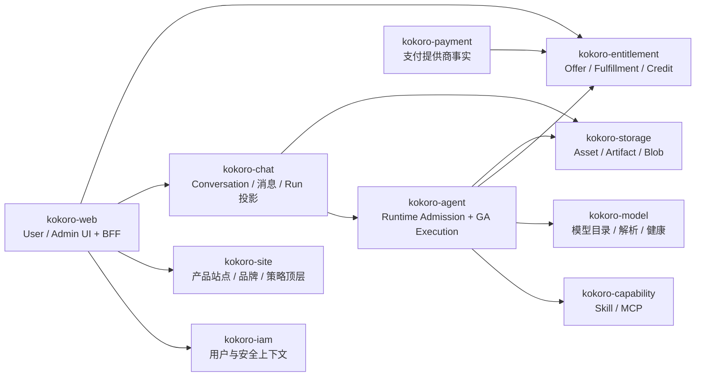
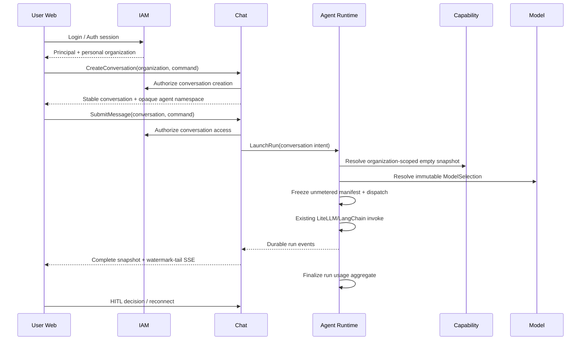

# Kokoro SQL-first 能力子仓架构方案

## 0. 方案摘要

最终架构从关系数据和业务事务开始，而不是从“几个进程”“Platform 要不要合壳”开始。

本方案的前置权威是
[`Kokoro PostgreSQL Canonical Data Model`](2026-08-13-kokoro-canonical-data-model-design.md)：三个安全轴与业务 aggregate、逐表字段/FK/UNIQUE/CHECK、删除策略、唯一 writer 和 transaction matrix 先成立，下面的子仓只是由共同不变量、共同 writer 和共同事务推导出的代码 ownership 结果。

- **一个 PostgreSQL 18 物理数据库**，一份 Root canonical baseline。
- **子仓按能力划分，子仓内部再按模块划分。** 子仓默认可独立构建、测试和部署，但部署不是划分依据。
- **跨子仓使用 Protobuf RPC；仓内模块直接调用。** 不把 TypeScript interface 包装层、HTTP self-call 或 tRPC 当通用边界。
- **浏览器走 HTTP/JSON + BFF；Agent 工具走 MCP；异步运行事实继续用 Redis Streams。** 三者不混用。
- **GA 与 Web 成熟核心保留。** 重写 PostgreSQL repository、跨仓 adapter、事务与 owner，不重写执行算法和 UI 状态机。
- **按 A/B/C 三个可运行 slice 小跑，不一次落 100+ 目标表。** 每个 slice 只有一套真源；对应行为迁完即删除该能力旧 adapter，不做跨 slice 双写。

## 1. 设计目标与非目标

### 1.1 目标

1. SQL 成为业务对象、关系、状态、幂等和账务事实的第一权威。
2. 让 User/Identity/Auth/Role/Permission 在同一个 IAM 子仓内完整实现。
3. 用 Chat 业务子仓承接 Web 与 GA；Conversation 是核心 aggregate，Session 只保留为认证会话或现有 Web 状态类型的兼容术语，不再作为业务所有权轴。
4. Skill/MCP、Model、Storage 成为 GA 的独立中间能力，而不是 Platform 大杂烩。
5. Catalog、Payment、Redemption、Fulfillment、Subscription、Entitlement、Credit 边界清楚，并共享唯一权益发放链。
6. 复用当前已经好的算法与测试，用 adapter replacement 完成硬切。
7. 先交付 Slice A：登录 + 文本 Chat + GA + Model + SSE/HITL；再在同一模型上用 Slice B 加
   Skill/MCP + Credit + Artifact，最后 Slice C 加商业链，不造第二套临时架构。

### 1.2 非目标

- 不按 Kubernetes、端口、数据库账号或语言划分领域。
- 不为每张表建一个 repository/class/interface。
- 不为所有动作引入 event sourcing、workflow engine、Kafka 或 Temporal。
- 不把 Admin 建成能随意代理所有内部 URL 的业务 owner。
- 不重写 LangGraph/DeepAgents、Web reducer/SSE engine 或已经正确的 Credit 算法。
- 不一次设计所有未来 Image/Music/Video/Fleet 功能；先保留清晰扩展位。

## 2. 最终子仓与仓内模块

`kokoro-platform` **不是目标业务子仓**。它只是当前代码的迁移来源：其中成熟 package 按下面的能力边界搬迁并保留 git history/测试；迁移完成后删除这个“总平台”容器以及 `platform-kit` 业务耦合。Root 继续承担契约、数据库 baseline 和集成，不再出现一个包揽全部后端能力的 Platform service。

跨仓只共享生成契约，不建立新的 `kokoro-common-business`。日志、配置、HTTP/RPC、数据库等基础能力优先直接使用成熟库；确有完全相同的薄封装时，放在各仓自己的 `infrastructure`，避免共享工具包重新长成业务中台。



### 2.1 Root

Root 不是业务服务，负责：

- `contract/proto/**` 与 `contract/openapi/**`；
- `database/schema/*.sql` 和生成后的唯一 `database/baseline/kokoro.sql`；
- 跨仓 owner inventory、contract generation、breaking check；
- 子仓 pin、集成 fixture、真实产品 E2E。

### 2.2 `kokoro-web`

仓内模块：

- `apps/user`：Chat、Account、Capability、Billing/Plans UI；
- `apps/admin`：各能力 owner 的 Admin RPC/UI；
- `packages/ui`、`packages/i18n`、生成 HTTP/RPC clients；
- BFF 只保存 cookie/session envelope，不拥有业务表。

保留现有 User reducer/projection、SSE engine、machine、Chat/HITL UI 和 BFF auth sealing。Admin Prisma
migration 删除；Admin 身份归 IAM。危险管理操作的 approval/effect receipt 不归 IAM，也不由 Admin Web
通用代理拥有：对应能力进入某 slice 时，必须在该 owner 内落 approval request、effect receipt 和
append-only audit 后才开放 mutation。A/B/C 只迁只读/低风险 Admin；危险 mutation 路由保持 feature-off，
现有 dual-control 算法/测试保留为参考，但不保留旧数据库运行 authority。

### 2.3 `kokoro-iam`

“用户、身份、认证、角色、权限”是一个完整安全上下文，放在同一子仓：

- `authentication`：首发迁现有 magic link、session、refresh/revoke、recovery；OAuth/passkey/MFA 是后续 ADR；
- `identity`：User/Profile、外部 issuer+subject identity、verified contact；
- `organization`：Organization/Team、Membership、Invite、ServiceAccount；
- `authorization`：Role、Permission、RoleAssignment、resource scope；
- `audit`：auth/security/admin audit；
- `rpc/http`：login/session/JWKS、Authorize、AdminIdentity。

当前 `kokoro-user` 的成熟事务整体迁入；Platform Admin 和 Web Admin 的 Operator/Auth 表并入，不再维护第二套身份。

### 2.4 `kokoro-site`

仓内模块：首发 Site、Domain；后续按已验证需求增加 Brand、Feature、Release/Provision。Site 是产品/品牌顶层；一个 Site
包含多个 personal/team Organization。它不由某个 Organization 拥有，也不拥有用户、权限、套餐或聊天。

### 2.5 `kokoro-chat`

这是 Web 与 GA 之间缺失的业务能力；用户直接操作 Conversation，不先创建 Project：

- `conversation`：首发 Conversation、Message、MessagePart，并持有 opaque Agent namespace；
- `project`（后续）：可选的 Conversation 分组、共享上下文与团队协作，不是登录/对话/Run 前置；
- `run`：RunLaunch、RunView、ActiveRunSlot；
- `interaction`：Approval、Question、Review、Input、control command；
- `projection`：Agent event inbox、cursor、DLQ、browser event；
- `transport`：内部为 generated Connect command/query/server-streaming RPC；浏览器 HTTP/SSE 只存在于 Web BFF，Chat 不另开 private HTTP/SSE；
- `application`：首发 submit/control 事务；branch/edit/regenerate 是首个闭环后的下一切片。

当前 `kokoro-session` 的 projection/recovery 行为保留，Mongo repository 与越权的 Hub/Model/Credit/Artifact 代码替换。

### 2.6 `kokoro-agent`

仓内分两层而不是重写 GA：

- `runtime-admission`：先 claim preparing Run，再幂等获取 Capability/Model/Usage 引用，最后 CAS 冻结 immutable execution manifest 并写 dispatch outbox；
- `ga-execution`：现有 assembly、worker、HITL、checkpoint、control、tool、sandbox、subagent；只消费 opaque namespace 和 frozen manifest；
- `persistence`：PostgreSQL run/lease/outbox/effect/run-usage；固定版本 LangGraph PostgreSQL checkpointer；
- `rpc/streams`：Launch/Control/ReadEvidence RPC，durable event stream。

GA core 不接收 userId/siteId/plan/payment 等业务字段。

### 2.7 `kokoro-capability`

仓内模块：

- Skill Definition/Revision/Package/Installation/Grant；
- MCP Server/Revision/Connection/SecretHandle/Grant；
- package validation/materialization；
- runtime snapshot resolve；
- consent/effect policy 与 receipt（需要时才启用）。

保留当前 Hub 的 package/hash/SSRF/AES-GCM 算法；用 PostgreSQL 单事务替换 Mongo current+revision 双写。Package bytes 交给 Storage。

### 2.8 `kokoro-model`

仓内模块：

- `control`：Provider、Model、ModelRevision、Label、RoutingPolicy；
- `resolution`：把 Site policy 与用户选择解析为 immutable `ModelSelection`；
- `admin`：provider/model/policy 管理；
- `rpc`：只提供 ResolveModel/read/admin，不自研 Invoke/Stream。

保留 fallback/health/secret-ref 与现有 `kokoro-litellm`。GA 继续通过成熟的 OpenAI-compatible
LiteLLM/LangChain 路径调用和 streaming；Model 只冻结目录/绑定/路由 revision，不复制 token stream、
tool call、cancel 或 usage 聚合。

### 2.9 `kokoro-storage`

仓内模块：

- `blob`：Local/S3、content hash、retention；
- `upload`：UploadSession、multipart/presign、size/type policy；
- `asset`：scan、quarantine、promotion、attachment eligibility；
- `artifact`：Artifact/Revision、lineage、delivery/download/share；
- `worker`：scanner/promoter/GC。

对象 bytes 存 Local/S3，SQL 存稳定 metadata 和生命周期。V1 使用 AWS SDK/S3-compatible adapter、Local adapter 和 ClamAV；不自研对象存储或病毒引擎。

### 2.10 `kokoro-entitlement`

仓内模块：

- `catalog`：Product、Offer、immutable OfferRevision、Price、Benefit；
- `redemption`：Campaign、Code、Attempt；
- `acquisition`：Payment/Redemption/AdminGrant 的统一取得事实；
- `fulfillment`：at-least-once command + 幂等 receipt，实现 effectively-once 发放；
- `entitlement`：EntitlementGrant、SubscriptionTerm；
- `credit`：CreditAccount、CreditGrant、CreditJournal、Hold、UsageSettlement；
- `admin/read-model`。

当前 Credit domain 算法迁入；Payment 中的 mutable Plan 被 Catalog/OfferRevision 取代。Payment 与 Redemption 不得各写一套权益发放逻辑。

### 2.11 `kokoro-payment`

支付有独立业务事实和外部 provider 生命周期，因此单独成仓：

- CustomerBinding、CheckoutSession；
- ProviderEvent、Settlement、ProviderSubscription；
- Refund/Reversal、reconciliation；
- Stripe adapter/webhook/portal。

它不拥有 Product、Benefit、Entitlement 或 Credit。支付确认后，以 acquisition command 调用 Entitlement Fulfillment；相同 provider fact 重放得到同一 receipt。

ProviderSubscription 与 SubscriptionTerm 不是双真源：前者只是支付提供商当前镜像；每个已支付 invoice/period
使用 `payment:<provider>:invoice:<id>` 作为 acquisition source key，Entitlement 幂等地产生一个
SubscriptionTerm。cancel-at-period-end 只阻止未来 period，不提前撤销当前 term；refund/dispute 以稳定
reversal key 反向引用原 settlement/fulfillment。首个 Payment 切片只做 one-time checkout，recurring
subscription 在相同表和 source-key 规则上作为下一切片加入。

## 3. PostgreSQL 第一权威

### 3.1 物理布局

```text
database/
├── schema/
│   ├── 00-foundation.sql
│   ├── 10-site.sql
│   ├── 20-iam.sql
│   ├── 30-chat.sql
│   ├── 40-agent.sql
│   ├── 50-capability.sql
│   ├── 60-model.sql
│   ├── 70-storage.sql
│   ├── 80-entitlement.sql
│   ├── 90-payment.sql
│   └── 99-cross-capability-relations.sql
└── baseline/
    └── kokoro.sql
```

这里只按能力分 SQL 段，避免几百个碎 migration 文件；Site 必须先于 site-scoped IAM，确有循环/晚绑定的
FK 统一在 `99-cross-capability-relations.sql` 添加。Root 按固定顺序和当前 slice manifest 生成一份
baseline。所有表放在同一个 `kokoro` schema，名称使用 `iam_*`、`chat_*` 等前缀。

数据库应用账号只保留 `kokoro_app`，供所有后端运行时连接。Root baseline 由本地/发布初始化过程以数据库 owner authority 应用，不把第二套 migrator 凭据下发给能力服务。

不再为每个服务制造数据库角色、RLS、独立 datasource 或 migration runner。代码 owner inventory、repository gate 和测试约束服务只能写自己的表。

当前产品未上线，本次采用 **clean replace**：不导入现有开发 MySQL/Mongo 数据，只把确定性 fixture/seed
写成新 SQL/应用命令。目标 canonical model 是 A/B/C 三个 slice 的 superset；每个 slice 只安装实际被
该闭环写入的表。首发 pin 冻结后，baseline 不再重写历史，新增
`database/migrations/NNNN_*.sql` 做有序 forward migration，并比较“从当前代码生成的 fresh target schema
snapshot”与“冻结 baseline + 全部 forward migrations”得到的 catalog，证明两条安装路径等价。

Root 根据 owner inventory 生成/校验每个 TypeScript 子仓的 owner-scoped Prisma schema：只包含该仓拥有的
model，跨 owner FK 在 child schema 中只作为 scalar 使用，真实 FK 仍由 Root SQL 创建。Child 只能运行
`prisma generate`，禁止 `migrate`、`db push` 和对整个 `kokoro` schema 的 `db pull`；CI 对 forbidden model
和越权写 query 做 fail-closed 检查。

### 3.2 SQL 通用规则

- 主键统一 `uuid`；外部幂等键、provider id、自然业务键使用明确 `UNIQUE`。
- 稳定关系使用真实 FK；允许跨能力 FK，因为 baseline 由 Root 原子组合。
- 金额使用 `bigint` minor units + ISO currency；Credit 使用 `bigint` micros。
- 时间统一 `timestamptz`；状态使用受控 text + `CHECK` 或 enum。
- revision/fact/journal 默认 append-only；可恢复 aggregate 才有 lifecycle/generation。
- JSONB 只保存有 schema/version 的 bounded payload、snapshot 或 provider raw fact，不承载可查询 identity/FK。
- 关键竞争使用 transaction、`SELECT ... FOR UPDATE`、唯一约束和 version CAS；不靠先查后写。
- 幂等写必须保存 canonical request digest；同 key 同 digest 返回同 receipt，同 key 异 digest冲突。
- 外部副作用使用本地 command receipt + outbox/reconcile；不为普通本地 CRUD 引入 saga。
- 所有 current/live/routing pointer 只允许指向 published/approved revision；通过 candidate key 或 deferred
  constraint trigger 强制，并为 draft pointer 写 PG18 negative test。Slice A 先锁 Model routing。

## 4. Target canonical 关系摘要

下面是 A/B/C 的目标关系摘要，不代表 Slice A 全部安装；Slice A 的 exact 50+4 table manifest 以
canonical data model §0.2 为准。

### 4.1 IAM

| 表 | 关键关系与约束 |
|---|---|
| `iam_principal` / `iam_user` | 普通 principal 属于一个 site；control-plane operator 是独立 scope；不同 Site 的产品账号不共享 |
| `iam_identity` | site identity 与 control-plane identity 分别 partial UNIQUE；scope 与 principal 一致 |
| `iam_contact` / `iam_magic_link` | FK principal/site；verified contact 与一次性 CAS login fact |
| `iam_credential`（future target） | FK identity/user；Slice A 不安装；password/passkey/otp 与现有 credential metadata 迁移按后续 ADR 增加，不存明文 secret |
| `iam_auth_session` | scope-aware FK principal；User/Admin 共用 token family、expiry、rotate/revoke CAS |
| `iam_organization` | FK site；当前 Team 的正式形态；personal/team；personal owner 在同 site 唯一 |
| `iam_membership` | composite FK 保证 organization+principal 同 site；`UNIQUE(organization_id,principal_id)` |
| `iam_role` / `iam_permission` | 稳定 role/permission catalog |
| `iam_role_permission` | Role 与 Permission 的 M:N |
| `iam_membership_role` / `iam_principal_role` | 同 site/org 的 member/service account + role + scope |
| `iam_operator_site_role` | control-plane operator 到多个 target site role；承接当前 `scopeSites`；Slice A 不安装且 Site-scoped Admin feature-off |
| `iam_invite` / `iam_service_account` | 复用当前成熟事务 |
| `iam_security_event` | typed principal scope / actor site / target site + append-only auth/admin audit |

### 4.2 Site 与 Chat

| 表 | 关键关系与约束 |
|---|---|
| `site_site` | 产品/品牌顶层；包含多个 organization；site lifecycle |
| `site_domain` | FK site；normalized host unique；每 site 最多一个 active primary |
| `site_brand` / `site_feature` | 单一配置事实，不保留重复 brand 字段 |
| `chat_conversation` | organization/site 与 creator/site composite FK；opaque Agent namespace；active/archive/trash |
| `chat_message` | parent composite FK 保证同 conversation；`UNIQUE(conversation_id,ordinal)`；Branch 是下一切片 |
| `chat_message_part` | FK message；`UNIQUE(message_id,ordinal)`；typed/versioned payload |
| `chat_command_receipt` | `UNIQUE(organization_id,command_id)` + digest；CreateConversation 可先 claim 后填 result |
| `chat_run_launch` | FK messages/conversation；manifest ref/digest；Agent run ref；launch state |
| `chat_active_run` | `conversation_id` PK、`launch_id` UNIQUE，数据库保证单 active run |
| `chat_run_view` | Agent run 的只读投影；仅 projector 写 |
| `chat_interaction` | approval/question/review/input；owner/action digest/version/status |
| `chat_control_outbox` | interaction decision 与 publish 状态，同事务写入 |
| `chat_projection_inbox` / `chat_projection_dlq` | Agent fact 幂等、顺序、schema error |
| `chat_stream_event` | `(conversation_id,seq)` 与 `(conversation_id,event_id)` unique；只作为完整 owner snapshot watermark 后的 bounded SSE tail |
| `chat_share` | token hash + active-per-conversation partial unique；现有公开 snapshot 语义在 Slice B 恢复 |
| `chat_project` / `chat_project_conversation`（后续） | 可选组织层；必须与 Conversation 同 org/site；不改变 Conversation 或 namespace identity |

### 4.3 Agent、Capability、Model、Storage

| 表组 | 核心表 |
|---|---|
| Agent | `agent_run`, `agent_execution_manifest`, `agent_run_lease`, `agent_control_inbox`, `agent_event_outbox`, `agent_projection_ack`, `agent_tool_effect`, `agent_run_usage`, `agent_run_usage_line`, `agent_sandbox_binding`, `agent_memory`, `agent_dispatch_dlq`；固定版本 LangGraph checkpointer DDL 进入 Root baseline |
| Capability | `capability_skill`, `capability_skill_revision`, `capability_package`, `capability_installation`, `capability_grant`, `capability_mcp_server`, `capability_mcp_revision`, `capability_mcp_connection`, `capability_secret_handle`, `capability_runtime_snapshot`, `capability_runtime_snapshot_item` |
| Model | `model_provider`, `model_definition`, `model_revision`, `model_routing_policy`, provider health state/observation；只拥有目录/解析，不拥有调用 usage |
| Storage | `storage_blob`, `storage_upload_session`, `storage_asset`, `storage_scan`, `storage_artifact`, `storage_artifact_revision`, `storage_share` |

### 4.4 Entitlement 与 Payment

| 表组 | 核心表与关系 |
|---|---|
| Catalog | `entitlement_product` → `entitlement_offer` → immutable `entitlement_offer_revision`; revision → `entitlement_price` + N `entitlement_benefit` |
| Redemption | `entitlement_redemption_campaign` → `entitlement_redemption_code`; `entitlement_redemption_attempt` 绑定 subject、code、command digest |
| Acquisition | `entitlement_acquisition` 统一 payment/redemption/admin_grant source；source identity unique |
| Fulfillment | `entitlement_fulfillment` FK acquisition；`entitlement_fulfillment_reversal` 反向引用原 fulfillment；产生 grant/inverse facts |
| Entitlement | `entitlement_entitlement_grant`, `entitlement_subscription_term`；grant payload immutable，reversal pointer 只允许 NULL→terminal 一次 |
| Credit | site-level usage rate-card/rate → hold → multi-grant allocation → run-usage settlement；journal 用 `(receipt,line)` 支持多行 |
| Payment | provider account、customer binding、checkout、provider event、settlement、subscription/period、reversal、outbox；外部 ID 全按 provider account scope |

Credit 的余额/桶是可验证 projection，不再替代 Grant/source/journal 真相。退款/reversal 不删除旧 grant，而是写相反事实。

## 5. 关键状态机

| Aggregate | 合法主状态 |
|---|---|
| IAM session | active → rotated/revoked/expired |
| Site | draft → active → suspended/archive；恢复必须 generation CAS |
| Chat conversation | active ↔ archived；active/archived → trashed；trashed → active |
| Chat launch | prepared → submitted → accepted → active → terminal；rejected/admission_failed/outcome_unknown 单独 reconcile |
| Agent run | preparing → queued 或 admission_failed；queued → running ↔ awaiting_input → completed/cancelled/failed |
| Interaction | pending → resolved/cancelled/expired |
| Asset | uploading → uploaded → scanning → ready/rejected/quarantined |
| Skill/MCP revision | draft → approved → published；已发布 revision immutable |
| Credit hold | active → captured/released/expired |
| Checkout | created → completed/expired/cancelled/outcome_unknown |
| Fulfillment | pending → committed/reconciliation_required；reversal 另写事实 |

数据库约束保护值域、不可变 identity、唯一键和余额关系；复杂 transition 由同一仓 application transaction 实现并用负向 PostgreSQL 测试证明。

## 6. 必须原子的事务

### 6.1 IAM login/refresh

- token/credential CAS；
- session family rotate/revoke；
- security event；
- command receipt；

同一事务。签名发生在事务提交后，签名失败可以用 receipt 重取，不制造第二 session。

### 6.2 Chat submit

- IAM 登录事务幂等建立 personal organization/membership/owner permissions；IAM 不写 Chat 表；
- Web 直接调用 Chat `CreateConversation`；Chat 经 IAM Authorize 后，在自己的事务内创建 Conversation 与
  opaque Agent namespace，不需要 Project；
- idempotency key + digest；
- user message + part；
- assistant placeholder + part；
- run launch；
- active run slot；
- browser stream event；
- command receipt；

同一事务。随后通过 Agent RPC 提交同一 launch ID；失败只改变 launch/admission 状态，不回滚用户消息。

### 6.3 Agent launch admission

这是两个本地事务，中间只做幂等 RPC，不跨服务持有数据库事务：

1. `ClaimLaunch`：按 launch ID/digest 插入 `agent_run(state=preparing)`；
2. 解析 code-owned AgentPreset、Capability snapshot、Model revision；Slice B metered mode 再以
   `usage_authorization_ref` 调 Entitlement，返回 hold + frozen usage price revision；
3. `FinalizeAdmission`：锁 preparing run，插 immutable manifest，CAS run→queued，并写 dispatch outbox；
4. 任一解析失败写 `admission_failed`；已创建 hold 而 finalize 失败时用同 authorization ref 幂等 release。

Credit hold 不反向 FK Agent run，避免 `run → manifest → hold → run` 创建循环。GA 只在 manifest 已冻结后开始。

### 6.4 Projection / terminal / control

- Agent fact inbox + Chat RunView/MessagePart + browser event 同事务；
- `ReadConversationSnapshot` 在一个 repeatable-read snapshot 内返回完整 Message/Part、active Run、pending Interaction 与 watermark；Web 先 hydrate snapshot，再只消费 watermark 后的 SSE tail；
- terminal 同事务释放 active slot并关闭 pending interaction；
- control decision + local projection + outbox 同事务；
- Agent acknowledgement 通过 RPC/outbox，不共享写 Chat 表。

### 6.5 Fulfillment / Credit

- acquisition identity claim；
- fulfillment receipt；
- entitlement/subscription/credit grant；
- credit journal；

在 Entitlement 内同一事务。Payment/Redemption/Admin 只提交 acquisition，不直接写权益或余额。

### 6.6 Payment webhook

- provider event digest claim；
- checkout/subscription/settlement state；
- Entitlement acquisition outbox；

同一 Payment 事务。外部事实冲突 durable reject；临时依赖失败可重试；delivery 是 at-least-once，Entitlement 以 source identity + receipt 实现 effectively-once effect。

## 7. 通信协议

### 7.1 规则

| 场景 | 技术 |
|---|---|
| Browser → Web/BFF | HTTP/JSON、OpenAPI、SSE |
| Web/BFF → IAM/Chat/其他 TS capability | Connect RPC；公开下载/上传使用 Storage 精确 HTTP route |
| TypeScript repo ↔ TypeScript repo | Connect RPC + Protobuf |
| Chat TypeScript → Agent Python | Connect Node gRPC transport → Python `grpcio` server |
| Agent durable events | 保留 Redis Streams + Protobuf event envelope；PostgreSQL outbox 是真源 |
| Agent tools | MCP；只用于工具/资源/elicitation，不用于普通业务 RPC |
| 同一 repo 的模块 | 直接 application service 调用，不走 RPC、不走 tRPC |

选择理由：tRPC 对纯 TypeScript 前后端很好，但 Python GA 无法共享同一类型/runtime；Protobuf 让 TS/Python 各自生成强类型 client，并由 Buf 做 lint/generate/breaking gate。Connect 的 Node 实现稳定且兼容 gRPC；当前 Python Connect 仍是 beta，所以首发 Python 端使用 gRPC-compatible 实现，避免把 beta runtime 放进 GA 核心。

### 7.2 契约组织

```text
contract/proto/kokoro/
├── iam/v1/
├── site/v1/
├── chat/v1/
├── agent/v1/
├── capability/v1/
├── model/v1/
├── storage/v1/
├── entitlement/v1/
└── payment/v1/
```

Root 只保存公开 RPC/message，不把数据库 row、Prisma model 或内部 class 直接生成成协议。

## 8. 站在成熟框架上

| 问题 | 采用 | 不再自研 |
|---|---|---|
| AuthN/session | 迁移并保留现有 magic-link、refresh CAS、RS256/JWKS；继续使用 `jose` 等成熟 primitives | 首发同时换 Better Auth、保留第二套 NextAuth/Admin auth |
| SQL access（TS） | 首发复用 Prisma Client PostgreSQL runtime；Root 按 owner inventory 生成 owner-scoped schema/client；复杂 lock/LISTEN 用 `pg` | child `db pull/push/migrate`、每服务 migration、同时引入新 query framework |
| SQL access（Python） | psycopg 3；LangGraph PostgreSQL checkpointer | 自制 checkpoint SQL 协议 |
| RPC/schema | Protobuf + Buf + Connect/gRPC generated clients | 手写 TS/Python 两套 YAML DTO、跨仓 tRPC |
| Agent | 当前 LangGraph/DeepAgents 核心 | 重写 planner/worker/HITL |
| Object storage | AWS SDK S3-compatible + Local adapter + MinIO fixture | 自制对象存储 |
| Malware scan | ClamAV adapter | 自制扫描引擎 |
| Payment | Stripe 官方 SDK 与 webhook verifier | 自制支付签名/checkout client |
| Async | 现有 Redis Streams + PostgreSQL outbox | Kafka/Temporal/新工作流框架 |
| Observability | OpenTelemetry + 现有 Prometheus/Langfuse | 每服务一套自制 trace/log 协议 |

Passkey/MFA 后续单独评估 Better Auth 或 SimpleWebAuthn，并先写 ADR；首发不引入一套同时拥有
User/Account/Session/Verification 的第二认证真源。

## 9. 当前代码到目标的迁移地图

| 当前位置 | 目标 | 动作 |
|---|---|---|
| `kokoro-platform/kokoro-user` | `kokoro-iam` | 保留 domain/application/test，换 SQL/RPC；合并 Admin identity |
| `kokoro-platform/kokoro-site` | `kokoro-site` | 保留 resolve/DNS；简化数据模型 |
| `kokoro-session` | `kokoro-chat` | 保留 projection/recovery/HTTP 语义；重写 SQL UoW；仓名硬切 |
| `kokoro-agent` | `kokoro-agent` | 核心不动；新增 admission/RPC/Postgres adapter，删除 shared Mongo writes |
| `kokoro-platform/kokoro-hub` | `kokoro-capability` + `kokoro-storage` | catalog/secret/grant 与 package bytes 分离 |
| `kokoro-platform/kokoro-model` | `kokoro-model` | 保留 catalog/fallback/health；补 immutable revision/routing；调用与 attempt telemetry 留在 GA/LiteLLM |
| Hub workspace/delivery + Session artifact façade | `kokoro-storage` | 新建真实 Asset/Artifact owner |
| `kokoro-credit` + Payment Plan benefits | `kokoro-entitlement` | 保留 Credit 算法；补 Catalog/Acquisition/Fulfillment |
| `kokoro-payment` provider/event/refund | `kokoro-payment` | 保留 adapter；只输出 settlement/acquisition |
| `kokoro-platform-admin` backend + Web Admin DB | IAM identity + 各 owner Admin RPC/approval/effect receipt | Admin Web 只做客户端；owner-local dual-control 迁完才删旧 gateway authority |
| Root YAML contracts | Root Proto/OpenAPI | 在隔离测试中验证新生成物；runtime 原子切换后立即删除旧 YAML generator，不运行双协议 |

## 10. 最小产品闭环

首个可验收闭环只做一条真链：



Slice A 只验收登录、Conversation、文本消息、Agent 执行、LiteLLM、SSE 重连与 HITL。第一道发布门禁是
**不启动 Web 的后端闭环**：通过真实 Site/IAM/Chat/Agent/Capability/Model 服务接口完成登录、对话、消息、
HITL、重启与 replay；这道门禁绿色后才接现有 Web BFF/reducer。Capability 服务只返回一份
organization-scope 的**显式 empty snapshot**；manifest 明确 `usage_mode=unmetered`，因此不创建 Credit hold，
但 Agent 仍持久化 terminal run usage。Project、Artifact 不在该 sequence。Slice B 保持同一
Conversation/Run IDs，通过 forward migration 为 manifest 增加已审定的 metered refs/FK/CHECK，同时加入
Skill/MCP、Credit 与 Storage；不是并行双模型。

第二条商业闭环复用相同 Entitlement：

`OfferRevision → Redemption 或 Payment → Acquisition → Fulfillment → Entitlement/Subscription/CreditGrant → Account view`。

## 11. 实施顺序与工期

这是按当前代码复用程度和 Codex 并行速度估算的**主动开发时间**，不是传统团队人天：

| 时间 | 结果 | 可并行工作 |
|---|---|---|
| 当前小跑，约 0.5–1 天 | 审计、target model、Slice A manifest、owner/transaction matrix、子仓/RPC 方案、评审 | 当前进行中 |
| Backend P50 Day 4–6；完整 Slice A P50 Day 5–7；P80 Day 8 | **Slice A**：Root SQL/Proto/PG fixture；Site/IAM；Chat 13 Mongo semantics→PG UoW；Agent PG/checkpointer+gRPC；Model/empty Capability；先 backend-only restart/replay E2E，再接 Web 薄适配 | 4 条并行线合流；Day 2–3 先出 integration spike；Web 不阻塞后端验收 |
| 累计 P50 Day 10；P80 Day 13 | **Slice B**：Skill/MCP、Storage upload/artifact、metered Credit price/hold/allocation/settlement | Capability、Storage、Entitlement 并行 |
| 累计 P50 Day 13；P80 Day 16–17 | **Slice C**：Offer/Redemption/Fulfillment、one-time Stripe/reversal；对应旧 owner 硬删；全量门禁/review | Payment 与商业 E2E 并行 |

**结论：先给真闭环，不再把“文件写完”冒充交付。** 架构批准后，后端登录→Conversation→
文本 Chat→GA→LiteLLM→SSE/HITL 是 **P50 4–6 日**；接入 Web 薄适配后的完整 Slice A 是
**P50 5–7 日 / P80 8 日**。第 2–3 天必须出现可运行 integration spike，但不冒充 hard-cut。
Slice A+B 是 **P50 10 日 / P80 13 日**；完整 A+B+C 是
**P50 13 日 / P80 16–17 日**。这是当前零 PostgreSQL 实现、零 Proto/Buf 基线下的 4 并行槽
wall-clock，不是人天；外部 Stripe/网络/依赖等待单独记录。每个 slice 独立验收，不需要等最终日才看到结果。

## 12. 完成门禁

1. baseline 生成字节确定；在两个 fresh DB 应用后的 schema/catalog diff 为空；所有 FK/UNIQUE/CHECK/index 与 owner inventory 对齐。
2. 每个关键状态机有 PostgreSQL 负向测试；每个幂等 command 有 same-key same/different digest 测试。
3. 子仓只写自己的表；跨仓无直接 repository import、无共享 collection、无 self HTTP。
4. Proto lint/generate/breaking、TS/Python generated closure 全绿。
5. GA 现有 execution/HITL/recovery 核心测试保留并通过；Web reducer/SSE/machine 测试保留并通过；新增完整 owner snapshot + watermark tail、旧 event 已过期仍可恢复历史内容的 E2E。
6. Slice A 先以真实 `Site → IAM → CreateConversation → Chat → Agent → empty Capability/Model → Chat`
   完成 browser-independent 重启/replay；随后用相同 reviewed commits 启动 fresh DB/backend、先重跑 backend assertions，再通过 `Web → BFF → owners → Web` 浏览器 E2E，且 manifest 显式 unmetered。
7. Slice B 再要求 Skill/MCP、metered Credit、Artifact 全链；Slice C 要求 Payment/Redemption 复用同一
   Fulfillment，重复 webhook/code claim 不重复发权益。
8. 每个 slice 只删除已被该 slice 替换的 MySQL/Mongo truth、旧 DTO/HTTP/repo 入口；最终 Slice C 后
   所有旧业务真源 zero-call。未迁的危险 Admin 命令只保留非执行算法/behavior tests，必须有
   feature-off route/deploy/DB zero-traffic inventory，不计作已上线能力。
9. 全仓 lint/typecheck/test/build/security/E2E 与独立 code review 通过。

## 13. 主要风险与已拒绝方案

| 风险 | 控制方式 |
|---|---|
| 一次拆多个子仓造成长时间半切 | 先冻结 SQL/Proto；每条能力链在隔离 worktree 完成 adapter；只在整条 E2E 通过时原子提升 pins |
| 一个数据库、多个 repo 的 schema 协调 | Root 是唯一 DDL/baseline authority；child 只提交 query/behavior，Root CI 验证 owner inventory 与全 FK |
| Authentication 重构破坏成熟 magic-link/refresh | 首发迁移现有实现和 behavior tests，不引 Better Auth；passkey/MFA 后续 ADR |
| Python Connect 仍是 beta | Proto 不变；Python 首发用稳定 grpcio，Node Connect 走 gRPC-compatible wire |
| 迁库时破坏 GA/Chat 的 fence/recovery | 现有 behavior tests 原样复用，先让 PostgreSQL adapter 跑同一套测试，再删除 Mongo adapter |
| 工期被环境等待拖慢 | 每个日终以可运行 closure 计，不以文件数计；外部 Stripe/网络/依赖等待独立报时，不隐藏阻塞 |

明确拒绝：

- 保留现有七个 Platform 小 HTTP 服务，只把 MySQL 改名为 PostgreSQL；
- 把所有后端再塞进一个 `kokoro-platform` 单体；
- 每个模块一个数据库/schema/账号/RLS；
- 全部跨模块都走 RPC；
- 让 Session 再次承担 Model/Capability/Credit/Artifact 编排；
- 为迁移长期双写 MySQL/Mongo/PostgreSQL；
- 因持久化重构而重写 GA 或 Web 状态机。

## 14. 评审只需确认的八个决策

1. 子仓清单是否批准：`web / iam / site / chat / agent / capability / model / storage / entitlement / payment`。
2. `kokoro-session` 直接硬切命名为 `kokoro-chat`；Conversation 成为仓内业务 aggregate，旧 Session 仅在 Web 状态适配层保留命名，逐步收敛。
3. IAM 是否首发保留现有 magic-link/refresh/JWKS，并把 Better Auth/passkey/MFA 延后为独立 ADR。
4. 跨仓是否统一 Protobuf；TS 用 Connect，Python Agent 首发使用 gRPC-compatible runtime。
5. SQL 是否按十个能力段组合为一个 baseline，并只向能力服务下发单一 `kokoro_app` 应用账号。
6. 商业边界是否批准：`kokoro-entitlement` 拥有 Offer/Redemption/Fulfillment/SubscriptionTerm/Credit，Payment 只拥有 provider money facts。
7. 多租户方向是否批准：`Site → Organization → Conversation`；Project 是后续可选分组，不是租户轴或主链前置。
8. 是否批准 A/B/C 小跑：Slice A 明确 unmetered + empty Capability snapshot；危险 Admin mutation 暂不迁，直到各 owner 的 dual-control schema 单独批准。

批准这八项后再写逐文件实施计划并开始生产重构；批准前不改生产代码。
